### 历史沿革

　　**1927年4月，中国共产党第五次全国代表大会设立中央监察委员会，并选举了中央监察委员会委员。这是中央纪律检查委员会的前身。**

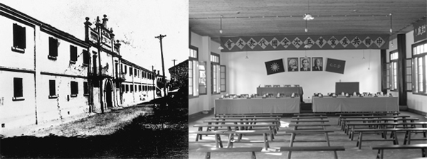

中共五大会址

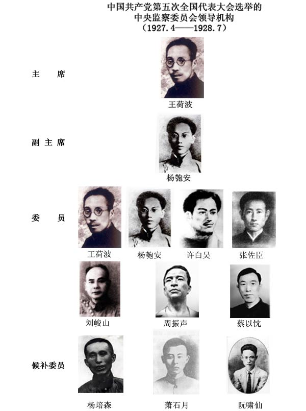

　　**1928年7月，中国共产党第六次全国代表大会通过的《中国共产党章程》，将“监察委员会”改为“审查委员会”。中国共产党第六次全国代表大会选举产生了以刘少奇为书记的中央审查委员会。**

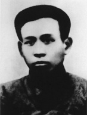

刘少奇任中央审查委员会书记

　　**1933年9月，中共中央作出《关于成立中央党务委员会及中央苏区省县监察委员会的决定》。1934年1月，党的六届五中全会选举产生了以李维汉为书记的中央党务委员会。**

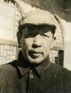

李维汉任中央党务委员会书记

　　**1949年10月，中华人民共和国成立。中央人民政府委员会第三次会议决定成立中央人民政府政务院人民监察委员会。** 

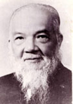

谭平山任人民监察委员会主任

　　**主任** 谭平山

　　**副主任** 刘景范、潘震亚

　　**委员** 张秀岩、张慕尧、朱蕴山、韩兆鹗、董鲁安、张难先、何燏时、宁武、郭任之、安子文、许立群、刘达潮、丘金、帅孟奇（女）、萧明

　　**1949年11月，中共中央作出《关于成立中央及各级党的纪律检查委员会的决定》，成立了由朱德等11人组成的中共中央纪律检查委员会。**

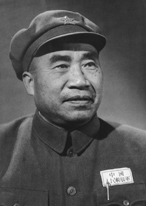

朱德任中央纪律检查委员会书记

　　**书记** 朱德

　　**副书记** 王从吾、安子文、钱瑛（女）（1953—1955.4）、萧华（1952—1955.4）

　　**委员** 刘澜涛、谢觉哉、李葆华、刘景范、李涛、薛暮桥、梁华、冯乃超、吴溉之（1952—1955.4）、徐立清（1952—1955.4）、刘晏春（1954—1955.4）

　　**1954年9月，根据宪法和国务院组织法，政务院改为国务院，政务院人民监察委员会改为国务院监察部。钱瑛（女）任监察部部长。**

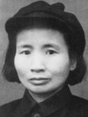

钱瑛（女）任监察部部长

　　**1955年3月，中国共产党全国代表会议通过《关于成立党的中央和地方监察委员会的决议》，决定成立党的中央和地方监察委员会，代替各级党的纪律检查委员会。会议选举产生了由董必武等21人组成的中共中央监察委员会。**

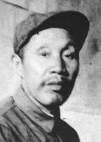

董必武任中央监察委员会书记

　　**书记** 董必武

　　**副书记** 刘澜涛、谭政、王从吾、钱瑛（女）、刘锡五

　　**常委** 王维舟

　　**候补常委** 吴溉之、帅孟奇（女）

　　**委员** 李士英、徐立清、马明方、高克林、高扬、张鼎丞

　　**候补委员** 王维纲、王翰、朱明、李景膺、梁国斌、龚子荣

　　1956年9月，中共八届一中全会重新选举产生了（1956年11月23日中央政治局第三次会议批准）由董必武等21人组成的中共中央监察委员会：

　　**书记** 董必武

　　**副书记** 刘澜涛、萧华、王从吾、钱瑛（女）、刘锡五

　　**常委** 王维舟、帅孟奇（女）、吴溉之

　　**候补常委** 王维纲、李士英

　　**委员** 李楚离、高克林、高扬、马明方、刘格平、张鼎丞

　　**候补委员** 王翰、刘其人、李景膺、龚子荣

　　**1959年4月，因国家管理体制调整，撤销监察部。**

　　**1962年9月，中共八届十中全会通过《关于加强党的监察机关的决定》，扩大了中共中央监察委员会的名额（增至60人），调整了中共中央监察委员会领导成员。**

　　调整后的中共中央监察委员会领导成员为：

　　**书记** 董必武

　　**副书记** 张云逸、萧华、王从吾、钱瑛（女）、刘锡五

　　**常务委员** 王维舟、李运昌、帅孟奇（女）、马国瑞、袁任远、吴溉之

　　**候补委员** 王维纲、伍云甫、杨之华（女）

　　**1969年4月，中国共产党第九次全国代表大会通过的《中国共产党章程》取消了党的监察机关的条款，撤销了中央监察委员会。**

　　**1977年8月，中国共产党第十一次全国代表大会通过的《中国共产党章程》重新恢复了设置党的纪律检查委员会的条款，规定各级纪委由同级党委选举产生。**

　　**1978年12月，中国共产党十一届三中全会选举产生了新的中共中央纪律检查委员会。**

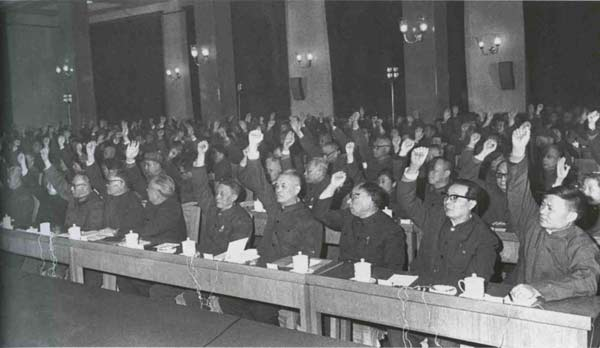

党的十一届三中全会会场

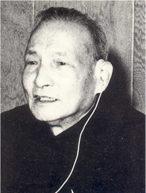

陈云任中共中央政治局常委，中央纪律检查委员会第一书记

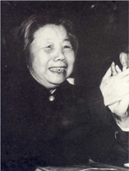

邓颖超（女）任中央纪律检查委员会第二书记

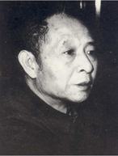

胡耀邦任中央纪律检查委员会第三书记

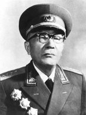

黄克诚任中央纪律检查委员会常务书记

　　中央纪律检查委员会的领导成员为：

　　**第一书记** 陈云

　　**第二书记** 邓颖超（女）

　　**第三书记** 胡耀邦

　　**常务书记** 黄克诚

　　**副书记** 王鹤寿、王从吾、刘顺元、张启龙、袁任远、章蕴（女）、郭述申、马国瑞、李一氓、魏文伯、张策、赵毅敏（1980.2—1982.9）

　　**常务委员** 马辉之、王建安、王维纲、王鹤峰、方志纯、孔祥桢、帅孟奇（女）、吕剑人、刘型、刘建章、刘澜波、李士英、李楚离、张子意、武新宇、周扬、周仲英、唐天际、曹瑛、曹广化、阎秀峰、韩光、傅秋涛、曾涌泉

　　**1982年9月，中国共产党第十二次全国代表大会通过的《中国共产党章程》规定，党的各级纪律检查委员会都由同级党的代表大会选举产生。党的中央纪律检查委员会在党的中央委员会领导下进行工作。党的地方各级纪律检查委员会在同级党的委员会和上级纪律检查委员会的双重领导下进行工作。中国共产党第十二次全国代表大会选举了由陈云等132人组成的中共中央纪律检查委员会。**

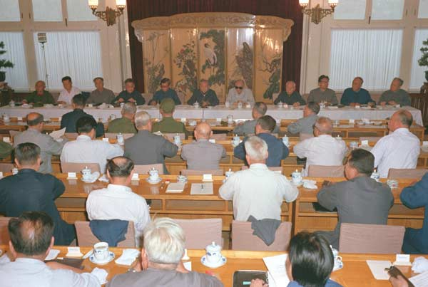

1982年9月13日，中国共产党中央纪律检查委员会第一次全体会议在北京举行。

陈云任中共中央政治局常委，中央纪律检查委员会第一书记

黄克诚任中央纪律检查委员会第二书记

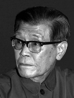

王鹤寿任中央纪律检查委员会常务书记

　　1982年9月13日，经中共中央纪律检査委员会第一次全会选举并经中共十二届一中全会批准，中共中央纪律检查委员会的领导成员为：

　　**第一书记** 陈云

　　**第二书记** 黄克诚

　　**常务书记** 王鹤寿

　　**书记** 王从吾、韩光、李昌（土家族）、马国瑞、韩天石

　　**常务委员** 李之琏、李正亭、蔡顺礼

　　1983年10月，中共中央纪律检查委员会第三次全会增选刘丽英、包玉山为常务委员。

　　1985年9月，十二届四中全会同意31位老同志不再担任中央纪委委员职务的请求，同月召开的党的全国代表会议增选中央纪委委员31名，中央纪委委员仍为132人。增选和调整后中共中央纪律检查委员会的领导成员为：

陈云任中共中央政治局常委，中央纪律检查委员会第一书记

王鹤寿任中央纪律检查委员会第二书记

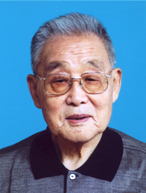

韩光任中央纪律检查委员会常务书记

　　**第一书记** 陈云

　　**第二书记** 王鹤寿

　　**常务书记** 韩光

　　**书记** 强晓初、韩天石、陈作霖

　　**常务委员** 李之琏、李正亭、肖洪达、刘丽英（女）、包玉山、王德瑛、傅杰

　　**1986年12月，第六届全国人民代表大会常务委员会第十八次会议决定设立中华人民共和国监察部。1987年7月，监察部正式挂牌办公。**

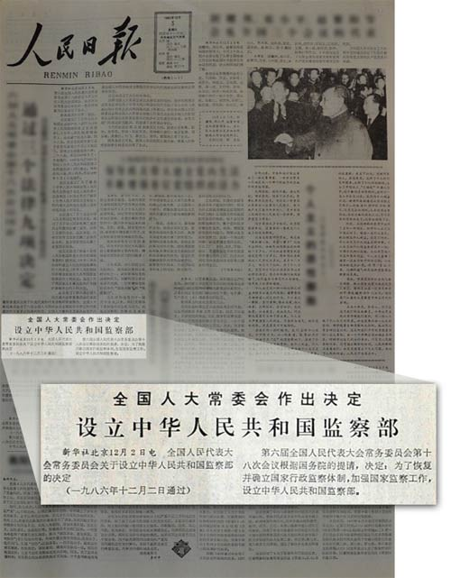

1986年12月3日，《人民日报》刊发设立中华人民共和国监察部的消息。

　　**1987年10月，中国共产党第十三次全国代表大会选举了由乔石等69人组成的中共中央纪律检查委员会。**

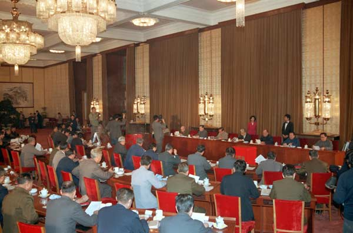

1987年11月2日，中共中央纪律检查委员会第一次全体会议在北京人民大会堂举行。

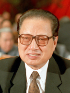

乔石任中共中央政治局常委，中央纪律检查委员会书记

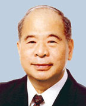

尉健行1987年至1993年任监察部部长

　　1987年11月2日，经中共中央纪律检查委员会第一次全体会议选举并经中共十三届一中全会批准，中共中央纪律检查委员会的领导成员为：

　　**书记** 乔石

　　**副书记** 陈作霖、李正亭、肖洪达

　　**常务委员** 郭林祥、王德瑛、刘丽英（女）、傅杰

　　1989年11月，中共中央纪律检查委员会第五次全会增选曹庆泽、谢勇为常务委员。

　　1990年12月，肖洪达不再担任副书记、常委，中共中央纪律检查委员会第七次全会增选王德瑛为副书记，陈达之为常务委员。

　　监察部领导班子（1987—1993）：

　　**部长** 尉健行

　　**副部长** 刘鸣九、徐青、何勇、冯梯云、李至伦

　　**1992年10月，中国共产党第十四次全国代表大会选举了由尉健行等108人组成的中共中央纪律检査委员会。**

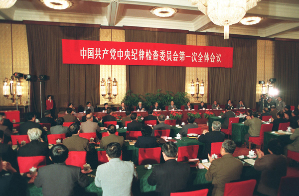

1992年10月19日，中共中央纪律检查委员会举行第一次全体会议。

尉健行任中共中央政治局委员、中央书记处书记，中央纪律检查委员会书记

曹庆泽1993年至1998年任监察部部长

　　1992年10月19日，经中共中央纪律检查委员会第一次全体会议选举并经中共十四届一中全会批准，中共中央纪律检查委员会的领导成员为：

　　**书记** 尉健行

　　**副书记** 侯宗宾、陈作霖、曹庆泽、王德瑛、徐青

　　**常务委员** 王光、刘丽英（女）、安启元、李至伦、何勇、彭钢（女）、傅杰

　　1995年1月，中共中央纪律检查委员会第五次全体会议决定，安启元同志不再担任中央纪委常务委员，补选祁培文同志为中央纪委常务委员。

　　监察部领导班子（1993—1998）：

　　**部长** 曹庆泽

　　**副部长** 何勇、冯梯云、李至伦、左连壁

　　**1993年1月，党中央、国务院决定中央纪律检查委员会与监察部合署办公，实行一套工作机构、两个机关名称，履行党的纪律检查和政府行政监察两项职能。**

　　**1997年9月，中国共产党第十五次全国代表大会选举了由尉健行等115人组成的中共中央纪律检查委员会。**

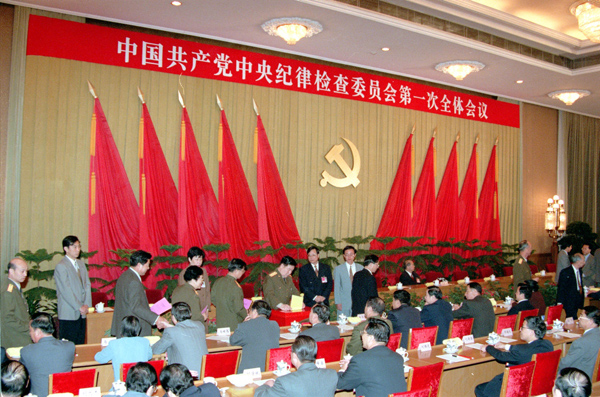

中共十五大选举产生的中央纪律检查委员会，1997年9月19日在北京举行第一次全体会议。

尉健行任中共中央政治局常委，中央纪律检查委员会书记

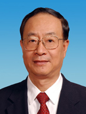

何勇1998年至2003年任监察部部长

　　1997年9月19日，经中共中央纪律检査委员会第一次全体会议选举并经中共十五届一中全会批准，中共中央纪律检査委员会的领导成员为：

　　**书记** 尉健行

　　**副书记** 韩杼滨、曹庆泽、何勇、周子玉、夏赞忠、刘丽英（女）

　　**常务委员**（按姓氏笔画为序）

　　马馼（女)、祁培文、李至伦、李登柱、赵洪祝、袁纯清、彭钢（女）、傅杰

　　2000年1月，中共中央纪律检查委员会第四次全体会议增选刘锡荣同志为中央纪委常务委员会委员、副书记，傅杰同志为中央纪委副书记，吴定富同志为中央纪委常务委员会委员。

　　2002年1月，中共中央纪律检查委员会第七次全体会议补选李至伦同志为中央纪委副书记，张惠新同志为中央纪委常务委员会委员、副书记。

　　监察部领导班子（1998—2003）：

　　**部长** 何勇

　　**副部长** 李至伦、赵洪祝、陈昌智、干以胜、黄树贤、李玉赋

　　**2002年11月，中国共产党第十六次全国代表大会选举了由吴官正等121人组成的中央纪律检查委员会。**

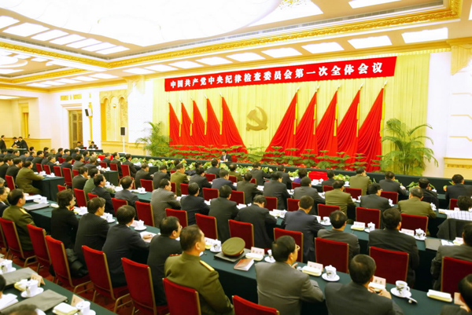

中国共产党第十六次全国代表大会选举产生的中央纪律检查委员会，于2002年11月15日在北京举行第一次全体会议。

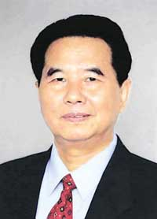

吴官正任中共中央政治局常委，中央纪律检查委员会书记

何勇任中共中央书记处书记、中央纪委副书记

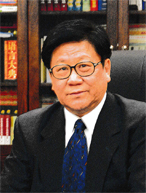

李至伦2003年至2007年任监察部部长

　　2002年11月15日，经中共中央纪律检査委员会第一次会议选举并经中共十六届一中全会批准，中共中央纪律检查委员会的领导成员为：

　　**书记** 吴官正

　　**副书记** 何勇、夏赞忠、李至伦、张树田、刘锡荣、张惠新、刘峰岩

　　**常务委员会委员**（按姓氏笔画为序）

　　干以胜、马馼(女)、马志鹏、王振川、刘峰岩、刘家义、刘锡荣、李至伦、吴官正、吴毓萍(女)、何勇、沈德咏、张树田、张惠新、赵洪祝、夏赞忠、黄树贤、解厚铨

　　2004年1月，中央纪委第三次全会补选马馼同志为中央纪委副书记，吴玉良同志为中央纪委常务委员会委员。

　　2007年1月，中央纪委第七次全会补选干以胜同志为中央纪委副书记。

　　监察部领导班子（2003—2007）：

　　**部长** 李至伦

　　**副部长** 陈昌智、黄树贤、李玉赋、屈万祥

　　**2007年10月，中国共产党第十七次全国代表大会选举了由贺国强等127人组成的中央纪律检查委员会。**

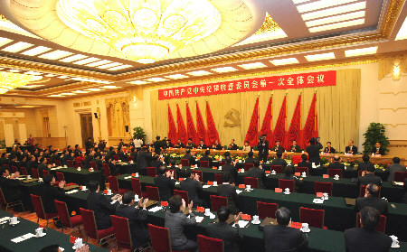

2007年10月22日，中央纪律检查委员会在北京举行第一次全体会议。

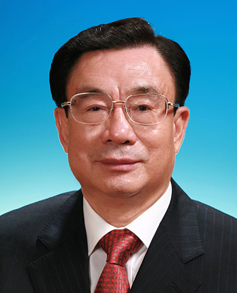

贺国强任中共中央政治局常委，中央纪律检查委员会书记

何勇任中共中央书记处书记、中央纪委副书记

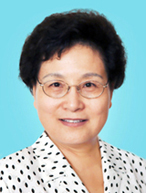

马馼2007年至2013年任监察部部长

　　2007年10月22日，经中共中央纪律检查委员会第一次会议选举并经中共十七届一中全会批准，中共中央纪律检査委员会的领导成员为：

　　**书记** 贺国强

　　**副书记** 何勇、张惠新、马馼（女）、孙忠同、干以胜、张毅、黄树贤、李玉赋

　　**常务委员会委员**（按姓氏笔画为序）

　　干以胜、马馼（女）、王伟、令狐安、孙忠同、杜学芳（女）、李玉赋、吴玉良、吴毓萍（女）、邱学强、何勇、张军、张毅、张纪南、张惠新、屈万祥、贺国强、黄树贤、蔡继华

　　2010年7月，张毅不再担任副书记。

　　2011年1月，中央纪律检查委员会第六次全体会议增选吴玉良同志为中央纪委副书记。

　　2012年11月，中央纪律检查委员会第八次全体会议增选张军同志为中央纪委副书记，陈文清同志为中央纪委常务委员会委员、副书记。

　　监察部领导班子（2007—2013）：

　　**部长** 马馼（女）

　　**副部长** 屈万祥、王伟、姚增科、郝明金

　　**2012年11月，中国共产党第十八次全国代表大会选举产生了130人组成的中央纪律检查委员会。**

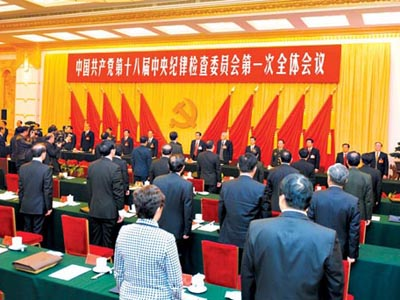

2012年11月15日，中央纪律检查委员会在北京举行第一次全体会议

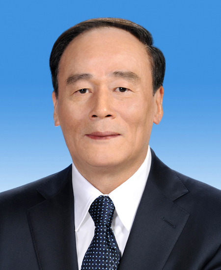

王岐山任中共中央政治局常委，中央纪律检查委员会书记 

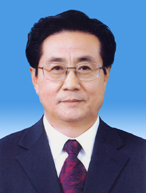

赵洪祝任中共中央书记处书记、中央纪委副书记

　　2012年11月15日，经中共中央纪律检查委员会第一次全体会议选举并经中共十八届一中全会批准，中共中央纪律检查委员会的领导成员为：

　　**书记** 王岐山

　　**副书记** 赵洪祝、黄树贤、李玉赋、杜金才、吴玉良、张军、陈文清、王伟

　　**常务委员会委员**（按姓氏笔画为序）

　　王伟、王岐山、刘滨、江必新、杜金才、李玉赋、吴玉良、邱学强、张军、张纪南、陈文清、周福启、赵洪祝、侯凯、俞贵麟、姚增科、黄树贤、黄晓薇（女）、崔少鹏

　　2013年4月，中央批准王伟同志不再担任中央纪律检查委员会副书记、常委职务。

　　2014年1月，中央纪律检查委员会第三次全体会议增选杨晓渡同志为中央纪律检查委员会常务委员会委员、副书记。

　　2014年10月，中央批准李玉赋同志不再担任中央纪律检查委员会副书记、常委职务。

　　2014年10月，中央纪律检查委员会第四次全体会议选举刘金国同志为中央纪律检查委员会常务委员会委员、副书记。

　　2015年1月，中央批准免去崔少鹏同志的中央纪律检查委员会秘书长职务。

　　2015年4月，中央批准陈文清同志不再担任中央纪律检查委员会副书记、常委职务。

　　2015年7月，中央批准杨晓超同志任中央纪律检查委员会秘书长。

　　2015年11月，中央批准俞贵麟同志不再担任中央纪律检查委员会常委职务。

　　2017年1月，十八届中央纪委第七次全体会议选举李书磊同志为中共中央纪律检查委员会常务委员会委员、副书记。

　　2017年2月，中央批准张军同志不再担任中央纪律检查委员会副书记、常委职务。

　　监察部领导班子（2013.03—2016.11）：

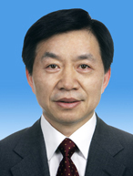

黄树贤2013年起任监察部部长

　　**部长** 黄树贤

　　**副部长** 姚增科、郝明金、黄晓薇（女）、于春生、王令浚、肖培、陈雍

　　2014年10月，国务院决定免去黄晓薇（女）的监察部副部长职务。

　　2015年1月，国务院决定免去姚增科的监察部副部长职务。

　　2015年3月，国务院决定免去于春生的监察部副部长职务。

　　2015年4月，国务院决定任命王令浚、陈雍为监察部副部长。

　　2015年6月，国务院决定任命肖培为监察部副部长。

　　2016年11月，全国人大常委会通过决定免去黄树贤的监察部部长职务。

　　监察部领导班子（2016.12—2017.10）：

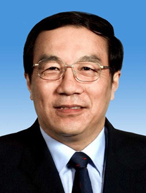

杨晓渡2016年起任监察部部长

　　**部长** 杨晓渡

　　**副部长** 郝明金、王令浚、肖培、陈小江、陈雍、崔鹏、邹加怡、凌激

　　2016年12月，全国人大常委会通过决定任命杨晓渡为监察部部长。

　　2017年1月，国务院决定任命崔鹏为监察部副部长。

　　2017年1月，国务院决定免去郝明金的监察部副部长职务。

　　2017年1月，国务院决定免去陈雍的监察部副部长职务。

　　2017年3月，国务院决定任命邹加怡为监察部副部长。

　　2017年4月，国务院决定任命陈小江为监察部副部长。

　　2017年5月，国务院决定免去王令浚的监察部副部长职务。

　　2017年9月，国务院决定任命凌激为监察部副部长。

　　2017年9月，国务院决定免去肖培的监察部副部长职务。

　　**2017年10月，中国共产党第十九次全国代表大会选举产生了133人组成的中央纪律检查委员会。**

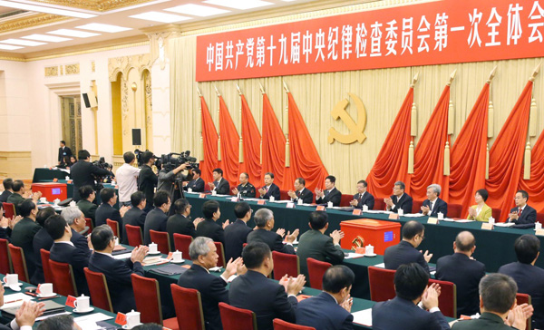

10月25日，中央纪律检查委员会在北京举行第一次全体会议

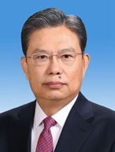

赵乐际任中共中央政治局常委，中央纪律检查委员会书记

杨晓渡任中共中央政治局委员、中央书记处书记，中央纪律检查委员会副书记、监察部部长、国家预防腐败局局长

　　2017年10月25日，经中共中央纪律检查委员会第一次全体会议选举并经党的中央委员会批准，中共中央纪律检查委员会的领导成员为：

　　**书记** 赵乐际

　　**副书记** 杨晓渡 张升民 刘金国 杨晓超 李书磊 徐令义 肖培 陈小江

　　**常务委员会委员**（按姓氏笔画为序）

　　王鸿津 白少康 刘金国 李书磊 杨晓超 杨晓渡 肖培 邹加怡（女） 张升民 张春生 陈小江 陈超英 赵乐际 侯凯 姜信治 骆源 徐令义 凌激 崔鹏

　　2018年5月，中央批准邹加怡同志不再担任中央纪律检查委员会常委职务。 

　　2019年1月13日，十九届中央纪委第三次全体会议选举卢希同志为中央纪律检查委员会常委。 

　　2020年12月，中央批准李书磊、陈小江同志不再担任中央纪律检查委员会副书记、常委职务。 

　　2021年1月24日，十九届中央纪委第五次全体会议选举喻红秋、傅奎同志为中央纪律检查委员会常委、副书记。 

　　2022年7月11日，中央批准：张春生同志不再担任中央纪律检查委员会常委职务。

　　2022年9月26日，中央批准：李欣然同志任中央纪律检查委员会秘书长，免去杨晓超同志中央纪律检查委员会秘书长职务。

　　2022年9月26日，中央批准：白少康同志不再担任中央纪律检查委员会常委职务。

　　2022年9月26日，中央批准：凌激同志不再担任中央纪律检查委员会常委职务。

　　监察部领导班子（2017.10—2018.03）：

　　**部长** 杨晓渡

　　**副部长** 陈小江 崔鹏 邹加怡 凌激

　　2018年3月18日，第十三届全国人民代表大会第一次会议选举杨晓渡为中华人民共和国国家监察委员会主任。

　　2018年3月21日，十三届全国人大常委会第一次会议分别经表决，任命刘金国、杨晓超、李书磊、徐令义、肖培、陈小江为国家监察委员会副主任，任命王鸿津、白少康、邹加怡、张春生、陈超英、侯凯、姜信治、凌激、崔鹏、卢希为国家监察委员会委员。

　　**2018年3月23日，中华人民共和国国家监察委员会在北京揭牌。**

　　中华人民共和国国家监察委员会领导班子（2018.03— ）：

杨晓渡任中共十九届中央政治局委员、中央书记处书记，中央纪律检查委员会副书记，国家监察委员会主任

　　**主任** 杨晓渡 

　　**副主任** 刘金国 杨晓超 李书磊 徐令义 肖培 陈小江 

　　**委员** 王鸿津 白少康 邹加怡（女） 张春生 陈超英 侯凯 姜信治 凌激 崔鹏 卢希（女）

　　2018年6月22日，十三届全国人大常委会第三次会议经表决，免去邹加怡的国家监察委员会委员职务。 

　　2020年12月26日，十三届全国人大常委会第二十四次会议经表决，免去李书磊、陈小江的国家监察委员会副主任职务。 

　　2021年2月28日，第十三届全国人大常委会第二十六次会议通过，任命喻红秋（女）、傅奎为国家监察委员会副主任。

　　2022年7月11日，中央批准：张春生同志不再担任国家监察委员会委员职务。

　　2022年9月2日，第十三届全国人民代表大会常务委员会第三十六次会议通过，免去张春生的国家监察委员会委员职务。

　　2022年9月26日，中央批准：白少康同志不再担任国家监察委员会委员职务。

　　2022年9月26日，中央批准：凌激同志不再担任国家监察委员会委员职务。

　　2022年10月25日，中央决定：提名孙新阳、刘学新、张福海同志为国家监察委员会副主任人选，杨晓超、徐令义同志不再担任国家监察委员会副主任职务；提名王晓萍（女）、王爱文、许罗德、李欣然、赵世勇、訚柏、穆红玉（女）同志为国家监察委员会委员人选，卢希（女）、陈超英、姜信治、崔鹏同志不再担任国家监察委员会委员职务。

　　2022年10月30日，第十三届全国人民代表大会常务委员会第三十七次会议通过，免去杨晓超、徐令义的国家监察委员会副主任职务；任命孙新阳、刘学新、张福海为国家监察委员会副主任；免去卢希（女）、白少康、陈超英、姜信治、凌激、崔鹏的国家监察委员会委员职务；任命王晓萍（女）、王爱文、许罗德、李欣然、赵世勇、訚柏、穆红玉（女）为国家监察委员会委员。

　　**2022年10月，中国共产党第二十次全国代表大会选举产生了133人组成的中央纪律检查委员会。**

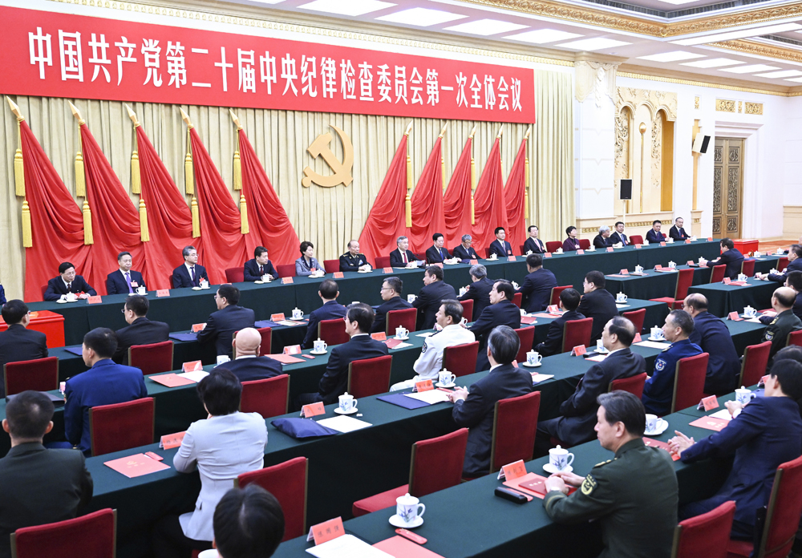

10月23日，中国共产党第二十次全国代表大会选举产生的中央纪律检查委员会在北京举行第一次全体会议

　　2022年10月23日，中国共产党第二十届中央委员会第一次全体会议批准了二十届中央纪律检查委员会第一次全体会议选举产生的书记、副书记和常务委员会委员人选。名单如下：

　　**书 记** 李希

　　**副书记** 刘金国 张升民 肖培 喻红秋（女） 傅奎 孙新阳 刘学新 张福海

　　**常务委员会委员**（按姓氏笔画为序排列）

　　王晓萍（女） 王爱文 王鸿津 刘金国 刘学新 许罗德 孙新阳 李希 李欣然（满族） 肖培 张升民 张福海 陈国强 赵世勇 侯凯 訚柏（纳西族） 喻红秋（女） 傅奎 穆红玉（女）