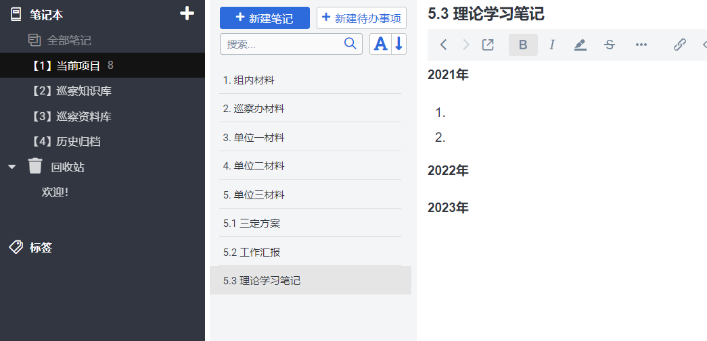

### 巡视巡察

#### 一、概述

中国共产党的巡视巡察工作是党内监督的重要形式之一，旨在加强党的自身建设，纠正和预防党内腐败问题，保持党的先进性和纯洁性。下面是关于中国共产党巡视巡察工作的一些主要内容：

1. **起源和发展**：
   - 巡视巡察工作起源于中国共产党的党风廉政建设和反腐败斗争的需要。自党的成立以来，巡视巡察工作逐步建立和完善，成为党内监督的重要机制。
   - 巡视工作指由中央巡视组对中央和地方党组织进行巡视；巡察工作指由省级、市级党委巡察机构对本地区党组织进行巡察。

2. **工作特点**：
   - 巡视巡察工作具有周期性、针对性、全覆盖性和专业性等特点。
   - 巡视巡察工作注重发现问题、揭示问题、解决问题，对发现的问题要实行严肃问责。
   - 巡视巡察工作注重党内监督与其他监督形式的有机结合，形成多层次、全方位的监督格局。

3. **工作流程**：
   - 巡视巡察工作一般包括准备阶段、实地巡视巡察阶段、整改阶段和总结阶段。
   - 巡视巡察工作的具体流程包括确定巡视巡察对象、制定工作方案、实地巡视巡察、整改落实、向党组织报告等环节。

4. **法律依据**：
   - 中国共产党巡视工作条例、中国共产党巡察工作条例等文件为巡视巡察工作提供了法律依据。
   - 此外，中国共产党纪律检查机关还会根据党章、党内法规等文件对巡视巡察工作进行指导和监督。

总的来说，中国共产党的巡视巡察工作是党内监督的重要形式，对于加强党的自身建设、反腐倡廉、保持党的先进性和纯洁性具有重要意义。通过巡视巡察工作，可以及时发现问题、纠正偏差，推动党的事业不断向前发展。

#### 二、相关法律法规

1、党章

2、党内监督条例

3、巡视工作条例

…

#### 三、相关文章

- [《监察法》中的十六种监察手段](doc/xunshixuncha/xuncha001.md)
- [习近平总书记关于巡视巡察工作的重要论述](doc/xunshixuncha/xuncha0010.md)
- [习近平总书记谈巡视巡察](doc/xunshixuncha/xuncha0011.md)
- [巡察工作流程](doc/xunshixuncha/xuncha0012.md)
- [巡察怎样精准发现问题：三个法宝](doc/xunshixuncha/xuncha0013.md)
- [巡察整改“五步法”](doc/xunshixuncha/xuncha0014.md)
- [巡视个别谈话的策略与技巧](doc/xunshixuncha/xuncha0015.md)
- [巡视巡察报告撰写“六注意”](doc/xunshixuncha/xuncha0016.md)
- [巡视巡察工作应知应会80条](doc/xunshixuncha/xuncha0017.md)
- [巡视巡察工作中“问题”的基本概念](doc/xunshixuncha/xuncha0018.md)
- [巡视巡察工作中如何通过查阅资料精准发现问题](doc/xunshixuncha/xuncha0019.md)
- [干部拒绝提拔是不守政治规矩](doc/xunshixuncha/xuncha002.md)
- [巡视巡察知识早知道](doc/xunshixuncha/xuncha0020.md)
- [巡视组、巡察组、巡查组，督导组、督察组、督查组…究竟有啥区别？](doc/xunshixuncha/xuncha0021.md)
- [中纪委机关盘点高校官僚主义：衙门做派、门户林立、攀附结交](doc/xunshixuncha/xuncha0022.md)
- [中央巡视办解读《关于加强巡视整改和成果运用的意见》](doc/xunshixuncha/xuncha0023.md)
- [关于如何提高巡视巡察工作质量的思考](doc/xunshixuncha/xuncha003.md)
- [关于违规吃喝问题监督执纪要点](doc/xunshixuncha/xuncha004.md)
- [领导干部要懂点财务](doc/xunshixuncha/xuncha005.md)
- [让“躺平式干部”躺不住](doc/xunshixuncha/xuncha006.md)
- [ 如何探索问题底稿在巡察工作中的应用？巡察报告问题底稿包括哪些内容？](doc/xunshixuncha/xuncha007.md)
- [如何提升巡察谈话的效果？](doc/xunshixuncha/xuncha008.md)
- [如何做好新形势下巡视巡察工作？](doc/xunshixuncha/xuncha009.md)

#### 三、文件管理体系

采用树形目录结构，采用**joplin**这个笔记工具来进行文件管理

第一层目录按信息使用的频繁程度（**PARA分类法**）

| 分类       | 内容                                               | 使用频率 |
| ---------- | -------------------------------------------------- | -------- |
| 临时收集筐 | 放在桌面上，临时存放                               | ★★★★★    |
| 当前项目   | 最近正在使用的文件材料                             | ★★★★     |
| 巡察知识库 | 需要频繁查阅的                                     | ★★★      |
| 巡察资料库 | 现在用不到，未来可能用到的资料、文件、工具、软件等 | ★★       |
| 历史归档   | 已不再使用、不再活跃和激活的文件材料               | ★        |

第二层目录按**文件材料的提供者**进行分类

| 文件夹名    | 子文件排序                                                   | 内容 |
| ----------- | ------------------------------------------------------------ | ---- |
| 1.组内材料  | 1.1入驻材料 1.2 组内分工材料 1.3 临时党支部活动材料 …… |      |
| 2.巡办材料  |                                                              |      |
| 3.单位1材料 |                                                              |      |
| 4.单位2材料 |                                                              |      |

示意图如下：

