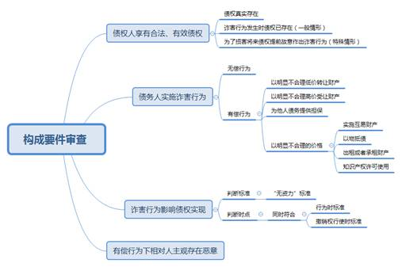

### **债权人撤销权纠纷案件的审理思路和裁判要点**

债权人对债务人不当处分财产、影响债权实现的诈害行为，可以通过行使撤销权的方式予以撤销，使流失的财产回归债务人的责任财产，从而增加债权受偿的可能。作为债的保全制度之一，债权人撤销权制度承担着保护债权人利益、维护交易安全的职责。我国《民法典》在承袭原《合同法》中债权人撤销权制度的基础上，细化了债权人可撤销的情形，但规定仍较为原则，实务中的该类纠纷案件仍存在适法不统一之情形。本文结合司法实践中的典型案例，对债权人撤销权纠纷案件的审理思路和裁判要点进行梳理、提炼和总结。

一、典型案例

**案例一：涉及对尚未发生的债权行使撤销权之认定**

2007年2月，李某及洪某等四人为K公司的借款提供连带保证，借款到期后K公司无力还款。2008年2月，洪某将其持有的T公司股权转让给吴某。同年4月至5月期间，李某代K公司偿还了部分借款，并向法院起诉包括洪某在内的其余三名保证人对上述债务各承担1/4的偿付责任，法院判决支持其诉请。后李某再向法院起诉，请求撤销上述股权转让行为。洪某、吴某共同辩称，李某在偿还部分债务之前，洪某即将股权转让给吴某，此时作为被保全债权的追偿权尚未发生。

**案例二：涉及诈害行为成立之认定**

法院判决陈某向于某偿还600万元本金及逾期利息，但陈某未履行该判决。后于某发现陈某将其所有的23间店面转让给刘某，遂以陈某无偿转让店铺损害其债权为由，向法院提起债权人撤销权诉讼。陈某辩称，刘某已通过银行转账方式支付购房款，并提交转账凭证为证。经调查发现，陈某通过银行转账向案外人汇款710万，案外人于同日将相同金额转至刘某账户，刘某在2日后向陈某支付710万元。

**案例三：涉及相对人主观恶意之认定**

依据生效调解书，康某应支付徐某16万元，但康某一直未付，徐某遂向法院申请强制执行。执行期间，康某将注册资本为600万的某独资公司股权以4万元价格转让给李某。徐某得知后，向法院起诉撤销康某与李某的股权转让行为。徐某认为，上述股权转让价格明显低于市场价，李某主观上存在恶意。

二、债权人撤销权纠纷案件的审理难点

**（一）对尚未发生的债权可否行使撤销权认定难**

债权人撤销权所对应的债权，原则上以在诈害行为发生之前成立为必要。一般认为，在前行为不会影响在后债权的实现。但若该在后债权特定具体，且发生可能性极高，此时债权人对在前行为是否可行使撤销权，实践中存在较大争议。

**（二）“诈害行为”的构成认定难**

诈害行为，是债务人实施的、明显影响债权实现的行为，是债权人行使撤销权的前提。相较原《合同法》及其司法解释，《民法典》第538条、第539条虽然明确了诈害行为的法定形式，但实践中对诈害行为的认定标准仍存争议，主要体现在：一是诈害行为成立的判断标准应当采用“客观行为标准”还是“主观故意标准”；二是诈害行为影响债权实现的判定标准是应当符合“行为时标准”还是“撤销权行使时标准”。

**（三）相对人的主观恶意认定难**

根据诈害行为的类型，《民法典》规定了不同情形下行使撤销权的构成要件。其中，有偿情形下债权人撤销权的行使需以相对人具有主观恶意为构成要件，但相对人主观恶意的判断标准在实践中往往难以把握。例如，有观点认为应直接以“相对人主观上是否具有故意损害债权人的意图，或是否曾与债务人恶意串通”作为判断标准，有观点则认为应当通过举证责任的分配来实现对相对人主观恶意认定标准的客观化。

三、债权人撤销权纠纷案件的审理思路和裁判要点

审理债权人撤销权纠纷案件，核心在于判断债务人与相对人的交易行为是否客观、实质、确切地损害了债权人的利益。具体而言，首先，应审查撤销权的行使是否超过法定期限；其次，需认定债权人是否对债务人享有合法有效的债权；再次，需判断债务人是否实施了足以影响债权人债权实现的诈害行为，在债务人有偿处分其财产权益的情况下，还需根据推定原则认定相对人是否在主观上具有恶意；最后，如认定债务人的诈害行为应当予以撤销的，还应对相应后果进行处理。

****

**（一）债权人撤销权纠纷案件的程序审查要点**

**1****、债权人撤销权纠纷案件的管辖确定**

债权人撤销权纠纷不是当事人因合同权利义务关系而产生的纠纷，而是债权人为保全债权，要求撤销债务人与相对人间形成的法律关系所产生的纠纷。可见此类诉讼的依据源自法律的直接规定，而非合同约定，故不适用合同纠纷管辖等特别类型管辖原则，而应适用一般地域管辖原则，即“原告就被告”。依据《最高人民法院关于适用<中华人民共和国民法典\>合同编通则若干问题的解释》（以下简称《民法典合同编通则司法解释》）第44条，债权人应当以债务人和相对人为共同被告，由债务人或者相对人的住所地人民法院管辖，但是依法应当适用专属管辖规定的除外。依据《民法典合同编通则司法解释》第46条第2款，债权人请求受理撤销权诉讼的法院一并审理其与债务人之间的债权债务关系，经审查属于该法院管辖的，可以合并审理；不属于该法院管辖的，法院应当告知其向有管辖权的法院另行起诉。

**2****、债权人撤销权纠纷案件的行使期限审查**

依据《民法典》第541条，撤销权自债权人知道或应当知道撤销事由之日起一年内行使，自债务人的行为发生之日起五年内没有行使撤销权的，撤销权消灭。该“一年”与“五年”期间同属除斥期间，不适用中止、中断或延长。需要注意的是，债权人撤销权的行使同时受以上两种除斥期间的限制，即使债权人行使撤销权是在知道或应当知道撤销事由的一年之内，但如此时自债务人的处分行为发生之日已届满五年的，撤销权也依法消灭。

**（二）债权人撤销权纠纷案件的实体审查要点**

**1****、债权是否合法有效**

合法有效的债权是债权人撤销权行使的前提和基础。在审查撤销权人的债权是否合法有效时，应注意以下几点：

**（****1****）合法性**

债权的产生需合法，赌债等违法行为产生的债权因其自身得不到法律的保护，故不能行使撤销权。需要注意的是，若债权人在提起撤销权时已通过诉讼或仲裁方式确认债权，并取得对债务人的生效法律文书的，法院可直接依据该法律文书认定债权的真实性。如无确权法律文书，但债权人能提供足以证明与债务人之间存在债权债务关系证据的，亦可认定债权真实合法。债权人未对债务人提起诉讼，或已提起诉讼但尚在审理中，债务人以此为由抗辩债权人不具备提起撤销权诉讼主体资格的，法院对此不予支持。

**（****2****）既存性**

通常，撤销权人合法有效的债权，应当是既存的债权，已经消灭或尚未发生的，不得行使撤销权。需要说明的是，如债务人在处分财产时明知债权发生的可能性极高，且处分行为将影响债权实现的，该未发生债权可纳入撤销权的行使范围。原因在于，债务人具有主观恶意，如不纳入撤销权制度范畴予以制约，则有违撤销权设立之目的。该情形下，应注意以下审查要点：

一是债权发生的可能性应极高，如撤销权人与债务人间存在长期、稳定的合作关系，且已进入合同磋商阶段的；债权虽尚未发生，但撤销权人与债务人间已成立基础法律关系的；撤销权人与债务人间存在可能成立债权债务关系的基础关系。

二是债务人在处分财产时存在主观恶意且处分财产的价格明显不合理。

三是债务人在处分财产时的履行能力明显降低，存在给付不能的现实危险，具体包括：债务人经营状况严重恶化、债务人法定代表人下落不明且无其他人员负责管理财产、债务人被法院列为失信被执行人、债务人在法院有多起诉讼等情形。

如案例一中，虽然洪某的股权转让行为发生在李某偿还担保之债而对其产生追偿权之前，但洪某在明知追偿权即将发生的情况下，仍以不合理低价转移财产以图躲避其他保证人追偿，主观恶意明显。法院遂支持李某撤销洪某向吴某转让股权行为的诉请。

**（****3****）无需届期**

债权履行期届满并非债权人行使撤销权的前置条件，原《合同法》及其司法解释、《民法典》及其司法解释均未有相关要求。

**（****4****）债权种类不限**

可行使撤销权的债权原则上应是以财产给付为目的的债权，既可以是意定之债，也可以是法定之债。故不限于现存的金钱债权，还包括将来可以转化为金钱债权的债权，例如损害赔偿请求权、无法返还原物情形下的折价补偿等。

**2****、是否存在诈害行为**

**（****1****）诈害行为的类型**

根据《民法典》第538条、第539条，可将诈害行为分为以下两种类型：

一是债务人无偿处分财产权益的行为，即债务人实施的处分行为没有对待给付，如债务人放弃债权、放弃债权担保、无偿转让财产，以及恶意延长到期债权的履行期限等。无偿转让的财产既包括动产或不动产等有形财产，也包括股权、债权、知识产权等财产权益。

二是债务人有偿处分财产权益的行为，即债务人的处分行为虽获得了相对人的对待给付，但该对待给付与处分行为明显失衡，如以明显不合理低价转让财产，以明显不合理的高价受让他人财产或为他人债务提供担保，以明显不合理的价格实施互易财产、以物抵债、出租或者承租财产、知识产权许可使用等行为。

**（****2****）诈害行为的审查要点**

司法实务中，在认定债务人的财产处分行为是否属于诈害行为时，应注意以下要点：

第一，“明显不合理价格”的认定。依据《民法典合同编通则司法解释》第42条，对于“明显不合理”的低价或者高价，人民法院应当按照交易当地一般经营者的判断，并参考交易时交易地的市场交易价或者物价部门指导价予以认定。转让价格未达到交易时交易地的市场交易价或者指导价百分之七十的，一般可以认定为“明显不合理的低价”；受让价格高于交易时交易地的市场交易价或者指导价百分之三十的，一般可以认定为“明显不合理的高价”。需要注意的是，债务人与相对人如存在亲属关系、关联关系的，不受前述百分之七十、百分之三十的限制。

此外，由于交易凭证的原始资料等一般保存在交易当事人手中，因此，在考虑交易对价是否属于“明显不合理价格”时，将证明责任分配给债务人和相对人更为公平，也更有利于案件事实的查明。

第二，债务人及相对人应承担已支付对价的举证责任。为了防止债权人发现减少责任财产的行为，有的债务人会与相对人签订协议并约定“合理”对价，隐瞒名为有偿、实为无偿的事实。故即便存在对价约定，亦可能构成无偿转让。此时，应当由债务人及相对人对对价的实际支付情况承担举证责任。

第三，用于证明对价的付款凭证应形成证据链。债务人与相对人如在转让协议中约定了支付方式的，应审查实际付款方式与约定是否一致。具体而言：以银行转账方式支付的，收款人账户应当与债务人账户一致，不一致的，法院应当要求债务人或相对人作出合理解释，不能排除合理怀疑的，应不予认定；通过现金方式支付的，法院应谨慎审查，尤其对于大额现金支付，不能单独以收据、收条、发票等予以认定，还应要求债务人或相对人说明现金的组成、来源等交付细节，并对此进行查证。

如案例二中，单从形式上来看，刘某确实向陈某支付了23间店面的对价，但分析该付款行为前几日陈某与刘某的资金流转后不难发现，陈某向案外人转账和案外人向刘某转账的时间间隔短且金额一致。法院最终认定刘某为虚假支付，陈某的行为构成无偿转让财产。

**3****、****债务人的财产处分行为是否影响债权实现**

不论债权人诉求的是撤销无偿处分行为还是有偿处分行为，其前提是财产处分行为影响债权人债权的实现。具体认定时，需结合债权人的债权情况、债务人的责任财产状况等在个案中作综合判断。

**（****1****）判断标准**

债务人的行为是否影响债权人债权的实现，不以债务人的主观故意为必要，而是以债务人财产状态是否“无资力”作为判定标准，即必须是债务人减少财产的行为，足以影响债权人债权的清偿，债权人才能行使撤销权。

实践中，债权人往往难以证明债务人的资产状况，在提供初步证明材料，如债务人在另案中因无可供执行的财产而被终结本次执行的裁定书、债务人已被列入失信被执行人名单的材料等，证明债权存在无法实现的可能性后，应当由债务人举证证明其有足够的资产担保债权人债权的实现，如举证不能，则可推定这一事实存在。为避免债务人提供伪证，应对该部分证据作实质性审查，必要时可依法向相关部门调查取证，或依职权通知相关证人出庭作证等。

**（****2****）判断时点**

对于诈害行为影响债权人债权实现时点的判断，应同时符合“诈害行为时”标准和“撤销权行使时”标准。

诈害行为时标准，是指债务人必须在实施积极减少责任财产行为时，即已陷入“无资力”，才能构成诈害行为。如果债务人在行为时有足以清偿债务的财产，未对债权造成损害，后续即便因其他财产的变动或财产贬值导致不能清偿债务的，不成立诈害行为。

撤销权行使时标准，是指债权人行使撤销权时诈害状态仍在持续中。这是因为债权人撤销权系债权人保护债权的手段，而非以追回债务人财产为目的。故债务人的经营或者经济状况好转导致其责任财产增加或者升值，足以清偿债权时，即使债务人在进行财产处分行为时存在诈害性，债权人也不得行使撤销权。

**4****、有偿行为下的相对人是否存在主观恶意**

无偿行为下，债权人撤销权的行使不以相对人存在主观恶意为前提，而在有偿行为下，则要求相对人主观上存在恶意。这是因为，在有偿处分行为的情况下，尚不足以仅凭不合理价格进行价值评判。更何况，还存在善意相对人的保护问题。

主观恶意作为心理状态，债权人一般难以证明。司法实践中，一般采取推定原则。以明显不合理的低价转让或不合理高价受让，对相对人而言，显然应当知道这是一个非正常的交易，亦应知道如果债务人不是为了逃避债务一般不会如此不顾自身利益而实施不合理交易行为。相对人明知这种交易会减少债务人的责任财产，仍与债务人进行交易，一般可推定其知道或应当知道该交易会影响债权人的债权实现，进而认定其主观上具有恶意。相对人如提出异议，应对其主观善意承担证明责任，例如相对人举证证明债务人向其提供了诸如有重大投资回报利益、急需资金等合理的正当理由。

案例三中，康某与李某的股权转让行为虽名为有偿转让，但双方约定的股权转让价格明显不合理，在二人无法举证证明4万元转让价格形成依据的前提下，应当认定李某明知康某系以明显不合理的低价转让该股权，推定李某主观上存在恶意，从而对徐某撤销上述股权转让行为的请求予以支持。

需要注意的是，审查时，除了需要考虑债务人与相对人的合同订立时间、交易背景、价格是否合理及履行情况是否真实存在等，还需特别注意债务人与相对人之间的关系，是否足以让相对人了解债务人的债务及偿还能力，如近姻亲关系、合作伙伴关系等。

**（三）债权人撤销权纠纷案件的处理结果**

**1****、债权人撤销权的法律效果**

债权人行使撤销权，应当以其对债务人享有的合法债权为限。债务人诈害行为因此被撤销的，该行为自始没有法律约束力。具体而言，债权人撤销权的成立，将对以下主体产生相应法律效果：

**（****1****）债权人。**债权人撤销权的制度价值在于保全债务人的一般责任财产，故撤销权一旦成立，债权人可请求相对人向债务人承担诈害行为被撤销后的民事责任，即返还财产、折价补偿、履行到期债务等。依据《民法典合同编通则司法解释》第45条第1款，若被撤销行为的标的可分，债权人可主张在受影响的债权范围内撤销债务人的行为；若被撤销行为的标的不可分，债权人可主张将债务人的行为全部撤销。对于行使债权人撤销权后取回的财产或者代替财产的损害赔偿，属于债务人的一般责任财产，债权人不能直接通过撤销权诉讼实现自己的债权，只能作为全体债权人的共同担保，由各债权人依法平等受偿。

**（****2****）债务人。**债务人的诈害行为一旦被撤销，则债务人与相对人之间已成立的法律关系自始没有约束力，责任财产恢复原状。

**（****3****）相对人。**债权人撤销权的成立将对其产生双重效力：一是仅成立债权关系尚未转移物权的，其债权关系因原因行为被撤销而消灭；二是因诈害行为而就相应财产已发生物权转移的，相对人得依债权人之请求，返还其已受领的财产，不能返还的，应折价补偿。

**2****、债权人撤销权的费用负担**

根据《民法典》第540条，债权人行使撤销权的必要费用应由债务人负担，该条款取消了原《合同法解释一》第26条关于相对人有过错时应予适当分担的规定。故依据《民法典》，即使相对人存在过错，相应必要费用也应当由债务人负担。依据《民法典合同编通则司法解释》第45条第2款，此处的必要费用，应包括债权人为行使撤销权而支付的合理的律师代理费、差旅费等费用。

（根据民庭任明艳、詹文沁提供材料整理）