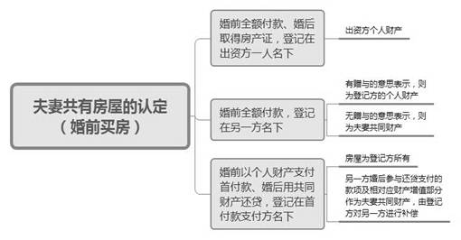
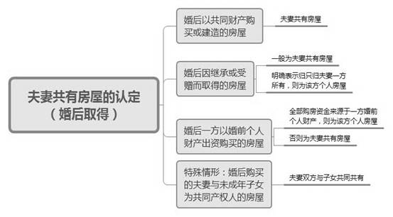
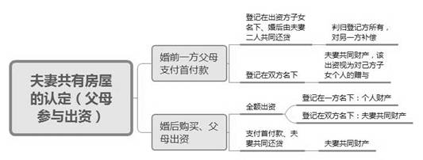
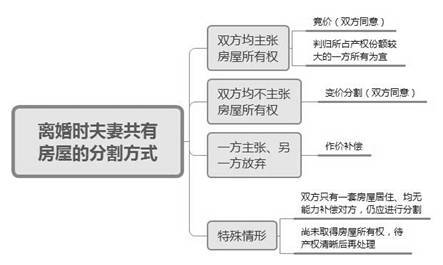

### **离婚案件中夫妻共有房屋分割的审理思路和裁判要点**

夫妻共同财产，是指在婚姻关系存续期间所得、由《民法典》第1062条规定的财产，归夫妻共同所有。在夫妻共同财产中，房产价值和分割利益巨大，对于房屋的共有性质认定及分割问题处理，一直是司法实践中审理离婚纠纷案件突出的难题。由于购房时间、资金来源、还贷情况、产权登记等情形不一，又与夫妻共同财产制交织在一起，基于我国因历史原因形成的多种房屋类型，使得离婚案件中夫妻共有房屋的认定及分割极为复杂。现以典型案例为基础，对离婚案件中夫妻共有房屋分割的审理思路和裁判要点进行梳理、提炼和总结。

一、典型案例

**案例一：涉及夫妻共有房屋的认定**

徐某、瞿某于2011年1月登记结婚。2014年徐某、瞿某购买争议房屋，购买价390万元，首付280万元（首付款资金来源于瞿某婚前房屋的出售款），以瞿某名义申请商业贷款30万元，公积金贷款80万元。2015年8月争议房屋产权登记在瞿某一人名下。2021年2月徐某向一审法院起诉请求判令双方离婚并依法分割争议房屋。法院经审理认定争议房屋虽以瞿某婚前房屋出售款支付首付，但取得在徐某、瞿某夫妻关系存续期间，且以夫妻共同财产进行还贷，故虽登记在瞿某一人名下，但仍应认定为夫妻共同财产。

**案例二：涉及共有房屋分割方式的确定**

吴某、王某夫妻二人于2013年购买争议房屋，并登记为两人共同共有。2020年7月吴某向一审法院起诉请求判令双方当事人离婚并依法分割争议房屋。一审法院判令吴某、王某在一定的期限内变卖或者拍卖系争房屋，变卖、拍卖后取得的价款由吴某、王某对半分配。二审法院认为一审法院在未征求双方当事人意愿的情况下，即判令将房屋拍卖、变卖，再分割价款，实属不妥。二审审理中，双方当事人均表示同意共同出售房屋后对半分割售房款，故对此合意二审法院依法予以确认，并予以改判。

**案例三：涉及共有房屋分割比例的确定**

文某、戚某于2012年1月30日登记结婚。2012年2月7日，文某、戚某共同购买争议房屋，其中首付款70万元中文某的母亲出资50万元，戚某的母亲出资20万元，以戚某的名义向银行贷款35万元，婚后夫妻共同还贷本金7.8万元。房屋交付后文某的母亲为装修房屋出资10万元。2013年2月戚某向一审法院起诉请求判令双方当事人离婚并依法分割争议房屋。一审法院判令夫妻二人平均分割争议房屋，二审法院认为应充分考虑文某母亲的出资贡献，对文某予以适当多分。

二、离婚案件中夫妻共有房屋分割的审理难点

**（一）房屋认定夫妻共有性质难**

对于争议房屋是否为夫妻共有房屋认定的一般原则是，非婚状态下购买的房屋一般为个人财产，婚内购买的房屋为夫妻共同财产。然而实践中由于购房时间、购房方式、资金来源、婚姻状况、房屋性质用途等因素的不同，仅有的对于夫妻共同财产认定的概括性规定和处理方法，不足以应对审判实践中多种夫妻共有房屋情形的认定及分割，在离婚案件中对于夫妻共有房屋的认定仍存在诸多争议。

**（二）夫妻共有房屋的分割方式确定难**

《最高人民法院关于适用<中华人民共和国民法典\>婚姻家庭编的解释（一）》第76条规定了竞价、变价分割、作价补偿等共有房屋的分割方式，但规定较为简单笼统，只是对分割方式进行粗略定义，实务中缺乏系统规范的指导，适用的随意性较大。而近年来，由于房价波动较大，各地又出台各种房屋限购限贷政策，导致离婚后再行购房的难度不断加大，离婚案件中夫妻双方均主张房屋所有权的情形愈发普遍且意愿强烈。这就需要法院在分割共有房屋时全面考虑各方面因素，准确适用分割方式。

**（三）夫妻共有房屋的分割比例举证难**

夫妻共有房屋作为夫妻共同财产的一种，在分割时应遵循夫妻共有财产分割的基本原则，以平均分割为基础，结合照顾妇女、未成年子女和无过错方原则及出资贡献、是否存在少分、不分的情形等因素对分割比例进行确定。然而实务中由于家庭成员关系的复杂性、家庭生活的隐蔽性、夫妻某一方处于弱势地位等因素，主张多分财产的一方（如无过错方、出资较多方），在举证时存在取证方式难及证明标准难的困境。

三、离婚案件中夫妻共有房屋分割的审理思路和裁判要点

审理离婚案件需要处理争议房屋时，首先应确定争议房屋的性质，判断是否属于夫妻共同共有。在确定为夫妻共同共有后，应确定夫妻共有房屋的分割方式和具体分割比例。审理中应始终贯彻家事审判的理念，坚持照顾妇女、未成年子女和无过错方的原则，充分考虑当事人的人格利益、安全利益和情感利益，更加注重实质公平正义和对弱势群体的差异性保护。

**（一）离婚时夫妻共有房屋的认定**

夫妻双方在婚姻关系存续期间，一方或双方因出资、买卖、继承、受赠等原因而获得的房屋，除双方另有约定或法律另有规定外，应认定为夫妻共有房屋。离婚案件中处理争议房屋时首先应确定该房屋是否属于夫妻共同共有。

**1****、婚前买房**

（1）夫妻一方婚前全款买房或还清所有贷款、婚后才取得房产证，房屋登记在出资方一人名下的，应认定为出资方的个人财产。

（2）夫妻一方婚前全款买房、房屋登记在另一方名下，双方对房屋归属有争议时，应结合购房时间和结婚时间、房屋的价值、婚姻存续时间、全款出资购买房屋一方的经济能力等案件事实判断购买房屋是否有赠与的意思表示。如果根据在案证据能够证明全款出资购买房屋一方有赠与另一方的意思表示，则为登记方的夫妻一方个人财产；如果出资方无赠与的意思表示，则为夫妻共同财产。

（3）夫妻一方婚前签订房屋买卖合同，以个人财产支付首付款、婚后用夫妻共同财产还贷，房屋登记在首付款支付方名下的，可以认定房屋为登记方所有，剩余贷款为其个人债务，但是另一方婚后参与还贷支付的款项及其相对应财产增值部分应作为夫妻共同财产，由登记方对另一方进行补偿，该财产增值部分以房屋现价值相对于夫妻结婚时点的增值为计算基础。在该种情形下，如果非产权登记方有证据证明自己婚前即以个人财产参与首付款出资，则产权登记方就非登记一方的首付出资、婚后共同还贷款项及二者对应的财产增值部分均应进行补偿，其中，非产权登记一方婚前出资对应的增值部分以房屋现价值相对于购房时点的增值为计算基数。

**2****、婚后取得的房屋**

在对夫妻婚后取得的房屋性质进行认定时，首先要适用法定的夫妻婚后所得共同制原则，即婚姻关系存续期间夫或妻一方或双方所得的财产均属于夫妻共同财产；其次再依照例外情形来认定是否为夫或妻一方所有。

**（****1****）婚后以共同财产购买或建造的房屋**

争议房屋购买或建造资金来源是夫妻婚姻关系存续期间共同所有的财产，并且也是在婚后取得房屋权属证书，应当认定为夫妻共有房屋。对于此类房屋，即便房屋产权证书仅登记在夫或妻一方名下，也不改变该房屋属于双方共有的性质，仍然属于双方共同共有的房屋。如果作为夫妻一方婚前财产的房屋，此种类型多为宅基地房屋，婚后用共同财产进行重建、改建、扩建，新的房屋亦应当归夫妻共同所有。

**（****2****）婚后因继承或受赠而取得的房屋**

婚姻关系存续期间夫妻一方或双方因继承或受赠而取得的房屋，是否认定为夫妻共有房屋，应根据不同情况加以确定：赠与人明确赠与给夫妻双方的房屋，应当认定为夫妻共有房屋；对于婚后由夫妻一方继承或受赠而取得的房屋，如果被继承人或赠与人明确表示只归夫妻一方所有，则应认定为该方的个人房屋；如果被继承人或赠与人未作明确表示，则应认定为夫妻共有房屋。

**（****3****）婚后一方以婚前个人财产出资购买的房屋**

婚后购买的房屋登记在一方名下，登记方主张为其个人财产的，应当举证证明购买房屋资金全部来源于其婚前个人财产，否则应认定该房屋为婚姻关系存续期间取得的夫妻共同财产，在离婚时需对其进行分割。

如案例一中，争议房屋为双方当事人婚后购买，登记在瞿某一人名下，首付款来源于瞿某婚前房屋的出售款，但是购买争议房屋的资金并非全部来源于瞿某的婚前个人财产，瞿某婚前房屋存在婚后共同还贷且争议房屋也存在婚后共同还贷的情形，因此争议房屋应认定为夫妻共同财产。

**（****4****）婚后购买的夫妻与未成年子女为共同产权人的房屋**

夫妻双方婚后共同出资购买的房屋，无论登记为夫妻双方及未成年子女名下、还是夫妻一方及未成年子女名下，均宜认定为夫妻双方与子女共同所有，在产权登记中未约定按份共有的，应认定为共同共有。

**3****、父母参与出资买房**

首先，离婚案件中夫妻一方或双方父母对争议房屋存在出资和参与共同还贷的，人民法院不得以该房屋涉及夫妻一方父母的权利而不予处理。

（1）对于婚前一方父母支付首付款的房屋，如果登记在出资方子女名下、婚后由夫妻二人共同还贷，一般将房屋判归登记方所有，并由其继续支付剩余贷款，婚后共同还贷（包括本金和利息）及增值部分由获得房屋的一方对另一方作出补偿。如果婚前登记在夫妻双方名下，应认定为夫妻共同财产，父母出资应视为对己方子女的赠与。

（2）对于婚后由一方父母出资购买的房屋，如果父母全额出资，登记在己方子女名下作为己方子女的个人财产，登记在双方名下则为夫妻共同财产；如果一方父母支付首付款，夫妻共同还贷，无论登记在己方子女名下还是夫妻双方名下，均应认定为夫妻共同财产，在没有充分证据证明存在借款合意的情况下，父母的出资应认定为对双方的赠与。

**4****、特殊房屋类型的性质认定**

**（****1****）动迁安置房的认定**

动迁安置房，是指政府因土地开发、城市规划等需要进行动迁，安置给被动迁人居住使用的房屋。被动迁人基于动迁补偿协议可获取安置房或者补偿款。涉及动迁安置房的情形较为复杂，本文仅讨论所有权房屋进行动迁安置的情形，具体包括：

房屋系婚前一方的个人财产，婚后双方对房屋没有扩建或添附行为，动迁时也没有补偿差价，登记在一方名下的就是一方婚前个人财产，此种情况下获得的动迁安置房是该方婚前个人财产的转化，仍属于一方的个人财产。

房屋系婚前一方的个人财产，婚后双方对房屋进行过扩建或添附的，应分具体情况处理：该动迁房屋扩建之前面积转换安置的面积或价款，归房屋所有人个人所有；而扩建或添附的面积或价款属于夫妻共同财产，认定为夫妻双方共同共有。

房屋系婚前一方的个人财产，婚后双方对房屋没有扩建或添附行为，但取得的动迁安置房有补差价的情况，此时要根据补差价的钱款来源分情况判断：如果差价是用一方个人婚前财产补足，且能够提供相应证据证明的，则该房屋仍为该方的个人财产；如果差价是用夫妻共同财产补足的，此时房屋仍属于一方个人所有，但是所补差价的数额部分及相对应的财产增值部分，应由产权登记一方对另一方进行适当补偿。

**（****2****）经济适用房的认定**

经济适用房在离婚分割时应当注意审查购房资格的取得时间与房屋购买的时间来进行综合考量。具体情形有：

一方婚前取得购房资格，并在婚前购置房屋的，应认定为一方婚前个人财产，离婚时不能作为夫妻共同财产进行分割。

一方虽然在婚前取得购房资格，但在婚后购买房屋的，认定为一方的个人财产。若另一方确有出资，并主张返还出资及资金占有期间的利息，可予支持。

双方婚后取得购房资格，并共同出资购置的，即使房屋登记在一方名下，仍属于夫妻共同财产。

**（****3****）公有租赁房屋的认定**

公有租赁房屋当事人只享有使用权或者承租权而没有所有权，该类房屋是特定历史条件下的产物。夫妻一方婚前承租或其父母承租、婚后用夫妻共同财产购买为产权，房屋登记在该方名下的，应认定为夫妻共同共有。在离婚分割该房屋时，应考虑房屋的来源因素，认定双方的贡献大小予以酌情分割。

**（二）离婚时夫妻共有房屋的分割原则及方式**

离婚案件中的争议房屋被认定为夫妻共同财产后，应在离婚时予以分割。具体分割原则及分割方式如下：

**1****、夫妻共有房屋的分割原则**

我国现行法律法规和司法解释未对夫妻共有房屋的分割设立专门的具体原则，然而房屋作为夫妻共同财产的一种，应当遵循和适用分割夫妻共同财产的一般原则，主要包括：

（1）协议优先原则。在分割夫妻共有房屋时，房产登记或协议约定各方份额的，应按照约定的份额予以分割，无约定的从法定，但需要注意当事人处分夫妻共有房屋不得损害国家、集体和第三人的利益。

（2）照顾妇女、未成年子女和无过错方原则。在分割夫妻共有房屋时应对女方、直接抚养子女的一方或无过错方予以适当倾斜保护，具体倾斜程度可根据双方的经济能力、房屋价值、过错程度等综合确定。

（3）侵害共同财产的惩罚原则。夫妻一方隐藏、转移、变卖、毁损、挥霍夫妻共同财产，或者伪造夫妻共同债务企图侵占另一方财产的，在离婚分割夫妻共同财产时，对该方可以少分或者不分。离婚后，另一方发现有上述行为的，可以向人民法院提起诉讼，请求再次分割夫妻共同财产。

（4）有利生产、方便生活原则。对于经营性用房，原则上应当判归有经营能力的一方所有；对于学区房，以判归抚养孩子的一方所有为宜。

**2****、离婚时夫妻共有房屋的分割方式**

离婚案件中夫妻双方对共有房屋的价值及归属无法达成协议时，应按照以下情形分别处理：

（1）夫妻双方均主张房屋所有权的，可采取竞价取得的方式，由出价高者取得房屋所有权，支付另一方房屋折价款。该种分割方式应以双方同意且不存在一方有应当照顾的其他情形为前提。在不存在特殊情形、由法院判决房屋产权归属时，一般应将房屋产权判归所占产权份额较大的一方所有为宜。

（2）夫妻双方均不主张房屋所有权的，可采取变价分割的方式，将房屋处分变现，双方再对变现取得的价款进行分割。变现可由当事人协商自行出售变现，也可申请由法院判定拍卖变现，但均应当征得双方当事人同意。

如案例二中，一审法院在未征求双方当事人意愿的情况下，即判令将房屋拍卖、变卖，再分割价款，违反了法律规定，是不妥当的。二审法院在审理中征求了双方当事人的意见，在双方均同意共同出售房屋后对半分割售房款的情况下，对分割方式予以改判。

（3）夫妻一方主张房屋所有权、另一方表示放弃的，则由该方取得房屋所有权，对另一方进行作价补偿。房屋价值的确定，可由共有人协商确定，也可由评估机构作出估价，或参考相似房屋的市场价格。

需要注意的是，夫妻双方只有一套性质为夫妻共同财产的房屋居住，又均无能力补偿对方的情况下，一般不宜判决当事人离婚后对夫妻共有的房屋产权按份共有，对共有房屋仍应进行分割。此外，离婚时双方对尚未取得所有权或者尚未取得完全所有权的房屋有争议且协商不成的，不宜判决房屋所有权的归属，应当告知当事人待产权清晰后再处理。

**（三）具体分割比例的确定**

在确定夫妻共有房屋的具体分割比例时，以对半分割为基本原则，再结合各方对共有房屋的贡献大小、是否存在过错、房屋价值、婚姻存续时间等因素进行综合判定。

首先，应重点审查各方对共有房屋的贡献。在上文所述的争议房屋应认定为夫妻共有房屋的情形中，无论是夫妻一方个人用婚前个人财产支付首付款还是一方父母支付首付款，甚至是支付大部分房款，都应当视为该方对共有房屋作出的贡献。在分割共有房屋时对出资因素进行考量，具体结合首付款占总房款的比例、婚后共同还贷的金额、婚姻关系存续的时间等因素判定对出资贡献大的一方的倾斜程度。

如案例三中，夫妻二人婚后购买房屋，文某母亲支付了首付款70万元中的50万元，截止起诉离婚时夫妻二人共同还贷仅7.8万元，双方婚姻关系存续时间也较短，一审判令夫妻二人平均分割争议房屋，分割比例显失公平，未充分考虑到文某母亲的出资贡献，应根据出资贡献大小对文某予以适当多分。

对于夫妻双方或一方与未成年子女共有的房屋，可在离婚案件中一并处理。可结合夫妻双方居住情况、抚养子女情况等确定房屋归属，由取得房屋产权的一方向另一方支付折价款。若夫妻双方对未成年子女应得的份额无法协商一致的，因房屋购买及还贷过程中未成年子女均未出资，宜在均等分割的基础上酌情适当降低未成年子女的份额。

其次，应审查是否存在少分的情形，主要存在以下两种情形：

（1）夫妻一方存在过错行为，主要包括重婚、与他人同居、实施家庭暴力、虐待或遗弃家庭成员或其他有重大过错的行为。离婚案件中比较常见的是一方主张另一方存在与他人同居和实施家庭暴力行为。与他人同居是指有配偶者与婚外异性持续、稳定地共同居住，较为常见的证据包括照片、视频或者一方承认存在婚外情的录音、承诺书等；家庭暴力是指行为人以殴打、捆绑、残害、强制限制人身自由或者其他手段给其他家庭成员的身体、精神等方面造成一定的伤害后果的行为，较为常见的证据有接报警记录、验伤单、就诊记录、伤残鉴定书等。实践中用于证明一方存在过错的证据各式各样，法官应结合案件事实、证据的证明力度等判断是否存在过错行为。如果判定一方存在过错行为，在分割夫妻共有房屋时应对过错方予以少分。

（2）夫妻一方存在恶意隐匿、转移夫妻共同财产的行为，在分割夫妻共有房屋时应当予以少分。该类行为的构成要件有：一是具有隐藏、转移等行为的故意；二是具有隐藏、转移、变卖、毁损夫妻共同财产或伪造债务企图侵占另一方财产的行为。其中，隐匿财产以配偶不知悉为必要条件；转移财产不以配偶不知悉为必要条件，行为人具有不使该财产作为夫妻共同财产进行分割的故意；赠与是夫妻一方将夫妻共同财产赠与他人，使得该财产在离婚时不被作为夫妻共同财产进行分割；伪造债务的行为发生在婚姻关系存续期间，通常通过伪造书面债务凭证的形式。

四、其他需要说明的问题

本文主要对于实践中具有普遍性和争议性的情形进行详细论述，对于例如婚前一方全款买房且登记在双方名下、夫妻为规避房产限购政策而离婚购买房屋的性质认定等少数特殊情形未进行论述。对于夫妻一方存在恶意隐匿、转移夫妻共同财产的行为，在本院刊发的另一篇类案《离婚后财产纠纷案件的审理思路和裁判要点》中有详细论述，本文不再赘述。

（根据少年家事庭黄蓓、孙路路提供材料整理）