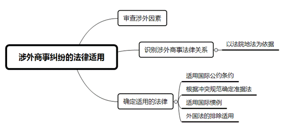
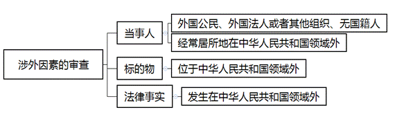
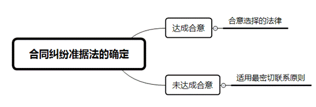
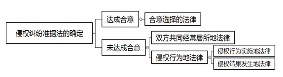

### **涉外商事纠纷法律适用的审理思路和裁判要点**

法律适用是任何案件审理过程中、在查明事实之后必须触及的法律层面问题，选择正确的法律以及正确地适用法律，是查明、认定事实之后定分止争的关键环节，也是裁判获得权威性的基本保证。涉外商事纠纷因涉及冲突法规范的审查，故较之于一般国内商事纠纷而言，涉外商事纠纷的法律适用更加复杂。为依法正确适用法律以确定当事人之间的实体权利义务关系，促进涉外商事纠纷的公正解决，保障当事人权利义务的实现，本文结合司法实践中的典型案例，分析法律规范和司法实践中的审理难点，对涉外商事纠纷法律适用的审理思路和裁判要点进行梳理、提炼和总结。

一、典型案例

**案例一：涉外因素的认定**

A、B公司均系注册在上海自贸区的外商独资企业，A公司作为业主方、B公司作为承包方，签订了《货物供应合同》，合同约定：合同争议须提交新加坡国际仲裁中心进行仲裁解决；实体争议应适用中华人民共和国法律。为履行《货物供应合同》，B公司从境外购买了合同项下的设备，并在A公司的大厦工地履行了交货义务。双方当事人在合同履行中发生争议，A公司遂依据《货物供应合同》中的仲裁条款向新加坡国际仲裁中心申请仲裁，随后又向中国法院申请承认和执行该仲裁裁决。B公司以本案不具有涉外因素、新加坡国际仲裁中心无权受理为由，对仲裁管辖权提出异议。

**案例二：涉外商事法律关系性质的识别**

C公司在无钢材的情况下，向D公司谎称“货物已在装运港备妥待运”，“在我方银行收到信用证二周内交货”，促使D公司与其签订买卖合同。此后C公司收到了D公司指示中国银行上海分行开出的信用证，并在货物没有装船的情况下，向D公司提交了包括提单在内的全套伪造单据，收取了D公司的巨额货款。后双方发生争议，D公司向法院提起诉讼，双方就案涉争议的法律关系性质产生分歧，C公司认为如该案为合同纠纷，则适用最密切联系原则来确定准据法，对其更为有利，故主张该案为合同纠纷，而D公司认为如该案为侵权责任纠纷，则应适用侵权行为地法律，对其更为有利，故主张该案系侵权责任纠纷。

**案例三：同案中涉及多个涉外商事法律关系的法律适用**

甲为中国公民，乙系美国公民及一家美国公司的大股东。双方签订了《出资合同》并约定，由甲出资400万美元购买乙所持有美国公司的股份，甲的出资款到位后，乙需将甲登记为该美国公司的股东。《出资合同》中还约定，双方如就合同履行发生争议，适用中国法。甲出资后主张其并未取得该美国公司的股权，也没有获得美国公司的股东身份，并据此以乙违约为由，起诉要求乙返还其出资款并赔偿利息。乙则抗辩称，本案涉及两个法律关系，第一，关于美国公司的股东身份认定，其已经依照美国特拉华州法律将甲登记为该美国公司的合法股东；第二，关于合同履行过程中是否存在违约情形，其已经依照中国法律按约履行了合同义务，不存在违约情形，故不同意返还出资款。

**案例四：最密切联系原则的判断**

E公司与F公司签订了一份买卖合同，双方当事人在合同履行中发生争议。E公司主张，当事人双方都是香港公司并在香港签订了案涉买卖合同，合同价金以港币计价和支付，中国内地仅作为该合同的履行地，故香港与合同的联系最密切。F公司则主张判断联系的密切程度不能仅考虑联系因素的数量，该案中双方的履行行为主要发生在中国内地，因此中国内地与合同的联系最为密切。

二、涉外商事纠纷法律适用的审理难点

**（一）涉外因素的认定难**

涉外因素，是指当事人一方或双方为外国公民、外国法人或者其他组织、无国籍人，或者当事人一方或双方的经常居所地在中华人民共和国领域外，或者标的物在中华人民共和国领域外，或者产生、变更、消灭民事关系的法律事实发生在中华人民共和国领域外，以及可以认定为涉外民事关系的其他情形。然而实务中，如案例一注册地在上海自贸试验区的外商独资企业，虽然是中国法人，但其由外商投资，与境外投资者关联密切，其在履行合同的过程中，合同标的物的流转往往需要从境外运至自贸试验区内进行保税监管，并适时办理清关完税手续，这一流转过程也具有一定的国际货物买卖特征。因此，这些情形中蕴含的隐性涉外因素给涉外民事法律关系的认定带来一定难度。

**（二）涉外商事法律关系定性难**

识别法律关系的性质，就是把需要判断的法律事实归类到一定的法律概念之下。涉外商事案件的审理中，有时会遇到中国法与外国法对某些法律事实有不同的理解或定性，甚至中国法中缺少与之相对应的某些法律概念，如英美法上的寄售制度。由于中国法与有关外国法对同一法律事实可能做出不同的分类，采用不同国家的法律观念进行识别就会导致适用不同冲突规范和不同准据法的结果，应当根据何种法律概念对有关法律事实进行归类，这就给法律关系的定性带来一定困难。

**（三）同案中多个涉外商事法律关系的法律适用难**

在一个涉外案件审理中可能会涉及两个以上的法律关系，此时需要在梳理其中所包含的多种法律关系的基础上，进而分别确定不同法律关系各自的准据法。在实务中比较常见的情况是，一个合同纠纷案件中，同时还会涉及到自然人或者法人的主体资格的认定。此时适用认定自然人或法人主体资格的准据法，与适用合同的准据法，可能会存在不一致的情况，这也给法律适用带来一些困难。

**（四）最密切联系原则的判断难**

在一般的涉外合同纠纷中，当事人可以协议选择合同适用的法律，当事人没有选择的，应适用与该合同有最密切联系的法律。一般情况下，合同的履行过程是一方当事人支付货币，另一方当事人履行一定的行为，相较之下，支付货币的行为不具有特征性，所以履行行为的当事人经常居所地就是合同的最密切联系地。然而，在上述一般规则下，也不排除需要根据双方争议的具体内容来判断另一个地点具有更密切的关系，这就给最密切联系原则的理解与适用带来一定困难。

三、涉外商事纠纷法律适用的审理思路和裁判要点

通常情况下，可以通过“三步走”的方法来理清涉外商事纠纷法律适用的审理思路：第一步审查涉外因素，第二步识别涉外商事法律关系，第三步确定适用的法律。

**（一）涉外因素的审查**

涉外因素的审查，除了审查法律关系的主体，还应注意对法律关系客体和法律事实的审查。例如，当标的物位于国外、合同在国外签订或履行、侵权行为发生在国外时，均可以认定为涉外民事法律关系。对于可以认定为涉外民事法律关系的其他情形，还可以从合同主体的性质、与境外投资者的关系、标的物流转的特征等来综合判断涉外因素。

如案例一中，尽管A公司与B公司均为在中国注册的公司法人，合同约定的交货地、作为合同标的物的设备目前所在地也均在中国境内，但是A公司与B公司注册地均在上海自贸试验区区域内，且其性质均为中国法人（外商独资企业），与境外投资者关联密切，而且本案合同的履行特征具有涉外因素，案涉设备系先从中国境外运至自贸试验区内进行保税监管，再根据合同履行需要适时办理清关完税手续、从区内流转到区外，至此货物进口手续方才完成，故合同标的物的流转过程也具有一定的国际货物买卖特征。据此，可以认定该案具有涉外因素。

**（二）识别涉外商事法律关系的性质**

**1****、****识别的一般规则**

《中华人民共和国涉外民事关系法律适用法》（以下简称“《法律适用法》”）第8条规定，涉外民事关系的定性，适用法院地法律。这意味着我国国际私法在立法上采纳了法院地法说。因此，法官在识别涉外商事法律关系的性质时，必须要立足于我国的法律。

**2****、****识别应尊重当事人的请求权基础**

实践中，法官在法律适用过程中，究竟采取何种法律依据来识别，必须结合个案来处理，但无论采取何种标准，若当事人对此有异议时，法官需说明理由，并论证其合理性。

如案例二中，我国法院依据我国的法律观念进行识别，同时充分考虑D公司的选择权利，即在合同行为和侵权行为竞合的情况下，审查D公司提起侵权之诉还是合同之诉从而决定案件的性质。从该案的事实来看，C公司自始至终使用欺骗手段，利用合同形式达到欺骗钱财的目的，根本就没有打算履行合同，而且D公司提起的也是侵权损害赔偿之诉。因此，法院将其识别为侵权责任纠纷。

**3****、****法院地法缺失情况下的识别**

如果外国实体法中的某项法律制度在我国实体法中不存在与之相对应的制度，则我国法律中不存在相应的冲突规范。在处理此类问题时，法官需要在我国法律中找到与之相比最接近的法律制度，从而适用对应的冲突规范，或是找到与之相关的国际惯例来进行识别。例如，英国法上的寄售制度，即寄售人将货物运往国外，委托当地代理商按照双方议定的条件代为销售的贸易方式。寄售并非出售，在代销商未将商品售出前，商品的所有权和各种风险仍属于寄售人，代销商的主要权利是收取佣金。中国法中没有关于寄售的法律规定，因此，需要结合寄售的特征，将其识别为中国法中与之最接近的法律制度，比如代理制度，从而确定准据法。

**（三）法律适用的一般原则**

法官一般应在庭前初步判断案件的准据法，如果当事人事先未约定的，应及时征询当事人意见。准据法的确定应尽量在庭审前完成。

**1****、****适用国际公约、条约的规定**

如果涉案争议属于我国缔结或者参加的国际条约适用范围的，应首先考虑适用国际条约的规定，除非当事人依该条约的规定排除其适用。

**（****1****）《联合国国际货物销售合同公约》（《销售合同公约》）**

根据《全国法院涉外商事海事审判工作座谈会会议纪要》第19条规定，营业地位于《销售合同公约》不同缔约国的当事人缔结的国际货物销售合同应当自动适用该公约的规定，但当事人明确约定排除适用该公约的除外。另外，根据最高人民法院指导性案例107号的精神，与《销售合同公约》相关的判例并非公约的组成部分，不能作为审理相关案件的法律依据。

值得注意的是，该公约只适用于买卖合同的订立和买卖双方因合同而产生的权利义务，与合同的效力无关，对于如滞纳金的计算以及违约金的衡量等问题都没有规定。因此在适用公约的情况下，法官需要提醒当事人，对于公约没有规定的内容，可以约定适用中国法作为补充。法官应当在法庭辩论终结前向当事人询问关于适用该公约的具体意见，并以书面形式记录在案。此外，在适用《销售合同公约》时还应注意各国在加入该公约时所作的保留。例如，我国对第1条第1款b项和第11条的规定作了保留。

**（****2****）《联合国承认及执行外国仲裁裁决公约》（《纽约公约》）**

《纽约公约》处理的是缔约国之间相互承认及执行仲裁裁决的事项。该公约于1987年4月22日对我国生效。值得注意的是，根据《全国法院涉外商事海事审判工作座谈会会议纪要》的精神，人民法院在根据该公约审查被申请人主张的不予承认和执行仲裁裁决的事由时，仅限于《纽约公约》第5条第1款规定的法定事由范围内，超过该范围的人民法院不予审查。

**2****、****根据我国冲突规范确定应适用的准据法**

**（****1****）确定准据法的一般规则**

涉外合同纠纷的当事人可以选择合同争议所适用的法律。当事人在合同中约定的准据法，只要不违反我国法律的强制性规定和社会公共利益，应当作为处理案件争议的实体法律。当事人在合同中未事先约定准据法的，人民法院可以在审理过程中征询当事人的意见，当事人可以在一审法庭辩论终结前作出选择。实践中，宜在庭前准备阶段就确定好准据法，法官可以适时地询问当事人做出选择，这在较大程度上可以解决适用外国法的困境。如当事人无法达成一致意见，人民法院应根据最密切联系原则确定合同纠纷的准据法。

在涉外侵权责任纠纷中，当事人可以协议选择适用法律。需要注意的是，该选择可以在诉讼期间进行。当事人在案件审理中就适用法律达成一致意见的，可以据此确定案件的准据法。如当事人无法达成一致意见的，首先应适用双方共同经常居所地法律；当事人无共同经常居所地的，则适用侵权行为地法律。侵权行为地法律包括侵权行为实施地法律和侵权结果发生地法律。

****

**（****2****）同案中存在多个法律关系的准据法确定**

第一步，需要梳理涉外商事案件中所涉的多种法律关系；第二步，将多种法律关系逐一明确进而确定相应的准据法。

如案例三中，因为双方在《出资合同》中合意选择中国法，所以双方合同争议的准据法已经确定为中国法。然而，确认甲是否已具有美国公司股东身份的事实，是认定乙在合同履行过程中是否违约的关键，而针对美国公司的股东身份认定，应当适用法人的登记地法。因此，对于公司股东的身份认定与合同争议的审理，应分别适用美国法和中国法。该案中，由于美国公司注册于美国特拉华州，故应当适用美国特拉华州的法律规定来对这一事实进行认定。最终，法院根据特拉华州普通公司法及相关判例的规定，认定甲已经登记为美国公司的合法股东，在此基础上驳回了甲的诉请。

**（****3****）推定选择的情形**

根据《法律适用法司法解释（一）》第6条第2款规定，各方当事人援引相同国家的法律且未提出法律适用异议的，人民法院可以认定当事人已经就涉外民事关系适用的法律做出了选择。

**（****4****）最密切联系原则的适用**

关于最密切联系原则的适用方法，法官在适用最密切联系原则确定准据法时，应从连结点的数量和质量两个方面入手来确定最密切联系地。

在涉外合同纠纷中，当事人没有选择或选择法律无效时，合同争议应适用最密切联系原则确定法律。实务中，一般情况下合同履行是一方当事人支付货币，另一方当事人履行一定的行为。相较之下，支付货币的行为不具有特征性，通常不作为合同的最密切联系地，履行行为的当事人所在地则作为合同的最密切联系地。这与《民事诉讼法》中关于接受货币一方所在地为合同履行地的规定，在理解上是相通的。例如，买卖合同为卖方住所地，加工承揽合同为加工承揽人住所地，保证合同为保证人住所地。

由于最密切联系原则具有较大的灵活性，需要法官的主观判断来认定，因此，法官在适用最密切联系原则确定准据法时，无论采取何种方法，应充分说明是如何判断连结点的数量和质量的，并通过法律论证来确保裁判的正当性和可接受性，综合确定合同的最密切联系地。

如案例四中，合同的特征性履行（即设备安装）所在地较其他联系因素（如合同订立地等）更为重要，该所在地为中国内地。在一般情况下，合同的特征性履行所在地或承担特征性履行义务的一方当事人营业所或住所所在地，可视为合同最密切联系地。通过对该案审查，中国内地相比香港或其他地区明显具有与合同更密切的关系。因此，应确定中国内地的法律是合同的准据法。

再例如，在一起涉外买卖合同纠纷中，卖方是一家德国公司，买方是一家上海公司，根据买卖合同的一般规则，德国公司是合同卖方，所以一般情况下德国应该是合同的最密切联系地。然而在审理中发现，上海公司实际是德国公司在国内的经销商，所以德国公司除了将货物销售给上海公司以外，还参与了后续的销售及售后服务环节，并对此作了很多的特别约定，而双方的争议恰恰是在上海履行的后续销售及售后环节，因此，相比德国，上海是与双方争议更密切的地点，该案应适用中国法律。

**3****、****适用国际惯例**

在适用我国实体法律的情况下，如果我国法律对有关的争议事项未作规定，可以适用国际惯例。以《2020国际贸易术语解释通则》为例，由于国际货物贸易的当事人分处不同国家，货物从一国运往另一国的途中可能会出现各种风险，导致货物发生损坏甚至灭失，而当事人由于文化差异、贸易习惯的不同，往往会因为损失的承担问题发生争执和诉讼。对此，国际商会出版了贸易术语通则，详细规定了每一种术语项下双方的责任以及风险的划分，这样在买卖双方磋商及签订合同的过程中，可以准确地引用一种术语，并且能够简单、明确地划分各自责任，最大程度上避免纠纷的发生。

**4****、****外国法的排除适用与中国法的直接适用**

我国法律规定某些争议必须适用某一国法律的，则适用该国法律。如在我国境内履行的中外合资经营合同、中外合作经营合同、中外合作勘探开发自然资源合同，均应适用我国法律。

对于具有《法律适用法司法解释（一）》第8条所列情形之一，涉及我国社会公共利益、当事人不能通过约定排除适用、无需通过冲突规范指引而直接适用于涉外民事关系的法律、行政法规的规定。具体如下：（1）涉及劳动者权益保护的；（2）涉及食品或公共卫生安全的；（3）涉及环境安全的；（4）涉及外汇管制等金融安全的；（5）涉及反垄断、反倾销的；（6）应当认定为强制性规定的其他情形。

当运用具体的法律适用规则指引适用外国法时，如果该外国法的适用将损害我国社会公共利益的，应排除该外国法的适用，从而适用我国法律。社会公共利益代表公共秩序的所有方面，不能狭义理解，一般可被考量的因素有：国家主权和利益；社会公共利益；公序良俗；宪法原则等。值得注意的是，实践中法官应根据我国国家利益和具体国情，平衡好公共利益与个案公正，慎用社会公共利益原则。例如，双方当事人签订借款合同，并将借款以赌场筹码的形式交付的，即便当事人约定适用赌博合法化国家的法律，我国法院在此情形下也应直接适用中国法，从而避免适用外国法认定赌债合法，损害我国的社会公共利益。当然，也要防止滥用社会公共利益原则，以免影响我国对外民商事的正常交往和稳定。

四、其他需要说明的问题

如果法官审理涉外商事案件所适用的法律法规，存在两种以上的合理解释，此时应当选择与我国缔结或参加的国际条约相一致的解释。

（根据商事庭黄英、胡骞提供材料整理）