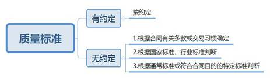
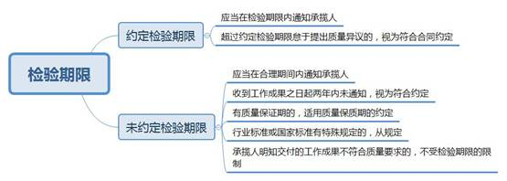
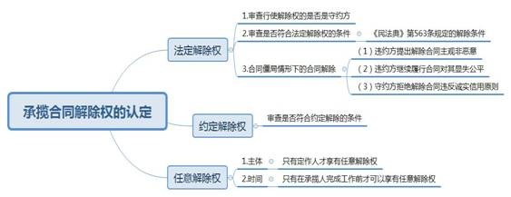

### **承揽合同纠纷案件的审理思路和裁判要点**

承揽合同纠纷，是指承揽人在按照定作人的要求完成工作、交付工作成果，定作人支付报酬的过程中产生的合同纠纷。承揽包括加工、定作、修理、复制、测试、检验等工作。此类纠纷所涉案件事实一般较为繁杂，往往需要委托鉴定机构对工作成果的质量进行鉴定，审判实务中易出现适法不统一现象。本文结合司法实践中的典型案例，对承揽合同纠纷案件的审理思路和裁判要点进行梳理、提炼和总结。

一、典型案例

**案例一：涉及合同性质认定**

A公司与B公司签订《设备买卖合同》，设备依据A公司提供的图纸制造；A公司支付预付款后B公司交货；余款待调试结束后付清。在设备制造过程中B公司根据A公司要求多次变更设备管口方位。B公司将设备送至A公司后一直未进行安装调试。后A公司诉至法院要求确认合同解除并返还预付款。B公司反诉认为双方之间系买卖合同关系，合同标的物已经交付完毕，是否安装调试不影响货款支付，要求A公司支付剩余货款。

**案例二：涉及定作物质量异议的认定与处理**

C公司与D公司签订《采购及安装合同》，在设备安装完毕开始调试使用后，C公司以工作联系单及微信方式报修。D公司多次到C公司对设备进行维修，并在维修记录单上载明故障原因系C公司未对设备进行正确保养，且超负荷使用。C公司认为设备存在严重的质量问题，且D公司一直未能调试合格，故诉请解除合同。D公司认为C公司长期使用未经验收的设备应视为验收合格，且出现的故障问题系因C公司使用不当，C公司应当支付剩余款项。

**案例三：涉及承揽人责任承担方式的认定与处理**

E公司向F公司订购定制家具，F公司宣传手册及网上广告宣传家具面板基材为白蜡木。F公司出具的报价单载明：“颜色：见实木样块”，实木样块材质未注明。E公司在报价单及产品设计图上签字确认。E公司在家具安装完毕后一年左右发现F公司交付的家具门板材质为樱桃木，遂以F公司交付的家具材质与双方约定的白蜡木不符为由，诉至法院要求解除合同并退还家具款。F公司认为双方约定的家具材质为“见实木样块”，实木样块材质为樱桃木，其交付的家具符合合同约定，且樱桃木价格高于白蜡木，E公司未遭受损失。

**案例四：涉及承揽合同任意解除权的认定**

李某看到G影楼发布的19.9元古装写真广告后去店拍摄。后李某对照片、相册、化妆、服装等项目多次消费升级，与G影楼先后签订五份协议，合计金额达2.6万余元。李某通过向亲友借款和开通网贷支付部分款项后，当天向G影楼提出变更套餐内容、减少合同金额，遭G影楼拒绝。李某诉至法院要求解除五份协议、退还已经支付的2万余元，且尚未支付的款项不再支付。

二、承揽合同纠纷案件的审理难点

**（一）合同性质认定难**

在司法实践中，承揽合同与买卖合同具有诸多相似之处，二者之间常常难以区分。承揽合同纠纷案件中，当事人提交的合同名称表述往往不规范，且在正式的交易过程中，双方为了自身利益可能未对合同名称作出明确约定。因此，当合同中涉及对标的物的特殊约定时，应视为承揽关系中定作人的要求还是买卖合同中对产品性质的约定，往往会存在争议。如错误判断合同性质，将会影响到案件管辖、法律适用、举证责任划分、最终责任认定的准确性。

**（二）涉及定作物质量异议的认定难**

承揽合同纠纷案件中，当事人往往就工作成果的质量问题产生争议。一是对于定作物质量异议的期限等内容确定难。对于当事人没有约定检验期限的，《民法典》规定的合理期间在实践中理解存在差异。二是质量标准的认定难。在承揽合同中关于质量标准的条款往往不够规范和详细，定作物是否符合合同约定较难认定。三是鉴定难。由于定作物是根据定作人要求定制，常常缺少行业标准。如果质量问题系隐蔽瑕疵且专业性较强，对于在案件审理过程中是否需要启动鉴定程序、如何采用鉴定结论等，在司法实践中存在不同认识。

**（三）涉及合同应否解除的认定难**

承揽合同的解除权包括定作人的任意解除权、《民法典》第563条规定的法定解除权，以及当事人依据承揽合同约定行使的约定解除权。实践中，对于当事人是否有合同解除权、如何确定解除权的请求权基础、合同是否已经解除，以及合同解除的时间点如何确定往往存在较大争议。其中，关于定作人任意解除权的规定较为原则，导致实践中对于任意解除权的解释标准不一，特别是关于任意解除权能否通过约定预先放弃，定作人行使任意解除权后的损害赔偿范围等问题，较易引发纷争。

**（四）涉及合同解除的法律后果处理难**

在承揽合同纠纷案件中，因定作物存在质量问题导致合同解除的，双方一般就定作物的权属难以达成一致。并且，对于定作物残值的计算通常需要经过评估程序，但有时由于保管不善造成标的物损毁，或者鉴定机构鉴定的依据和方法并不能反映检材的真实价值，导致定作物残值难以认定。此外，如何确定违约责任的承担并对解除后果作出恰当处理，平衡双方当事人的权利义务，多成为此类案件的难点。

三、承揽合同纠纷案件的审理思路和裁判要点

审理此类案件时，应以《民法典》合同编及承揽合同的相关规定作为主要法律依据，对合同性质、效力、履行、变更、解除及违约责任等争议问题进行认定，对承揽合同中有关工作成果质量标准、交付、验收及质量异议期限等内容进行具体审查，合理分配举证责任。

**（一）承揽合同与其他合同的辨析**

承揽合同涉及生活中的多个领域，兼有买卖、劳务、委托等多重性质，容易与相近案由相混淆。其中，尤以买卖合同与承揽合同中承揽人提供原材料的定作合同最难区别。

**1****、与买卖合同的区别**

承揽合同与买卖合同的主要区别在于以下几个方面：（1）订立合同的目的。买卖合同是以发生标的物所有权转移为目的，而承揽合同是以获得特定的工作成果为目的。（2）标的物是否具有特定性。买卖合同的标的物一般是种类物，具有通用性，一般有国家或行业标准；而承揽合同的标的物则是按照定作人的特殊要求专门制作的，具有特定性。（3）人身属性。买卖合同中买受人主要关注的是取得标的物的所有权，无人身属性要求；而承揽合同中定作人往往会对承揽人的资质能力、技术水平、设备条件较为关心，具有较强的人身属性。（4）对产品生产过程的控制力。买卖合同中买受人一般只需对交付的标的物是否符合其质量要求进行检验，无需对产品的生产过程进行监督检查；而承揽合同中承揽人负有接受定作人监督检查的义务，定作人对产品的生产过程实际具有一定的控制力。（5）合同价款的性质不同。买卖合同中约定的价款是标的物本身的价值，也就是通常所说的货款；而在承揽合同中，对于约定的价款，虽然实践中当事人也往往称之为货款，但其实为承揽人完成特定工作成果后的劳动报酬。

如案例一中，设备系依据A公司的图纸制造并根据其要求进行改动，并非按国家标准生产，不具有通用性。并且，合同约定余款的付款条件是待设备调试结束后付清，B公司需提供专业技术服务和后期安装调试。涉案合同虽名为买卖合同，但实际是B公司根据A公司的特殊要求完成并交付一定工作成果的协议。因此，本案中A公司与B公司之间的法律关系符合承揽合同法律关系的基本特征。

**2****、与雇佣合同的区别**

承揽合同以工作成果为目的，而雇佣合同以劳务供给为目的，劳务供给仅仅是手段或过程。承揽合同中承揽人完成工作成果获得报酬，而雇佣合同中受雇人提供劳务即获得报酬。承揽人提供的劳务具有独立性，而受雇人需听从雇主指令，具有从属性。承揽人一定条件下可将劳务转化为他人为之，受雇人的劳务需亲自为之。

**3****、与委托合同的区别**

承揽合同的标的指向工作成果，承揽人以自己名义独立承担完成定作物过程中的风险，而委托合同的标的指向特定事务，更注重代为处理事务的过程，受托人一般以委托人的名义行事，风险由委托人承担。承揽合同中只有定作方可以随时解除合同，但委托合同中双方均可以随时解除合同。

**（二）定作物交付的认定及质量异议的处理**

**1****、承揽人交付定作物及定作人受领定作物的审查要点**

**（****1****）审查承揽人是否按时交付**

法院需审查双方约定的交付时间。根据工作成果的性质，无需交付定作人的，承揽人完成工作时即为交付之日。工作成果毁损灭失的风险在标的物交付之前由承揽人承担，交付之后由定作人承担。

承揽人未在约定时间内完成工作，构成履行迟延。若允许定作人较轻易地解除合同，则承揽人所耗费的劳力、时间甚至巨额资金等承担的损失过高，对承揽人显失公平。因此，对于承揽人的责任判定应区分承揽是否为定期行为：若承揽为绝对定期行为，承揽人迟延履行的，定作人可以直接解除合同并请求赔偿损失；若承揽并非绝对定期行为，如承揽人履行迟延但其工作已完成的，定作人可以基于承揽合同特性请求减少报酬或赔偿因迟延所受损害。

需要指出的是，由于承揽人履行迟延，致使定作人产生替代给付的费用、造成可得利益损失的，定作人即使不解除合同，也有权要求承揽人赔偿损失。若定作人在受领时对迟延并无异议，则不能据此主张减少报酬、解除合同或赔偿损失等。

**（****2****）审查定作人是否及时受领**

工作完成后，承揽人按照约定交付工作成果而定作人迟延受领的，由定作人承担迟延受领期间工作成果毁损灭失的风险。定作人无正当理由拒绝接受工作成果的，承揽人可以催告定作人接受工作成果并进行检验。定作人超过合理期限受领工作成果且未支付报酬或材料费等价款的，承揽人可以根据《民法典》第570条、783条规定，提存、留置或拒绝交付工作成果，并要求定作人支付报酬、保管费等费用，以及要求定作人承担违约责任。

**2****、定作人验收的审查要点**

对承揽人完成并交付的工作成果，定作人应及时检验。实践中存在以下定作人怠于验收的情形：（1）定作人怠于验收，使用标的物后，以未经验收为由拒付报酬；（2）验收涉及第三方，定作人怠于验收，拒付报酬；（3）定作人拒绝受领标的物并拒绝验收，拒付报酬。

定作人怠于验收，径行使用标的物不正当阻止付款条件成就的，应视为条件已成就。如案例二中，标的设备安装开始C公司就一直在使用标的设备进行生产。C公司虽多次报修称设备存在质量问题，却未停止使用。虽然涉案合同项下设备没有经双方认可的验收报告，但C公司长期使用未经验收的标的设备进行生产，应当视为验收合格。C公司怠于履行验收义务，仍应支付剩余款项。

**3****、定作物质量问题的审查**

**（****1****）质量标准**

根据《民法典》第511条第1项规定，合同中有约定的按约定，若无约定则根据合同有关条款或者交易习惯确定；仍不能确定的，则根据国家标准、行业标准判断；还不能确定的，则根据通常标准或者符合合同目的的特定标准判断。承揽人交付的工作成果不仅应在质量上符合要求，也应保证在权利上没有瑕疵。

**（****2****）检验期限**

《民法典》对于承揽合同的检验期限没有具体规定，对此根据第646条规定，可以参照适用第621条关于买卖合同中标的物检验期限的相关规定。当事人约定检验期限的，定作人应当在检验期限内将工作成果的质量或数量问题通知承揽人。定作人收到货物后超过约定的检验期限怠于向承揽人提出质量异议的，应视为定作物符合合同约定。

当事人没有约定检验期间的，定作人应当在发现或者应当发现工作数量或者质量不符合约定的合理期间内通知承揽人。定作人在合理期间内未通知或自收到工作成果之日起两年内未通知承揽人的，视为工作成果或者质量符合约定，但对工作成果有质量保证期的，适用质量保证期的约定。行业标准或国家标准有特殊规定的，从其规定。如承揽人对交付的工作成果明知或应当知道不符合质量要求时，定作人的异议期间不受上述检验期限的限制。

**（****3****）造成质量问题的原因**

如工作成果不符合质量要求系因定作人的指示或其提供的原材料所致，则承揽人无需承担瑕疵责任。如承揽人明知上述情形而不告知定作人，则仍应承担瑕疵责任。如果工作成果不符合质量要求是由于定作人与承揽人共同造成的，承揽人仍应负与其过错相适应的责任。如果定作人提供的材料、图纸与技术要求等均无问题，而承揽人没有按照定作人指定的材料加工，或将定作人提供的材料偷换，或不按照合同约定的技术要求、技术条件和图纸进行工作，违反规定的技术规程等，提交的工作成果不符合合同约定的质量要求或通常效用，则应认定由承揽人承担瑕疵履行的责任。

**（****4****）定作物质量鉴定**

**首先**，应审查定作人是否对定作物存在质量问题提出初步证据，以及定作人提出质量异议是否在合理期限内。**其次**，应当审查定作物的质量问题是否属于隐蔽瑕疵。即应当审查根据承揽合同约定的安装、调试、验收等环节能否判断定作物存在有质量问题及问题产生原因、责任主体，是否存在专业性较强而只能通过专业机构鉴定质量问题。**再次**，根据《民事诉讼法》第79、81条规定，法院应当征询双方当事人意见，是否愿意委托鉴定，如当事人同意鉴定，应当释明由负有举证责任的当事人提出鉴定申请，并在指定期限内预交鉴定费，否则应当承担举证不能的法律后果。**最后**，鉴定的结论应当由双方当事人发表质证意见，必要时由鉴定机构到庭对双方提出的问题进行说明。

**4****、承揽人责任承担的方式**

《民法典》第781条规定，承揽人交付的工作成果不符合质量要求的，定作人可以合理选择请求承揽人承担修理、重作、减少报酬、赔偿损失等违约责任。结合承揽合同的特点，需要特别说明以下两点：

**（****1****）修理、重作**

修理、重作应优先于减少报酬、赔偿损失等救济措施适用。工作成果不符合要求时，原则上定作人应先确定一定期限要求承揽人修理，在承揽人拒绝修理或迟延修理前，定作人不能寻求其他救济手段。为修理支出的必要费用由承揽人承担。在承揽人未在合理期限内再交付符合质量要求的工作成果时，定作人可以选择自行或请第三人修理、重作，由此产生的必要费用则应由承揽人承担。

**（****2****）减少报酬**

根据《民法典》第781条规定，在承揽人交付的工作成果存在质量瑕疵时，定作人可以要求减少报酬。如案例三中，案涉家具已经安装并交付使用，无论使用的是樱桃木还是白蜡木，均系实木材质，并不影响案涉定制家具产品的整体风格，且E公司在使用一年多以后才提出材质与约定不符，期间没有停止使用，故F公司交付的家具并无严重质量问题和足以影响E公司正常使用的重大瑕疵，并未达到解除合同返还定作物的程度。因此，对于E公司要求解除合同的诉请不予支持，但鉴于确实存在案涉家具材质与合同约定不符的情形，法院可酌情判定E公司减少支付相应的报酬。

**（三）承揽合同解除权的认定**

承揽合同的解除权包括约定解除权、法定解除权和任意解除权。三种解除权的构成要件及法律后果存在区别。案件审理过程中，应当固定当事人行使解除权的请求权基础，当事人提出行使多种解除权的，应向当事人释明确定行使解除权的类型，当事人拒绝作出选择的，应分别审查是否符合对应的解除权。

**1****、对于行使法定解除权、约定解除权的审查**

首先，应当确定行使法定解除权、约定解除权的一方是否是守约方。原则上守约方才有合同解除权，但根据《民法典》第580条第2款规定，当发生合同僵局致使不能实现合同目的时，违约方在符合特定条件的前提下可以提出终止权利义务关系。法院判决解除合同的，违约方本应当承担的违约责任不能因解除合同而减少或免除。其次，当事人提出行使法定解除权的，应综合考虑违约程度、合同目的能否实现等事项审查是否符合法定解除的条件。当事人提出行使约定解除权的，应审查是否符合合同约定的解除条件。

**2****、对于行使任意解除权的审查**

《民法典》第787条规定，定作人在完成工作前可以随时解除合同，造成承揽人损失的，应当赔偿损失。审查要点包括：首先，应当审查任意解除权的行使主体。承揽合同中只有定作人才享有任意解除权。其次，审查任意解除权的行使期限。虽然定作人行使任意解除权无需说明理由，但只有在承揽人完成工作前方才可以行使该权利。

如案例四中，G影楼尚未完成全部工作内容即提供全部美容、拍摄等服务，此时李某作为定作人享有任意解除权。然而因影楼已提供部分服务，已履行完毕的协议不能解除，故法院判决五份协议中尚未履行的协议全部解除，未全部履行的协议部分解除，已经履行完毕的协议不能解除，G影楼退还合同款项1.86万元。

定作人不得在承揽人已经完成加工工作后行使任意解除权。如果定作物已经全部交付，仅有加工款尾款未支付，定作人不能行使任意解除权。如果定作物存在质量问题，定作人只能向对方主张违约责任。

需要注意的是，承揽合同双方不能通过约定排除定作人的任意解除权，理由在于：一是承揽合同中定作人享有的任意解除权属于一种特例，是由承揽合同的特点决定的；二是法律赋予定作人的任意解除权属于强制性规范；三是承揽合同任意解除权的制度初衷在于避免社会价值的浪费，符合民法的绿色经济原则。

**3****、对于解除权行使方式的审查**

根据《民法典》第565条规定，法院应当审查当事人是否采取通知方式行使解除权。定作人解除合同的，应当通知承揽人，承揽合同自通知到达承揽人时解除，合同的权利义务终止。

承揽合同的定作人或承揽人仅提出解除合同的，应当向其释明变更诉请，并告知当事人对合同解除的法律后果一并处理，另一方当事人一并提出抗辩，尽可能一次性地解决纠纷。同时，判决解除承揽合同的，除需在判决书“本院认为”部分对解除合同的后果作出认定外，还应当在判决主文中明确表述。

**（四）合同解除的后果处理**

**1****、合同解除的法律后果**

承揽合同解除法律后果的把握上，需对定作物归属判定、定作物残值处理两方面加以特别注意：

**（****1****）定作物归属判定**：合同解除后，法院可以组织双方对定作物的归属进行协商，以寻求未完成定作物价值最大化的合理方案。在未能协商达成一致的情况下，如承揽人尚未完成定作物，考虑到此时定作物仍在承揽人处，为避免运输、仓储等二次费用，且作为承揽人显然有更多可能将半成品予以再利用，可将定作物交由承揽人处理。如承揽人已将设备全部完成，即基本完成合同义务，法院可将成品判归定作人所有。定作人提供原材料有剩余的，也应当返还定作人。定作人按合同约定预先支付报酬的，承揽人在扣除已完成部分的报酬后，应当将剩余价款返还定作人。

对于承揽人而言，如果为了加快工作进度，擅自开始完成承揽工作，在接到定作人解除合同的通知后，没有采取适当措施致使损失扩大的，不得就扩大的损失要求赔偿，并应依照过错程度自行承担相应损失。

**（****2****）定作物残值处理**：对于定作物残值的处理，法院应当征询当事人的意见并进行释明，从有利于定作物价值利用、平衡双方利益的角度，认定定作物处理方法。在部分案件中，由于标的物毁损或难以鉴定等原因，对于残值部分难以认定，此时应当结合价格佐证，如制造成本、预期利润、市场行情、行业数据、上下游价格等确定残值。

**2****、定作人行使任意解除权后的赔偿范围**

对于定作人行使任意解除权造成承揽人损失的，在合同没有约定的情况下，原则上不能适用违约金而只能适用赔偿损失的方式进行救济。

赔偿损失的范围除赔偿实际损失外，对于履行利益应当根据个案情况从严把握。对于赔偿范围可以从以下几方面加以考虑：一是区分材料提供人是定作人还是承揽人，如果是定作人提供材料，赔偿范围则不应包括材料费；二是审查承揽人完成工作的进度及定作人已支付报酬的情况，确定定作人应当支付的报酬；三是审查承揽人是否因定作人行使任意解除权获利，赔偿范围应扣除承揽人获利部分；四是审查定作人、承揽人对损失的扩大是否存在过错，按过错程度承担赔偿责任。最后仍无法确定损失金额的，应综合考虑上述几方面后酌定赔偿金额。

四、其他需要说明的问题

**（一）承揽合同中的留置权问题**

《民法典》第783条规定，定作人未向承揽人支付报酬或材料费等价款的，承揽人对完成的工作成果享有留置权或者有权拒绝交付，但当事人另有约定的除外。“拒绝交付”并不是承揽人不再履行交付义务，而是暂时停止交付，待定作人向承揽人支付报酬或材料费等价款后，再履行交付义务。

承揽合同留置权的具体处理应适用《民法典》第二编第十九章的规定。需要注意的是，承揽合同中留置权的行使对象只能是完成的工作成果，不包括定作人提供的材料或模具等物。

**（二）承揽关系中的侵权责任**

《民法典》第1193条规定，承揽人在完成工作过程中造成第三人损害或者自己损害的，定作人不承担侵权责任。定作人对定作、指示或选任有过错的，应当承担相应的责任。关于承揽关系中侵权责任问题的具体处理应适用人身损害赔偿相关的法律法规，故在本文中未予列明。

（根据商事庭周清、张子贝提供材料整理）