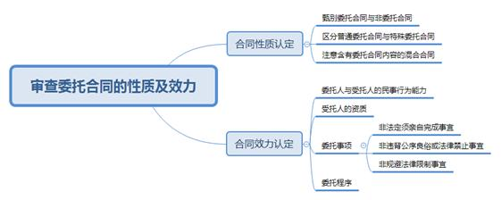
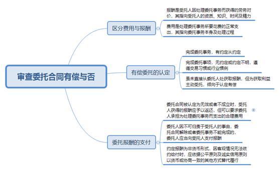
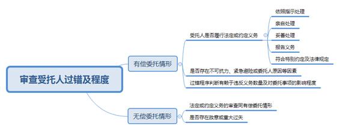
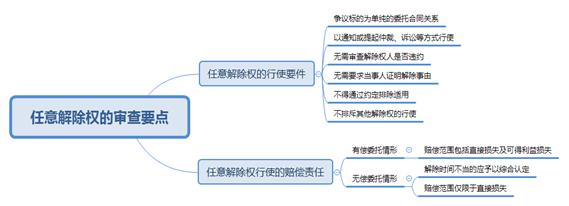

### **委托合同纠纷案件的审理思路和裁判要点**

委托合同是委托人和受托人约定，由受托人处理委托人事务的合同。委托合同为非要式合同，其缔结多基于委托人和受托人之间的人身信赖关系或专业信任关系，在社会生活中应用较为普遍。随着社会分工细化、第三产业蓬勃发展、数字经济兴起，司法实践中委托合同类纠纷在合同效力认定、委托有偿与否、受托人过错认定、任意解除权行使及后果处理等方面仍存在一定争议。现以典型案例为基础，结合《民法典》及相关法律规定，对委托合同纠纷案件的审理思路和裁判要点进行梳理、提炼和总结。

一、典型案例

**案例一：涉及委托合同效力的认定**

A公司与B公司签订《租赁代理合同》，约定A公司委托B公司作为C公寓部分房源的独家租赁代理商，租赁价格由物业装修款（均价28万元／套）和租金（租期20年）构成。《租赁代理合同》后附的项目相关批准文件载明，C公寓为单位租赁房，登记为职工（集体）宿舍，只租不售，不得分割办理产证。双方亦就租赁业绩考核、佣金支付及奖励办法等签订了一系列补充协议。后生效判决认定客户通过B公司与A公司签订的《C公寓装修投资合同》实质为以租代售，违反了商品房预售的相关法律规定，应当认定为无效。现A公司诉请确认其与B公司签订的《租赁代理合同》及相关补充协议无效。

**案例二：涉及委托有偿性的认定**

王某通过微信委托李某代为购买由上海飞往某地的往返商务舱机票，双方议定票款总价计9万余元。王某启程顺利，但在返程时由于李某无法提供约定的商务舱机票，导致王某未能按期返回上海。经查，李某通过积分兑换方式以优惠价格购买机票，赚取一定差价。现王某要求李某全额退还票价并赔偿误工费。

**案例三：涉及受托人过错的认定**

D公司与E公司签订《企业委托代理协议》，约定D公司委托E公司办理“建筑装修装饰工程二级资质证书及安全生产许可证”。E公司三次申报均未获审批通过，其中两次是由于D公司自有人员业绩描述不符合要求造成，一次是因E公司提供的挂靠人员学历原因造成。现D公司主张E公司处理委托事务存在过错，诉请解除合同、退还费用并赔偿损失。E公司认为，D公司自有人员的业绩描述由D公司提供，其作为受托人不存在过错。

**案例四：涉及任意解除权的行使**

F公司与G公司签订《协议书》，约定F公司聘请G公司担任其在上海股交中心科创板挂牌的推荐机构，且就付款方式等内容进行明确约定。F公司未按约于签署协议后10日内支付第一期挂牌推荐费。后F公司向G公司发函表示双方信任基础丧失，要求解除《协议书》。G公司起诉要求F公司支付首期挂牌推荐费及违约金。F公司认为，其解除合同的依据为任意解除权且涉案《协议书》已经解除，不应再支付首期挂牌推荐费用，也无需赔偿损失。

二、委托合同纠纷案件的审理难点

委托合同以其相对简约的法律构造可以覆盖广泛的社会生活。有赖于双方之间的信任基础，委托合同关系的主体、内容、期限、方式等任一因素的变化均有可能打破原来稳定的法律状态。司法实践中，委托合同纠纷的处理主要存在以下四方面的难点：

**（一）委托合同效力准确判断难**

案件审理中，即使当事人未提出效力抗辩，人民法院需依职权审查委托合同是否存在效力瑕疵。委托合同可能因主体缺乏相应资质、通谋虚伪、内容违反公序良俗等情形而被认定无效。一方面，委托法律关系覆盖面广泛，除日常生活委托外还涉及进出口代理、货运代理、诉讼仲裁代理等专门行业或者委托持股、委任董事等特定事项，其效力认定既需依照《民法典》的相关规定，还需对照《公司法》《律师法》等其他法律规定。另一方面，网络店铺运营、线上代购、电子数据处理等涉数字经济新型委托不断涌现，相关法律规范尚需完备。同时，委托合同的条款设计意思自治范围较广，附条件、附期限、权利限制等内容也逐渐增多。因此，委托合同效力判断在事实查明及法律适用方面均存在难点。

**（二）委托有偿性及对价恰当认定难**

有偿委托指受托人因处理委托事务获得一定对价。就委托有偿性的认定，一种观点认为受托人须直接从委托人处获得对价才能认定为有偿委托，另一种观点认为受托人因处理委托事务而获益即可认定为有偿委托。实践中，委托合同未明确约定对价是否可以推定为无偿委托，亦存在不同观点。以货币方式支付的对价，在受托人部分履行或未按计划履行合同义务时，如何确定具体金额方能兼顾尊重意思自治与保障实体公平，个案差异较大。以非货币方式支付的对价，在委托合同未完全履行或约定对价实现不能时，如何维护受托人的权益也存在现实困境。

**（三）受托人过错及程度合理裁量难**

受托人的过错主要在于处理委托事务时对法定义务或约定义务的违反。从法定义务来看，受托人需履行勤勉、忠实等义务，具体包括亲自处理、报告、披露、保密等。从约定义务来看，法院应以双方协议约定或委托人向受托人作出的明确指示作为评判依据。司法实践中，结合委托事务、委托方式、委托期限等事实要素，受托人的勤勉程度与注意范围区别较大。在继续性合同中，委托事务处理周期较长，容易发生指示变更、指示背离、不可抗力等情形，导致受托人的过错及程度认定自由裁量的空间较大。

**（四）任意解除权问题法律适用难**

任意解除权指委托人或者受托人可以随时解除委托合同。围绕委托合同的任意解除权，实践中的争议主要有：一是有偿委托中任意解除权限制条款的效力认定。一种观点认为，任意解除权是法定权利，当事人不能通过特别约定予以放弃。另一种观点认为，根据意思自治原则，任意解除权限制条款并不违背公序良俗，无否定其效力的理由。有偿委托除了信赖关系亦有利益关系，为避免一方恶意违约应允许对任意解除权予以限制。二是任意解除权行使后损害赔偿范围的确定。虽然《民法典》第933条在区分无偿委托与有偿委托的前提下，就任意解除权行使后的损害赔偿范围予以分别规定，但就解除时间不当的损失、直接损失、可得利益损失等并未细化判断标准，导致法律适用存在一定困难。

三、委托合同纠纷案件的审理思路和裁判要点

法院审理委托合同纠纷应秉持全面审查原则与合理区分原则。全面审查原则指应全面查明委托合同关系的缔结背景、主体、内容、报酬、方式等事实要素，明确双方的信赖基础与履约进程。合理区分原则指应妥当作出有偿与无偿、对内与对外、整体与部分等影响适法的关键争点判断，进而认定双方是否有责及责任承担方式。具体审查步骤如下：

**（一）审查委托合同的性质及效力**

**1****、****合同性质的认定**。委托是当事人日常生活及签订合同过程中使用的高频词汇，但名称或内容带有“委托”字样的约定或文本并不能当然认定当事人之间为委托合同法律关系。法院在审查过程中应进行合同内容的实质性审查，依据合同约定的权利义务确定合同性质。

第一，甄别委托合同与非委托合同。委托合同是《民法典》专章规定的有名合同。委托合同关系的主要特征有四点。首先，委托合同的标的是劳务。受托人的主要义务是按照指示处理委托事务，更注重处理过程而非处理结果。此点有别于交付产品所有权的买卖合同以及交付工作成果的承揽合同。其次，委托合同具有人身依赖性。委托人与受托人之间具有双向信任关系，信任基础可以是身份情感，也可以是专业知识。再次，委托合同既可以有偿，也可以无偿。有偿性不是认定或推定委托合同性质的要件，仅是作为判断双方注意义务及责任大小的依据之一。最后，委托合同为诺成、不要式的双务合同。实践中，委托合同以口头或书面形式呈现均可。委托人能选定受托人且双方就委托事项已达成一致的，委托合同关系即形成。

第二，区分普通委托合同与特殊委托合同。随着社会分工细化，以接受委托处理特定事务为业的职业群体增多。特定类型的委托合同经立法固定为独立的有名合同，如中介合同、行纪合同等。首先，委托合同与中介合同。中介合同中，作为受托人的中介人仅承担信息沟通的中间人角色，服务内容多是为委托人报告订约机会或提供媒介服务，如地产中介、劳务中介、婚姻中介等。从事特殊交易事务的中介人需要具有一定的资质与能力并获得相应的行政许可，如证券保荐人、股权众筹融资中介等，其中介行为也应同时符合相关行业的法律规定。其次，委托合同与行纪合同。行纪合同主要适用于贸易领域，行纪人应依法取得某种行纪行为的特定资质。行纪人需以自己名义处理委托事务，其与第三人之间的法律关系独立于其与委托人的行纪合同。行纪合同为有偿合同，行纪人自行承担处理委托事务产生的费用。最后，委托合同与委托理财合同。委托理财合同是独立的民事案由。两者的区别主要在于委托事项，委托理财合同中委托人向受托人托付资产并由受托人参与投资项目的选择、操盘等核心事项。若委托人仅要求受托人代为填写投资材料、协助完成账户操作等，受托人未对投资方式及产品的选择等有实质性影响，则双方之间仍应认定为委托合同关系。

第三，注意含有委托合同内容的混合合同。首先，委托合同与非委托合同的混合。生活中，房屋装修合同、医疗合同、委托经营管理合同等有可能兼具委托合同法律关系与其他法律关系，如委托经营管理合同，包含委托合同、租赁合同、物业管理合同等性质。该类混合合同在法律适用时不仅涉及除委托合同外其他合同的法律规定，同时委托合同任意解除权的行使也会受到限制。其次，同一委托合同项下委托事项的混合。为处理较为复杂的委托事宜，委托人与受托人会在同一委托合同中约定不同类别的委托事项。如委托网络店铺管理既包含店铺日常运营，也包含个人信息处理。针对个人信息处理，不仅适用委托合同法律规定，也应适用《民法典》关于个人信息保护及《个人信息保护法》的相关规定。

**2****、****合同效力的认定**。委托合同的效力认定适用《民法典》中民事行为效力认定的有关条款。其中，委托合同无效情形在实践中最受关注。依据相关法律规定并总结司法实践，可能导致委托合同无效的因素主要包括：

第一，委托人与受托人的民事行为能力。委托合同的当事人为无民事行为能力或限制民事行为能力且未经法定代理人追认的，委托合同无效。

第二，受托人的资质。通常情况下，委托合同对受托人的资质没有特别限制，但诉讼代理、进出口代理等从事特定行业的受托人应具有相关从业资质。委托事项超过受托公司、企业经营范围的，不必然影响委托合同效力，但违反国家限制经营、特许经营以及法律、行政法规强制性规定的除外。

第三，委托事项。委托事项应当具有合法性，不得违反法律、行政法规的强制性规定。法院也不应由于当事人间对委托事项无异议而免于审查。首先，法律明确规定不得委托他人办理的事务，如订立遗嘱、登记结婚、核酸检测、参加考试等。其次，违背公序良俗或法律所禁止的事务，如贩毒、行凶、医托、校托等。最后，为规避外国投资者准入负面清单、行业准入等限制性规定而签订的股权代持，如基金公司、保险公司、评估机构、上市公司等的股东不得委托他人代持。委托事项存在上述情形之一的，委托合同应被认定为无效。

第四，委托程序。公司治理过程中，如未经股东会决议的董事委任、董监高概括委托他人行使职权等未经法定程序的权利让渡应被认定为无效。

需要说明的是，法院在对委托事项的合法性进行审查时需注意：一是关联合同无效并不必然导致委托合同无效。如民间借贷合同因出借人为职业放贷人而无效，但其中涉及的正当代收代付关系未必无效。二是要综合委托合同的内容和目的，审查委托事项是否违反法律、行政法规的效力性强制性规定，是否违背公序良俗。三是如委托合同可能存在无效情形，法院应向当事人予以释明，询问其在合同无效情形下是否就无效后果的处理提出相应诉请。委托合同无效后果主要包括财产返还、报酬退还、损失分担等。

如案例一中，A公司委托B公司作为C公寓部分房源的独家租赁代理商。就委托事项而言，概括地委托他人代理房屋租赁并不违反法律、行政法规的强制性规定。然而C公寓为单位租赁房，登记为职工（集体）宿舍，依法不得分割办理产证，除随同单位资产整体处置外不得单独转让、单独办理房地产转移登记。而A公司与B公司签订的《租赁代理合同》中明确约定，物业的价格包括物业装修款和租金，并且代理佣金、代理费用、双方的责任与义务等条款均表明A公司并未按照规章制度处置C公寓。合同附件已经包含了C公寓项目相关批准文件，故B公司对C公寓系单位租赁房的性质是明知的。因此，法院应认定涉案《租赁代理合同》无效。

**（二）审查委托合同有偿与否**

委托合同依据委托人是否支付报酬可分为有偿委托与无偿委托，而委托人是否预付费用不影响合同有偿或无偿的认定。因此，法院在审理中应先认定约定款项是否属于报酬，再行判断委托合同有偿与否。

**1****、****区分费用与报酬**

委托合同中，报酬与费用往往都会以“某某费”的表述予以约定，但两者存在本质不同。报酬是受托人因处理委托事务而获得的劳务对价，其指向受托人的资质、知识、时间及精力，如进出口代理费、诉讼代理费等；而费用则是处理委托事务所要花费的正常支出，其指向委托事务本身及处理过程，如差旅费用、运输费用等。

按照《民法典》第921条的规定，费用应由委托人承担。同时，受托人不能因委托人承担费用而获益，费用的支出应具有必要性，若处理委托事务后有剩余的应该返还给委托人。司法实践中，有关费用涉及的主要问题有：

第一，费用的必要性认定。首先，费用应与处理的事务密切相关。例如，受托人为完成委托事项单独招募员工成立项目部，经过委托人认可则相应人员的薪资与委托事项存在密切关联。如为受托人的日常经营而招募员工的薪资则不应作为该委托事项费用。其次，费用支出具有合理性。该费用为处理事务所必须支出的，否则会导致委托事务无法进行。例如，同一地级市下跨区处理委托事项可当日来回的，住宿费的支出不具有合理性。最后，对于垫付的费用应尽到善良管理人的义务，采用适当的方式处理。一般而言，在有可供选择的处理方式时，尽量选择经济型的方式，但因为事态紧急需要临时选择其他处理方式时，如该费用支出与所获利益相适当，则属必要；如该费用的支出远超利益，则属于非必要，应当按照通常的费用标准来认定。

第二，费用承担主体的约定。《民法典》第921条规定，委托人应当预付处理委托事务的费用。实践中，当事人协议变更费用的承担主体或者承担方式原则上应得到尊重，但该约定不得损害受托人的利益，如无偿委托中就不适宜认定费用也由受托人承担。

**2****、****有偿委托的认定**

对于委托是否有偿，有约定的从约定，没有约定的按照行业惯例或习惯认定。

第一，受托人完成委托事务，如果合同对报酬有明确约定或者明确约定为无偿的，则委托人应当按照约定向受托人支付或不支付报酬。双方可协议约定报酬的形式、数额、支付时间等。其中，报酬的形式既包括货币形式，也包括非货币形式，如物品、交易机会、债务抵销等。

第二，受托人完成委托事务的，如果合同对报酬没有约定或约定不明，但依据行业惯例或者交易习惯应当支付报酬的，委托人应当支付报酬。首先，诉讼代理、货运代理等行业性委托，倾向于认定为有偿委托，报酬标准可参照合同履行地政府指导价格、行业收费标准等予以确定。其次，跨境代购、代为经营管理等职业性委托，倾向于认定为有偿委托，代购情形下购入价与出售价的差额可视为报酬，代为经营管理可参照合同履行地相似职业平均报酬予以认定。最后，偶尔发生的、支出较小的生活事务的委托，依据邻里互助、和谐友善的风俗习惯倾向于认定为无偿委托。

如案例二中，李某为职业机票代购，双方约定了购票总价款，并未区分价款与报酬。李某以积分换购、会员折扣等方式，实际支付的票价低于双方约定的总价款，差额部分可视为报酬，因此本案为有偿委托。

第三，受托人虽未直接从委托人处获得报酬，但受托人以介绍返点等获益目的而从事委托事务的，倾向于认定为有偿委托。例如，为获得平台的返利，介绍并受托为他人购买理财产品。

**3****、****委托报酬的支付**

通常情况下，委托人在委托事务完成或合同约定的支付条件成就后向受托人支付报酬，但以下情形应予以分别处理：

第一，委托合同被认定为无效或者不成立时，受托人获得的报酬应予以返还，但可以要求委托人承担为处理委托事务而支出的合理费用。

第二，委托人因不可归责于受托人的事由，委托合同解除或者委托事务不能完成的，委托人应当向受托人支付报酬。此处的“不可归责于受托人的事由”主要包括两个方面。首先，委托人原因。由于委托人的原因使得受托人依法解除合同或者无法完成合同。其次，客观原因。如发生不可抗力、委托人死亡、破产等使得合同解除或者无法履行合同。委托人支付报酬的数量应与受托人付出的劳务、时间、知识等相当。

第三，约定报酬为非货币形式，因客观情况无法依约给付时，应依据公平原则及诚实信用原则以货币或协商一致的其他方式替代履行。

**（三）审查受托人过错及程度**

审查受托人过错应首先确定委托是否有偿，有偿委托与无偿委托的区分不仅影响受托人存在过错后的责任承担，还对认定过错本身存在明显影响。基于委托有偿与否的区分已在前文阐述，下面直接按照有偿委托与无偿委托两种情形予以展开，具体审查内容如下：

**1****、****有偿委托情形下，受托人过错及程度的审查**

受托人处理委托事务全流程应尽到勤勉及忠实义务。依据权利与义务相一致原则，有偿委托情形下对受托人上述义务的注意度及完成度要求较高。受托人过错的认定是一种主观判断，实践中要结合受托人各阶段的行为予以综合认定。受托人应履行的主要义务有：依照指示处理、亲自处理、妥善处理、注意特别约定或法律规定。同时，委托事务的差别会导致不同委托合同关系中受托人对上述义务各有侧重。

**（****1****）依照指示处理**

受托人应当按照委托人的指示处理委托事务，其中指示包含两个层面。一是在委托人授权的范围内处理事务。委托人可以委托受托人处理一项或数项事务，或者进行概括授权。通常情况下，涉及委托人重大利益的事项需进行特别委托。在诉讼、个人信息处理等特殊委托事项中，授权范围不宜进行扩大解释。二是按照委托人要求的时间及方式处理委托事务。如委托人就买卖价格有特别指示的不得违背该指示进行买卖，受托处理个人信息的不得超出约定的处理方式处理个人信息等。委托人对某一委托事务有多项指示的，一般以最后的指示为准。受托人若依据自身知识及经验认为变更委托人指示能更好完成委托事务的，应征得委托人的明确同意。

**（****2****）亲自处理**

受托人应当亲自处理委托事务，尤其是在有偿委托情形下，委托事务与受托人的人身依赖性更强。亲自处理既包括自行处理，也包括在履行辅助人的协助下处理委托事务。经委托人同意，受托人可进行转委托。首先，转委托应具有必要性，较为常见的转委托情形有受托人因自身原因不再适合处理委托事务、受托人直接处理委托事务遇到障碍、次受托人处理委托事务更具专业优势等。其次，次受托人应具备处理委托事务的基本能力，包括次受托人的年龄、专业背景、从业年限等。同时，次受托人不应与委托人及委托事务存在利益冲突。

**（****3****）妥善处理**

有偿委托情形下，受托人一般为专业人员或职业人员，妥善性的判断标准会适当提高。司法实践中，妥善处理的共性标准主要有三点。一是参与。受托人应全面参与委托事务的重要节点，承担处理委托事务的主要工作。如诉讼代理人参与立案、取证、庭审等环节，代购参与选品、比价、邮寄等环节。二是勤勉。受托人应积极完成委托事务，不应拖延、放任或者阻碍委托事务的完成。三是尽责。受托人应在委托事务的处理过程中充分发挥自身的专业知识、从业经验、分析能力等，正向推动委托事务完成，反向避免可能存在的障碍或产生的损失。如进出口代理合同中，受托人应及时了解关税政策的变化，使得委托人可依法享受税收优惠，避免申报错误。

**（****4****）报告义务**

受托人的报告义务贯穿委托事务的各个阶段，报告的形式不限，报告的时间点主要有三个。一是在委托事务办理过程中，受托人依据委托人的要求与指示，随时向委托人报告委托事务的阶段性办理进程。该类报告的重点在于便于委托人了解委托事务办理的基本情况及受托人已完成的工作量。二是依据情势确有报告必要时，如处理委托事务发生困难或者发生无法预料的情况等影响委托事务办理的重大事项。该类报告的重点在于便于委托人依据突发情况及时调整其指示。三是受托人应于委托合同终止时向委托人报告委托事务的处理情况。该类报告的重点在于便于委托人对委托事务办理进行总结回顾，决定后续事宜或是否对受托人求偿。

**（****5****）注意特别约定或法律规定**

当事人双方可能在委托合同中对委托人与受托人各自的权利义务进行特别约定。例如，双方在委托合同中约定委托人应自行负责处理委托事务的部分内容或承诺提供基础条件。除《民法典》外，其他法律也可能对特定事务的委托进行特别规定。例如，《个人信息保护法》第21条第2款规定，委托合同不生效、无效、被撤销或者终止的，受托人应当将个人信息返还个人信息处理者或者予以删除，不得保留。《律师法》第38条规定，律师应当保守在执业活动中知悉的国家秘密、商业秘密，不得泄露当事人的隐私。这些条款均应作为认定受托人是否存在过错的依据。

法院对受托人过错及程度的审查应注意以下要点：一是受托人是否履行法定或者约定的上述义务。若未履行或未完全履行，则原则上应视为受托人存在过错。二是因不可抗力、紧急情况或委托人原因导致受托人无法履行上述义务，则不应认为受托人存在过错。三是过错程度的判断，一方面有赖于受托人违反义务数量的多少，违反义务数量较多的过错程度较重，另一方面有赖于违反特定义务对委托事务的影响程度，如委托事务为一时性委托则过程中报告义务对委托事务的处理影响较小，若未予报告则过错程度较轻。四是受托人的过错与委托事务完成之间不存在必然联系，但委托事务是否完成可作为受托人过错程度的衡量标准之一。

如案例三中，双方协议约定D公司委托E公司全权代理申请建筑装修装饰工程二级资质证书及安全生产许可证事宜，并约定资质服务费及安全许可证费用。根据该约定，E公司应当具有代理进行资质申报的专业水平，并对D公司提供的材料负有指导和审核义务。前两次申报，D公司固然负有提供资料的义务，但对于人员业绩描述是否清楚，是否符合申报要求，理应属于E公司对申报资料进行审核的范畴。第三次申报不通过的原因系因E公司所找的挂靠人员学历证书不符合要求。双方约定申报期限资料齐全后的五个月完成申请，但E公司超期仍未完成。E公司在申报资料的审核、挂靠人员的资质审核和申报期限方面均存在过错，应当对申报未通过承担主要责任。

**2****、****无偿委托情形下，受托人过错及程度的审查**

无偿委托情形下，受托人的义务与有偿委托基本一致。根据《民法典》第929条规定，无偿委托时，受托人就故意或者重大过失给委托人造成的损失承担赔偿责任。因此，在无偿委托合同中审查重点是故意或者重大过失的认定。

所谓故意，是指受托人明知或者应当知道损害可能发生，但却促使或者放任该损害的发生。因无偿委托多基于双方的信任关系，受托人故意给委托人造成损失的情形较为少见。所谓重大过失，是指受托人在其注意义务范围内，能够预见而没有预见，或者已经预见但轻信可以避免从而导致损害的发生。

无偿委托情形下，首先，受托人就委托事务仅负有一般的注意义务。实践中，无偿委托多为生活事务或者简单的事务性工作，如接送孩子、照顾宠物、填写单据、购买彩票等。受托人仅需就该事务保有与处理自身事务相一致的注意义务。如填写单据时审核是否存在笔误、代为取款时核对金额、代为接送时准时到达指定地点等。其次，无偿委托中若委托事务为代为购买彩票等射幸合同，是否中奖属于无法预见的因素。若受托人未按照委托人的指示购买彩票，受托人主观上也不应认定为故意或重大过失。

**（四）行使任意解除权的审查要点**

《民法典》第933条规定，委托人或者受托人可以随时解除委托合同，即任意解除权。任意解除权的设立系基于委托合同人身信赖性、履行存在较大不确定性等考量，也是实践中委托合同纠纷经常触及的问题。

**1****、****任意解除权的行使要件**

任意解除权的法律规定较为简单明了。在司法实践中，法院需审查以下要件：

第一，争议标的为单纯的委托合同关系。任意解除权只能适用于单纯的委托关系，若合同中除了委托关系还有其他的法律关系，则当事人不能行使任意解除权。

第二，以通知或提起仲裁、诉讼等方式行使。委托合同的任意解除权可通过直接通知或提起仲裁、诉讼等方式行使。信件、微信、电子邮件等将解除合同的意思表示送达给相对方的形式均可。

第三，无需审查解除权人是否违约。委托人与受托人均可行使，即使是违约方也可基于任意解除权终止委托合同关系。如案例四中，虽然F公司未按约于签署协议后10日内支付第一期挂牌推荐费，属于履行中的违约方，但其任意解除权的行使不受限制。因此，双方签订的《协议书》实际于G公司收到《解除函》之日起解除。

第四，无需要求当事人证明解除事由。当事人主张解除无需就解除原因承担证明责任，甚至无需说明理由。

第五，任意解除权不得通过约定排除适用。当事人在委托合同中约定排除或限制任意解除权的，无论是有偿委托还是无偿委托，均不发生限制当事人依法行使任意解除权的效力。在此情形下，被解除方可依据合同约定要求解除方承担违约责任。

第六，任意解除权属于特殊的法定解除权，委托合同的任意解除权并不排斥其他解除权的行使。司法实践中，当事人可能依据多个解除事由主张解除委托合同，法院可向当事人进行释明，要求当事人择一行使，并明确相关法律后果是否一并处理。

**2****、****任意解除权行使的赔偿责任**

当事人行使任意解除权，因解除合同造成对方损失的，除不可归责于该当事人的事由外，解除方应承担赔偿责任。需要说明的是，因法律对合同解除后报酬与费用的负担存在相应的规定，此处的赔偿不涉及上述两项费用。在赔偿范围上，《民法典》依然采取有偿委托与无偿委托相区分的方式，法院应予以分类审查。

**（****1****）有偿委托情形下，解除方的赔偿范围认定**

有偿委托合同的解除方应当赔偿对方的损失包括直接损失和可得利益损失。

第一，直接损失，指当事人信赖合同可以履行并得到履行利益所提前支出的费用或财产而受到的损失。首先，直接损失包括委托合同关系成立后的投入，也包括合同成立前基于信赖及推动委托事务完成而进行的先期投入。如受托人为处理委托事务投入的软件开发、广告宣传、促销活动等。如案例四中，在确认合同解除的情况下，F公司对于G公司依约完成的联系人员、建立工作微信群、梳理材料清单等工作仍应当支付相应的款项。其次，委托人与受托人直接损失的范围不同，应予以分别确定。如委托人更换受托人而产生的报酬差价、重新支出费用等。

第二，可得利益，指合同履行后当事人原本可得到的经济利益。首先，委托合同中的可得利益具有未来性、期待性与现实性。若合同如期履行，则可取得。一般情况下是短期内的财产利益，不包括长期的非财产性机遇。其次，被解除方应举证证明该损失与合同解除存在因果关系。若合同正常履行，依据当时的客观条件也不能取得的，则不应予以支持。再次，商事委托较民事委托具有更高的营利性，可得利益损失中利润损失的金额可适当提高。最后，在计算和认定可得利益损失时，应当运用可预见规则、减损规则、损益相抵规则以及过失相抵规则等予以综合判定。

**（****2****）无偿委托情形下，解除方的赔偿范围认定**

无偿委托合同的解除方应当赔偿因解除时间不当造成的直接损失。第一，解除时间不当应予以综合认定。其评价维度包括：时间上处于委托事项处理的后期、支出上已经完成了主要投入、效果上委托成果即将实现。第二，赔偿范围仅限于直接损失，不包括可得利益损失。

四、其他需要说明的问题

第一，委托合同纠纷主要处理委托人与受托人之间的内部关系，然受托人基于代理人身份与第三人之间的外部关系应依据民事代理法律制度处理。第二，保管、仓储、行纪、中介等合同广义上均属于委托合同，但又各自具有特殊性，《民法典》中分别设置了专门章节进行规定。针对上述特殊委托合同，按照特别法优于一般法的原则应依照《民法典》对应章节中的特别规定予以处理，若不存在特别规定的，可参照适用委托合同的规定予以处理。第三，委托理财合同纠纷相关法律问题的处理可参见本院《民间委托理财合同纠纷案件的审理思路和裁判要点》。

（根据郑军欢、俞悦提供材料整理）