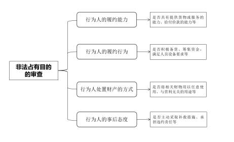
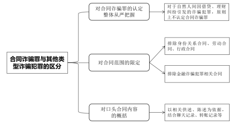
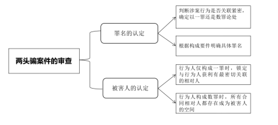

### **合同诈骗案件的审理思路和裁判要点**

合同诈骗罪是诈骗犯罪在市场经济领域的特殊类型，指行为人以非法占有为目的，在签订、履行合同过程中，骗取对方当事人财物，数额较大的行为。合同诈骗犯罪具有隐蔽性强、手段多样等特点，极大地损害了相关当事人的经济利益，严重阻碍市场经济的健康发展，应予以严厉打击。司法实践中，对于本罪与民事合同欺诈、与其他类型诈骗犯罪的区分，“两头骗”案件、犯罪金额的认定等问题上均有较大争议。为准确把握该类案件特点，统一法律适用，现结合典型案例，对合同诈骗案件的审理思路和裁判要点进行梳理、提炼和总结。

一、典型案例

**案例一：合同诈骗罪与民事合同欺诈的区分认定**

鞠某明知A公司无能力代运营大量电商店铺，仍伙同他人雇佣业务员与多名被害人签订提高电商店铺交易量、等级的服务合同，并收取费用。后A公司未按约履行，仅向被害人提供了少量与合同约定无关的基础服务，所收款项除少部分用于A公司日常开支外，大部分被鞠某等人以分红、提成等方式瓜分。本案的争议焦点在于，对于鞠某等人实施的行为，应以合同诈骗犯罪还是民事合同欺诈定性。

**案例二：合同诈骗罪与其他诈骗犯罪的区分认定**

宋某长期为B公司发运药品。某日，宋某与B公司再次就药物的代办运输、服务费用、履行方式等具体内容达成口头约定，后宋某在运输途中将部分药品藏匿并变卖。本案的争议焦点在于，宋某与B公司口头达成约定的事实是否可以认定为签订合同，并对宋某以合同诈骗罪论处。

**案例三：“两头骗”型合同诈骗案件认定**

周某、陈某以非法占有为目的，假借购买二手房名义，先向被害人支付购房首付款，谎称向银行贷款支付购房余款，骗取被害人的房产过户后，再将房产抵押给他人借款，所得款项用于二人偿还个人欠款及挥霍。本案的争议焦点在于，应如何准确认定案件的被害人，以及以何种罪名评价涉案行为。

**案例四：合同诈骗案件犯罪金额认定**

在无实际货源的情况下，季某谎称有稳定渠道可低价供应某品牌纸尿裤。被害人彭某信以为真向季某订购。季某收取货款后，以高价从该品牌天猫官方旗舰店购买少量产品发货，连续诱骗彭某支付货款。本案的争议焦点在于，认定本案犯罪金额的基准是已履约部分产品的货值，还是双方约定的货值。

二、合同诈骗案件的审理难点

**（一）与民事合同欺诈区分难**

合同诈骗罪是一种犯罪行为，合同欺诈则是一种民事违法行为。在市场交易过程中，合同相对方为谋取利益而采取合同欺诈手段的情况并不少见。合同诈骗犯罪与民事合同欺诈行为在外观表现上差异不明显，较难分辨，如何从个案中锁定关键事实，准确认定行为人的非法占有目的，是审理中的难点。

**（二）与其他类型诈骗犯罪区分难**

作为诈骗罪的特殊类型，合同诈骗罪在行为逻辑构造、具体手段等方面与其他诈骗犯罪类似，在客观层面易混淆。特别是诈骗与合同诈骗犯罪在入罪门槛和量刑档次均存在差别，如何对本罪名所涉合同范围进行界定，也是区分认定中的难点。同时在实践中，大量的交易采用口头形式约定，合同存在与否的界限模糊。

**（三）“两头骗”案件处断难**

“两头骗”案件中，行为人在与一方签订合同、占有特定财物后，再次通过伪造材料等方式与另一方签订处分上述财物的协议，非法占有财产。此类案件中，行为人实施的不同行为关联紧密，出现了多个合同相对方财产受损的情形。由此，在被害人的认定、罪名的论处等问题上出现一定争议。

**（四）犯罪金额认定难**

合同诈骗犯罪金额的认定事关量刑，相关标准有待明确：一是行为人在犯罪过程中或多或少会承担一定成本，该犯罪成本从犯罪金额中扣除的标准尚待明确。二是行为人以部分履行方式诱骗钱款的，已履行部分金额应从犯罪金额中扣除，但该部分价值应以合同约定价格还是实际价值认定尚待明确。

三、合同诈骗案件的审理思路和裁判要点

考虑到合同诈骗罪与民事合同欺诈、其他诈骗犯罪存在共性，在审理该类案件时，应重点围绕合同诈骗罪的犯罪构成要件、保护法益，以准确认定罪与非罪、此罪与彼罪。需要说明的是，在犯罪金额的认定及涉“两头骗”案件的审理中，应在遵循基本判断规则的基础上，结合具体案情作出认定。

**（一）合同诈骗案件与民事合同欺诈的区别认定**

合同诈骗案件与民事合同欺诈的最主要区别在于，行为人是否具有非法占有的目的。实践中，对非法占有目的的准确推定，有赖于对客观事实的详尽调查、分析。根据《中华人民共和国刑法》第224条、《最高人民法院关于审理非法集资刑事案件具体应用法律若干问题的解释》第7条，以及《全国法院审理金融犯罪案件工作座谈会纪要》的文件精神，在审查合同诈骗行为人是否具有非法占有目的时，应重点关注行为人的履约能力、履约行为、取得财产后的处置方式、事后态度等方面，进行综合判断。

 

**第一，行为人有无履约能力**。行为人在签订合同时的履行能力，是评价其主观目的的重要因素，如不具有合同约定的履约能力，通常情况下可以推定其具有非法占有目的。认定行为人是否超出履约能力，主要考察合同的关键要素能否得到履行。行为人约定了自身明显没有能力或者条件提供货物或服务的，约定的付款金额明显超出自身能力的，约定的给付时间不具有现实可行性的，或仅准备少量资金、货物诱骗合同相对方履约等情形的，均可认定不具有履约能力。实践中，还存在没有履行能力的行为人故意制造或肆意认定对方违约，从而骗取保证金和违约金，应注意甄别。需要注意的是，有履约能力的行为人为提高签约成功率，签约时虽夸大部分事实，但未虚构合同主要条款相关事实的，因履行合同并不存在实质障碍，一般难以认定其具有非法占有目的。

**第二，行为人有无履约行为**。在合同诈骗案件中，行为人通常不具有履行合同的行为，即使存在部分履行，也只是以此作为诱饵欺骗被害人，可以推定行为人具有非法占有目的。相反，行为人积极履行合同的，一般可排除其具有非法占有目的。如行为人在履约过程中积极备货、筹集资金，在人员、设备等方面尽力满足合同约定，可认定为积极履行合同。行为人虽然在签约时履约能力不足，但后续能积极创造条件履行合同，或者在履约过程中，因突发状况、不可抗力等因素而丧失履约能力的，一般也不认定其具有非法占有目的。实践中，很多被告人采用“拆东墙补西墙”方式实施连环诈骗，表面上部分合同虽已履行完毕，但实质上对于承担的整体债务并未真正履行，不能认定其有履约行为。

**第三，行为人处置财产的方式**。行为人获取财物后的占有处置行为，是判定其是否具有非法占有目的的重要标准。以下情形通常可以认定行为人具有非法占有的目的：1.行为人将骗取的财物任意使用、肆意挥霍，不用于生产经营活动，或将骗取的资金用于高风险投资项目，如炒股、炒期货等活动。2.行为人将骗取的资金用于赌博、高利贷等非法活动或其他犯罪活动，造成资金客观上无法归还。3.行为人在骗得财物后，抽逃、转移资金、隐匿财产，或者通过隐匿与销毁账目、假破产、假倒闭等方式，逃避返还。在认定财产处置相关事实时，应结合审计报告、银行或平台流水、收付款凭证等材料进行全面核实，尽可能明确资金去向。若无法完全查清去向，但能确定大部分资金已被其任意使用，也可认定行为人具有非法占有目的。

**第四，行为人的事后态度**。事发后，行为人对由其造成的损害结果的态度，也能从侧面体现是否具有非法占有目的。若行为人主动采取补救措施、承担违约责任的，不宜认定行为人具有非法占有目的。反之，若在损害结果发生后，行为人推脱责任、隐匿逃避，或是采用“拆东墙补西墙”的方式转嫁损失的，则一般可以认定其具有非法占有目的。

最后，需要说明的是，在认定非法占有目的时，应允许辩方提出反证。原因在于，主观事实只能根据客观行为推断得出，该推断必须建立在“证据确实充分，准确查明案件客观事实”的基础上，故应充分重视被告人的辩解和辩护人的辩护意见，尤其应重点审查被告人关于担保真实性、钱款用途的辩解。审理时，应合理界分控辩双方的证明责任，如果辩方提出有关财产去向、具有履约能力等主张，应当提供相关证据。经审核，确实有正当理由和证据的，可以排除非法占有目的。

总之，对行为人非法占有目的的认定，是一个综合判断的过程。不能基于孤立的事实武断认定，而应从整体上把握所有相关事实，在充分评价、分析的基础上，审慎推定。

如案例一中，鞠某等人并不具备履约能力，后续履约过程中，A公司提供的基础服务也不能达到对方的合同目的。在财产处置方式上，鞠某等人未将钱款用于A公司生产经营，而是通过分红、提成等方式据为己有。鞠某等人亦未能提供证据证明钱款用于公司经营。故结合以上因素，应认定鞠某等人具有非法占有目的，构成合同诈骗罪。

**（二）合同诈骗罪与其他类型诈骗犯罪的区分认定**

是否侵害社会主义市场经济秩序，是合同诈骗罪与其他类型诈骗罪的主要区别。因此，并非所有涉合同犯罪都可纳入合同诈骗罪的范畴，该罪所涉合同范围应严格限定在市场经济领域，以免认定出现偏颇。

 

**1****、对合同范围的限定**

如前所述，并非所有利用合同实施诈骗的行为均应以合同诈骗罪论处。本罪所涉合同系平等经济主体在生产经营领域内签订的合同，必须体现一定的市场经济属性。实践中，合同诈骗罪的追诉标准和法定升格刑的数额标准高于普通诈骗犯罪，对合同诈骗罪的认定总体上应从严把握，尤其对于自然人间因借贷、理财纠纷引发的诈骗犯罪，在入罪时原则上可考虑不以合同诈骗罪论处。

其一，合同内容与市场交易无关的，如身份关系合同、劳动合同、行政合同等，一般不认定为合同诈骗罪的“合同”。比如，行为人谎称能够帮助被害人子女入学，通过与害人签订教育咨询服务合同行骗的，该合同虽然在名义上与提供服务有关，但学生入学就读具有行政管理属性，不属于市场交易，故对行为人应以刑法第266条诈骗罪认定。又如，行为人采取欺骗手段，以符合农机补贴条件的农民名义，与农机主管部门签订购机补贴协议，低价购得农机具并出售的，因所涉国家农机购置补贴系相关主体根据政策实施的行政行为，不属于市场交易，应认定行为人构成诈骗罪。

其二，金融诈骗犯罪的排除。金融诈骗犯罪虽也涉及合同履行，如贷款诈骗、票据诈骗等，但因与合同诈骗罪侵害的法益不同，刑法上以不同罪名论处，审理时应注意区分。分辨时应从合同的商业实质出发，准确判断所涉法益，如主要涉及投融资、保险等金融领域，一般应认定涉及金融法益，如主要涉及商品交易、服务提供等市场交易领域，一般应认定涉及市场经济秩序法益。需要注意的是，案件如涉及资金借贷类合同的，应着重分析资金借贷背后的目的以及对市场秩序的影响，对于行为人利用金融性质借贷合同实施诈骗的行为，一般不认定构成合同诈骗罪。

有两类情形需要说明。第一，部分无名合同兼具财产、人身性质，履行时也涉及身份关系，如演艺经纪合同等，行为人利用此类合同行骗的，因被害人被骗取财物缘于对合同财产条款的履行，而非基于人身关系的财产分配，可以合同诈骗论处。第二，担保行为虽不属于市场交易，但其若服务于其他交易行为，亦可认定与社会主义市场经济秩序存在关联。对于这种与市场交易有紧密关联，并造成严重损害后果的虚假担保行为，可纳入合同诈骗罪范畴。

**2****、口头合同的审查**

合同诈骗罪的成立，主要是基于行为人的虚假意思表示与被害人的真实意思表示达成一致，对合同的形式并无特别要求。有关合同应以书面形式缔结的法规已被废止，如再将“合同”限定为书面形式，不仅缺乏部门法依据，也与设立本罪以维护市场经济秩序的目标相悖。因此，合同诈骗犯罪中的合同包括口头形式，只要涉案双方就关键条款达成一致，即可认定合同的存在。

在审查口头合同时，主要以相关供述、陈述为依据，再结合其他证据确定约定内容。近年来，行为人与被害人间的口头合同多通过社交软件达成，相关聊天记录、电子数据都可作为认定证据，公司员工、服务或货物提供者等知情人的证言、转账记录等也可从侧面印证。需要说明的是，如涉案双方对约定内容的说法各不相同的，不能一味采信被害人的主张，而应结合交易实际，慎重审查一方说辞是否存在逻辑漏洞，必要时通过当庭质证等方式进行查实。

如案例二中，宋某与B公司已就服务内容、费用、履行方式等关键条款达成一致，可认定涉案合同的存在。同时，双方长期从事相关交易，具备常态化的特征，也可侧面印证双方约定的可行性与现实性。

**（三）“两头骗”行为模式特殊问题的认定**

行为人在“两头骗”案件的前后阶段一般都有欺骗行为，即先签订合同骗得一方当事人财物，后以该财物为工具采用抵押等方式，与另一方当事人签订第二份合同骗取钱财。“两头骗”案件只是对相同特征案件的归纳，不同个案在事实上仍有较大差异。审理时，要以类型化思维为导向，先明确好原则性的认定思路，再结合个案具体情况作出处理。

 

**1、“两头骗”案件的罪名认定**

实践中，“两头骗”案件涉案行为可能构成合同诈骗或诈骗一罪，亦可能同时构成合同诈骗、诈骗两罪。具体区分时，除了依据行为是否符合诈骗罪、合同诈骗罪的构成要件外，亦需要运用罪数理论，评价涉案行为间的具体关联。一般认为，若行为人前后实施的行为间存在紧密关联，则可在整体上视作一个欺骗行为，最终对行为人以一罪论处。在关联性的判断上，应考量前行为是否系后行为的实施条件，前后行为是否具有包容关系或牵连关系，行为人在犯罪预谋时是否将多个行为作为整体准备，前后行为是否分别侵犯了不同法益等因素，予以综合评价。在明确对行为人应以一罪还是二罪论处后，即可根据上述合同诈骗罪与其他类型诈骗犯罪的区分要点进一步明确罪名，得出最终结论。

**2、“两头骗”案件的被害人认定**

“两头骗”案件中的被害人，并不等同于因“两头骗”导致财产受损的涉案人员。司法实践中，可在罪数确定的基础上，分析财产受损的事实与犯罪行为间的关联，以准确认定案件被害人。（1）行为人构成一罪时，应根据前后行为的特点，选出与行为人获利关联最密切、与犯罪结果有直接因果关系的行为，将该行为对应的相对方认定为案件被害人。（2）行为人构成数罪时，由于数个行为侵犯了不同相对人的财产权益，这些相对人均可认定为被害人。需要说明的是，此时还应一并考虑在案财产的分配问题。制定财产处置方案时，应通盘考虑不同案件之间的关联，结合各被害人的过错、行为人实施手段欺骗性的高低等因素综合分析处置。

如案例三中，周某、陈某所实施的犯罪行为由两个环节组成，第一个环节中，行为人通过虚构买房事实、隐瞒将相关房产抵押套现的真实意图等手段，将相关房产骗由自己支配。第二个环节中，行为人则使用已支配的房产抵押借款，最终实现挥霍目的。虽然上述两环节都存在“骗”的成分，但刑法意义上的欺骗行为主要集中在第一个环节，且相关行为实施完毕后，卖房人便已失去产权，房产亦处于行为人的实际控制下，可据此认定犯罪已既遂，且将房产所有人作为案件被害人。至于行为人后续的抵押借款行为，则属于犯罪既遂后的变现行为，应与前行为视作一个整体评价。同时，由于本案主要侵害的是房屋买卖的市场秩序，对行为人最终应以合同诈骗罪一罪论处。

**（四）犯罪金额的审查要点**

**1、行为人支出的扣除标准认定**

《全国法院审理金融犯罪案件工作座谈会纪要》规定，行为人为实施金融诈骗行为而支付的中介费、手续费、回扣等，或者用于行贿、赠与等费用，均应计入金融诈骗的犯罪数额，但应当扣除案发前已归还的数额。纪要明确行为人诈骗犯罪过程中的部分支出可予扣除，并对扣除的标准做出间接指引。根据该文件精神，诈骗类案件中，若行为人的部分支出能直接弥补被害人遭受的实际损失，则该笔支出对应金额可从犯罪金额中扣除。若否，则应将行为人的相应支出作为犯罪成本，计入犯罪金额。常见不予扣除的情形如下：一是行为人为履行合同而支付他人的中介费、手续费、交易费等。该部分支出系行为人为实施犯罪而付出的成本，不属于对被害人损失的弥补，故不从犯罪金额中扣除。二是行为人为搪塞被害人而提供不符合合同目的的支出。如被害人要求行为人提供N95规格口罩，行为人在收款后仅发出了少量普通口罩，被害人在接收货物后，合同的交易目的不能实现，不应将该部分交付的货物从犯罪金额中扣除。

**2、已履行部分金额的认定**

对于行为人部分履行后应从犯罪金额中扣除的金额，有合同双方约定价格、市场公允价格、双方历史交易价格等多种认定标准。司法实践中，一般以市场公允价格作为计算基准。

具体而言：（1）行为人若以低价供货为诱饵实施合同诈骗犯罪，应根据相关货物的市场公允价格计算已履行部分的价值，而非以双方约定的低价为基础计算。原因在于，行为人的部分低价履行仅是犯罪诱饵，是其继续实施犯罪的一种手段，以此确定犯罪金额无法体现商品或服务在流通过程中的实际价值，还可能会使被害人通过犯罪获益。（2）行为人连续实施多个合同诈骗行为，若以后骗得财物履行前合同约定内容的，应扣除行为人归还部分金额，按实际未归还的金额总体认定犯罪金额。

如案例四中，季某以高价从某品牌天猫官方旗舰店购买纸尿裤产品，货物符合合同的目的，被害人亦接受了该部分履行，对该部分货物可从犯罪金额中扣除，对于收到的货物金额，可依据市场公允价格来进行认定。

（根据刑庭胡健涛、洪佳一提供材料整理）