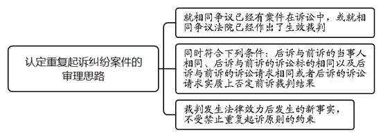
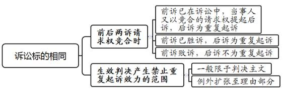
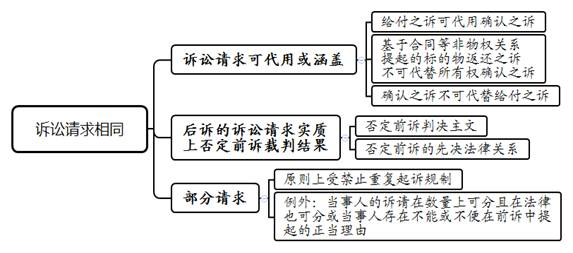
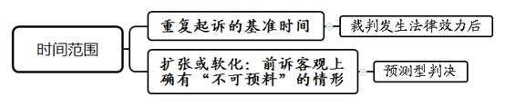

### **认定重复起诉纠纷案件的审理思路和裁判要点**

重复起诉，是指在前诉已处于诉讼过程中或者前诉裁判生效后，相同当事人对相同诉讼对象再次提起诉讼。《民诉法解释》第247条对重复起诉的识别作出具体规定，同时也规定了禁止重复起诉原则。禁止重复起诉具有避免矛盾判决、保障纠纷一次性解决等重要作用。然而在实务中，仍存在法律适用不统一、同案不同判的现象，有必要进一步明晰。现结合司法实践中的典型案例，对认定重复起诉纠纷案件的审理思路和裁判要点进行梳理、提炼和总结。

一、典型案例

**案例一：涉及当事人相同的认定**

前案中，叶某向法院诉请要求周某返还侵占的宅基地，法院作出生效判决对系争宅基地使用权予以分割。后叶某、周某均已死亡。叶甲为叶某的唯一继承人，周甲为周某的唯一继承人。本案中，叶甲向法院诉请要求判令周甲返还被侵占的宅基地。

**案例二：涉及诉讼标的相同的认定**

前案中，A公司诉请撤销系争协议，法院认为A公司未能提供证据证明系争协议存在显失公平、欺诈，且行使撤销权已经超过一年除斥期间，遂判决驳回A公司撤销系争协议的诉讼请求。本案中，A公司以B公司、C公司恶意串通，损害其利益为由诉请判令系争协议无效。

**案例三：涉及判决理由是否产生禁止重复起诉效力的认定**

前案中，王某起诉游某等七人，要求确认系争房屋产权归王某所有，理由包括涉案协议《家庭协议与申请》中的“王某”字样并非其本人签署。最终法院作出生效判决，在判决理由中认定《家庭协议与申请》有效。本案中，王某请求法院判令确认其与游某等七人之间签订的《家庭协议与申请》无效，理由为《家庭协议与申请》上王某签名系伪造，而拆迁安置补偿协议的签署以此为基础，该《家庭协议与申请》损害了王某的拆迁利益。

**案例四：涉及拆分诉讼请求多次起诉的处理**

前案中，张某与胡某因居间合同发生争议。张某认为，根据合同约定自己应获得1050万元居间报酬。因担心败诉承担全部诉讼费，张某先诉请胡某支付180万元居间报酬，胜诉后，再次起诉要求胡某给付870万元居间报酬。

二、认定重复起诉纠纷案件的审理难点

**（一）当事人相同认定难**

“当事人相同”不必然等同于“当事人同一”，重复起诉制度的规范效力可以在特定情形下合理地扩张至特定第三人。司法实践中，诉讼主体扩张的范围与条件不甚明晰，如何限定扩张的边界争议较大，如在诉讼继受中继受人是否为相同当事人、当事人以外的第三人是否受禁止重复起诉的规制等。

**（二）诉讼标的相同认定难**

关于诉讼标的的界定，理论和实务中存在争议和分歧。对诉讼标的范围作广义或者狭义的不同理解，直接影响认定构成重复起诉的范围。我国民事诉讼实务中采用的是传统诉讼标的理论，即诉讼标的是指特定的实体法上的权利主张或法律关系。司法实践中，如何判断前后两案诉讼标的是否一致，存在不同意见。

**（三）判决理由是否产生禁止重复起诉的效力认定难**

一般而言，前诉生效判决产生禁止重复起诉效力的范围限于法院对诉讼标的的判断，即判决主文。然而，若生效判决中产生禁止重复起诉效力的部分仅限于判决主文，不但浪费司法资源，而且存在造成矛盾裁判的风险。因此，有必要对生效判决产生禁止重复起诉效力的范围作出一定限度的扩张，但扩张的范围以及条件仍存在较多分歧。

**（四）拆分诉讼请求多次起诉处理难**

诉讼请求是当事人依据诉讼标的提出的具体权益主张。《民诉法解释》第247条将诉讼请求单独列明作为判断重复起诉的基准。实践中，是否允许当事人就同一性质的费用拆分诉讼，或者基于同一事实产生不同性质的费用是否能够分多次主张，存在争议。

三、认定重复起诉纠纷案件的审理思路和裁判要点

法院审理认定重复起诉纠纷案件，应坚持以下三个基本原则：**一是**纠纷一次性解决原则，即禁止就已经提起诉讼的事项，在诉讼进行中再次起诉，避免产生矛盾判决。**二是**法的安定性原则，即前案作出生效判决后，当事人不得就已经存在生效判决的同一事项再次起诉，目的是禁止重复讼争，维护法的安定性。**三是**程序保障原则，即程序上充分保障当事人的权利，此系法院判断案件是否属于重复起诉最基本、最重要的标准。除应兼顾以上三项原则作出判断外，必要时应及时向当事人释明重复起诉的构成要件与诉讼风险，在裁判文书中明确需通过另案诉讼解决的争议事项，以便更好地维护当事人的合法权益。

**（一）认定重复起诉的审理思路**

根据《民诉法解释》第247条规定，法院在判断后诉构成重复起诉时，首先，应判断就相同纠纷是否已有案件在诉讼中，或就相同纠纷法院已经作出生效裁判；其次，要判断前后两诉是否同时符合当事人相同、诉讼标的相同、诉讼请求相同或者后诉的诉讼请求实质上否定前诉裁判结果；最后，要判断后诉是否为前案裁判生效后发生的新事实、新纠纷，若是则不构成重复起诉。

**（二）认定重复起诉前提条件的审查要点**

根据《民诉法解释》第247条规定，认定重复起诉的前提条件是“当事人就已经提起诉讼的事项在诉讼过程中或者裁判生效后再次起诉”，所以应首先对前提条件进行审查认定。

**1****、“当事人就已经提起诉讼的事项在诉讼过程中”的认定**

认定后诉为重复起诉，首先要判定原告提起诉讼的事项已在诉讼进行中。对于识别“已经提起诉讼”的标准，实务中一般应以前案被法院正式受理为标准。我国民事诉讼法虽未有明确规定，但《民事诉讼法》第36条规定，原告向两个以上有管辖权的人民法院起诉的，由最先立案的人民法院管辖。从上述法条的立场来看，应以立案时间先后作为“已经提起诉讼”的判断标准。

实务中经常遇到的问题是，对于处在法院诉前调解阶段的案件，当事人再次起诉的，后诉是否属于重复起诉。实践中，诉调案件立案亦产生禁止当事人重复起诉的效力，该种做法一则促使当事人选择诉前调解等多元化纠纷解决机制，二则保障调解中双方的权利的行使与义务的履行。

**2****、“裁判生效后再次起诉”的认定**

首先，发生重复起诉效力的裁判必须是发生法律效力的裁判，包括最高法院的裁判，高、中院的二审裁判，以及依法不准上诉或者超过上诉期没有上诉的裁判。二审裁判以判决宣告时间为裁判生效时间。对于域外裁判的效力，涉外案件中存在我国法院和外国法院就同一争议都有管辖权的情形。从司法主权角度而言，除国际条约另有规定外，任何域外已经存在的诉讼，不应影响我国法院独立行使管辖权。从《民诉法解释》第531条、最高法院《第二次全国涉外商事海事审判工作会议纪要》第10条规定分析，除非某一域外判决已经通过承认与执行程序转化为我国域内判决，否则不发生禁止重复起诉的效力。

其次，生效裁定是否能构成重复起诉的问题。一般而言，程序性裁定并无此效力，但法院作出的不予受理或者驳回起诉裁定其理由部分具有禁止重复起诉的效力。起诉不符合《民事诉讼法》第122条规定的起诉条件，当事人再次起诉时，如果当事人对起诉条件已经予以补正，法院应予受理。

最后，《民事诉讼法》第127条第7项规定，判决不准离婚和调解和好的离婚案件，判决、调解维持收养关系的案件，没有新情况、新理由，原告在六个月内又起诉的，不予受理。此规定为禁止重复起诉原则的例外情形，六个月后允许当事人再次起诉。

**（三）认定重复起诉中当事人相同的审查要点**

《民诉法解释》第247条规定，构成重复起诉要求“前后两诉的当事人相同”，这里不仅包含原告和被告，还包括有独立请求权的第三人和判决承担责任的无独立请求权的第三人。

实践中前后两诉的当事人完全相同的情况并不多见，后诉当事人为避免被法院认定为重复起诉，往往会增减或变换当事人，使得后诉当事人与前诉形式上不同，此时需要结合诉讼标的要素综合判断前后两诉当事人是否相同：（1）如果前后两诉的诉讼标的实质相同，增加的当事人与案件没有事实与法律上的利害关系的，应认为前后两诉当事人相同；（2）在原告与被告诉讼地位对调，两诉的裁判结果会产生矛盾关系时，也应认为前后两诉当事人相同。例如，甲对乙提起合同无效之诉，在诉讼审理期间，乙对甲另行提起合同有效之诉，两诉应视为当事人相同。

禁止重复起诉的效力原则上限于诉讼当事人之间，但如果一概不容许禁止重复起诉的效力及于他人，则不能充分发挥诉讼的定分止争机能。因此，在特定情形下，允许将禁止重复起诉的效力扩张至特定第三人。重复起诉主体范围的扩张有如下基本类型：

**1****、因法定或约定的缘由替代权利人进行诉讼的主体**

在诉讼中，实体法上的权利主体或者法律关系以外的第三人，以自己的名义，为了他人的利益或者代表他人的利益，就因该实体权利或者法律关系所产生的纠纷而提起诉讼，判决效力及于原来的权利主体。

在上述情形下，案件原告根据法定或双方约定的理由代为行使原民事法律关系主体的利益，原民事法律关系主体受到禁止重复起诉原则的规制。主要包括以下几种情形：（1）继承开始时，为维护胎儿的合法权益，由其母亲代为提起的诉讼；（2）宣告失踪的财产代管人参与的诉讼；（3）破产案件中的破产管理人参与的诉讼；（4）股东代表诉讼中的代表人参与的诉讼；（5）《民法典》和《保险法》中的代位权诉讼，此时债务人对次债务人就同一笔债务的诉讼受前诉代位权诉讼禁止重复起诉的约束；（6）最高法院《关于人民法院民事执行中查封、扣押、冻结财产的规定》第12条中共有人提起的析产诉讼或者申请执行人提起的代位析产诉讼；（7）《民事诉讼法》第56条规定中当事人一方人数众多的共同诉讼中由当事人推选代表人进行的诉讼；（8）业主委员会代替业主参加的诉讼；（9）《著作权法》第8条规定的著作权集体管理组织行使著作权的诉讼。

**2****、诉讼继受的继受人**

诉讼继受是指诉讼之前或者诉讼中止、终止后，当事人权利义务关系的承受主体发生转移的情况，主要分为概括继受和特定继受两种类型。

对于在诉讼过程中的概括继受人，根据《民诉法解释》第55条规定，诉讼程序中止的，由法定承受诉讼之人继续进行诉讼。对于裁判生效后的概括继受人，最高法院《关于人民法院执行工作若干问题的规定（试行）》第16条、《民事诉讼法》第239条规定，概括继受人的执行问题由其权利义务承受人履行义务。因此，概括继受人受禁止重复起诉原则的规制。

如案例一中，叶甲为前案原告叶某的第一顺位继承人，周甲为前案被告周某的第一顺位继承人，因此本案当事人作为前案当事人的概括继受人，概括继受前案当事人的权利义务，前案的生效裁判对本案产生禁止重复起诉的效力。

特定继受分为法律关系的继受和特定标的物的继受。当事人已经提起诉讼的事项在诉讼过程中时，对于法律关系的继受，依据《民诉法解释》第249条规定仍由原诉讼主体进行诉讼，但该裁判对权利义务受让人具有约束力。对于特定标的的继受，因物权的对世性与债权的相对性而有所不同。在诉讼标的是单纯物权请求权或者是物权请求权与债权请求权竞合的情形下，禁止重复起诉的效力应当向新占有人扩张，物权的继受人与让与人应当认定为当事人同一；在诉讼标的为单纯债权的情形下，禁止重复起诉的效力不应当向新占有人扩张，例如，甲向乙购买某一批货物，甲付款后乙拒不交付，甲向法院起诉并胜诉。乙又将该批货物转卖并交付给丙。此时，因为甲对乙的胜诉判决具有相对性，故这一判决的效力不可直接扩张到丙，但甲可以丙为非善意第三人为由提起诉讼。

**3****、请求标的物的持有人**

在请求返还特定物的诉讼中，专门持有该特定物的人即标的物占有人，也受禁止重复起诉原则的规制。在此情况下，标的物持有人不具备通过诉讼予以保障的实质利益。需要强调的是，占有人必须是为当事人的利益而占有标的物的人，且在占有中无自己的占有利益或者其他任何利益，如管理人、同住人等。《民事诉讼法》第256条、《民诉法解释》第493条第1款、最高法院《关于人民法院执行工作若干问题的规定（试行）》第42条等，对上述问题均有明确规定。因此，如果判决确定的特定物为持有人占有时，权利人只需通过执行程序实现判决效力，而无需再次起诉。

**4****、当事人以外的第三人**

一般而言，判决效力的主体范围以当事人为限，但为使法律关系安定，依照法律规定或司法解释，当判决的结果会对不特定的第三人产生拘束力时，判决的效力也可以扩张至当事人以外的第三人，其中最为常见的是公司决议无效或撤销之诉。例如《公司法》第22条规定的公司决议可撤销之诉，决议可撤销之诉的原告为起诉时具有股东资格的股东，被告为公司。然而此时生效裁判的效力不局限于诉讼中的股东和公司，还及于其他股东和第三人，但善意第三人除外。

**（四）认定重复起诉中诉讼标的相同的审查要点**

根据《民诉法解释》第247条，重复起诉要求“后诉与前诉的诉讼标的相同”。此处的诉讼标的是指，特定的实体法上的权利主张或法律关系。

判断诉讼标的是否同一，需要原因事实与法律关系均为同一。如案例二中，前案中A公司是请求撤销系争协议，并且前案没有对系争协议的效力进行审理。本案中，A公司诉请判令系争协议无效，认为B公司、C公司恶意串通损害其利益，为此提供初步证据证明。因前案与本案所依据的法律关系不同，故本案不属于重复起诉，法院对后诉应当进行审理。

**1****、请求权竞合时的处理**

实践中，在请求权竞合的情形下，当事人基于不同的法律关系提出相同诉讼请求，属于不同的诉讼标的，但此时为避免双重给付、诉讼拖延等不良法律后果，在请求权竞合时，应作以下处理：（1）前诉仍在诉讼过程中，当事人又以竞合的请求权提起后诉，此时后诉属于重复起诉；（2）前诉已有生效判决，当事人在前诉已胜诉的情形下，对后诉应以不具有诉的利益为由不予受理；在前诉败诉的情形下，则可允许当事人以前诉中未提出的另一请求权再次提起诉讼。

**2****、生效判决产生禁止重复起诉效力范围的认定**

在诉讼审理中，产生禁止重复起诉效力的，一般仅限于法院对诉讼标的的判断，即判决主文。为减少当事人讼累，避免产生矛盾判决、影响司法公信力，必要时可对生效判决产生禁止重复起诉效力的范围作一定限度的扩张。

司法实践中，在满足以下三个条件时，生效判决的理由部分产生禁止重复起诉的效力：一是前后诉的争议焦点均应为对作出判决结论具有先决性的事实或法律争点。需要注意的是，已为前案生效判决确认的基本事实没有禁止重复起诉的效力，只有一定的拘束效力。此时根据《民诉法解释》第93条第5项、最高法院《关于民事诉讼证据的若干规定》第10条第1款第6项规定的预决效力条款，援引生效判决确认事实具有免证力，但允许相对方举证推翻。二是前诉当事人对相关争点进行了实质性辩论。前诉当事人之间若未形成实质性攻击防御的争点，不产生禁止重复起诉的效力。例如，被告没有应诉的缺席判决的裁判理由不具有禁止重复起诉的效力。三是法院对于该争议焦点已作出实质判断。法院在审理案件中可能会确立几个争议焦点，但法院有时会在判决中认为只需根据一个争议焦点就足已作出裁判，而不必再对其他争议焦点作出实质判断。在此情形下，未作出实质性判断的争点，自然不能产生禁止重复起诉的效果。

如案例三中，对比两起案件，虽然判决主文所涉及的法律关系及当事人均略有差异，但综合两起案件的情况以及禁止重复起诉的基本原理，应认为后案的起诉违反禁止重复起诉原则。首先，前案中《家庭协议与申请》是协商动迁利益分配的基础，要求认定上述协议无效是王某提出前案诉讼请求最主要理由，同时也是后案唯一的诉讼请求。其次，前案就《家庭协议与申请》是否有效的问题，双方当事人进行了实质性的诉辩，双方的辩论权得到充分的程序保障。最后，前案生效判决的判决理由已经认定《家庭协议与申请》有效。因此，前案判决理由中对《家庭协议与申请》的判断对后案产生禁止重复起诉的效果。因此，王某再次提出确认《家庭协议与申请》无效的诉讼，违背禁止重复起诉的基本原则。

**（五）认定重复起诉中诉讼请求相同的审查**

诉讼请求是当事人依据诉讼标的提出的具体权益主张。根据《民诉法解释》第247条规定，构成重复起诉条件包括“后诉与前诉的诉讼请求相同，或者后诉的诉讼请求实质上否定前诉裁判结果。”判断当事人的诉讼请求是否同一，除完全一致外，诉讼请求可代用或涵盖时亦应认定同一，如给付之诉可代用确认之诉的情形。

需要注意的是，存在以下两类诉讼请求不能代用的情形：一是基于合同等非物权关系提起的标的物返还之诉不可代替所有权确认之诉。如甲起诉乙，先以租赁物返还请求权提起返还特定物的诉讼，后又提起确认此特定物为甲所有的诉讼，此时前后两诉请不可代用，因为标的物的出租人并不当然的为标的物的所有人。诉讼请求可代用的情况须系属同一个诉讼标的，同一原因事实的情形。二是确认之诉不可代替给付之诉。只有给付之诉可代用确认之诉，反之则不可。例如丙起诉丁，先提起借款合同有效之诉，后提起借款返还之诉，此时前后两诉请不可代用。

**1****、后诉的诉讼请求实质上否定前诉裁判结果的认定**

前后两诉的诉讼请求相反时，应认定当事人的诉讼请求同一。关于“后诉的诉讼请求实质上否定前诉裁判结果”，有两种情形：一是直接否定前诉判决主文，如前诉诉请确认合同有效，对方当事人在后诉中诉请确认合同无效。二是后诉的诉讼请求直接或间接否定前诉的先决法律关系，进而否定前诉的判决主文。例如，前诉判决支持继续履行合同，后诉请求确认该合同无效。此时后诉原告没有直接诉请要求不履行合同，而是请求确认合同无效，直接对前案履行的先决法律关系即系争合同有效进行否定。

**2****、部分请求的处理**

部分请求是指起诉人在起诉时仅提出一部分诉讼请求而非整体提起诉讼。在此情形下，余额的请求是否被前诉禁止重复起诉效力覆盖存在争议。我们认为，就同一性质的费用拆分金额提起多个诉讼时，提起后诉要求支付剩余的金额原则上属于重复起诉，应予禁止。若当事人的诉请不仅在数量上可分且在法律上也可区分，或当事人存在不能或不便在前诉中提起的正当理由，则允许其分开诉讼，例如履行期限不同、设有担保、附有条件等情况。当事人部分起诉时，法官应进行释明，告知当事人对同一债权应当全额起诉，若部分起诉则剩余金额不得再另案主张。是否允许诉讼请求拆分，应既要考虑法官释明权的行使与程序保障权的实现是否到位，又要考虑举证困难等具体原因。

如案例四中，张某两次起诉均请求给付居间报酬，且系基于同一合同项下的同一实体请求权，属于就同一性质的费用拆分金额提起多诉的情形。张某拆分起诉的主要理由是规避败诉缴纳全额诉讼费的风险，不属于“存在不能或不便在前诉中一并起诉的正当理由”的情形，故后诉属于重复起诉。

**（六）认定重复起诉时间范围的审查**

**1****、重复起诉基准时间的认定**

实践中，同一当事人的同一纠纷经判决确定后，有可能出现新的情况或者发生新的变化，此时确定的判决不能对新情况或者新变化产生拘束力。

判决形成的具体时间即为重复起诉的基准时间。我国法律没有规定重复起诉的基准时间，但《民诉法解释》第248条对不适用禁止重复起诉原则的情况作出规定，明确裁判发生法律效力后发生新事实的，当事人再次提起诉讼则不适用禁止重复起诉原则，法院应当依法受理。因此，应当以“裁判发生法律效力后”作为重复起诉的基准时间。裁判发生法律效力后发生的新事实，是重复起诉基准时间之后发生，并未被生效判决所确定，故不应受禁止重复起诉原则的约束。

因此，如果当事人在重复起诉的基准时间之后主张有新情况而提出新的诉讼，法院需要审查当事人主张的新情况是新产生的案件事实还是新发现的证据，前者根据《民诉法解释》第248条，可认定构成新诉；后者根据《民事诉讼法》第207条第1项、《民诉法解释》第386条，当事人可以申请再审。例如，当事人基于人身损害中的后遗症、器官功能恢复训练所必要的康复费、适当的整容费以及其他后续治疗费等嗣后发生的事实起诉要求赔偿，不属于重复起诉。因上述事实属于裁判生效后新产生的案件事实，故后诉不属于对前诉裁判效力的突破，应当适用《民诉法解释》第248条、最高法院《关于审理人身损害赔偿案件适用法律若干问题的解释》第6条第2款，赔偿权利人可以待前述事实实际发生后另行起诉。

**2****、认定重复起诉时间范围的例外**

按照重复起诉的基准时间的基本原则，当事人在后诉中提出的审理事项如发生在裁判生效之前，则受到重复起诉禁止效力的约束，在后诉中原则上不允许提出。但在某些特定情况下，为缓合重复起诉时间范围的刚性约束，避免统一、机械的规定产生不公的后果，需要作出例外的规定。重复起诉时间范围的例外情形，应符合前诉客观上确有“不可预料情形”的要件。实务中主要存在于预测型判决中。实践中，法院基于对当事人之间未来一段时间内法律关系状态的预测，会判令败诉方在未来一段时间内向对方持续履行给付义务。预测型判决的裁判效力指向未来，而一般案件的裁判效力则是指向过去。对于此类判决确认的权利状态，可能因某种原因发生变动，此时需要对预测性判断的禁止重复起诉效力予以突破。如赡养费、扶养费、抚养费案件，裁判发生法律效力后，虽生效判决对未来一段时间的权利义务关系进行了确定，但是若一方当事人因新情况、新理由在生效判决确定的时间段内，再行起诉要求增加或者减少费用的，根据《民诉法解释》第218条规定，此类案件可以突破禁止重复起诉的原则，人民法院应作为新案受理，对上述已经审理过的事项再次审理。

**（七）当事人恶意规避重复起诉的处理**

实践中，当事人为规避重复起诉，往往会虚假增减、变换当事人使得后诉当事人与前诉形式不同，或提出不同理由以改变案由使后诉诉讼标的与前诉形式不同等。在此情形下，应认定为当事人属于恶意规避重复起诉，仍应以后诉构成重复起诉为由驳回起诉。

例如D公司在起诉前就相同的事实以不同的理由提起多次诉讼，判决均已生效。之后又在后诉中增加E公司作为被告，将后诉案由从委托合同纠纷变更为服务合同纠纷，看起来当事人和案由均不相同，后诉不属于重复起诉。但经审理查明，当事人将后诉案由从委托合同纠纷变更为服务合同纠纷，前后两诉虽然形式不一致，但诉讼标的实质相同，不影响诉讼标的同一性的认定。此外，D公司增加与后诉主要争议事实不存在实质性关联的E公司作为被告，属于虚增被告以规避禁止重复起诉的限制，不影响对当事人相同的认定，故后诉属于重复起诉。

四、其他需要说明的问题

在案件起诉审查阶段，法院对新诉是否构成重复起诉仅进行形式审查，在认定和处理时以保障当事人诉权为首要原则。如果形式审查后可以明确认定诉讼为重复起诉的，应当裁定不予受理；若不能明确的，则进入实体审理后再予确定。

（根据立案庭乔林、朱滨倩提供材料整理）