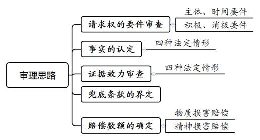
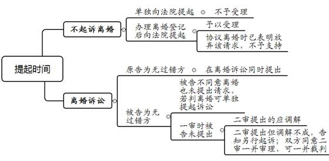
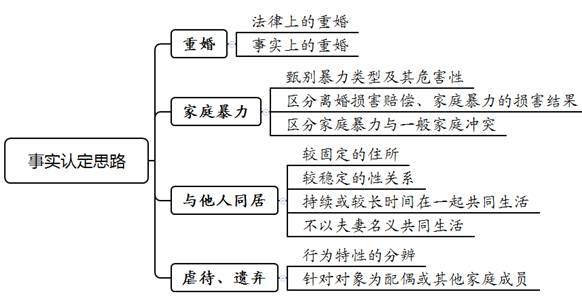

### **离婚损害赔偿案件的审理思路和裁判要点**

离婚损害赔偿，是指因夫妻一方存在重大过错致使婚姻关系破裂，无过错方可主张过错方对其遭受的损失予以赔偿的法律制度。《婚姻法》在2001年修订时首次确立离婚损害赔偿制度，《民法典》在此基础上新增“有其他重大过错”这一兜底条款，扩大了该制度的适用范围。上述规定有利于有效制约婚姻过错方、保障无过错方的合法权益，彰显了社会主义核心价值观，但在具体适用中也存在诸多分歧，亟待统一适法。本文结合司法实践中的典型案例，对该类案件的审理思路和裁判要点进行梳理、提炼和总结。

一、典型案例

**案例一：涉及损害事实的认定**

谭某与刘某办理离婚登记后，向法院提起离婚损害赔偿诉讼，称刘某长期对其实施家庭暴力，还与婚外异性同居多年，导致夫妻感情破裂。为此，谭某提供双方争吵的录音和报警回执单、刘某与异性开房的视频截图以资证明。刘某否认其实施家庭暴力，亦否认同居事实，表示双方婚后因常有争吵、感情不和而离婚。此外，刘某承认其确与婚外异性开过一次房，但当时已在与谭某办理协议离婚的过程中，不应成为谭某提起该诉的理由。

**案例二：涉及证据效力的判定**

张某与王某结婚后，王某被公司外派出国。王某回国后，因偶然机会发现张某的笔记本和一些避孕用品、药品。笔记本内，张某以《迈克的风流韵事》为题，撰写了主人公迈克与多名女子有染的文字内容。王某阅读后认为迈克即为张某的化名，遂起诉离婚，并要求张某赔偿感情损失。张某辩称，作为王某起诉依据的笔记本系其排遣寂寞的方式，内容并非事实，故不同意离婚与赔偿损失。

**案例三：涉及兜底条款的界定**

黄某与方某结婚15年，育有一女13岁，夫妻双方因女儿教育问题产生矛盾。方某对女儿是否亲生产生疑虑，遂带女儿前往鉴定机构进行亲子鉴定，结论为方某与女儿不符合遗传定律，即排除存在亲子关系。方某遂起诉要求与黄某离婚，并要求黄某承担损害赔偿责任。诉讼中，黄某同意离婚但不认可鉴定结论，亦不愿另行进行亲子鉴定。

**案例四：涉及赔偿数额的确定**

董某与陈某协议离婚后，董某诉至法院，称双方结婚后发现陈某存在嫖赌毒行为，给己方带来严重的精神打击和心理创伤，导致双方感情破裂而离婚，请求陈某支付离婚损害赔偿20万元。陈某承认自己因赌博行为被行政拘留，在婚姻中存在一定过错，但认为董某提出的离婚损害赔偿金额过高。

二、离婚损害赔偿案件的审理难点

离婚损害赔偿既可依附于离婚诉请提出，又可在离婚后单独主张。该类纠纷呈现过错事实隐密性、矛盾冲突激烈性、定性裁量复杂性等特点，如何精准把握案件事实和法律规定，作出符合法理情的裁判，存在诸多难点。

**（一）损害事实认定难**

由于《民法典》第1091条、最高法院《关于适用〈中华人民共和国民法典〉婚姻家庭编的解释（一）》第1、2条对于损害事实的表述较为概括、抽象，容易产生不同理解，认定损害事实存在一定难度。例如，“虐待”和“与他人同居”应当是“持续、稳定”的，但司法解释对何谓“持续、稳定”的状态却缺乏具体界定，且由无过错方证明该种状态也存在困难，造成不同法官对事实认定可能存在差异。又如，关于家庭暴力的认定，如何与一般的家庭冲突相区分亦需厘清。此外，离婚损害赔偿以“损害结果”实际存在为基础，其中有关人身、物质、精神损害的认定往往需要运用经验法则，这也极大地考验法官的裁判能力。

**（二）证据效力判定难**

由于家庭婚姻生活具有长期性、私密性，而伤害行为是非持续的，相应证据也易灭失，即便有所举证，施害方的过错与无过错方受损后果的因果关系也成为证明难点。原因在于：其一，提出诉请的主体一般为需要举证的无过错方，常因证据不足致使权益难以得到保护。其二，受害方为防止被对方发现，往往采取偷录偷拍、跟踪、私拆信件等秘密手段取证，间接证据乃至瑕疵证据较为普遍。其三，无过错方需提供达到民事诉讼法相应证明标准的举证，而证明标准较高常导致无过错方陷入举证欠缺的窘境。

**（三）兜底条款界定难**

对于无过错方有权请求损害赔偿的法定情形，《民法典》新增“有其他重大过错”这一概括式兜底条款。由于兜底条款的规定不够明晰，需由法官根据案件具体情况，结合过错情节、损害后果等因素，对过错方是否存在重大过错进行认定。实践中常出现的通奸、卖淫、嫖娼、赌博、吸毒等过错行为，同样可能导致双方离婚并给无过错方造成物质和精神的双重损害，而上述情形是否可直接适用该条款规定，实践中尚存争议。

**（四）赔偿数额确定难**

离婚损害赔偿包括物质损害赔偿和精神损害赔偿。由于导致离婚损害赔偿的情形不同，故需结合相应的法定因素、酌定因素，对赔偿的内容和数额予以综合考量。离婚过错方承担赔偿责任应以其行为所造成的实际损害为基础，但在实际裁判中，缺乏量化实际损害的标准或者进行“酌情认定”的具体规则。针对精神损害赔偿情形，在适用最高法院《关于确定民事侵权精神损害赔偿责任若干问题的解释》一般侵权损害赔偿规定的同时，考虑到离婚损害赔偿制度的特殊性和事实认定的复杂性，在确定具体赔偿数额时还需适用情理法相适应原则，因此处理难度较大。

三、离婚损害赔偿案件的审理思路和裁判要点

法院审理离婚损害赔偿案件，**首先**，应依法审查案件是否满足离婚损害赔偿请求的要件；**其次**，要甄别当事人主张的情形是否属于离婚损害赔偿的法定事由；**再次**，要判断当事人提供的证据能否构成相对完整的证据链以支持其主张；**最后**，若当事人的请求可予支持，还需结合离婚事由审慎确定离婚损害赔偿的具体数额。

**（一）离婚损害赔偿请求权的审查要件**

该类案件的特殊性，首先体现在请求权的特别要求上，审查请求权时具体需要注意以下几个方面：

**1****、****主体要件**

享有离婚损害赔偿请求的权利主体是具有合法婚姻关系的无过错方。因此，应注意排除不属于离婚损害赔偿请求权行使主体与对象的情形：（1）离婚损害赔偿针对的义务主体是有过错的配偶，对于与过错方损害行为有关的第三者，无过错方不能向第三者要求离婚损害赔偿，只能通过其他途径如主张侵权损害赔偿等维护权益。（2）该项制度的目的是对夫妻中无过错方因对方过错导致离婚而受到的损害进行救济和抚慰。因此，遭受过错方损害行为的子女等家庭成员，无权向过错方提起该诉请。

**2****、****时间要件**

提起离婚损害赔偿请求的时间是否符合规定，应当区分以下情形作出处理：（1）夫妻一方不起诉离婚而单独提起请求的，法院不予受理。（2）无过错方作为原告提出请求的，需在离婚诉讼的同时提出。（3）无过错方作为被告的离婚诉讼案件，被告不同意离婚也未提出离婚损害赔偿请求的，若判决离婚可就此单独提起诉讼。（4）无过错方作为被告的离婚诉讼案件，一审时被告未提出赔偿请求，二审期间提出的，应当进行调解；调解不成，应告知当事人另行起诉。双方当事人同意由二审法院一并审理的，二审法院可一并裁判。需注意的是，本情形及上述情形（3）中“离婚后一年内起诉”的除斥期间规定已废除。（5）当事人在婚姻登记机关办理离婚登记手续后，以《民法典》第1091条为由向法院提出请求的，除非在协议离婚时已经表明放弃该项请求，否则应当予以受理。

****

**3****、****积极要件**

无过错方提出离婚损害赔偿请求的，必须具备以下要件：（1）行为人对于离婚主观上必须存在过错，该过错是导致离婚的原因，否则不能支持离婚损害赔偿诉请。（2）导致离婚的过错情形应属于法定情形，若过错不属于法定情形的，离婚损害赔偿诉请不予支持。（3）过错方的损害行为造成损害结果，且损害行为与结果之间存在因果关系。未造成损害结果的，因损害行为不构成对无过错方合法权益的侵犯，也就无需赔偿。

**4****、****消极要件**

在审查离婚损害赔偿请求权要件时，需对排除适用离婚损害赔偿制度的以下要件进行审查：（1）无过错方在协议离婚中明确放弃离婚损害赔偿请求；（2）主张赔偿一方也存在过错；（3）过错责任人只能是配偶一方。

**（二）离婚损害赔偿的事实认定**

**1****、“****重婚****”****的认定**

重婚包含两种情形：一是有配偶者与他人登记结婚，即法律上的重婚；二是有配偶者虽未与他人登记结婚，但以夫妻名义对外共同生活，即事实上的重婚。对此，尤需审查事实重婚和婚姻过错方与他人同居的区别，主要在于是否存在对外示明虚假“夫妻身份”并得到他人认可的事实。因此，在审查是否存在以夫妻名义对外共同生活的事实时，应结合事实重婚“夫妻身份”的公示性与公认性的本质特征进行认定。

**2****、“****家庭暴力****”****的认定**

关于家庭暴力的认定，实践中存在一定分歧，但已形成以下共识：（1）甄别暴力类型及其危害性。身体暴力往往表现为殴打、捆绑、残害、限制人身自由等方式；精神暴力主要表现为侮辱、谩骂、诽谤、宣扬隐私、人格贬损、恐吓、威胁、跟踪、骚扰等行为。需要指出的是，暴力后果应达到导致双方离婚并需赔偿的程度。（2）在因家庭暴力引发的离婚损害赔偿案件中，法院在认定过错方的相关行为是否属于家庭暴力时，不以该行为造成伤害后果为前提，只要过错方作出暴力行为即可认定。（3）区分家庭暴力与一般家庭冲突。家庭暴力强调一方经常对另一方实施身体及精神上的严重加害，而非偶发的、不特定的、危害后果不大的家庭冲突。如案例一中，离婚协议记载双方因生活琐事吵架，并未提及因家庭暴力导致离婚，且仅凭诉讼中所述的一次双方吵架、打架也难以认定为家庭暴力，故法院未支持谭某以该情形提出的离婚损害赔偿请求。

**3****、“****与他人同居****”****的认定**

与他人同居，是指有配偶者与婚外异性，不以夫妻名义，持续、稳定地共同居住。一般情况下，该项事实的认定应把握以下四方面特征：一是当事人有较为固定的住所，二是保持较稳定的性关系，三是持续或较长时间在一起共同生活，四是双方不以夫妻名义共同生活。

**4****、“****虐待、遗弃****”****的认定**

持续性、经常性的家庭暴力，可以认定为“虐待”。在事实认定时应审查相关证据能否反映损害行为具有持续性、经常性状态这一显著特性。“遗弃”指的是夫妻间对年老、年幼、患病或没有独立生活能力，需要扶助、抚养的另一方或其他家庭成员，故意不履行其应尽义务导致离婚的行为。被虐待、遗弃的对象，可以是夫妻无过错方，亦可是其他家庭成员。此处的家庭成员，应为组成相对稳定家庭基本结构的近亲属，如共同生活的一方或双方父母、未成年或无独立生活能力的成年兄弟姐妹等。

**（三）离婚损害赔偿的证据审查**

因婚姻关系的私密性不利于证据留存等，法院可以适当采取释明法律、放宽举证期限、发放调查令或由无过错方申请司法鉴定等方式，对负有举证证明责任的无过错方提交的证据进行审查。经审查，待证事实的存在具有高度可能性、盖然性的，予以采纳；而过错方为反驳待证事实提交的证据，如反证也无法证实真伪的，则不予认定。审理时应严格审查直接言词，善用间接证据，限制非法证据，引导补强瑕疵证据，审慎运用经验法则，综合判定能否形成完整的证据链。

**1****、“****重婚****”****的审查**

对于是否构成法律上的重婚，应以生效刑事判决的认定为准。对于事实重婚，实践中一般可通过以下证据查明是否存在以“夫妻名义”共同生活的事实：（1）与他人举行结婚仪式；（2）一方生病手术时另一方以配偶的名义签名或陪伴；（3）婚外生子的，双方以父母的名义在出生证上签名；（4）在双方所购住房上以夫妻名义登记或在所住小区的物业处登记为夫妻；（5）一方重婚行为被发现后，向另一方出具的悔过书或保证书；（6）除上述证据外，住所周围群众、当事人亲友的证言亦可作为重要证据。

**2****、“****家庭暴力****”****的审查**

家庭暴力不仅包括身体暴力和性暴力，还包括精神暴力等，因此证据的内容和表现形式复杂多样。同时，由于家庭暴力具有隐蔽性、缺乏即时救助性等特点，举证较为困难。实践中为查清事实，可先由无过错方承担基础举证责任，提供确实充分的基础性初步证据后，根据实际需要依法释明举证规则并要求对方提供相应的反驳及反证。如存在家暴过错方的悔过书或保证书，在确认其真实性、合法性的基础上，可作为家暴的初步证据。之后，根据双方陈述，综合全案证据，运用逻辑推理、经验法则作出判断。实践中以下证据较为关键，应审慎审查：（1）受害人的报警记录以及出警记录、讯问笔录、询问笔录、行政处罚决定书等公安机关对案件的处理记录及相关公文书证。（2）录音录像、短信、电子邮件、聊天记录截图等反映案件事实的视听资料证据。（3）诊断书、病历、收据等就诊医疗资料以及受伤照片、视频、司法鉴定部门的伤情鉴定意见。（4）受害一方向单位、妇联、居委会、村委会、反家暴社会公益机构等部门求助的证据以及基层组织处理或调解的证据。（5）近亲属、邻居的证人证言，以及与子女年龄、智力相符合的证人证言。

**3****、“****与他人同居****”****的审查**

由于与他人同居行为具有隐秘性，该种情形对提供证据方的要求比较高，且易涉及个人隐私或其他权益，有些无过错方往往通过秘密手段取得相关证据。因此，审查无过错方举证的合法性尤为重要。对于通过严重侵害他人合法权益、违反法律禁止性规定或者严重违背公序良俗的方法形成或者获取的证据，不得作为认定案件事实的依据。

实践中，审查相关证据时应持谨慎态度，如以暴力或欺骗等不法手段收集他人证言、证物等方式取得的证据，因采集方式的不正当而排除其合法性。然而，若采用并非国家禁止使用的录音笔、手机等设备，在自己家中或公共场所摄录反映夫妻间矛盾的内容，未涉及他人权益或公共利益，则不属侵犯他人人格权、住宅权等民事权益，所获证据不应轻易排除。此外，需重点审查对证明同居事实具有重要作用的证据，如包含同居内容的过错方的保证书或悔过书、同居居所处的公共监控视频、无过错方为解决感情纠纷与过错方以及同居另一方的聊天记录、过错方的当庭陈述及对同居证据所作的解释、相关证人证言等。如案例二中，笔记本所载内容的指向并不明确，与避孕用品等均非婚姻出轨的直接证据，王某又无其他证据予以佐证，故无法支持王某的诉请。

**4****、“****虐待、遗弃****”****的审查**

相关证据中，如有法院作出的构成虐待罪、遗弃罪或其他关于家庭暴力犯罪的生效刑事裁判文书，则可直接作为认定相关事实的依据。此外，应当重点审查受害方的陈述、证人证言以及相关病历资料、生活照片、录音录像资料等证据，当然过错方的辩解也应一并审查，并注重证据之间的关联性，由此综合作出判断。

**（四）离婚损害赔偿兜底条款的界定**

《民法典》新增的兜底条款系概括式规定，审理中可根据具体案件情况，结合过错情节、损害后果等因素，对过错方是否存在重大过错进行认定。审理过程中，在适用该兜底条款时，应把握“审慎从严”的原则，必须严格判断相关情形是否与前述四项法定情形具有相当性，即一方过错能否达到与前四项相近的严重程度，并且导致夫妻离婚，如果过错达不到“重大”的程度则不应适用该条款。

对于婚内与他人私生子女、通奸、卖淫、嫖娼、赌博、吸毒等过错行为，如达到重大过错程度，一般通说认为可支持离婚损害赔偿。比如，若长期多次、屡教不改地实施大数额赌博行为或吸毒行为导致离婚，可视作达到重大过错的程度。

此外，对于因一方判刑而导致对方与其离婚，如果犯罪行为系违反夫妻忠实义务的强奸、猥亵等行为的，则可以考虑认定为符合“其他重大过错情形”，否则即使是性质极其恶劣的罪行也不应适用该条款。实践中较为常见的是与婚外异性生子甚至隐瞒该事实而造成无过错方长期抚养非婚生子女的案件，一般构成其他重大过错的情形。如案例三中，方某已有证据证明女儿非己亲生，黄某同意离婚，但不认可鉴定结论，又不愿再作鉴定，则应依法推定私生女儿构成其他重大过错情形。

**（五）离婚损害赔偿数额的确定**

**1****、****物质损害赔偿**

物质损失为婚内一方实施损害行为引起的人身伤害损失、财产的实际减少、可得财产利益的丧失等。因相关可期待权益已包括在离婚家务劳动补偿制度、离婚经济帮助制度这两项离婚救济制度中，故物质损害赔偿不包括丧失法定继承权、丧失扶养请求权等可期待利益损失。物质损害赔偿一般以过错方行为所造成的实际财产损失多少为赔偿依据，如获取人身保护令的费用、心理康复费、亲子关系鉴定费等损失。

**2****、****精神损害赔偿**

判断精神损害程度具有较强的主观性，为适当限制法官的自由裁量权，促进司法裁判尺度合理、统一，应遵循三项原则：一是抚慰为主、补偿为辅原则。通过赔偿，达到抚慰婚姻无过错方心理创伤和精神痛苦的目的，实现对过错方的有效制裁。二是适当限制原则。各地对精神损害赔偿数额的最高限额等有规定的，以有关规定为准。三是酌定原则。基于精神损害涉及的生理、心理及人格利益损害难以判断，必须由法官根据不同损害的情形酌情确定。

由于精神损害没有一定的物理形态，受害的无过错方很难举证，也难以量化计算。实践中，在确定离婚精神损害赔偿数额时，一般采取法定加酌定的综合方法。所谓法定标准，即按照最高法院《关于确定民事侵权精神损害赔偿责任若干问题的解释》第5条规定，综合侵权人过错程度、具体情节、造成的后果、获利情况、侵权人承担责任的经济能力、受理法院所在地的平均生活水平等六项法定因素进行确定。

如案例四中，法院综合陈某的行为方式、过错程度、对董某所造成的损害等因素，并考虑陈某需支付两个孩子的抚养费以及陈某经济负担能力较弱、当地平均生活水平较高等因素，对董某的离婚损害赔偿诉请予以部分支持，酌定由陈某支付董某精神损害赔偿3万元。

由于离婚损害赔偿制度本身的特殊性，若仅考量一般侵权损害赔偿的法定因素，则难以准确、公平地确定赔偿数额。因此，还应根据不同的过错情形，结合离婚损害事实，从以下方面酌情考量：（1）夫妻共同财产的总额及分割比例。（2）婚姻关系的持续时间。婚姻关系持续时间越长，无过错方的精神痛苦越深，应给予更多赔偿。（3）过错持续时间长短及离婚时过错方对其行为、后果的认识态度。其中，存在家暴行为的，应对家暴行为的方式、频率、场所、施暴者的主观心态、损害后果的严重程度等因素予以综合评判；构成虐待、遗弃行为的，应当将不履行扶助、抚养义务的时间作为考虑因素。（4）双方的年龄及健康状况。（5）无过错方离婚时的收入状况及此前为消除损害而产生的经济损失。（6）损害给无过错方工作、生活带来的负面影响。

四、其他需要说明的问题

实践中，容易混淆的是离婚损害赔偿与离婚补偿并存情形的处理。离婚补偿适用公平原则，享有请求权的是对婚姻承担较多义务的一方。离婚损害赔偿适用的是过错原则，享有请求权的是无过错方。如果同时出现两种情形应一并适用，不能相互抵销或吸收。

（根据少年家事庭王列宾、张睿智提供材料整理）