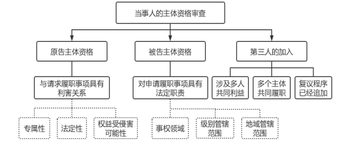
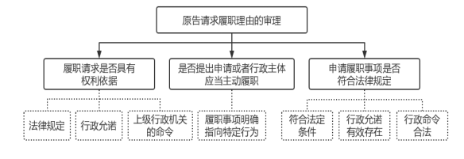
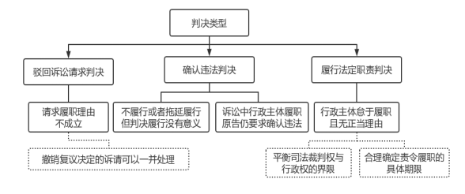

### **履行法定职责案件的审理思路和裁判要点**

履行法定职责案件是指当事人认为行政主体存在拒绝履行、拖延履行保护其人身权、财产权等合法权益的法定职责，或者对其申请不予处理等情形，导致其合法权益受损，进而提出要求行政主体作出特定行为的行政诉讼案件。该类案件作为一种重要的行政案件类型，对于实现当事人合法权益以及督促行政机关依法行政、积极行政具有重要意义。为准确把握该类案件特点，统一法律适用，现结合典型案例，对履行法定职责案件的审理思路和裁判要点进行梳理、提炼和总结。

一、典型案例

**案例一：涉及履行法定职责案件原告主体资格的审查**

2018年11月，郭某在某公司电商平台生成订单，商品名称为“豪华宝马汽车中奖直接4S店提车”，商品单价为0.01元，订单状态为“未拼团已取消未发货未付款”。2019年3月，A地市场监督管理局收到郭某举报信，反映某公司开展抽奖式有奖销售活动，违反《反不正当竞争法》，损害正常市场秩序，请求进行查处。A市监局经核查未发现涉嫌违法的具体事实存在，举报事项未得到查实，遂作出不予立案决定。郭某诉至法院，请求判令A市监局履行查处某公司不正当有奖销售行为的职责。

**案例二：涉及行政机关怠于履职违法性的判断**

2020年9月，冯某因琐事与贾某产生争执，后发生肢体冲突并报警。B公安局下属派出所接警后到达现场处理。监控录像显示事发时贾某先行言语挑衅并动手殴打冯某，后被围观人员制止。鉴于本案系因邻里矛盾产生，违法情节轻微且未造成严重后果，B公安局决定对贾某不予处罚。冯某不服诉至法院，请求判令B公安局履行对贾某实施处罚的法定职责。在诉讼过程中，B公安局自行撤销此前作出的不予处罚决定，并决定对贾某罚款500元。经法院释明后，冯某仍坚持本案诉讼。

**案例三：涉及责令履行职责判决的内容**

2019年9月，吴某通过“C省环境违法行为举报网上受理平台”向C省环境保护厅投诉，反映其住宅距离沿江高速公路18米，噪声白天达70分贝、夜晚达60分贝以上，要求履行对噪声的管理和监督义务。C省环保厅收到投诉后，转交某市环保局办理。2020年3月，某市环保局向吴某邮寄信访事项不予受理告知书，告知其所反映的噪音扰民问题当地法院已经作出判决，属于《信访条例》规定不予受理的情形。吴某不服诉至法院，请求判令C省环保厅对其反映的高速公路噪音问题履行法定监管职责。

二、履行法定职责案件的审理难点

履行法定职责案件在起诉条件、审理思路及裁判内容等方面与撤销诉讼存在诸多不同，现行立法对此类案件审理思路未作系统性规定，实践中对相关问题把握亦不统一，案件审理存在一定难度。

**（一）起诉条件的认定标准有待明确**

履行法定职责案件诉讼标的并非针对已经作出的行政行为，而是要求行政机关作出某种行为，在审查原告起诉是否符合法定条件时往往面临诸多困难。原告提出的履职诉请种类繁多，但立法对可受理的履职事项不可能穷尽列举，因此在判断受案范围上存在一定争议。在原告对相同事项多次申请履职的案件中，如何判断履职期限与起诉期限往往不易把握。同时，行政主体职责划分的复杂性也造成判断适格被告存在困难。请求履职事项是否事关原告合法权益，原告主张保护的利益是否属于法律所保护的利益，司法实践中的判断标准并不完全统一。

**（二）履职违法性审查思路尚未统一**

原告提起履职诉讼的目的在于要求行政主体作出特定行为，因而针对行政主体怠于履职是否违法的审理思路，应立足于原告请求履职是否具有相应依据、是否符合法律规定的各项要件、被告针对原告履职请求提出的反驳理由是否成立等方面进行。同时此类案件的证明责任分配也有其特殊性，但审查思路并不统一。

**（三）判决内容的确定尺度不易把握**

履行法定职责案件中，行政主体如存在无正当理由怠于履职的情形，法院应当作出相应的履职判决，但因行政主体对履职事项原则上具有首次判断权，在其对相关事实仍需进一步调查，或者在结果判断上仍有裁量空间等情况下，判令履行具体职责的时机并不成熟。正确区分具体情形，作出相应内容的判决，对于实现保护行政相对人合法权益与尊重行政主体判断权的平衡非常重要，但关于这一问题并无明确标准，有时可能导致行政争议无法得到实质性化解。

三、履行法定职责案件的审理思路和裁判要点

审理履行法定职责案件，一方面要尽可能实现对原告人身权、财产权等合法权益的有效保护，督促行政主体积极履职；另一方面也要注意避免履职诉讼成为规避起诉条件限制的手段，扰乱正常的司法和行政管理秩序。基于行政诉讼案件的特殊性，该类案件的审理既需要把握起诉条件审查所涉及的程序性要素，又需要从实体方面审查原告请求履职的理由以及被告的履职情况，并依法作出裁判结论。

**（一）起诉条件的审查**

在起诉条件审查阶段应注意此类案件在利害关系等方面的特殊之处，并甄别原告起诉背后的真实诉求。

**1、受案范围的审查**

判断诉请履职事项是否属于行政诉讼受案范围，首先应当比照《行政诉讼法》及最高法院《关于适用<中华人民共和国行政诉讼法\>的解释》的列举性规定。如果原告诉请履职事项未在明确列举范围之内，还要结合上述法律及司法解释对受案范围的概括性规定，分析该事项是否可能对原告的合法权益产生实际影响，是否适宜由法院进行审理等。另需注意的是，司法解释对行政诉讼受案范围的排除性规定系针对行政主体已作出的行为，并不完全适用于履职诉讼。例如，行政主体作出的程序性行为原则上不属于行政诉讼受案范围，但如果行政主体怠于作出某种程序性行为可能导致原告合法权益实质上无法实现，此时原告请求该行政主体履行职责，法院应当受理。

**2、当事人的主体资格审查**

**（1）原告主体资格**

提起履职诉讼的原告主要为履职事项的申请人或者认为与履职事项具有利害关系的人。判断原告主体资格的重点在于其与请求行政主体履职事项之间是否具有利害关系，即请求履职事项对所要保护的法定权益是否产生实质影响。判断时要分析权益的性质，能够据以提起履职诉讼的权益应当具有法定性、专属性，且该权益可能受怠于履职的侵害。

**法定性**是指原告要求保护的权益属于人身权、财产权等法定权利或者法律所保护的利益，即行政主体在履职时所适用的法律要求对该权益应予以特别考虑。债权因具有相对性和隐蔽性，除法律特别规定外，当事人出于便利实现债权目的要求行政主体履职，并以其债权受到行政主体怠于履职侵害为由提起诉讼，原则上不具有原告主体资格。

**专属性**是指原告主张保护的权益区别于一般公共利益或者反射利益，系在个案中为原告所特有。单纯为保护公共利益或者他人合法权益诉请履职的，原则上不具有原告主体资格。

**权益受侵害可能性**是指原告诉请主张保护的权益可能受到行政主体怠于履职的侵害。如案例一中，郭某在某公司经营的电商平台上虽有过购买意向订单，但该订单的状态表明购买尚未成功，郭某并未实际参与其所举报的活动。A市监局的处理行为对郭某的人身权、财产权等合法权益并不会产生实际影响，郭某要求保护的所谓权益不可能受到A市监局履职与否的侵害，故其本案中不具有原告主体资格。

需要指出的是，行政公益诉讼具有特殊性，该类诉讼并非为维护本人利益，而是为维护公共利益提起，对该类履行法定职责案件原告主体资格的审查不适用上述规定，而是应当根据《行政诉讼法》及相关司法解释关于行政公益诉讼的专门性规定进行处理。

**（2）被告主体资格**

履行法定职责案件的适格被告应当是对原告申请履职事项在起诉时具有特定职责的行政主体。原告诉请履职事项既应属于被告的事权领域，也应属于其级别管辖和地域管辖范围。除行政机关外，法律、法规、规章授权的组织也具有行政管理职能，包括事业单位、高校、村民委员会等。当履职事项涉及授权或者决定情形时，相关主体可以作为被告，行政机关内设机构、派出机构基于法律法规授权亦可作为被告。适格被告还要求被诉行政主体在原告起诉时处于存续状态。起诉时不存在的行政主体不能作为被告，应当释明原告变更；起诉之后行政主体职能发生变化，亦应当依法予以变更。

特殊情形下确定被告应把握如下原则：选择针对原告请求能够作出直接和实质处理的行政主体作为被告。当事人提出的履职请求需要多个行政主体共同履行各自职责，原则上将相关主体列为共同被告。在以“一站式办理”等形式履职的案件中，行政主体分工协作较为复杂且相对独立，一般以特定环节的审批主体为被告，特殊情况下可以考虑先将牵头主体作为被告，在后续审查中将对原告产生实质性不利影响的主体变更为被告。

**（3）第三人的加入**

履行法定职责案件中，追加第三人主要有以下几种情况：一是履职事项涉及多人共同利益，行政主体必须对多人一并履行法定职责，如仅有部分人提起履职诉讼，其他人不起诉也未放弃权利的，应当追加其他人作为第三人。二是履职事项需由多个行政主体共同作出，原告仅起诉部分行政主体，且不同意追加其他行政主体为被告的，依据最高法院《关于适用<中华人民共和国行政诉讼法\>的解释》第26条规定，应当追加其他行政主体为第三人。三是履职事项经过行政复议，而复议程序中追加过第三人的，在此后诉讼中应当追加复议程序的第三人。

 

**3、管辖的审查**

履行法定职责案件管辖法院的确定除适用《行政诉讼法》的规定外，还需注意最高法院《关于完善四级人民法院审级职能定位改革试点的实施办法》规定对不履行法定职责等四类以县级、地市级政府为被告的第一审行政案件，原则上由基层法院管辖。

**4、诉讼请求的审查**

原告提出的履职诉请应当具有明确的履职内容，不能仅要求履行某一概括的职责，否则应当释明当事人明确其诉讼请求。部分履行法定职责案件在起诉前经过行政复议程序，如复议机关驳回原告的请求，其起诉还应包括复议机关作出的行政复议决定。原告在提起履职诉讼时还可能附带提起行政赔偿请求，并可能要求一并审查有关规范性文件等，此类诉请在内容、提出时间等方面应当符合《行政诉讼法》等法律及相关司法解释的规定。

**5、起诉初步事实根据的审查**

原告提起履职诉讼，其诉请应当具有权利依据及事实根据，包括诉前已向被告提出过履职申请或者被告应当主动履职，被告存在怠于履职的情形等。上述事实根据是否成立，后续需要结合证据进一步判断，立案阶段对此不作深入审查，但如果原告未提供任何事实根据，或者基于原告的主张即可判断履职请求不可能成立，包括明显不属于行政机关权限范围、尚未提出申请、请求履职事项已经完成等，则可以裁定不予立案；已经立案的，可以裁定驳回起诉。此外，原告提起履职诉讼所涉实质履职事项如果已在其他诉讼中解决，或者正在其他诉讼中审理，也构成重复起诉，应当不予受理或者裁定驳回起诉。

**6、起诉期限的审查**

在行政主体不作为情况下，当事人起诉的期限应当为自履职期限届满之日起六个月。如果行政主体明示拒绝履行法定职责，起诉期限自当事人知道行政主体明示拒绝履职之日起计算。在审查时，除应当考虑原告起诉距离履职期限届满的时间外，亦应当考虑耽误起诉期限的具体原因，对于行政主体故意延误履职、原告怠于寻求救济等情况，应当进行区分处理。

**（二）履行法定职责案件的实体审理**

在实体审理阶段，主要围绕原告请求履职是否具有相应依据、其情况是否符合该依据的全部要件、被告针对原告请求是否提出有效反驳等方面进行。如果原告诉请中包含撤销复议决定、主张赔偿、一并审查规范性文件等内容，审理思路与撤销诉讼基本一致。

**1、原告请求履职理由的审理**

**（1）原告履职请求是否具有相应的权利依据**

权利依据首先体现为法律规范对行政主体在特定情况下应作出某种行为的明确规定。同时，对该依据的审查也有助于明确请求履职事项是否属于被告职责范围。除法律规定外，作为原告权利依据的还有行政主体作出的行政允诺以及上级行政机关的命令等，命令体现为会议纪要、红头文件等形式。此类命令可以使本不具有职权的行政主体负有履职义务，可以与原告请求履职的法律依据共同构成权利依据。审理上述权利依据应当听取被告意见，以明确履职事项是否属于被告的职权范围、是否能够作为履职请求的权利依据，从而为后续审理奠定基础。

**（2）原告是否向被告提出过履职申请**

原告提出的履职申请应当明确指向特定行为。对于提出申请的事实，原告应当承担证明责任，但被告依职权主动履职、原告因被告受理申请的登记制度不完备等正当事由不能提供相关证据材料的除外。在判断被告是否应当主动履职时，需结合原告申请履职事项所依据的具体法律规范进行审查。此种情况下虽不需要原告申请，但原告仍有义务对主动履职情况进行说明，并提交证明符合主动履职条件的证据。

判断是否因正当事由不能提供申请的证据材料时应当注意：对于原告当场提出申请的，若非事先准备，原告较难事后证明其曾提出过申请。被告作为行政主体，应当建立必要的来件收发、登记机制，理论上能够证明原告是否提出过申请以及申请材料的内容。此时，原告只要能够明确指出申请时间、方式、内容、材料等即可；但若申请系通过邮寄、电子邮件等方式提交，原告能够留痕，此时至少应当提交其留底的邮寄凭证、电子邮件回执等证据。对原告申请时是否提交相关材料的问题，审理时应通过分析材料形成时间、是否在原告申请时即已掌握等因素，判断原告在申请时是否已经具有提交的条件，如能够认定申请时原告具备提交条件，一般认定原告已经提交，如被告否认则应提供足够的反证。

**（3）原告申请履职事项是否符合法律规定**

一是依据法律规范提起的履职诉讼，原告的具体情况需符合法律规范规定的各项要件，原告对此承担相应证明责任。二是基于行政允诺提起履职诉讼，应证明行政允诺的存在，并判断该允诺是否存在超越职权等重大且明显违法等无效情形。在允诺有效的情况下，原告还需证明其已实现允诺所设定的条件，并要求行政主体兑现允诺事项。三是基于上级行政机关命令提起履职诉讼，应证明相关命令的存在。应当对命令本身的合法性进行审查，如命令存在重大且明显违法的情形，则不能作为下级机关履职的依据。在此基础上，原告需证明其符合命令要求履职的相关条件。

 

**2、被告履职情况的审理**

**（1）被告是否已经履行原告要求的法定职责**

在明确原告权利依据及具体情况后，应当审查被告对履职申请处理的相关情况。如被告主张已履行原告要求的法定职责，其应当对此承担证明责任。在履职事实确认的情况下，因原告的履职目的已经实现，其据以要求履职的权利消灭，故可驳回原告的诉讼请求。

**（2）被告提出的抗辩理由**

一是因不可抗力等特殊事由导致暂时无法履职。被告需对不可抗力或者类似重大事由的发生，以及该事由导致其无法履职承担证明责任，但此种情况一般仅能迟滞行政主体的履职，在障碍消除且履职仍有实际意义的情况下，行政主体应当恢复履职。需指出的是，此类无法履职的障碍应当为客观障碍，被告以承办人员变动等自身原因作为无法履职的理由，原则上不能成立。

二是被告拒绝履职具有相应法律依据。在原告请求对其本人履职的案件中，原告自身情况不符合履职事项的法定要件。被告对此提出的抗辩理由性质上类似于对原告主张的反驳，但如果被告对履职与否有裁量余地，应对其裁量因素予以说明或者证明。

三是原告申请履职事项的法律依据发生变化。这对原告的请求权实现可能产生不同影响：一是法律依据的变化导致原告申请履职事项不可能实现。如果此种变化发生在履职期限内，可不认定被告存在过错，判决驳回原告诉请。如果法律依据的变化发生于履职期限届满之后，且被告无正当理由超过履职期限，应当确认被告不履职违法。二是履职事项依其性质可以依照申请时的法律规定办理。此时法律依据的变化不影响被告按照此前规定履职，被告以此作为不履职理由不能成立。

**（三）判决指引**

在实体审理的基础上，法院可以作出如下判决：

**1、判决驳回诉讼请求**

在原告履职诉请缺乏权利依据、具体情况不符合权利依据要求的条件，或者被告已经依法履职、抗辩理由成立等情况下，应当认定原告请求履行法定职责理由不成立，判决驳回其诉讼请求。对于经过行政复议的案件，行政机关作出实体驳回复议申请的决定，且该决定不存在违法情形的，应当一并判决驳回原告关于撤销复议决定的诉请。

**2、判决确认违法**

就履行法定职责类案件而言，判决确认违法主要在以下两种情况下作出：一是被告不履行或者拖延履行法定职责，判决履行没有意义的。在判决确认违法的同时，可以判决责令被告采取补救措施；给原告造成损失的，可基于原告请求，依法判决被告承担赔偿责任；二是起诉时被告尚未履行法定职责，但在诉讼过程中被告作出相应行政行为，原告不撤诉且仍要求确认被告此前未履职违法的。

公安机关作出治安行政处罚应当全面考虑违法行为人的主观过错、违法情节、危害后果等因素，依法确定行政处罚的种类和幅度，实现过罚相当。如案例二中，贾某与邻居冯某虽长期存在积怨，但贾某采用言语挑衅且先行动手殴打冯某的行为明显具有主观过错。B公安局怠于履行处罚的法定职责确有不妥，但其在诉讼过程中针对贾某的违法行为已经自行作出行政处罚决定，业已履行了相应职责。在冯某仍坚持诉讼的情况下，法院经审查后作出判决确认被告此前未履职违法。

**3、判决履行法定职责**

经审理认定原告请求被告履行法定职责的理由成立，被告怠于履行且无正当理由的，可以依法作出履行法定职责的判决，但在作出判决时应当注意以下问题：

**（1）注重平衡司法裁判权与行政权的界限**

行政主体对原告的履职请求原则上有首次判断权，其判断可进一步分为程序审查和实体审查，同时行政管理具有相当的复杂性和专业性。因此，法院对行政主体的专业判断应予以必要尊重。在下列情形中应当作出原则性判决，判令行政主体限期依法作出处理：

一是被告的不履职发生在程序审查环节。此时被告尚未对原告的申请在实体上是否符合条件作出判断，不能迳行判令行政主体履行实体性的法定职责，而应责令其就程序问题继续作出处理。

二是被告对履职结果有裁量余地。行政主体虽无正当理由怠于履职，但其对最终结果的判断权尚未完全行使，作出具体判决时机并不成熟，此时应判令被告在一定期限内对原告请求进行处理，但不确定具体履职内容。在判决理由中应当阐明总体意见，为行政主体后续重新处理提供指引，行政主体在后续处理中也应体现司法裁判中的观点。

三是被告对相关事实应当进一步调查。在申请对他人履职的案件中，被告主张他人不符合履职条件但并未提供证据予以证明，也未提供足够证据证明被告已就相关问题履行必要的调查义务，此时应当认定被告存在怠于履职的情形，责令被告进行调查并作出处理。

**（2）合理确定责令履职的具体期限**

根据最高法院《关于适用<中华人民共和国行政诉讼法\>的解释》第91条规定，原告要求被告履行法定职责理由成立，被告违法拒绝或者无正当理由逾期不予答复，可以判决被告在一定期限内依法履行法定职责。关于“一定期限”的把握，可以参照法律法规等对相关履职事项办理期限的规定予以确定；在没有具体规定的情况下，可以参照《行政诉讼法》所规定的两个月期限，但应当结合履职的具体因素适当增减期限；如有特殊情形，可根据案情酌定期限并说明理由。

如案例三中，沿江高速公路涉案地段环保验收工作由C省环保厅直接验收并公示，故对于该工程所产生的噪音扰民问题负有监督管理职责。C省环保厅对于吴某提出的履职要求未采取切实措施，仅作为信访事项转交下级处理确有不当。法院遂判决确认C省环保厅于判决生效之日起30日内针对原告的投诉履行相应职责。酌定履职期限确定为30日内主要考虑到调查、处理高速公路相关噪音污染问题的正常时限。由于该问题直接涉及民生保障，通过司法裁判可以督促责任主体尽快履责，避免行政机关之间相互推诿。

 

四、其他需要说明的问题

本文主要涉及申请行政主体履行保护人身权、财产权等合法权益的法定职责，行政主体拒绝履行或者不予答复的案件。当事人要求行政主体给付抚恤金、最低生活保障待遇、社会保险待遇等物质性利益的案件因判决方式不同，本文未予涉及，但可以参考上述审理思路。当事人要求履行行政协议约定义务的诉讼，在请求权基础、审理思路、判决内容等方面与本文所涉履行法定职责案件存在较大差异，故本文未予涉及。

（根据行政庭宁博、刘天翔提供材料整理）