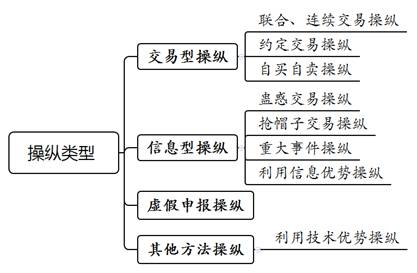
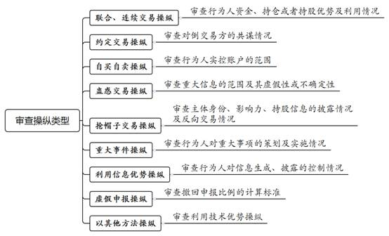

### **操纵证券市场犯罪案件的审理思路和裁判要点**

操纵证券市场是指行为人以法律所禁止的手段，影响证券交易价格或交易量的行为。证券市场是资本市场的主要组成部分，在经济社会中发挥了重要的资源配置导向作用，为实体经济提供了重要的金融支持。与此同时，操纵证券市场违法犯罪行为频频发生，严重破坏证券市场管理秩序，危害投资者合法权益和国家金融安全。操纵证券市场犯罪属于典型的“白领犯罪”，具有较强的技术性、专业性，认定难度较大。为保证此类案件的审判质量与适法统一，本文结合司法实践中的典型案例，对此类案件的审理思路和裁判要点进行梳理、提炼和总结。

一、典型案例

**案****例****一：****涉****及****被告人****实****控账户****的****认定**

2013年2月至2014年8月，被告人朱某担任某证券公司经纪人，并受邀担任“谈股论金”电视节目嘉宾。在此期间，朱某在其亲属王某等人名下的证券账户内，预先买入A公司、B公司等15只股票，并在随后播出的电视节目中对上述15只股票进行公开评价、预测及推介，再于节目首播后1至2个交易日内抛售，非法获利75万余元。案发后，朱某否认实际控制王某等人名下证券账户。

**案例二：涉及操纵类型的认定**

2012年5月，被告人陶某以3.4亿余元收购上市公司C公司11.75%的股份，并担任法定代表人、董事长。2015年间，陶某个人决定启动公司名称变更程序。5月11日，C公司对外公告称该公司立志于做中国首家互联网金融上市公司，并基于业务转型需要，拟变更公司名称。公告发布前，陶某通过其控制的账户组买入2千余万股C公司股票，公告后C公司股票连续六个交易日涨停。

**案例三：涉及操纵标准的认定**

2014年7月至2015年1月，被告人张某以虚假申报方式操纵D公司、E公司等6只股票，当日累计撤回申报买入量达到同期该6只股票总申报买入量50%以上，但未达到同期该6只股票总申报买入及卖出量50%以上，6只股票撤回申报买入额均在1千万元以上。

**案例四：涉及场外配资行为性质的认定**

2016年起，被告人章某等配资中介人员以1:3至1:10不等的配资比例，违规向F集团提供资金10亿余元及他人证券账户119个。章某对其提供的账户及资金进行监控，且在多次收到证券交易所监管函的情况下，仍持续向F集团提供资金及新的证券账户。2017年2月至3月，F集团使用配资资金连同部分自有资金，集中资金优势、持股优势连续买卖或在实际控制的证券账户之间买卖G公司股票。

**案例五：涉及违法所得的认定**

2015年至2017年，黄某、文某、蒋某与上市公司H公司股东何某、麦某等人合谋，从上述股东处以协议转让方式受让全部股份。后黄某等人控制H公司发布收购、参股科技公司、非公开发行股份、转增派息等公告，并基于上述信息优势在二级市场连续买卖H公司股票。2017年6月，黄某等人被公安机关抓获。截至案发前一个交易日，黄某、文某、蒋某分别非法获利10余亿元至20余亿元不等（包含账面持股浮盈在内）。2017年6月至次年1月，H公司股票停牌，复牌后该股票连续多个交易日跌停。

二、操纵证券市场犯罪案件的审理难点

操纵证券市场犯罪案件审理过程中，在行为人实控账户认定、操纵类型判断、操纵标准适用、场外配资定性、违法所得计算等方面存在一定难度。

**（一）行为人实控账户认定复杂**

操纵证券市场案件中为隐蔽操作、逃避监管，行为人往往在多家证券营业部利用众多账户分散筹码，行为人与账户之间的对应关系较为复杂。同时，金融创新业务催生诸多监管层面的“看不穿”账户，进一步增加了查处难度。

**（二）操纵类型判断难**

操纵证券市场包括联合、连续交易操纵、抢帽子交易操纵等八种法定操纵类型。不同操纵类型的构成要件存在较大差异，部分还存在交叉重合之处，应当审慎认定、区分。同时，伴随着金融市场上程序化交易、数量化交易以及金融衍生品的创新发展，新类型操纵也不断出现，行政监管和司法处置上均有一定难度。

**（三）操纵标准适用难**

不同的操纵类型具有特定的操纵标准，法律适用的要点、难点较多。同时，法律设定标准的概括性及现实交易的复杂性进一步增加适法难度。如联合、连续交易操纵、抢帽子交易操纵标准认定复杂，争议较多。

**（四）场外配资定性争议大**

证券市场上，投资者为快速获取高额回报，往往动用资金杠杆，形成巨大的资金需求，故而在合法融资融券之外，场外配资规模得以快速增长。场外配资行为可能具有非法经营融资融券或证券经纪业务、帮助操纵证券市场等多种属性，需要予以分类处置。

**（五）违法所得计算标准不一**

实践中对违法所得的认定主要有实际收益法及虚拟收益法两种计算方法，而后者关于收益计算的时间节点又有操纵行为终止、操纵影响消除、行政调查开始或终结、刑事立案等多个时点，认定标准较为复杂。

三、操纵证券市场犯罪案件的审理思路和裁判要点

处理操纵证券市场犯罪案件，应当着眼于服务保障资本市场改革发展，注重防范化解重大金融风险，需要坚持以下处理原则：（1）严格把握刑事处罚与行政处罚的界限，坚持主客观相一致原则，依法、审慎认定犯罪。（2）贯彻宽严相济的刑事政策，加大对严重损害投资者利益行为的惩处力度，具备从宽情节的，则根据案件具体情况把握好从宽幅度。（3）注重全链条打击，加大对场外配资、操盘及洗钱团伙的惩治力度，从多角度遏制操纵证券市场犯罪。（4）加大追赃挽损力度，注重追查涉案资金的来源和去向，在鼓励退赔的同时做好刑民衔接工作。

根据2021年《刑法修正案（十一）》、2019年《最高人民法院、最高人民检察院关于办理操纵证券、期货市场刑事案件适用法律若干问题的解释》（以下简称《操纵证券期货市场解释》）和2022年《最高人民检察院、公安部关于公安机关管辖的刑事案件立案追诉标准的规定（二）》（以下简称2022年《立案追诉标准二》）的规定，操纵证券市场有八种类型，且不同操纵类型具有特定的犯罪构成。审查此类案件，应当首先判断行为人所采用的操纵类型，并紧扣操纵类型进一步审查各项主客观要件。

**（一）判断操纵类型**

根据操纵行为对证券交易价格或交易量的影响机制不同，现有操纵类型可以分为交易型操纵、信息型操纵、虚假申报操纵三类。其中，交易型操纵包括联合、连续交易操纵、约定交易操纵、自买自卖操纵；信息型操纵包括蛊惑交易操纵、抢帽子交易操纵、重大事件操纵、利用信息优势操纵。此外，当前市场上还存在以利用技术优势操纵为代表的其他操纵方法。

**（二）审查犯罪主体**

操纵证券市场罪的主体为一般主体，包括单位及自然人。具体认定时应当注意新旧规定的衔接问题。

根据2010年《最高人民检察院、公安部关于公安机关管辖的刑事案件立案追诉标准（二）》（以下简称2010年《立案追诉标准（二）》）的规定，利用信息优势操纵的犯罪主体是上市公司及其董事、监事、高级管理人员、实际控制人、控股股东或者其他关联人员，抢帽子交易操纵的犯罪主体是证券公司、证券投资咨询机构、专业中介机构或者从业人员，均为特殊主体；而《操纵证券期货市场解释》首次将上述特殊主体扩展为一般主体。据此，对于《操纵证券期货市场解释》施行前非特殊主体实施的上述操纵行为，不能以操纵证券市场罪处理，但可能构成非法经营证券业务，可按非法经营罪处理。

**（三）审查行为人实控账户**

行为人实际控制的账户有四类：（1）行为人以自己名义开户并使用的实名账户。（2）行为人向账户转入或者从账户转出资金，并承担实际损益的他人账户。（3）行为人通过投资关系、协议等方式对账户内资产行使交易决策权的他人账户。（4）行为人以其他方式管理、支配、使用的他人账户或者具有交易决策权的账户。

行为人实控账户的认定难点在于“他人账户”，常见类型如下：（1）行为人违规使用的他人名下账户。如案例一中被告人朱某使用的相关亲友账户。（2）证券公司与各类场外衍生品工具、“类信托”“类通道”业务有关的自营账户，客户发出投资指令但交易主体可能显示为证券公司的自营账户。（3）伞形账户：配资机构利用分仓系统（类HOMS系统）为投资者设立伞形账户（即二级账户），其交易模式与证券公司自营账户相类似。（4）跨境账户：以“沪港通”为例，香港投资者通过“沪港通”买入证券的名义持有人是香港中央结算公司，证券登记结算机构难以实时监测香港投资者个人账户。

审查行为人实控账户主要参考以下要素：（1）账户的网络轨迹：账户交易的MAC地址（物理地址）、IP地址（网络地址）与行为人互联网访问轨迹的重合度与连贯度。（2）资金往来记录：账户内资金来源、账户之间是否有资金划转记录等。（3）交易对象、方式：账户交易的产品是否相似、交易的方向及频率是否趋同。（4）行为人与账户开户人之间的关系：是否存在亲友、同事关系等。

如案例一中，结合相关证券账户的MAC地址、IP地址与被告人朱某的上网轨迹重合，证券账户与朱某银行账户之间资金往来频繁，同时考虑到交易方向与朱某的荐股意见相反等因素，综合认定涉案证券账户由朱某实际控制使用。

**（四）审查操纵行为**

对于操纵行为，应当结合不同操纵类型的构成要件分别判定。

**1****、联合、连续交易操纵**

主要审查行为人是否具有资金、持股或持仓优势，是否利用上述优势对证券交易进行干预和引导。

具体认定时还需要注意多项操纵标准的界定：（1）“持有或者实际控制证券的流通股份数量达到该证券的实际流通股份总量10%以上”，要求一个交易日以上持股比例超过10%即可。（2）“连续10个交易日的累计成交量达到同期该证券总成交量20%以上”，要求连续10个交易日累计成交量达到20%以上，但不要求逐日比例均达到20%以上。（3）“累计成交量”采用双边计算法，计算行为人的累计买入量和累计卖出量之和。

**2****、约定交易操纵、自买自卖操纵**

主要审查行为人实际控制的账户范围及对倒交易方的共谋情况。

**3****、蛊惑交易操纵、重大事件操纵**

主要审查行为人是否利用虚假或不确定的重大信息，是否策划或实施虚假重大事项。“重大信息”的范围可根据《证券法》第80条规定的“重大事件”范围予以确定，同时包括能够对一般投资者的投资决策产生重大影响的相关国家政策、行业信息等。

**4****、抢帽子交易操纵**

主要涉及非持牌机构及一般公民实施抢帽子交易操纵的认定问题。《操纵证券期货市场解释》首次将抢帽子交易操纵的主体从“证券公司、证券投资咨询机构、专业中介机构或者从业人员”扩展至一般主体，原因在于：随着自媒体等现代通讯传播技术的发展，非持牌机构及一般公民也具有较高的影响力，足以对投资者进行误导，因而有必要予以刑事规制，但在司法认定上应当持相对慎重的态度。证券机构及其从业人员应当以客户利益为导向，负有从业禁止义务，以防发生关联交易从而破坏其与客户之间的代理关系、信赖关系。然而，非持牌机构及一般公民不负有从业禁止义务，也不存在代理关系、信赖关系，司法认定上理应更为严格。

认定非持牌机构及一般公民抢帽子交易操纵应着重审查以下要素：（1）行为人的影响力：行为人的品牌效应越高，信息传播范围越大，越有可能通过操纵获利。（2）个人持股信息的披露情况：行为人真实披露其持股及变动情况，可在一定程度上免除其与其他投资者的利益冲突，反之则更有可能利用信息不对称谋取不法利益。（3）反向交易情况：行为人趁其他投资者进场时抢先了结获利，表明其获取利润是以其他投资者损失为代价。

**5****、利用信息优势操纵**

主要审查行为人对信息生成、披露的控制情况及相关交易情况。具体认定时需注意利用信息优势操纵与联合、连续交易操纵、内幕交易的区分。

**（****1****）****利用信息优势操纵与联合、连续交易的区分**

《刑法》第182条第1款将“集中资金优势、持股或者持仓优势”与“利用信息优势”并列，合并规定为联合、连续交易操纵，该表述与利用信息优势操纵存在一定重合。从立法历程看，早期证券市场上，行为人利用巨额资金、高比例持股优势，长期控制上市公司流通股交易、连续交易等手法极其突出，信息优势相对处于从属地位。因此刑法及证券法均将信息优势与资金、持股优势并列，以打击联合、连续交易操纵。此后逐渐出现行为人配合市场热点，通过披露更名、转型、重组等信息的方式影响股票价量，故2010年《立案追诉标准（二）》单列利用信息优势操纵。由此可见，上述两种操纵类型的区别在于：联合、连续交易操纵本质上是一种交易型操纵，其引起证券价量变动的核心要素是资金；而利用信息优势操纵本质上是一种信息型操纵，其影响证券价量的核心要素是信息本身。

如案例二中，陶某主导、控制披露公司更名、转型从事互联网金融业务等热点信息，误导投资者作出投资决策，影响证券交易价量，属于典型的利用信息优势操纵，而非联合、连续交易操纵。

**（****2****）利用信息优势操纵与内幕交易的区分**

利用信息优势操纵和内幕交易均是利用信息谋利，两者的区别主要在于谋利机制不同：内幕交易中，行为人利用信息的未公开性，预测信息公开后证券价格走向，提前布局并谋取利益；而利用信息优势操纵中，行为人滥用其优势地位，控制信息的生成及披露，误导投资者进行证券交易。此外，在利用信息优势操纵与内幕交易形成竞合时，一般以操纵证券市场罪处理，以更为全面准确地评价犯罪行为。

**6****、虚假申报操纵**

主要涉及操纵标准的适用问题。根据《操纵证券期货市场解释》和2022年《立案追诉标准二》的规定，当日累计撤回申报量达到同期该证券总申报量50%以上，且证券撤回申报额在1千万元以上的，构成“情节严重”。计算撤回申报比例时，应分别以证券总申报买入量或者总申报卖出量为基础进行计算，而非以总申报买入及卖出量之和为基础计算。

如案例三中，被告人张某以虚假申报方式实施操纵，虽然当日累计撤回申报买入量未达到同期该证券总申报买入及卖出量50%以上，但达到同期该证券总申报买入量50%以上，可认定为“情节严重”。

**7****、以其他方法操纵**

主要涉及利用技术优势操纵的认定问题。当前证券交易的技术优势以程序化交易和数量化交易为主，两者通过计算机技术及数学分析手段实现自动化交易，能够探知短暂的市场变化并先于其他投资者进行交易。技术优势的主要特征是大量买卖，其中部分交易手法可能具备操纵特征。例如，利用技术优势向市场发出大量报单、撤单，增加不确定性并趁机完成交易，或者引导交易趋势至预期价位，或者通过在交易两侧大量报单以隐藏其一侧的真实交易意图。

基于保护技术创新与遏制技术风险的刑法规制尺度之间的平衡，认定利用技术优势操纵证券市场应当极为慎重。目前尚未有相关案件进入刑事程序，但在操纵期货市场领域已有判例。例如，Y公司操纵期货市场案中，Y公司利用自行开发的报单交易系统，在本身已使用高频程序化交易的基础上，利用不正当的交易优势和额外交易速度优势抢占交易先机，限制或排除其他合规投资者的最优交易机会，其行为严重破坏了期货市场公平交易秩序和原则，非法获利3亿余元，构成操纵期货市场罪。

审查是否利用技术优势操纵证券市场主要考虑以下因素：（1）是否干扰交易系统正常运行；（2）是否使其他投资者难以作出投资决策；（3）是否造成错误的供求关系；（4）是否形成虚假的价格水平等。

**8****、审查“反向交易”“相关交易”“谋取相关利益”**

《操纵证券期货市场解释》对五类“以其他方法操纵证券市场”的情形，均明确应当具备“相关交易”“反向交易”或“谋取相关利益”等要件。然而《刑法修正案（十一）》增加规定的三类操纵证券市场情形中，除明确规定抢帽子交易操纵需要进行反向交易外，对于虚假申报操纵、蛊惑交易操纵并未作相应规定。2022年《立案追诉标准二》则综合考虑了前述两者的规定，《刑法修正案（十一）》有规定的，采用《刑法修正案（十一）》的表述；《刑法修正案（十一）》没有规定的，则沿用《操纵证券期货市场解释》的表述。

“反向交易”“相关交易”“谋取相关利益”包括推高股价后减持，做空股价后增持，影响定向增发、股权质押、大宗交易价格，打压他人基金排名，影响公司收购价格等各类非法情形。认定是否构成操纵证券市场罪，一般应当按照《操纵证券期货市场解释》规定，审查操纵行为是否具备“反向交易”“相关交易”“谋取相关利益”等要件。主要理由在于：（1）操纵证券市场罪隐含有非法目的、动机要素。证券市场上改变证券交易价量的行为多种多样，并非所有行为均具有危害性。在证券市场异常波动时，国家动用资金入市、上市公司及股东回购、增持股份等，均会影响、乃至有针对性地影响证券价量。界定行为是否具有违法性，需要结合行为人是否进行“反向交易”等加以判断。（2）从行为的危害性角度评判，影响证券价量但不具备“反向交易”等情形的，可以优先考虑进行行政处罚，如无必要可不动用刑事手段。

**（五）场外配资行为的定性**

行为人为获取巨额资金用于操纵，往往通过他人进行场外配资。对于场外配资行为认定为操纵证券市场共犯、非法经营犯罪抑或不作为犯罪处理，司法实践中争议较大。

**1****、场外配资人员对操纵行为不知情，但配资行为符合非法经营罪构成要件的，可按非法经营罪处理**

实践中，场外配资模式主要有出借账户模式与系统分仓模式。出借账户模式下，客户向配资机构缴纳保证金，配资机构向客户出借账户及资金，同时负责风控盯盘、强制平仓等，但由客户自行通过证券公司下单交易，属于以提供融资为核心特征的融资融券业务。系统分仓模式下，配资人员实际控制资金，并通过分仓系统代理客户向证券公司下达交易指令，此类行为延长了证券交易链条，还可认定为以代理买卖为核心特征的证券经纪业务。

2020年《证券法》第120条规定，除证券公司外，任何单位和个人不得从事证券经纪和证券融资融券业务。因此，场外配资人员通过上述方式从事场外配资且情节严重的，可按非法经营罪定罪处理。同时，鉴于2020年3月1日施行的《证券法》方将证券融资融券业务明确规定为证券业务，故对于此前实施的非法融资融券行为纳入非法经营犯罪规制处理应当慎重。

**2****、场外配资人员明知他人操纵证券市场仍提供配资的，可按操纵证券市场罪的共犯处理**

如案例四中，鉴于被告人章某明知F集团操纵证券市场，仍积极提供配资，故将章某认定为操纵证券市场共犯。认定章某的主观明知主要考虑以下因素：一是章某出借资金金额特别巨大，账户数量众多，应当知道F集团交易的异常性；二是章某对出借账户逐日盯盘，较为清楚F集团的交易手法；三是章某收到监管部门发出的账户异常交易监管信息后，仍恶意规避监管，继续以其他账户提供配资。

需要指出的是，场外配资人员的行为同时构成非法经营罪和操纵证券市场罪的，应当充分考虑全面评价原则及两个罪名之间的轻重关系，慎重决定适用的罪名及判处的刑罚。

**（六）违法所得的认定与追缴**

《操纵证券期货市场解释》第9条规定，违法所得是指通过操纵证券、期货市场所获利益或者避免的损失，2022年《立案追诉标准二》亦采用相同的认定立场。对操纵证券市场所获利益或者避免损失的具体计算可遵循以下规则：

**1****、案发前已经平仓的，违法所得一般按照实际收益法计算**

此方法将建仓时点作为计算违法所得的起点，将平仓时点作为终点，以建仓成本与平仓金额之间的差额计算违法所得。实际收益法的优势在于客观反映了行为人的实际获利，亦能与后续违法所得追缴工作紧密衔接。

**2****、未平仓或以实际收益法计算明显不合理的，可以按照虚拟收益法计算**

虚拟收益法又称市场吸收法，是以操纵影响消除或操纵行为中断、终止等适当时点为基准计算违法所得。非法持有余券的，可以按照操纵影响消除之时的价格计算违法所得。行为人在操纵影响消除以后再行平仓的，即使平仓价高于操纵影响消除之时的价格，两者的差价部分也可不认定为违法所得。操纵影响消除时间难以证明的，也可以操纵行为中断、终止等时点作为计算基准。

如案例五中，黄某等人的操纵行为因案发而中断，虽然其前期获利因案发后股票停牌、股价连续跌停而大幅回吐，但仍可以案发前一个交易日为基准，将前期浮盈一并计入违法所得数额，以完整揭示操纵行为的社会危害性。

**3****、操纵多只股票，部分个股盈利、部分个股亏损的，计算违法所得宜采用“盈亏不相抵”原则，仅累计计算盈利部分的数额**

操纵多只股票的社会危害性明显高于操纵一只股票的社会危害性，如果操纵过程中出现个股亏损并进行盈亏相抵，会整体上降低处罚力度，导致对重度行为的处理反而更轻，同时也与《证券法》第192条对于操纵证券市场没有违法所得的行为仍然需要予以行政处罚的精神相悖。

**4****、违法所得追缴规则**

（1）行为人的获利已经实际兑现，根据实际收益法计算违法所得的，一般应全额追缴；（2）行为人案发时仍持有余券，根据虚拟收益法计算违法所得的，具体追缴金额根据平仓时的实际盈亏情况确定。主要考虑在于，根据虚拟收益法认定的违法所得仅作为对被告人定罪量刑的数额标准，而不代表实际获利数额。对于因市场环境变化、监管部门责令平仓、司法机关介入调查等行为人无法控制的客观情势造成贬损或转为亏损的，不宜要求行为人以合法财产补足，否则对行为人过于严苛；（3）对于行为人用于操纵证券市场的资金，根据比例原则可不予追缴。

**（七）****2010****年《立案追诉标准（二）》与《操纵证券期货市场解释》、****2022****年《立案追诉标准（二）》的衔接**

司法解释的效力一般应及于刑法施行期间，同时按照从旧兼从轻原则，对发生于2019年7月1日以前的操纵证券市场行为采用以下规则处理：（1）《操纵证券期货市场解释》扩大主体范围的，适用2010年《立案追诉标准（二）》的规定。如前所述，一般主体实施利用信息优势操纵及抢帽子交易操纵的，不宜认定为操纵证券市场罪。（2）《操纵证券期货市场解释》降低入罪标准的，适用2010年《立案追诉标准（二）》的规定。例如联合、连续交易操纵，仍然适用“持有或者实际控制证券的流通股份数达到该证券的实际流通股份总量30%以上，且在该证券连续20个交易日内联合或者连续买卖股份数累计达到该证券同期总成交量30%以上”。（3）《操纵证券期货市场解释》新增操纵类型的，适用该解释的规定。例如，对于蛊惑交易操纵、重大事件操纵等新增操纵类型，按照《操纵证券期货市场解释》予以认定。（4）《操纵证券期货市场解释》新增违法所得数额作为认定“情节严重”“情节特别严重”的标准，应予区别适用。蛊惑交易操纵、重大事件操纵等新增操纵类型，以及抢帽子交易操纵、利用信息优势操纵等之前没有明确“情节严重”标准的，可以适用违法所得标准；除上述操纵类型外，一般不适用该标准。（5）《操纵证券期货市场解释》对不同操纵类型新增“情节特别严重”特定标准，可予直接适用。

对发生于2019年7月1日以后的操纵证券市场行为，应当注意违法所得标准与其他特定标准之间的协调适用问题。如果完全不考虑不同操纵类型的特定标准，直接适用违法所得标准，极有可能造成特定标准的虚置及罪名的不当扩张。有鉴于此，操纵行为满足违法所得标准的，还需结合相关特定标准综合认定是否属于“情节严重”“情节特别严重”，如持股比例、连续交易日、成交量、成交比例、撤回申报比例等是否接近特定标准；是否在市场出现重大异常波动等特定时段操纵。

需要特别说明的是，2022年《立案追诉标准（二）》规定的操纵证券市场刑事案件立案追诉标准，是参照《操纵证券期货市场解释》对2010年《立案追诉标准（二）》的修订，其规定的入罪标准与《操纵证券期货市场解释》基本保持一致，并无实质变化，均应在司法实践中适用。

**（八）刑事处罚与行政处罚的衔接及协调处理**

根据《操纵证券期货市场解释》第6条规定，两次以上实施操纵证券、期货市场行为，依法应予行政处理或刑事处理而未经处理的，相关交易数额或者违法所得数额累计计算。该规定涉及操纵证券市场行为处理中的刑行衔接问题。

刑行衔接问题主要涉及以下层面：（1）操纵证券市场的刑行衔接为双向衔接，不仅涉及行政机关移送司法机关，也涉及司法机关移送行政机关。如司法机关对行为人不起诉或者免予刑事处罚的，可移送行政机关进行相应行政处罚。（2）对操纵证券市场行为的刑事处罚不以行政认定及处罚为前置条件。（3）已受过行政处罚的操纵证券市场行为达到入罪标准的，应当依法移送司法机关追究刑事责任，避免“以罚代刑”；行政机关已经给予行为人罚款的，应当折抵相应罚金。（4）操纵证券市场违法行为未达到入罪标准，已受过行政处罚的，一般不累计计算交易数额与违法所得数额后再行追究刑事责任。主要原因在于，根据一事不再罚原则，对当事人的同一违法行为，行政机关不得根据同一事实和同一理由进行两次以上的行政处罚，更加不能重复进行刑事处罚。（5）操纵证券市场违法行为未达到入罪标准，应予行政处罚而未处罚的，累计计算交易数额或者违法所得数额。

**（九）刑事罚没与民事赔偿的优先性问题**

根据《证券法》第55条规定，操纵证券市场行为给投资者造成损失的，应当依法承担赔偿责任；根据《证券法》第220条规定，应当承担民事赔偿责任和缴纳罚款、罚金、违法所得，违法行为人的财产不足以支付的，优先用于承担民事赔偿责任。在投资者针对操纵行为所受损失提起民事诉讼的情况下，刑事罚金、违法所得等可暂不上缴国库，必要时移交至审理民事案件的法院，优先用于赔偿投资者的损失。如案例二中，被告人陶某在刑事案件中退缴的违法所得300余万元被移交至民事案件审理法院，用于赔偿投资者损失。

此外，罚金、违法所得上缴国库后，投资者再提起民事诉讼的，确有必要时可根据民事判决结果对已上缴国库的罚金、违法所得予以退库，用于民事赔偿。

**（十）从业禁止的适用**

对于特定主体利用职业便利实施操纵证券市场犯罪，需要注意适用从业禁止的规定。《刑法》第37条之一规定：因利用职业便利实施犯罪，或者实施违背职业要求的特定义务的犯罪被判处刑罚的，人民法院可以根据犯罪情况和预防再犯罪的需要，禁止其自刑罚执行完毕之日或者假释之日起从事相关职业，期限为三年至五年。据此，上市公司的董事、监事、高级管理人员等利用其经营管理上市公司的便利操纵上市公司证券的，根据其犯罪情节及人身危险性等，可以同时决定禁止其在一定时间内从事上市公司管理工作等职业。证券公司、证券投资咨询机构、专业中介机构从业人员利用职业便利实施操纵证券市场行为的，可以同时决定禁止其从事与证券相关的职业。

（根据刑事庭李长坤、于书生提供材料整理）