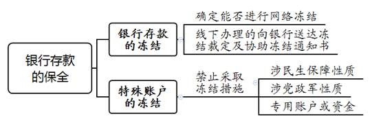
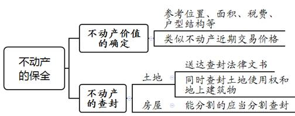
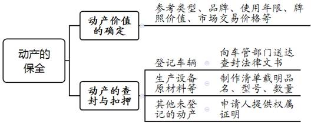
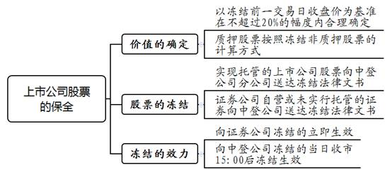
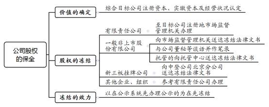
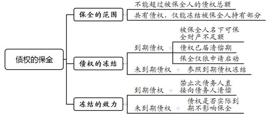
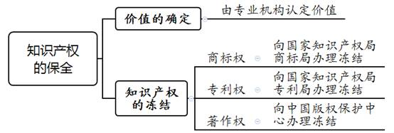

### **财产保全执行案件的办理思路和执行要点**

财产保全是指人民法院在案件受理前或者诉讼过程中，为保证将来生效判决的顺利执行或避免财产损失，根据一方当事人的申请或者依职权，依法对被保全人名下的财产采取的查封、扣押、冻结等强制执行措施。司法实践中，被保全人隐匿、转移或者毁损保全对象的情形时有发生，因超标的保全等侵害被保全人权益的情形也偶有发生。因此，法院在办理此类案件过程中，既要提高保全规范化水平和效率以保障申请保全人的权益，也要防止因超标的保全等侵犯被保全人的合法利益。本文结合司法实践中的典型案例，对此类执行案件的办理思路和执行要点进行梳理、提炼和总结。

一、典型案例

**案例一：涉及土地及在建工程的保全**

某民间借贷纠纷诉讼过程中，张某申请对A公司名下位于外省市的土地进行查封。查封前，房地产开发商已就土地上的在建工程办理了商品房预售许可证，且已预售上百套房屋。B法院依法向自然资源确权登记事务中心送达协助执行通知书及查封裁定，要求一并查封土地及地上在建工程。考虑到采取司法查封易引发群体性纠纷，该中心拒绝签收有关法律文书。执行法官在释明拒不协助办理的法律后果并留置送达法律文书后，该中心按时办理了查封。

**案例二：涉及超标的保全的确定**

某合同纠纷诉讼过程中，孙某申请对沈某名下财产进行保全，保全金额为4亿元。C法院查封沈某名下价值2.6亿余元的房产后，对沈某持有的7个有限责任公司的股权予以冻结。后沈某以上述7家公司注册资本共计1.7亿余元、C法院构成超标的冻结为由提出执行异议。

**案例三：涉及股票保全顺位的确定**

D公司在E、F法院均有涉诉，两案原告均申请对D公司持有的2000万股上市公司股票进行冻结。同一交易日内，E法院向中国证券登记结算有限责任公司上海分公司送达冻结法律文书，F法院则向证券公司送达冻结法律文书要求协助冻结D公司的资金账户和证券账户。后E、F法院就冻结的顺位产生争议层报共同上级法院协调。

**案例四：涉及非上市股份有限公司股权保全顺位的确定**

某金融借款合同纠纷诉讼过程中，G银行申请对H公司持有的非上市股份有限公司I公司股权予以冻结。J法院冻结I公司股权时仅向该公司送达了冻结法律文书。另案王某申请冻结H公司持有的I公司股权时，K法院向I公司所属的市场监督管理机关送达了冻结法律文书。由于J、K法院均主张其为生效冻结，双方未能就股权保全顺位协商一致，遂层报共同上级法院协调处理。

二、财产保全执行案件的办理难点

**（一）查封已预售的在建工程易引发群体性纠纷**

因司法查封产生禁止权利转移的法律效力，在查封部分或全部预售的在建工程后，已支付购房款的买受人无法自行办理房产证。该类情形下，司法实践中易产生两个问题：一是跨省市查封在建工程时，因担心产生群体性事件，部分外地协助机构借故拒绝或拖延协助保全。如案例一中，外省市自然资源确权登记事务中心出于自身利益考虑，协助查封土地及地上在建工程的积极性较低。B法院虽依法享有罚款、拘留的权力，但实践中跨省进行处罚的阻碍因素较多。二是符合法律规定的房屋买受人虽可通过保全异议程序排除保全，但群体性诉讼导致异议审查、维稳等部门压力较大。

**（二）超标的保全界定易绝对化**

法院采取财产保全时严禁超标的保全，但查封财产价值超过申请保全标的额并不必然构成超标的保全。原因在于：一是保全对象价值难以固定。如不动产、动产等保全对象价值一般依据市场交易价格进行估算，但该价格仅具有参考性，并可能随市场变化发生明显波动。如案例二中，沈某认为股权价值等同于公司注册资本，因无法确定公司股权明确价值，C法院裁定驳回其保全异议。二是保全对象负担优先受偿权。保全财产设有抵押权、质押权等法定优先权直接导致可供保全价值减少。三是保全对象能否分割影响保全价值。如保全对象为不可分割物且被保全人名下无其他相应价值的替代财产，查封财产价值虽超过申请保全标的额，应认定不构成超标的查封。

**（三）非上市股份有限公司股权保全争议多**

根据《公司法》第32条和《公司登记管理条例》第9条规定，非上市股份有限公司发起人的姓名或者名称属于登记事项，登记机关对非发起人的股东变更情况的公示不作强制要求。司法实践中，由于非上市股份有限公司股东实际持股数与对外公示持股数往往存在不一致易引发争议：一是登记股份数额与被保全人实际持有股份数量不一致时，执行法院如何判断冻结范围；二是多家法院分别向目标公司或市场监督管理机关送达法律文书要求冻结同一股权时，如何确定保全顺位。

**（四）一体财产分割登记落实难**

依据最高法院《关于在执行工作中进一步强化善意文明执行理念的意见》第4条规定，需要查封的不动产整体价值明显超出债权金额又无法分割查封的，法院有权要求相关部门办理分割登记。由于实践中将不动产整体登记在同一权利证书涉及规划等因素的综合考量，分割登记往往难度较大。自然资源确权登记事务中心为避免影响第三人利益，往往亦会拖延或借故拒绝协助。因此，虽然法院有权要求相关部门办理分割登记，但司法实践中不动产难以分割登记的情形依然较为常见。

三、财产保全案件执行的思路和要点

执行的主要价值在于最大限度兑付胜诉当事人的权益，维护执行依据的公信力；而财产保全制度的设立初衷在于保护当事人的私权、保障诉讼程序顺利进行、便于执行工作有效推进，从而维护司法权威。法院在办理财产保全案件时，**首先，要对申请保全人提供的财产信息或具体财产线索进行形式审查。其次，按照确定价值、采取强制执行措施、确认保全顺位的程序迅速对被保全人名下的财产或争议标的进行控制，既确保足额保全以保障申请保全人的利益，又要避免超标的保全对被保全人利益造成损害。最后，保全措施完成后，法院应当及时告知双方当事人查控结果，并释明异议救济途径**。

**（一）审查保全申请事项**

根据最高法院《关于人民法院办理财产保全案件若干问题的规定》第10、11条规定，当事人申请财产保全应当提供明确的财产信息或具体财产线索。对于当事人提供明确财产信息的，执行法院需尽到谨慎审查义务。出于保全效率和效果的考量，执行法院应要求申请保全人书面提供详细的财产权利归属及负担、估价、占有使用情况等内容。申请保全人提供财产线索申请保全时，可以一并书面申请法院通过网络执行查控系统查询被保全人的财产。执行法院借助该系统对被保全人的财产进行查询，并在裁定保全的财产或者保全数额范围内采取相应的查封、扣押、冻结措施。

**（二）实施七类常见财产的保全措施**

司法实践中，对于常见、易查找的银行存款、不动产、动产、股票、股权、债权、知识产权等七类财产，被申请保全的概率相对较大。剖析上述财产类型的保全步骤，能够最大程度覆盖财产保全的难点和要点，并对特殊财产的保全提供参考。对于其他新类型财产，执行法院在参照普通财产保全思路的基础上，坚持及时保全、信息公开的基本原则采取保全措施。

**1****、银行存款**

**（****1****）****银行存款的冻结**

保全对象为银行存款的，执行法院根据申请保全人提供的详细账户信息，首先通过网络执行查控系统确认账户能否被系统查询并进行网络冻结。实践中因银行反馈不全面等原因，网络执行查控系统无法查明被保全人名下所有账户。对于系统无法查询或不支持网络冻结的银行账户，执行法院需向相关银行出具冻结裁定及协助冻结通知书，以保全裁定载明金额为限要求银行协助冻结被保全人名下的银行账户内资金。

**（****2****）****特殊账户的冻结**

除法律另有规定外，执行法院原则上不得对以下特殊账户或特殊资金采取冻结措施：（1）涉民生保障性质账户或资金，如国有企业下岗职工基本生活保障资金、企业职工建房集资款、企业自列职工住房基金等；（2）涉党政军性质账户或资金，如工会经费、党费以及军队、武警部队一类保密单位开设的“特种预算存款”“特种其他存款”和连队账户的存款等；（3）专用账户或资金，如存款准备金、备付金、封闭贷款结算专户资金等。涉及被保全人基本生活需要的账户或资金，应采取审慎冻结的原则，避免影响其基本生活。

**2****、不动产**

**（****1****）****不动产价值的确定**

对于不动产价值的审查，执行法院主要考量该不动产的具体位置、面积、相关税费、户型结构等因素，同时参照类似地段、类似面积的其他同一类型不动产近期交易价格进行确定。

**（****2****）****不动产的查封**

保全对象为土地时，执行法院首先要求申请保全人确定地上是否有建筑物或在建工程。若该土地仅为空地，执行法院向土地所属区域的自然资源确权登记事务中心送达协助执行通知书及查封裁定，要求协助查封土地使用权。若该土地上存在无证建筑物或在建工程，根据房地一体原则，执行法院一并查封地上建筑物（包括竣工工程和在建无证建筑物）和土地使用权。

查封被保全人名下房屋的，查封手续同上。对于不动产整体价值明显超出保全标的额且可以分割查封的，应当分割查封，并在协助执行通知书上明确所查封的具体部位。除房屋与土地所有权分别属于被保全人、第三人情形外，房屋查封效力及于地上建筑物使用范围内的土地使用权。

根据最高法院《关于人民法院民事执行中查封、扣押、冻结财产的规定》第7条规定，查封不动产的，人民法院应当张贴封条或者公告，并可以提取保存有关财产权证照。

**3****、动产**

**（****1****）****动产价值的确定**

对于车辆、船舶等特殊动产的价值，执行法院需综合类型品牌、使用年限、牌照价值、市场交易价格等加以确定。财产保全的主要目的在于限制权利转移，是否实际控制该动产不作为估值考量的因素。

**（****2****）****动产的查封与扣押**

申请保全人申请保全动产的，应当提供该动产的权属证明、实际控制人、占有使用情况及具体位置。船舶作为特殊动产，地方法院受理该类财产保全申请的，一般可自行办理保全手续，但对于《海商法》第3条规定的海船等，可以委托船籍港所在地或者船舶所在地的海事法院保全。

第一，保全对象为已经办理登记的机动车的，执行法院应向车辆管理部门送达查封裁定及协助执行通知书。申请保全人能够提供车辆具体所在地的，应对车辆予以扣押并张贴封条或公告，由法院直接保管或委托第三人保管，保管期间禁止使用。执行法院应及时向申请保全人释明，车辆保管所产生的费用作为实际支出费用，将在执行中优先支付。扣押尚未进行权属登记的车辆，经被保全人申请，扣押期间准许办理权属登记手续。第二，保全对象为生产设备、原材料、半成品、产品的，执行法院应制作清单载明品名、型号、数量等，并在相关动产上张贴封条或公告。第三，保全对象为其他未办理登记的动产的，应由申请保全人提供权属证明。若被保全人承认动产归其所有或动产虽保管于第三人处但第三人认可归被保全人所有的，执行法院可采取查封、扣押措施。

至于查封动产是否必须扣押，执行法院应当综合考虑案件标的、允许使用是否导致动产价值贬损以及双方当事人利益平衡保护予以确定。若动产价值明显高于案件标的，继续使用不影响财产变现的，执行法院应当采取“活封”方式；若继续使用将导致动产价值贬损，执行法院需考量动产价值贬损后能否覆盖保全标的额以及对被保全人生产、生活的影响程度决定是否扣押财产。

****

**4****、上市公司股票**

**（****1****）****价值的确定**

根据最高法院《关于在执行工作中进一步强化善意文明执行理念的意见》第7条规定，上市公司股票的价值以冻结前一交易日收盘价为基准，结合股票市场行情，一般在不超过20%的幅度内合理确定。对于质押股票的冻结，根据《最高人民法院、最高人民检察院、公安部、中国证券监督管理委员会关于进一步规范人民法院冻结上市公司质押股票工作的意见》第2条规定，执行法院需按照冻结非质押股票的计算方式，在协助执行通知书中载明需要冻结的股票数量。

**（****2****）****上市公司股票的冻结**

对于实行托管的上市公司股票，中登公司和证券公司均可办理冻结，执行法院需向其送达协助执行通知书及冻结裁定。执行法院要求中登公司协助冻结的，根据股票上市交易场所不同，分别由中登公司北京、上海、深圳分公司协助冻结。证券公司自营或者未实行托管的股票，依法由中登公司办理冻结手续。需要说明的是，根据最高法院《关于冻结、拍卖上市公司国有股和社会法人股若干问题的规定》第5条规定，冻结上市公司国有股和社会法人股7日内，执行法院应当书面通知该上市公司。

因上市公司股票流通的特殊性，协助机构对于协助冻结内容要求更为具体、严格，司法实践中执行法院可根据协助机构提供的协助冻结模板进行填写，并明确冻结的效力是否及于孳息。

**（****3****）****冻结效力**

执行法院通过证券公司冻结上市公司股票的，冻结效力即刻生效，股票冻结后无法进行交易；通过中登公司协助冻结的，冻结效力在当日收市15:00完成清算交收后方能生效，股票在当日15:00之前仍然可以交易。多家法院就同一股票于同一交易日分别向证券公司和中登公司送达法律文书要求协助冻结的，首先向证券公司送达冻结法律文书的执行法院的冻结为生效冻结，其余均为轮候冻结。如案例三中，同一交易日内，F法院首先向证券公司送达冻结法律文书，则其为生效冻结，E法院为轮候冻结。

**5****、公司股权**

为行文方便，该节所指“公司股权”不仅包括非上市股份有限公司、有限责任公司的股权，还包括合伙企业的财产份额等。

**（****1****）****价值的确定**

不同于实物财产，股权价值往往缺少市场交易参照价格。同时，股权因其瑕疵隐蔽性、权利负担封闭性等特征，非经专业机构评估难以准确判断其价值。因此在保全阶段，除非被保全人能提供材料证明股权价值，否则被保全股权的价值应由执行法院综合考量以下因素后确定：（1）公司注册资本或实缴资本；（2）公司经营情况，包括市场监督管理机关有无将其列入经营异常名单、有无预警提醒信息、公司资产负债表等。

**（2）****股权的冻结**

执行法院冻结股权，应当制作冻结裁定书、协助执行通知书。执行法院冻结标的包括股权及其相应收益。

其一，保全对象为有限责任公司股权的，执行法院应当根据申请保全人提供的股权线索向目标公司登记注册所在地的市场监督管理机关送达冻结法律文书，要求其冻结公示，并不得办理被冻结股权的转移手续。同时，执行法院应向申请保全人、被保全人送达裁定书，并将股权冻结情况书面通知目标公司。执行法院可以向目标公司送达协助执行通知书，要求其在实施增资、减资、合并、分立等对被冻结股权所占比例、股权价值产生重大影响的行为前向法院书面报告有关情况。法院冻结被保全人基于股权享有的股息、红利等收益，应当向目标公司送达裁定书，目标公司负有股权收益到期时通知法院及禁止擅自向被保全人支付或者变相支付的义务。

其二，保全对象为一般非上市股份有限公司股权的，冻结流程同有限责任公司。因公司性质的特殊性，为避免冻结效力产生争议，除需向目标公司送达协助冻结法律文书外，执行法院还需与公司董秘或股东名册管理负责人谈话并记录在案。通过谈话确认被保全人的持股份额、是否存在质押、有无其他法院的在先冻结等情况，并明确告知禁止公司在法院冻结期间办理股权变更等事项。部分公司实行股权托管的，执行法院需同时向托管中心送达相关法律文书。

其三，保全对象为新三板公司股份的，由于该类公司的股份由中登公司集中登记，执行法院需向中登公司北京分公司送达法律文书要求协助冻结。其四，冻结其他企业、组织股权或投资份额的，除法律另有规定，冻结程序参照普通有限责任公司。

**（****3****）****冻结的效力**

若多家法院对被保全人持有的同一股权采取冻结措施，并先后向目标公司和市场监督管理机关送达协助冻结法律文书的，根据最高法院《关于人民法院强制执行股权若干问题的规定》第6条规定，股权冻结自公示系统公示时发生法律效力。多个法院冻结同一股权的，以在公示系统先办理公示的为在先冻结。非上市股份有限公司的股权冻结顺位，亦适用公示在先的为生效冻结、其余均为轮候冻结的确定规则。

如案例四中，J法院、K法院就非上市股份有限公司的股权冻结顺位产生争议时，在市场监督管理机关公示系统先办理公示的K法院的冻结为生效冻结，向目标公司送达协助公示通知书的J法院的冻结为轮候冻结。

值得注意的是，因非上市股份有限公司发起人的初始投资信息属于法定登记范围，登记机关对非发起人股东变更情况的公示不作强制要求，由此易产生股东实际持股数与公示份额不一致的情况，故股东实际持股数应以目标公司记载为准。对于股东减持股份而造成实际持股与对外公示不一致的情况，执行法院应同时向市场监督管理机关、目标公司、股权托管中心送达冻结法律文书，要求冻结被保全人目前实际持有的份额；对于股东因增持而造成实际持股与对外公示不一致的情况，执行法院应同时向市场监督管理机关、目标公司、股权托管中心送达冻结法律文书，要求冻结被保全人持有的全部股份，避免发生未经备案的增持部分被其他法院在先冻结的情况。

**6****、债权**

**（****1****）****保全范围**

申请保全人申请保全债权的，被保全的债权金额不得超过被保全人所享有的债权总额。被保全人与他人共同享有债权的，执行法院仅能就被保全人所享有的债权采取冻结措施。

**（****2****）****债权的冻结**

冻结被保全人享有的债权时，执行法院应当向次债务人送达协助执行通知书及冻结裁定。债权的到期与否不影响执行法院采取冻结措施。根据《民事诉讼法解释》第501条规定，法院冻结被保全人对他人的到期债权，可以作出冻结债权的裁定，并通知该他人向申请保全人履行。

根据《民事诉讼法解释》第159条规定，启动到期债权的保全应当同时具备以下三个条件：（1）被保全人名下所有可供保全的财产价值总额低于保全标的额或者其名下财产属于法律规定的不得保全物；（2）被保全人对次债务人的债权期限已届满；（3）申请保全人提出对到期债权的保全申请。

执行法院不得对次债务人否认的债权采取实际保全措施，但已经生效法律文书确定、次债务人又予以否认的，执行法院不予支持。若到期债权已经生效法律文书确定且在其他法院进入执行阶段，采取保全措施的法院还需同时向他案执行法院送达冻结法律文书，以冻结执行案件中的案款。次债务人对到期债务的保全有异议的，依照《民事诉讼法》第232条规定处理。

申请保全人申请冻结未到期债权的，参照冻结到期债权的规定。次债务人仅以债务未到期为由提出异议，不影响对债权的冻结。若次债务人的异议涉及债权债务关系是否存在、债权总金额的确定等实体问题，执行法院不应继续采取保全措施。

**（****3****）****冻结的效力**

法院冻结被保全人享有的债权时，应向次债务人释明擅自履行的法律后果。保全债权所产生的法律效果在于禁止次债务人在冻结期限内直接向债务人清偿债务；次债务人要求清偿的，可由执行法院进行提存。次债务存在保证人的，执行法院无权直接查封保证人的财产。

**7****、知识产权**

**（****1****）****价值的确定**

商标权、专利权是司法实践中常见的知识产权保全对象。作为无形财产，上述两类知识产权的价值非经专业机构无法认定，因此申请保全人申请保全上述两类知识产权的，执行法院一般应予以全部冻结。申请保全人申请保全著作权的，由于著作权兼具人身性与财产性的特征，执行法院只能就其中的财产权部分进行冻结。

**（****2****）****知识产权的冻结**

申请保全人申请冻结商标权或专利权的，执行法院应当制作保全裁定书和协助执行通知书，向国家知识产权局商标局或国家知识产权局专利局送达并要求协助办理冻结。协助执行通知书需注明商标或专利的名称、注册人或申请人、注册号或申请号、保全期限及协助执行保全的内容。冻结著作权的，执行法院应当向中国版权保护中心送达保全裁定书和协助执行通知书，并注明作品名称、登记号等内容。

**（三）保全异议的权利救济**

财产保全完成后，执行法院应及时向申请保全人送达财产保全执行情况告知书，列明保全的标的物、权利范围、数量、期限及起止日期，并告知申请保全人应当在保全期限届满前向执行法院提起续封申请。考虑到办理续封需要一定时间，执行法院可要求申请保全人在保全期限届满30日前申请续保，并向其释明保全续保申请应向审判庭提出。同时，为保障被保全人的知情权和异议权，执行法院应当向其送达财产查封、扣押、冻结清单，列明事项同上。

**1****、对保全裁定异议的审查**

申请保全人、被保全人对保全裁定或者驳回申请裁定不服的，可以自裁定书送达之日起五日内向保全裁定作出部门申请复议一次，相关部门应当自收到复议申请后十日内审查。

**2****、对保全行为异议的审查**

申请保全人、被保全人、利害关系人认为保全裁定实施过程中的执行行为违反法律规定提出书面异议的，执行审查机构应当依照《民事诉讼法》第232条规定审查处理。

**3****、对保全标的异议的审查**

执行法院对诉讼争议标的以外的财产进行保全，案外人对保全裁定或者保全裁定实施过程中的执行行为不服，基于实体权利对被保全财产提出书面异议的，执行审查机构应当依照《民事诉讼法》第234条规定审查并作出裁定。案外人、申请保全人对该裁定不服的，可以自裁定送达之日起十五日内向执行法院提起执行异议之诉。法院裁定案外人异议成立后，申请保全人在法律规定的期间内未提起执行异议之诉的，执行法院应当自起诉期限届满之日起七日内对该被保全财产解除保全。

**（四）财产保全的注意事项**

**1****、注重财产保全的时效性**

财产保全的主要功能在于保障判决的后续执行、避免可能损害当事人情形的发生，因此保全顺位对于当事人的利益实现至关重要。对情况紧急的，法院必须在四十八小时内作出裁定；裁定采取保全措施的，应当立即开始执行。通常情况下提出的保全申请，执行法院亦应注重时效性，应当在受理财产保全申请五日内作出裁定；需要提供担保的，应当在提供担保后五日内作出裁定。对于支持网络查控的财产，执行法院应当在财产查询结果反馈后立即申请网络查封、冻结；对于必须线下查控的财产，执行法院综合考量保全标的、申请时间、财产所在地等因素，在裁定作出五日内开始执行。

**2****、超标的保全的例外**

一是查封不可分割物不构成超标的保全。对于登记于同一产权证书的不动产，整体价值明显超过保全标的额时，因实践中分割登记难度较大，若无法分割查封且被保全人名下无其他相应价值的财产替代物，此时整体查封不属于超标的保全。二是轮候保全的不构成超标的保全。因轮候查封、扣押、冻结不产生正式查封、扣押、冻结的效力，故轮候保全的财产不计入实际保全金额，不受财产本身价值影响。三是保全存在他人优先受偿权的财产不构成超标的保全。其他债权人对被保全财产享有抵押权、质押权等优先受偿权的，为保障申请保全人在执行阶段就被保全财产变价款足额清偿，计算保全标的额时应扣除相应优先受偿金额。

**3****、衡平保护被保全人利益**

保全过程中执行法院应注意申请保全人权利实现和被保全人合法权益的衡平保护，对被保全人名下的财产灵活采取查控措施。对于能“活封”的财产不进行“死封”，有效释放被保全财产的使用价值和融资功能，减少对被保全人正常生产、生活的影响。查封在建工程的，原则上应当允许被保全人继续建设；冻结上市公司股票的，经申请应当准许将冻结措施变更为可售性冻结，使得被保全财产在执行阶段实现变现价值最大化。

四、其他需要说明的问题

本文仅讨论民事案件中的财产保全措施，刑事、行政案件的财产保全，因启动主体或保全对象有所不同，不在本文讨论范围。保全案件结案后，申请保全人就新的财产线索再次申请保全的，执行法院应根据保全裁定重新立案，立案完成后区分财产种类采取保全措施。

（根据执行局唐卓青、叶煜楠提供材料整理）