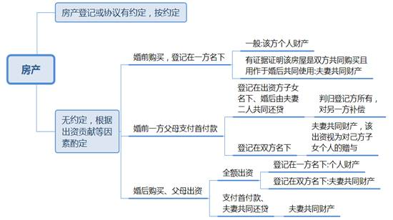
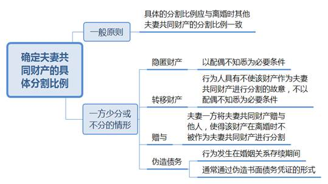

### **离婚后财产纠纷案件的审理思路和裁判要点**

离婚后财产纠纷，是指已通过判决或协议离婚的夫妻双方在离婚后因财产分割、补偿、离婚协议的履行等问题产生的纠纷。现代婚姻家庭财产状况愈发复杂，加之恶意隐藏、转移财产或对离婚协议反悔等情况，离婚后一方要求进一步分割或重新分割夫妻共同财产的纠纷日益多发。离婚后财产纠纷案件主要包括两种情形：一是离婚时有夫妻共同财产遗漏未处理或难以处理，现要求处理的；二是基于离婚协议引发财产纠纷的。本文结合司法实践中的典型案例，对该类案件的审理思路和裁判要点进行梳理、提炼和总结。

一、典型案例

**案例一：涉及离婚时未处理夫妻共同财产的认定**

孙某与程某婚姻关系存续期间，程某父亲将部分公司股权作价转让给程某，程某登记为公司股东。后孙某与程某的离婚判决未对该公司股权作出处理。离婚后，孙某向法院起诉请求判令程某向其支付公司股权折价款。审理中，程某提供了一份签订时间为婚姻存续期间的代持协议，提出其系代母亲持有公司股权，该股权不应作为夫妻共同财产分割。

**案例二：涉及夫妻一方恶意隐藏、转移夫妻共同财产的认定**

吴某与高某离婚诉讼期间，高某与案外人李某签订房地产买卖合同，李某向高某购买系争房产并办理过户手续。吴某与高某诉讼离婚但未对该房产作出处理，后吴某另行起诉高某和李某，请求法院判决该房地产买卖合同无效。同时，吴某再提起离婚后财产纠纷诉讼，主张高某存在恶意转移夫妻共同财产的行为，应少分或者不分涉案房产。一审法院结合系争房产的购房款来源等因素，酌定由高某占房产60%份额，吴某占40%份额，房产判归高某所有。吴某不服提出上诉。

**案例三：涉及离婚协议效力的认定**

黄某与王某签订离婚协议约定夫妻共同财产的分割情况，黄某需支付王某补偿款300万元。离婚后黄某支付294万余元后，王某用该笔钱款支付某学区房首付。购房后黄某催促王某复婚遭拒绝。黄某起诉称双方离婚系为购买学区房的“假离婚”，请求法院撤销离婚协议中关于财产分配的约定，判令王某返还黄某个人财产294万余元，并对夫妻共同财产重新进行分割。

二、离婚后财产纠纷案件的审理难点

**（一）是否属于夫妻共同财产确定难**

离婚后财产纠纷案件中的争议财产往往系离婚案件中难以处理或者涉及案外人的财产。当事人之间关系复杂、矛盾尖锐、资金往来频繁、调查取证困难等因素导致在认定涉案财产是否属于夫妻共同财产时存在困难。尤其动拆迁房产分割往往涉及案外人利益，使得夫妻共同财产认定增加难度。同时，该类纠纷涉及的财产种类较多，不仅包括房产、车辆、银行存款、有价证券等有形财产，还包括债权债务、知识产权等无形财产，取证和认定更加复杂。

**（二）隐藏、转移夫妻共同财产的行为判断难**

一方隐藏、转移夫妻共同财产的，在离婚分割夫妻共同财产时依法可以少分或不分。离婚后财产纠纷案件中一方当事人以该理由主张另一方少分财产的，应承担举证责任证明另一方有隐藏、转移夫妻共同财产的行为。夫妻生活及财产状况属于家庭隐私，加之行为人在隐藏、转移夫妻共同财产时往往经过精心策划，手段隐蔽从而增加了取证难度。需要说明的是，导致夫妻一方少分或不分财产的行为还包括变卖、毁损、挥霍夫妻共同财产，或伪造夫妻共同债务企图侵占另一方财产的行为，由于涉及此类行为的案件较少，本文在此不作赘述。

**（三）离婚协议是否能够变更或撤销认定难**

虽然从文义上理解最高法院《民法典婚姻家庭解释一》第70条的规定，变更或撤销离婚协议的理由并不限于欺诈和胁迫，但由于离婚协议不同于一般的民事合同，除纯粹的利益考量外，还包含身份关系和感情因素的变化，因此不能将协议中一方放弃主要或大部分财产认定为显失公平或重大误解，从而认定离婚协议可变更或可撤销。目前司法实践仅在欺诈和胁迫两种情形下判定离婚协议可变更或可撤销，并由主张变更或撤销协议的一方承担举证责任。由于对存在欺诈或胁迫较难举证，对于离婚协议是否可变更或可撤销法院较难认定。

三、离婚后财产纠纷案件的审理思路和裁判要点

离婚时有财产未处理或难以处理，在离婚后财产纠纷案件中需要处理，或者离婚协议存在可变更、可撤销的情形，财产需要重新进行分割的，处理原则应与离婚时其他财产的处理原则一致。对于夫妻共同财产和个人财产的认定应遵循离婚案件中财产处理的一般原则，**在认定为夫妻共同财产的基础上，按照照顾妇女、子女和无过错方原则对财产进行分割**。如果一方存在恶意隐藏、转移财产等情形，在分割夫妻共同财产时应少分或不分。

**（一）离婚时未分割夫妻共同财产的处理**

**1****、审查涉案财产在离婚协议或离婚判决中是否已处理**

根据相关法律规定，如果经审查涉案财产确属离婚时未涉及的夫妻共同财产，法院应当予以分割。通常离婚判决对夫妻共同财产的处理较为明确，可以根据判决主文判定涉案财产是否已经处理。存在争议的主要是离婚协议中关于财产分割的条款，在无明确约定或者法律无特别规定的情况下，不宜推定为当事人放弃对未处理财产的分割权利。需要注意的是，离婚协议中若存在兜底条款，应查明在签订协议时当事人对涉案财产是否知情。若请求分割财产一方能够证明自己不知情，一般应当认定兜底条款中不包含该财产。

**2****、审查离婚时未处理财产是否属于夫妻共同财产**

对于已判定为离婚时未处理的财产，应根据《民法典》及有关司法解释的规定对该财产是否属于夫妻共同财产进行认定。

**（****1****）银行存款**

离婚后一方提出夫妻关系存续期间的银行存款未处理，经查证属实的，应作为夫妻共同财产进行分割。在夫妻双方协议离婚的情况下，银行存款的分割应以离婚协议签订之日为结算点，如果离婚协议约定以某一特定日期为结算点，则以离婚协议约定为准；在法院判决离婚的情况下，以法院判决书的落款日期为结算点。对于签订离婚协议至办理离婚登记之间的出入账款项，如果离婚协议对双方名下的银行存款已作出约定，在办理离婚登记前银行账户存在资金流动的，应查明入账款项是否属于夫妻关系存续期间的收入以及出账款项是否合理，并将夫妻关系存续期间的收入减去该段期间的合理支出作为夫妻共同财产予以分割。

**（****2****）房产**

夫妻与他人（主要为父母、成年子女）共有的房产、离婚时产证尚未办出的房产在离婚案件中无法一并处理，在离婚后财产纠纷案件中一方提出要求分割的，应当予以处理。房产登记或协议约定各方份额的，应按照约定的份额予以分割；未登记或未约定份额的，应根据各方的出资情况、对共有房产的贡献大小等因素酌定各方的产权份额，再根据便于分割、给付折价款及履行贷款债务等原则判定房产的归属及折价款的给付方。

对于婚前购买、登记在一方名下的房产，一般应认定为该方的个人财产，但有证据证明该房产系双方共同购买且用作婚后共同使用的，应认定为夫妻共同财产。为此需要结合资金流水判定房产的首付款、税款的实际付款人，并综合购房时当事人之间的关系、资产状况、房产使用情况等事实，还原购房过程。对于作为夫妻共同财产的房产，在判定该房产为一方所有的情况下，要结合房产的剩余未还贷款、双方离婚后的还贷情况、保护妇女权益等因素，酌定向另一方支付的房产折价款金额。

对于婚前一方父母支付首付款的房产，如果登记在出资方子女名下、婚后由夫妻二人共同还贷，一般将房产判归登记方所有，并由其继续支付剩余贷款，婚内共同还贷（包括本金和利息）及增值部分由获得房产的一方对另一方做出补偿。如果婚前登记在夫妻双方名下，双方约定共同共有或按份共有的，按约定享有产权；双方对共有方式没有约定的，则父母出资视为对己方子女个人的赠与，父母明确表示赠与双方的亦应在确定分割比例时对父母的出资进行酌情考量。

对于婚后由一方父母出资购买的房产，如果父母全额出资，登记在己方子女名下则为己方子女的个人财产，登记在双方名下则为夫妻共同财产；如果一方父母支付首付款，夫妻共同还贷，无论登记在己方子女名下还是夫妻双方名下，均为夫妻共同财产，但另有约定的依照约定处理。

**（****3****）股权**

离婚后财产纠纷案件中涉及股权的主要问题有三点：

**第一**，存在代持关系的股权是否属于夫妻共同财产。夫妻一方在夫妻关系存续期间受让取得的股权，在转让人无特别声明的情况下，无论该受让是否需要支付对价，受让股权原则上均应认定为夫妻共同财产。如果受让方提出该股权系替案外人代持，则应提供代持协议原件等足以证明存在代持关系的证据。在能够证明存在代持关系的情况下，该股权不应作为夫妻共同财产分割。

如案例一中，程某在夫妻关系存续期间受让取得系争股权并登记为公司股东，虽提出系代其母亲持有公司股权并提供代持协议复印件，但由于无法提供协议原件，其他证据亦不足以证明代持关系存在，因此法院认定系争股权属于夫妻共同财产，应予以分割且股权价值以分割时的股权价值为准。

**第二**，有限责任公司的股权分割问题。由于涉及公司章程规定、其他股东优先购买权等，在审理此类案件时应首先查明所涉公司全部股权构成。其次，应考虑有限责任公司分割股权的方式。《公司法》规定转让有限责任公司股权给股东以外的人，需经其他股东过半数同意。如其他股东过半数同意的，夫妻未持有股权的一方成为该公司的股东并持有按比例分割的股权。如果其他股东过半数不同意转让股权但同意购买的，则由原持有股权的夫妻一方将股权转让款支付给夫妻另一方。

**第三**，离婚后股权价值的确定问题。由于公司资产状况处于不断变动之中，且与一方投入的时间、精力和管理有关，离婚后夫妻双方不再具有财产共有的基础关系，对离婚后原共有股权所产生的收益另一方无权主张。因此，应当以离婚判决的生效日或者离婚协议的签订日作为基准日，一般以评估方式确定应当支付的股权折价款。

**3****、确定夫妻共同财产的具体分割比例**

离婚后财产纠纷案件中需要分割的财产之所以在离婚时未作处理，部分是因为行为人的行为具有隐蔽性，另一方在离婚时由于取证等原因未能将其作为夫妻共同财产进行分割。此类离婚后财产分割应遵循处理夫妻共同财产的一般原则。另一种情形是一方在离婚时隐藏、转移、变卖、毁损夫妻共同财产，或伪造夫妻共同债务企图侵占另一方财产，此类离婚后财产分割该方可予以少分或不分。该类行为构成要件主要有：

**（****1****）具有隐藏、转移夫妻共同财产的故意**

实施隐藏、转移夫妻共同财产行为需具有相应的主观故意。例如行为人只因不具备购房条件而以他人名义购房，不具备隐藏或转移财产的故意，则不属于可少分或不分的情形。对于隐藏财产，行为人一开始可能并不具有使该财产不作为夫妻共同财产进行分割的故意；对于转移财产，行为人一开始就具有不使该财产作为夫妻共同财产进行分割的故意。对于行为人是否具有故意，可以根据其具体行为来判断，比如夫妻双方已存在不可调和的矛盾或离婚已属必然时，一方将财产转至案外人名下时该行为构成故意。需要说明的是，根据行为推断行为人具有隐藏、转移财产的故意时，行为人否认该故意的，行为人负有举证责任证明其不存在故意。

如案例二中，二审法院查明在离婚诉讼期间，高某与案外人签订房地产买卖合同，低价将系争房产恶意出售给案外人，且另案生效判决已确认该房地产买卖合同无效。因此，高某具有恶意转移夫妻共同财产的故意及行为，二审法院对一审判定高某所占系争房产的比例予以适当减少。

**（****2****）具有隐藏、转移夫妻共同财产的行为**

认定一方隐藏财产的首要前提是其行为不为配偶所知悉，且自认为其行为具有隐蔽性。对于隐藏财产可以根据财产的类型进行具体分析：

**关于动产**，主张对方隐藏动产的一方应当承担举证责任证明另一方实施了隐藏动产的行为，当另一方提供足够证据予以反驳的，主张对方隐藏动产的一方仍需就对方反驳的证据再行举证。需要注意的是，如果另一方在离婚诉讼中否认该财产的存在，离婚后发现该财产由其控制或在其知晓的地方，则可以直接认定其实施了隐藏夫妻共同财产的行为。

**关于不动产**，主要有以下三种情形：**第一**，一方以自己名义在他处购房，配偶对此不知情。**第二**，在配偶不知情的情况下将不动产过户至他人名下。**第三**，在婚姻关系存续期间，一方以隐藏财产为目的，在配偶不知情的情况下以他人名义购置不动产。

离婚后财产纠纷中涉及不动产的审查和认定证据的原则为：**首先**，对于不动产权利登记凭证、银行转账记录、不动产买卖合同等不动产交易的相关文件，应当审查其合法性和真实性，如是否存在违反法律法规的不动产交易行为、是否存在虚假交易、提供的证据材料是否存在伪造的可能等，对于不具有合法性和真实性的证据应当予以排除。**其次**，涉及不动产交易的证人证言应结合下列证据对关联性进行审查：**一是**婚姻关系存续期间一方是否存在大额钱款支出，该笔钱款是否支付给房产公司或不动产的卖家。同时应注意审查被隐瞒不动产的实际居住情况，查明房产是否由亲属、“第三者”等居住，从而确认房产的产权登记及出资情况。**二是**对于一方擅自处分不动产的情况，应注意审查不动产的交易时间、金额和对象，查明不动产交易是否存在无权处分和善意取得等情况。**三是**对于婚前购房，应审查购房款的来源及组成，结合银行汇款记录或信用卡刷卡记录等，判断对方是否共同出资购房。

**关于银行存款**，审查要求分割的钱款在离婚时是否包含在已分割的夫妻共同财产中，以及该笔钱款是否可供分割。对于隐瞒银行存款的情况，一方面法院可以基于当事人的申请，采取职权调查的方式查明事实真相。当事人如果申请法院调查对方的银行流水，原则上应提供相应存款的开户行和存款账号。另一方面，应注意结合当事人对钱款的用途考察钱款支出的合理性：**一是**支取现金的持续时间是否合理；**二是**取款金额与用途之间是否匹配；**三是**与取款方正常开支情况是否一致。

转移财产的认定并不以配偶不知悉作为必要条件。赠与可以成为转移财产的一种方式。夫妻一方将夫妻共同财产赠与他人，会使得该财产在离婚时无法作为夫妻共同财产进行分割。另一方起诉要求撤销赠与并得到法院支持的，在财产返还后即会产生夫妻共同财产分割的问题。实践中，若在夫妻关系存续期间一方将夫妻共同财产赠与第三者，该行为因侵害另一方的财产权益应被认定为无效，相关款项亦应予以返还，财产返还后应在夫妻之间再进行分割。

除隐藏、转移夫妻共同财产的行为，伪造夫妻共同债务企图侵占另一方财产也是分割夫妻共同财产时需要审查的内容。对于伪造债务的认定，可以通过以下两个方面进行判断：一是伪造债务的行为发生在婚姻关系存续期间。如果在离婚前某一特定时间段内（司法实践多为离婚前一年）一方债务突然大量增加，而此时婚姻关系已经处于不可避免的破裂状态，则可以认定其具有伪造债务的嫌疑。二是伪造债务的行为通常通过伪造书面债务凭证的形式，如借条、借款合同、债权债务公证书等实现。该类案件的证据通常包括书面债务凭证、债权人或其他证人的证言，法院可以通过审查资金往来情况、合同的真实性等判断是否存在伪造债务的事实。

**（二）基于离婚协议引发财产纠纷的处理**

**1****、审查涉案离婚协议的合法性**

审理因履行离婚协议产生纠纷的案件，首先需要审查该协议形式是否合法，即离婚协议是否存在违反法律规定的情形。如果离婚协议违反法律强制性规定，则该条款不具有法律效力；如果离婚协议符合法律规定，一方未按照协议内容履行协议，另一方有权请求履行。

**2****、审查财产分割协议是否存在可变更、可撤销的情形**

审查财产分割协议是否存在可变更、可撤销的情形，不能轻易将协议中一方放弃主要或大部分财产的约定认定为显失公平或重大误解而予以变更或撤销。同时应当审慎认定乘人之危，不宜将急欲离婚的一方在财产上的让步视为另一方乘人之危的结果。只有在一方利用他方行为能力受限且监护人监护不力等情况下，迫使他方签订明显损害本人合法权益的协议，方可认定为乘人之危。因此，只要在签订协议时不存在欺诈、胁迫的情形，对当事人请求变更或者撤销协议的请求原则上不予支持。对于存在欺诈或胁迫的情形应由主张变更或撤销协议的一方承担举证责任，根据证据的证明力进行综合判断。

实践中，很多离婚后财产纠纷案件当事人主张以“假离婚”为由否定离婚协议的效力。“假离婚”并非法律概念，双方当事人在婚姻登记机关登记离婚起，双方身份关系即已解除。离婚的目的并不影响对双方当事人之间身份关系的判断。然而，如果根据双方当事人在签订协议前后所进行的相关行为，可以认定离婚协议并非双方当事人的真实意思表示，应认定离婚协议中关于财产分割的条款无效，对相应的财产进行重新分割。

如案例三中，根据双方当事人在办理离婚登记前后的多次聊天记录，可以认定双方离婚协议系为购买房产达成的虚假意思表示。因此，虽然双方已办理离婚登记而使得人身关系不能回转，但离婚协议中的财产约定非当事人的真实意思表示，法院应判定无效并对相应的财产重新进行分割。

**3****、审查离婚协议是否约定将夫妻共同共有房产赠与未成年子女**

如果夫妻双方在离婚协议中约定解除夫妻身份关系的条件之一是将共有房产赠与未成年子女，一方事后反悔会破坏离婚协议的整体性且有违诚实信用原则。因此在婚姻关系解除后，一方以房产产权尚未变更，仍处于共有财产状态为由主张撤销之前的赠与行为要求重新分割的，法院不予支持。根据合同相对性原则，若离婚协议中约定子女享有房产赠与的交付请求权，则子女享有直接请求交付的权利；若未作此类约定的，则子女不享有请求权，无权作为适格主体提起诉讼。

（根据少年家事庭黄蓓、孙路路提供材料整理）