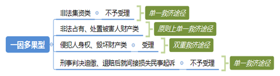

### **刑民交叉案件程序问题的审理思路和裁判要点**

刑民交叉案件，是指一个完整的案件事实过程所包含的当事人合法权益，通常需要经由分别提起刑事和民事两种诉讼才能给予充分保护或救济的案件。刑民交叉案件包括“一因多果”型、“多因一果”型以及“行为延伸”型三个类别。本文仅讨论刑民交叉案件中相关民事案件的审判程序问题。刑民交叉案件在程序上如何相互协调，达到整体处理的最佳效果，下面结合典型案例，侧重以涉非法集资类犯罪的民间借贷和保证合同纠纷等案件为研究重点，对该类案件立案审查阶段和审理阶段的相关程序问题进行梳理、提炼和总结。

**一、典型案例**

**案例一：涉及刑民交叉案件中犯罪嫌疑的认定**

戴某与程某、谢某、贾某因房屋买卖产生纠纷，并将程某诉至法院。戴某诉称被人欺骗向谢某借款，并办理委托贾某卖房的委托公证。后贾某在戴某不知情且未收到任何购房款的情况下，与程某签订合同将戴某名下房屋售予程某，由此引发纠纷。审理过程中，一审法院认为本案存在犯罪嫌疑，裁定驳回戴某的起诉。戴某不服，上诉至二审法院。

**案例二：涉及刑民交叉案件中同一事实的认定**

A公司因诈骗罪被提起公诉。A公司在诈骗事实发生期间曾以公司周转为由向B公司借款。后因借款到期未还，B公司将A公司诉至法院。立案审查过程中，一审法院认为两公司间的借贷事实与A公司涉嫌犯罪的事实属于同一事实，裁定对B公司的起诉不予受理。B公司不服，上诉至二审法院。

**案例三：涉及一因多果型刑民交叉案件分别救济途径的适用**

C公司与D公司就某项目签订《采购合同》。后C公司在内部审核中发现，D公司的投标书与其他多家公司的投标书存在多处非巧合性雷同。C公司认为D公司构成串通投标，遂将D公司诉至法院请求解除合同并赔偿损失。案件审理期间，公安机关对D公司涉嫌串通投标罪立案侦查。一审法院认为本案存在犯罪嫌疑，裁定驳回C公司的起诉。C公司不服，上诉至二审法院。

**二、刑民交叉案件程序问题的审理难点**

**（一）犯罪嫌疑认定难**

《刑法》第13条已对“犯罪”的内涵和外延加以规定，但仅凭该原则性规定很难具体认定刑民交叉案件中当事人是否具有犯罪嫌疑。要认定犯罪嫌疑，审查的专业性和调查的全面性缺一不可。在一般刑事案件中，犯罪嫌疑的认定主体通常是侦查机关，其调查的手段和方法均具有较强的专业性。在刑民交叉案件中，民事法官仅凭民事案件相关证据直接认定刑事犯罪嫌疑难度较大。

**（二）同一事实认定难**

在明确刑民交叉案件存在犯罪嫌疑后，需要对案件进一步分类，分类的标准即为同一事实标准。法院需要判断刑民交叉案件中涉及的民事事实和犯罪构成事实是否属于同一事实。由于认定同一事实的审查要素尚未有统一的适用规范，实践中存在较大分歧。此外，“事实”是指法律事实还是自然事实，理论和实践中存在较大分歧。

**（三）刑民处理顺序确定难**

无论是犯罪嫌疑的认定，还是同一事实的明确，最终目的均在于刑民交叉案件救济程序的选择。刑事程序优先还是民事程序优先，抑或两种程序并行不悖；单一救济途径还是双重程序保障，亦是刑民交叉案件程序问题的重要方面。刑民处理顺序确定难，主要表现在依据同一事实标准对刑民交叉案件进行分类后，不同类型案件的救济程序存在明显差异。

**三、刑民交叉案件程序问题的审理思路和裁判要点**

**（一）基本原则与分类**

**1****、刑民交叉案件程序问题的处理原则**

在对刑民交叉案件的程序处理上，“刑事优先于民事”是较为传统的理念。“先刑后民”原则的适用，在客观上的确曾对这类问题的处理起到积极作用，但对公权的过分倾斜，亦不可避免地对私权保护造成损害。现代诉讼制度更强调“公权与私权并重”“公正与效率兼顾”的理念，这就要求我们在诉讼程序中精准确定公权与私权的平衡点，进而在公权与私权的平衡中实现刑民交叉案件的程序正义。

刑民交叉案件的程序问题，实为刑民交叉案件的救济途径问题。由于刑民交叉案件救济途径的多样性，我们**应当将“充分、合理、有序救济”作为处理程序问题的基本原则。当事人合法权益遭受损害的，既要依法给予充分保护或救济的途径，又要将途径限定在合理范围内，避免在后续实体审理程序中发生重复救济或救济大于损失等情况。**

“充分、合理、有序救济”原则在程序处理中的具体适用应当先确定刑民交叉案件的类型，再针对案件具体情况作出不同处理，具体又可分为驳回起诉、分别审理和中止审理等处理方式。

**2****、刑民交叉案件基本分类**

**（****1****）“一因多果”型**

“一因多果”型刑民交叉案件，是指一个行为造成两种以上的损害结果，即同一事实分别引起民事责任和刑事责任的案件。根据救济途径的不同，具体又可分为三种类型。

**第一种**仅适用单一救济途径。该类案件中虽然行为本身同时符合民事责任和刑事责任的构成要件，使得民事、刑事责任发生混同，但出于司法政策考量，相关追责及退赔只通过单一诉讼途径（刑事程序）予以处理。对应的常见刑事犯罪主要包括非法吸收公众存款、集资诈骗等非法集资类犯罪。

**第二种**原则上适用单一救济途径。该类案件中单方主体实施的单一行为会引发民事、刑事责任的竞合。虽然该行为因同时符合民事责任和刑事责任的构成要件而存在刑民两种救济途径，但依照司法政策，原则上在刑事程序中会对民事责任一并作出处理。对应的常见刑事犯罪主要包括非法占有、处置被害人财产的犯罪。

**第三种**适用分别救济途径。该类案件中单方主体实施的单一行为引发民事、刑事责任聚合。该行为同时符合民事责任和刑事责任的构成要件，应当分别承担民事或刑事责任，因此需要通过民事与刑事两个救济程序分别予以处理。对应的常见刑事犯罪主要包括侵犯人身权利或财物毁坏型犯罪。

**（****2****）“多因一果”型**

“多因一果”型刑民交叉案件，是指一案中多个行为或事由共同造成一个损害结果，但行为人在刑事犯罪中并无共犯关系，而是应当各自承担相应刑事与民事责任的案件。此类案件中，多个行为之间由于行为主体具有关联性而在判断责任时被视为彼此牵连。

**（****3****）“行为延伸”型**

“行为延伸”型刑民交叉案件，是指犯罪行为或其后续处置行为直接引发民事纠纷，使得刑事和民事诉讼相继发生的案件。此类案件中，多个行为之间仅仅由于行为具有关联性而在责任判断时被视为彼此牵连。在对两种行为分别进行法律评价时，一种判断可能依赖于另一种判断。在大多数情况下，民事判断需要依赖于刑事判断。如行为人将违法所得用于消费挥霍或偿还债务，进而引发财物所有人与实际占有人之间的善意取得之争等。

**（二）犯罪嫌疑及同一事实的认定**

**1****、犯罪嫌疑的认定**

关于民事案件是否存在犯罪嫌疑，实践中常以有权机关出具的相关意见作为重要参考，一般包括起诉建议书、起诉书等。在缺少上述材料的情况下，法院应当结合案件事实和相关证据，根据刑法规定的犯罪构成要件等对所涉犯罪嫌疑进行分析，进而做出恰当的论证并在裁定书中加以阐述。

如案例一中，没有侦查机关或检察机关出具的结论意见，现有证据材料亦不足以认定本案存在犯罪嫌疑。一审法院在欠缺有权机关结论和其他相应证据的情况下，不应以谢某等涉嫌犯罪为由驳回戴某的起诉，故二审法院依法撤销原裁定，指令一审法院审理此案。

需要注意的是，当法院与侦查机关对相关案件的处理意见存在分歧时，可以参照适用《九民会纪要》第129条规定。此外，法院在审理民事案件，尤其是虚假诉讼高发的民间借贷纠纷等案件过程中，应当对涉嫌犯罪的情形加强审查和甄别。最高法院《关于防范和制裁虚假诉讼的指导意见》第12条和《关于依法妥善审理民间借贷案件的通知》第2条都强调法院在审查犯罪嫌疑时应加强甄别。

**2****、同一事实的认定**

2014年《关于办理非法集资刑事案件适用法律若干问题的意见》明确了同一事实标准，在表述上直接着眼于“行为”和“事实”本身。因此，刑民交叉案件中的“同一事实”应当是指自然意义而非法律层面上的同一行为或事实。自然事实是指一个案件的完整事实，包括案件发生、发展、结果及其后续处置的全过程，其中往往包含多个法律事实。这些法律事实或同根并生，或因果相连，或后续延展，但都是一个完整案件事实不可或缺的组成部分。刑民法律事实发生的成因复杂多样，但交叉并存于一个自然事实过程之中。

判断刑民交叉案件中的同一事实，需要对构成民事事实和犯罪事实的要素进行分解。只有行为主体、行为客体或对象，以及行为表现（包括起因、经过及后果等要素）均相同，才属于真正意义上的同一事实。如案例二中，A、B两公司间借贷事实的起因同A公司涉嫌犯罪事实的起因并不一致，只是存在主体等方面的牵连，不属于同一事实，故二审法院依法撤销原裁定，指令一审法院受理此案。

**（三）刑民交叉案件程序问题的审理要点**

**1****、“一因多果”型刑民交叉案件程序问题的审理要点**

**（****1****）三种基本类型的处理**

**一是单一救济途径**。非法集资类案件涉及人数众多、当事人地域分布广、涉案金额大、影响范围广，严重影响社会稳定。根据《关于办理非法集资刑事案件适用法律若干问题的意见》，非法集资类犯罪受害人的民事权利仅能通过刑事追赃、退赔的方式解决，故对于受害人就此同一事实提起的以犯罪嫌疑人或刑事被告人为被告的民事诉讼，应当一概不予受理。

需要注意的是，实践中部分集资参与人在非法集资刑事案件立案前或者刑事诉讼过程中，以保证合同纠纷等为由对担保人提起民事诉讼要求其承担保证责任。此时非法集资案件中的犯罪构成事实和民事事实并非完全同一，仅是其中部分要素存在牵连。囿于民事程序保全措施的有限性以及可能导致利益分配不均等问题，先予民事处理既不利于保障相关当事人的权利，也容易侵害其他担保人的合法权益。因此，对于非法集资类犯罪的保证合同纠纷案件应当遵循先刑后民原则，在刑事程序未审理完毕之前，对相关民事案件均应不予受理；待刑事程序审理完毕后，再对民事部分予以处理。

**二是原则上适用单一救济途径**。对于刑事部分所涉犯罪为非法占有、处置被害人财产的刑民交叉案件，其刑事追赃、退赔的范围并未明确，因此不能一概不予受理。根据最高法院《关于适用刑法第六十四条有关问题的批复》规定，只有刑事判决主文写明追缴或者责令退赔的具体内容，并对判决前已经发还被害人的财产予以注明时，才对民事起诉不予受理，否则仍应予以受理。

**三是分别救济途径。**此类案件多涉侵犯人身权利或财物毁坏型等，在刑事判决中不会出现责令退赔的判项。受害人的民事权益无法在刑事诉讼程序中得到救济，因此应允许受害人就同一事实提起附带民事诉讼或另行提起民事诉讼。

如案例三中，D公司虽因涉嫌串通投标罪被立案侦查，但该犯罪事实同其与C公司间的买卖事实并非同一事实，而仅仅是存在牵连，同时因为串通投标罪的刑事判决不会责令退赔，法院不应驳回起诉。因此二审法院依法撤销原裁定，指令一审法院依法审理此案。

**（****2****）刑事判决追缴、退赔后就间接损失提起民事诉讼的处理**

在“一因多果”型刑民交叉案件中，若相关刑事判决已经责令追缴、退赔，受害人就间接损失再次提起民事诉讼的，法院应当不予受理。原因在于：

**第一**，最高法院《关于刑事附带民事诉讼范围问题的规定》已于2015年被废止，其中关于“犯罪分子非法占有、处置被害人财产而使其遭受物质损失的……经过追缴或者退赔仍不能弥补损失，被害人向人民法院民事审判庭另行提起民事诉讼的，人民法院可以受理”的规定不可再作为此类案件的处理依据。法院应当适用《刑诉法解释》第176条规定，即“被告人非法占有、处置被害人财产的，应当依法予以追缴或者责令退赔。被害人提起附带民事诉讼的，人民法院不予受理。”因此，被害人既不可以对被告人提起附带民事诉讼，也不可以单独提起民事诉讼。

**第二**，此种处理方式也是对合理救济原则的充分诠释。一方面，从侵权赔偿的角度而言，应遵循填平原则，避免重复保护与过度救济；另一方面，从法律解释论上说，一般认为犯罪给被害人造成的财产利益损害是多方面的，但基于现实考量，相关法律只支持被告人获得直接损失赔偿。因此，对利用经济合同等方式实施的侵财犯罪，不宜将违约金等合同项下的可期待利益纳入民事诉讼的受案范围。

****

**2****、“多因一果”型及“行为延伸”型刑民交叉案件程序问题的审理要点**

“多因一果”型及“行为延伸”型刑民交叉案件适用“刑民并行”或“先刑后民”原则。根据《九民会纪要》第128条规定，涉非法集资类犯罪以外的其他案件，因不属“同一事实”情形而分别发生民事纠纷和涉嫌刑事犯罪的，民事案件与刑事案件应当分别处理。《九民会纪要》第128条在列举五种情形后，特别强调实践中法院以民事案件涉嫌刑事犯罪为由不予受理或裁定驳回起诉的错误行为应予纠正。同时《九民会纪要》第130条也明确法院在审理民事案件时，如果必须以相关刑事案件的审理结果为依据而刑事案件尚未审结的，应当裁定中止诉讼，待刑事案件审结后再恢复民事案件的审理。如果民事案件不是必须以相关的刑事案件的审理结果为依据，则民事案件应当继续审理。

**3****、法院与侦查机关衔接问题的审理要点**

法院作为民事纠纷受理的案件，经审理认为涉嫌刑事犯罪但尚未刑事立案的，可将案件线索移送侦查机关并根据以下情形分别处理。

**一是**法院认为案件不符合驳回起诉条件的，法院应当继续审理或中止审理。

**二是**法院认为案件符合驳回起诉条件的，则区分两种情形处理：若侦查机关在法定期限内作出不予立案决定，法院应当继续审理；若侦查机关在法定期限内作出立案决定，法院应当驳回起诉。

采用上述做法的原因有以下三点：

**一是**应当优先移送侦查机关。侦查机关刑事调查手段的专业性优于法院，且侦查机关的立案决定书具有法律效力，可直接作为民事案件的证据。因此法院应先行移送涉嫌犯罪线索，待侦查机关作出刑事立案决定后再驳回起诉较为妥当。

**二是**侦查机关在法定期限内作出不予立案决定的，法院可以对民事案件继续审理，以便全面充分地保障当事人的合法权益。

**三是**侦查机关未在法定期限内作出明确答复的应先行协商，协商不成的可参照《九民会纪要》第129条规定处理，避免案件久拖不决的情况发生。

四、其他需要说明的问题

本文研究重点在于立案审查阶段和民事审理阶段的涉刑民事案件的程序问题，对案件实体审理具有一定的参考性。如案件实体审理中遇到刑民交叉情形的，应由各审判庭结合案件实际情况及相关法律规定进行研究，并根据具体案情作出裁判。

（根据立案庭詹文沁、张冰玢提供材料整理）