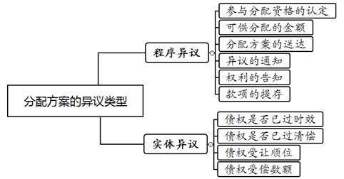
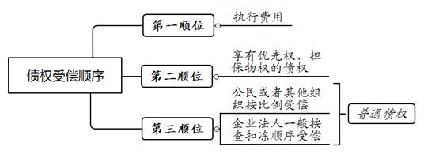

### **分配方案执行异议之诉案件的审理思路和裁判要点**

分配方案执行异议之诉，是指在执行程序中多个债权人对同一被执行人申请执行或对执行财产申请参与分配时，被执行人的财产不能清偿所有债权，债权人或被执行人对执行机构作出的分配方案是否符合公平清偿或优先清偿的法律规定而向执行法院提起的执行异议之诉。由于执行财产分配方案的执行异议与执行异议之诉程序容易产生混淆，且分配方案中债权受偿范围与受偿顺序的认定涉及多项实体法律规定，因此有必要明确审理思路、统一法律适用。本文结合司法实践中的典型案例，对分配方案执行异议之诉案件的审理思路和裁判要点进行梳理、提炼和总结。

一、典型案例

**案例一：分配方案执行异议救济程序的审查**

债权人张某申请法院对被执行人江某名下的房屋予以查封拍卖后，执行法院将房屋拍卖款发放给了另案债权人王某，并就尚存的拍卖款在各债权人之间制作分配方案。张某对该分配方案不服提起诉讼，主张另案债权人王某对房屋并不享有法定优先受偿权，故全部房屋拍卖款均应按债权比例在张某和王某之间重新分配。王某辩称，张某的异议属于执行程序异议，不属于分配方案执行异议之诉的受理范围，应当裁定驳回起诉。

**案例二：分配方案执行异议之诉适用范围的审查**

执行法院对未进入破产程序的被执行人A公司名下的房屋拍卖款制作分配方案后，债权人B公司提出书面异议。C公司对B公司的异议提出反对意见，B公司遂以C公司为被告提起诉讼，请求撤销原分配方案并重新制作分配方案。C公司辩称，法律将分配方案执行异议之诉的适用对象限定为被执行人系公民或者其他组织，而被执行人A公司为企业法人应当适用企业破产程序，不适用参与分配的执行程序，故应当裁定驳回起诉。

**案例三：分配方案执行异议之诉中抵押权优先受偿范围的认定**

借款人陈某先后与D银行、孙某、章某签订《抵押借款合同》并办理了抵押登记。上述案件进入执行程序后，执行法院就房屋拍卖款制作分配方案，认定D银行受偿905万元，孙某受偿564万元，余款分配给章某。章某不服提起分配方案执行异议之诉，称该抵押权优先受偿范围应根据抵押登记记载的债权数额确定，即D银行受偿819万元、孙某受偿400万元，故请求法院撤销执行财产分配方案。D银行、孙某辩称，抵押权优先受偿范围应以合同约定为准。

**案例四：分配方案执行异议之诉中债权受偿顺序的认定**

2020年3月，E法院判决确定F公司支付郑某借款本息830万元。同年4月，G法院判决F公司支付方某借款本息170万元。同年6月，H法院判决F公司支付丁某借款本息400万元。上述三案执行中，E法院就涉案房屋拍卖款制作分配方案，认定郑某、方某、丁某按债权比例受偿。郑某不服提起分配方案执行异议之诉，主张其作为首封债权人应当第一顺位优先受偿。方某、丁某辩称，三债权人对涉案房屋均不享有法定优先受偿权，应按债权比例公平受偿。

二、分配方案执行异议之诉的审理难点

**（一）程序异议与实体异议区分难**

司法实践中，执行实施权与执行审查权的界定一般不存在争议：分配方案的制作和修正由执行实施机构作出；分配方案主体资格的异议由执行审查部门审查；分配方案实体争议的执行异议之诉由执行法院的审判部门审理。由于现行法律并未对执行分配中的程序异议与实体异议进行准确区分，司法实践中存在将当事人针对分配方案提出的实体争议通过执行异议程序进行审查的情形。如何准确区分分配方案的执行程序异议和实体争议的执行异议之诉是审理该类案件的难点。

**（二）分配方案适用范围存在争议**

对于被执行人为企业法人的情形，债权人能否提起分配方案执行异议之诉存在争议。有观点认为，《民诉法解释》第508-512条对参与分配及其异议程序作出系统规定，第513条专门对被执行人为企业法人的债权清偿方式作出规定，被执行人为企业法人的不适用分配方案执行异议之诉程序。另一种观点认为，从保障权利救济的角度考量，根据《民诉法执行程序解释》第17条规定，作为被执行企业法人的债权人在被执行人未进入破产程序时可以提起分配方案执行异议之诉。

**（三）债权受偿范围认定难**

分配方案执行异议之诉涉及债权人、被执行人等多方利益，法律条文涉及《民法典》物权编、合同编及《公司法》等多项实体法律规定，但现行法律对分配方案执行异议之诉中税费、担保物权、建设工程价款优先受偿权等的受偿范围缺乏具体明确的规定。如何准确认定债权的受偿范围成为审理此类案件的难点。

**（四）债权受偿顺序认定难**

《民诉法解释》第510条按照执行费用、享有优先权或担保物权的债权、普通债权的基本位阶对分配方案中的债权受偿顺序作出原则性规定。在执行财产分配程序中，同一性质与多种性质债权之间的分配顺位错综复杂。如首封债权人是否享有优先受偿权、享有优先权或担保物权的多个债权之间如何清偿等仍存有争议。

三、分配方案执行异议之诉的审理思路和裁判要点

法院在审理分配方案执行异议之诉案件时，**首先要准确界定分配方案异议的类型，依法审查异议人提起的诉讼是否符合分配方案执行异议之诉的受理条件。其次，依据债权公平分配原则审查执行法院制作的分配方案是否符合债权受偿范围与顺序的相关法律规定，同时要避免分配方案反复调整影响执行效率。最后，在案件审理中要加大对虚假诉讼的甄别，严防当事人通过捏造案件事实等恶意申请参与执行财产分配。**

**（一）分配方案执行异议之诉的立案审查**

**1****、起诉前置程序的审查**

根据《民诉法解释》第512条和《民诉法执行程序解释》第18条规定，债权人、被执行人应当在其对分配方案提出书面异议且收到其他债权人、被执行人的反对意见后，方才可以提起分配方案执行异议之诉。

需要指出的是，执行分配程序中的异议包括程序异议和实体异议，上述规定中的书面异议应为实体异议。程序异议是指债权人或者被执行人认为执行法院在执行分配程序中存在违法或者不当的执行行为而向执行法院提出的异议。程序性异议事项包括分配资格的认定、可供分配金额的确定、分配方案的送达、异议的通知、权利的告知、款项的提存等。实体异议是指债权人或者被执行人对分配方案中确定的债权是否已过时效、是否已获全部或部分清偿存在异议，抑或认为债权人应当分配的债权受偿顺序、债权受偿数额不符合实体法律规定、损害其合法权益而向执行法院提起的分配方案执行异议之诉。对于执行程序中产生的新的实体争议，执行机构不作审查，而是通知具有利害关系的其他债权人和被执行人。如有债权人和被执行人对该异议提出反对意见，方可启动分配方案执行异议之诉进行实体审理。

如案例一中，执行法院仅对剩余房屋拍卖款作出分配方案，张某的异议则请求对全部房屋拍卖款按债权比例分配。该异议虽然涉及清偿顺位问题，但异议所指向的房屋拍卖款在分配方案作出之前已经处置，故异议实质是认为执行法院的执行行为存在违法或不当，应当依照《民事诉讼法》第232条规定进行审查。因此，该异议不属于分配方案执行异议之诉的受理范围，法院应当裁定驳回起诉。

**2****、起诉时间与管辖法院的审查**

债权人、被执行人提起分配方案执行异议之诉前，应先由执行机构依法完成两次送达程序，否则不能提起分配方案执行异议之诉。

**第一**，执行机构要将分配方案送达所有债权人、被执行人。多个债权人对执行财产申请参与分配的，执行机构应当制作分配方案，并送达各债权人和被执行人。债权人或被执行人对分配方案有异议的，应当自收到分配方案之日起十五日内向执行法院提出书面异议。

**第二**，执行机构要将异议人的异议送达至未提出异议的债权人、被执行人。未提出异议的债权人、被执行人对上述异议提出反对意见的，执行机构在通知异议人后，异议人可以自收到通知之日起十五日内，以提出反对意见的债权人、被执行人为被告，向执行法院提起诉讼。分配方案执行异议之诉依法应由执行法院组成合议庭适用普通诉讼程序进行审理。

**3****、当事人资格的审查**

**（****1****）关于原告资格的审查**

提起分配方案执行异议之诉的原告为对分配方案提出异议的债权人或被执行人。债权人主要是指被列入执行财产分配的申请执行人、已取得生效法律文书的其他债权人、尚未取得生效法律文书的首封诉讼保全人以及主张优先受偿权或法定优先权的其他债权人。多个债权人提出异议的应当共同提起诉讼，由执行法院合并审理。多个债权人分别提出异议并相互反对的，可以相互列为原告和被告，不按普通民事诉讼的反诉处理。对被执行人而言，如果其异议成立，可能导致参与分配的财产变现数额减少或者改变计算方式、清偿顺位后被执行人的剩余债务减少，故被执行人也享有提起分配方案执行异议之诉的权利。

**（****2****）****关于被告资格的审查**

分配方案执行异议之诉的被告为对异议人的异议提出反对意见的其他债权人或被执行人。若不止一方提出反对意见，则不论反对意见的理由是否同一，反对者均应列为共同被告。

需要特别说明的是，我们认为被执行的企业法人可以作为被告适用分配方案执行异议之诉。《民诉法执行程序解释》第17条规定贯彻的是执行效率原则，无论被执行人是否为企业法人，只要多个债权人申请分配执行财产的，执行法院均应制作分配方案，只是分配的规则有所不同。为保障执行公正，当被执行的企业法人在其财产不能清偿所有债权且未进入破产程序时，应赋予不服分配方案的债权人提起分配方案执行异议之诉的权利。如案例二中，A公司为企业法人但未进入破产程序，执行法院应当对债权人B公司提起的分配方案执行异议之诉进行审理。

**（****3****）****关于第三人资格的审查**

对于未对异议人的异议提出反对意见的其他债权人或被执行人，法院应当将其列为无独立请求权的第三人参加诉讼，但其他债权人明确表示不参加诉讼或者诉讼结果与其他债权人没有法律上利害关系的除外。

**4****、诉讼请求和异议事项的审查**

债权人或被执行人提起分配方案执行异议之诉的，应当明确提出修正后的分配方案以及按该方案进行分配的具体请求和法定事由，诉讼请求不能仅请求确认原分配方案违法，也不能仅要求变更原分配方案的内容。具体而言，诉讼请求应当明确两方面的内容：（1）请求法院确认争议的债权数额、财产数额和分配比例，确认的依据主要是执行依据和被执行人财产的实际状况；（2）请求法院按照相关实体法律规定判令变更执行机构作出的分配方案。

**（二）分配方案执行异议之诉的审查要点**

**1****、审理范围**

分配方案执行异议之诉的审理范围仅限于债权人或者被执行人对分配方案提出的实体异议，通常包括：（1）对分配方案确定债权的申请执行时效的异议；（2）对执行财产享有担保物权等优先权的债权人资格的异议；（3）对分配方案确定的债权清偿顺序的异议；（4）对分配方案确定的债权清偿比例和数额的异议。分配方案执行异议之诉中，法院仅就分配方案中当事人未受偿或未足额受偿中有争议的债权部分进行审理。对于执行依据即生效法律文书不予审查，当事人认为执行依据错误的应通过审判监督程序救济。

**2****、债权受偿范围的审查**

**（****1****）****已取得执行依据债权的受偿范围**

参与执行财产分配中，对于已经取得执行依据的债权受偿范围，执行法院应当按照其申请执行或者申请参与分配的金额，结合其提供的执行依据及执行的具体情况来确定。

执行中，取得执行依据的债权所产生的执行费用属于受偿范围，该费用主要包括：（1）处置财产产生的必要费用如评估费、审计费、鉴定费、公告费、保管费、拍卖辅助费等；（2）按照执行到位的金额为标准收取的执行费；（3）办理物权变更登记中应由被执行人负担的交易税费，但明确由买受人负担的除外；（4）执行被执行人名下唯一房产时，申请执行人同意参照当地房屋租赁市场平均租金标准从房屋变价款中扣除的五至八年租金；（5）执行财产为国有划拨土地使用权，依法应当缴纳的土地使用权出让金；（6）法律规定的其他必要费用。

对于未履行的迟延履行利息或迟延履行金是否应纳入受偿范围，应区分不同情形审查确定：（1）被执行人的财产足以清偿全部债权的，各债权人在分配方案中受偿的债权数额包括迟延履行利息或迟延履行金；（2）被执行人的财产不足以清偿全部债权的，各债权人在参与分配中受偿的债权数额不包括迟延履行利息或迟延履行金；若执行依据确定的债权本金和一般债务利息清偿完毕后执行款有剩余的，各债权的迟延履行利息或迟延履行金按比例受偿。

**（****2****）****享有优先权、担保物权债权的受偿范围**

对于人民法院查封、扣押、冻结的财产享有优先权、担保物权的债权人，可以申请参与执行分配，主张优先受偿权。司法实践中常见的具有优先受偿性的债权是建设工程价款优先受偿权和担保物权，受偿范围的审查要点为：

**第一**，建设工程价款优先受偿权的受偿范围。承包人建设工程价款优先受偿的范围依照国务院有关行政主管部门关于建设工程价款范围的规定确定，不包括逾期支付建设工程价款的利息、违约金、损害赔偿金等。

**第二**，担保物权优先受偿权的受偿范围。一要审查当事人对担保范围有无约定。担保物权的担保范围包括主债权及其利息、违约金、损害赔偿金、保管担保财产和实现担保物权的费用，但当事人另有约定的从其约定。二要审查登记的担保范围与当事人的约定是否一致。如不一致则以《民法典》规定抵押登记记载的债权金额为限确定抵押财产、被担保的债权范围。

如案例三中，《抵押借款合同》中约定的担保范围为本合同项下借款人的全部债务，包括本金、利息、违约金、损害赔偿金、贷款人实现债权的费用、因借款人违约而给出借人造成的损失和其他所有应付费用，但不动产登记簿中并未记载担保范围包括上述费用。因此，执行法院依据最高法院《关于适用〈中华人民共和国民法典〉有关担保制度的解释》第47条的规定支持了章某关于优先受偿范围应以抵押登记债权金额记载为限的主张。

**3****、债权受偿顺序的审查**

**（****1****）被执行人为公民或其他组织时的债权受偿顺序**

被执行人为公民或者其他组织，其名下执行财产不足以清偿全部债务的，执行所得价款扣除执行费用并清偿应当优先受偿的债权后，对于普通债权，原则上按照其占全部申请参与分配债权数额的比例受偿。清偿后的剩余债务，被执行人应当继续清偿。债权人发现被执行人有其他财产的，可以随时请求人民法院执行。

**（****2****）被执行人为企业法人时的债权受偿顺序**

被执行人为企业法人，其名下执行财产不足以清偿全部债务且未进入破产程序的，执行所得案款扣除执行费用及清偿优先受偿的债权后，普通债权则按照财产保全和执行中查封、扣押、冻结财产的先后顺序清偿。不同于破产程序中的公平受偿，该规则规定个别清偿目的是促使相关债权人对确无清偿能力的该类被执行人申请破产。

司法实践中，被执行人为未进入破产程序的企业法人，多个债权人申请参与执行财产分配时需区分以下情形处理：

**第一**，多份生效法律文书确定金钱给付内容的多个债权人分别对同一被执行人申请执行，各债权人对执行标的物均无担保物权的，按照执行法院采取执行措施的先后顺序受偿。如案例四中，法院经审查，三份生效法律文书确定的金钱给付内容的债权人郑某、方某、丁某对涉案房屋均不享有担保物权，郑某的诉讼请求符合该规定，故法院判决撤销原分配方案并制作新的分配方案，确定郑某、方某、丁某按照执行法院采取查封措施的先后顺序受偿。

**第二**，多个债权人的债权种类不同的，基于所有权和担保物权而享有的债权，优先于金钱债权受偿。例如，生效判决确定甲公司应返还乙公司所有的特定设备，法院再判决确定甲公司应偿还丙公司的借款并查封了甲公司占有的特定设备，此时法院应将特定设备返还给乙公司而不应再行处置。

**第三**，执行标的物上设有多个担保物权的，按照各担保物权成立的先后顺序清偿。多个担保物权并存的情况下，清偿顺序还应具体区分：（1）法定优先权优先于约定担保物权受偿；（2）已登记的担保物权优先于未登记的担保物权受偿；（3）登记在先的担保物权优先于登记在后的担保物权受偿；（4）未经登记的抵押权不得对抗善意第三人，并按照债权比例受偿。

**第四**，特殊情形的处理。一般情形下，多份生效法律文书的多个债权人分别对同一被执行人申请执行，在均无担保物权的情形下，按照执行法院采取执行措施的先后顺序受偿。若一份生效法律文书确定金钱给付内容的多个债权人对同一被执行人申请执行，执行的财产不足清偿全部债务，各债权人对执行标的物均无担保物权的，按照各债权比例受偿。

**（三）分配方案执行异议之诉的裁判规则**

**其一**，裁定驳回起诉。债权人、被执行人提起分配方案执行异议之诉，不符合立案审查条件的，裁定不予受理；已经受理的，裁定驳回起诉。

**其二**，判决驳回诉讼请求。债权人、被执行人提起分配方案执行异议之诉的诉讼请求不成立的，应当判决驳回诉讼请求。

**其三**，债权人、被执行人的诉讼请求成立或者部分成立的，应当判决撤销原分配方案中的错误部分，并按照下列情形分别处理：（1）如原分配方案对债权性质认定错误，应当根据诉讼请求就争议债权性质作出判决；（2）如原分配方案对债权数额认定错误，可以在查清事实后根据诉讼请求就争议债权的数额作出判决，也可以责令执行机构查清事实，重新确定争议债权的数额后纠正分配方案中的错误部分；（3）如原分配方案对债权人是否给予分配的认定存在错误，应当根据诉讼请求对相关主体是否给予分配作出判决。

执行机构依据生效分配方案执行异议之诉判决所明确的争议债权性质、债权数额或者有关主体的分配资格调整分配方案后，当事人就判决所确定的内容再次提起分配方案执行异议之诉的，裁定不予受理，已经受理的裁定驳回起诉。执行机构依据生效分配方案执行异议之诉判决调整原分配方案后，当事人对调整后的分配方案提起分配方案执行异议之诉且诉讼请求成立或者部分成立的，应当撤销已调整分配方案中的错误部分，并就争议债权的分配顺序和分配数额等作出判决。

分配方案执行异议之诉判决生效后，未参加分配方案异议及异议之诉程序的其他债权人，以其不知情或未参加分配为由提出异议的，应当按照《民事诉讼法》第232条有关执行行为异议的规定进行审查。异议人主张其依法享有优先权且可能变更已经启动的分配程序的，应当告知其通过第三人撤销之诉救济。

四、其他需要说明的问题

人民法院受理对被执行企业法人的破产申请的，正在进行的分配方案执行异议之诉应当根据具体情况裁定中止或终结审理。分配方案执行异议之诉审理期间，对于各方当事人没有争议的部分可以继续执行原分配方案，对于有争议或尚待生效法律文书确定的债权数额，应当将与诉讼争议债权数额相应的款项予以提存。

（根据民事庭阮国平、雷名星提供材料整理）