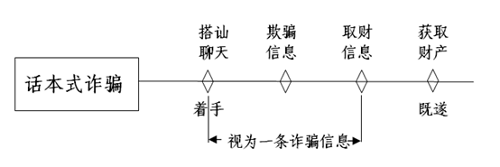
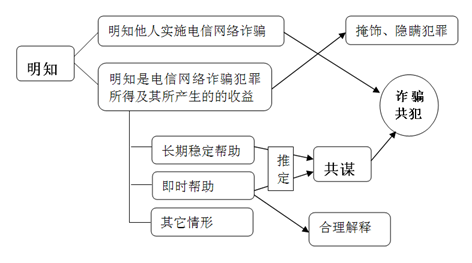

### **电信网络诈骗类案件的审理思路和裁判要点**

电信网络诈骗犯罪是指以非法占有为目的，利用通讯工具或互联网等技术手段，发布虚假信息、设置骗局，主要通过远程控制、非接触方式骗取不特定对象数额较大财物的行为。因电信网络诈骗主要利用电信网络技术手段实施，其与普通诈骗犯罪相比，犯罪参与人和被害人更多、社会危害性更大，作案环节复杂、犯罪手段更加隐蔽、侦查取证难度增大。两高一部相关意见对电信网络诈骗犯罪作出特别规定：设置统一治罪数额，明示列举从重情节，规定数额与数量情节双重处罚标准等。近年来，该类案件犯罪手段不断翻新，防治犯罪形势日趋严峻复杂。为有效规制此类犯罪，统一法律适用，现以典型案例为基础，对电信网络诈骗类案件的审理思路和裁判要点进行梳理、提炼和总结。

一、典型案例

**案例一：涉及犯罪数额的认定**

万某购买大量他人手机卡并招募人员，通过拨打电话谎称节目组联系幸运观众并以支付297元兑奖手续费为名诱骗他人向其指定账户转款。上述人员在诈骗时不断更换手机卡号，现查实被害人17人，查获指定账户内资金140余万元。检察机关提出应以涉案账户内全部金额计算，辩护人则提出本案犯罪数额应依据17名被害人一一对应的被骗金额予以计算。

**案例二：涉及欺骗行为及犯罪形态的认定**

2018年11月至12月，鄢某招募杨某设计虚假投资平台，沈某对虚拟币真实行情作分析报表，周某按照话术单诱骗微信好友至平台投资虚拟币，再以自行控制平台涨跌的方式骗取投资人钱款。2019年1月，鄢某等人欲再次以上述方式实施诈骗，在虚构身份搭识他人时被查获，此时已向1.4万余名微信好友发送信息65万余条但尚未骗得钱款。检查机关认为第二节犯罪行为已着手，且发送诈骗信息65万余条，辩护人则认为第二节犯罪尚处在预备阶段。

**案例三：涉及电信网络诈骗共犯的认定**

张某经与电信网络诈骗团伙共谋后，帮助该团伙提取诈骗所得赃款以牟取非法利益。王某将本人开办、控制的单位支付结算账户以1.6万元出售给张某使用。后张某告知陈某上述事实，并支付每日数百元报酬雇佣陈某在诈骗所得钱款到账后即时取出。期间，陈某临时安排刘某代为取款6万余元并支付刘某1000元报酬。控辩双方就上述人员是否均成立电信网络诈骗罪的共犯存在争议。

二、电信网络诈骗类案件的审理难点

**（一）犯罪数额证明难**

电信网络诈骗案件往往涉及多种数额，如诈骗金额、诈骗电话的拨打次数、诈骗信息的条数等，上述数额对于定罪量刑均具有重要意义。然而该类案件受害者人数众多且不特定、作案手段隐蔽、数据海量易损毁，不少案件难以确认全部的受害者人数和每一笔赃款账户的钱款来源，且由于信息基数庞大，从中梳理出据以定罪量刑的有效信息难度较大。

**（二）犯罪形态认定难**

电信网络诈骗犯罪依托技术通信媒介实施，时空跨度大，犯罪环节多，认定犯罪的着手以及既未遂形态争议较大。如当行为人依照话本虚构身份、事实，搭讪被害人建立联系，但尚未诱骗被害人处分财产时即被查获，此时是基于行为人已经开始实施虚构事实、隐瞒真相的行为认定为犯罪着手，还是当被害人财产存在紧迫危险即行为人提出处分财产时方认定着手，实践中尚存争议。

**（三）主观明知程度及共犯认定难**

电信网络诈骗犯罪通常采用团伙作案的方式，参与人数众多且分工细致。不同程度的参与人员、提供帮助的人员，结合其主客观方面的表现，既可能构成电信网络诈骗犯罪的共犯，也可能构成他罪或无罪。如案例二中提供技术支持的杨某、制作分析报表的沈某，案例三中主观上对正犯行为性质明知程度不同的帮助取款人员，这些参与人员、帮助人员是否均构成电信网络诈骗犯罪的共犯，亦是该类案件的审理难点。

三、电信网络诈骗类案件的审理思路和裁判要点

电信网络诈骗犯罪持续高发、相关上下游犯罪不断蔓延，严重干扰电信网络秩序，侵害人民群众财产安全和其他合法权益，社会危害性极大。**审理该类案件应坚持全链条全方位打击、坚持依法从严从快惩处和坚持最大限度的追赃挽损。在定罪处罚时，应坚持从严、全面、准确惩处方针，深入贯彻宽严相济刑事政策，通过准确界定打击范围、分析诈骗行为本质、综合认定犯罪数额、正确识别犯罪形态和稳妥认定共犯责任，作出罪刑相当的判决，以实现法律效果和社会效果的统一**。

**（一）准确界定电信网络诈骗案件的范围**

电信网络诈骗犯罪的入罪标准、数额认定规则、未遂情节的处罚条件等规定均与普通诈骗犯罪存在较大差异，在打击电信网络诈骗犯罪时，首先应准确界定打击范围，判断相关犯罪是否属于电信网络诈骗。利用电信网络技术手段实施诈骗是电信网络诈骗犯罪的典型特征，但并非所有利用电信网络技术手段的诈骗行为都属于电信网络诈骗犯罪，还必须具有与从严惩处要求相匹配的更为严重的社会危害性。具体根据犯罪对象的不特定性和犯罪过程的非接触性进行审查。

**1****、犯罪对象不特定性的审查**

普通诈骗在实施犯罪行为时，通常已经具备了明确的作案目标。电信网络诈骗则一般通过短信、电话、网络等媒介广泛散播诈骗信息寻找诈骗对象，或随意选取多个或一个对象实施诈骗，即电信网络诈骗的犯罪对象是不特定的。对犯罪对象不特定性的审查应注意结合整个犯罪过程，犯罪对象的不特定性体现在选择诈骗目标阶段，随意选定目标后，犯罪对象则转化为特定对象。如果行为人利用电信网络技术手段选择明确特定对象实施诈骗的，应认定为普通诈骗；行为人利用电信网络技术手段，随意、随机选择后锚定特定对象实施诈骗的，应为电信网络诈骗。

**2****、犯罪过程非接触性的审查**

电信网络诈骗犯罪依托电信网络技术所带来的隐蔽性，行为人与被害人之间建立联系和实施犯罪通常无需面对面接触。对于犯罪过程非接触性的审查，应着重审查行为人诈骗钱款及被害人处分钱款两个重要环节所处的状态。为实现诈骗目的，对不特定对象线下、线上并行进行接触式和非接触式诈骗的，只要主要的诈骗钱款和处分钱款行为是利用电信网络技术而无需接触实施的，宜认定为电信网络诈骗，反之则是普通诈骗。如行为人通过网络发布虚假招聘信息引诱被害人至线下地点应聘，当场再编造需要缴纳任职培训费等理由骗取被害人钱款的，行为人与被害人系在线下直接接触中完成诈骗活动，不应认定为电信网络诈骗，仍应适用普通诈骗犯罪的相关规定。

**（二）审查行为是否符合诈骗罪的本质特征**

利用电信网络技术手段实施的犯罪种类较多，在确定涉案行为是否属于电信网络诈骗犯罪的打击范围时，还需进一步审查相关行为是否符合诈骗罪的本质特征，以区分电信网络诈骗犯罪和利用电信网络技术实施的其它犯罪。为此需要明确对行为人最终取得财物起决定性作用的行为手段是否属于诈骗行为，重点审查行为人的欺骗行为和被害人的处分行为。

**1****、****行为人欺骗行为的审查**

欺骗行为具体表现为虚构事实或隐瞒真相。成立诈骗犯罪的欺骗行为是欺骗被害人处分财产的行为。对欺骗行为的审查，应把握欺骗行为与被害人处分钱款间的关联性。利用电信网络技术群发的虚假信息不属于诱骗他人处分财产的，一般不以诈骗罪定性。对于实践中诱骗他人参与网络投资或赌博的，应着重审查投资平台和赌博平台是否虚假或存在欺骗行为。倘若平台真实，受骗人钱款实际进入了真实市场或赌池，诱骗他人参与投资或赌博的行为没有直接骗取被害人处分的财产，则可能构成非法经营罪或开设赌场罪。倘若平台具有欺骗性，受骗人钱款没有用于真实的投资交易或赌博，而是经后台操控数据等方式被行为人直接占有的，则应定性为诈骗犯罪。如案例二中，行为人设计虚假投资平台，按照话术单诱骗微信好友参与投资，再通过自行控制涨跌的方式直接占有被害人钱款，属于典型的投资交易型电信网络诈骗。

**2****、****被害人处分行为的审查**

被害人的处分行为是指被害人被欺骗产生错误认识后自愿交付财物的行为，此时被害人主观上对处分财产的事实有认识。对于司法实践中利用电信网络技术，诱骗掺杂秘密窃取非法占有他人财物的案件，应着重审查被害人是否自愿处分财产。当被害人没有自愿交付财产，财产是基于秘密手段获取的，如行为人利用信息网络，诱骗他人回拨电话时通过预先植入的手机按键解码器程序窃取被害人的银行卡、个人信息资料后再实施盗刷的，诱骗行为只是为秘密窃取行为创造条件，被害人没有处分财产的行为和意识，行为人获取财产的主要手段是秘密窃取，不应认定为电信网络诈骗犯罪。反之，行为人利用电信网络技术获取财物起决定作用的手段是诈骗，被害人基于错误认识而自愿交付财物，盗窃行为作为辅助手段的，应认定为电信网络诈骗犯罪。

**（三）准确认定电信网络诈骗犯罪的犯罪数额和情节**

电信网络诈骗犯罪的地域性特征相对淡化，有较强的跨区域性，因此两高一部相关意见为该类犯罪设置了全国统一的入罪数额标准和数额加重标准，裁判时不宜适用本地普通诈骗罪的数额标准。同时，该类犯罪还涉及跨区、跨境证据提取和海量庞杂的电子证据等，犯罪数额认定难度较大，因此相关意见规定了情节入罪标准和情节加重标准，裁判时应兼顾数额和数量的综合认定方法。

**1****、诈骗数额的审查与认定**

在传统侵财类案件中，被害人的指认和陈述往往是认定犯罪数额不可或缺的证据，但电信网络诈骗案件中，被害人众多、分散且不特定，基本无法一一核实。按照传统印证证明方法，最终能够认定的犯罪数额往往远低于实际数额，极不利于惩治该类犯罪，也不符合罪刑相适应原则。

**（****1****）****整体性综合认定犯罪数额**

对于该类犯罪，两高一部相关意见明确了犯罪数额的综合认定方法，在有确实、充分证据证明涉案数额足以构成犯罪的前提下，当被害人数量庞大，逐一查证极度消耗司法资源甚至客观上无法实现时，可以对犯罪数额予以整体性综合认定。综合认定是对犯罪数额的推定，适用时应注意充分保障行为人的辩护权。当行为人对综合认定的数额提出异议且提供相应证据，并引起合理怀疑时，若没有更多的证据排除该合理怀疑，应将异议的数额从综合认定的数额中予以扣除。

**（****2****）综合认定的具体方法**

确因被害人人数众多、分散等客观条件限制无法逐一收集被害人陈述的，可以结合已收集的被害人陈述以及经查证属实的银行或第三方支付结算账户交易记录、通话记录、电子数据等证据，综合认定诈骗数额。如果查明涉案的银行账户在案发期间是专门用于诈骗活动的，尽管只查找到部分被害人，根据在案证据认定行为人没有其他收入来源，账户所得没有其他可能性时，可以将账户金额推定为犯罪数额。

如案例一中，行为人在诈骗过程中不断更换手机号，致使查实的被害人人数较少，但查获银行卡账户专门用于电信诈骗，行为人对卡内款项来源不能做出合理解释，结合行为人对案件事实的供述以及卡内汇入金额均为兑奖手续费297元的倍数等证据，可以综合认定卡内收入款项均系诈骗所得。

**2****、数额难以查证时诈骗信息的认定与计算**

对于行为人诈骗数额难以查证的，满足诈骗信息条数、电话人次、网页浏览量的次数、出境赴境外诈骗窝点时间和次数的要求，可以成立“其他严重情节”“其他特别严重情节”，以诈骗罪（未遂）定罪处罚。

**（1）准确界定诈骗信息**

利用话术逐步实施电信网络诈骗的案件中，行为人与被害人先行联络建立信任，后骗取钱款，整个过程信息往来频繁。有观点认为，自行为人与被害人搭讪时即已着手犯罪，发送的信息均应认定为诈骗信息。然而如此计算的信息数量势必巨大而致出现量刑与罪责不相当的情况。我们认为，诈骗犯罪要求行为人实施的欺骗行为是欺骗他人处分财产的行为，因而对于作为定罪量刑依据的诈骗信息，应是含有明确诱骗他人处分财产的信息。用于铺垫但不含处分财产要求的欺骗信息属于一整套“为了取财而实施的虚构事实”的组成部分，应与诱骗处分财产的信息视为一条完整诈骗信息。

因此，一条诱骗处分财产的信息为一条诈骗信息，未提出处分财产要求的信息均视为对同一诱骗对象的同一条诈骗信息。如案例二中，65万余条信息并非全都是含有明确诱骗他人处分财产的诈骗信息，针对每名被害人的一整套信息应认定为一条诈骗信息。

**（2）信息数量的计算方法**

反复拨打同一电话号码以及反复向同一被害人发送诈骗信息的，拨打电话次数、发送信息条数累计计算。因犯罪嫌疑人、被告人故意隐匿、毁灭证据等原因，致使拨打电话、次数、发送信息数量的证据难以收集的，可以根据经查证属实的日拨打人次数、日发送信息条数，结合犯罪嫌疑人、被告人实施犯罪的时间、犯罪嫌疑人、被告人的供述等相关证据，综合予以认定。

首先，审查行为人日拨打电话人次数和日发送信息条数，该基本数据不得推定，须有客观证据直接证明，可采用取样认定的方式，保证样本具有无可争议的代表性和典型性；存在争议时则遵循有利于被告人原则就低认定。其次，审查行为人实施犯罪的总体时间，依据现有证据以及行为人的供述就低推算，不能大体估算。最后，结合行为人的供述等在案证据，用查明的日数量乘以实施诈骗的时间，综合得出总拨打电话人次数或发送信息条数。

**（四）准确认定电信网络诈骗犯罪的犯罪形态**

实施电信网络诈骗犯罪，犯罪嫌疑人、被告人实际骗得财物的，以诈骗罪（既遂）定罪处罚。诈骗数额难以查证，但发送诈骗信息五千条以上、拨打诈骗电话五百人次以上、在互联网上发布诈骗信息的页面浏览量累计五千次以上，或参与境外诈骗犯罪集团、团伙对境内居民实施电信网络诈骗犯罪一年内出境赴境外诈骗犯罪窝点累计时间30日以上或多次出境赴境外诈骗犯罪窝点的，应认定为刑法第266条规定的“其他严重情节”，以诈骗罪（未遂）定罪处罚。

**1****、行为人实际骗得财物为既遂**

两高一部《关于办理电信网络诈骗等刑事案件适用法律若干问题的意见》规定“实施电信网络诈骗犯罪，犯罪嫌疑人、被告人实际骗得财物的，以诈骗罪（既遂）定罪处罚。”司法实践中对于“实际骗得财物”的理解存在争议。《检察机关办理电信网络诈骗案件的指引》将被害人失去对钱款的控制认定为既遂，也有意见认为行为人实际控制钱款方可认定为既遂。

通常情况下，被害人失去对钱款控制的同时，行为人实际控制钱款。24小时内可以止付、撤回转账的，被害人尚未失去对钱款的控制，行为人亦未控制钱款，此时被害人失去对钱款的控制和行为人实际控制钱款依然是同步的，24小时钱款到账后行为人才实际骗得财物。当行为人到案后钱款方才进入其账户，被害人失去对钱款的控制但行为人因被抓获而无法实现对钱款的控制时，被害人转款与行为人控制钱款存在时间差，行为人因意志以外的原因犯罪未能得逞，属于犯罪未遂。因此对“实际骗得财物”应理解为被骗款项实际转入行为人或团伙成员控制的账户内，行为人或团伙成员并实际控制了钱款，此时为犯罪既遂。

**2****、行为人与被害人建立联系即为“着手”**

电信网络诈骗犯罪作案环节多、持续时间长，在认定犯罪“着手”时易产生争议。以话本式电信网络诈骗案件为例，行为人按照话本，虚构身份和事实搭讪被害人，经过频繁的信息或通话往来逐步增强信任，最后提出让被害人处分财产。有观点认为刑法理论将犯罪着手定义为行为人已经开始实施分则条文规定的犯罪构成要件行为，行为人虚构身份和事实与被害人搭讪即着手犯罪。也有观点指出，刑法所保护的法益面临现实危险性的侵害或威胁时，也即提出处分财产时，方可认定为着手。我们认为，着手应从全部犯罪行为整体性角度进行分析和判断。

如案例二中，第二节犯罪至案发时尚未提出转移财产的要求，但是从话术演绎开始直至取得财产完成，是一个连续性、整体性行为，也即从感情联络到提出处分财产要求是一整套“为了取财而实施的虚构事实”行为。从话术演绎开始，被害人就已经成为犯罪行为侵害的目标，至于处分财产何时提出只是法益侵害程度轻重缓急而非有无的问题。因此自行为人与被害人建立联系时，行为的危害性已经呈现，应认定着手。

**3****、既遂、未遂情形并存时的处理**

电信网络诈骗犯罪通常为连续性犯罪，行为人实施的行为中会存在既有既遂、又有未遂的情形。鉴于行为人实施该类行为时通常系基于同一的概括故意，对此不应实行数罪并罚，应按一罪处理。电信网络诈骗既有既遂，又有未遂，分别达到不同量刑幅度的，依照处罚较重的规定处罚；达到同一量刑幅度的，以诈骗罪既遂处罚。在确定量刑起点和基准刑时，一般应就重选择；在确定宣告刑时，应综合全案事实情节，准确把握从重、从轻量刑情节的调节幅度，确保罪责刑相适应。

**（五）综合认定电信网络诈骗犯罪共同犯罪的主观明知**

依据共犯理论和现行法律规定，成立电信网络诈骗罪的共犯除了参与犯罪过程或提供帮助，行为对犯罪结果具有原因力外，还需行为人主观上对非法占有不特定对象的财产具有故意，具体通过对参与或帮助实施电信网络诈骗主观明知程度进行审查和判断。

**1****、主观明知的审查**

明知包括知道和应当知道。对明知的审查应结合全案的事实、证据对明知状态和明知程度进行综合判断。当行为人否认犯罪事实，不能依据其供述对主观明知作出直接认定时，应根据客观证据，以常识经验为依据，结合行为人的认知能力，行为次数和手段，行为作用和地位，与他人的关系，获利情况，是否曾因电信网络诈骗受过处罚，是否故意规避调查等对主观明知的状态和程度进行推定。

如案例二中，杨某为电信网络诈骗犯罪提供技术支持，设计了可后台操控、篡改交易数据的平台且不能做出合理解释，可推定其主观上对实施电信网络诈骗犯罪系明知；沈某对虚拟币真实行情作分析报表，现有证据材料证明其仅获取日常工资报酬且未参与公司运营管理，不足以推定其主观上对其他行为人参与实施电信网络诈骗犯罪系明知。

**2****、帮助转账、套现、取现行为的刑事规制**

帮助转账、套现、取现行为通常发生在电信网络诈骗犯罪既遂之后，对诈骗犯罪的成立没有行为上的原因力，但当帮助取款人事先或事中和正犯通谋或存有犯意联络时，其提供了精神上的支持力，应以电信网络诈骗罪的共犯论处。对于通谋的审查，应结合主客观因素综合判断。帮助取款人与诈骗团伙之间形成较为长期稳定的配合模式，被害人钱款到账后即时帮助取款且不能提出相反论据的，均可推定事先通谋。无法证明通谋时，应对帮助取款人对正犯行为的主观明知程度进行审查。明知他人实施电信网络诈骗犯罪，是指明知他人在实施犯罪，且知晓行为的性质是电信网络诈骗，此时对帮助取款人以共犯论处。对具体犯罪行为尚不确切知晓，但明知是犯罪所得及其收益的，对帮助取款人以掩饰、隐瞒犯罪所得、犯罪所得收益罪定性。

如案例三中，张某与电信网络诈骗犯罪团伙共谋后，帮助诈骗团伙取款以牟取非法利益，张某应以电信网络诈骗犯罪的共犯论处。陈某受张某雇佣帮助取款，虽无法证明陈某与诈骗团伙存在通谋，但其明知是电信网络诈骗犯罪所得而长期稳定帮助取款并收取高额报酬，也应以电信网络诈骗犯罪的共犯论处。刘某临时帮助取款并收取高额回报，尚不能证明其对正犯实施电信网络诈骗犯罪主观明知，现有证据仅能推定其应当知道相关钱款系犯罪所得，故构成掩饰、隐瞒犯罪所得罪。

**3****、非法交易“两卡”行为的刑事规制**

为他人利用信息网络实施犯罪而实施收购、出售、出租信用卡、银行账户、非银行支付账户、具有支付结算功能的互联网账号密码、网络支付接口、网上银行数字证书、手机卡、流量卡、物联网卡的，依据行为人主观上对他人实施信息网络犯罪的明知程度不同而在罪名的适用上有所区别：明知他人实施电信网络诈骗犯罪而非法提供信用卡、资金支付结算账户、手机卡、通讯工具的，以电信网络诈骗犯罪的共犯论处。明知他人利用信息网络实施犯罪而收购、出售“两卡”，对他人具体实施何种信息网络犯罪尚不明确知晓的，以帮助信息网络犯罪活动罪定罪处罚；非法提供信用卡、银行账户且帮助转账、套现、取现，同时构成掩饰、隐瞒犯罪所得罪的，依照处罚较重的规定定罪处罚。

如案例三中，王某向张某以1.6万元出售单位支付结算账户，单位支付结算账户交易额度大、开办门槛高，随着公安机关“断卡”行动的逐步深入，有关部门亦对申办这类账户加强了监管和警示提醒，不得随意出租、转借和买卖。王某将其开办、控制的单位支付结算账户以高价转让给张某，可认定其主观上明知他人利用信息网络实施犯罪而提供帮助，以帮助信息网络犯罪活动罪定罪处罚。

四、其它需要说明的问题

电信网络诈骗除侵犯公私财产的所有权外，还可能侵犯电信网络秩序、公民隐私权、金融管理秩序等。在办理该类案件时，应全面审查犯罪行为、手段和侵犯的法益，清楚把握行为之间触犯的罪名和罪数，严密对上下游关联犯罪的刑事规制。                                                                                           

如果一行为同时侵犯数个法益、触犯数个罪名，系想象竞合犯，应择一重罪处罚。如冒充国家机关工作人员实施电信网络诈骗犯罪，同时构成诈骗罪和招摇撞骗罪的，依照处罚较重的规定定罪处罚。

如果实施数个犯罪行为、侵犯数个法益，应结合主客观相统一原则，同时明确手段行为与目的行为，原因行为与结果行为之间是否密切关联，其行为是否存在“通常性”，如果数行为之间主客观都存在牵连关系，且手段行为与结果行为的发生存在通常性，则构成牵连犯，择一重罪处罚。例如在实施电信网络诈骗活动中，非法使用“伪基站”“黑广播”，干扰无线电通讯秩序，符合刑法第288条规定的，以扰乱无线电通讯管理秩序罪追究刑事责任，同时构成诈骗罪的，依照处罚较重的规定定罪处罚。

如果实施数个犯罪行为、侵犯数个法益，手段行为与结果行为的发生不存在通常性，触犯数个罪名的，应数罪并罚。如违反国家有关规定，向他人出售或者提供公民个人信息，窃取或者以其他方法非法获取公民个人信息，符合刑法第253条之一规定的，以侵犯公民个人信息罪追究刑事责任。使用非法获取的公民个人信息，实施电信网络诈骗犯罪行为，构成数罪的，应当依法予以并罚。

（根据刑事庭郭震、周婧提供材料整理）