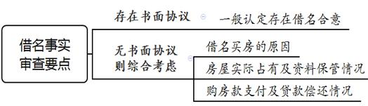
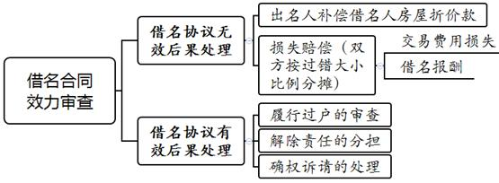
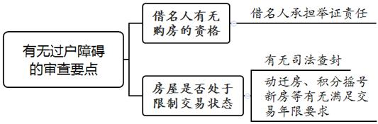
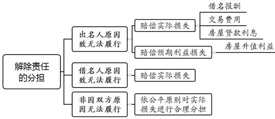

### **借名买房纠纷案件的审理思路和裁判要点**

借名买房是指实际购房人因不具备购房、房屋贷款资格等原因借用他人名义购房，借名人实际支付购房款，出名人对外签署房屋买卖合同并将房屋所有权登记在其名下的行为。司法实践中，因房屋未能登记到借名人名下，由此引发的纠纷在借名事实、合同效力等方面的认定与处理存在一定难度，故有必要明确审理思路，统一法律适用。处理此类纠纷，法院应当充分查明案件事实、尊重当事人意思自治，同时注重协调现行政策和维护物权公示原则。本文结合司法实践中的典型案例，对借名买房纠纷案件的审理思路和裁判要点进行梳理、提炼和总结。

一、典型案例

**案例一：涉及借名的事实认定**

刘某与韩某于2009年相识后同居，2011年韩某与案外人张某签订房屋买卖合同，约定韩某以198万元购买系争房屋，后于同年登记在韩某名下。2013年刘某与韩某结束同居关系，刘某要求韩某将房屋过户至其名下但遭韩某拒绝。刘某自述因其无购房资格，故与韩某口头约定借用韩某的名义购买系争房屋，韩某则坚称房屋为其自行购买。刘某用其银行账户向张某支付了全部房款，房屋原由刘某与韩某共同居住，但2013年韩某搬离后由刘某单独居住使用。

**案例二：涉及借名协议的效力认定**

徐某与胡某系朋友关系，徐某因自身原因无法申办贷款，故与胡某约定以胡某的名义购买系争房屋。徐某支付了房屋首付款，胡某则以自己名义申办了房屋贷款并将房屋登记在其名下。徐某按月向胡某用于还贷的银行账户中汇款以偿还银行贷款。后徐某要求胡某按照约定将房屋过户至其名下，胡某以徐某无资格申办贷款、双方约定违反法律强制性规定无效为由拒绝。

**案例三：涉及借名人直接要求确权的处理**

吴某与王某系亲戚关系，因吴某暂无购房资格故借用王某名义购买系争房屋。吴某支付全部房款后，房屋产权登记在王某名下，但由吴某负责保管购房合同、房屋产证等购房资料并实际居住使用房屋。后吴某达到社保缴纳年限而具备购房资格，要求王某将房屋过户至其名下，但王某以各种借口拖延办理过户手续，吴某遂请求法院确认房屋所有权归其所有，并要求王某按照约定配合办理过户手续。王某以双方约定违反法律规定且吴某无权直接要求获得房屋所有权为由进行抗辩。

二、借名买房纠纷案件的审理难点

**（一）借名事实认定难**

借名买房纠纷案件中，借名人与出名人之间一般具有特殊身份关系，如亲属、朋友关系等。由于当事人之间一般具有较强的互信，借名买房合意大多以口头形式达成、缺乏书面约定，在产生纠纷时，当事人对借名事实的认定标准及举证责任分配存在争议。借名人为证明双方借名买房关系的存在，一般会从房款的实际支付、房屋的实际使用等方面提供证据以证明其主张，而出名人往往会否认借名约定的存在，提供房屋买卖合同、产权登记信息等证据进行抗辩。

**（二）借名协议及购房合同效力认定难**

一般而言，借名人借用他人名义购买房屋往往具有特殊目的，如为规避限购政策、为获取贷款或贷款利息优惠、为购买保障性住房等。上述不同情形下借名协议的效力如何认定，司法实践中尚存争议。如在规避限购政策或套取银行贷款的情形下，借名人与出名人达成的借名协议是否因违反法律禁止性规定而无效。借名人违反国家政策规定借名购买经济适用房等政策性保障住房，借名协议及房屋买卖合同的效力应当如何认定。

**（三）对于应作确权判决还是给付判决认识不一**

司法实践中，借名人的诉请主要分为以下三种：（1）确认房屋归借名人所有；（2）判令出名人协助将房屋过户至借名人名下；（3）确认房屋归借名人所有并要求出名人协助办理过户。对于此类案件应作出确权判决还是给付判决，各地法院裁判结论不一。主要争议在于可否援引《最高人民法院关于适用〈中华人民共和国民法典〉物权编的解释（一）》第2条规定直接予以确权。此外，借名买房纠纷案件所立案由也不统一，主要案由有合同纠纷、房屋买卖合同纠纷、所有权确认纠纷、委托合同纠纷等。虽然案由选择不影响当事人的实体权利，但会对案件的审理方向及请求权基础的判断产生影响，故有必要对立案案由进行统一。

三、借名买房纠纷案件的审理思路和裁判要点

法院在处理此类纠纷时，**应当充分查明案件事实、尊重当事人意思自治，同时注重协调现行政策和维护物权公示原则。首先应对借名买房关系存在与否进行审查认定，在认定存在借名买房关系的前提下，再对案涉借名协议的效力进行判断**。如案涉借名协议无效，则法院对无效后果一并处理；如案涉借名协议有效，则应判定当事人的诉请是否成立。

**（一）借名事实的审查要点**

当事人借名买房事实的认定是审理此类案件的重要基础。审查借名事实的要点和步骤为：首先应当查明有无书面约定，若当事人之间存在书面约定，则一般可认定存在借名买房事实；若当事人之间无书面约定则应当查明：（1）当事人借名买房原因；（2）购房款支付及贷款偿还情况；（3）房屋实际占有使用及房屋权属证书保管情况等。在事实认定过程中，应当合理分配举证责任，综合所查明的事实认定是否存在借名买房关系。

**1****、借名买房原因的审查要点**

法院在审查借名买房原因过程中，应着重审查借名人对借名原因的解释是否符合客观事实、是否具有合理性。借名人甘冒风险不签订书面合同而借名买房，除基于双方之间的信任关系之外，一般存在以下客观原因：（1）为规避国家房屋贷款、税收、购房资格等相关法规政策；（2）借用他人资格享受贷款等政策性优惠；（3）出名人享有保障性住房等特殊性质房屋的购买资格等。

借名人对借名原因予以解释后，法院应对出名人的抗辩理由予以审查。对于借名人出资的原因，出名人一般主张双方之间存在借款、赠与、抵销等法律关系，对此应当承担举证责任。在双方均无书面证据的情形下，法院应当依据常理、常情进行合理性判断。例如，当借名人经济状况一般时，出名人主张借名人的出资为赠与就与常理相悖。

**2****、购房款实际支付及贷款偿还情况的审查要点**

借名事实的审查中还应当查明购房款实际支付情况以及贷款偿还情况。购房款由借名人出资是认定借名买房关系存在的重要依据，故借名人应对其出资情况承担举证责任。法院应当结合定金及首付款的付款凭证、双方的财务状况及还款能力证明、证人证言等证据材料综合认定实际出资人。在借名人直接与出卖人接洽付款，或者中介公司作为居间方参与付款过程的情况下，出卖方以及中介公司的证言具有较强的证明效力。

若存在银行贷款，法院则应查明房屋贷款的实际偿还人，借名人亦应对其实际偿还银行贷款进行举证。需要注意的是，因贷款本息系从出名人名下的银行账户内进行划扣，故应着重审查还款的来源、还贷银行卡的保管情况等。如在借名人按月或按季度将还贷款项转给出名人且出名人无证据证明借名人的转款系支付租金或偿还借款等用途的情况下，应当认定房屋贷款实际由借名人偿还。

**3****、房屋实际占有使用人的审查要点**

占有、使用、收益是不动产所有权的重要权能，因此房屋的实际占有使用是判断借名事实的重要因素，借名人对此应当承担举证责任。对于房屋实际占有使用事实的认定，可以通过房屋实际居住情况、物业费及维修基金等相关费用的缴纳情况、租金收取情况等综合进行判定。房产证、购房合同、收据等资料作为实际出资以及房屋产权的重要凭证，一般会由真实权利人亲自保管，故上述凭证由借名人保管亦能在一定程度上佐证借名买房关系的存在。

如案例一中，韩某虽坚称系争房屋由其购买，但购房款系由刘某银行账户支付，且房屋一直由刘某实际居住使用，韩某自2013年搬离系争房屋后至今亦未向刘某主张权利。在韩某未能对刘某出资原因进行合理解释，且未能提供证据推翻刘某借名买房主张的情况下，应当认定刘某与韩某之间就系争房屋存在借名买房关系。

**（二）规避政策性规定借名协议效力的审查要点**

对于借名买房合同效力的认定，应当根据我国《民法典》总则编及合同编中合同效力的一般性规定进行判断，即行为人是否具有相应的民事行为能力，行为人的意思表示是否真实，合同是否违反法律、行政法规的强制性规定，是否违背公序良俗。由于借名关系的特殊性，本文仅讨论规避购房及信贷政策借名协议的效力。

**1****、借名购买政策性保障住房的借名协议的效力认定**

政策性保障住房是面向低收入住房困难家庭出售的具有保障性质的政策性住房。对于购买人是否具备购房资格存在严格的审查和公示程序，且对房屋转让条件亦有严格限制。不符合购房资格的借名人购买经济适用房等政策性保障住房，不仅扰乱了国家对于保障性住房的监管秩序，也侵害了其他符合购买资格主体的合法权益，客观上损害了社会公共利益。根据《民法典》第153条第2款规定，违背公序良俗的民事法律行为无效。由于国家关于保障性住房的管理及分配属于公共秩序范围，该类借名协议应属无效，出名人与相关单位签订的政策性保障住房购买合同亦应属无效。

**2****、为符合限购政策而借名购买商品房协议的效力认定**

房地产限购政策属于调控政策，具有阶段性、临时性。该政策通过限制当事人的缔约自由来稳定急剧上升的房地产价格，不属于法律、行政法规的强制性规定，仅会造成房地产买卖合同一时的履行不能，而非永久的履行不能。在借名不存在违反法律、行政法规强制性规定的情形下，应当充分尊重当事人的意思自治。因此，为符合限购政策要求而借名购买商品房的借名协议不宜认定为无效，但借名人在法庭辩论终结前仍不符合限购政策要求的，对其要求出名人将房屋协助过户至其名下的诉请不应支持。

**3****、为规避信贷政策而借名购买商品房协议的效力认定**

当事人为获取银行贷款、降低首付款比例或贷款利率而借名买房申办贷款，虽违反了银行的信贷监管政策，但该行为规避的是申办贷款限制或首付款的支付比例及利率政策，且房屋贷款属于实物抵押贷款，金融风险通常相对较低，不能据此认定该行为侵犯了公共利益，故此类借名协议不宜认定无效。

如案例二中，徐某因无法申办贷款而由胡某以其名义签署房屋买卖合同并申办贷款。徐某与胡某之间存在借名买房合意，虽然徐某的借名买房行为规避了银行信贷管理规定，但并未侵犯社会公共利益，也未违反法律、行政法规的强制性规定，应认定徐某与胡某之间的借名协议有效。

**（三）借名买房纠纷后果处理的裁判要点**

若当事人之间存在借名买房事实，应依据借名协议的有效与否对相应后果分别予以处理。**其一**，在认定借名协议无效的情形下，房屋归出名人所有，出名人应当向借名人支付房屋折价款，并依据当事人的过错比例对交易费用等实际损失进行分摊。**其二**，在认定借名协议有效的情形下，双方实际形成了房屋归属合意，借名人可以依据房屋归属合意形成的债权要求出名人配合将房屋过户登记至其名下。如因房屋过户存在障碍导致借名协议无法继续履行，则借名人可要求解除双方之间的房屋归属合意，并以此要求出名人返还购房款及贷款本金，实际损失按照具体情况予以处理。如当事人直接诉请确权，则法院可以释明双方之间为债权债务关系，若当事人仍坚持确权诉请，则判决驳回其诉讼请求。

**1****、关于借名协议无效情形下后果的处理**

根据《民法典》第157条规定，若借名协议无效，则法院应当对合同无效的后果进行处理，即判决出名人补偿房屋折价款，并根据无效的原因，按照当事人过错比例对于交易费用等实际损失进行分担。此类案件中，出名人及借名人对于规避政策目的均系明知，且均配合实施了规避政策行为，双方对协议无效后果的产生均有一定过错，因此在案件审理过程中应对双方的过错比例进行认定，在此基础上对于交易费用等实际损失进行分担。需要说明的是，如果借名人为借名已向出名人支付若干报酬，则上述借名报酬应当纳入实际损失一并处理。

**2****、关于借名协议有效情形下的后果处理**

在借名协议有效时，此类纠纷案件中借名人一般有要求配合过户、要求确权、要求确权并配合过户三种诉请。在合同有效的情形下，应区分不同诉请进行处理。

**（****1****）关于要求配合过户诉请的处理**

在房屋不存在过户障碍的情形下，可判决出名人协助借名人办理房屋过户登记手续。审查房屋是否存在过户障碍，可以从以下两个方面进行：

**其一**，结合最新的限购政策审查借名人是否具有购房资格。借名人应当对其具有购房资格进行举证。如借名人不具有购房资格，则其无权要求将房屋过户至其名下。判断借名人是否具有购房资格的时间节点应以法庭辩论终结为准；若借名人在法庭辩论终结前因限购政策变化或借名人自身条件变化而获得购房资格，则可支持其过户诉请；若因政策变化使借名人失去或依然不具备购房资格，则无法支持其过户诉请。

**其二**，审查房屋是否处于限制交易状态。如应审查房屋是否存在司法查封、法定交易年限未届满等限制交易情形。司法实践中存在法庭辩论终结前房屋限制交易状态消除的情形，因此法院应对此进行动态审查。

如房屋存在过户障碍，且在法庭辩论终结前过户障碍无法消除的，法院应向当事人进行释明，若其仍坚持过户诉请的则判决驳回诉请。需要说明的是，《民法典》第406条对抵押人转让抵押财产规则作出重大修改，抵押人无需经抵押权人同意即可转让抵押财产。不动产主管机关据此对不动产登记簿样式进行了修改，在不动产登记簿中的“抵押权登记信息”页、“预告登记信息”页增加“是否存在禁止或限制转让抵押不动产的约定”栏目。因此，在《民法典》施行前已经办理抵押登记的不动产，未经抵押权人同意的不能支持受让人的过户诉请。如不动产登记簿“是否存在禁止或限制转让抵押不动产的约定”一栏记载为“是”，则同样需要取得抵押权人的同意；如上述栏目记载为“否”，则可以支持借名人要求过户的诉请。

**（****2****）关于要求解除借名协议诉请的处理**

若房屋存在过户障碍且过户障碍在法庭辩论终结前无法消除，经法院释明后借名人变更其诉请为解除借名协议的，则借名协议自该诉请送达至出名人时解除。协议解除后，房屋归出名人所有，借名人有权要求出名人返还其已支付的购房款及已偿还的房屋贷款本金。同时，法院应区分以下三种情况对于违约责任的承担及实际损失的分担进行处理：

**第一**，因出名人原因导致无法履行，借名人有权要求出名人承担赔偿损失的违约责任。如出名人擅自将房屋进行处分、因出名人原因导致房屋被司法查封以及因出名人怠于履行过户义务，导致借名人因购房政策变化丧失购房资格等。需要说明的是，此处判赔的损失不仅包括借名人的实际损失，还包括借名人在合同履行后可获得的利益，如房价上涨带来的房屋升值利益等。

**第二**，因借名人自身原因导致无法履行，借名人不得要求出名人承担赔偿损失的违约责任。如借名人怠于要求出名人履行过户义务导致借名人因政策变化丧失购房资格等，借名人不得要求出名人返还借名报酬，且不得要求出名人承担交易费用损失、房屋贷款利息等实际损失。

**第三**，非因双方原因导致无法履行，如房屋因不可抗力灭失、第三人侵权等，对于双方的实际损失，法院可根据公平原则判决双方对交易费用损失、房屋贷款利息失等实际损失进行合理分担。

**（****3****）关于要求确权诉请的处理**

借名人依据借名协议以出名人为被告要求直接确认房屋归其所有的，法院可以向其释明，双方纠纷系债权债务关系，如借名人坚持其诉请则应判决驳回；如借名人变更其诉请为要求出名人按照约定将房屋过户至其名下，则参照前述要求配合过户的审理思路进行处理。

司法实践中，关于要求确认房屋归其所有的诉请的解决路径主要存在两种观点。**第一种观点认为**，应当支持借名人要求确认房屋为其所有的诉请。当事人之间借名买房的真实意思表示系借名人购买房屋并取得所有权，出名人虽被登记为权利人，但与双方约定不符，故不动产登记簿的权利登记因借名买房之权属约定而被否定，借名人才是真正的权利人。**第二种观点认为**，借名人仅享有要求出名人依据借名协议协助其变更办理登记手续的请求权。

**我们认为**应采纳第二种观点，对此类案件的处理不宜进行直接确权。依据《民法典》第208、215条规定，我国法律规定将物权变动效力与债权合同效力的认定作出区分；我国采取的是债权形式主义的物权变动模式，债权只是物权变动的原因，物权变动的效力仍需要通过法定方式完成。对于不动产，当事人双方除具有物权变动的债权合意外，一般还需要进行登记方才发生物权变动的效力。在借名买房纠纷案件中，房屋所有权登记在出名人名下，是出名人与出卖人的真实意思表示，亦是双方追求的法律后果。不动产登记机关将房屋权属登记在出名人名下，是基于出名人与出卖人之间合法有效的买卖合同。因此，该物权登记符合我国不动产物权变动模式，物权变动应属合法有效。借名人无法以借名协议否定登记效力，亦无法要求法院直接作出确权判决。

**（****4****）关于要求确权并配合过户诉请的处理**

当借名人要求确权并配合过户的，经法院释明后如借名人同意撤销其确权诉请，法院可依前述要点对其过户的诉请进行处理；如借名人不同意撤销其确权诉请，且坚持以享有房屋所有权作为请求权基础，此时不宜全案驳回，法院可判决驳回其确权诉请，在说理部分进行说明后，对其过户诉请按照前述要点进行处理。

如案例三中，对于吴某请求法院直接确认房屋归其所有的诉请，法院可以向其释明，如吴某仍坚持其要求确权的诉请，则对该项诉请不予支持。对于吴某请求王某配合过户的诉请，此时吴某已具有购房资格，如房屋无其他过户障碍则法院应当予以支持。

四、其他需要说明的问题

鉴于此类案件的案由存在较大差异，为统一审理思路，需要对立案案由进行统一。借名买房合同并不直接产生物权变动效果，在性质上应属于合同纠纷，故不宜将该类纠纷定性为所有权确认纠纷。借名人与出名人之间亦非房屋买卖合同关系，房屋出卖人往往并不参与诉讼，如借名人诉请要求出名人履行配合过户义务，则法院应将案由统一定为合同纠纷为宜。

（根据民事庭杨斯空、翟宣任提供材料整理）