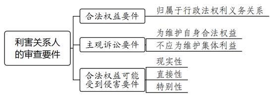
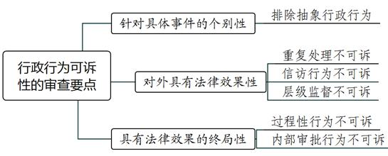
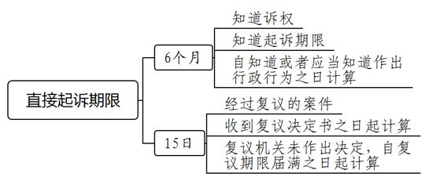
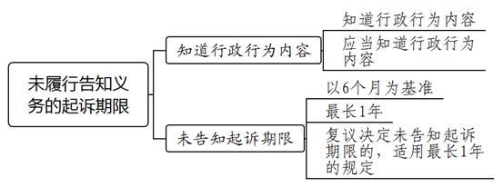
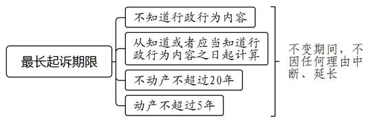

### **行政驳回起诉案件的审理思路和裁判要点**

行政驳回起诉案件是行政案件审查立案后，因原被告主体资格、起诉对象、起诉期限等不符合行政诉讼起诉条件，法院在程序上裁定驳回原告起诉的案件。在立案登记制的背景下，除明显不符合起诉条件裁定不予立案的情形外，对案件起诉条件的审查，也应坚持对行政行为的合法性进行审查。《行政诉讼法》和《行政诉讼法解释》中涉及起诉条件的规定繁多、类型多样，对法院准确适用起诉条件提出较高要求。本文结合司法实践中的典型案例，对较为常见的行政驳回起诉案件的审理思路和裁判要点进行梳理、提炼和总结。

一、典型案例

**案例一：涉及原告诉讼主体资格的认定**

桂某在停车场停车过程中车辆受损，其认为车辆受损系停车场车位设计缺陷且无人进行安全告知和引导所导致，故向A区交通委提出履职申请，要求A区交通委对物业公司进行行政处罚。A区交通委答复对其反映事项进行了调查，对桂某要求处罚的申请不予采纳。桂某认为物业公司存在违法违规行为，对桂某造成了财产损失，A区交通委拒绝对物业公司作出处罚损害了桂某的合法权益，故诉至法院要求A区交通委对物业公司进行处罚。

**案例二：涉及被告是否具有法定职责的认定**

范某因工伤伤情复发向B区人保局提出工伤复发确认申请，B区人保局受理后未作处理。范某诉至法院，请求判令B区人保局履行法定职责，受理并处理范某工伤复发确认申请。一审法院认为范某应向劳动能力鉴定委员会提出工伤复发确认申请，范某申请事项并非人保局的法定职责，遂裁定驳回范某的起诉。范某提起上诉，认为区劳动能力鉴定委员会由B区人保局组建，因劳动能力鉴定委员会并非行政机关，无法通过诉讼途径解决问题，故其只能以B区人保局为被告提起诉讼，起诉符合法律规定。

**案例三：涉及行政行为可诉性的认定**

龚某名下的集体土地上房屋被列入征收范围。因对被征收房屋面积存在异议，龚某向C镇政府请求出具可建建筑面积认定证明。C镇政府认为龚某户现有住房的建筑面积已经高于该地区现行农村村民住房建设标准，并无可认定的可建建筑面积，依法作出不予出具可建建筑面积认定证明的答复。龚某对答复不服，诉至法院要求C镇政府重新作出认定。

**案例四：涉及是否超过起诉期限的认定**

吴某因不服市公安局D区分局强制戒毒决定向市公安局申请行政复议，市公安局于2019年6月19日作出维持的复议决定，吴某于6月22日签收并于7月12日向E区法院起诉。E区法院认为，吴某应在收到复议决定书之日起十五日内即7月7日前提起诉讼，本案已经超过起诉期限，故裁定驳回起诉。吴某上诉认为，其因被限制人身自由，信件来往不便，且已于2019年6月26日按照复议决定书上的告知内容向D区法院邮寄起诉状，D区法院于7月7日退回起诉状并告知其应向E区法院起诉，本案超期应属情有可原。

二、行政驳回起诉案件的审理难点

**（一）原告主体资格把握难**

随着经济社会发展和公民权利意识的增强，行政诉讼原告资格呈现扩张趋势，原告资格的扩张也易引发滥用诉权的现象。由于行政行为一般具有公益性，与多数公民均具有一定的利害关系，如不限制易导致诉权被滥用。利害关系是判断原告资格的核心要素，不仅牵涉保护规范等理论问题，也需要在维护公共利益和保护私人权益之间寻求一定的平衡。

**（二）被告主体资格争议大**

被告是指作出被诉行政行为的行政机关或者法律、法规、规章授权的组织。司法实践中，行政机关履行公共事务的职能转移至事业单位等较多，如公房管理职能由房管部门转移至公房物业公司，房管部门对涉公房职能定位容易引起纷争。此外，也有部分行政机关在旧城区改建、违章建筑治理中经常组织居委会、村委会出面进行协商甚至拆除房屋等，相关行政机关是否参与进而可以作为被告争议较大。

**（三）可诉的行政行为认定难**

虽然行政诉讼法律规范对可诉行政行为的规定越来越细致，但对可诉行政行为的认识，仍然存在较多误区。行政行为是否可诉不仅受到法律规定的限制，也在很大程度上受限于国家政策变化、纠纷化解机制改革以及法院纠纷化解能力等因素。此外，行政主体作出的阶段性行为、层级监督行为、行政指导行为等向公众越来越公开，亦增加了可诉行政行为的识别难度。

**（四）行政诉讼是否超过起诉期限把握难**

不同于民事诉讼的诉讼时效制度，行政诉讼实行的是起诉期限制度。起诉期限是指当事人不服被诉行政行为请求司法救济的时间限制。起诉期限并无中止、中断制度，相对人因此丧失起诉权的情形较多。当事人超过起诉期限起诉的，将丧失进入实体审理的权利。是否超过起诉期限系法院主动审查的事项，但当事人往往认为法院对起诉期间起始点的认定有误，客观上也存在行政机关未送达、信访处理耽误起诉期限、不可抗力等正当事由，此类因素的审查不当易引起当事人对法院裁判公正性的质疑。

三、行政驳回起诉案件的审理思路和裁判要点

法院在审理此类案件时应遵循以下原则：**首先，以行政实体法与诉讼法的规定为基础，对当事人是否符合起诉条件进行审查**；**其次，在法律规定的基础上，准确把握原被告资格、受案范围、起诉期限等审查要点，特别是以被诉行为的性质为核心，原则上只要有一项不符合起诉条件，案件即不应进入实体审理；最后，对不适宜进入实体审理的案件，及时作出驳回起诉裁定，并在说理部分引导当事人通过更加直接、更加有效的途径维权**。

**（一）原告主体资格的审查要点**

**1****、原告资格审查的一般思路**

原告是指认为行政机关及其工作人员的行政行为侵犯其合法权益，以自己的名义，依法向法院提起诉讼从而引起行政诉讼程序发生的公民、法人或其他组织。

**第一**，行政诉讼的原告是公民、法人或其他组织，明确排除了行政机关作为原告。**第二**，原告至少应初步证明其权益受损系行政机关的行政行为所致，否则将因缺乏事实根据而不符合起诉条件。**第三**，原告的外延包含行政相对人和利害关系人两种类型。相对人即行政行为直接作用的对象，如行政处罚中的被处罚人；利害关系人则较为复杂，是指除相对人之外受到行政行为实际影响的其他主体。两者均要求存在利害关系，即利害关系的判断是审查原告资格的核心要素。下文着重阐述利害关系人的审查要点。

**2****、****利害关系人的要件审查**

《行政诉讼法解释》第12条列举了六类“与行政行为有利害关系”的情形。此处的列举是认定利害关系的典型情形，实践中应当着重关注以下三个要件：

**（****1****）****合法权益要件**

一方面，当事人应在行政争议中具有合法权益。合法权益的存在是认定利害关系的前提。如原告认为第三人建造房屋影响了通风采光的相邻权，要求行政机关予以查处，但原告自己的房屋就是违章建筑，故其与行政机关是否查处以及如何查处相邻房屋违建的行为之间不具有利害关系。另一方面，原告的合法权益应当归属于行政法上的权利义务范畴。当事人的民事权益，只有在行政法律规范对其加以专门保护的情形下才能成为行政法所保护的权益，形成行政法上的利害关系，进而取得原告主体资格。如债权人认为税务机关变更债务人公司税务登记导致其债权受损，要求撤销变更登记。债权人对税务登记不具有行政法上的权利义务，其民事权益应当通过民事救济途径予以维护。

**（****2****）****主观诉讼要件**

行政诉讼的权益保障初衷应在于原告为保护自身合法权益提起诉讼，而非为维护团体的集合利益提起诉讼。如小区个别业主对业主委员会的备案行为、小区公共部位的规划建设行为等涉及小区业主公共利益的行为不服的，不能以自己的名义提起诉讼，只能由业主委员会或者专有部分占建筑物总面积过半数或者占总户数过半数的业主作为原告起诉。

**（****3****）****合法权益可能受侵害要件**

当被诉行政行为对当事人的合法权益已经造成或势必造成现实的、直接的、特别的影响时，原告方可通过行政诉讼解决争议。司法实践中，法院应当重点审查被诉行政行为是否确与当事人权利义务增减密切或直接相关，当事人权益是否有遭受行政行为侵害的可能性、现实性。现在以及将来都不可能对当事人权益造成影响的行为，如已经与征收部门签订并履行了补偿协议，仍然起诉征收决定行为的，由于被征收人已经对征收行为失去利害关系，不应获得原告主体资格。

**3****、投诉人原告主体资格的审查要点**

当事人以其投诉（举报）权利受损起诉行政机关履行法定职责或者要求重新处理，法院对此类案件是否受理及处理的边界，实践中存在较多争议。在运用前文利害关系要件分析时，法院既要考虑原告投诉事项涉及公共利益还是私人利益，也要考虑相关实体法律规范对原告主张维护的权益是否提供专门保护，更要考虑相关纠纷是否有必要通过行政诉讼予以解决。

**（****1****）为维护自身合法权益的投诉人的审查要点**

《行政诉讼法解释》第12条规定，为维护自身合法权益受侵害向行政机关投诉，具有处理投诉职责的行政机关作出或者未作出处理的，投诉人具有原告主体资格。该条关于受害人原告资格的概括性规定将投诉人分为私益投诉和公益举报，认定为自身利益投诉的投诉人一般具有原告资格；如果为他人利益或者公共利益而举报的，一般不具备原告资格。如投诉人认为有市民侵占城镇用地建造违法建筑向行政机关投诉并要求处理，投诉人对处理不服的情形，由于行政机关是否处理及如何处理主要是为了维护公共利益，对投诉人合法权益不产生实际影响，所以投诉人不具有原告资格。

**（****2****）实体法律规范设置目的的审查要点**

需要注意的是，并非所有私益投诉者均具有原告资格。私益投诉者能否获得原告资格，除审查是否为维护自身合法权益外，还要审查行政实体法规范是否着重对私人利益予以保护，是否存在行政机关对投诉事项应依法定程序作出处理的明确规定。如《治安管理处罚法》明确规定，公安机关在行政处罚后，有被侵害人的，公安机关应当将决定书副本抄送被侵害人。这就表明，该法维护受害人人身财产权益，受害人具有对相应处罚起诉的权利。该规定与《行政诉讼法解释》第12条第3项“要求行政机关依法追究加害人法律责任的”规定具有一致性，体现了应当依照行政实体法的具体规定判定利害关系的意旨。上述投诉权利转化为起诉权利，主要是针对行政机关是否履行职责，而行政机关一般都具有行政裁量权，受害人并无要求行政机关对加害人作出某项特定处罚的请求权。

**（****3****）对投诉涉及纠纷的解决具有直接性、实效性的审查要点**

从表面影响来看，投诉人背后的权益保护似乎都受到了行政机关是否处理以及如何处理的影响，这种影响从心理感受上给投诉人造成足够大的冲击，以致认为是行政机关的拒绝履职导致其权益受损。如果投诉涉及纠纷完全可以通过民事诉讼或其他途径解决，不宜再进入行政诉讼，不能因为民事途径未实现目的而诉诸行政诉讼。放任投诉人寄希望于行政诉讼来解决民事争议，会使民事诉讼和行政诉讼之间的必要分工遭到破坏。

如案例一中，桂某要求交通部门处罚停车场设计不合理等问题，根据《上海市停车场（库）管理办法》规定，区交通委对公共停车场（库）未规范设置经营服务标志、未按照标准划设停车泊位等情形可以进行罚款。然而综观该规定全文，并没有针对一般消费者因停车库不规范经营可以要求管理机关在一定期限内予以处罚的规定。桂某与停车场关于财产损失的纠纷完全可以通过民事诉讼的途径解决，桂某也不能从处理中直接获益，故桂某要求行政机关对停车场进行罚款，不符合原告主体资格要件，其起诉应予驳回。

**（二）被告主体资格的审查要点**

**1****、一般审查思路**

判断行政诉讼的被告是否适格，首先审查被诉行为实施者是否具有相应的行政职权，名称是否明确、具体，进而结合法律规定以及起诉事项判断被告是否具有行政主体资格。其次，原告应当对被告是否适格问题承担初步证明责任。如强制拆除房屋案件中，如果原告举证证明行政机关已经发布征收决定或者责令强制拆除违法建筑决定的，原则上应推定作出征收决定或者强制拆除违法建筑决定的行政机关是适格被告。除非上述行政机关有证据证明强制拆除行为确属其他组织所为。在此类案件中，原告仅以被拆除房屋在被诉行政机关辖区范围为由要求行政机关承担责任，将可能因缺乏事实依据或者被告主体不适格而不能进入实体审理。最后，若被告主体不适格，原告将民事主体和行政机关作为共同被告提起诉讼的，法院应告知原告变更被告，原告拒不变更的，方可裁定驳回起诉。

**2****、确定被告资格规则的审查要点**

**（****1****）确定被告资格一般规则的审查**

“谁作为，谁被告”“谁署名，谁被告”“谁委托，谁被告”是确定被告资格的一般规则。通常情况下，行政行为一经作出，该行为的主体就已确定，相关行政决定的落款机关即作出行政行为的主体，亦即适格被告。应当注意的是，行政管理的复杂性决定除行政机关外，尚有大量被授权组织也在行使行政职能，即被法律、法规、规章授权的组织。这里的组织不仅包括行政机关、行政机构，还包括企业、事业单位，如高校履行颁发学位证职责、村民委员会行使本村公共事务和公益事业职责时可以作为被告。

如果被授权组织的行为并非在法律、法规、规章的授权范围内，而是行政主体依据其他的规范性文件如通知、会议纪要等所作“授权”实施的行为，此时的“授权”一般应理解为委托，相应的行政责任应当由委托方负责。如乡镇规土所接受区级规划部门委托核发农村宅基地房屋规划许可，没有相应的法律、法规、规章依据，其权利义务承受主体应为区级规划部门，乡镇规土所及其所属乡镇政府不应属于适格被告。

**（****2****）确定被告资格特殊规则的审查**

对内设机构、派出机构、派出机关等是否具有被告资格，应结合相应授权法律规范的层级、被告的设立文件等判定被告能否独立承担行政法律责任。如国务院、省级政府批准设立的开发区管理机构及其职能部门均可作为被告；而对其他层次的开发区管理机构及其职能部门来说，仅能以具有行政主体资格的开发区管理机构或者相应的设立开发区管理机构的地方政府为被告。对于类似综合整治指挥部、综合执法大队等行政机关临时组建的组织，也应以其能否以自己的名义行使职权、是否有独立的编制、能否独立承担行政法律责任为标准综合认定，并应由被告承担主要举证责任。

**3****、被告明显不具有法定职责的审查**

《行政诉讼法解释》第93条第2款规定，法院经审理认为原告所请求履行的法定职责或者给付义务明显不属于行政机关权限范围的，可以裁定驳回起诉。司法实践中较为常见的申请事项如要求上级政府直接履行下级职能部门固有的职责，混淆上下级层级监督职责与各自法定职责之间的关系。

对于是否明显不属于被告职责权限范围，应综合行政机关法定职权和原告申请事项审慎判定。如果将被告法定职权和原告申请事项综合比对，可以清楚、直观地认定二者不相匹配，则可以将该申请事项认定为明显不属于行政机关权限范围。在事实清楚的情况下，亦可以通过阅卷、调查或者询问当事人，径行裁定驳回起诉，并可以在驳回起诉裁定中，对行政机关应当履行的职责予以必要阐述，引导当事人另行对最有利于行政争议化解的行政行为起诉。反之，若对二者是否匹配尚存在疑问，特别是职权交叉情形下行政机关职责权限较为模糊，应主要由行政机关举证，听取双方对行政机关职责的法律规定及申请事项涉及领域的陈述，判断是否应当进入实体审理。

如案例二中，根据《工伤保险条例》规定，劳动能力鉴定委员会由社会保险行政部门、工会组织、经办机构代表以及用人单位代表组成，其主要职能是作出工伤职工劳动能力鉴定。劳动能力鉴定委员会在法律性质上属于技术鉴定机构，其行使的职能属于专门性的技术鉴定行为，不属于行政职权范畴。因此，若对劳动能力鉴定委员会的行为不服，不能申请复议或提起行政诉讼，一审法院裁定驳回起诉正确。

**（三）可诉性行政行为的审查要点**

**1****、****基本审查思路**

行政诉讼起因于行政争议，以行政行为的合法性审查为主体，但并非所有行政行为均可接受审查。行政行为的可诉性属于行政诉讼法规定的受案范围。审查行政行为是否可诉，首先明确被诉行为，被起诉的对象应是行政主体行使行政职权的作为或者不作为，而不能是司法行为或者民事行为。原告笼统要求行政机关履行职责的属于诉讼请求不明确，应要求其对起诉的行为内容予以明确，并不得违反一行为一诉的基本规则。其次，要结合《行政诉讼法》和《行政诉讼法解释》以及行政管理方面关于受案范围的实体法律规定，对照行政行为的内容、性质、特点及权益保护类型，确定原告起诉事项是否属于行政诉讼受案范围。

关于受案范围的法律规定，《行政诉讼法》采取特征描述加肯定列举和否定列举的方式，明确行政诉讼独特的受案范围。《行政诉讼法》第12条列举了行政处罚、行政强制、行政许可、行政确定、征收征用补偿等11种可诉的行政行为，第13条则列举了国家行为、抽象行为、内部行为及行政终局裁决行为等4种不可诉行为。《行政诉讼法解释》第1条又进一步规定了11种不可诉行为，如刑事司法行为、调解仲裁行为、行政指导行为、重复处理行为等。除程序法外，其他行政实体法律、法规亦有关于当事人可以提起行政诉讼的事项也有规定。如根据《土地管理法》第14条规定，当事人可以就土地所有权与使用权的争议向法院提起诉讼。

**2****、****对行政行为可诉性三个特征的审查要点**

**（****1****）具体事件的个别性**

抽象性行为一般不能转化为公民的请求权，可诉的行政行为一般是具体行政行为。这里的具体主要是强调行政行为应当是个别的、针对特定对象特定事件的行为，而不应包含针对不特定对象、可反复适用的抽象行政行为，如规范性文件的发布行为等。对规范性文件不服的，当事人可通过附带审查的方式向法院提出。

**（****2****）具备对外法律效果**

可诉的行政行为可直接设定当事人的权利义务，具有直接的执行效力，其核心特征是对当事人的权利义务产生实际影响。反之，对当事人权利义务不产生实际影响的行为，缺乏实际的法律效果，不属于行政诉讼受案范围。如上级行政机关不直接对外发生法律效力的内部批准行为，驳回当事人对行政行为提起申诉的重复处理行为，行政机关对信访事项作出的登记、受理、交办、转送、复查、复核意见等行为，尚未外化的政府会议纪要，行政机关维持登记内容不变的补发户口簿等证件行为均对当事人的权利义务不产生增减的影响。

**（****3****）法律效果的终局性**

一项完整的行政行为，通常要经过一系列过程性行为才能最终完成。可诉的行政行为属于最终影响当事人权利义务的行为，一般属于成熟性、终局性行为。因此内部行为、过程性行为、行政机关对事实状态的认定行为一般不可诉。上述行为本质上仍属于对当事人未产生最终实际影响的行为。如较为常见的受理通知、补正告知等过程性行为，不具有可诉性。对上述行为是否合法的判断应通过最终的行政行为来确定。若上述行为直接导致相关行政程序终止，则对当事人的权利产生了实际影响，如行政复议中直接告知申请人终结复议程序，则应属于可诉的行为。此外，内部业务指令、多阶段行政行为等属于内部行政领域，不具有可诉性。

如案例三中，朱某认为根据相关法律规定，在征地拆迁时，镇政府应根据具备条件家庭的申请，制作可建建筑面积认定证明，C镇政府拒绝作出认定属于行为违法。镇政府出具可建建筑面积认定证明属于政府机关在征收拆迁过程中作出的阶段性事实认定行为，并不具有设定被征收人行政法上权利义务的效果。只有在政府部门作出征收补偿裁决或者签订行政协议时，才对被征收人产生实际影响，故本案系争行为不属于单独可诉的行政行为。其他类似行为还有对被征收房屋的面积、产权等核定与公示等。

**（四）起诉期限的审查要点**

**1****、****一般审查思路**

行政立案阶段，除不符合《行政诉讼法》第49条规定的四项要件不予立案外，超过起诉期限也是常见不予立案的理由，如原告起诉时明显超过五年或二十年最长起诉期限的情形。对于大部分案件，立案阶段不宜直接认定当事人起诉已经超过期限，应由被告举证答辩后结合双方证据作出处理。根据被告送达证明、原告对超过起诉期限事由的说明及证明材料、原告是否积极行使诉权等，准确认定起诉期限的起始时间，从有利于保护当事人诉权的角度认定是否超过起诉期限。超过起诉期限的，裁定驳回起诉时应阐明起诉期限的起始时间和截止时间。

**2****、****起诉期限的相关规定**

**（****1****）直接起诉期限**

原告直接向法院起诉的期限是六个月，自其知道或者应当知道作出行政行为之日起计算。这里的“知道”应有充分证据证明原告收悉了行政行为的载体或知晓行政行为的内容；“应当知道”则是运用逻辑推理和一般生活经验，根据在案证据推定原告收悉了行政行为的载体或知晓行政行为的内容。“作出行政行为”不仅包含行政机关依据一定的事实和法律规范作出一项具体行政行为，也包含对诉权和起诉期限的告知，只有在这种情况下才直接适用六个月的起诉期限。行政机关以公告方式送达的，原告知道行政行为的时间应当以公告之日起计算，公告有期限的，从公告期结束之日的次日起计算。另外，对行政机关不履行法定职责提起诉讼的，应当在行政机关履行法定职责期限届满之日起六个月内提出。紧急情况下行政机关不依法履行职责的，则无须等待履行法定职责期限届满。原告不服行政复议决定的，可以在收到复议决定之日起十五日向法院提起诉讼，复议机关未作出复议决定，起诉期限自复议期限届满之日起计算。

**（****2****）行政机关未履行告知义务的起诉期限**

原告知道行政行为的内容，但行政机关未告知起诉期限，致使原告逾期起诉的，起诉期限从知道或者应当知道起诉期限之日起计算，但从知道或者应当知道行政行为内容之日起最长不得超过一年。复议机关未告知起诉期限，原告对复议决定不服提起诉讼的，起诉期限从其知道或者应当知道行政行为内容之日起最长不得超过一年。

**（****3****）最长起诉期限**

原告不知道行政行为内容的，起诉期限从其知道或者应当知道行政行为内容之日起计算，此时仍然首先适用前述六个月或一年的起诉期限，但涉及不动产的案件自行政行为作出之日起超过二十年、其他案件自行政行为作出之日起超过五年提起诉讼的，不予受理。上述期限是行政诉讼起诉的最长期限，也是不变期限，不因任何理由而扣除、延长。实践中对不动产案件范围的理解存在争议，《行政诉讼法解释》将其界定为因行政行为导致不动产物权变动而提起的诉讼，这就较大限缩了不动产案件的范围，有利于行政秩序的稳定性，故针对较为常见的房屋拆迁许可、规划许可、验收行为、违法建筑拆除行为等提起诉讼只能适用最长五年的起诉期限。

**（****4****）无效行政行为的起诉期限**

无效行政行为自始无效、绝对无效，指行政行为的实施主体不具有行政主体资格或者没有依据等重大且明显违法的情形。需要注意的是，《行政诉讼法解释》规定只有对2015年5月1日之后作出的行政行为，原告才有权起诉请求确认无效。为避免滥用确认无效诉讼，原告应证明行政行为符合无效的情形，法院审查后认为行政行为符合无效情形且系2015年5月1日之后作出的，则不受起诉期限限制。如果行政行为不属于无效情形的，法院应向原告进行释明。原告变更为撤销之诉的，应审查是否符合撤销之诉的起诉期限并作出相应裁判，如果原告拒绝变更的，判决驳回其诉讼请求。

**（****5****）起诉期限的例外规定**

因不可抗力或者其他不属于起诉人自身的原因超过起诉期限的，被耽误的时间不计算在起诉期限内；如因其他客观原因耽误起诉期限的，起诉人可以申请延长期限。耽误起诉期限的原因，应当是不可抗力等不属于起诉人怠于行使起诉权利的情形。耽误起诉期限的情形一般指存在直接导致起诉人在起诉期限内客观上不能起诉的因素。有部分起诉人以其多年信访为由要求延长起诉期限，此种情况不足以成为阻却起诉期限计算的正当事由。

此外，因管辖权调整如行政案件由原来的属地管辖变为集中管辖，有可能造成当事人超过起诉期限。如案例四中，吴某起诉的强制戒毒行为由市公安局D区分局作出，本应由D区法院受理，在本案起诉期限内D区行政案件全部集中由E区法院管辖。吴某曾按照复议决定书上告知的管辖法院D区法院邮寄起诉状，此时尚未超出起诉期限。D区法院于7月7日退回吴某起诉状并告知其应向E区法院起诉，吴某遂于7月12日向E区法院起诉，本案超出十五日起诉期限。因此，吴某并非怠于行使诉权，本案超过起诉期限不属于起诉人自身原因的情形，E区法院裁定驳回起诉不当，本案应继续审理。经过复议的案件，因起诉期限为十五日，期限较短，对短暂超期的案件，法院应尤其注意听取原告意见，存在合理理由的应扣除被耽误的期间。

（根据立案庭方方、王征提供材料整理）