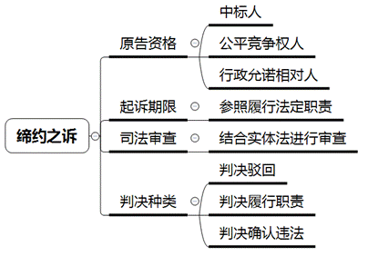
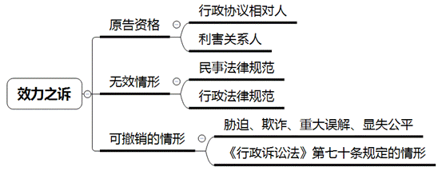
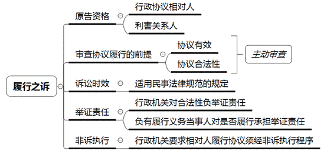
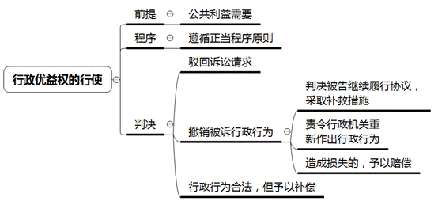

### **行政协议类案件的审理思路和裁判要点**

行政协议是行政机关为实现行政管理或者公共服务的目标，与公民、法人或者其他组织协商订立的具有行政法上权利义务内容的协议。行政协议在本质上属于行政行为，但在形式上又采用“合意”方式作出，具有公法和私法双重属性。行政协议的这种“二元性”在实践中易导致法律适用混乱，本文从行政协议的基本性质出发，结合典型案例，对行政协议类案件中的审理思路和裁判要点进行梳理、提炼和总结。

**一、典型案例**

**案例一：涉及行政协议诉讼时效的认定**

李甲与A区土地储备中心于2005年签订征用集体所有土地房屋拆迁安置补偿协议。2019年，李甲的父亲李乙认为其系拆迁户的户主，A区土地储备中心在未与其协商一致的情况下，与李甲签订协议拆除涉案房屋，侵害其权益，遂向法院提起诉讼，请求确认协议无效。一审法院认为安置补偿协议具有行政协议属性，应适用行政诉讼关于起诉期限的规定，以李乙的起诉已经明显超出最长2年的起诉期限为由，裁定驳回起诉。李乙不服提起上诉。

**案例二：涉及行政协议内容的合法性审查**

王某与B区房管局（签约甲方）、B区三征所（房屋征收实施单位）签订国有土地上房屋征收补偿协议，约定补偿金额、补偿面积以及王某户不享受居住困难户保障。协议签订后，王某户向B区三征所交付涉案房屋并领取征收补偿款。后王某以B区房管局未认定其为居住困难户且其受到胁迫为由诉至法院，请求确认该协议条款无效并要求按照居住困难户标准进行补偿。一审法院认为王某已经签署相关协议不能反悔，判决驳回其诉讼请求。王某不服提出上诉。

**案例三：涉及行政协议履行行为的审查**

林甲与C区房管局签订国有土地上房屋征收补偿协议约定：采用产权房屋调换方式安置林甲，林甲户不符合居住困难户标准，林甲作为承租人有义务对同住人进行安置，房管局应当在林甲腾空房屋后60日向林甲交付安置房和补偿款。协议签订后，林甲的侄女林乙向房管局提出林甲户应当认定为居住困难户。房管局以林甲户家庭内部不能协商一致为由，拒绝向林甲交付安置房和补偿款。一审法院判决房管局向林甲户履行协议，林甲以房管局履行协议对象错误为由提出上诉。

**案例四：涉及行政协议条文的理解**

2015年，D区住房局与被征收人签订协议。协议中关于交房期限的空白处未填写日期，但在房源使用单中记载交房日期为“该项目取得施工许可证后36个月”。该征收基地其他安置房源的交房日期约定为3年。征收部门工作人员前期通过展板、触摸屏机器等公示了载有交房日期为该项目取得施工许可证后36个月的安置房源清单等相关征收信息。被征收人在协议订立三年后，起诉要求征收人承担未按时交房的违约责任。

**二、行政协议类案件的审理难点**

行政协议不同于一般行政行为，是行政机关与行政相对人之间达成合意后共同履行的双方法律行为，而非行政机关单方法律行为。行政协议与单方行政行为相比，最本质的区别在于行政相对人的意思表示对行政协议的成立和生效具有决定性作用。需要注意的是，行政机关订立、履行、解除行政协议的行为仍然应当遵循行政法的基本原则。同时，行政协议类案件的审查还必须考虑协议行政性部分的审查以及行政法规范和民法规范的衔接问题。如何处理好依法行政和意思自治的关系，做到既保障公共利益又维护个人利益，是行政协议类案件审查的重点和难点。

**（一）起诉期限和诉讼时效区分难**

审理行政协议类案件首要解决的问题是，当事人对行政协议提起诉讼应适用行政诉讼中的起诉期限制度还是民事诉讼中的诉讼时效制度。起诉期限属于程序审理的范畴，针对的是诉讼中的诉权，由法院主动审查。起诉期限届满后，法院对行政争议不再进行实体审理。诉讼时效属于实体审理的范畴，需由当事人自行提出抗辩，法院不主动审查。诉讼时效届满后，债权人丧失胜诉权。行政协议作为行政行为与民事合同融合的产物，具体应适用起诉期限还是诉讼时效，需要依据诉讼请求进行判断。针对行政优益权提起的撤销之诉应适用行政诉讼起诉期限的规定，而针对行政机关不依法履行、未按照约定履行行政协议提起诉讼的，应适用民事诉讼时效的规定。

**（二）举证责任分配难**

一般行政诉讼中，行政机关对其作出行政行为的合法性负有举证责任。然而因行政协议本身具有契约性、双务性的特征，行政协议类案件中引入民事诉讼“谁主张谁举证”的举证规则。行政相对人对其要求撤销、解除行政协议的事由，以及是否履行协议约定义务承担举证责任。行政机关则需参照行政行为对其职权、职责，以及履行、变更、撤销协议等行为的合法性和程序等承担举证责任。实践中，由于协议签订履行情况复杂，双方权利义务交织，如何理清案件事实、正确适用举证规则是行政协议类案件的审理难点之一。

**（三）意思自治与依法行政平衡难**

行政协议允许行政机关与行政相对人通过意思自治达成协议，但行政机关的意思表示不能违反法律、行政法规和规章的规定。与民事合同审理不同的是，即使行政机关与行政相对人对于协议约定的内容不存在争议，法院在审理行政协议案件时仍需对行政行为的合法性进行审查，以保障依法行政的基本要求。因此如何平衡好意思自治与依法行政的关系，也是行政协议类案件的审理难点之一。

**（四）法律规范适用难**

行政协议需要同时符合行政与民事两方面法律规范的要求，但两者可能存在边界模糊、重叠的情况。例如行政协议无效既适用行政法律规范中关于行政行为无效的规定，也适用民事法律规范中关于合同无效的规定。在行政和民事法律关系交织的情况下，如何根据案件事实准确适用行政、民事法律规范存在一定难度。

**（五）行政协议条款认定难**

行政协议文本多为格式条款，实践中往往某些关键内容表述不清楚、不规范、不严谨，甚至留有空白。协议关键性内容的缺失给行政审判带来一定困难，需要法院花费较大精力分析认定协议约定所指向的内容。在法院依法作出认定后，一方当事人往往对此认定不予认可，进而对判决结果不服，难以实现实质性解决行政争议的效果。

**三、行政协议类案件的审理思路和裁判要点**

行政协议类案件的审理，应以《行政诉讼法》及相关司法解释、《民法典》相关条款为主要法律依据，**在保证国家利益、社会公共利益的前提下，运用依法行政、诚实信用、正当程序等原则保护协议双方合法权益，平衡好依法行政与意思自治之间的关系，督促行政机关严格依法行政，合法高效开展行政活动，达到良好的社会治理效果。**

**（一）行政协议的认定标准**

根据《关于审理行政协议案件若干问题的规定》第1条，行政协议应包含四方面要素：**一是**主体要素。缔结行政协议的一方应当是行政机关，或者法律、法规、规章授权的组织以及其他依法接受行政机关委托行使公共管理职能的组织。另一方是作为行政相对人的公民、法人或其他组织。行政机关之间的公务协助协议及行政机关与其工作人员订立的劳动人事协议不属于行政协议。**二是**目的要素。行政协议的订立目的具有公益性，即为实现行政管理或者公共服务目标而订立行政协议。行政机关为自身需要与合同相对方订立的建设、维修、采购等协议不属于行政协议。**三是**协商要素。行政协议是双方法律主体经过协商达成的合意，应体现平等、自愿、协商等特征。需要指出的是，在行政协议中，协议双方法律地位并不完全平等，行政机关需受行政法律法规的规制。**四是**内容要素。行政协议需具有行政法上的权利义务内容，可以从行政机关是否行使行政职权、协议是否为实现行政管理目标或公共利益、是否存在法定或约定的优益权进行判断。

如案例一中，案涉协议一方当事人是土地储备中心，虽然其性质是事业单位，但事业单位也可以民事主体的身份与他人订立协议，必须结合相关法律法规及双方法律地位确定协议性质。该案发生于2005年，李甲与土地储备中心依据《城市房屋拆迁管理条例》订立拆迁协议，土地储备中心为拆迁人，李甲为被拆迁人。在城市房屋拆迁制度框架下，拆迁人与被拆迁人属于平等民事主体，如果双方对订立协议或协议履行发生争议，需通过行政裁决或者民事诉讼予以解决。因此本案中土地储备中心属于民事主体，不符合《关于审理行政协议案件若干问题的规定》中确立的主体标准，该协议并非行政协议，而是民事合同，不应当适用行政诉讼起诉期限的规定，而应当适用民事法律规范进行审理。故二审法院撤销一审裁定，指定一审法院继续审理。

**（二）行政协议的分类审查**

行政协议类案件的审理首先需要明确案涉协议属于行政协议还是民事合同。行政协议类案件不同于传统行政案件，其诉讼请求多样，举证规则、法律适用等亦有不同。根据《关于审理行政协议案件若干问题的规定》，可以将行政协议案件分为行政协议缔约之诉、效力之诉、履行之诉及相关行为之诉四种诉讼类型。

**1****、行政协议缔约之诉**

行政协议缔约之诉是指《关于审理行政协议案件若干问题的规定》第9条第4项规定的，原告“请求判决行政机关依法或者按照约定订立行政协议”的诉讼。这类案件的审查重点是原告主体资格。

**（****1****）原告资格限于中标人、公平竞争权人和行政允诺相对人**

行政协议缔约之诉原告资格的获得方式分为两类：**第一类**是依法获得原告资格的情形，如中标人、公平竞争权人。根据《招标投标法》第46条规定，招标人和中标人应当自中标通知书发出之日起三十日内，按照招标投标文件订立书面合同。如果作为招标人的行政机关未按照上述规定与中标人签订协议，中标人可以提起缔约之诉。此外，参与招标、拍卖、挂牌等竞争性活动的公民、法人或者其他组织认为行政机关的行为侵犯其公平竞争权的，也有权提起行政诉讼。**第二类**是依据行政允诺获得原告资格的情形。当行政机关已经通过协议等方式承诺与特定相对人订立行政协议时，如行政机关不履行该义务，行政相对人则有权就此提起行政诉讼。

**（****2****）****起诉期限参照请求履行法定职责的规定**

关于行政协议缔约之诉的起诉期限，《行政诉讼法》及相关司法解释均无明确规定。若其他单行法律法规有规定的，应当从其规定；若无其他规定的，可以参照要求行政机关履行法定职责的规定来审查原告的诉讼是否超出法定起诉期限：行政相对人或利害关系人应当首先在合理期限内向行政机关提出要求缔约的请求，如果行政机关予以拒绝或者超过两个月未予以答复，行政相对人或利害关系人可以自行政机关拒绝之日或两个月期限届满之日起六个月内提起行政诉讼。

**（****3****）****结合实体法进行司法审查**

行政协议缔约之诉应根据原告的诉讼请求分别进行审查。如果原告依据特别法的规定，如《招标投标法》《政府采购法》《土地管理法》《城市房地产管理法》《政府采购法实施条例》等作为公平竞争权人提起诉讼，应当着重审查行政机关是否依照法定程序进行招标、拍卖或者政府采购；如果原告作为中标人要求行政机关与其订立书面协议，应当着重审查行政机关不订立协议的行为是否合法；如果原告依据行政允诺或者行政协议获得相应的请求权，主要应当审查行政机关是否违反承诺或者协议的约定。

**（****4****）****判决结果**

行政协议缔约之诉案件的判决结果分为三种：**一是**判决驳回行政相对人的诉讼请求。**二是**判决行政机关在一定期限内履行职责。**三是**确认违法，主要是针对公平竞争权人认为行政机关不与其订立协议的行为违法，经审理后认为其诉请和理由成立的，应认定行政机关行为违法。

需要说明的是，此类案件的原告必须是行政行为相对人，故判决双方缔约不涉及判决行政相对人履行签约义务。行政机关被判决履行法定职责而拒绝履行的，法院可以采取罚款、通知被诉行政机关的上级机关、拘留等措施督促行政机关履职。

**2****、行政协议效力之诉**

行政协议效力之诉包括行政协议无效之诉和行政协议撤销之诉，某些特殊情况下也存在确认行政协议有效之诉。行政协议效力之诉的审理一般可参照民事合同效力之诉进行。需要注意的是，与民事合同效力之诉相比，行政协议效力之诉的审查重点还包括：

**（****1****）****原告资格仅限于行政协议相对人和利害关系人**

依据《关于审理行政协议案件若干问题的规定》，行政机关不具有提起行政诉讼的资格，因此也就无权起诉要求确认协议无效、撤销协议或者解除协议。然而，行政机关在行政协议法律关系中依据法律规定和合同约定享有一定的行政优益权。在行政协议履行过程中行政机关有权进行指挥和监督，有权单方变更和解除协议，有权对违反合同义务的相对人进行制裁。因此，一般情况下，行政机关无需通过司法程序就能单方面解除行政协议，但行政机关的这种单方解除和变更权并非无限制的，也应当接受司法审查。

**（****2****）****认定行政协议无效需同时符合行政法规范和民事法规范**

法院认定行政协议无效，首先应根据《行政诉讼法》第75条、《关于审理行政协议案件若干问题的规定》第12条认定行政行为是否存在重大且明显违法的情形，从而对行政协议的效力作出认定。其次，法院可以适用民事法律规范确认行政协议的效力。根据《民法典》第144、146、153、154条等规定，审查行政协议是否存在行政相对人无民事行为能力，以虚假的意思表示实施行为，协议内容违反法律、行政法规的强制规定，违背公序良俗，恶意串通、损害他人合法权益等无效的情形。如存在法律规定协议无效的情形，法院应判决确认协议无效；如不存在法律规定的协议无效的情形，应判决驳回诉讼请求。此外，限制民事行为能力人签订的行政协议需根据《民法典》第145条规定确认其效力。

如案例二中，首先应当审查行政协议是否存在明显违法的情形，相对人的意思表示不能免除司法审查。因此，本案应当对订立征收补偿协议的主体是否具有行政主体资格或者是否有职权和法律依据等进行实体审查，还应当审查行政协议是否存在民法上的无效情形。经审查，行政协议既不存在行政法上的无效情形，也不存在民法上的无效情形，二审法院遂判决驳回王某的上诉请求。

**（****3****）****认定可撤销行政协议需符合几种法定情形**

行政协议的撤销有两种理解：**一是**基于《行政诉讼法》第70条规定，行政协议存在主要证据不足、适用法律法规错误、违反法定程序、超越职权、滥用职权、明显不当等情形时，法院应判决撤销或者部分撤销，并可以判决被告重新作出行政行为。**二是**根据《关于审理行政协议案件若干问题的规定》第14条，原告认为行政协议存在胁迫、欺诈、重大误解、显失公平等情形而请求撤销，法院经审理认为符合法定可撤销情形的，可以依法判决撤销该协议。

实践中，原告对行政协议提起诉讼时，往往混用确认行政协议无效和撤销行政协议的诉请。法院应通过法律释明，引导当事人明确其诉讼请求和事实理由，适用正确的法律规定，从实质上保障当事人的合法权益。

**3****、行政协议履行之诉**

行政协议履行之诉是行政协议诉讼中行政法规范和民法规范交织范围最广的一类诉讼。与民事合同的履行之诉和传统的行政诉讼相比，行政协议履行之诉的审理需要注意以下要点：

**（****1****）****行政协议的利害关系人亦享有原告资格**

行政协议的订立和履行不仅涉及到协议当事人的权利义务，也涉及到利害关系人的权利义务，因此行政协议的利害关系人也具备原告资格。如为保障公房承租人、被征收、征用人等弱势群体的实体权益，赋予用益物权人和公房承租人原告资格。

**（****2****）****依合法性、合约性顺序依次进行审查**

行政诉讼一般是对行政行为的合法性进行全面审查，因此行政协议履行之诉的前提是对行政协议的效力和合法性进行审查。即使行政相对人对协议效力并无异议，法院也应当对行政协议的合法性主动进行全面审查。经审查认定协议合法性后，进一步审查协议内容及履行情况。

如案例三中，在确认行政协议合法性的前提下，重点审查行政机关向林某个人履行协议是否符合协议约定。本案中行政协议的相对方是林某个人，协议中约定的义务主体也是林某个人，且林某的诉讼请求也是请求向其本人履行协议。行政机关所主张《上海市国有土地上房屋征收与补偿实施细则》第44条规定，是为强调公有房屋承租人对同住人的安置义务，并非对协议履行对象作出规定。一审法院判决向林某户履行协议系判非所请，最终二审撤销原判，改判向林某履行协议。

如案例四中，在审查确认协议效力及合法性后，明确案件主要争议焦点是对协议内容的确定。虽然在协议上对于交房期限的约定为空白，但征收实施单位通过公示公告等方式已告知行政相对人交房日期为“该项目取得施工许可证后36个月”，被征收人对此知晓并认可，应视为对系争协议的补充约定。现因施工许可证尚未核发，并不具备交房期限的起算条件，故判决驳回原告诉请。

**（****3****）****诉讼时效适用民事法律规范的规定**

依据《关于审理行政协议案件若干问题的规定》第25条，行政相对人请求行政机关履行合同义务的请求权基础是债权请求权，故行政协议履行之诉案件不适用行政案件关于起诉期限的规定，而适用民事案件诉讼时效的规定。

**（****4****）****负有履行义务的当事人对协议是否履行承担举证责任**

《关于审理行政协议案件若干问题的规定》第10条第3款规定，对行政协议是否履行发生争议的，由负有履行义务的当事人承担举证责任。因此在行政协议中，原被告均有可能就自身负有的履行义务承担相应的举证责任。

**（****5****）****行政机关要求行政协议相对人履行协议须通过非诉执行程序**

基于我国行政诉讼的架构及定位，行政机关不具有行政诉讼的原告主体资格，所以行政机关不能通过履行之诉要求相对人履行协议。对于行政机关要求相对人履行协议义务的，《关于审理行政协议案件若干问题的规定》设置专门的非诉程序，行政机关可以作出书面决定要求行政协议相对人履行协议。如果行政协议相对人收到决定后申请行政复议或者提起行政诉讼，该书面决定视为单方行政行为，法院按照行政行为合法性审查的要件，即职权、程序、事实及法律适用进行审查。如果行政协议相对方收到书面决定后在法定期限内未申请行政复议或者提起行政诉讼，且仍不履行，协议内容具有可执行性的，行政机关可以向法院申请强制执行。

**4****、行政协议相关行政行为之诉**

在行政协议的订立和履行过程中，行政机关也可能基于行政优益权作出单方行政行为，包括对协议履行的监督、对协议相对人的处罚等。所谓行政优益权，是指为实现行政管理或行政服务目的、维护国家利益及社会公共利益，赋予行政机关基于其职务所获得的超出协议本身约定的特别权力。目前在行政审判活动中最为常见且争议最大的行政优益权是行政机关单方变更和解除权。双方当事人的主要争议往往在于单方变更和解除权的行使是否合法、正当。

《关于审理行政协议案件若干问题的规定》第16条奠定了单方变更和解除权的法律框架，即在履行行政协议过程中可能出现严重损害国家利益、社会公共利益的情形，行政机关可以作出变更、解除协议的行政行为。行政协议相对人对行政机关的上述行政行为不服，可以提起行政诉讼，这类诉讼就是行政协议相关行政行为之诉。此类案件的审理需注意以下要点：

**（****1****）****公共利益的需要是单方变更解除权行使的前提**

行政机关行使行政优益权需要符合特定前提，即继续履行行政协议可能出现严重损害国家利益、社会公共利益的情形。行政协议本质上是一种公法合同，其根本目的在于实现国家利益及社会公共利益的最优化配置。因此，行政机关基于行政优益权行使单方变更和解除权的前提，是协议的继续履行将会损害国家利益、社会公共利益。这种损害具体表现为对国家安全、公共安全、社会秩序、社会财富等重大损害，或者协议的履行明显违反法律法规或重大方针政策。

我国立法并未对公共利益作出明确界定，可以参考《国有土地上房屋征收与补偿条例》第8条规定，即为保障国家安全、促进国民经济和社会发展等公共利益的需要，具体又包括：国防和外交的需要；由政府组织实施的能源、交通、水利等基础设施建设的需要；由政府组织实施的科技、教育、文化、卫生、体育、环境和资源保护、防灾减灾、文物保护、社会福利、市政公用等公共事业的需要；由政府组织实施的保障性安居工程建设的需要；由政府依照城乡规划法有关规定组织实施的对危房集中、基础设施落后等地段进行旧城区改建的需要；法律、行政法规规定的其他公共利益的需要。

**（****2****）****单方变更、解除权的行使应遵循正当程序原则**

行政机关因国家利益、社会公共利益需要，需解除、变更行政协议的，应当及时告知行政协议相对人相关情况并说明理由，并与其协商修改方案或补救措施。确实无法继续履行协议或双方对协议修改方案及补救措施未能达成一致的，可以解除协议。如果造成行政协议相对人权益受到损害的，应当给予合理补偿。

**（****3****）****判决结果**

法院对行政机关单方行使解除和变更权进行审查后，应根据不同情况进行判决。

**第一，对行政机关行为的合法性作出判决**

对于行政机关的单方变更和解除行为的审查，首先要判断行政行为是否存在《行政诉讼法》第75条规定的行政行为无效情形。其次，审查行政行为是否存在《行政诉讼法》第70条规定撤销和重作判决的情形，以及行政协议继续履行是否存在严重损害国家利益、社会公共利益的情形。

**第二，对协议的效力作出判决**

行政机关的单方变更和解除行为如果不存在无效和可撤销的情形，法院应当判决驳回原告的诉讼请求，行政协议自行政行为作出之日起，其效力发生相应变更。如果行政机关的单方变更和解除行为被认定为无效或者因违法被撤销，法院可以依据行政诉讼法第78条规定判决被告继续履行协议、采取补救措施。需要注意的是，如果行政机关的行为虽因违法被撤销，但行政协议继续履行将严重损害国家利益、社会公共利益的，法院应当在作出撤销判决的同时，责令行政机关重新作出行政行为。

**第三，对是否应当进行赔偿或者补偿作出判决**

如果行政机关基于国家利益和社会公共利益的需要单方变更、解除行政协议行为合法，但该行为给行政协议相对方造成损失的，仍应判决行政机关予以补偿；如果行政机关单方变更、解除协议行为不合法，给行政协议相对方造成损失的，应判决行政机关予以赔偿。

对于补偿和赔偿的金额，当事人之间对此有约定的，应当遵照当事人之间的约定计算补偿和赔偿金额。没有约定的，可以适用民事法律规范，同时参照国家赔偿法的相关规定进行计算。

**四、其他需要说明的问题**

行政协议类案件中行政民事法律关系相互交织，当事人对诉讼类型的选择也可能产生程序问题。例如当事人先通过民事诉讼对国有土地上房屋征收补偿协议的标的物进行分割，当民事生效判决已对标的物作出分割但未对行政协议本身效力作出评判时，当事人又提起行政诉讼要求确认协议无效。此时行政案件是否应当受理、受理后如何避免与生效民事判决产生冲突等，都是我们需要进一步探讨的问题。

（根据行政庭董礼洁、张昊提供材料整理）