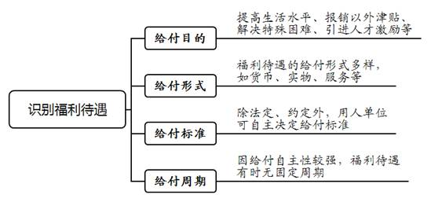
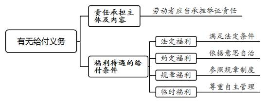
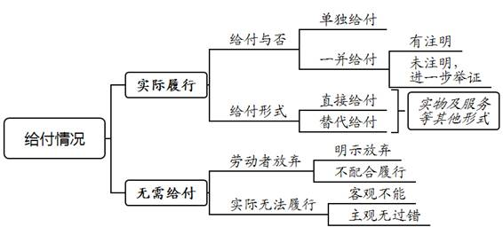
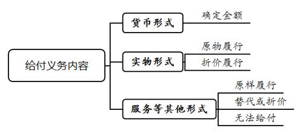
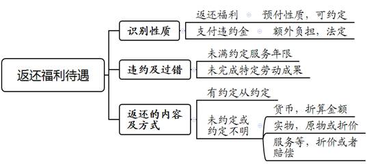

### **福利待遇纠纷类案件的审理思路和裁判要点**

劳动争议中的福利待遇是指用人单位为吸引劳动者入职，以及满足劳动者工作生活的共同或特殊需要，在工资、社会保险、住房公积金之外向劳动者提供一定货币、实物、服务等形式的物质帮助。该类纠纷主要包括劳动者向用人单位主张福利待遇的给付与用人单位向劳动者主张福利待遇的返还两种类型。福利待遇纠纷案件因种类名目繁杂、款项性质模糊、履行方式多样，且涉及劳动者生存发展权与用人单位经营管理权的平衡保护，审理中存在诸多难点。现结合典型案例对该类案件的审理思路和裁判方法进行梳理、提炼和总结。

**一、典型案例**

**案例一：涉及特殊福利支付主体与责任认定**

A公司录用刘某担任高级技术人员，并承诺为刘某申报本市某类引进人才。根据有关规定，对于入选该类人才的劳动者，财政部门与用人单位均会发放相应补助。A公司申报成功之后，财政部门向A公司汇入相应补助。然而A公司未向刘某支付，而是将财政补助退回。后刘某申请仲裁，要求A公司按规定支付全部补助。A公司认为其并无支付义务；即便需要支付，其也不应承担财政补助部分。

**案例二：涉及福利待遇的返还或赔偿**

2012年5月10日，B公司与顾某签订劳动合同，约定B公司为顾某申请限价商品房，房屋建筑面积77.9平方米，每平方米均价7980元（市场价为15000元）。双方另约定，服务年限为10年，顾某如提前辞职需支付赔偿款（房屋差价×剩余服务年限×20%）。2016年4月8日，顾某辞职。B公司提起仲裁，要求顾某支付赔偿款。顾某认为赔偿款性质属于违约金，用人单位无权向劳动者主张违约金。

**案例三：涉及不同性质福利待遇的甄别**

C公司《员工手册》规定，除法定年休假外，员工每年另享有5天福利年休假；员工申请年休假，应当先使用法定年休假。2018年12月，C公司解除与朱某的劳动合同。朱某申请仲裁要求C公司支付2018年剩余5天未休年休假折算工资。C公司辩称，朱某法定年休假已休完，要求折算剩余5天福利年休假工资的主张没有依据。

**二、福利待遇纠纷案件的审理难点**

**（一）范围边界区分难**

劳动关系中，劳动者可从用人单位获得劳动报酬或福利待遇，两者均以用人单位向劳动者履行给付义务为表现形式。由于劳动报酬与大部分福利待遇在支付主体、履行方式上存在相似性，如何清晰划定两者界限存在困难。另外，由于福利待遇的种类繁杂、名目多样，如何确定福利待遇本身的范围亦存在困难。

**（二）给付依据审查难**

福利待遇性质不一，给付依据不同。一般可分为法定福利、约定福利、规章福利、临时福利等。审查给付依据时，需根据不同属性加以区别与归类。具体而言，不仅要从各类法律法规、规章文件中梳理出法定福利的种类、辨明发放条件，还要确定用人单位与劳动者约定福利的具体内容，亦需区分该福利是属于用人单位内部制度所规定的经常性福利还是偶发性、一次性福利。

**（三）非货币福利处理难**

在以非货币形式给付的福利待遇纠纷中，履行方式、价值认定、强制执行等事项难以处理。具体而言，如无法以原定方式履行给付义务，用人单位如何承担相应责任，折价与否以及标准等问题均为难点。另外，在劳动者违约的情况下，对已经享受的非货币性福利待遇如何向用人单位承担相应责任亦难以认定。

**三、福利待遇纠纷案件的审理思路和裁判要点**

**福利待遇纠纷的处理，应当体现诚信公平，尊重意思自治，做到审执兼顾，既满足劳动者生存发展的需要，又维护用人单位自主经营的权益。**具体而言，法定福利一般体现出均等性，符合条件的劳动者均可享有，审理过程中应体现公平性；约定福利因劳动贡献与生活需求的不同而存在差异性，审理过程中应尊重双方约定。规章福利和临时福利体现自主性，系用人单位企业文化与自主管理的表现，对给付义务的审查不应过于苛刻。

**（一）审查是否属于福利待遇**

审理中，需要先审查当事人的请求是否属于福利待遇的范围。一般而言，福利待遇不直接以劳动成果为对价，是用人单位在劳动报酬之外以多种形式（货币、实物、服务等）向劳动者履行的给付。对于某一给付项目是否属于福利待遇，可从以下四个方面进行判断：

**1****、给付目的**

劳动报酬是劳动的对价，一般实行按劳分配，与劳动者提供的劳动数量、质量直接相关。福利待遇虽以提供劳动为前提，但一般不要求与劳动成果对等，而是综合劳动者需求和用人单位给付可能，按照所有劳动者均沾和共享等原则进行分配。具体而言，主要包括：（1）为提高生活水平而向全体劳动者提供的补贴；（2）通勤、外调、出差、加班、值勤或特定情形下，劳动者产生交通、食宿、通讯支出，用人单位在票据报销之外给付的津贴；（3）为解决特殊的生活困难而向特定劳动者提供的帮助；（4）引进人才的激励等。

**2****、给付形式**

劳动报酬一般以货币形式发放，如工资、年终奖等。福利待遇的给付形式则非常多样，有以货币形式发放的，如高温费，中、夜班津贴等；有以实物形式发放的，如电脑、车辆等；也有以服务等其他形式提供的，如旅游疗养、子女入学、年休假等。

**3****、给付标准**

劳动报酬与劳动时间或工作成果挂钩，一般有明确的计算方式。福利待遇大多只要具备劳动者的身份即可享有，较少因职位高低、劳动多少以及工作成果而存在差别。关于给付标准，除部分法定福利如年休假及其折算工资、高温费等有固定的计算方式或标准外，大多数福利可根据约定或由用人单位自主决定。

**4****、给付周期**

劳动报酬的给付存在固定周期，如按月发放的工资、按约定周期发放的奖金。因给付的自主性较强，福利待遇的给付存在无固定周期的情形。如案例一中一次性发放的人才引进补助；因特殊节日发放的节日福利；因特定情形产生的项目，如高温费；用人单位自主决定发放的偶发性福利。

**（二）确定福利待遇种类**

根据渊源及依据的不同，可以将福利待遇分为法定福利、约定福利、规章福利和临时福利。其中后三项并非法律法规所规定的福利，是用人单位与劳动者意思自治及用人单位自主经营权的体现。劳动者主张用人单位存在福利待遇给付义务的，应当承担举证责任。

**1****、法定福利**

法定福利是指存在法律法规或有关文件明确规定的福利待遇。如年休假、高温费、中夜班津贴即属于法定福利。法定福利的审查依据为法律法规等相关规定。

**2****、约定福利**

约定福利是指用人单位与劳动者特别约定的福利待遇。此类福利待遇存在差异性，是用人单位吸引劳动者入职的重要条件。不同劳动者所享有的具体福利待遇存在差别，一般与劳动者的个人能力或劳动价值有关。常见的约定福利包括用人单位提供的住房、车辆、安家费、购房优惠等。约定福利的审查依据为双方达成的约定，形式包括入职通知、劳动合同等，如案例二中B公司向顾某提供的限价购房资格即属于约定福利。

**3****、规章福利**

规章福利是指用人单位通过规章制度明确的福利待遇。此类福利待遇一般存在普遍性，相关劳动者均可享有。此种福利的内容、形式、数量等均由用人单位决定，不同用人单位所给予的规章福利存在差异性。规章福利的审查依据为用人单位有效制定与公示的规章制度、员工手册等，如案例三中C公司《员工手册》中规定的福利年休假即属规章福利。

**4****、临时福利**

临时福利是指用人单位自主决定发放的福利，不受法定、约定或规章制度规定的限制。临时福利的审查依据为用人单位作出的发放决定，一般系偶发、临时、一次性的福利。需要注意的是，临时福利系用人单位向劳动者作出的单方意思表示，体现了用人单位的经营自主权。

**（三）审查用人单位是否存在给付义务**

审查用人单位的给付义务，需根据上文确定的福利待遇种类及依据，明确给付主体、内容及条件。

**1****、确定责任承担主体及内容**

劳动者主张用人单位给付相应福利待遇的，应当明确给付内容并提供相应依据。部分福利待遇涉及其他主体的支付义务，如案例一中人才引进计划涉及政府部门的支付，此时应当对各款项支付主体进行区分，用人单位仅需承担其应承担部分。然而，因用人单位过错导致劳动者未能享受部分或全部待遇，则用人单位应当根据过错程度承担相应责任。如案例一中，若认定A公司无正当理由不发放单位补助并退回财政补助，造成刘某可得利益损失，A公司应当支付并代为支付全部补助。

**2****、确定福利待遇的给付条件**

**（****1****）法定福利的给付条件**

法定福利系用人单位的法定义务，给付条件为劳动者提供劳动并满足一定条件或符合相关情节。满足条件的，用人单位应当履行给付义务。就常见法定福利的具体发放条件而言：

法定年休假的休假条件为，劳动者累计工作已满1年不满10年的，年休假5天；已满10年不满20年的，年休假10天；已满20年的，年休假15天。对于应休未休的年休假，用人单位应当按照劳动者当年日工资收入的300%支付折算工资（其中包含劳动者正常工作期间的工资收入）。

高温费发放条件为，用人单位每年6月至9月安排劳动者在高温天气下露天工作以及不能采取有效措施将工作场所温度降低到33℃以下（不含33℃）的，应当给劳动者发放高温费，标准为每月300元。劳动者主张高温费的，应当就该月存在高温天气以及该月提供了劳动进行举证。用人单位以采取措施将工作场所温度降到标准之内为由抗辩的，应当就此举证证明。

劳动者从事中班工作到二十二点以后下班的，夜班工作到二十四点以后下班的，可在法定加班工资之外领取中、夜班津贴。劳动者主张中、夜班津贴的，应当就中、夜班工作情况承担举证责任。劳动者有证据证明用人单位掌握中、夜班事实存在的证据（如排班表、考勤记录等），用人单位不提供的，由用人单位承担不利后果。

**（****2****）约定福利的给付条件**

约定福利的给付条件以通过各种载体固定的约定内容为依据。在具体处理中，对合意的审查与解释应遵循劳动合同的一般规则。如对该约定的有效性提出异议，则按合同效力来判断；如双方对约定的意思产生分歧或约定不明时，应当兼顾劳动者合法权益与用人单位经营自主权之间的法益平衡。

**（****3****）规章福利的给付条件**

规章福利的给付条件是通过有效的规章制度予以明确。一般而言，劳动者主张符合福利发放条件的，需举证用人单位存在该规章制度。如案例三中，朱某主张未休福利年休假可折算工资，应当对C公司规章制度有此规定举证证明。用人单位以规章制度已变更或废止为由抗辩的，需就变更或废止进行举证，并需证明已履行合法程序并曾向劳动者公示。用人单位以自主经营权以及客观情况发生变化为由抗辩的，应当对此进行举证。

**（****4****）临时福利的给付条件**

临时福利的给付条件是通过用人单位作出的意思表示加以确定。需注意该类福利是非固定、一次性的。前次发放完毕后，如再次满足同样条件，但用人单位并无再次发放意思表示的，劳动者一般不能以惯例为由进行主张。

****

**（四）审查用人单位实际履行情况**

在确定用人单位应负的给付义务后，需审查用人单位实际履行情况，包括：（1）是否履行给付义务；（2）是否存在无需给付的情形。对于实际履行情况，用人单位需承担举证责任。

**1****、是否履行给付义务**

**首先**，审查用人单位是否按规定或约定给付。**第一**，对于货币类福利，应当审查用人单位是否进行了可辨别的给付。可通过以下几种方式予以确定：（1）单独给付，并明确给付项目。（2）在发放劳动报酬时一并给付并注明福利项目；如未注明，用人单位就发放项目的组成进一步举证。**第二**，对于实物类福利，可通过签收单据、登记凭证、手续文件等进行证明。**第三**，对于服务等其他福利，可通过申请文件、订购协议、服务记录等进行证明。

**其次**，审查用人单位是否以其他方式替代给付。用人单位应当按照规定或约定的方式履行给付义务。如用人单位主张以其他方式替代履行，应审查以下要点：（1）用人单位替代履行前，有无告知劳动者或与劳动者协商一致；（2）有无替代必要；（3）能否实现原约定福利之目的。

**2****、是否存在无需给付的情形**

用人单位如主张劳动者放弃接受给付，则需证明劳动者曾明示拒绝接受或不配合履行。如用人单位主张实际无法履行，则需就客观不能以及主观无过错进行举证。

**（五）确定用人单位的给付义务**

用人单位如存在福利待遇应给付而未给付的情形，需确定具体给付义务内容。实践中福利待遇的内容不同，用人单位向劳动者履行的形式亦存在不同。以下分别从货币、实物、服务及其他形式进行具体分析。

**1****、货币形式的给付**

货币形式的福利待遇在责任承担方面较为直观，核算具体金额并判令由用人单位承担支付义务即可。

**2****、实物形式的给付**

实物形式的福利待遇存在原物履行和折价履行两种方式。一般情况下应当要求用人单位以原物形式履行，如双方协商一致或以原物履行存在客观困难（如不合理的成本等），亦可进行折价履行。折价时，应当先与双方确定折价金额，如无法确定或不能达成一致，则可通过询价或根据双方就折价金额的举证情况进行酌定。

**3****、服务及其他形式的给付**

服务及其他形式福利待遇的内容一般是用人单位履行某种行为、劳动者享受某种服务或假期等。劳动者有权要求用人单位按规定或约定的形式给付。由于服务的履行方式系行为，该类福利待遇存在替代履行的可能性，或可进行折价履行。特定服务还存在因客观不能而无法履行、又难以折价的情形，如产生争议，劳动者可就直接损失主张赔偿。

**第一**，根据规定或约定可以进行替代履行或折价履行。以年休假为例，劳动者每年根据规定享有一定期限的带薪休假；如劳动者当年未休假，则可依法主张未休年休假工资。

**第二**，如双方协商一致或原样履行存在客观困难，则可替代履行或进行折价履行。如用人单位承诺向劳动者提供通勤班车，但因运营调整取消班车，可通过向劳动者发放交通补贴作为替代履行。

**第三**，如用人单位无法提供相关服务，无其他替代方式且难以折算金额的，用人单位的责任应依据法律规定或双方约定进行确定。若未约定责任，用人单位无需继续履行，但造成劳动者损失的，用人单位需承担赔偿责任。如用人单位与劳动者约定提供子女入学服务但因客观情况无法实际履行的，劳动者为准备子女入学已产生的租房费用等损失，可由用人单位承担相应赔偿责任。

**（六）审查劳动者是否需要返还福利待遇**

用人单位已履行福利待遇给付义务的，尚存在因劳动者违约而需向用人单位返还的情形。劳动者的返还义务一般存在于约定福利中。根据双方约定，劳动者未能履行己方义务的，如履职满足一定的服务年限或完成特定的劳动成果，用人单位可主张违约责任，要求劳动者对已发放的福利待遇进行相应返还。

**1****、识别是返还福利待遇还是违约金**

福利待遇具有预付性质，一般价值较高，如汽车、房屋或案例二中的购房优惠等特殊待遇。劳动者未按约定提供劳动的，属于不完全履行合同。根据合同履行的对等原则，用人单位以劳动者未完全履行劳动合同为由，就已给付的部分要求劳动者按照相应比例返还的主张可以支持。违约金一般不存在用人单位事先给付的情形，系劳动者以己方固有财产向用人单位支付。需要指出的是，除竞业限制及因提供培训而设立的服务期外，依照法律规定用人单位不得要求劳动者负担任何违约金。

**2****、审查劳动者是否违约、是否存在相应过错**

劳动者违反约定的，应当承担违约责任，按约向用人单位返还已获得的福利待遇。用人单位存在过错或其他客观情形的，可相应减轻劳动者的责任。

对于约定服务年限的情形，需审查劳动者离职原因。劳动者辞职或因劳动者严重违纪而被用人单位解除劳动合同的，可认定劳动者违约；用人单位违法解除或双方协商解除的，则不认定劳动者违约。然而在双方协商解除的情况下，需根据协商的内容判断是否就该福利待遇的返还进行约定，如未约定则一般不应再要求劳动者予以返还。

对于约定完成特定劳动成果的情形，需就未能完成原因进行审查。因用人单位原因或客观情况发生变化而导致劳动成果无法完成的，一般不认为劳动者构成违约。若属于后一种情形，可根据公平原则酌情要求劳动者适当返还福利待遇。

**3****、确定劳动者返还福利待遇的方式**

在确定劳动者返还福利待遇的方式时，应当先审查双方之间的约定。如案例二中，顾某需根据约定的计算方式向B公司返还购房款差额。如双方就返还的具体方式未约定或约定不明，可根据实际情况确定履行方式，并根据完成度折算返还比例。关于非货币形式福利待遇的返还，可参照以下方式进行认定：

**第一**，实物形式福利待遇的返还。该类福利需根据具体情节考虑原物返还或折价返还。如以折价方式进行返还，核定金额时应考虑原物价值、折旧比例、履约程度等因素。

**第二**，服务等其他形式福利待遇的返还。如该类福利存在可折价内容，或用人单位就提供此类福利投入相应成本、产生可固定的损失，则可根据具体情况进行折价或赔偿，并按照劳动者的完成度进行折算。如既无可折价内容亦难以确定损失，则一般可认定劳动者免除返还或赔偿责任。

**四、其他需要说明的问题**

劳动争议申请仲裁的时效期间为一年，仲裁时效期间从当事人知道或者应当知道其权利被侵害之日起计算。其中追索劳动报酬可适用特殊时效，自劳动关系终止或解除时起算。需要注意的是，个案中如劳动者同时主张福利待遇与劳动报酬的，应当区分不同请求，分别适用时效规定。

（根据民事庭叶佳、陈姝提供材料整理）