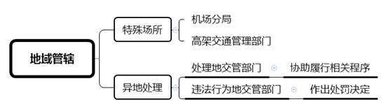
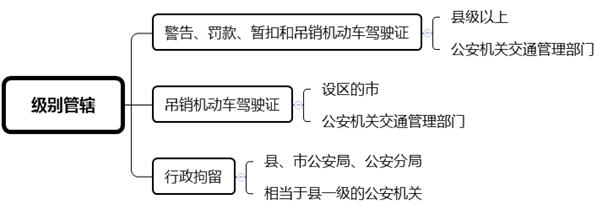
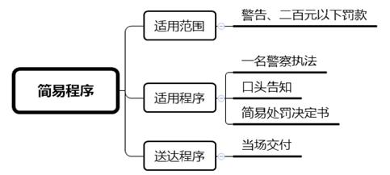
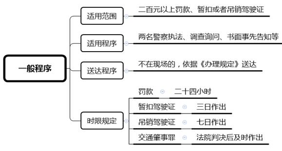
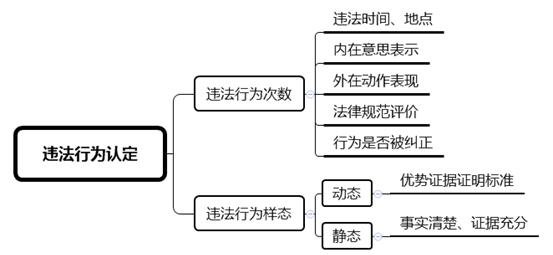
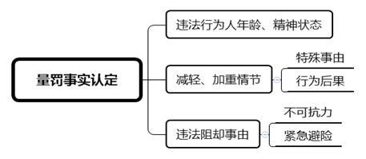
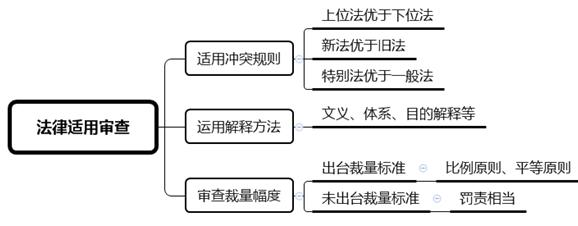

### **道路交通行政处罚案件的审理思路和裁判要点**

道路交通行政处罚，是指公安机关对违反道路交通安全法律法规但尚不构成刑事犯罪的违法行为实施的行政处罚。道路交通行政处罚与人民生活密切相关，亦涉及公共交通秩序及安全的维护。在审理此类案件时，法院应正确平衡执法公正与执法效率的关系，监督行政机关依法行政，维护行政相对人的合法权益。本文以典型案例为基础，对道路交通行政处罚案件的审理思路和裁判要点进行梳理、提炼和归纳。

一、典型案例

**案例一：涉及告知事项的程序审查**

陈某驾驶机动车与另一辆机动车发生碰撞，造成两车车损及乘客轻伤，公安机关交通管理部门认定陈某发生事故后逃逸，对其作出罚款2000元的行政处罚。陈某认为公安机关交通管理部门作出行政处罚前未向其告知举行听证的权利，程序违法，故诉至法院请求撤销行政处罚决定。

**案例二：涉及行为次数的事实认定**

周某驾驶摩托车驶入设置有摩托车禁行标志的主路，随后违法驶入应急车道。公安机关交通管理部门以周某分别实施两个违法行为、违反两个交通法规为由，分别作出罚款200元、100元的行政处罚决定。周某认为其行为具有不可分割性，属同一行为，公安机关交通管理部门的两个罚款处罚违反“一事不再罚”原则，故诉至法院请求撤销后一个行政处罚决定。

**案例三：涉及法律条款的理解适用**

张某因涉嫌酒后驾驶摩托车被交警查获。经查，张某构成醉酒驾驶机动车，且其准驾车型为B2，无摩托车驾驶证。公安机关交通管理部门作出吊销张某B2机动车驾驶证的行政处罚。张某以不能因醉酒驾驶摩托车而吊销其B2机动车驾驶证为由，诉至法院请求撤销行政处罚决定。

**案例四：涉及处罚裁量的合理审查**

何某驾驶机动车与另一辆机动车碰撞造成车辆损坏，无人员伤亡。交警接报后至现场处理，发现何某车辆未撤离现场，遂在作出交通事故责任认定后以何某未及时撤离现场妨碍交通为由，对其作出罚款500元的行政处罚。何某以旁边系公交专用道，无法及时将车辆撤离到安全位置、处罚金额不合理为由诉至法院请求撤销行政处罚决定。

二、道路交通行政处罚案件的审理难点

道路交通行政处罚案件中，行政相对人常以未实施违法行为、违法存在特殊事由、行为不具有违法性、行政机关执法程序存在瑕疵等为由进行抗辩，法院如何区分不同情形对执法程序进行审查，如何正确运用证据规则查明事实，如何判断处罚自由裁量是否适当以及如何正确适用法律是该类案件审理中的难点问题。

**（一）程序审查难**

**一是****程序规定繁杂**。对于程序审查，不仅要遵照《行政处罚法》《公安机关办理行政案件程序规定》关于程序的一般性规定，还要遵照《道路交通安全违法行为处理程序规定》的特别程序规定。不仅要区分简易程序和一般程序，还需关注听证、集体讨论等特别程序，且部分条文存在重复、交叉，审查难度较大。

**二是****程序类型多样**。实践中，交通行政处罚方式多样，程序各异。如对于驾驶员在现场、不在现场、利用交通技术监控查处、到现场窗口接受处理、未到窗口接受处理的，均有相应的程序规定，需要区分具体类型进行程序审查。此外，重新修订的《道路交通安全违法行为处理程序规定》已于2020年5月1日正式实施。其中部分程序规定调整较大，而相关地方性法规、规范性文件的修订尚存在一定滞后，在具体审查过程中容易造成错误和遗漏，增加审查难度。

**（二）违法事实认定难**

**一是行为次数认定难**。根据《行政处罚法》规定，对当事人的同一个违法行为，不得给予两次以上罚款的行政处罚。对违法行为个数的认定系判断是否违反“一事不再罚”原则的前提。因部分交通违法行为具有持续性、连续性、重合性的特征，且部分违法行为人在特定时间段存在多次违法，此类行为是否属于同一违法行为往往成为司法认定中的难点。

**二是行为样态认定难**。交通违法行为具有瞬时性、突发性、临时性的特点，因现场无法重现且取证时间紧迫，执法记录仪常存在记录不够准确，甚至与客观事实出现偏差等情况。部分道路缺乏监控措施、拍摄角度选取不当均会导致视频资料缺失或成像模糊，从而使得监控视频不能清晰、准确地反映机动车类型、号牌、外观等特征以及违法时间、地点等要素。在此情形下，当事人对于违法行为是否存在以及行为状态的描述往往存在较大争议，增加了事实认定的难度。

**（三）处罚裁量把握难**

行政处罚应当做到“罚责相当”，对于符合从轻、从重、免除处罚条件的，应当根据具体情节给予合法、合理的处罚。部分地区已对同类违法行为实施统一处罚标准，但实践中违法的原因及情况各异，当事人往往以其违反交通法规行为系救助危难或紧急情况下做出，应当减免处罚等作为抗辩理由。执法标准统一的情况下，判定当事人所主张的特殊事由是否构成影响量罚情节以及影响程度亦是法院审查的难点。

**（四）法律适用难**

道路交通行政处罚所涉法律、法规及规范性文件较多，易造成理解歧义。此外，道路交通违法行为种类多样，法律、法规列举情形有限，对于新类型违法行为如何适用法律易引发争议。如醉酒驾驶摩托车是否应当吊销其机动车驾驶证、对妨碍安全驾驶行为的条文如何理解和把握等，法律规定不够完全、细致，增加了法律适用难度。

三、道路交通行政处罚案件的审理思路和裁判要点

审理此类案件，**既要结合行政处罚的一般原则，判定行政行为是否符合处罚法定、公正公开、正当程序及比例原则的要求，又要结合交通执法特性平衡执法公正与执法效率的关系，及时纠正违法行政行为，维护行政相对人的合法权益。**同时，对于认定事实清楚、争议不大的案件，**应坚持罚教结合的原则，加强协调化解力度，避免诉累和司法及行政资源的浪费，达到法律效果和社会效果的统一**。对道路交通行政处罚案件的审查应当依据《行政诉讼法》对行政行为的合法性及合理性进行审查，具体审查要素如下：

**（一）交通行政执法职权的审查要点**

作出行政处罚的执法主体是否具有相应的法定职权是首先需要审查的内容。总体而言，应坚持“法无授权不可为”的原则，严格依照法律、法规规定的执法主体、范围对职权进行审查。

**1****、执法主体审查**

**一是在地域管辖方面**，道路交通违法行为原则上由违法行为发生地的公安机关交通管理部门管辖。需要注意以下两点：**第一，特殊场所的行政职权范围**。在部分地区（如上海），对于发生在机场或高架等特殊地点的道路交通违法行为，由专门的机场分局交通管理部门或高架交通管理部门进行处理。在审查时应注意查清交通执法机构的具体组成，厘清执法权限。**第二，异地处理交通违法行为的行政职权范围**。违法行为人在违法行为发生地以外的地方处理交通技术监控设备记录的违法行为的，处理地公安机关交通管理部门可以协助违法行为发生地公安机关交通管理部门调查违法事实、代为送达法律文书、代为履行处罚告知程序，但作出处罚决定的主体仍应当是违法行为发生地公安机关交通管理部门。

**二是在级别管辖方面**，应审查不同行政处罚所对应的行政机关层级是否正确，并根据不同处罚类型分别判定。交通行政处罚的种类包括警告、罚款、暂扣和吊销机动车驾驶证、行政拘留等。对于不同处罚种类，执法主体有所不同。对违法行为人处以警告、罚款或者暂扣机动车驾驶证处罚的，由县级以上公安机关交通管理部门作出处罚决定。处以吊销机动车驾驶证处罚的，由设区的市公安机关交通管理部门作出处罚决定。对违法行为人处以行政拘留处罚的，由县、市公安局、公安分局或者相当于县一级的公安机关作出处罚决定。在诉讼中，应注意审查行政机关是否存在超越法定权限的情形。

**2****、执法范围审查**

公安机关交通管理部门依据《道路交通安全法》进行执法，地域范围原则上限定在“道路”，即“公路、城市道路和虽在单位管辖范围但允许社会机动车通行的地方，包括广场、公共停车场等用于公众通行的场所”。此外，《道路交通安全法》还规定，对于道路以外通行时发生的事故，公安机关交通管理部门接到报案的，参照该法规定办理。因此在部分情形下，公安机关交通管理部门行政执法的地域范围亦可拓展到“道路”以外。

**（二）交通行政执法程序的审查要点**

对于执法程序的审查，应当严格依照法律、法规的规定，根据正当程序原则进行审查。一般包括以下几个方面：

**1****、简易程序的审查**

**一是适用范围**。对道路交通违法行为人予以警告、二百元以下罚款，可以适用简易程序。**二是适用程序**。可以由一名交警作出，口头告知违法行为人违法事实、拟作出的行政处罚、依据及依法享有的权利，听取违法行为人陈述和申辩，制作简易程序处罚决定书。**三是送达程序**。处罚决定书应当当场交付被处罚人，被处罚人拒收的，由交通警察在处罚决定书上注明，即为送达。

**2****、一般程序的审查**

**一是适用范围**。对二百元（不含）以上罚款、暂扣或者吊销机动车驾驶证的，适用一般程序。**二是适用程序**。应当由两名以上交警执法，应当调查询问当事人并制作笔录，采用书面形式或者笔录形式告知当事人拟作出行政处罚的事实、理由及依据，并告知其依法享有的权利。对当事人陈述、申辩进行复核，复核结果应当在笔录中注明。制作行政处罚决定书并由被处罚人签名。对违法行为人单处二百元（不含）以上罚款的，可以通过简化取证方式和审核审批手续等措施快速办理。**三是送达程序**。行政处罚决定书应当当场交付被处罚人；被处罚人拒收的，由交警在处罚决定书上注明，即为送达；被处罚人不在场的，应当依照《公安机关办理行政案件程序规定》送达。**四是时限规定**。对于违法事实清楚，需要按照一般程序处以罚款的，应当自违法行为人接受处理之日起二十四小时内作出处罚决定；暂扣机动车驾驶证的，三日内作出处罚决定；处以吊销机动车驾驶证的，自违法行为人接受处理或者听证程序结束之日起七日内作出处罚决定；交通肇事构成犯罪的，应当在法院判决后及时作出处罚决定。

**3****、听证程序的审查**

对于较大数额罚款、吊销驾驶证的，执法部门在作出行政处罚决定前应当告知当事人有要求举行听证的权利。执法部门不得因当事人要求听证而加重处罚。执法部门应当在听证的七日前通知当事人听证时间、地点。对于听证的具体程序应当结合《行政处罚法》《公安机关办理行政案件程序规定》进行审查。

如案例一中，2000元属于交通行政处罚中较大数额的罚款，对行政相对人权利义务影响较大，行政机关应当在作出处罚前告知行政相对人有要求举行听证的权利。因公安机关交通管理部门作出行政处罚前未向陈某告知有要求举行听证的权利，程序违法，故法院判决撤销被诉处罚决定。

**（三）交通违法事实认定的审查要点**

审查公安机关交通管理部门作出行政处罚决定所认定的事实是否正确，不仅需查明违法行为的次数、样态，还需查明影响量罚的事实情节以及是否存在可以消除记录的特殊事由。具体需依据《行政诉讼法》《道路交通安全违法行为处理程序规定》及《最高人民法院关于行政诉讼证据若干问题的规定》等，结合举证责任、证据效力等进行审查。

**1****、违法事实认定**

**（****1****）处罚对象**

**一是实际违法行为人**，即违反交通安全法规的行人、驾驶员、乘车人以及与道路交通活动有关的单位和个人。**二是车辆所有人、管理人**。公安机关交通管理部门根据交通技术监管记录资料无法确定驾驶人的，可以对违法的机动车所有人或者管理人依法予以处罚。**三是直接主管人员**。运输单位的车辆如有超载或违反规定载货，经处罚不改的，对直接负责的主管人员进行处罚。

**（****2****）违法行为**

**第一，对违法行为次数的认定**。违法行为的次数需结合具体案件综合判定，一般需要考虑以下几个要素：违法时间及地点、违法行为人内在意思表示及外在行为表现、法律规范评价、行为是否被纠正等。例如对于超载、骑车载人等行为，应查明行为人的违法行为是否已纠正：如纠正后再次实施，则属于多次行为；如未纠正，因违法状态具有持续性，仍属同一个行为。对于超速行为，根据公安部门出具的指导意见，同一辆机动车在同一道路、同一行使方向，违反限速规定且处于持续状态，被同一县（市、区）公安机关交通管理部门或者高速公路交警大队辖区的测速取证设备记录多次的，作为一个行为处罚。对于行为动作部分重合的违法行为，应结合行为人的内在意思表示、法律规范评价、行为是否具有可分割性进行综合判断。

如案例二中，周某驾驶摩托车驶入主路应急车道时，其违法驶入主路及应急车道的外在行为动作虽然出现重合，但周某具有两个违法意思表示且具体行为由两个不同的法律规范所规制。违法驶入主路及违法驶入应急车道的行为在事实上相互独立，并非具有不可分割性，应认定为两个行为。法院据此认为公安机关交通管理部门对周某作出的处罚并不违反“一事不再罚”原则，判决驳回周某诉讼请求。

**第二，对违法行为样态的认定**。对于动态式违法行为，首要目的是制止违法以有效控制动态危险源，坚持效率优先、兼顾公平的原则。其中，对适用简易程序的案件，因处罚幅度较低，对当事人权利义务影响相对较小，此时可采取“优势证据”的证明标准。例如上海地区为提高执法规范化水平，要求交警执法过程中佩戴执法记录仪，但实践中存在因时间紧迫未开启执法记录仪、仪器损坏、视频记录被覆盖或清除的情况。根据新《行政处罚法》相关规定，行政机关应当对执法过程进行全过程记录并归档保存，故公安机关交通管理部门一般应当提交执法记录仪记载的视听资料作为证据，不能提供的应当说明理由。如视听资料不能提供存在正当事由并能排除交警与当事人存在利害关系，且没有相反证据对交警陈述事实予以否定的情形下，可以认定交警的陈述具有优势地位，对交警认定的违法事实予以采信。

对于静态式违法行为尤其是适用一般程序的案件，应当遵循公平优先、兼顾效率原则或使两者处于均衡状态。此时应当适用更高的证明标准，需要执法部门提供更为充分的证据，如现场执法记录、执法人员陈述、询问笔录、视听资料等，还需结合不同证据的证明力以及证据之间能否形成证据链条对事实进行综合判定，做到事实清楚、证据充分。

**三是特殊情形**。根据《道路交通安全违法行为处理程序规定》第22条，特殊情形下因行为具有一定合理性和不可非难性，可对违法行为信息予以消除。在审查中，应注意查明是否存在应当消除记录的情形。

**2****、量罚事实认定**

**一是**需查明违法行为人的年龄和精神状态，以确定是否属于《行政处罚法》规定的不予行政处罚或从轻减轻处罚的情形。实践中存在未成年人、精神病人无证驾驶的情形，对于不满十四周岁以及精神病人、智力残疾人在不能辨认或者不能控制自己行为时违法的，不予处罚。

**二是**需查明违法行为的产生是否具有可减轻或加重处罚的特殊情形，需适当考量行为人违法的主观过错及相应后果等因素：**第一**，应当查明是否存在违法的特殊事由，如接送老弱病残孕等弱势群体，避让警车、救护车辆的。**第二**，应当查明违法行为造成的后果，如违法停车是否造成严重交通拥堵或妨碍他人经营、出行等正常活动，变道及闯红灯是否造成严重事故等。

**三是**需查明是否存在不可抗力、紧急避险等违法阻却事由。如在雨雪、大雾等恶劣天气导致路面积水、积雪或遮蔽信号灯及指示线等情形下违法，需判断是否属于不能预见、不能避免且不能克服的客观情况。又如行驶中为避让违反交规的行人、车辆或障碍物，在紧急状态下实施的违法行为，对于此种情况是否构成紧急避险，需要对行为发生的现实危险程度及急迫性、造成的违法及损害后果程度、是否超过必要限度等方面进行严格审查。

**（四）交通处罚法律适用的审查要点**

法院要在查明事实及量罚情节基础上，审查行政机关适用法律是否正确、适当。

**1****、正确适用法规**

因交通行政处罚领域所涉法律、法规及规范性文件较多，在具体审查过程中应注意区分是否存在法条冲突，运用上位法优于下位法、新法优于旧法、特别法优于一般法的规则判断行政机关适用法律是否正确。

**2****、综合运用法律解释方法**

鉴于交通违法行为种类多样，法律无法对所有情形均作出明确规定。对于新型违法行为的法律适用，应综合案情，运用文义解释、体系解释、目的解释等法律解释方法做出合法、合理认定。如在对妨碍安全驾驶条文进行理解时，对于吸烟、浏览导航等行为的认定，需要结合事实情节、日常经验、立法目的等要素进行合理解释，避免任意扩大或限缩解释。再如关于醉驾吊销机动车驾驶证条文的理解，法院在审查法律适用问题上，应结合维护道路交通秩序、预防和减少交通事故、保护人身安全的立法目的进行解释。

如案例三中，因醉驾属严重交通违法行为，吊销机动车驾驶证应当是指吊销违法行为人驾驶机动车的资格，而非仅剥夺持证人违法时驾驶的某一准驾车型的资格。因此法院认定醉驾应当吊销其所有车型的机动车驾驶证，判决驳回张某诉讼请求。

**3****、合理审查自由裁量幅度**

法院除应对行政行为合法性进行审查外，仍应结合查明的量罚情节判定行政行为裁量幅度是否合理。对于已出台具体裁量标准的，应当审查行政机关依据该裁量基准作出行政处罚是否合理。鉴于裁量基准系公安机关交通管理部门行政处罚过程中的自由裁量权，除行政机关适用该裁量基准作出的行政处罚明显违反比例原则、平等原则外，一般情况下法院应对该裁量基准予以参照。

在审查中，若存在特殊事由时，还需考察按照该裁量基准进行处罚是否合理。存在可从轻、减轻或从重情节的，应在法律规定的自由裁量幅度内作出合理处罚，而非直接依据裁量基准进行统一标准处罚。如对于因接送老弱病残孕等弱势群体而违法停车且未造成严重后果的，可作为减轻情节；对于违法停车造成严重交通拥堵且违法行为持续时间过长的，可作为从重处罚情节。公安机关交通管理部门在处罚过程中应适当对前述特殊事由予以考量，如未考量而直接适用裁量基准进行处罚导致明显不合理的，则应判决撤销或变更。如案例四中，被诉处罚决定未结合案件具体情况及后果进行合理裁量，直接顶格进行处罚明显不当且显失公平，故法院判决撤销被诉处罚决定。

对于未出台具体裁量标准的，法院应当结合比例原则、平等原则对行政处罚进行严格审查。如行政机关是否结合从轻、减轻、从重情节作出合理处罚，是否做到罚责相当。在审查中，应注意在决定给予的处罚与处罚目的之间进行衡量，行政处罚不能对当事人给予超出行政目的的侵害。如对违法情节较轻的行为，仅适用警告即可达到行政管理目的，适用大额罚款或拘留则属明显不当，法院应判决撤销或变更。

四、其他需要说明的问题

本文所总结的案件不包括违反道路交通运输法律法规行政处罚案件，亦不包括航空、海事、铁路、轻轨领域发生的交通行政处罚案件。实践中，当事人多对交通违法扣分行为不服提起行政诉讼，因该行为属于行政处罚还是行政管理手段在学界尚有争议，实践中各地法院处理亦有不同，且该行为与《道路交通安全法》所调整的法律行为不属同一性质，故本文对此亦不作论述。

（根据行政庭岳婷婷、刘月提供材料整理）