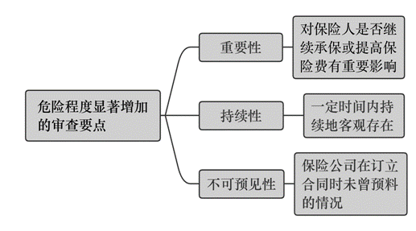
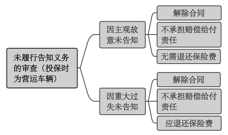

### **涉营运车辆保险责任案件的审理思路和裁判要点**

涉营运车辆保险责任案件，是指投保车辆在发生交通事故后，保险公司与投保人或被保险人因对车辆是否属于营运性质而引发理赔纠纷的诉讼案件。司法实践中，由于营运车辆的商业三者险保险费率与非营运车辆相差较大，部分营运车辆会向保险公司投保非营运险。事故发生后，保险公司通常以营运车辆投保非营运险导致风险增加为由，主张在商业三者险范围内免赔。然而营运车辆投保非营运险的具体情况不尽相同，正确界定各类情况直接关系到保险合同当事人的责任承担。现结合典型案例，对涉营运车辆保险责任案件的审理思路和裁判要点进行梳理、提炼和总结。

**一、典型案例**

**案例一：涉及非营运车辆投保人变更车辆使用性质的认定**

汪某的车辆登记使用性质为非营运，并投保交强险与非营运车辆商业三者险，后挂靠在A公司名下。车辆事故发生在保险期限内。经审查，该车辆在投保后承接货物运输业务，并按月收取运费；汪某变更车辆使用性质并未通知保险公司及办理批改手续。

**案例二：涉及自货自运车辆使用性质的认定**

B公司为货车所有权人，车辆登记使用性质为非营运，并投保交强险与非营运商业三者险。车辆事故发生在保险期限内。交警部门认定B公司承担事故全部责任。保险公司以投保人改变车辆使用性质为由，要求在商业三者险保险范围内免除赔偿责任。经审查，该货车属于非专业运输性质的自货自运车辆。

**案例三：涉及车辆是否达到危险程度显著增加的认定**

王某的货车登记使用性质为非营运，并投保交强险与非营运商业三者险。车辆事故发生在保险期限内。保险公司调查到该车辆使用中存在运货收费的记录，故以车辆使用性质发生转变且导致车辆的危险程度显著增加为由，要求在商业三者险保险范围内免除赔偿责任。

**案例四：涉及投保人是否履行告知义务的认定**

李某为车辆投保交强险与非营运商业三者险时，隐瞒了车辆系营运的使用性质。车辆事故发生在保险期间内。保险公司以李某投保时未履行告知义务、隐瞒车辆实际使用性质增加风险为由，要求在商业三者险保险范围内免除赔偿责任。

**二、涉营运车辆保险责任案件的审理难点**

**（一）车辆使用性质认定难**

营运是指为社会提供劳务、发生各种方式费用结算的营业性运输。投保车辆的使用性质分为营运和非营运。保险公司根据车辆的使用性质将商业三者险分为营运和非营运两类险种，并设定不同的保险费率。车辆的使用性质对投保险种和保险金额具有决定性影响。实践中，涉案车辆的使用情况不尽相同。如案例一中，涉案车辆挂靠于A公司名下，登记信息为非营运车辆，但平时承接运输业务；如案例二中，B公司货车登记信息为非营运车辆，但事发时处于自货自运状态。车辆使用性质的认定直接关系到保险理赔关系中责任主体的确定。法院需根据不同的客观情形确认法律事实，存在一定难度。

**（二）投保车辆危险程度显著增加的审查认定难**

危险程度显著增加，是指作为保险合同基础的保险标的原危险状况发生重大改变，对保险公司产生严重不利影响的情形。依据《保险法》第52条规定，保险标的危险程度显著增加，被保险人应当按照合同约定及时通知保险人，保险人可以按照保险合同约定增加保险费或解除合同。被保险人未履行通知义务的，因保险标的危险程度显著增加而发生的保险事故，保险人不承担赔偿保险金的责任。因此，判断投保车辆危险程度是否显著增加是该类案件的审理要点。实践中，车辆使用情形具有多样性、易变性，对其危险程度显著增加的审查难以形成客观的认定标准。

**（三）投保人如实告知义务的审查难**

投保人如实告知义务，是指订立保险合同时，保险人就保险标的或被保险人的有关情况提出询问的，投保人应当如实告知。实践中，投保人往往会基于各种原因未将投保车辆的使用性质等事实如实告知保险公司。对此，保险公司可行使合同解除权，但存在两种不同后果：一是投保人主观上故意不履行告知义务的，保险合同解除后，保险公司无需退还保险费；二是投保人因重大过失未履行告知义务的，保险合同解除后，保险公司应当退还保险费。鉴于上述两种情形在客观上较难进行判断，审判实践中易产生混淆。此外，投保人未履行如实告知义务的，会引发法院对保险公司解除权合理性的审查。如何平衡保险合同主体之间的权益，亦存在一定难度。

**三、涉营运车辆保险责任案件的审理思路和裁判要点**

在涉营运车辆保险责任案件的审查中，法院既要保障保险消费者利益的实现，又要维护保险市场秩序的稳定，确保司法公正与效率。在审理此类案件时应坚持以下两个原则：

**一是尊重保险合同约定**。保险合同虽然属于格式合同，但区别于一般的格式合同，需要平衡的利益主体不仅包括缔约双方的范畴，还包括社会公共利益。作为责任险，一方面，应着眼于对交通事故中受害方的及时有效保护，充分发挥分散风险和经济补偿的功能；另一方面，保险条款的制订需由保监会审批或备案，是金融监管行为专业化的体现，司法机关不宜过多介入。法院应当在尊重行政监管的基础上审慎判断，以维持市场稳定与金融秩序。

**二是合理保障保险消费者与受害人权益**。在不违反《保险法》相关规定、保险合同约定的前提下，法院在处理保险纠纷时应注重保障保险消费者权益和弥补受害人损失。

涉营运车辆保险责任案件需从以下四个方面进行审查：车辆使用性质是否发生改变、车辆危险程度是否显著增加、投保人是否违反如实告知义务、保险公司合同解除权的行使是否合理合法。

**（一）车辆使用性质的审查要点**

营运车辆会在行驶证中将使用性质标注为“营运”，且应当在主管机关办理《道路运输许可证》并缴纳运营费用，如此方可合法从事以营利为目的的运输经营活动。营运车辆的使用频率高于非营运车辆，发生交通事故的概率也会相应增加。因此，保险公司在与投保人签订车辆商业三者险保险合同时，均会对车辆使用性质的改变作出约定。车辆使用性质的认定，尤其是由非营运到营运的转变，是引发保险公司适用保险合同中免责条款或法定免赔义务条款的关键点。实践中车辆的使用性质不能仅依据车辆登记信息进行判断，还需结合车辆具体的使用方式进行审查。

**1****、挂靠车辆**

根据使用方式不同，营运车辆可分为营运客车和营运货车两种。营运客车是指符合交通运输行业标准，用于经营性旅客运输的汽车；营运货车是指用于货物运输或租赁，并以直接或间接方式收取运费或租金的货运车辆，其中包括客货两用车。需要注意的是，车辆性质登记为非营运，但实际从事收费运输服务的车辆应当认定为营运车辆。

如案例一中，车辆投保时登记的使用性质为非营运，但车辆挂靠在A公司名下。此种情形下需注意挂靠车辆的实际用途。实践中，大多数个人车辆系为获得营运资格而挂靠于公司名下，因此一般应认定其为营运性质，但投保人能够举证证明该车辆系自用的除外。经审查，涉案车辆承接货物运输业务并按月收取运费，应视为从事营业性运输，属于营运车辆。

**2****、****自货自运车辆**

自货自运是指货物的所有者用自己的汽车运输自己的货物。此种情形下，货主兼车主是为自己而非为他人提供道路货运服务，也不会从中收取运费。法院在审查时应注意车辆使用人是否发生计入成本的费用结算，且该行为是否具有持续性。如案例二中，该车辆固定只为所在单位提供货物运输，未曾与第三人发生计入成本的费用结算，因此该车辆的使用性质应认定为非营运。

**3****、网约车与顺风车**

涉网络预约出租汽车即网约车的案件中，车辆使用人在专车运营平台注册账户、接受网约车订单，收取费用且服务对象为不特定人群，符合营运的特征。

需要注意的是，顺风车在性质上与网约车存在本质区别。网约车是根据乘客的出行计划，为其提供个性化出行服务的车辆。网约车提供的营运服务以营利为目的，通过计算里程、时长收取费用。根据交通运输部对顺风车性质的认定，顺风车则是以驾驶员自身出行需求为前提，事先发布出行信息，由出行线路相同的拟合乘人员选择合乘的车辆。驾驶员的顺风车行为必须不以营利为目的，仅与搭乘人员分摊出行成本或免费相助。因此，实践中符合上述定义的顺风车不应视为营运车辆。此外，对于以顺风车为名、实际以营利为目的从事运输活动的车辆，仍应认定为营运车辆。如涉嫌非法营运，则应由有权机关依据相关法律法规，对该行为作出处理。

**（二）危险程度显著增加的审查要点**

涉营运车辆保险责任案件中，保险公司可基于车辆使用性质发生改变，且被保险人未通知保险公司的行为违反保险合同约定而进行抗辩主张免赔。同时，保险公司也可依据《保险法》第52条即保险标的危险程度显著增加来主张免赔。对此，法院在审查过程中应当结合实际情况，从重要性、持续性和不可预见性三个方面进行综合考量，认定保险车辆是否存在危险程度显著增加的情节。

**1****、对重要性的审查**

重要性是指对保险人决定是否继续承保或者提高保险费存在重要影响的危险，即达到“显著”的程度。我国《保险法》未对“显著”的理解作出明确规定。根据我国台湾地区保险法的相关规定，危险增加至“达于应增加保险费或终止合同之程度”即为显著。换言之，如果危险增加的事实在签订合同时即已存在，保险公司不会以现在的保险费率承保，抑或继续履行原合同将会对保险公司产生不公平的结果，即构成危险程度显著增加。实践中，由于保险公司具有较高的保险专业性，并且保险市场内的竞争性、保险监管均促使保险条款具有较高的合理性，法院可根据保险合同是否对此作出明确规定进行判断。因此，对于案件存在保险合同中明确约定的危险程度显著增加情形的，法院可直接认定危险程度显著增加，这也是尊重保险合同约定原则的体现。

**2****、对持续性的审查**

持续性是指增加的危险在一定时间内持续地客观存在。车辆在投保非营运险后，原车辆承受的风险程度因车辆使用状态的变化而出现增加，且该新状态继续不变地持续一段时间，则应认定危险程度显著增加。对于危险程度增加时间短暂且随即恢复原状的，则不应认定为危险程度显著增加。

需要指出的是，即使危险程度增加后立刻引起保险事故的，亦不应认定为危险程度显著增加。持续性是相对于瞬间性而言，即危险程度显著增加后，在极短的时间内导致保险事故发生，并不涉及危险增加后的通知义务。因此，危险程度的变化不能简单地通过车辆使用性质的改变次数来量化，不能片面地理解为超过某个使用次数就认为增加的危险持续存在。

如案例三中，涉案车辆为货车，从事货物运输属正常使用范畴。该车辆在使用中偶有运送他人货物并收取费用的行为，但并不当然会造成危险程度显著增加，保险公司也未对保险标的危险程度显著增加提供证据证明。因此，对保险公司依据《保险法》第52条主张保险标的危险程度显著增加未及时通知要求免赔的主张，法院不予支持。此外，被保险人将车辆借与他人日常出行使用的，则不应视为车辆性质发生实质性改变，不构成危险程度显著增加。

**3****、对不可预见性的审查**

不可预见性是指发生在保险期间的危险程度增加，是保险公司在订立合同时未曾估计或预料的情况。保险合同订立之初，保险公司依据保险标的危险发生率等因素确定保险费。保险费与危险程度相对应，危险程度越高则保险费越高。

如案例一中，汪某车辆在投保后挂靠在A公司名下，承接货物运输业务。这种车辆使用性质的改变行为具有强烈的主动性、目的性，危险发生率亦随之增大，且已超出保险公司在订立合同时的可预见范围。此时，危险程度的增加也已超出保险费的承受范围。如让保险公司以低保险费承担高风险，则显然违反对价平衡原则。

此外，《保险法司法解释（四）》第4条，对危险程度显著增加的判断标准进一步明确，包括投保车辆用途的改变、投保车辆使用范围的改变、危险程度增加持续的时间、投保车辆所处环境的变化、投保车辆因改装等原因引起的变化、投保车辆使用人或管理人的改变等。实践中，法院可依据该规定结合上述三方面审查进行综合判断。

**（三）投保人如实告知义务的审查要点**

保险公司在接受投保人保险申请时，需对承保的保险标的状况作出正确评估。依据《保险法》第16条第1款规定，保险人就保险标的或者被保险人的有关情况提出询问的，投保人应当如实告知。因此，如果投保人未尽到如实告知义务甚至隐瞒保险标的实际情况的，保险公司则无法正确评估保险标的的真实危险程度并确定相应保险费。保险合同订立后，投保人未如实告知的，保险公司所要承担的风险责任可能远超预估，从而导致保险合同权利义务不对等，违背诚实信用原则。

实践中，对于车辆投保人是否违反如实告知义务，应从两个方面进行审查：**一是**车辆投保人主观上是否存在故意或重大过失；**二是**客观上投保人未如实告知的事实是否属于重要事实，且足以影响保险公司决定是否承保或提高保险费。

**1****、投保人故意不告知的审查要点**

投保人明知被保险人或者保险标的有关情况，但不告知保险人或者隐瞒事实的，属于故意不履行如实告知义务。实践中主要审查以下三个要点：（1）明知该事实；（2）明知该事实为重要事项；（3）有意不告知。如案例四中，涉案车辆在投保前用于营运，投保人为减少保险费的缴纳故意隐瞒车辆使用性质。依据《保险法》第16条第2、4款规定，投保人故意不履行如实告知义务的，保险公司有权解除合同，同时对于合同解除前发生的保险事故，不承担赔偿或者给付保险金的责任且不退还保险费。

**2****、投保人因重大过失未告知的审查要点**

投保人因重大过失未履行告知义务，是指投保人对于保险车辆的有关情况应当知道，因其未注意或者疏忽大意，以致未告知保险人的行为。该行为存在三种情形：**一是**义务人因重大过失不知道重要事实的存在而未如实告知；**二是**义务人虽知道该事实存在，但因重大过失不知道该事实的重要性而未如实告知；**三是**义务人知道事实存在且知道该事实的重要性，但因重大过失而未如实告知。在上述情形下，投保人未如实告知的重要事实与保险事故存在因果关系且产生重大影响，保险公司主张对该事故不承担赔偿或给付保险金责任的，法院应予支持，但应判令保险公司退还保险费。

需要注意的是，实践中保险公司工作人员可能存在一些不规范的操作方式，如代替车辆投保人填写风险询问表等，导致车辆投保人对相关询问内容的注意程度大大降低。此种情形下，虽然风险询问表的填写内容与实际状况并不一致，且投保人对车辆的实际使用性质是明知的，但车辆投保人属于因重大过失未履行如实告知义务，而不属于故意不告知。

**3****、足以影响保险人承保风险的审查要点**

车辆投保人未如实告知导致保险合同解除等不利后果的事实，应该是对保险公司承保责任有决定性影响的重要事实。如非重要事实，投保人即使故意没有告知，也不应视为投保人违反如实告知义务。对于该重要事实的审查应注意以下几个要点：**一是**审查未告知事实与保险事故发生之间是否具有因果关系。如该事实与保险事故之间具有直接的因果关系，则可认定为重要事实。**二是**审查车辆在投保时的风险程度。如车辆在投保非营运险时已经处于营运状态，则该事实可以认定为重要事实。

需要注意的是，此类案件中如实告知义务人仅限于投保人。投保人的如实告知义务以保险公司询问为前提；告知范围限于保险公司询问的内容。法院可以根据投保单上的列表内容进行审查。

**（四）保险公司行使合同解除权的审查要点**

**1****、保险公司行使合同解除权的条件**

投保人因故意或重大过失未能履行如实告知义务，且足以影响保险公司决定是否同意承保或者提高保险费的，保险公司有权自知道有解除事由之日起三十日内提出解除合同。

**2****、保险合同解除权行使阻却事由的审查**

为避免保险公司滥用合同解除权，造成保险公司和投保人之间的利益失衡，法院在审理中对保险合同解除权行使的阻却事由审查，应注意把握以下要点：

**（****1****）不可抗辩条款的适用**

保险公司主张行使合同解除权的，法院在对投保人是否履行如实告知义务进行审查后，需注意保险公司解除权的行使是否符合不可抗辩条款。依据《保险法》第16条第3款规定，保险公司的解除权被限制在自其知道解除事由起三十日内；超过三十日不行使的，解除权消灭。同时，自合同成立之日起超过二年的，保险公司不得解除合同，即使投保人存在故意或重大过失未如实告知的，只要发生保险事故，保险人就应当承担赔偿或给付保险金的责任。

**（****2****）弃权制度的适用**

弃权制度是指权利人知道自己的某种权利，但以明示或默示的方式向相对人作出其放弃权利的意思表示。《保险法》第16条第6款规定，保险人在合同订立时已经知道投保人未如实告知情况的，保险人不得解除合同；发生保险事故的，保险人应当承担赔偿或者给付保险金的责任。此外，《保险法司法解释（二）》第7条规定，保险人在保险合同成立后知道或者应当知道投保人未履行如实告知义务仍收取保险费，又依照《保险法》第16条第2款规定主张解除合同的，法院不予支持。

上述条款是弃权制度在保险法中的具体体现。弃权制度是对最大诚信原则的具体化，同时有利于公平保护保险合同当事人的利益。如投保人在保险合同的订立和履行过程中，改变车辆使用性质将非营运车辆变为营运车辆，导致投保车辆的危险程度在客观上显著增加，保险公司在知晓该情形后未行使合同解除权，而是要求将投保车辆的险种由非营运险变更为营运险并增加保险费，投保人也已按照要求支付保险费。此时保险公司和投保人的行为应视为双方合意对保险合同加以变更。保险公司已通过增加保险费、变更险种等行为明确表示放弃行使合同解除权。此时，若保险公司又以投保人未如实告知为由主张合同解除的，法院应不予支持。

（根据民事庭任明艳、徐林祥宇提供材料整理）