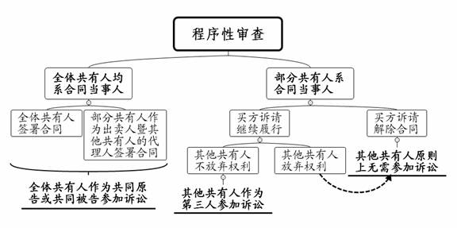

### **共有房屋买卖合同纠纷案件的审理思路和裁判要点**

共有房屋买卖合同纠纷，是指部分共有人以全体共有人名义或以自己名义与买受人就共有房屋签订买卖合同后，合同当事人或其他共有人对合同效力及履行提出异议而引发的纠纷。共有房屋买卖既涉及共有人之间的内部关系，又涉及外部买卖双方的合同关系。该类纠纷的处理应当注意平衡保护静态的物权归属与动态的交易安全，维护诚实信用原则，避免违约方因违约行为而获益。现结合典型案例，对共有房屋买卖合同纠纷案件的审理思路和裁判要点进行梳理、提炼和总结。

**一、典型案例**

**案例一：涉及是否追加当事人的审查**

石某为房屋A的登记产权人，与薛某签订房屋买卖合同，约定将房屋A售予薛某。后石某反悔拒不履约。薛某起诉请求判令继续履行合同。一审法院判决支持薛某的诉讼请求。石某不服提起上诉，诉称房屋A系其与案外人刘某的夫妻共同财产，一审未追加刘某为当事人参加诉讼属于严重违反法定程序。

**案例二：涉及房屋买卖合同是否有效的审查**

张某为房屋B的登记产权人，与孙某系夫妻关系。张某因无力归还胡某借款而将房屋B售予胡某。房屋买卖合同除约定房屋坐落、转让价款、过户时间外，其余主要条款均未约定。后房屋B变更登记至胡某名下，但胡某未实际支付购房款。张某向胡某出具署名为孙某的承诺书对张某出售房屋B的行为予以追认。后孙某起诉胡某、张某，以二人签订房屋买卖合同构成通谋虚伪意思表示，且承诺书上孙某签名系伪造、张某构成无权处分为由，请求确认房屋买卖合同无效。

**案例三：涉及房屋买卖合同是否继续履行的审查**

李甲为房屋C的登记产权人，与丁某系夫妻关系。李乙系二人之子。在李乙参与磋商的情况下，李甲与周某签订房屋买卖合同，约定将房屋C售予周某。在约定过户日前李甲死亡，丁某、李乙与周某就房屋C的转让价格重新磋商但未能达成一致。周某遂起诉丁某、李乙，要求二人继续履行房屋买卖合同。丁某则主张房屋C系夫妻共同财产，李甲构成无权处分，房屋买卖合同应予解除。

**案例四：涉及其他共有人是否承担合同责任的审查**

郭某为房屋D的登记产权人，与林某系夫妻关系。郭某与徐某签订房屋买卖合同，约定将房屋D售予徐某。后因房价上涨，郭某拒绝履行合同。徐某遂起诉郭某、林某，请求判令二人继续履行合同，办理过户及交房手续，并支付违约金。

**二、共有房屋买卖合同纠纷案件的审理难点**

**（一）共有人的诉讼地位认定难**

审判实践中，部分共有人出售房屋产生的纠纷，其他共有人存在不参加诉讼、作为被告参加诉讼和作为第三人参加诉讼三种情形。其他共有人参加诉讼的形式又存在原告起诉时已将其列为当事人、诉讼中法院依当事人申请或依职权追加其参加诉讼等情形。实践中，其他共有人的诉讼地位认定规则亟待明确。

**（二）房屋买卖合同效力认定难**

有效的民事法律行为要求意思表示真实，且无其他法定无效情形。当其他共有人以部分共有人构成无权代理或无权处分、与买受人通谋虚伪意思表示、与买受人恶意串通损害其权利为由，主张房屋买卖合同无效时，如何准确认定合同效力较难把握。

**（三）部分共有人是否构成有权处分认定难**

部分共有人以自己名义与买受人签订房屋买卖合同的，法院需审查该共有人的处分行为是否获得其他共有人的授权。由于处分行为的授权发生在共有人内部，买受人往往难以提供证据证明部分共有人构成有权处分。因此，法院通过审查哪些事实形成心证，从而推定部分共有人构成有权处分，是审理此类案件的难点。

**（四）责任承担主体认定难**

部分共有人以自己名义签订房屋买卖合同的，相关过户及交房义务、违约责任的承担主体如何认定？其他共有人应承担何种责任？如部分共有人以全体共有人名义签订房屋买卖合同，上述各项责任的承担主体又如何认定？审判实践中责任承担主体的认定存在较大争议。

**三、共有房屋买卖合同纠纷案件的审理思路和裁判要点**

**在共有房屋买卖合同纠纷案件中，法院需结合证据并运用逻辑推理和经验法则，探究当事人在合同订立时及合同履行中的真实意思，从而在保护共有人对共有房屋享有物权权利的同时，维护交易秩序，保障交易安全**。审理此类案件时，法院首先需明确案件当事人的诉讼地位，其次需对合同效力作出认定。合同无效的，一般应对双方返还因合同履行而取得的财产、损失赔偿等无效后果一并予以处理；合同有效的，基于物债区分原则，还应审查是否存在无权处分等履行障碍；合同解除的，应正确认定守约方的实际损失，合理调整违约金，并注意对其他解除后果一并予以处理。

**（一）程序性事项的审查**

共有房屋买卖合同纠纷案件可能涉及共有人的内部代理和共有物处分，法院需根据个案中的不同情形准确认定当事人的诉讼地位。

**1****、共有人均系合同当事人**

共有人均系合同当事人的情形包括：**一是**全体共有人作为出卖人在房屋买卖合同中签字；**二是**部分共有人作为出卖人暨其他共有人的代理人在房屋买卖合同中签字。上述两种情形中，全体共有人均系合同当事人，应当作为共同原告或共同被告参加诉讼。

审判实践中，部分共有人构成代理的情形主要包括：**一是**合同明确载明部分共有人代理全体共有人签订合同；**二是**部分共有人签订合同的同时出具承诺函，承诺其他共有人授权其代为签字；**三是**合同首部载明出卖人为全体共有人，但落款处仅部分共有人签字。

**2****、部分共有人系合同当事人**

部分共有人以自己名义签订房屋买卖合同，买受人诉请解除合同的，案件处理结果一般与其他共有人无关，故其他共有人原则上无需参加诉讼。买受人诉请继续履行合同的，涉及房屋的物权变动，案件处理结果与其他共有人直接相关，故其他共有人应当作为第三人参加诉讼。需要注意的是，房屋登记在夫妻一方名下但可能为夫妻共同财产的，法院应当听取配偶方的意见。如配偶方确认房屋为登记产权人的个人财产，或明确表示放弃对该房屋所享有权利的，则其无需作为第三人参加诉讼。

如案例一中，薛某诉请继续履行合同，虽然房屋A的登记产权人为石某一人，但法院应当主动审查房屋A是否为夫妻共同财产。二审法院查明房屋A确系石某与刘某婚姻关系存续期间购买并登记于石某名下，遂以一审判决遗漏诉讼当事人为由，裁定撤销一审判决，发回重审。

**（二）当事人主张合同无效的审理思路和裁判要点**

**1****、合同效力的审查**

共有房屋买卖合同纠纷案件中，当事人常以出卖人无权代理、无权处分、合同双方通谋虚伪意思表示或存在恶意串通损害其他共有人权利等为由，要求确认房屋买卖合同无效。

**（****1****）对当事人主张无权代理的审查**

部分共有人以全体共有人名义签订房屋买卖合同的，法院应当审查部分共有人是否构成有权代理或表见代理。需要注意的是，《民法典》第1060条第1款规定，夫妻一方因家庭日常生活需要而实施的民事法律行为，对夫妻双方发生效力，但是夫妻一方与相对人另有约定的除外。一般情况下，房屋作为家庭重大财产，处分房屋不属于因家庭日常生活需要而实施的民事法律行为，因此不适用家事代理。

部分共有人无权代理且不构成表见代理的，如其他共有人对代理行为予以追认则合同有效，全体共有人承担合同项下权利义务。如其他共有人对代理行为不予追认，因欠缺效果归属要件，代理效果不归属于其他共有人；又因部分共有人作出代理行为时未产生效果归属于自己的意思，代理效果亦不归属于该部分共有人。

需要注意的是，根据《民法典》第171条规定，部分共有人无权代理签订房屋买卖合同的，合同对其他共有人不发生效力；实施无权代理行为的部分共有人承担履行债务或赔偿损失的责任。鉴于房屋为特定物，且其他共有人不同意追认部分共有人的代理行为，通常也不会同意处分共有房屋。如买受人要求部分共有人履行债务，因存在履行不能的情况，法院需向其释明是否变更诉请为要求部分共有人赔偿损失。如买受人明知或应当知道部分共有人为无权代理，则双方按照各自过错承担责任。

对于部分共有人是否构成有权代理，在买受人无法提供授权委托书等直接证据的情况下，法院可综合以下几个方面进行审查：**一是**共有人之间是否存在特殊身份关系；**二是**其他共有人是否参与房屋出售过程，包括挂牌、与中介及买受人接洽谈判等；**三是**房屋是否由共有人共同居住，其他共有人与买受人在看房时有无接触；**四是**其他共有人是否收取过定金或房款；**五是**部分共有人签订合同时，是否持有其他共有人的个人证件；**六是**其他共有人是否作出过追认合同的意思表示，或者在明知合同已经签订、买受人支付部分房款并实际占有使用房屋的情况下，是否在合理期限内提出异议等。结合上述事实，如可认定其他共有人事先授权或事后追认部分共有人代签房屋买卖合同，则部分共有人构成有权代理。

对于部分共有人是否构成表见代理，法院需严格把握。如部分共有人持其他共有人出具的授权委托公证书，与买受人签订房屋买卖合同。后公证机构查明该授权委托并非其他共有人的真实意思表示，或授权委托公证书存在其他应予撤销的情形，而对授权委托公证书予以撤销的，因买受人基于对授权委托公证书的合理信赖而签订合同，故可认定部分共有人构成表见代理。其他共有人以订立合同的部分共有人构成无权代理为由请求确认房屋买卖合同无效的，法院一般不予支持。

**（****2****）对当事人主张无权处分的审查**

当事人订立房屋买卖合同的行为属于典型的债权行为。依据《民法典》第597条第1款规定，因出卖人未取得处分权致使标的物所有权不能转移的，买受人可以解除合同并请求出卖人承担违约责任。由此可见，债权行为有效不以负担义务者享有处分权为必要。根据《最高人民法院关于审理买卖合同纠纷案件适用法律问题的解释》第3条第1款规定，部分共有人以自己名义与买受人就共有房屋签订房屋买卖合同，其他共有人以该共有人无权处分为由，主张房屋买卖合同无效的，法院不予支持。《民法典》实施后，法院可直接适用第597条第1款规定进行裁判。

**（****3****）对当事人主张合同双方通谋虚伪意思表示的审查**

当事人主张合同双方通谋虚伪意思表示往往存在于部分共有人与买受人为担保买受人债权而签订房屋买卖合同的情形。《民法典》第146条第1款规定，行为人与相对人以虚假意思表示实施的民事法律行为无效。买卖双方为担保债权而签订房屋买卖合同，其真实意思均为以债务人名下房屋为债权实现提供担保，而非债权人购买债务人名下房屋。因此，为担保债权而签订的房屋买卖合同因构成通谋虚伪意思表示而无效。

对于合同双方是否构成通谋虚伪意思表示，法院一般可从以下几个方面进行审查：**一是**当事人之间是否存在民间借贷等债权债务关系；**二是**合同签订的背景及磋商过程；**三是**合同约定及履行是否符合交易惯例。对与交易惯例不符的情况，当事人能否作出合理解释；**四是**房款是否实际支付、以何种方式支付；**五是**房屋实际居住使用情况；**六是**当事人是否及时主张房屋买卖合同项下权利。

如案例二中，张某与胡某之间存在民间借贷关系，且房屋买卖合同的约定及双方履行行为等均不符合交易惯例，如房屋转让价格明显过低，胡某未实际支付房款，以及胡某拒绝提供承诺函原件以便对孙某签名的真伪进行鉴定等。结合上述事实，法院可认定张某与胡某签订房屋买卖合同实为胡某债权提供担保，该合同因构成通谋虚伪意思表示而无效。

**（****4****）对当事人主张合同双方恶意串通的审查**

《民法典》第154条规定，行为人与相对人恶意串通，损害他人合法权益的民事行为无效。部分共有人以房屋买卖合同双方恶意串通、损害其合法权益为由主张合同无效的，法院可从以下几个方面进行审查：**一是**共有人之间关系是否和睦，如是否存在夫妻感情不睦、已长期分居、一方已提起离婚诉讼等情形；**二是**买受人是否通过中介居间而获知房源；**三是**合同双方是否存在特殊关系；**四是**合同约定是否符合交易惯例，如房价是否明显低于市场价值等；**五是**合同履行是否存在瑕疵，如房款是否实际支付等。

**2****、合同无效后果的处理**

房屋买卖合同无效的，法院应避免机械适用“不告不理”原则，仅就当事人的诉请进行审理，而是应当向双方释明合同无效的相关后果，尽可能一次性解决纠纷。此外，需要注意以下三种特殊情形：

**（****1****）买受人取得产权后在房屋上设立抵押权**

此种情形下，法院可通知抵押权人作为本案第三人参加诉讼。抵押权人善意取得抵押权的，原则上可判令债务人向债权人清偿债务后涤除抵押，将房屋恢复登记至出卖人名下。如债务人无清偿能力，根据《民法典》第524条规定，债务人不履行债务，第三人对履行该债务具有合法利益的，第三人有权向债权人代为履行。因此，法院可向共有人释明，共有人愿意代为清偿债务以涤除抵押的，法院可判令共有人代债务人向债权人清偿债务；涤除抵押后将房屋恢复登记至出卖人名下，同时判令债务人向共有人支付代其清偿的债务金额。

**（****2****）买受人取得产权后房屋被司法查封**

房屋在司法查封状态下不能恢复登记至出卖人名下。如作出该司法查封裁定的案件类型仅为金钱类债权债务纠纷，法院可向共有人释明是否愿意向买受人的债权人清偿债务或提供担保，以解除查封便于恢复产权登记。法院仅需根据司法查封是否解除的具体情况，作出确认合同无效或是一并处理房屋恢复登记等合同无效后果的判决。

**（****3****）买受人未向出卖人实际支付房款**

如买受人并未实际支付房款，或已支付房款但出卖人随即通过取现、转账等方式将房款全部返还或支付给买受人指定的案外人处，则案件一般不存在房款返还的问题。如买受人向出卖人的代理人或指定的案外人支付房款，则视为出卖人实际收取房款，待合同认定无效后，出卖人负有返还义务。如出卖人与买受人之间存在其他债权债务关系，法院应另行处理。

**（三）对当事人主张继续履行合同的审查**

对于合同有效买受人主张继续履行的，法院应当审查合同是否存在履行障碍。共有房屋买卖合同纠纷案件中，关于合同能否继续履行的争议焦点，主要集中在出卖人是有权处分还是无权处分。当然，共有房屋买卖合同还可能存在其他履行障碍，如在出卖人“一房数卖”情形下本案买受人合同履行顺位在后；买受人属于限购对象；系争房屋上存在另案司法查封等。鉴于本文着重分析与房屋共有性质的相关问题，故对其他履行障碍的情况不予详述。

**1****、出卖人是否构成无权处分**

部分共有人以自己名义签订房屋买卖合同的，合同不因此而无效，但合同能否继续履行即共有房屋的所有权能否转移，需考察其他共有人的意思表示。如其他共有人未事先授权亦未事后追认部分共有人出售房屋，则部分共有人构成无权处分，合同无法继续履行。如其他共有人事先授权或事后追认部分共有人出售房屋，则部分共有人构成有权处分，合同可以继续履行。

需要注意的是，实践中部分出卖人因房价上涨而反悔，遂以自己构成无权处分为由拒绝履行合同。对此，法院应查明其他共有人是否知晓并同意出售房屋。因该节事实与部分共有人是否构成有权代理，实际均需审查其他共有人就房屋出售事宜的真实意思，故该节事实的审查可参照是否构成有权代理的审查要点。出卖人或其他共有人主张出卖人构成无权处分的，应当具体陈述或解释出卖人擅自处分共有房屋的理由。如共有人之间关系恶化、出卖人恶意转移财产等，并提供相应证据予以佐证。法院应当运用逻辑推理和经验法则，对当事人陈述及其他证据有无证明力及证明力大小进行判断，从而最终形成心证。

如案例三中，丁某与李甲并无夫妻不睦情形，李甲过世后丁某、李乙与周某曾就提高房屋转让价款进行磋商，结合二人之子李乙始终参与磋商的事实，丁某主张对李甲与周某签订房屋买卖合同事宜完全不知情有违常理。再结合丁某并未提交任何证据证明其在诉讼前曾向周某主张李甲构成无权处分。因此，法院可认定丁某授权李甲处分房屋C，房屋买卖合同可以继续履行。

**2****、责任承担主体的认定**

当部分共有人构成有权处分、合同应继续履行时，基于物债区分原则，买受人的诉请实则涉及不同性质的法律行为——买卖双方基于合同的负担行为，以及部分共有人的处分行为与其他共有人的授权处分行为。**首先**，基于合同相对性，买受人有权要求出卖人承担合同责任，除要求出卖人继续履行合同外，还可要求出卖人承担支付违约金或赔偿损失等其他违约责任。**其次**，买受人有权要求其他共有人协助转移买卖房屋所有权。需要注意的是，其他共有人并非房屋买卖合同的当事人，除非其他共有人的意思表示构成债务加入，否则不承担房屋买卖合同项下的责任。

如案例四中，如经审理查明郭某构成有权处分，法院可作如下判决：（1）房屋买卖合同继续履行；（2）郭某将房屋D过户至徐某名下（明确税费负担），并向徐某交付房屋D；（3）徐某向郭某支付剩余购房款；（4）郭某向徐某支付逾期过户及逾期交房违约金；（5）林某协助办理房屋D的过户手续。

**（四）合同解除责任的认定与解除后果的处理**

**1****、****合同解除责任****的审理思路**

出卖人无权处分致使房屋买卖合同无法继续履行的，买受人可以行使合同解除权，并基于合同相对性要求出卖人承担违约责任。需要注意的是，买受人是否清楚房屋的权属状况与出卖人因构成无权处分而应承担的违约责任无关。买受人疏于审查的，仅负担合同不能继续履行、无法转移房屋产权的风险。

**2****、合同解除后的恢复原状**

房屋买卖合同属于即时性合同，合同解除具有溯及力。合同解除后出卖人自始不享有收取房款的权利，买受人自始不享有占有使用房屋的权利。因此，出卖人应当向买受人返还房款及占有房款获得的利益，买受人应当向出卖人返还房屋及占有房屋获得的利益。依据《九民会纪要》第34条规定，可将该两笔占有费用相互抵销，即出卖人仅需返还房款本金，买受人仅需返还房屋。当然，如房屋尚未实际交付，则出卖人应当向买受人返还房款及相关占有利益。

**3****、房屋差价损失的认定**

房屋差价损失属于买受人的可得利益损失。原则上应以合同解除时间或买受人知道或应当知道房屋买卖合同无法继续履行的时间作为房屋差价的计算节点。对于房屋差价的确定方式，双方当事人可以协商确定；无法达成一致的，可以通过司法鉴定的方式予以确定；双方争议不大或明确同意的，亦可通过询价方式确定。

对于房屋差价损失，法院应综合运用可预见规则、损益相抵规则、减损规则、过失相抵规则予以确定。具体应注意以下几点：（1）损失的可预见性应理解为订立合同时对损失类型的预见，而非损失大小的预见。（2）适用损益相抵规则的同时应考虑不能使出卖人因违约行为而得益。（3）合同履行程度通常仅与买受人的积极损失认定有关，而与买受人可得利益损失认定无关。

**4****、违约金调整的审理思路和裁判要点**

出卖人主张违约金过高的，应当承担证明责任，且应当在一审法庭辩论终结前提出；二审期间提出的，法院原则上不予支持。出卖人提供初步证据后，买受人坚持认为违约金合理的，应当对其实际损失作出说明并提供相应证据。具体而言，出卖人主张违约金过分高于实际损失的，应根据具体违约行为证明相应损失的大致金额；主张损益相抵的，应证明买受人因出卖人的违约行为而获益；主张过错相抵的，应证明买受人存在过错。如出卖人没有陈述具体理由并提供相应证据材料的，法院可不予调整。

出卖人陈述具体理由并提供证据材料后，买受人同意调低违约金的，应陈述调整幅度的理由和依据，如其主张大致合理不构成明显利益失衡，则法院不再继续调整。买受人不同意调低的，需针对出卖人的调整幅度、理由及证据材料进行答辩；买受人能够举证证明出卖人的理由全部或部分不成立的，对违约金不予调整或对出卖人主张的幅度予以扣减。因出卖人恶意违约而买受人不同意调整违约金的，法院在认定违约金时应注意违约金的失信惩戒功能。

**四、其他****需要说明的问题**

本文主要对共有房屋买卖合同纠纷中的相关问题进行梳理，其中也涉及部分房屋买卖合同纠纷中的共性问题。对于房屋买卖合同纠纷中涉及的“借名买房”“以房抵债”等问题不在本文讨论范围之内。

（根据民事庭金绍奇、朱晨阳提供材料整理）