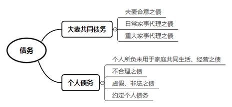
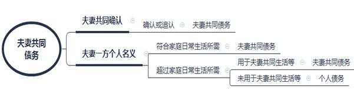

### **夫妻共同债务类案件的审理思路和裁判要点**

夫妻共同债务，是指夫妻双方合意举债或者其中一方为家庭日常生活需要所负的债务。一方超出家庭日常生活需要所负债务且未用于夫妻共同生活、生产经营的，不属于夫妻共同债务。夫妻债务在内的夫妻财产问题是《民法典》婚姻家庭编中的重要内容。夫妻共同债务的认定，不仅与夫妻双方的财产权利息息相关，也影响到债权人利益和交易安全。审理该类案件需严格依照夫妻共同债务的认定标准，合理分配举证责任，平衡保护各方当事人的合法权益。为提高该类案件的审理质量与效率，现以典型案件为基础，对审理思路和裁判要点进行归纳和总结。

**一、典型案例**

**案例一：涉及债务真实性的认定**

张某与高某原系夫妻。张某父母通过银行转账给张某75万元用于其婚内购买房产，转账汇款单的附言注明“支付购房款”，该房产登记在张某、高某名下。后高某诉张某离婚并要求将该房产作为夫妻共同财产予以分割。张某提供其与父母签订的借条一份，以证明借款75万元属于夫妻共同债务。高某抗辩称借条形成于张某父母得知双方离婚诉讼后，当事人之间并不存在真实的借贷关系。

**案例二：涉及债务是否用于共同生产经营的认定**

李某与周某原系夫妻。A公司成立于夫妻关系存续期间。李某系法定代表人并担任执行董事职务，工商登记的财务负责人及联络人均为周某。婚姻存续期间，李某以企业经营需要资金周转为由向王某借款300万元，约定由A公司承担连带担保责任。借款到期后，王某向法院起诉要求李某、周某、A公司承担还款责任。周某抗辩称其系A公司普通员工，他人在A公司注册成立过程中利用周某身份信息进行工商登记，该债务非夫妻共同债务。

**案例三：涉及如何分配举证责任**

邵某与钟某原系夫妻。邵某向吕某借款15万元用于支付父亲重病医疗费用，吕某诉至法院要求邵某、钟某共同归还借款及逾期利息。吕某认为，借款发生在邵某、钟某夫妻关系存续期间，邵某称其父亲身患重病需要大额医疗费，故应由邵某、钟某举证证明借款为个人债务，否则应认定为夫妻共同债务。钟某则认为，邵某父亲未患重病，其医疗费用在家庭收入可负担的合理范围内，该借款应认定为邵某的个人债务。

**案例四：涉及婚姻不安宁期间夫妻一方举债性质认定**

石某与盛某原系夫妻。石某在与盛某婚姻存续期间与他人育有一子。石某、盛某夫妻关系存续期间，金某向石某出借大额资金。金某认为，借款发生在夫妻关系存续期间且投入石某经营的公司，应为夫妻共同债务。盛某认为，石某出具借条时已因夫妻关系恶化与盛某分居多年，且石某已在外非婚生子，借条所载钱款未用于夫妻共同生活。

**二、夫妻共同债务类案件的审理难点**

**（一）家庭日常生活、夫妻共同生活、共同生产经营界定难**

家庭日常生活水准界定难表现在：经济发展不平衡、城乡差异、家庭成员财产状况和消费模式不同，导致难以确定统一的家庭日常生活具体标准。

夫妻共同生活范畴界定难表现在：家庭消费模式和生活结构的升级变化，使得夫妻共同生活支出不再局限于传统的消费开支。

共同生产经营标准界定难表现在：《民法典》及相关司法解释中提出的“夫妻共同生产经营”，与《公司法》《合伙企业法》等法律及司法解释规定的“共同经营”含义不尽相同。判断生产经营活动是否属于夫妻共同生产经营的标准在司法实践中并不统一。

**（二）证据获取审查难**

**第一**，从《民法典》第1064条的规定来看，确定债务的用途是判断和认定债务性质的关键。该类案件所涉标的通常为货币，债权人、债务人对借贷发生后货币在家庭内部的使用目的和使用轨迹均很难举证证明。**第二**，证明夫妻感情是否破裂（如是否处于分居、矛盾激化、婚姻危机状态）对于甄别夫妻间是否存在规避债务、债务是否用于夫妻共同生活具有重要意义。然而，证明夫妻感情优劣对于夫妻一方或债权人均非易事。**第三**，司法实践中存在夫妻双方具有举债合意但未共同签名确认的情形。一旦未签名举债配偶否认，法院往往很难认定夫妻双方存在举债合意。

**（三）父母家庭对核心家庭出资性质认定难**

实践中，在核心家庭遭遇婚姻危机时，对核心家庭有过出资贡献的父母或其子女往往凭借据等（或为补签）要求法院认定借贷关系成立，进而主张夫妻共同债务。各地法院对此种情形的判决结果并不统一：某些法院认为在当前高房价背景下，父母在其子女购房时给予资助属于常态，但不能将此视为理所当然，认为除父母明确表示赠与外，应当视为以帮助为目的的临时性资金出借，子女应负有偿还义务；另有法院认为父母于子女婚后为核心家庭购置房屋出资的，应当认定为对夫妻双方的赠与。

**三、夫妻共同债务类案件的审理思路和裁判要点**

审理夫妻共同债务类案件应遵循以下原则：**第一，平等保护原则**。既不能让夫妻一方承担不应该承担的债务，也要防范夫妻双方串通损害债权人利益，要通过举证责任的合理分配平衡保护各方当事人利益。**第二，一般性和特殊性相结合原则**。各地经济发展不平衡，不同家庭成员构成也存在较大差异。法院要根据当地一般社会生活习惯和夫妻共同生活状态（如借款名义，夫妻社会地位、职业、资产、收入等）作出正确认定和恰当裁判。**第三，配套适用原则**。《民法典》并未就夫妻共同债务做出全面系统的规定，审理中应当将《民法典》相关规定与其他法律和司法解释的有关规定配套适用。

**（一）夫妻共同债务案件的前置审查步骤**

法院应首先审查债务关系是否成立，再对债务人及其配偶是否应当承担共同清偿责任进行审查。债务关系不能狭义理解为借贷关系，还应包括其他合同之债、担保之债、侵权之债等。

**第一**，就民间借贷关系引发的此类纠纷，法院应着重审查是否有借贷意思、资金往来、借条等确定债务的真实性和款项用途，亲属间借款应尤其注意。如案例一中，如无确实证据证明借款的事实或子女家庭存在共同举债的合意，父母于子女婚后为核心家庭购置房屋出资的，应当依据相关法律规定认定为父母对夫妻双方的赠与。

**第二**，由于侵权行为有其特定的人身属性，侵权行为之债一般不符合夫妻共同债务的特征，但在从事家庭经营等活动时侵权、夫妻双方共同侵权或依照法律规定夫妻双方需要承担连带赔偿责任的除外。

**第三**，担保之债作为债务的一种，同样适用于法律关于夫妻共同债务的审查认定标准。当夫妻一方对外担保之债与夫妻共同生活或共同生产经营密切相关，对外担保产生的利益用于夫妻共同生活或共同生产经营时，该担保之债宜认定为夫妻共同债务。

**（二）认定为夫妻共同债务的情形及审查要点**

**1****、夫妻就债务达成合意**

夫妻双方共同签名、夫妻一方事后追认或者有其他共同意思表示共负债务的，应认定为夫妻共同债务。配偶双方的合意，既可以明示也可以默示。明示包括夫妻双方共签借据或一方以短信、微信等方式表示合意；非举债配偶以其名下财产为借款设立抵押，借款后曾归还借款等追认行为。默示包括做出能推断出共同负债的行为，如借款汇入配偶名下实际控制账户等。非举债配偶事后知情但未做出追认的不能认为就债务达成夫妻共负债务的合意。夫妻双方共同举债时均应具有民事行为能力。

**2****、夫妻一方负债用于家庭日常生活**

夫妻一方在婚姻关系存续期间以个人名义为家庭日常生活需要所负债务，属于夫妻共同债务。“家庭日常生活需要”是指夫妻双方及其共同生活的未成年子女在日常生活中的必要开支，包括正常的衣食住行消费、日用品购买、医疗保健、子女教育、老人赡养，以及正当的娱乐、文化消费等，其金额和目的应符合“日常性”和“合理性”。

不同家庭的合理日常家事代理额度存在较大差异，在认定债务是否“为家庭日常生活需要所负”时要注意以下几点：一是法院要根据负债金额大小，当地经济水平，借款名义，夫妻社会地位、职业、资产、收入等因素，综合认定债务是否超出合理日常家事代理额度，并在判决书中载明判断、推理的过程；二是大额债务虽于婚后长时间内形成，但每次金额较小且债务确用于家庭日常生活开销的，应认定为夫妻共同债务。

**3****、债权人能够证明属于夫妻共同债务**

相对于家庭日常生活需要所负的债务，对于夫妻一方以个人名义对外所负债务且明显超出家庭日常生活范畴时，债权人需证明该债务用于夫妻共同生活、共同生产经营或者基于夫妻双方共同的意思表示。

**（****1****）“夫妻共同生活”的审查要点**

“夫妻共同生活”范围大于“家庭日常生活”。夫妻共同生活支出是指夫妻双方共同消费支配、形成夫妻共同财产或者基于夫妻共同利益管理共同财产产生的支出。下列情形可认定为债务用于“夫妻共同生活”：一是购买住房和车辆、装修、休闲旅行、投资等金额较大的支出；二是夫妻一方因参加教育培训、接受重大医疗服务所支付的费用；三是夫妻一方为抚养未成年子女所支付的出国、私立教育、医疗、资助子女结婚等，以及为履行赡养义务所支付的费用。非举债配偶可以说明以上大宗支出资金来源的除外。

审理案件时，法院应注意以下几点：一是婚前举债但用于婚后夫妻共同生活的，仍可依其用途属性认定为夫妻共同债务；二是对于大额借贷中存在部分用于夫妻共同生活、部分用于个人消费的情形，法院应在查明事实后按照实际用途分别作出处理，未有证据证明用途部分的债务为个人债务。

**（****2****）“夫妻共同生产经营”的审查要点**

夫妻共同生产经营审查包括三个要素：债务款项专用性（债务专用于生产经营）、夫妻经营共同性、经营利润共享性。其中，夫妻经营共同性是指生产经营活动系夫妻双方基于共同意志协力经营，实践中表现为夫妻共同决策、共同投资、分工合作、共同经营管理。夫妻经营共同性以合意参与为核心要素，在共同经营要素的认定上应适当放宽标准。经营利润共享性是指无论生产经营活动是否产生盈利结果，经营收益一贯为家庭主要收入或用于夫妻共同生活。有明确证据可以确定债务款项专用性和夫妻经营共同性时，则对经营利润共享性可无需再作审查；当夫妻经营共同性难以认定时，可以依据债务款项专用性、经营利润共享性判定该债务属于夫妻共同债务。

如案例二中，财务、人事、后勤等属于公司治理的重要职能部门。周某在A公司担任会计及财务负责人，足以证明周某在A公司参与共同经营，所涉债务应认定为夫妻共同债务。

**（三）认定为个人债务的情形及审查要点**

**1****、一方以个人名义所负超出家庭日常生活需要的债务**

夫妻一方在婚姻关系存续期间以个人名义所负超出家庭日常生活需要的债务，不属于夫妻共同债务。债权人能够证明该债务用于夫妻共同生活、共同生产经营或者基于夫妻双方共同意思表示的除外。

**2****、与夫妻共同生活明显无关的不合理开支**

债务系用于夫妻一方且与夫妻共同生活明显无关的不合理开支，均不具有家庭使用属性，应界定为个人债务。例如无偿担保，夫妻一方为前婚所生子女购买房产、车辆，挥霍消费（如购买与自身消费能力极不匹配的奢侈品、负债打赏网络主播等），违反婚姻忠诚义务（如包养情人、抚养私生子等），危害家庭利益等行为所产生的债务，均不应认定为夫妻共同债务。

**3****、虚假债务及非法债务不属于夫妻共同债务**

为家庭利益所负债务应当具有正当性和合法性。夫妻一方为在离婚时侵吞共同财产而虚构的共同债务不属于夫妻共同债务。夫妻一方因盗窃、抢劫、赌博、非法集资等违法犯罪行为所生债务，即使为家庭利益也不构成夫妻共同债务。

如有虚构债务行为的，法院可以根据情节轻重予以罚款、拘留；构成犯罪的依法追究刑事责任。同时，一方有伪造夫妻共同债务等严重损害夫妻共同财产利益行为的，另一方可以要求婚内分割共同财产。

**4****、另有约定的认定为个人债务**

如果债务人与债权人之间明确约定为个人债务，或夫妻之间约定为分别财产制且债权人知情的，也应当直接认定为个人债务。

**（四）举证规则：根据不同情况合理分配举证责任**

**1****、证明夫妻合意的举证责任在债权人**

当事人对于自己提出的主张有责任提供证据，债权人应提供证据证明夫妻具有共同举债的意思表示。夫妻双方共同签字的借款合同、借据，以及夫妻一方事后追认或者电话、微信等体现共同举债意思表示的有关证据，都是债权人用以证明债务系夫妻共同债务的有力证据。

**2****、日常家庭生活范围内的债务由债权人举证债权存在，债务人举证反驳**

夫妻一方为家庭日常生活所负债务，原则上应当推定为夫妻共同债务，债权人只需举证证明债务关系存在、债务符合当地一般认为的家庭日常生活范围即可，不需要债权人举证证明该债务实际用于家庭日常生活。非举债配偶可以提供家庭收入情况、收入水平，证明借款数额明显超过家庭日常生活必要消费或该债务未用于家庭日常生活进行反驳。

如案例三中，因涉案债务金额不大，应推定为夫妻一方为家庭日常生活所负债务，故债权人吕某证明债务关系存在即已完成其举证责任，此时应由非举债配偶钟某举证反驳。钟某举证证实借条记载的借款用途与邵某父亲患病的实际医疗费用存在明显出入；吕某称与邵某为多年朋友和同事，却有违常理地在邵某用于家人就医借款时约定24%的高额利息；邵某、吕某均系小额贷款公司工作人员，两人经常存在金钱往来；钟某与邵某婚姻关系存续时间短暂、婚后双方未生育子女、未购买大额产品、钟某有稳定的工资收入和存款，故系争借款并非用于家庭日常生活所需。法院综合以上证据以及邵某拒不出庭等情况，认定邵某的借款用于家庭生活存疑，邵某、钟某夫妻关系存续期间没有举债的需要，进而得出系争借款属于邵某个人债务的结论。

**3****、超出日常家庭生活所需的债务由债权人证明债务用于夫妻共同生活或者共同生产经营**

当夫妻一方以个人名义负担的债务超出家庭日常生活所需，债权人应证明债务用于夫妻共同生活或者共同生产经营，进而证明债务系夫妻共同债务。考虑到债权人对于夫妻家庭生活用款举证难度较大，可以对其举证责任予以适当缓和。法院可对债权人和债务人是否具有亲友关系，双方交往是否亲密，对债务人家庭是否熟稔等加以审查。

债权人举证达到证明标准后，债务人对债权人主张不予认可仍坚持其抗辩意见的，债务人应当承担进一步举证责任，以证明借款并非用于夫妻共同生活或共同生产经营。

**（五）涉夫妻债务案件中几种特殊情形的审查**

**1****、债务产生于婚姻不安宁阶段的考量**

夫妻债务类纠纷应充分考虑夫妻分居、提起离婚诉讼后产生债务的情形。非举债配偶主张债务发生期间其与举债方配偶感情严重不合，应提供居委会证明、租房协议、家庭支出单据等相关证据。如确有证据证明夫妻状态处于婚姻不安宁阶段，且非举债配偶有固定工作和稳定收入，无需负债且未分享举债利益、经营投资所得的，则应认定为举债一方个人债务。相反，如果查明夫妻因避债而分居或分居后借款仍用于共同生活的，则该债务应当认定为夫妻共同债务。

如案例四中，石某在婚姻存续期间与他人同居多年并生育子女，石某与盛某因矛盾激化确处于婚姻危机中，故难以认定石某将涉案借款用于夫妻共同生活，应当认定该债务为石某个人债务。

**2****、父母家庭对核心家庭出资性质的认定**

法院判断出资转账性质应注意审查债权人和债务人之间是否存在借贷的真实意思。考虑到借贷双方的血缘关系，双方对借条的形成具备便利条件，不能仅凭借条简单认定借贷关系存在，而应对债权人提出更高的证明要求。如无确实证据证明借款的事实或核心家庭存在共同举债的合意，父母于子女婚后为核心家庭购置房屋出资的，应根据产权登记情况认定为对夫妻双方的赠与或是对一方的赠与。需要指出的是，在认定对夫妻双方赠与的情形下，在离婚分割夫妻共同财产时应当考虑父母出资的情况，在房屋分割比例上做出适当倾斜。

**3****、采取更严格的判断标准认定债务性质的情形**

下列情形一般应认定为个人债务，如认定为夫妻共同债务则应采取更严格的证明标准：一是出借人明知借款人负债累累、信用不佳，或在前债未还情况下仍继续出借款项的。二是对连续发生的多笔不合常理的债务，债权人、债务人对此陈述不清或者陈述前后矛盾的。

四、其他需要说明的问题

本文仅确定夫妻债务性质的认定规则，不涉及案件中产生的夫妻共同债务承担比例、一方偿还后的追偿问题以及执行个人债务程序中如何析出个人财产等问题。

（根据少年庭郭海云、胡天和提供材料整理）