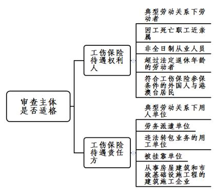
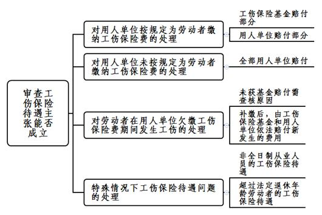

### **工伤保险待遇纠纷案件的审理思路和裁判要点**

工伤保险待遇纠纷是指工伤当事人之间因工伤保险责任的分担和工伤保险权利义务的实现所引发的争议。工伤保险待遇纠纷案件涉及的主体宽泛、规定庞杂、争议较多，导致此类案件的审理相对复杂。现结合典型案例对此类案件的审理思路和裁判要点进行梳理、提炼和总结。

**一、典型案例**

**案例一：涉及工伤保险待遇责任主体的确定**

钱某与A公司签订劳动合同，被A公司劳务派遣至B公司担任操作工。钱某在B公司工作时受伤，后被认定为工伤、因工致残程度十级。钱某辞职后申请仲裁，要求A公司和B公司共同支付其一次性伤残就业补助金和停工留薪期工资差额。

**案例二：涉及工伤保险待遇项目支付义务的承担**

侯某与C公司签订劳动合同，在工作时被压伤食指，并被认定为工伤、因工致残程度十级。后侯某被C公司以严重违纪为由解除劳动合同。侯某遂申请仲裁，要求恢复与C公司的劳动关系。后生效判决认定C公司为合法解除，对侯某请求不予支持。侯某再次申请仲裁，要求C公司赔付其一次性伤残就业补助金。

**案例三：涉及与第三人侵权责任的竞合**

胡某系D公司员工，在上班途中发生交通事故，第三人为主要责任人。胡某被认定为工伤、因工致残程度十级，且在与第三人交通事故责任纠纷案件中已获赔残疾赔偿金。胡某在职期间D公司未为其缴纳工伤保险费。胡某辞职后申请仲裁，要求D公司赔付其包括一次性伤残补助金、一次性工伤医疗补助金、一次性伤残就业补助金在内的工伤保险待遇。

**二、工伤保险待遇纠纷案件的审理难点**

**（一）工伤保险待遇主体宽泛易疏漏**

工伤保险制度作为社会保险制度的重要组成部分，实践中工伤保险待遇主体较为多样化。一方面，我国从业人员种类多样，除典型劳动关系下的劳动者外，还有非全日制从业人员、非正规就业劳动组织从业人员、超过法定退休年龄的劳动者、在中国境内就业的外国人等。这些从业人员符合一定条件时，均可享受工伤保险待遇；另一方面，我国用工模式较为复杂，除典型劳动关系外，还有诸如劳务派遣、挂靠、指派、借调、违法转包等多种形态，工伤事故发生时需明确工伤责任承担方。由于涉及工伤保险待遇主体范围的规定较为分散，实践中易产生疏漏。

**（二）工伤保险待遇项目繁杂难把握**

工伤保险待遇适格主体确定后，因工伤保险待遇赔付主体、赔付项目及赔付标准的确定涉及受工伤劳动者的切身利益，法院需着重审查。根据用人单位有无按规定参加工伤保险、有无存在漏缴又补缴等不同情形，工伤保险待遇赔付主体亦有区别。实践中，由于工伤保险待遇项目繁多，相关规定分散在不同层级的法律规范中，工伤保险待遇赔付项目及赔付标准的审查较难把握。

**（三）与第三人侵权责任竞合处理存争议**

出于对劳动者权益的特殊保护，工伤认定的范围已作适当扩张，在第三人侵权导致工伤事故时易引发工伤保险赔偿与第三人侵权损害赔偿竞合。该两种诉讼请求权基础和归责原则不尽相同。实践中对于劳动者因第三人侵权造成人身损害并构成工伤的情形，具体赔偿项目如何认定、重复赔偿项目能否兼得、重复赔偿项目赔偿标准如何确定等存在争议。

**三、工伤保险待遇纠纷案件的审理思路和裁判要点**

**对于工伤保险待遇纠纷案件，法院应注意充分保障受工伤劳动者的合法权益，分散用人单位工伤风险，保障企业正常经营发展，促进工伤预防和职业康复，维护社会和谐稳定**。审理此类案件时，法院应首先审查主体是否适格，其次审查是否经过工伤认定程序，最后审查工伤保险待遇具体赔付主体、赔付项目、赔付标准的主张能否成立。此外，当遇到双方当事人就工伤保险待遇私下签订一次性赔偿协议、工伤保险赔偿与第三人侵权损害赔偿竞合等特殊情形时，法院也要注意把握相应的审查原则。

**（一）审查主体是否适格**

工伤保险待遇适格主体包括工伤保险待遇权利人和工伤保险待遇责任方。

**1****、工伤保险待遇权利人**

**（****1****）典型劳动关系下的劳动者**

我国境内的企业、社会团体、民办非企业单位等组织的职工和个体工商户的雇工，均依法享受工伤保险待遇。

**（****2****）因工死亡职工的近亲属**

如职工因工死亡，其近亲属可享受相应的工伤保险待遇。

**（****3****）非全日制从业人员**

非全日制从业人员因工作遭受事故伤害或患职业病后，可享受相应的工伤保险待遇。

**（****4****）超过法定退休年龄的劳动者**

劳动者达到法定退休年龄但未办理按月领取基本养老保险待遇手续或不符合按月领取基本养老保险待遇条件，且继续在原用人单位工作期间发生事故伤害的，可享受相应的工伤保险待遇。用人单位为其招用的超过法定退休年龄的劳动者已缴纳工伤保险费，该劳动者在用工期间因工作原因受到事故伤害或患职业病的，亦可享受相应的工伤保险待遇。

**（****5****）符合工伤保险参保条件的外国人与港澳台居民**

在中国境内就业并符合参加工伤保险条件的外国人，以及在内地就业且参加工伤保险的港澳台居民，均依法享受工伤保险待遇。

**2****、工伤保险待遇责任方**

**（****1****）典型劳动关系下的用人单位**

典型劳动关系下的劳动者发生工伤时，用人单位为工伤保险待遇责任方。劳动者存在多重劳动关系的，工伤事故发生时劳动者所在用人单位为工伤保险待遇责任方。劳动者被用人单位指派到其他单位工作的，指派单位为工伤保险待遇责任方。用人单位分立、合并、转让的，承继单位为工伤保险待遇责任方。

**（****2****）劳务派遣单位**

劳务派遣单位派遣的劳动者在用工单位工作期间因工伤亡的，劳务派遣单位为工伤保险待遇责任方。劳务派遣单位可与用工单位约定补偿办法，但双方约定不得对抗被派遣劳动者。如案例一中，钱某在劳务派遣期间发生工伤，工伤保险待遇责任方应为劳务派遣单位，因此应由A公司支付钱某的工伤保险待遇。

**（****3****）违法转包业务的用工单位**

用工单位违反法律法规规定将承包业务转包给不具备用工主体资格的组织或自然人，该组织或自然人聘用的劳动者从事承包业务时因工伤亡的，用工单位为工伤保险待遇责任方。

**（****4****）被挂靠单位**

个人挂靠其他单位对外经营，其聘用的人员因工伤亡的，被挂靠单位为工伤保险待遇责任方。

**（****5****）从事房屋建筑和市政基础设施工程的建筑施工企业**

未按项目参保的本市建设工程从业人员发生工伤的，由其所在的用人单位赔付工伤保险待遇，施工总承包企业、建设单位承担连带责任。

**（二）审查是否经过工伤认定程序**

工伤保险待遇一般需经工伤认定程序。对于当事人已提交工伤认定决定书等证据证明所涉伤害已经过工伤认定程序的，可直接进入下一审查步骤。

对未经工伤认定程序直接起诉的当事人，法院告知当事人应及时按规定申报工伤认定。

**（三）审查工伤保险待遇主张能否成立**

在确定工伤保险待遇的适格主体以及是否经过工伤认定程序后，法院需对工伤保险待遇各项主张进行审查。根据用人单位有无按规定为劳动者缴纳工伤保险费、是否存在漏缴又补缴等不同情形，工伤保险待遇赔付主体、赔付项目、赔付标准等均存在差别。

**1****、对用人单位按规定为劳动者缴纳工伤保险费的处理**

用人单位按规定为劳动者缴纳工伤保险费的，根据劳动者所处阶段的不同，本市工伤保险待遇的赔付主体及赔付项目如下：

| 所处阶段     | 主体项目 | 工伤保险基金                                                 | 用人单位                       |
| ------------ | -------- | ------------------------------------------------------------ | ------------------------------ |
| 停工留薪期内 |          | 医疗费、住院伙食补助费、外省市交通食宿费、康复费、辅助器具费 | 停工留薪期工资、护理待遇（费） |
| 评           | 七至十级 | 一次性伤残补助金、一次性工伤医疗补助金                       | 一次性伤残就业补助金           |
| 残           | 五至六级 | 一次性伤残补助金、一次性工伤医疗补助金                       | 伤残津贴一次性伤残就业补助金   |
| 后           | 一至四级 | 一次性伤残补助金、伤残津贴                                   |                                |
| 工亡         |          | 丧葬补助金、供养亲属抚恤金、一次性工亡补助金                 |                                |

备注：

①生活护理费：工伤职工已经评定伤残等级并经劳动能力鉴定委员会确认需要生活护理的，从工伤保险基金按月支付生活护理费，支付标准按照生活完全不能自理、生活大部分不能自理或者生活部分不能自理分为3个等级，具体按照本市公布的同期生活护理费标准执行。

②伤残津贴：1-4级伤残津贴不低于本市公布的同期伤残津贴最低标准。

③劳动能力鉴定费：初次鉴定费用由工伤保险基金支付；再次鉴定或者复查鉴定的结论无变化的，鉴定费用由申请方承担；鉴定结论有变化以及需要定期复查鉴定的，鉴定费用由工伤保险基金承担。

实践中，易引发争议的具体工伤保险待遇的审查要点如下：

**（****1****）医疗费**

对符合工伤保险诊疗项目目录、工伤保险药品目录、工伤保险住院服务标准的，医疗费从工伤保险基金支付；对目录以外的非必要、非合理医疗费，由劳动者自行承担。对于用人单位在工伤事故发生后超过三十天不满一年提出工伤认定申请的，医疗费的工伤保险基金支付标准以社保部门核定为准。因用人单位导致医疗费不能或仅能部分获工伤保险基金理赔的，不能获赔部分费用由用人单位承担。

**（****2****）停工留薪期工资**

停工留薪期是劳动者工伤或患职业病需要暂停工作接受治疗的期间。关于停工留薪期工资，一般以与劳动者原工资福利相符的正常出勤月工资收入或工伤事故发生前十二个月平均工资收入加以确定，并不得低于本市同期最低月工资标准。关于停工留薪期的截止期限，原则上应为就医记录或病情证明单中记载的医疗期或休息期结束之日。如劳动者自愿放弃病假单或病情证明单中记载的休息时间回到用人单位正常工作的，可以劳动者回到用人单位正常工作之日作为停工留薪期的截止日；如伤残等级鉴定结论作出之日早于就医记录或病情证明单中记载的医疗期或休息期结束之日的，则应以伤残等级鉴定结论作出之日作为停工留薪期的截止日。

停工留薪期一般不超过十二个月，伤情严重或情况特殊且经鉴定委员会确认的，可以适当延长，但延长不得超过十二个月。如劳动者经过二十四个月的停工留薪期后仍需继续治疗、无法提供正常劳动的，用人单位应按病假工资标准发放劳动者病假待遇。

**（****3****）一次性工伤医疗补助金、一次性伤残就业补助金**

因工致残五至六级的工伤人员本人提出与用人单位解除或终止劳动关系的，以及因工致残七至十级的工伤人员本人提出与用人单位解除劳动关系或劳动合同期满终止的，由工伤保险基金支付一次性工伤医疗补助金、用人单位支付一次性伤残就业补助金。如解除劳动关系时距劳动者法定退休年龄不足五年的，不足年限每减少一年，全额一次性工伤医疗补助金和一次性伤残就业补助金递减20%，但属于法定的劳动者可单方解除劳动合同的情形除外。

对于用人单位单方解除或双方协商解除劳动关系，用人单位应否支付一次性伤残就业补助金的问题。一次性伤残就业补助金是对劳动者因工受伤致劳动就业能力减弱而由用人单位给予劳动者的一种经济补偿，与劳动关系解除的原因并无直接关联。同时，不以劳动关系解除的原因为标准判定劳动者应否享有一次性伤残就业补助金，更符合公平合理原则。因此，对于用人单位单方解除或双方协商解除劳动关系的，用人单位仍需支付一次性伤残就业补助金。如案例二中，在C公司单方合法解除侯某劳动关系的情形下，C公司仍有义务赔付侯某一次性伤残就业补助金。

**2****、对用人单位未按规定为劳动者缴纳工伤保险费的处理**

在用人单位应当参加工伤保险而未参加或未按规定缴纳工伤保险费期间，从业人员发生工伤的，由用人单位按照法定的工伤保险待遇项目和标准赔付费用。用人单位不赔付的，从工伤保险基金中先行赔付；从工伤保险基金中先行赔付的费用，应当由用人单位偿还；用人单位不偿还的，由社保经办机构依法追偿。

**3****、对劳动者在用人单位欠缴工伤保险费期间发生工伤的处理**

用人单位参加工伤保险并补缴应当缴纳的工伤保险费、滞纳金后，由工伤保险基金和用人单位依法赔付新发生的费用。如劳动者在用人单位欠缴工伤保险费期间发生工伤的，对用人单位补缴后仍未获工伤保险基金理赔的部分，法院需审查不予理赔的原因。如因缺少材料不能理赔的，法院应指定期限要求当事人互相配合及时补足材料，办理工伤保险待遇申领手续，并告知相应法律后果；如仍不符合工伤保险基金赔付条件的，则判定用人单位承担相应工伤保险待遇赔付责任。

**4****、特殊情况下工伤保险待遇问题的处理**

**（****1****）非全日制从业人员的工伤保险待遇**

非全日制从业人员可享受的工伤保险待遇为：由工伤保险基金支付的工伤保险待遇；用人单位支付的停工留薪期待遇（不低于本市职工月最低工资标准）；致残五至十级情形下，由用人单位支付一次性伤残就业补助金；致残一至四级伤残情形下，用人单位和工伤人员一次性缴纳基本医疗保险费至工伤人员达到法定退休年龄后，享受基本医疗保险待遇。

**（****2****）超过法定退休年龄劳动者的工伤保险待遇**

超过法定退休年龄继续在用人单位工作的劳动者经工伤认定后，可依照《工伤保险条例》《上海市工伤保险实施办法》规定的条件和标准享受工伤保险待遇。用人单位已为超过法定退休年龄的劳动者缴纳工伤保险费的，依照《工伤保险条例》《上海市工伤保险实施办法》由工伤保险基金承担的部分，仍由工伤保险基金承担；超过法定退休年龄的劳动者不能参加工伤保险或用人单位可缴却未缴纳工伤保险费的，该劳动者经工伤认定后的相关工伤保险待遇由用人单位承担。

**（四）当事人就工伤保险待遇达成一次性赔偿协议的审查原则**

工伤事故发生后，双方当事人就工伤保险待遇私下达成一次性赔偿协议的情况时有发生。由于劳动者与用人单位在缔约地位上不平等，以及劳动者为尽快得到赔偿而放弃一部分权益的情形客观存在，实践中对于此类协议的效力存在争议。目前，工伤保险待遇纠纷案件中对于双方当事人已达成一次性赔偿协议的审查原则如下：

**第一**，在已出具劳动能力鉴定结论的情形下，工伤保险待遇权利人与责任方签订的、不存在法定无效情形的一次性赔偿协议对双方均有约束力。

**第二**，如上述协议的签订确实存在欺诈、胁迫、重大误解、显失公平情形的，受损害方有权请求仲裁机构或法院予以撤销。

**第三**，一次性赔偿协议被撤销的，由工伤保险待遇责任方根据法定工伤保险待遇标准支付工伤保险待遇差额。

**（五）工伤保险赔偿与第三人侵权损害赔偿竞合的审查原则**

劳动者因第三人的原因受到工伤事故伤害，易引发工伤保险赔偿与第三人侵权损害赔偿竞合。此类案件的审查原则如下：

**第一**，劳动者获得第三人侵权损害赔偿后仍有权请求工伤保险赔偿。工伤保险赔偿适用无过错责任原则，具有公法性质；而第三人侵权损害赔偿适用民法的填平原则、过错责任原则和过失相抵原则，具有私法性质。因此劳动者的人身权受到第三人侵害，同时又被劳动行政部门认定为工伤的，如劳动者分别提起侵权损害赔偿之诉和工伤保险赔偿之诉，对于侵权损害赔偿的请求和不服工伤保险赔偿仲裁裁决提出的请求，法院应分别作出判决。劳动者获得第三人侵权损害赔偿的，不影响其工伤保险赔偿请求权的行使。

**第二**，重复赔偿项目应按照“就高原则”确定赔偿标准。在本市审判实践中，工伤保险赔偿和第三人侵权损害赔偿中存在重复赔偿的项目包括：

<table><tbody><tr><td>
<b>工伤保险赔偿项目</b><b><o:p></o:p></b>
</td><td>
<b>第三人侵权损害赔偿项目</b><b><o:p></o:p></b>
</td></tr><tr><td>
停工留薪期工资<o:p></o:p>
</td><td>
误工费<o:p></o:p>
</td></tr><tr><td>
医疗费<o:p></o:p>
</td><td>
医疗费<o:p></o:p>
</td></tr><tr><td>
护理费（停工留薪期内）<o:p></o:p>

生活护理费<o:p></o:p>
</td><td>
护理费<o:p></o:p>
</td></tr><tr><td>
住院伙食补助费<o:p></o:p>
</td><td>
住院伙食补助费<o:p></o:p>
</td></tr><tr><td>
外省市交通食宿费<o:p></o:p>
</td><td>
交通费、外省市就医住宿费、伙食费<o:p></o:p>
</td></tr><tr><td>
康复费<o:p></o:p>
</td><td>
康复费、整容费<o:p></o:p>

其他后续治疗费<o:p></o:p>
</td></tr><tr><td>
辅助器具费<o:p></o:p>
</td><td>
残疾辅助器具费<o:p></o:p>
</td></tr><tr><td>
供养亲属抚恤金<o:p></o:p>
</td><td>
被抚养人生活费<o:p></o:p>
</td></tr><tr><td>
丧葬补助金<o:p></o:p>
</td><td>
丧葬费<o:p></o:p>
</td></tr></tbody></table>

如劳动者因上述项目获重复赔偿，则违反民法的填平原则和实际赔偿原则。因此，法院对重复赔偿项目应采取“就高原则”来确定赔偿标准，即以工伤保险赔偿和侵权损害赔偿计算标准确定数额较高者作为劳动者应获赔偿的数额。如劳动者在第三人侵权损害赔偿案件中已就上述重复赔偿项目按照“就高原则”获得足额赔偿，劳动者仍在工伤保险赔偿中主张的，法院不予支持。

如案例三中，胡某发生非本人主要责任的交通事故同时又被认定为工伤，胡某在提起第三人侵权损害赔偿之诉并获得相应赔偿后仍有权主张相应的工伤保险待遇。同时，一次性伤残补助金、一次性工伤医疗补助金、一次性伤残就业补助金均不属于重复赔偿项目，故法院对胡某要求D公司赔付上述三项工伤保险待遇的主张予以支持。

**四、其他****需要说明的问题**

非法用工单位的伤亡职工一般包括：1、用人单位使用童工造成的伤残、死亡童工；2、无营业执照或未经依法登记、备案的单位以及被依法吊销营业执照或者撤销登记、备案的单位受到事故伤害或患职业病的职工。此种情形下，职工受到的事故伤害或所患职业病不作工伤认定，而由劳动监察部门在处理违法行为的过程中进行确认。非法用工单位伤亡职工的近亲属依法享有一次性赔偿权利，相关赔偿标准依照《非法用工单位伤亡人员一次性赔偿办法》确定。赔偿主体为非法用工单位（对应上述情形1）或其出资人（对应上述情形2）。双方就赔偿数额发生争议的，按照劳动争议处理。

（根据民事庭孙少君、王正叶提供材料整理）