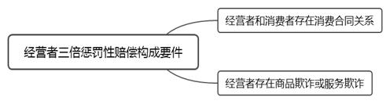
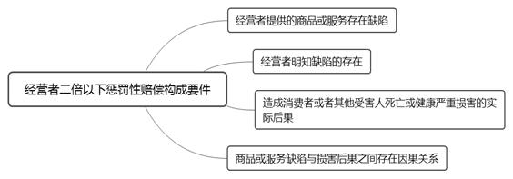
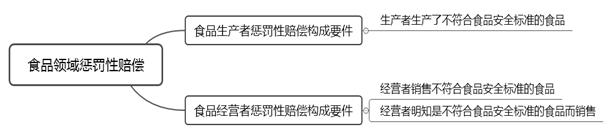

### **消费领域惩罚性赔偿案件的审理思路和裁判要点**

惩罚性赔偿是指由法院作出的赔偿数额超出实际损害数额的赔偿，其意在惩戒不法行为人并遏制他人采取类似行为。消费领域惩罚性赔偿案件涉及一般消费领域以及食品、药品、旅游、医疗产品等特殊消费领域。在处理此类纠纷时，法院应平衡好保护消费者的合法权益、保障商家的正常生产经营行为和惩罚不法行为的关系，从而规范市场经营，促进市场经济健康发展。本文以典型案例为基础，结合相关法律规范和审理难点，对该类案件的审理思路和裁判要点进行梳理、提炼和总结。

一、典型案例

**案例一：涉及经营者欺诈的认定**

王某与A公司签订车辆买卖合同，购买一辆价格为20万元的二手车，该车里程显示为7000公里。后王某对该车维修时得知该车于购买前实际行驶里程数已达50000公里。王某以A公司篡改里程数为由，要求A公司返还购车款并赔偿涉案车辆价款三倍的损失。A公司辩称涉案车辆系从案外人处购得，其未篡改里程数。

**案例二：涉及经营者明知食品不符合安全标准的审查**

刘某向B公司购买25盒新西兰进口麦片，该麦片外包装配料中写明含有亚麻籽，而《中华人民共和国药典》2015版中记载亚麻籽为药材。刘某遂以涉案麦片添加亚麻籽违反《食品安全法》为由，要求B公司退款并承担十倍惩罚性赔偿责任。B公司提交了涉案麦片的出入境检验检疫证明、进口货物报送单、食品流通许可证等材料，证明其已履行法定查验义务，以此抗辩对销售不符合安全标准的食品不明知。

**案例三：涉及食品标签的处理**

2016年周某向C公司购买六箱葡萄酒，该葡萄酒酒瓶标签上显示原料为“葡萄汁100%（含微量二氧化硫）”。根据《预包装食品标签通则》及卫生部门相关规定，2013年8月1日以后生产、进口的使用食品添加剂二氧化硫的葡萄酒，应标示为二氧化硫或微量二氧化硫及含量。周某以涉案产品标签仅标注“含微量二氧化硫”而未标注二氧化硫具体含量为由要求退一赔十。C公司提交证据证明上述标签瑕疵不影响食品安全，要求驳回对方诉请。

二、消费领域惩罚性赔偿案件的审理难点

**（一）经营者欺诈的认定难**

《消费者权益保护法》第55条第1款规定的三倍惩罚性赔偿前提为经营者存在“欺诈行为”，但未对欺诈作出特别规定。民法理论关于欺诈的一般认定标准是否同样适用于经营者欺诈的认定，特别是欺诈的主观构成要件是否仅限于故意，存在较大分歧。实践中，经营者的欺诈行为和相对人陷入错误认识之间的因果关系如何认定亦存在难点。

**（二）经营者明知的审查难**

《消费者权益保护法》第55条第2款和《食品安全法》第148条第2款均规定经营者明知情形下的惩罚性赔偿。然而法院对经营者明知的审查中，明知具体包括哪些情形，经营者履行哪些义务方可排除明知，明知的归责原则和举证责任分配等问题，一直是审理此类案件的难点。

**（三）食品标签瑕疵的认定难**

食品标签瑕疵是指预包装食品包装上的文字、图形、符号等内容存在瑕疵。实践中，食品标签瑕疵在哪些情况下可适用十倍惩罚性赔偿、标签瑕疵不影响食品安全能否适用惩罚性赔偿以及《食品安全法》第148条第2款“不会对消费者造成误导”的认定等存在争议。

**（四）“职业索赔人”的定性和处理难**

“职业索赔人”本身并非法律概念，而是民间对于一些利用生产者或经营者在生产或销售商品过程中侵害消费者权益行为进行诉讼的职业群体的泛称。实践中对于“职业索赔人”是否属于消费者、知假买假行为能否适用惩罚性赔偿的认识并不统一，导致该类案件的裁判结果存在差异。

三、消费领域惩罚性赔偿案件的审理思路和裁判要点

**在消费领域惩罚性赔偿案件中，法院既要平衡好保护消费者合法权益和规范名为打假实为牟利的行为，又要平衡好保障商家正常的生产经营行为和惩罚欺诈消费者的不法经营行为。**此类案件涉及一般商品、食品药品、旅游等诸多消费领域，其中对于汽车等具有较大价值的一般商品以及关乎消费者健康和生命安全的食品药品，当事人之间的矛盾更为突出，引发的社会关注度也更高，法院对此更应审慎审查并妥善处理。

审理此类案件的一般思路如下：**首先**，审查原告的诉讼主体资格；**其次**，审查原告的请求权基础；**再次**，审查案件事实，判定是否符合惩罚性赔偿的构成要件；**最后**，确定赔偿范围。

**（一）原告资格的审查要点**

消费领域惩罚性赔偿案件的原告一般是消费者。消费者是指为生活消费需要购买、使用商品或接受服务的主体。消费者原则上应当是自然人，法律主要基于其弱者地位而给予倾斜保护。此外，提起消费领域惩罚性赔偿的主体不限于与生产者或经营者存在消费合同关系的相对方，还应包括商品的使用者，即购买商品一方的家庭成员、受赠人等使用商品的主体均是适格的原告。除此之外，依据《消费者权益保护法》第55条第2款规定，因经营者提供的商品或服务缺陷造成死亡或健康严重损害的受害人亦有权诉请惩罚性赔偿。

需要注意的是，实践中经营者往往以原告为“职业索赔人”不具备消费者身份进行抗辩。关于职业索赔人是否属于消费者，我们认为消费者的概念应作广义理解，判断是否属于消费者的标准是其购买商品或接受服务的目的是否为了再次交易，而不应以其主观状态、身份而有所差别。此外，仅以职业区分是否属于消费者，不利于消费者权益的保护。职业索赔人的出现客观上能起到监督商家、规范企业经营行为的作用，有利于保护其他消费者，符合《消费者权益保护法》的立法目的。只要生产经营的商品或提供的服务确实存在问题，职业索赔人就有存在的合理性，不应否认其属于消费者的主体地位。然而对职业索赔人能否适用惩罚性赔偿，法院应坚持严格的事实认定标准，发挥职业索赔人的积极作用，抑制其可能带来的各种消极影响。

**（二）请求权基础的审查要点**

消费者可基于违约或侵权提起惩罚性赔偿。当两者发生竞合时，消费者应依据《民法典》第186条规定择一行使。

**1****、基于违约的惩罚性赔偿审查要点**

基于违约的惩罚性赔偿涉及合同请求权和惩罚性赔偿请求权，其中合同请求权涉及消费者请求撤销或解除合同。合同请求权和惩罚性赔偿请求权是两个独立的请求权，在同一案件中消费者基于自愿原则可同时主张也可择一主张。实践中，消费者往往要求经营者返还购买商品或接受服务的价款并主张惩罚性赔偿，对合同效力问题却未涉及。消费合同如果不撤销或不解除，消费者返还价款的诉请则无法实现。因此，在该情形下法院应向原告释明，询问其是否增加有关合同的诉请，并告知撤销或解除合同后其负有相应的返还商品、无法返还时按购买价格抵扣相应价款等义务，以及不行使合同撤销权或解除权的法律后果。经释明后，当事人同意撤销或解除合同的应与原诉请一并处理；当事人明确放弃的，则对其返还价款的请求不予处理，仅处理惩罚性赔偿问题。如案例一中，王某主张返还购车款并赔偿系争车辆价款三倍的损失，并未主张撤销或解除合同，此时法院应对其进行释明。

**2****、基于侵权的惩罚性赔偿审查要点**

基于侵权的惩罚性赔偿涉及损失赔偿请求权和惩罚性赔偿请求权，其中损失赔偿请求权涉及消费者请求赔偿人身伤害损失、财产损失、精神损害等。由于该类惩罚性赔偿的数额一般以受害人实际所受损失为计算标准，如受害人在诉讼中主张惩罚性赔偿，应同时主张损失赔偿请求权；受害人未主张损失赔偿请求权的，法院应对其进行释明。

**（三）惩罚性赔偿构成要件的审查要点**

**1****、一般消费领域惩罚性赔偿构成要件的审查要点**

一般消费领域的惩罚性赔偿适用《消费者权益保护法》第55条规定，包括经营者三倍惩罚性赔偿及经营者二倍以下惩罚性赔偿两类。其中，经营者三倍惩罚性赔偿是以购买商品的价款或接受服务的费用为计算基数；经营者二倍以下惩罚性赔偿则以所受损失为计算基数。

**（****1****）经营者三倍惩罚性赔偿构成要件的审查要点**

根据《消费者权益保护法》第55条第1款规定，消费者提起经营者三倍惩罚性赔偿的请求权基础是违约，该惩罚性赔偿的构成要件如下：**一是**经营者和消费者存在消费合同关系，即以书面或口头等形式表现出的各类消费合同；**二是**经营者存在欺诈行为。

**第一，经营者欺诈行为的认定**。在《消费者权益保护法》未对“欺诈”作出特别规定的情况下，应适用民法理论关于欺诈的一般认定，即一方当事人故意告知对方虚假情况，或故意隐瞒真实情况，诱使对方当事人作出错误意思表示的，可以认定为欺诈行为。据此，经营者欺诈行为的认定应同时满足四个要件：

**一是经营者主观上存在欺诈的故意**。由于当事人的内心意思往往难以查明，对于经营者欺诈故意的认定标准，法院只能通过外在的客观行为来判断其是否具有主观故意。因此，司法实践中法院对经营者欺诈故意的认定一般采用过错推定的方法。只要经营者客观上存在告知消费者虚假情况或隐瞒真实情况的行为，一般即可推定经营者存在欺诈的故意，除非经营者能举证证明不存在故意。

如案例一中，系争车辆在王某购买前实际行驶里程数已达50000公里，远超购买时显示的7000公里，显然该车里程数存在明显不合理之处。A公司作为正规的二手车经营公司，有义务也有能力了解包括车辆里程数在内等可能影响车辆安全性能或对车辆价值产生较大影响的重要信息，而A公司未告知消费者，应推定A公司存在欺诈故意。

**二是经营者客观上存在告知消费者虚假情况或隐瞒真实情况的行为**。实践中，欺诈行为在客观上既包括虚假陈述，也包括负有告知义务的行为人故意隐瞒真实情况。

**三是经营者的欺诈行为导致消费者陷入错误认识**。对于经营者的欺诈行为和消费者陷入错误认识之间的因果关系判断，法院应结合消费者购买涉案商品的数量、过程，特定时间内购买类似商品的次数，涉案购买行为之前是否曾就同一或类似商品进行过多次维权等因素综合判断。当法院认为消费者不存在误导的可能性达到高度盖然性标准时，可据此认定经营者不构成欺诈，自然无法适用三倍惩罚性赔偿。

**四是消费者基于错误认识而作出错误的意思表示**。消费者因经营者欺诈行为陷入错误认识后，须基于该错误认识作出错误的购买商品或接受服务的意思表示。如果消费者仅因欺诈行为陷入错误认识而未作出任何意思表示，则不构成欺诈。

实践中，汽车销售领域涉及的商品标的金额较大，对此应如何准确理解和适用经营者三倍惩罚性赔偿是司法实务亟待解决的难题。在处理此类案件时，法院应对案件事实进行实质性审查，重点审查经营者隐瞒的信息是否属于可能影响车辆安全性能或对车辆价值产生较大影响的重大瑕疵，并根据个案具体情况综合判断是否构成经营者欺诈。

**在新车销售情形中**，新车一般指全新、未经使用、未经维修的车辆，而新车从主机厂到4S店往往需要经过长途运输，而运输过程中可能会造成车辆瑕疵。4S店不可能因存在小瑕疵就将车辆重新运回厂家处理，故汽车行业普遍存在PDI（Pre-delivery Inspection，交付前检查）作业程序，即由厂家授权经销商向用户交付车辆前对车辆进行最后检测，对发现的一般瑕疵和缺陷及时校正、修补或更换原厂配件，使车辆达到原厂标准。因此，如经营者未将诸如车辆漆面瑕疵处理、车辆零部件更换等并不影响车辆安全性能或未对车辆价值产生较大影响的信息告知消费者，其可能仅涉及侵犯消费者的知情权，不宜认定为欺诈行为；如经营者对车辆曾发生事故导致前纵梁等部件受损而进行过重大维修或对试驾车私自篡改里程表数据等事实未告知消费者，一般可认定构成经营者欺诈。

**在二手车销售情形中**，基于二手车的特性，车辆正常使用过程中的自然老化、磨损以及不影响车辆安全性能或不会导致车辆价值重大贬损的轻微事故及维修一般不属于重大质量瑕疵，如经营者未如实告知一般不宜认定为欺诈行为；如存在因积极篡改里程表数据、对车辆有其他改装行为或隐瞒车辆曾发生安全结构部件受损、车辆浸水等重大维修的事实，经营者未如实告知消费者的，一般可认定构成经营者欺诈。

**在平行进口车销售情形中**，平行进口车不同于一般的新车和二手车，是指未经品牌厂商授权，贸易商从海外市场购买并引入中国市场进行销售的汽车。该类车的生产销售对象并非中国，故车辆的部分配置和性能可能需要按照中国的标准进行改装。在改装过程中，车辆可能会出现油漆脱落等外观瑕疵，甚至会留有拆装痕迹。作为平行进口车的消费者，对于此种情形应当具备基本的心理预期。因此，对于消费者提出的车辆质量问题，法院应注意审查是否因正常改装而引起，如是则不宜认定构成经营者欺诈。

需要注意的是，如经审查经营者不构成欺诈，法院可对当事人进行释明，引导当事人提出相应的预备诉请，并根据经营者违约的具体内容、情节轻重、涉及利益大小等因素综合确定责任承担方式。

**第二，经营者三倍惩罚性赔偿不以消费者实际损害后果为要件**。实践中，消费者在主张惩罚性赔偿时多存在未造成实际人身或财产损害后果的情况，经营者往往以此抗辩不承担惩罚性赔偿责任。然而依据《消费者权益保护法》第55条第1款，首先，惩罚性赔偿金并未以消费者的损失作为计算标准，而是以商品的价款或接受服务的费用作为计算标准；其次，从惩罚性赔偿制度的功能定位而言，其不同于传统民法理论的补偿性赔偿，该制度的主要目的在于惩罚而非填补损害，通过高额的经济惩罚制裁欺诈行为，从而达到威慑和预防的作用；再次，该条款中的“损失”并非出现在法条的要件部分而是效果部分。该“损失”仅指合同预期利益的损失，并非消费者固有利益的损失。因此，是否造成消费者实际损害后果并非经营者三倍惩罚性赔偿的构成要件。

**（****2****）经营者二倍以下惩罚性赔偿构成要件的审查要点**

依据《消费者权益保护法》第55条第2款，经营者二倍以下惩罚性赔偿的构成要件如下：**一是**经营者提供的商品或服务存在缺陷；**二是**经营者明知缺陷的存在；**三是**造成消费者或其他受害人死亡或健康严重损害的实际后果；**四是**商品或服务缺陷与损害后果之间存在因果关系。

需要注意的是，该类惩罚性赔偿的适用条件较经营者三倍惩罚性赔偿更为严格，要求请求主体所受损害应达到消费者或其他受害人死亡或健康受到严重损害的程度。其中，健康严重损害的判断标准需依照人身损害有关法律和司法解释规定具体确定。

**2****、食品领域惩罚性赔偿构成要件的审查要点**

食品领域惩罚性赔偿纠纷在消费领域惩罚性赔偿案件中占比较大，且该类惩罚性赔偿构成要件的审查在事实认定和法律适用上均存在较多难点。依据《食品安全法》第148条第2款规定，承担惩罚性赔偿的主体有两类，即食品生产者和食品经营者。食品生产者承担惩罚性赔偿的构成要件是其生产了不符合食品安全标准的食品；食品经营者承担惩罚性赔偿的构成要件如下：**一是**销售不符合食品安全标准的食品，**二是**明知是不符合食品安全标准的食品而销售。

**（****1****）经营者明知的审查要点**

“明知”包括确定知道和应当知道两种情形。“确定知道”是指经营者明确理解或了解相关情况；“应当知道”是指依据经营者提供的商品或服务推断其应当了解商品或服务的相关情况。无论确定知道还是应当知道，均为经营者的主观状态，法院只能通过经营者的客观行为来认定其是否明知。由于信息不对称，消费者要证明经营者明知存在较大困难。因此，在明知的认定上，法院应减轻消费者的举证责任，采用过错推定原则，只要销售不符合食品安全标准的食品，就应推定经营者明知；在经营者能够证明其已履行相关法定注意义务并尽到合理审查责任，不存在明知的情况下，需再由消费者证明经营者明知。

实践中，对于经营者明知的认定，法院应结合经营者的经营范围、经营能力、履行相关法定义务等客观情况予以综合判断。具体可区分为两种情形：**一是**对无需专业检验检疫就能判断是否存在食品安全风险的，如食品是否已过保质期、食品标签存在影响食品安全或对消费者造成误导的瑕疵等情形，经营者应尽必要的注意义务，否则应推定经营者明知。**二是**对需要专业检验检疫机构检查才能判断是否存在食品安全风险的，由于经营者不具备专业检验检疫能力，不能苛责和扩大其审查注意义务。只要经营者可以证明销售的食品已由相关部门检验检疫且已尽到必要注意义务，即可推定经营者不构成明知。

如案例二中，涉案麦片添加了中药材亚麻籽，而亚麻籽并未列入国家卫生行政主管部门公布的既是食品又是药品的目录，不属于《食品安全法》第38条规定的可添加物质，故B公司销售的麦片不符合食品安全标准。然而，依据《食品安全法》第91、92条规定，国家出入境检验检疫局对进出口食品安全负有监督管理职责。食品经营者的主要义务是进货查验义务和安全存储义务。B公司作为经营者已依法履行对涉案麦片的入境货物检验检疫证明、进口货物报送单、食品流通许可证等材料的必要查验义务。B公司基于对行政机关颁发卫生证书的信赖而销售涉案麦片，难以认定B公司明知涉案麦片不符合食品安全标准而销售，故B公司不应承担十倍惩罚性赔偿责任。

**（****2****）食品标签瑕疵的审查要点**

食品标签是指预包装食品包装上的文字、图形、符号等一切说明食品的内容，包括食品名称、净含量、生产日期、保质期、生产者、生产地等。食品领域惩罚性赔偿纠纷多涉及标签瑕疵，主要表现为食品添加物含量标注和实际不相符、标注多个生产日期、更改或虚假标注生产日期，或未标注生产者名称、添加物具体含量、不适宜人群等。

依据《食品安全法》第148条第2款规定，食品标签瑕疵是否适用惩罚性赔偿应结合标签、说明书是否存在影响食品安全以及是否会对消费者产生误导的瑕疵进行综合判断，只有食品的标签、说明书存在不影响食品安全且不会对消费者造成误导的瑕疵才不适用惩罚性赔偿。需要注意的是，该条款规定的食品标签瑕疵不适用惩罚性赔偿的特定情形，并未否定该食品标签瑕疵仍属于违反食品安全标准的行为。

对于食品标签瑕疵是否影响食品安全的判断应采用严格标准，某些不影响食品安全的标签瑕疵仅为行政管理的范畴。如食品标签瑕疵系笔误、配料实际含量数额标注有出入等不会对人体健康造成任何危害的，法院不应支持消费者十倍惩罚性赔偿的诉请。对于食品标签瑕疵对消费者产生误导应严格限定于食品安全方面的误导，包括食品的营养成分、功用、有效期等。因此，食品标签瑕疵不影响食品安全且不会对消费者造成食品安全方面误导的，不适用十倍惩罚性赔偿。

如案例三中，涉案葡萄酒的标签“含微量二氧化硫”不符合食品安全标准有关标签标示的规定。C公司作为经营者应对其销售的食品及其标签负有审核、注意义务，涉案产品存在明显的标签瑕疵，属于不符合食品安全标准的食品。然而根据C公司提交的官方检测报告，涉案葡萄酒的成分及含量并未违反相关食品安全标准，上述标签瑕疵尚不影响食品安全。同时，周某未能举证证明饮用涉案葡萄酒会对其产生损害，故法院对周某十倍惩罚性赔偿的主张不予支持。

**（****3****）小额商品重复诉请惩罚性赔偿的****审查要点**

依据《食品安全法》第148条第2款规定，消费者对小额商品要求惩罚性赔偿而增加赔偿的金额不足一千元的，生产者或经营者需赔偿一千元。目的在于加大对生产、经营不符合食品安全标准的生产者和经营者的惩戒，实现惩罚性赔偿制度设立的初衷。然而，实践中经常出现同一消费者在同一超市采取单日多次结算的方式多次购买若干食品，或一定时间段内多次购买同一食品，并以每张购物小票对应一份起诉状的方式诉至法院，分别要求获得一千元的惩罚性赔偿金。对于上述情形应分别适用惩罚性赔偿还是同时适用惩罚性赔偿存在争议。

**首先**，从诉讼诚信原则出发，在当事人存在小额多次购买、分别按照惩罚性赔偿最低限额主张赔偿的情况下，如分别适用惩罚性赔偿会助长社会中的不诚信行为，同时对生产者、经营者造成过重负担。**其次**，从惩罚性赔偿制度的立法目的而言，惩罚性赔偿是要制裁生产和经营不符合食品安全标准的同一商家针对与其发生交易的同一消费者作出一次性赔偿，而非针对同一消费者的数次交易行为进行分别赔偿。**再次**，从行为效果而言，在一定时间段内分多次消费同类商品与一次消费全部商品具有相同的行为效果。因此，对于相同诉讼主体、类同商品发生的同案由案件，法院应作为一案审理，并以多起案件的商品总额为计算标准，要求生产者或经营者一并承担惩罚性赔偿责任。

需要注意的是，消费者尤其是职业索赔人首次起诉判决惩罚性赔偿后再次购买类似商品并诉请惩罚性赔偿的，法院对之后的诉请能否支持应区分一般商品和食品药品予以分别讨论。**对于一般商品**，职业索赔人的再次购买行为显然是为了牟利而非因经营者的欺诈行为陷入错误认识，故不适用惩罚性赔偿。**对于食品药品**，《食品药品司法解释》第3条将食品药品的知假买假行为囊括在法律保护范围内，其主要原因在于食品药品安全与人民的健康和生命安全休戚相关，相比于职业索赔人的打假获利，法律更注重对食品药品领域制假售假者的制裁以及对该领域市场秩序的规范。此外，《食品安全法》第148条第2款和《药品管理法》第144条第3款相较于《消费者权益保护法》第55条第1款而言，并未要求经营者有欺诈行为。因此，生产者或经营者以购买者明知食品药品存在质量问题而仍然购买为由进行抗辩的，法院不予支持。

**3****、其他特殊消费领域惩罚性赔偿构成要件的审查要点**

除食品之外，其他特殊消费领域包括药品、旅游、医疗产品等。在这些特殊消费领域涉及惩罚性赔偿构成要件的审查需适用相关特别法的规定。

**在药品领域**，依据《药品管理法》第144条第3款规定，有关假药、劣药的惩罚性赔偿基本参照《食品安全法》第148条第2款规定，对于生产假药、劣药或明知是假药、劣药仍然销售、使用的，受害人或其近亲属可以请求支付价款十倍或损失三倍的赔偿金。

**在旅游领域**，依据《旅游法》第70条规定，有关惩罚性赔偿的构成要件如下：**一是**旅行社具备履行条件；**二是**经旅游者要求履行合同后仍拒绝的；**三是**造成旅游者人身损害、滞留等严重后果。旅游者在满足上述条件时可主张旅游费用一倍至三倍的赔偿金。

**在医疗产品领域**，依据《最高人民法院关于审理医疗损害责任纠纷案件适用法律若干问题的解释》第23条规定，有关惩罚性赔偿的构成要件如下：**一是**医疗产品存在缺陷；**二是**生产者或销售者明知缺陷的存在；**三是**造成患者死亡或健康严重损害；**四是**医疗产品缺陷和损害后果之间存在因果关系。被侵权人在满足上述条件时可主张所受损失二倍以下的赔偿金。

**（四）赔偿范围的确定**

**1****、一般消费领域惩罚性赔偿范围的确定**

**（****1****）合同之诉惩罚性赔偿的赔偿范围**

在一般消费领域，消费者主要基于合同之诉要求惩罚性赔偿。在满足经营者三倍惩罚性赔偿构成要件的前提下，消费者要求惩罚性赔偿的金额为所购买商品价款或接受服务的费用的三倍；增加赔偿的金额不足五百元的为五百元。需要注意的是，由于消费者和经营者的消费合同在起诉前已履行，消费者会为此支出相应费用或遭受损失。当合同撤销或解除后，除惩罚性赔偿外，经营者仍需赔偿消费者的实际经济损失。

**（****2****）侵权之诉惩罚性赔偿的赔偿范围**

在一般消费领域，受害人基于侵权之诉主张惩罚性赔偿的，除有权要求经营者依据《消费者权益保护法》第49、51条等规定赔偿人身伤害损失、财产损失、精神损害外，还有权主张上述损失二倍以下的惩罚性赔偿。需要注意的是，与合同之诉的惩罚性赔偿不同，侵权之诉的惩罚性赔偿赋予法官自由裁量权，法官应根据侵权人的过错程度、行为恶性、损害后果等因素合理确定惩罚性赔偿。

**2****、特殊消费领域惩罚性赔偿范围的确定**

特殊消费领域中，食品与药品领域的惩罚性赔偿范围相同，消费者除要求赔偿损失外，可主张支付价款十倍或损失三倍的惩罚性赔偿，并设置一千元的最低惩罚性赔偿。旅游、医疗产品领域的惩罚性赔偿均赋予法官自由裁量权。其中，旅游领域消费者除要求赔偿损失外，可主张旅游费用一倍以上三倍以下的惩罚性赔偿；医疗产品领域的被侵权人除要求赔偿损失外，可主张所受损失二倍以下的惩罚性赔偿。

（根据民事庭丁慧、王晓翔提供材料整理）