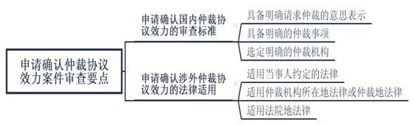
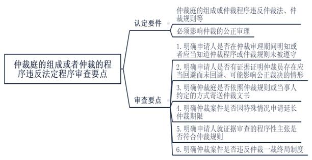
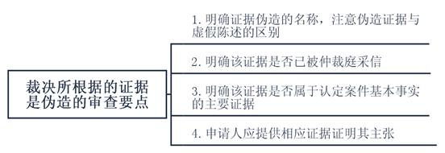
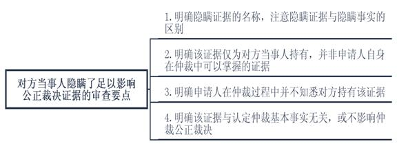

### **仲裁司法审查案件的审理思路和裁判要点**

仲裁司法审查案件包括申请确认仲裁协议效力案件、申请撤销和执行我国内地仲裁机构的仲裁裁决案件、申请认可和执行港澳台仲裁裁决案件以及申请承认和执行外国仲裁裁决案件。其中，申请确认仲裁协议效力案件是指当事人申请法院确认仲裁协议有效或无效的案件。申请撤销我国内地仲裁机构的仲裁裁决案件（下称“申请撤销仲裁裁决案件”）是指当事人申请法院依照《仲裁法》或《民事诉讼法》的规定撤销我国内地仲裁机构作出裁决的案件。法院在审理以上两类案件时应秉持司法有限监督原则，尊重当事人意思自治及仲裁庭的自由裁量权，严格依照《仲裁法》《民事诉讼法》规定的法定事由进行司法审查。为提高该两类案件的审判质量与效率，现以典型案件为基础，对相应的审理思路和裁判要点进行梳理、提炼和总结。

**一、典型案例**

**案例一：涉及****申请人请求确认仲裁协议效力的审查**

申请人A公司与被申请人B公司签订施工合同，约定合同相关争议可至有管辖权的法院诉讼。后双方就前述施工合同签订补充协议，约定如发生任何争议，各方均有权向上海仲裁委员会申请仲裁。现双方就施工合同及补充协议中相关事项发生争议，A公司遂提起确认仲裁协议效力之诉。

**案例二：涉及申请人主张仲裁程序违反法定程序的审查**

申请人C公司主张因未收到仲裁庭寄送的包括仲裁申请书副本、仲裁规则、仲裁庭组成情况、开庭通知等任何仲裁文书，导致其未能参与仲裁审理，故仲裁程序违反法定程序，裁决应予撤销。经查明，上海仲裁委员会已依照仲裁规则，多次分别向C公司的注册地址与合同记载的通讯地址寄送仲裁文书。

**案例三：涉及申请人主张裁决所根据的证据是伪造的审查**

申请人D公司主张被申请人Ｅ公司提供的工程结算单系伪造，双方工程项目尚未实际结算，故仲裁庭根据该伪造证据裁决D公司支付工程款显属错误，裁决应予撤销。经查明，申请人D公司未能证明工程结算单系伪造。除工程结算单外，仲裁庭还结合结算内容、已付工程款、应留质保金数额等作出裁决。

**案例四：涉及申请撤销涉外仲裁裁决的审查**

申请人F与被申请人G（新加坡籍）签订《增资扩股协议》，约定双方对G持股的目标公司进行增资扩股。后因履行上述协议发生争议，双方遂进行仲裁。现申请人F主张被申请人G隐瞒关于投资款用途和去向的相关证据，严重影响仲裁公正裁决，故申请撤销仲裁裁决。

**二、仲裁司法审查案件的审理要点**

**（一）遵循司法有限监督原则**

仲裁的基本价值取向在于尊重当事人的意思自治，迅速、快捷地解决纠纷。为维护仲裁的独立性，法院在审理仲裁司法审查案件时应遵循有限监督原则，充分尊重仲裁的权威性与效率性，保护当事人选择仲裁解决纠纷的意思自治，避免审判权对仲裁的过度干预。

**（二）严格依照法定事由进行形式审查**

法院对仲裁的司法审查是程序上的形式审查而非案件实体审查，否则法院的司法审查将变成仲裁的上诉程序，与仲裁一裁终局制度相悖。因此，在审理该类案件过程中，法院应严格依照《仲裁法》第16、58、70条及《民事诉讼法》第281条第1款的规定进行形式审查。对于当事人不依照法定事由提起申请，涉及仲裁实体审理的，法院应及时向申请人释明；如申请人坚持主张的，不予支持。

**（三）依法执行仲裁司法审查报核制度**

依据2021年修订的《最高人民法院关于仲裁司法审查案件报核问题的有关规定》，报核制度的适用范围包括拟认定仲裁协议无效、不予执行、撤销仲裁裁决或者不予认可和执行港澳台仲裁裁决、不予承认和执行外国仲裁裁决。

其中，人民法院办理非涉外、涉港澳台仲裁司法审查案件，经审查拟认定仲裁协议无效，不予执行或者撤销仲裁裁决的，应当向本辖区高级法院报核；待高级法院审核后，方可依高级法院的审核意见作出裁定。在该类案件中，如高级法院经审查拟同意以违背社会公共利益为由不予执行或者撤裁的，应向最高法院报核，依最高法院的审核意见作出裁定。

人民法院办理涉外、涉港澳台仲裁司法审查案件，经审查拟认定仲裁协议无效，不予执行或者撤裁的，应当向本辖区所属高级法院报核；高级法院经审查拟同意的，应当向最高法院报核，依最高法院的审核意见作出裁定。

**三、仲裁司法审查案件的审理思路和裁判要点**

对于仲裁司法审查案件，法院应严格依照《仲裁法》《民事诉讼法》规定的法定事由进行形式审查，注意仲裁法律与司法解释的新旧衔接、国内与涉外案件的法律适用区别，以有效保障仲裁的独立性与当事人的意思自治，正确审理仲裁司法审查案件，及时纠正仲裁裁决的错误。

**（一）仲裁司法审查案件管辖的认定**

**1****、申请确认仲裁协议效力案件管辖的认定**

当事人对仲裁协议效力有异议的，可请求仲裁委员会作出决定或请求法院作出裁定。对于请求法院作出裁定的，根据《最高人民法院关于审理仲裁司法审查案件若干问题的规定》，不再依照《仲裁法司法解释》区分国内与涉外案件，一并由仲裁协议约定的仲裁机构所在地、仲裁协议签订地、申请人或被申请人住所地的中级法院或者专门法院管辖。

**2****、申请撤销仲裁裁决案件管辖的认定**

依照《仲裁法》第58条规定，申请撤销仲裁裁决案件由仲裁委员会所在地的中级法院管辖。

**3****、仲裁司法审查案件管辖异议的处理**

法院受理仲裁司法审查案件后，被申请人提出管辖权异议的应当自收到法院通知之日起十五日内提出，被申请人在中国没有住所的应在三十日内提出。法院对被申请人提出的异议应当进行审查并作出裁定。被申请人对管辖异议裁定不服的，可以提起上诉。

**（二）仲裁司法审查案件中涉外标准的认定**

国内仲裁与涉外仲裁司法审查案件在法律适用、报核程序上均有所区别，故需对涉外案件的认定标准加以明确。根据《最高人民法院关于适用<中华人民共和国涉外民事关系法律适用法\>若干问题的解释（一）》规定，涉外民事关系的认定需考察主体、客体、法律事实三方面要素：1、当事人一方或双方是外国公民、外国法人或其他组织、无国籍人；2、当事人一方或双方的经常居所地在中国领域外；3、标的物在中国领域外；4、产生、变更或者消灭民事关系的法律事实发生在中国领域外。

需要注意的是，申请确认涉港澳台仲裁协议效力案件、申请执行或者撤销我国内地仲裁机构作出的涉港澳台仲裁裁决案件，应参照适用涉外仲裁司法审查案件的法律规定。

**（三）申请确认仲裁协议效力案件的审查要点**

仲裁协议是当事人同意将特定法律关系中已经发生或可能发生的争议提交仲裁的协议。当事人对仲裁协议效力提出异议请求法院作出裁定的，法院在审查时应注意：**第一**，明确国内仲裁协议效力的审查标准；**第二**，明确涉外仲裁协议效力认定的法律适用。

**1****、申请确认国内仲裁协议效力的审查标准**

根据《仲裁法》第16条规定，有效的国内仲裁协议应具备三项构成要件，即请求仲裁的意思表示、仲裁事项、选定的仲裁委员会。

**第一**，仲裁协议需具备当事人明确请求仲裁的意思表示。当事人在仲裁协议中签字或盖章确认的，可以视为具备明确请求仲裁的意思表示。申请人如能提供证据证明仲裁协议订立时当事人系无民事行为能力人或限制民事行为能力人、受胁迫或欺诈，或非本人真实签字、盖章的，因缺乏当事人请求仲裁的真实意思表示，仲裁协议可认定为无效。主张仲裁协议由他人代签的，法院应审查是否在仲裁审理时当事人已就仲裁协议作出追认的意思表示。

**第二**，仲裁协议需具备明确的仲裁事项。仲裁事项即提交仲裁管辖的争议范围，如当事人约定“凡执行本合同或与本合同有关的一切争议”，或明确某一类具体争议提交仲裁，均视为具备明确的仲裁事项。当事人约定的仲裁事项超出法律规定的仲裁范围，如涉及婚姻、收养、监护、抚养、继承纠纷、劳动争议、行政争议等，则该部分仲裁协议无效。

**第三**，仲裁协议需选定明确的仲裁机构。（1）仲裁协议约定两个以上仲裁机构，或仅约定由某地仲裁机构仲裁且该地有两个以上仲裁机构，如当事人进一步协议选择的，视为有明确的仲裁机构。（2）仲裁协议约定由某地仲裁机构仲裁且该地仅有一个仲裁机构的，则该仲裁机构即视为双方明确选定的仲裁机构。（3）当事人在选定仲裁机构时名称记载错误，如仲裁机构名称漏字、多字、错字，此类因当事人疏忽导致的仲裁条款瑕疵可以采用合同一般解释原则，结合该地区仲裁机构名称、数量、受理案件范围等审慎判断双方是否已明确选定仲裁机构。

**第四**，如仲裁机构对仲裁协议的效力已作出决定，或当事人在仲裁庭首次开庭前没有对仲裁协议的效力提出异议的，申请人再向法院申请确认仲裁协议无效，法院不予受理。

如案例一中，尽管双方当事人就争议解决方式先后进行过不同的约定，但补充协议系双方当事人真实意思表示，且约定了明确的仲裁机构与仲裁管辖的争议范围，因此补充协议约定的仲裁协议应认定为有效。

**2****、申请确认涉外仲裁协议效力的法律适用**

对于确认涉外仲裁协议效力案件，法院应明确案件的法律适用。根据《仲裁法司法解释》《涉外民事关系法律适用法》《审理仲裁司法审查案件若干问题的规定》，该类案件法律适用的审查要点如下：

**第一**，应适用当事人约定的法律。当事人协议选择确认涉外仲裁协议效力适用的法律，应作出明确的意思表示。仅约定合同适用法律的，不能视作对仲裁条款效力所适用法律的约定。

**第二**，如当事人没有选择适用法律，则适用仲裁机构所在地法律或者仲裁地法律。仲裁机构所在地与仲裁地法律对仲裁协议效力作出不同认定的，应适用确认仲裁协议有效的法律。

**第三**，如当事人没有约定适用的法律，也没有约定仲裁地或仲裁地约定不明的，应适用法院地法律。如仲裁协议没有约定仲裁地或仲裁机构，但根据仲裁协议适用的仲裁规则可以确定仲裁地或仲裁机构的，应视为有约定的仲裁机构或仲裁地。

**（四）申请撤销仲裁裁决案件的审查要点**

**1****、申请撤销国内仲裁裁决案件的审查要点**

**（****1****）申请人主张没有仲裁协议**

“没有仲裁协议”是指当事人没有达成仲裁协议、仲裁协议被认定无效或被撤销。如申请人以没有仲裁协议为由申请撤销仲裁裁决的，法院应以申请人是否在仲裁程序中就仲裁协议提出过异议为标准，从两方面进行审查。

**第一**，如申请人在仲裁首次开庭前未对仲裁协议的效力提出异议，在仲裁裁决作出后以仲裁协议无效为由主张撤销仲裁裁决的，法院不应予以支持。

**第二**，如申请人在仲裁程序中对仲裁协议的效力提出异议，在仲裁裁决作出后又以此为由主张撤销仲裁裁决的，法院应结合申请人提出的具体事实与理由审慎判断。

**（****2****）申请人主张裁决的事项不属于仲裁协议的范围或仲裁委员会无权仲裁**

该法定事由包括仲裁裁决的事项超出仲裁协议约定的范围、裁决的事项属于法定或仲裁规则规定的不可仲裁事项、裁决内容超出当事人仲裁请求范围，或作出裁决的仲裁机构并非仲裁协议所约定等情形。法院的审查要点如下：

**第一**，明确仲裁协议约定的范围，以及当事人的仲裁请求及其所涉及的仲裁协议约定范围。

**第二**，对比仲裁裁决事项是否属于仲裁协议约定范围或当事人仲裁请求范围、仲裁机构是否系仲裁协议所约定。

**第三**，仲裁协议的范围应包括与仲裁协议直接或间接相关的争议范围。当事人就仲裁事项概括约定为合同争议的，则基于合同成立、效力、变更、转让、履行、违约责任、解释、解除等产生的纠纷均属于仲裁事项。如仲裁协议中未涉及律师费、违约损失，但律师费、违约损失属于与仲裁协议相关的争议范围，仲裁对此作出裁决并不属于超出仲裁协议约定范围。

**第四**，经审查裁决事项确实超出仲裁协议范围的，法院应撤销仲裁裁决中的超裁部分；超裁部分与其他裁决事项不可分的，法院应撤销仲裁裁决。

**（****3****）申请人主张仲裁庭的组成或仲裁的程序违反法定程序**

法院认定仲裁庭的组成或仲裁的程序违反法定程序需具备两项基本要件：**第一**，仲裁庭的组成或仲裁程序确实违反仲裁法、仲裁规则以及当事人对仲裁程序的特别约定；**第二**，必须影响仲裁的公正审理，如仲裁程序确有瑕疵。法院应衡量该程序瑕疵是否对仲裁的公正审理产生实质影响。

实践中因仲裁程序繁多，需由申请人明确裁决违反的仲裁法或仲裁规则的具体条文与主要事实理由，以便法院审查核实。其中，申请人主张仲裁程序违法的常见事由及法院审查要点如下：

**第一**，在仲裁审理期间，申请人经提示知道或应当知道仲裁程序或仲裁规则未被遵守，但仍然参加或继续参加仲裁程序且未提出异议，仲裁裁决作出后又主张提出违反法定程序的，法院不予支持。

**第二**，申请人如主张仲裁员与对方当事人存在利害关系未回避的，应提交相应证据予以证明。经审查，根据仲裁法或仲裁规则规定应当回避而仲裁员确未回避，可能影响公正裁决的，对申请人的请求法院应予支持。

**第三**，申请人以仲裁未送达仲裁文书为由主张仲裁程序违法的，仲裁庭已依照仲裁规则或当事人约定的方式寄送仲裁文书的，应视为送达。

如案例二中，申请人C公司虽主张未收到全部仲裁文书，但根据《上海仲裁委员会仲裁规则》规定，仲裁庭向申请人的营业地、注册地、住所地、经常居住地或合同确认的通讯地址寄送的，即视为送达。经审查，仲裁庭已向申请人C公司的注册地与合同记载通讯地址寄送仲裁文书，符合仲裁规则，故法院对C公司的主张不予支持。

**第四**，申请人以仲裁案件审理超期为由主张仲裁程序违法的，根据仲裁规则，仲裁庭如有特殊情况可以延长仲裁期限的，不构成违反仲裁程序。

**第五**，申请人以仲裁庭未同意举证质证、申请鉴定或调取证据为由主张仲裁程序违法的，因仲裁规则已对证据审查加以规定，故法院可以比对仲裁规则与申请人主张的事实，如有必要可以调取仲裁笔录予以核实。对申请人提出的上述主张符合仲裁规则规定的，法院不予支持。

**第六**，申请人主张裁决违反仲裁一裁终局制度。仲裁一裁终局是指裁决作出后当事人就同一纠纷不得再申请仲裁或提起诉讼。对于两案是否属于同一纠纷，法院可以从当事人、法律关系、仲裁请求等方面进行审查。如两案的当事人、法律关系均相同，仲裁请求也相同或后案的仲裁请求实质上否定了前案的裁判结果的，法院可认定违反仲裁一裁终局制度。然而，如在前案作出仲裁裁决后又发生新的事实的，则不属于同一纠纷，当事人可依据新的事实再次申请仲裁。此时仲裁机构受理该案并不违反一裁终局制度。

**（****4****）申请人主张裁决所根据的证据是伪造的**

伪造证据是指通过捏造、变造、提供虚假证明等非法方式形成或获取虚假证据材料的行为。法院的审查要点如下：

**第一**，申请人应明确所伪造证据的名称。伪造证据与虚假陈述是不同的法律概念。虚假陈述是指当事人故意对案件事实作虚假、误导性陈述的行为。如申请人虽主张伪造证据，但实则认为被申请人虚假陈述、捏造事实的，法院应在审理时向其释明。

**第二**，明确该证据是否已被仲裁庭采信。对于没有被仲裁庭采信的证据，无论其是否伪造均不影响仲裁案件的审理，故不属于申请撤销仲裁裁决的事由。

**第三**，明确该证据是否属于认定案件基本事实的主要证据。对于已被仲裁庭采信的证据，法院应明确该证据是否属于认定案件基本事实的主要证据，对仲裁裁决结果是否有实质性影响。如申请人主张的伪造证据与仲裁案件基本事实认定无关，仅是为了补强证明部分事实的，因不影响仲裁案件的审理，无论其是否伪造均不属于申请撤销仲裁裁决的事由。

**第四**，申请人需提供相应证据证明其所主张的证据系伪造。如申请人主张证据系伪造，但实则是对该证据所反映的待证事实和观点或仲裁庭对该证据的认证持有异议，因涉及仲裁实体审理，不属于撤销仲裁裁决案件的审理范畴，法院对申请人的主张不予支持。

如案例三中，申请人D公司虽主张被申请人E公司提交的《工程结算单》系伪造，但未能提供相应证据证明其主张，且《工程结算单》并非认定该仲裁案件基本事实的主要证据，仲裁庭还结合其他证据加以判断，故法院对申请人D公司的主张不予支持。

**（****5****）申请人主张对方当事人隐瞒了足以影响公正裁决的证据**

对于申请人主张该法定事由的，法院应注意审查该证据是否为认定仲裁案件基本事实的主要证据且足以影响仲裁公正裁决。审查要点如下：

**第一**，申请人应明确对方当事人隐瞒证据的名称。法院需注意区别隐瞒证据与隐瞒事实。隐瞒证据是指对方当事人持有某一证据，为了获得己方利益故意不向仲裁庭提供。隐瞒事实是指对方当事人未向仲裁庭陈述某一具体事实。申请人有时会混淆隐瞒证据与隐瞒事实，法院需对此加以释明。

**第二**，该证据仅为对方当事人持有。如申请人在仲裁过程中隐瞒己方掌握的证据，仲裁裁决作出后以己方所隐瞒的证据足以影响公正裁决为由申请撤销仲裁裁决的，法院不予支持。如微信聊天记录、签订主体为双方当事人的合同，此类证据申请人亦应持有，故不属于该款所述情形。

**第三**，申请人在仲裁过程中并不知悉对方当事人持有该证据，或仲裁过程中已要求对方当事人出示或申请仲裁庭责令提交，可以认定为对方当事人隐瞒证据。

**第四**，申请人所主张的隐瞒证据，如与仲裁认定基本事实无关或不影响仲裁公正裁决的，因不影响仲裁裁决结果，即便对方当事人确实未在仲裁审理中提交，法院对申请人的主张亦不予支持。

**（****6****）申请人主张仲裁员在仲裁该案时有索贿受贿、徇私舞弊、枉法裁决行为**

根据《审理仲裁司法审查案件若干问题的规定》第18条规定，仲裁员在仲裁该案时有索贿受贿、徇私舞弊、枉法裁决行为是指已经由生效刑事法律文书或纪律处分决定所确认的行为。申请人以该项主张为由提出抗辩的，应提交上述证据予以证明。如申请人已提交由纪监委等相关部门出具的立案决定书等，法院在审查确认与本案的关联性后，宜采取延长审限、中止审理等方式待相关案件完结后再行审理。

**（****7****）申请人主张仲裁裁决违背社会公共利益**

社会公共利益一般包括国家法律的基本原则与准则、社会和经济生活的基本价值趋向和基本道德准则。社会公共利益是指全体社会成员或不特定多数人的利益，不包括特定主体之间的权利义务关系。当然，法院认为仲裁裁决确实违背社会公共利益的，亦可主动审查裁定撤销。

**2****、申请撤销涉外仲裁裁决案件的审查要点**

对于申请撤销涉外仲裁裁决案件，根据《民事诉讼法》第281条第1款的规定，法院审查要点如下：

**第一**，申请撤销涉外仲裁裁决案件的法定事由与国内案件存在区别。申请撤销涉外仲裁裁决的法定事由不包括伪造证据，隐瞒证据，仲裁员索贿受贿、徇私舞弊、枉法裁决三项事由。

如案例四中，因被申请人G具有新加坡国籍，该仲裁案件属于涉外仲裁裁决。申请人F申请撤销涉外仲裁裁决的，应适用《民事诉讼法》第281条第1款规定。然而，申请人F主张对方当事人隐瞒证据，不符合申请撤销涉外仲裁裁决的法定事由，故法院对申请人F的主张不予支持。

**第二**，坚持形式审查为原则，不涉及涉外仲裁裁决的实体审理。对于申请撤销涉外仲裁裁决案件，法院应围绕《民事诉讼法》规定的法定事由展开形式审查。如申请人提出的主张涉及仲裁实体审理的，法院应不予支持。

**（五）仲裁司法审查案件的处理结果**

**1****、确认仲裁协议效力案件的处理结果**

对于确认仲裁协议效力案件，法院根据当事人的诉讼请求和具体案情，处理结果通常包括裁定驳回申请、裁定确认仲裁协议有效或确认仲裁协议无效。其中，当事人申请确认仲裁协议有效，经法院审查确认的，应裁定确认仲裁协议有效；当事人申请确认仲裁协议无效，经法院审查确认的，法院应在遵循报核制度后方可裁定确认仲裁协议无效。

**2****、申请撤销仲裁裁决案件的处理结果**

对于申请撤销仲裁裁决案件，法院根据当事人的诉讼请求和具体案情，处理结果通常包括裁定驳回申请、裁定终结撤销程序或裁定撤销仲裁裁决。

**第一，裁定驳回申请。**当事人提出申请撤销仲裁裁决的主张不符合仲裁法律规定的，法院应裁定驳回当事人的申请。需要注意的是，当事人向法院申请不予执行仲裁裁决被驳回后，又以相同事由申请撤销仲裁裁决的，法院应裁定驳回申请。

**第二，裁定终结撤销程序。**当事人以仲裁裁决所依据的证据是伪造或对方当事人隐瞒了足以影响公正裁决的证据为由申请撤销仲裁裁决，经审查属实的，法院可以通知仲裁庭在一定期限内重新仲裁。仲裁庭在法院指定期限内开始重新仲裁的，法院应当裁定终结撤销程序；未开始重新仲裁的，法院应裁定恢复撤销程序。

**第三，裁定撤销仲裁裁决。**经审查当事人申请撤销仲裁裁决的理由成立的，法院应在遵循报核制度后方可裁定撤销仲裁裁决。

**四、其他需要说明的问题**

本文确立的规则不涉及申请认可和执行港澳台仲裁裁决案件、申请承认和执行外国仲裁裁决案件以及行业仲裁、体育仲裁案件。申请执行我国内地仲裁机构仲裁裁决案件的审理思路和裁判要点因已作总结，本文不再涉及。

（根据商事庭成阳、宋虹提供材料整理）