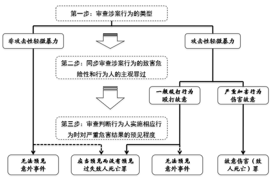
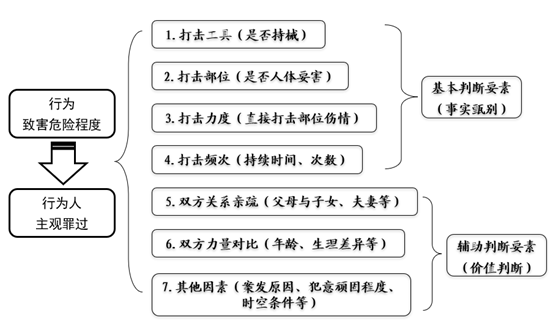

### **轻微暴力致人死亡案件的审理思路和裁判要点**

轻微暴力致人死亡案件是指亲友、邻里或其他人员之间因日常生活琐事突发争执、打斗，造成他人意外死亡的案件。由于这类案件中被告人的主观故意内容较为模糊，客观方面的因果关系较为复杂，实践中经常引发定性分歧与量刑差异。为确保同类案件法律适用的统一性和公正性，现结合典型案例，对该类案件的审理思路和裁判要点进行梳理总结。

一、典型案例

为便于分析问题，从因果关系角度切入，按照暴力行为导致危害结果的原因力大小，将此类案件细分为四种情形：

**案例一：涉及暴力行为直接导致被害人死亡**

被告人曹某因比拼酒量，与同桌被害人唐某发生争执并相互推搡。其间，曹某将处于严重醉酒状态的唐某推倒并压在身下掐其脖颈，致唐某因胃内食物返流呼吸道，造成异物堵塞气管而窒息死亡。检察机关指控曹某犯故意伤害（致人死亡）罪，辩护人认为曹某构成过失致人死亡罪。

**案例二：涉及暴力行为偶合外在介入因素导致被害人死亡**

被告人王某对路过的被害人徐某进行言语调戏。徐某折回进行责问，又遭王某恶语回复，徐某遂抽打王某一记耳光。王某暴怒，双手先后推打徐某的左右肩膀，致徐某在后退过程中被身后驶过的卡车碰撞倒地，头部遭车轮碾压而死。检察机关指控王某犯过失致人死亡罪，一审法院认定王某构成故意伤害（致人死亡）罪，王某不服提出上诉。

**案例三：涉及暴力行为诱发严重疾病导致被害人死亡**

被害人陆某有酒后殴打妻子赵某的陋习。某日，陆某酒后再次追打被告人赵某。赵某在逃离过程中，随手捡起陆某脚上滑脱的一只皮鞋，朝陆某头部和身上抽打两下。两天后，陆某在自身脑血管硬化的基础上，因头部遭受钝性外力作用致闭合性颅脑损伤，引起中枢神经功能障碍死亡。一审法院以故意伤害（致人死亡）罪判处赵某有期徒刑十年，赵某不服提出上诉。

**案例四：涉及非攻击性行为合并被害人自身失误导致被害人死亡**

被告人张某与被害人陶某因争抢座位在公交车上发生争执并推搡。其间，陶某站在车后门处欲将张某拉下车，张某用力转身甩脱陶某奔向车内。陶某后背朝车外踏空摔倒在地，不治身亡。经鉴定，陶某系因左枕部受外力作用致广泛性脑挫伤、硬膜下血肿，蛛网膜下腔出血而死亡。检察机关指控张某犯过失致人死亡罪，辩护人则认为张某的行为属于意外事件，不应负刑事责任。

二、轻微暴力致人死亡案件的审理难点

轻微暴力虽然不是法定概念，但轻微暴力致人死亡案件却存在明显的共性特征：**一是**涉案行为本身具有一定节制性，通常不会直接造成轻伤以上的后果；**二是**涉案行为与其他因素共同导致危害结果发生，是典型的多因一果案件；**三是**行为人主观上对严重危害结果的发生缺乏应有的认知。总体上，该类案件的外观形式与过失致人死亡罪的构成要件行为具有相当性，但是具体案件类型及个案特点又有差异，不能排除认定故意伤害（致人死亡）罪或者意外事件的可能性。司法实践中，主要存在以下两个审理难点：

**（一）故意伤害（致人死亡）罪与过失致人死亡罪区分难**

轻微暴力致人死亡案件中，客观上行为人均实施了故意暴力打击他人的行为，但未直接造成被打部位机体的严重损伤，且暴力打击行为通常在打击工具、打击力度、打击频次、打击部位等方面表现出一定的节制性，难以准确区分涉案行为属于严重加害行为还是一般殴打行为。主观上行为人对死亡结果的发生均持过失心态，难以准确判断行为人是否具有严重伤害他人身体的犯罪故意。此类案件存在故意伤害（致人死亡）罪还是过失致人死亡罪的定性困难。

**（二）过失致人死亡罪与意外事件区分难**

在轻微暴力合并被害人自身失误或诱发严重疾病，抑或偶合外在介入因素致人死亡的案件中，死亡结果由轻微暴力打击、自身疾病或被害人自身失误、外在介入因素等共同导致，因果关系较为复杂，通常难以清楚预见死亡结果的发生，且司法实践中缺乏具有操作性的判断标准，难以准确判断行为人对死亡结果属于“应当预见”还是“无法预见”。此类案件存在过失致人死亡罪还是意外事件的定性困难。

三、轻微暴力致人死亡案件的审理思路和裁判要点

**轻微暴力致人死亡案件的审理，总体上应当立于实质合理性的基础立场适用法律，坚持罪质与罪量要素的统一考量，事实甄别与价值判断的一体运用，最终以实现罪刑相当的刑法基本原则为依归。**具体而言，在厘清个罪内部结构、合理界定个罪规制对象及其边界的基础上可分三步进行审查：**第一步，**审查涉案行为的类型，区分攻击性行为和非攻击性行为；**第二步，**同时审查攻击性行为的致害危险性和行为人的主观故意内容，区分严重加害行为和一般殴打行为以及伤害故意和殴打故意；**第三步，**审查判断行为人在实施相应行为时应否预见严重危害结果的发生，区分行为人是否应承担刑事责任。

**（一）厘清个罪内部结构以准确区分各罪间的罪责界限**

**1****、故意伤害罪**。从罪行结构分析，《刑法》中并列规定罪行的罪状一般都具有三个特征，即罪行之间互不相同、彼此衔接、互不交叉。故意伤害罪包含由轻到重的三个并列罪行，分别是致人轻伤处三年以下有期徒刑、致人重伤处三至十年有期徒刑、致人死亡处十年以上有期徒刑直至死刑。三种行为与结果依次加重，最后一种行为强度理应重于前一种行为。从罪刑关系分析，故意伤害（致人死亡）罪包含故意伤害行为和过失致人死亡行为，最低法定刑是十年有期徒刑，而过失致人死亡罪的最高法定刑是七年有期徒刑，由此可知，故意伤害（致人死亡）罪的伤害行为强度应当至少具有造成他人身体严重伤害的可能性。

**2****、过失致人死亡罪**。从过失犯罪的犯罪构成来看，过失犯罪是指故意实施一般违法或轻微犯罪行为，加上疏忽大意或者过于自信的过失，造成严重危害后果。过失致人死亡罪的罪行必须限定为暴力打击强度较轻的一般殴打行为，行为人主观上仅具有造成他人身体一时疼痛的故意，并不具有严重伤害他人身体的故意。

**3****、意外事件**。根据《刑法》规定，行为在客观上虽然造成了损害结果，但不是出于行为人的故意或者过失，而是不能预见的原因所引起的，不是犯罪。“不能预见”不仅指行为人实施相应行为时没有预见损害结果的发生，而且根据行为人实际能力和当时的具体条件也根本无法预见。

通过剖析个罪内部结构可知，故意伤害（致人死亡）罪与过失致人死亡罪的区分关键在于行为人的主观故意内容和暴力打击强度的轻重程度；过失致人死亡罪与意外事件的区分关键在于行为人对死亡结果是“应当预见”还是“无法预见”。

**（二）同步审查行为致害危险程度和行为人主观罪过，以区分故意伤害（致人死亡）罪和过失致人死亡罪**

轻微暴力致人死亡案件中的涉案行为通常可以分为两类，即攻击性行为和非攻击性行为。非攻击性行为较易区分，一般表现为猛然转身、甩手挣脱等，行为人没有加害被害人的故意，可以直接排除故意伤害（致人死亡）罪。攻击性行为有些表现为推搡、掌掴、拍打等致害危险程度较低的行为，有些则表现为拳击头部、扼压颈部等致害危险程度较高的行为，但是被直接打击部位却没有明显伤势，对该类行为的认定就存在一般殴打行为与严重加害行为的分歧，继而影响行为人主观伤害故意与殴打故意的区分判断。

一般情况下，行为的致害危险性可以通过打击工具、打击部位、打击力度、打击频次等行为构成要素综合判断，以此区分严重加害行为与一般殴打行为。

**1****、打击工具**。所持打击工具为具有一定杀伤力器械的，通常具有高度致害危险性，则更多考虑为严重加害行为；徒手殴打或所持打击工具仅为随手获取的日常用品的，通常不具有高度致害危险性，则更多考虑为一般殴打行为。

**2****、打击部位**。打击部位为人体要害部位，且打击方式通常认为具有高度致害危险的，如手掐脖子、拳击头部等，则更多考虑为严重加害行为；打击部位为非要害部位，且打击方式不具有高度致害危险的，如拍打臀部、掌推胸部等，则更多考虑为一般殴打行为。

**3****、打击力度**。打击力度主要通过被直接打击部位的伤势情况得以反映，若打击力度较大，则更多考虑为严重加害行为；若打击力度较小，则更多考虑为一般殴打行为。

**4****、打击频次**。打击频次主要通过打击时间和打击次数得以反映，若打击频次高，则更多考虑严重加害行为；若打击频次低，则更多考虑为一般殴打行为。

通过以上四个要素，一般可以区分涉案行为属于严重加害行为还是一般殴打行为，再根据主观现于客观，客观反映主观的原则，严重加害行为通常表明行为人具有伤害故意，一般殴打行为通常表明行为人仅有殴打故意，就可以直接认定行为人是否构成故意伤害（致人死亡）罪。然而，当以上四个要素指向不一致而无法直接判断涉案行为属于严重加害行为还是一般殴打行为时，就需要再结合双方关系亲疏程度、双方力量强弱对比等因素认定行为人的主观罪过，进而认定行为人是否构成故意伤害（致人死亡）罪。

**5****、双方关系亲疏程度**。某些特殊关系可以成为排除伤害故意的关键要素，通常情况下，夫妻之间、父母与子女之间一般并无严重加害的故意。如父母出于教育目的，使用随手获取的拖鞋击打年幼子女臀部等非致命部位，年幼子女因承受能力较弱而死亡，一般不宜认定涉案父母具有伤害故意。

**6****、双方力量强弱对比**。力量差异悬殊可以作为认定行为人具有伤害故意的因素。如年轻武术运动员拳打脚踢幼童或老者，只要幼童或老者确因殴打行为而死亡，则一般会认为被告人的行为具有高度致害危险，进而认定其具有伤害故意。

**7****、其他要素。**案发原因、犯意顽固程度、时空条件等可以作为帮助判断行为人主观罪过的要素进行考虑。

如案例一中，被告人曹某系心智正常的成年人，因比拼酒量等生活琐事而打斗，将被害人压在身下用双手掐其脖颈，打击部位和打击力度均表明被告人的行为具有高度致害的危险性，可以认定为严重加害行为。根据主观现于客观的原则，应当认定曹某具有严重伤害他人身体的故意，但结合案发原因、双方关系等因素，可以排除被告人具有杀人的故意，结合自首、积极赔偿等情节，法院以故意伤害（致人死亡）罪减轻判处曹某有期徒刑三年，既充分体现刑法的谦抑精神，又符合罪刑相当原则。

值得注意的是，判断涉案行为究竟是严重加害行为还是一般殴打行为，必须结合具体案情、运用综合评判方法才能得出定论，不可一味沿用常规思维判断。比如，出于犯罪恶意持械追赶他人致其泅水逃避溺水死亡的，应当结合行为人犯意的顽固性、时空条件等因素综合考量，认定持械追赶行为系具有高度致害危险性的严重加害行为，行为人的主观罪过仍然是故意伤害的故意，而非寻衅滋事的故意。

**（三）审查行为人实施相应行为时应否预见死亡结果的发生，以区分过失致人死亡罪与意外事件**

在非攻击性行为和一般殴打行为致人死亡的案件中，审查行为人实施相应行为时应否预见死亡结果的发生，是区分过失致人死亡与意外事件的关键。通常情况下，行为的致害危险性越高、因果关系越简单，危害结果的可预见性就越强，但在涉案行为系非攻击性行为和一般殴打行为的轻微暴力致人死亡案件中，一般是行为人突然转身、拉扯、推搡、掌掴等行为致使被害人倒地磕碰死亡或诱发原有病症发作死亡，行为致害危险性不大、因果关系复杂，难以清晰判断行为人对死亡结果发生的预见程度。至于是否达到“无法预见”的程度，在很多场合下仅凭事实本身可能很难得出明确的结论。在此情形下，有必要引入法律价值取向，据此作出最终取舍和决断。

对于主观事实的认定通常需借助于客观行为表现，依据社会上一般人的认识水准，运用经验法则予以推定，具体可以综合案发时空环境、双方过错程度、行为人的主观状态、被害人的身体状态以及社会普遍观念等因素判断行为人实施相应行为时应否预见严重危害结果的发生。现结合各类案件分析如下：

**1****、一般殴打行为偶合外在介入因素导致被害人死亡的案件，通常构成过失致人死亡罪**。该类案件中，死亡结果通常与案发地点地面不平、空间狭窄或者案发地点存在来往车辆等危险因素有关。对于该类较为显见的外部要素，行为人应当负有更多的注意义务并避免在该种环境下实施可能造成被害人严重伤亡结果的行为。在此情形下，发生“无法预见”意外事件的可能性不大，多为疏忽大意的过失而“没有预见”严重伤亡结果的发生。若行为人故意利用外在介入因素或环境条件加害被害人的，则应以故意犯罪论处。

如案例二中，被告人王某用双手推打被害人的肩膀，一般情况下不足以直接导致被害人产生轻伤以上的后果，属于一般殴打行为，行为人亦无严重伤害他人身体的故意。然而，在车来车往的马路旁边推搡他人，被告人只要稍加留心就可以预见现实危险，只是因为被告人疏忽大意，加之天色已晚，没有注意到驶来的卡车，属于典型的应当预见而没有预见的情形。二审法院最终以过失致人死亡罪对王某判处有期徒刑七年，体现了罪刑相当原则。

**2****、一般殴打行为诱发严重疾病导致被害人死亡的案件，通常情况下构成过失致人死亡罪，但在极少数例外情况下，可能构成意外事件**。该类案件中，行为人可能事先并不知晓被害人患有严重疾病，但是对于徒手打击行为在某些情况下会导致他人受伤甚至死亡，属于基于日常生活经验能够预见的事实，而行为人没有预见，故一般认为其存在过失。然而，当被害人身体表征格外强健，且涉案行为暴力程度确实较小时，不能排除意外事件的可能。

如案例三中，被害人死亡的主要原因系患有脑血管硬化的严重疾病，皮鞋抽打只是外在因素，被告人赵某虽然与被害人系多年夫妻，但并不知晓被害人患有脑血管硬化疾病，在逃离丈夫酒后追打过程中随手拾起一只皮鞋抽打丈夫两下，显然没有严重加害自己丈夫的犯意及行为，应当认定皮鞋抽打的行为仅为一般殴打行为，可以排除故意伤害（致人死亡）罪，但是用皮鞋抽打头部可能会造成一定的危险，属于日常经验能够预见的情形，加之被害人存在严重过错，故二审法院以过失致人死亡罪对赵某从轻处罚，改判有期徒刑三年六个月。

**3****、非攻击性行为合并被害人自身失误导致死亡的案件，通常认定为意外事件，仅在外部环境极为危险的情况下认定为过失犯罪。**该类案件中，行为人并未实施攻击性的暴力行为，在导致死亡结果发生的多重原因中，被害人自身失误占相当大的比重，通常无法要求被告人对被害人的失误行为及其后果迅速作出预判和适当反应。在刑事法律关系上宜作意外事件处理，在民事法律关系上宜依因果关系判定被告人承担必要的赔偿责任，可以起到良好的社会效果。

如案例四中，被告人张某为摆脱被害人的拉扯而用力转身、奔向车内，该行为本身并不会造成对被害人的严重伤害，也无明显过错；被害人死亡的主要原因是自身失误，即因拖拽不住和脚底踏空倒向车外受伤而死亡。在当时的情形下，要求张某对被害人的自身失误行为及其后果作出预判并及时采取避免措施，实为强人所难，故法院最终认定张某的行为属于意外事件，不负刑事责任。

因此，轻微暴力致人死亡案件中，一般认定过失致人死亡罪是适宜的，在暴力行为直接致死与偶合外在介入因素两种场合，行为人对自身行为及其结果的认识程度较高，可能认定故意伤害（致人死亡）罪；在暴力行为诱发严重疾病或合并被害人自身失误的场合，行为人对于危害结果的认识可能性趋小，则可能认定为意外事件。只有区分不同情形分别定罪处罚，才能做到罪刑相当、罚当其罪。

四、其他需要说明的问题

尽管多数案件可以归入上述四种类型作出判断，但实践中总会存在例外，如明知他人患有严重疾病而故意言语激怒、推搡拍打引起严重疾病发作，或故意利用外部环境推搡他人致人死亡的，应当结合具体案情进行综合评判，不排除构成故意伤害（致人死亡）罪或故意杀人罪的可能。在具体量刑上，应当关注类别差异，以实现刑罚处罚的协调性及司法裁判的公正性为依归，除法定量刑情节之外，通常还应当考虑案发原因、双方关系、被害人过错、被告人案发后态度和行为等要素。若量刑畸重又无法定减轻情节的，切不可因量刑不协调而轻易改变定性，可依法定程序层报最高法院在法定刑以下量刑。

（根据刑庭张金玉、潘自强提供材料整理）