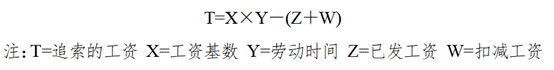
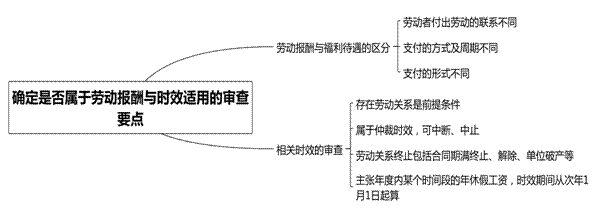
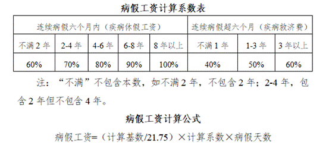
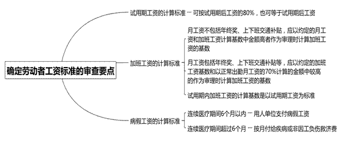
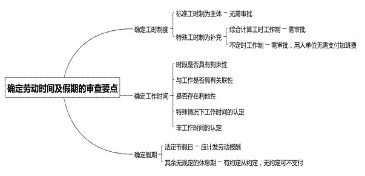
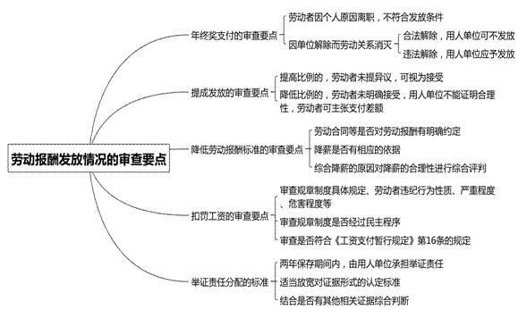

### **追索劳动报酬纠纷案件的审理思路和裁判要点**

劳动报酬即工资，是指劳动关系中劳动者因履行劳动义务而获得的、由用人单位以货币方式支付的对价，包括加班工资、奖金、提成等。追索劳动报酬纠纷案件在劳动争议案件中占比较大，与其他劳动争议案件的不同之处在于，此类案件涉及对劳动者报酬请求权和用人单位工资分配权的平衡保护，且存在劳动报酬与福利待遇区分难、加班工资基数计算难、年终奖支付条件认定难、提成发放条件确定难等问题。因此，有必要以典型案件为基础，对追索劳动报酬纠纷案件的审理思路和裁判要点进行梳理、提炼和总结。

一、典型案例

**案例一：涉及劳动报酬及适用时效的确定**

严某在A公司工作，于2015年提出辞职，并要求A公司支付2005年3月至2014年5月期间应休未休年休假工资。A公司辩称，未休年休假工资属于用人单位应当安排劳动者享受年休假而未安排的福利待遇，并非劳动报酬；严某于2015年11月5日方申请劳动仲裁，2014年之前的年休假工资已超过仲裁时效。

**案例二：涉及加班工资计算基数的认定**

李某在B公司工作，劳动合同约定正常出勤月工资由基本工资、职务津贴、岗位津贴及绩效浮动奖金等组成，加班工资计算基数为基本工资。后李某以B公司长期不按时足额支付劳动报酬为由解除劳动合同，并要求B公司以正常出勤月工资为基数，支付平时延时、休息日及法定节假日加班工资差额。B公司辩称根据双方劳动合同约定，加班费的计算基数应以基本工资为准。

**案例三：涉及年终奖应否支付的审查**

张某在C公司工作，C公司规章制度规定如劳动者严重违纪被解除劳动合同或在发放奖金时已离职，则无任何奖金。2016年和2017年，C公司分别支付张某相应年终奖。2019年初C公司以张某存在辱骂同事、旷工等严重违纪行为为由解除劳动合同。张某认为其未构成严重违纪，公司解除违法，要求C公司支付2018年的年终奖。C公司辩称其与张某未约定年终奖，且根据公司的规章制度，张某属严重违纪被解除劳动合同，故不同意支付张某年终奖。

**案例四：涉及提成发放条件的判断**

王某在D公司工作，劳动合同约定王某工资包括底薪加提成，提成工资根据王某销售业绩予以确定。后王某提出辞职，双方结算劳动报酬时产生争议。D公司认为，销售未回款则公司无法获取利润，故不同意发放未回款部分的销售提成。王某认为，只要其与客户签订销售合同即完成销售任务，销售回款存在多种影响因素，不属于其职责范围，故要求D公司按照销售合同金额发放提成。

二、追索劳动报酬纠纷案件的审理难点

**（一）劳动报酬与福利待遇的区分难**

《劳动争议调解仲裁法》第27条第1款和第4款对劳动报酬仲裁时效与其他劳动争议仲裁时效加以区分，故在审查是否超过时效时需首先确定是否属于劳动报酬纠纷。实践中，劳动报酬的范畴并不十分明确，如未休年休假工资是否属于劳动报酬即存在争议。一种意见认为，未休年休假工资包含“工资”名称，应属劳动报酬，适用特殊时效规定。另一种意见认为，年休假本质是劳动者可以享受的福利待遇，未休年休假工资系对未休年休假劳动者的补偿，仍属福利待遇，应适用普通时效规定。

**（二）加班工资计算基数的确定难**

实践中，在劳动合同约定的加班工资计算基数低于约定的月工资时，如何确定加班工资的计算基数存在争议。一种意见认为，根据《上海市企业工资支付办法》第9条第3款规定，劳动合同对劳动者月工资有明确约定的，加班工资的计算基数应按劳动合同约定的劳动者所在岗位相对应的月工资确定，而非以合同约定的加班工资基数来确定。另一种意见认为，根据该条第2款规定，加班工资和假期工资的计算基数为劳动者所在岗位相对应的正常出勤月工资，法院需先行确定劳动合同约定的月工资是否包括年终奖、上下班交通补贴等。如包括在内，在约定的加班工资基数不低于正常出勤月工资时，从约定；在约定的加班工资基数低于正常出勤月工资时，以正常出勤月工资为标准计算。

**（三）年终奖支付依据的认定难**

现行法律中并未明确规定年终奖的发放方式、数额和发放时间，因此发放年终奖并非用人单位必须承担的强制性义务。对单位规章制度规定“劳动者离职则不发放任何奖金”是否适用，一种意见认为，年终奖也是劳动报酬的一部分，用人单位不能以规章制度排除劳动者获得年终奖的权利。另一种意见认为，年终奖作为激励机制，与工资并不完全等同，并非法律规定用人单位必须承担的支付义务。用人单位在规章制度中已明确规定支付条件且劳动者知晓的，法院应予适用。

**（四）是否符合提成的发放条件认定难**

提成一般与项目进展阶段相关。实践中，提成的发放条件是否成立或合理存在较大争议。如有的用人单位规定货款回收作为提成的发放条件。一种意见认为，该规定并无不当，劳动者离职时劳动成果尚未出现，不符合提成的发放条件，需货款到账后再予支付。另一种意见认为，将销售回款作为提成的发放条件是用人单位将自身经营风险转嫁给劳动者，该规定违反法律禁止性规定，故不具有合理性。

三、追索劳动报酬纠纷案件的审理思路和裁判要点

劳动报酬是劳动者生存的重要保障。依法支持劳动者的劳动报酬请求权，是落实《劳动法》《劳动合同法》保护劳动者合法权益的重要内容。同时，如何维护用人单位合法的经营自主权，促进经济发展和社会进步，不仅是《劳动法》的立法宗旨，也是最终保障全体劳动者合法权益的基石。在追索劳动报酬纠纷案件中，法院要秉持公平与正义，平衡好劳动者与用人单位的合法权利，以构建、发展和谐稳定的劳动关系。

需要注意的是，劳动者通常对数年任职期间的劳动报酬一并提出主张，而用人单位通常提出超过时效的抗辩。因此，法院首先要确定劳动者的主张是否属于劳动报酬以确定所适用的时效，再确定劳动者应获得的工资、加班工资、奖金、提成等具体数额，然后根据劳动者已获得的数额计算出差额。法院在审查中应坚持以合同约定为主、其他依据为辅的原则，平衡保护劳动者报酬请求权和用人单位的经营自主权。对于劳动者追索的工资，法院要注意把握应发和实发两个要素，相关公式如下：

**（一）确定是否属于劳动报酬并确定适用时效**

劳动争议的仲裁时效期间从当事人知道或者应当知道其权利被侵害之日起计算一年，但劳动关系存续期间因拖欠劳动报酬发生争议的，劳动者申请仲裁不受前述仲裁时效期间的限制；劳动关系终止的，应当自劳动关系终止之日起一年内提出。因此，在审理该类案件时，法院首先要确定劳动者主张的是否为劳动报酬，进而确定所适用的时效。

**1****、劳动报酬与福利待遇的区分**

福利待遇不是劳动报酬，仅是按劳分配的补充，是指用人单位在工资和社会保险之外向劳动者及其亲属提供一定货币、实物、服务等形式的物质帮助。两者的区别在于：**一是**与劳动者付出劳动的联系不同。劳动报酬与劳动者的工作岗位，以及付出劳动的质量、数量、强度等要素紧密关联，是劳动者付出劳动后用人单位必须支付的报酬；而福利待遇则与上述要素的关联程度较小。**二是**支付的方式和周期不同。用人单位需按月向劳动者支付劳动报酬；而福利待遇不一定按月支付，且可采用报销等支付方式。**三是**支付的形式不同。劳动报酬以货币形式支付；而福利待遇可以货币、实物、服务等形式支付。例如，年休假是指法律规定的劳动者工作满一定工作年限后，每年享有的保留工作带薪连续休假，与工作年限呈正相关性，与劳动者的工作岗位、劳动质量等要素关联程度较小，故具有福利待遇的属性。用人单位向未休年休假的劳动者支付工资补偿，符合福利待遇的认定范畴。法院在审理未休年休假工资纠纷时不宜将其认定为劳动报酬。

**2****、适用时效的审查**

法院应根据《劳动争议调解仲裁法》第27条第4款、《职工带薪年休假条例》第5条第2款规定，对适用时效进行审查：**一是**存在劳动关系是前提条件。如双方不存在劳动关系而是雇佣、承揽、委托等关系，则不适用该条款的规定。**二是**劳动关系终止后的一年期间属于仲裁时效，可依法中断、中止。**三是**劳动关系终止并不仅限于劳动合同期满终止，还包括用人单位被依法宣告破产、单方解除或双方协商解除劳动合同等。**四是**年休假在一个年度内可集中安排或分段安排，一般不跨年度安排。因此，在劳动关系存续的情况下，如果劳动者只主张年度内某个时间段的应休未休年休假工资，则该年休假工资申请仲裁的时效期间从次年1月1日起算。

如案例一中，严某未休年休假工资属于年休假待遇未安排情况下的福利待遇，并非劳动者固有劳动报酬，其申请仲裁的时效期间为一年。严某直至2015年11月方申请劳动争议仲裁，故其2013年12月31日前的未休年休假工资已超过申请仲裁的法定期限，法院不予支持；严某2014年1月至5月期间应休未休年休假，可在2014年12月31日前安排，故其2015年11月5日申请仲裁时效未超过一年，法院依法应予支持。

****

**（二）确定劳动者工资标准的审查要点**

确定劳动者工资标准时，法院应先审查劳动合同的约定，通过劳动合同确定劳动者的工资标准，然后再审查用人单位规章制度关于薪酬标准的规定。在两者不一致的情况下，应先按劳动合同约定确定劳动者的工资标准，如规章制度规定的标准高于劳动合同的约定，也可按规章制度的相关规定予以认定。当然，无论通过哪种方式确定的工资标准，均不得低于法律规定的最低工资等劳动基准。

此外，根据《最高人民法院关于审理劳动争议案件适用法律问题的解释（一）》第43条规定，用人单位和劳动者双方可以对工资标准加以口头变更，只要已经实际履行口头变更的劳动合同超过一个月，且变更后的标准不违反法律、行政法规、国家政策以及公序良俗的，法院即可予以支持。在无任何约定或规定的情况下，法院也可通过实际履行的支付惯例来确定工资标准。支付惯例的审查应结合支付的周期、金额、款项备注等重复性、规律性的内容进行综合判断。如尚未支付过劳动报酬的，则可根据同岗位、同级别、同时期其他劳动者的工资标准作为确定依据。

**1****、试用期工资的计算标准**

《劳动合同法》第20条规定，劳动者在试用期的工资不得低于本单位相同岗位最低档工资或劳动合同约定工资的80%，并不得低于用人单位所在地的最低工资标准。这里的80%只是工资的下限，并不禁止试用期内的工资等于试用期后的工资。

**2****、加班工资的计算标准**

在劳动合同既约定了月工资，又约定了加班工资计算基数的情况下，在确定加班工资计算基数时应当首先审查约定的月工资是否包括年终奖、上下班交通补贴等。如不包括在内，则应以约定的月工资和加班工资计算基数中金额高者作为审理时计算加班工资的基数。如约定的月工资包括年终奖、上下班交通补贴等，则不应以约定的月工资作为参照，而应以正常出勤月工资的70%作为参照，以约定的加班工资基数和以正常出勤月工资的70%计算的金额中较高的作为审理时计算加班工资的基数。

如案例二中，双方劳动合同约定加班工资计算基数为李某的基本工资，但李某每月固定工资不仅仅为基本工资，还包括职务津贴、岗位津贴及绩效浮动奖金等其他固定组成项目。双方约定的加班工资基数明显低于李某正常出勤月工资的70%，故B公司仅以基本工资为基数计算加班工资缺乏合理性，法院对其主张不予采纳。

需要注意的是，试用期内加班工资的计算基数是以试用期工资为标准，还是以试用期后的工资为标准，在相关劳动法律法规中并无规定。根据公平合理原则，法院应按试用期内工资为标准作为加班工资的计算基数。

**3****、病假工资的计算标准**

对于病假工资的支付，劳动者患病或非因工负伤停止工作治病休息的期间须在医疗期内，且一般不超过6个月。连续医疗期间在6个月以内的，用人单位支付病假工资；连续医疗期间超过6个月时停发病假工资，改由按月支付疾病或非因工负伤疾病救济费。劳动者疾病或非因工负伤休假待遇高于上海市上年度月平均工资的，可按上海市上年度月平均工资计发。

劳动者疾病或非因工负伤休假待遇低于本单位月平均工资40%的，应补足至本单位月平均工资的40%，但不得高于本人原工资水平、不得高于上海市上年度职工月平均工资。用人单位月平均工资的40%低于当年上海市企业职工最低工资标准80%的，应补足至当年上海市企业职工最低工资标准的80%。

此外，根据《上海市企业工资支付办法》第9条规定，病假工资的计算基数为劳动者所在岗位相对应的正常出勤月工资，不包括年终奖、上下班交通补贴、工作餐补贴、住房补贴，中夜班津贴、夏季高温津贴、加班工资等特殊情况下支付的工资。

****

**（三）确定劳动时间及假期的审查要点**

**1****、确定工时制度**

目前，用人单位的工时制度以标准工时制度为主体、特殊工时为补充。特殊工时制度包括综合计算工时工作制和不定时工作制。根据上海市劳动和社会保障局印发的《本市企业实行不定时工作制和综合计算工时工作制的审批办法》第5条规定，综合计算工时工作制和不定时工作制需办理审批手续。用人单位未经审批，双方劳动合同约定为综合计算工时工作制，劳动者工作岗位也确具有综合计算工时工作制特点的，法院需酌情认定劳动报酬。综合计算周期工作超时的，支付1.5倍工资；法定节假日安排工作的，支付3倍工资；不定时工作制下，用人单位无需支付延时加班及休息日加班工资，但要支付法定节假日的加班工资。

**2****、确定工作时间**

对于工作时间的确定，法院应注意以下审查要点：**一是**该时段应对劳动者产生拘束性。拘束性是指用人单位对劳动者在工作时间内劳动力的交换方式享有支配的权利。若该时段内的拘束性真实存在且并非由劳动者自身原因所致，法院可认定劳动者处于工作时间，如疫情期间在家办公，且需定时向单位报送实时地点等。**二是**该时段应与工作具有关联性。如系争时段内劳动者所从事的行为，涉及用人单位的业务或构成生产经营的组成部分，法院可认定该时段为工作时间；反之，如劳动者为用人单位管理人员接送家属、处理婚丧嫁娶等，不宜认定为工作时间。**三是**该时段应对用人单位产生利他性。这需要从劳动者的主观视角进行审查，不以客观结果为标准。即使劳动者在客观上并未给用人单位带来利益，也应认定为工作时间，如以单位名义参与志愿活动等。**四是**特殊情况下工作时间的认定。如被动缺勤的情况下，劳动者因用人单位原因被拒绝进入工作场所，未被安排工作任务，此时也可认定为正常工作时间。**五是**非工作时间的认定。用人单位在电工、拖车司机、工程维修员等特殊岗位中安排的值班，其工作强度、工作要求等方面与正常上班不同。尤其是在有休息设施可以休息的情况下，可不认定为加班，劳动者据此要求支付加班费的，法院可不予支持。当然，加班费诉请不获支持，并不影响劳动者主张值班费等待遇。值班费的具体金额由用人单位规章制度或劳动合同等方式确定。

**3****、确定假期**

在法定节假日、婚假、丧假等假期中，劳动者虽未提供劳动，但用人单位应计发劳动报酬；在其他无法律法规规定的休息期中，对于劳动者未提供劳动可否获得劳动报酬，有约定的从约定，无约定的用人单位可不予支付，如劳动者请事假且无相关约定的，用人单位可不支付工资。当然，用人单位亦不得以劳动者请假为由多扣发其上班期间工资，如规定请事假1天扣2天工资等。此外，劳动者连续请事假期间恰逢法定节假日的，法定节假日应计发工资。

**（四）劳动报酬发放情况的审查要点**

**1****、年终奖支付的审查要点**

追索劳动报酬纠纷案件中关于年终奖的支付，法院需审查劳动合同是否有约定、用人单位规章制度是否有规定、历年年终奖的发放情况以及相应年度的年终奖是否已履行考核程序。其中，对于劳动合同约定或规章制度规定“劳动者因严重违纪被解除劳动合同或在发放奖金时已经离职的没有年终奖”，法院应根据劳动关系消灭的原因适用不同的审理思路。**一是**因劳动者个人原因离职的。由于提前离职系劳动者个人原因，不符合年终奖的发放条件。**二是**因单位解除而劳动关系消灭的。法院应判断用人单位是合法解除还是违法解除。如系合法解除，则用人单位可不发放年终奖；如系违法解除，则可视为用人单位恶意阻却年终奖发放条件的成立，法院应支持劳动者要求支付年终奖的诉请。

如案例三中，张某和C公司之间就年终奖发放事宜未作约定，但双方确认2016年和2017年均发放了年终奖，且C公司确认2018年确有年终奖，但以张某已离职为由拒绝支付。法院确认C公司解除与张某劳动关系系违法解除，故对张某主张C公司支付2018年年终奖的诉请予以支持。

**2****、提成发放的审查要点**

对于提成发放法院需审查劳动合同是否约定、用人单位规章制度是否规定、是否确定提成的计算方法以及实际履行中劳动者是否享有提成的情况。其中，对于劳动者主张的具体项目提成，法院需审查劳动者与获得客户信息、报价、洽谈、签订项目合同、跟单、发货、催款等环节的关联。对于双方已约定提成的计算方法与标准，因提成是劳动报酬的一部分，用人单位需与劳动者协商一致才可变更提成比例。如用人单位单方面提高提成比例，且劳动者未提出异议的，可视为劳动者予以接受；如用人单位单方面降低提成比例或扣除某些费用等，劳动者未明确表示接受的，法院需审查用人单位该行为的合理性。如无法证明合理性，劳动者有权主张支付提成差额，或以“未及时足额支付劳动报酬”为由提出解除劳动合同，用人单位应承担相应的法律责任。

对于部分用人单位提出销售回款后才可发放提成的抗辩，法院应注意以下审查要点：**一是**如用人单位与劳动者约定提成以销售回款为发放条件的，则该约定合法有效，双方应予遵守。**二是**双方对提成以销售回款为发放条件未作约定，而在规章制度中予以规定的，如该规定系经民主程序制定则合法有效。**三是**在双方未作约定且未制定规章制度的情况下，用人单位以销售未回款为由抗辩的，法院不予支持。

需要注意的是，在此类案件中，由于用人单位抗辩销售未回款属于否定性事实，亦无法举证，只能由劳动者承担举证责任。在劳动者已提供初步证据证明销售已回款的前提下，法院应根据案件具体情形确定是否由用人单位对销售回款的具体金额承担举证责任。

如案例四中，D公司与王某之间对是否以销售回款作为提成的发放条件未作约定，亦无规章制度规定。王某付出劳动促使销售合同的签订，且已完成一定数量的工作，故D公司应支付与之相对应的报酬。D公司主张以销售回款作为提成发放条件，是对支付劳动报酬附加额外限制性条件，法院对其不予支持。

**3****、降低劳动报酬标准的审查要点**

在未经劳动者同意的情形下，用人单位原则上不得单方对劳动者的报酬标准予以单方面降低。对于用人单位通过直接或间接方式降低劳动报酬标准的，法院需审查以下几个方面：（1）劳动合同等对劳动报酬是否有明确约定；（2）降薪是否有相应依据，如依据的规章制度是否经过民主程序；（3）综合降薪的原因对降薪的合理性进行综合评判。需要注意的是，在实践中该类案件情况复杂，难以确定统一的标准，法院应结合各案中的具体情形予以综合判断。

**4****、扣罚工资的审查要点**

用人单位出于内部管理需要可以在规章制度中规定，劳动者存在违规行为的扣罚其当月部分工资。然而，工资作为劳动者的生活来源，即使劳动者确有违反劳动纪律或规章制度的，用人单位也不能无正当理由地随意扣罚。对于此类案件，法院需首先审查用人单位相关规章制度的具体规定、劳动者违纪行为性质、严重程度、危害程度等因素，其次需审查规章制度是否经过民主程序，最后还需审查是否符合《工资支付暂行规定》第16条规定，即用人单位每月扣罚的部分不得超过劳动者当月工资的20%，扣罚后的工资亦不得低于单位所在地最低工资标准。需要注意的是，劳动者因违规行为造成用人单位直接经济损失，用人单位解除劳动合同后主张损害赔偿的，不受前述《工资支付暂行规定》第16条规定的限制。

**5****、举证责任分配的标准**

《工资支付暂行规定》第6条规定，用人单位须书面记录支付劳动者工资的数额、时间、领取者的姓名以及签字，并保存两年备查。因此在两年保存期间内，劳动者的工资发放由用人单位承担举证责任。需要注意的是，法院应根据案件具体情况适当放宽对证据形式的认定标准，不宜机械地一概否定无劳动者签字证据的效力。对于用人单位提供的未经劳动者签字认可的考勤记录、工资发放表等证据，法院也不宜简单否定其证明力，应结合是否有其他相关证据进行综合判断。

劳动者主张加班费的，应当就加班事实的存在承担举证责任。在劳动者提供初步证据证明确实存在加班，只是难以确定具体加班时间、时长的情形下，应由劳动者对加班时间、时长作出说明。若用人单位未能提供证据反驳，则法院可在综合劳动者的岗位特点、工作内容、同岗位其他员工的出勤情况等因素基础上综合认定其加班时长。

四、其他需要说明的问题

劳务报酬是指个人独立从事如讲学、咨询、投稿、翻译、技术服务等劳务所得。提供劳务的个人与被服务单位不存在稳定、连续的劳动人事关系和劳动合同关系，其所得也不以工资薪金形式领取。对于劳务关系双方发生的纠纷，法院应按一般合同纠纷案件而非劳动争议案件进行审理。

（根据民事庭蔡建辉、刘皓提供材料整理）