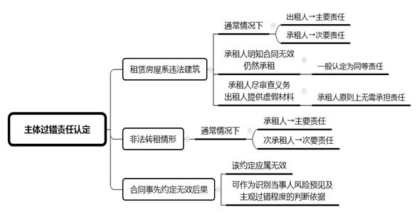
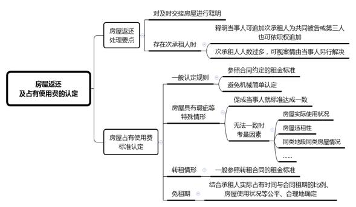

### **无效房屋租赁合同案件的审理思路和裁判要点**

房屋租赁合同纠纷案件是当前房地产类案件中占比最大的案件类型。该类案件的合同效力认定及后果处理是审判实践中面临的首要问题和难点。此前，对于房屋租赁合同效力认定的裁判思路已在第7期审委会类案总结《房屋租赁合同效力认定的审理思路和裁判要点》中作了系统介绍。关于房屋租赁合同被认定无效后应如何处理亦是案件审理裁判的关键，故有必要对该类案件的审理思路和裁判要点予以梳理、归纳和总结。

**一、典型案例**

**案例一：涉及双方当事人的过错认定**

因承租人赵某拖欠房租，出租人刘某诉至法院要求解除合同。后赵某以刘某隐瞒房屋系违法建筑为由，反诉要求确认合同无效，并主张刘某应对合同无效承担全部过错责任。刘某辩称赵某在签约时未对房屋性质进行审查，亦应承担相应过错责任。

**案例二：涉及扩建损失的责任分担**

A公司承租B公司厂房，双方约定A公司可在租赁范围内建造房屋。该房屋所有权归B公司所有，A公司仅有使用权。后A公司所建房屋因属违法建筑被拆除，A公司遂诉至法院要求B公司赔偿扩建损失。

**案例三：涉及房屋占有使用费的认定**

C公司承租D公司房屋，租赁用途为经营餐厅。双方合同约定D公司负有配合C公司办理相关登记手续的义务。后C公司以D公司未提供相应办证所需材料导致其无法经营为由要求解除合同。同时，因房屋系违法建筑导致租赁合同无效，C公司主张仅需按照合同租金标准的40%向D公司支付房屋占有使用费。

**二、无效房屋租赁合同案件的审理难点**

**（一）合同无效后果处理事项繁杂**

房屋租赁合同被认定无效后，法院在处理合同无效后果时会涉及房屋返还、房屋占有使用费、公共事业费用、保证金、押金、装饰装修损失、设备损失、改扩建损失、搬迁补偿款等诸多事项，且往往本诉与反诉交织，如遗漏个别后果处理可能造成双方利益分配的失衡，故审理时存在一定难度。

**（二）导致合同无效的当事人过错认定难**

在无效房屋租赁合同案件中，导致合同无效的情形通常较为复杂。法院在对相关因素进行审查时，尤其对于租赁房屋的产权状态和违法性质等相关事实，往往因租赁房屋建筑年代久远，相关法律法规、政策文件已发生变化，或房屋历经多次改扩建等诸多原因，对当事人的过错认定存在困难。

**（三）无效后果损失认定难**

实践中，租赁房屋系违法建筑是导致租赁合同无效的主要情形。承租人要求出租人赔偿装饰装修或改扩建损失，尤其在租赁房屋因违法性质被拆除或部分拆除、装修现状不复存在的情况下，如何准确认定因合同无效产生的装修等损失是该类案件的审理难点。

**（四）房屋占有使用费确定难**

根据《最高人民法院关于审理城镇房屋租赁合同纠纷案件具体应用法律若干问题的解释》第5条规定，房屋租赁合同无效，当事人请求参照合同约定的租金标准支付房屋占有使用费的，法院一般应予支持。然而，实践中个案情况不尽相同，如在租赁市场价格大幅波动、标的物违法、房屋存在严重质量瑕疵、当事人未实际使用房屋等情况下，法院是否参照、如何参照合同约定的租金标准对房屋占有使用费进行确定存在难度。

**三、无效房屋租赁合同案件的审理思路和裁判要点**

**处理房屋租赁合同无效后果时，法院要根据诚实信用原则，充分考虑当事人的过错程度、房屋使用状况、合同主体义务、合同履行情况等因素，在当事人之间合理分配责任，避免一方因合同无效而获益，实现各方当事人之间利益的救济与平衡**。

**（一）****导致合同无效的主体过错责任认定**

在该类案件中，法院需首先确认导致房屋租赁合同无效的主体过错责任。实践中导致合同无效主要存在两种情形：一是租赁房屋系违法建筑；二是非法转租。

**1****、租赁房屋系违法建筑情形下的主体过错责任认定**

随着环境综合整治行动的开展，因房屋未取得建设工程规划许可证或未按照建设工程规划许可证规定建设，无合法建设手续而认定合同无效的案件占无效房屋租赁合同案件的绝大多数。此种情况下，法院应考虑租赁房屋的产权状态、当事人对房屋的认知情况、承租人是否尽到注意义务、出租人是否存在承诺保证、隐瞒或欺诈等情形，对双方过错责任进行综合认定。

**第一**，提供适租房屋是房屋租赁合同项下出租人的主要义务。通常情况下，出租人作为租赁房屋的管理人或实际控制人，对租赁房屋的实际状况相较承租人而言应更为清楚。在租赁合同因房屋的违法性而无效时，承租人虽然对租赁房屋的状况亦具有审慎的注意义务，但疏于注意的过错程度较轻，应对合同无效造成的损失承担次要责任，具体责任比例由法院视案情酌定。

**第二**，如有证据证明承租人明知合同无效情形仍然承租房屋的，法院一般应认定其与出租人存在同样过错，双方对合同无效造成的损失承担同等责任。

**第三**，如承租人在房屋租赁合同订立过程中已尽到相应注意义务，而出租人提供虚假材料致使承租人有理由相信租赁房屋合法的，对于合同无效造成的损失承租人原则上无需承担责任。

如案例一中，赵某疏于对房屋属性及相应权证进行核查，仅基于出租人的口头保证便签订房屋租赁合同，未尽到相应的注意义务，故法院判决赵某对合同无效承担30%的责任；刘某明知未经审批的自建房屋属于违法建筑，故应对合同无效承担70%的责任。

**2****、非法转租情形下的主体过错责任认定**

承租人未经出租人同意将房屋转租的行为未被法院认定为有效的，承租人在明知的情况下仍与次承租人签订合同，承租人一般应承担主要的过错责任，次承租人在签约前未尽到审慎的注意义务则应承担次要的过错责任。次承租人的审慎义务通常表现为要求出租人出示前手合同或出租人同意转租的证明等。

**3****、合同事先约定无效后果的主体过错责任认定**

实践中，租赁合同中往往对合同无效责任分担直接作出约定，此种约定应属无效。原因在于，该约定不属于《民法典》第507条规定的“合同争议解决条款”，也不属于《民法典》第567条规定的“结算和清算条款”。若法院确认当事人事前对合同无效后果的约定效力，则会与基于法律否定性评价的合同无效后果产生逻辑冲突。

当然，租赁合同被仲裁机构、法院认定为无效后，当事人再就合同无效后果的处理达成一致的，应当认定为有效。需要注意的是，当事人在租赁合同中关于合同无效责任分担的具体约定，在一定程度上可作为识别当事人风险预见和主观过错程度的判断依据。

**（二）合同无效后损失赔偿的认定**

在对导致合同无效的主体过错责任作出认定后，法院应进一步审查损失赔偿的具体范围、标准和数额。此时，既要根据当事人的过错程度合理确定责任，又要避免当事人重复获利的情形。在无效房屋租赁合同案件中，损失赔偿的认定主要涉及房屋装饰装修损失及扩建损失的认定。

**1****、合同无效后损失赔偿的范围认定**

与合同解除情形下合同主体因违约所承担的损失赔偿责任不同，合同无效后当事人所承担的缔约过失责任是对另一方当事人信赖利益损失的赔偿。目的在于补偿一方当事人因合同无效而实际遭受的损失，从而使其利益恢复到合同签订之前的状态。信赖利益不包括、亦不应超过合同履行利益，即合同履行后可以获得的利益。据此，租赁合同无效的损失赔偿范围通常仅包括装饰装修费用、改扩建费用等直接损失，而不包括承租人的经营损失、员工遣散费等间接损失。

**2****、装饰装修损失的认定**

**（****1****）装饰装修损失的审查规则**

房屋租赁合同无效时，法院对房屋装饰装修损失的审查规则如下：

**第一**，在承租人未经出租人同意装饰装修的情况下，产生的损失由承租人自行承担，出租人请求承租人恢复原状或者赔偿损失的，应予支持。然而，实践中承租人的装潢设施往往不易拆离，强行拆除费用过高或导致房屋严重损害，法院应引导当事人充分利用装潢设施，并对添附一方进行适当补偿。

**第二**，在承租人经出租人同意装饰装修的情况下，对于出租人同意利用的装饰装修物，可折价归出租人所有；对于出租人不同意利用的装饰装修物，则应区分情况处理：尚未形成附合的，可由承租人拆除，但应将房屋恢复原状；已经形成附合的，则由双方各自按照导致合同无效的过错责任分担现值损失。

**第三**，房屋租赁合同租期届满但被认定为无效合同的，因承租人在装修投入时对租赁期限及期满后不续约的风险有预估，且承租人在租赁期间已享有全部装饰装修的利益，其租赁目的业已实现，故其装修投入不应再列入合同无效的损失范围。对于承租人以租赁合同无效而主张装饰装修损失的，法院一般不予支持。

**（****2****）装饰装修损失的处理要点**

**第一，关于向承租人的相关释明。**房屋租赁合同被认定无效后，法院应向承租人释明是否就装饰装修损失要求赔偿，承租人坚持不主张或只提出抗辩的，就装饰装修损失法院不予处理，可告知承租人另行起诉。法院判决承租人腾退房屋的，应告知其可就装饰装修物采取必要的证据保全措施以及相应的法律风险。

**第二，关于出租人同意装饰装修的认定。**出租人未明示同意装饰装修的，法院应结合房屋类型、合同约定的租赁用途及合同实际履行情况来认定出租人对承租人装饰装修的意见。出租人根据房屋租赁合同关于租赁用途的约定可以预见承租人装修行为的，或出租人知道或应当知道承租人对租赁房屋进行装饰装修，但在合理期限内未提出异议，又或在合理期限内提出异议后继续履行合同的，法院一般可认定出租人对承租人的装饰装修不持异议。

**第三，关于出租人同意利用装饰装修物的认定。**在房屋未被拆除或尚未确认拆除的情形下，关于出租人是否同意利用装饰装修物，法院应根据个案中装饰装修实际使用状况、生活日常经验以及装饰装修的实际利用价值综合予以认定。出租人在诉讼中就是否同意利用装饰装修的意见前后不一的，除出租人已作出合理解释，或有充分证据证明装饰装修无法利用，如已拆除或即将拆除的情形之外，法院一般不宜轻易认定出租人不同意利用装饰装修物。

**（****3****）装饰装修损失的计算方法**

与合同解除情形下装饰装修损失的计算以残值损失为准不同，合同无效后的装饰装修损失计算只应考虑在合同被确认无效时尚存在的实际价值，即以现值损失为准。

一般情况下，现值损失的认定可采用“现存价值评估法”予以确定，即对纠纷发生时现存装饰装修物进行工程造价鉴定。具体数额可根据个案中装饰装修物的性质、使用寿命、损耗程度、实际剩余利用价值及市场行情等因素予以综合认定，避免一方额外获益。在装饰装修物价值较小且双方对数额争议不大时，应尽量促成当事人就装饰装修物价值达成一致意见，以减少当事人的诉讼成本。

需要注意的是，在租赁房屋已被拆除或部分拆除的情形下，如有其它证据反映装饰装修现状的，如相关装修合同、支付凭证、拆除前现场照片等，法院可委托鉴定机构对现值损失予以评估。根据现有证据材料无法进行鉴定的，应区分个案不同情况对承租人装饰装修损失予以认定。如因不可归责于承租人的原因导致其举证困难的，法院可适用举证缓和规则，以保护承租人的合法权益。

**3****、扩建损失的认定**

**（****1****）扩建损失的审查规则**

合同无效时，在承租人未经出租人同意扩建的情况下，产生的损失由承租人自行承担。在承租人经出租人同意扩建的情况下，双方对扩建费用的处理没有达成一致但办理合法建设手续的，扩建费用由出租人负担；未办理合法建设手续的，由双方按照过错责任分担。

需要注意的是，法院对双方的过错责任及损失的认定，可根据合同的相关约定、租赁标的物本身的合法性、双方的报建义务、配合行为、扩建受益情况、扩建规模、风险控制、造价费用现值等因素，结合当事人的主观过错，确定合理的责任比例及损失金额。

**（****2****）承租人自行扩建部分损失的处理要点**

无效房屋租赁合同案件中，承租人自行扩建，该建筑物因系违法建筑被拆除后，承租人要求出租人分担损失的，法院应结合承租人是否要求办理建设手续、是否对违法建筑物风险得以预见、出租人是否因该建筑物收取租金等因素予以综合认定。

如案例二中，因B公司出租的厂房本身不具备合法建设手续，在此基础上扩建后的建筑物取得合法手续的可能性较小，故对于扩建部分拆除的风险，B公司应有预见能力，但B公司仍持放任态度同意A公司扩建，其应就相关损失承担次要责任。因此，法院判决B公司赔偿A公司一定比例的扩建费用损失。

**（****3****）扩建损失的计算方法**

与装饰装修物处理中计算现值损失不同，扩建损失以扩建物的造价为标准。基于平衡双方利益的考虑，法院计算该类损失时一般可采用工程造价费用支出法，即以扩建时承租人实际支付的工程造价费用作为扩建损失。实践中，具体数额可根据个案中扩建物的使用状况、实际利用价值、出租人的扩建受益情况、市价波动、政策形势等因素予以综合认定，避免任何一方因合同无效而获益。

**（三）房屋返还及占有使用费的认定**

房屋租赁合同被认定无效后，依据无效合同的处理原则，承租人应返还因合同取得的财产，包括租赁房屋及实际占有房屋所获取的占有利益；出租人则应返还承租人因签订合同所获取的利益如租金、保证金等。实践中承租人应返还的财产与出租人应返还的租金等可相互抵扣。

**1****、房屋返还的处理要点**

**（****1****）关于及时交接房屋的释明**

无效房屋租赁合同案件中，因牵涉事项较多，往往需启动司法鉴定程序，审理期限较长，法院应先充分询问当事人关于租赁房屋的使用现状。如租赁房屋已处于无人使用的空置状态，法院应引导双方当事人及时交接租赁房屋，以避免双方在诉讼期间损失的进一步扩大。

**（****2****）关于次承租人返还房屋的释明**

房屋租赁合同被认定无效后，出租人既可依约要求承租人返还房屋，亦可在实际使用人系次承租人的情况下，以房屋所有权人的名义要求次承租人腾退房屋。出租人仅以承租人为被告提起诉讼的，法院可向其释明，告知其可追加次承租人为共同被告，或者申请通知次承租人作为无独立请求权第三人参加诉讼；法院也可直接通知次承租人作为无独立请求权第三人参加诉讼。如次承租人人数过多，且诉求利益各不相同，则法院不宜追加次承租人为第三人，可根据案件具体情况，由当事人另行解决。

**2****、房屋占有使用费的标准认定**

**（****1****）房屋占有使用费的一般认定规则**

合同无效情形下房屋占有使用费的认定并无绝对标准，但当事人请求参照合同约定的租金标准支付房屋占有使用费的，法院一般应予支持。在审理时法院应避免简单、机械地以租赁合同中的租金标准确定占有使用费标准，要充分考虑承租人经营或添附等行为与房屋增值或贬值之间的关联性，避免利益失衡。

**（****2****）特殊情形下房屋占有使用费的标准认定**

在标的物违法、房屋具有重大瑕疵不能正常使用，或因租赁合同期限较长，租赁市场价格发生大幅波动、合同约定的租金标准明显背离市场价格的情况下，如完全参照合同约定的租金标准确定占有使用费则有失公平。此时，法院应促成双方当事人就使用费标准达成一致；无法达成一致的，可审查承租人对房屋的实际使用状况、房屋适租性、承租人是否对房屋质量问题提出异议、要求修复以及合同目的是否实现等多项因素，并参考同类地段同类房屋的租金情况，合理认定占有使用费的计算标准及调整比例。

如案例三中，C公司使用涉案房屋对外正常经营已持续较长时间，法院结合C公司使用涉案房屋的情况及导致合同无效的原因、租赁市场价格变动情况、房屋瑕疵、合同履行状况等因素综合认定C公司应按照合同租金标准的60%支付房屋占有使用费。

**（****3****）转租情形下房屋占有使用费的标准认定**

因房屋被次承租人继续占有使用而不能返还，出租人请求参照租赁合同或转租合同的租金标准，向承租人或次承租人主张逾期返还房屋占有使用费的，法院一般应予支持。基于对租金标准的合理性、市场行情以及促使次承租人尽快搬离等因素的考虑，法院一般应参照转租合同的租金标准认定出租人向次承租人收取房屋占有使用费，具体标准还需根据实际案情具体判断。

**（****4****）免租期内房屋占有使用费的标准认定**

无效房屋租赁合同案件中约定的免租期条款应同时无效。承租人应返还免租期内占有房屋所获取的利益，即出租人有权基于不当得利向承租人主张该期间的房屋占有使用费。一般情况下，出租人在免租期内的收益实质体现在租赁期内所收取的租金总额中，如在租期履行完毕的情形下，可理解为出租人已实际实现免租期的收益，故其无权再行主张。因此，基于公平原则，法院应在参照合同约定租金标准的情况下，结合承租人实际占有房屋的时间与合同约定租期的比例，以及房屋能否正常使用等履行状况，公平、合理地确定免租期内的房屋占有使用费。

**四、其他需要说明的问题**

在违建房屋整治过程中，如出租人就装饰装修及扩建房屋部分等获得补偿，因该补偿不属于合同无效所导致的后果，承租人要求对该补偿进行分割的，法院不可直接将其作为合同无效后果进行处理，应当结合补偿协议内容、补偿项目及构成、承租人的贡献大小等因素予以综合认定。

（根据民事庭凌捷、熊洋提供材料整理）