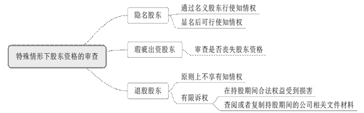
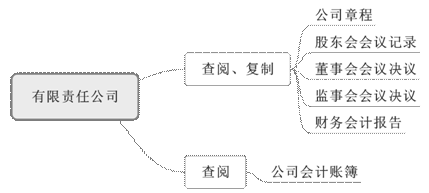
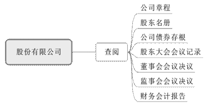
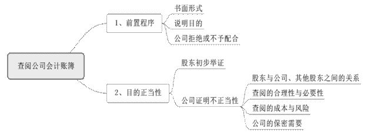

### **股东知情权纠纷案件的审理思路和裁判要点**

股东知情权是股东享有的基础性权利，有助于中小股东了解公司经营状况、监督公司经营管理、维护自身合法权益，也是股东实现决策权、分红权以及进行相关诉讼的基础和前提。实践中存在股东行使知情权边界不清晰、具体裁判标准不统一等问题。为依法保护股东知情权的有效行使，兼顾查阅的合理性与必要性，平衡股东知情与公司保密之间的关系，同时进一步提升此类案件的审理效率，本文选取典型案例进行分析、梳理，结合法律规范和司法实践中的审理难点，总结股东知情权纠纷案件的审理思路和裁判要点。

**一、典型案例**

**案例一：涉及股东知情权主体资格的认定**

A公司系股份有限公司。B公司曾与C公司达成口头的代持股协议，将C公司持有的A公司股权登记在B公司名下。B公司向A公司发函要求查阅、复制A公司相关文件，A公司拒绝提供。现B公司以其作为A公司的登记股东有权行使股东知情权为由起诉至法院，A公司则主张B公司并非实际出资人，不具备行使股东知情权的资格。

**案例二：涉及股东知情权客体范围的认定**

陈某是D公司的股东，其向D公司发函要求查阅公司财务会计报告、会计账簿（包括账簿会计报表、记账凭证、原始凭证、审计报告、评估报告等）、全部合同文本，查看现存货物、出入库清单、货物清单，D公司未作回应。现陈某起诉至法院要求D公司配合其行使股东知情权，D公司则主张陈某提出查看合同文本、存货、清单等没有法律依据。

**案例三：涉及查阅会计账簿具有不正当目的的认定**

张某作为E公司持股50%的股东，多次向E公司寄送查阅公司会计账簿的书面请求并说明查账目的，E公司未给予任何答复。现张某起诉至法院要求E公司提供会计账簿供查阅以便进行资产评估和股权转让，E公司则主张因张某在与E公司有竞争关系的F公司工作，其查阅公司会计账簿具有不正当目的。

**二、股东知情权纠纷案件的审理难点**

**（一）股东知情权主体资格的认定难**

股东权利与股东身份不可分离，因此股东知情权的权利主体自然是公司股东。公司章程、股东之间的协议等均不能剥夺股东的该项权利，而涉及隐名股东、瑕疵出资股东、退股股东等股东身份争议是知情权行使主体资格审查的重点。《公司法司法解释四》第7条将公司原股东行使知情权条件限定为“有初步证据证明在持股期间其合法权益受到损害”，但显然现有条文尚不能涵盖所有争议类型，司法实践中的裁判观点也不尽一致。

**（二）股东知情权客体范围的框定难**

《公司法》采用列举的方式明确规定了股东知情权的客体范围。然而，在诉讼中股东经常会就其他文件材料主张知情权，有些明显超出法律规定范围，有些则在性质上存在争议，通常集中在股东能否查阅公司会计凭证。对于这些《公司法》尚未明确规定的文件材料，司法实践中并不存在统一的分类和裁判标准。《公司法司法解释四》正式出台前曾在征求意见稿中规定股东可以查阅会计凭证，可见已经注意到扩大股东知情权客体范围的实践诉求。对于这些虽不属于法定材料范围，但可能与法定材料存在高度关联的客体，法院在裁判时应当审查股东了解公司经营状况所需材料的合理性和必要性。

**（三）“查阅会计账簿有不正当目的”的判断难**

会计账簿是公司的核心资料。《公司法》第33条规定了股东查阅公司会计账簿的程序和要求，其核心在于确保股东查账目的具有正当性、不损害公司合法利益，否则公司有权拒绝提供查阅。目前对判断目的正当与否并无统一的审查标准，《公司法司法解释四》第8条以列举的方式对可能存在的不正当目的加以细化，并且以股东有不正当目的的其他情形作为兜底条款。上述规定虽然在一定程度上明确了公司拒绝提供查阅的范围，但对于具体情形的认定尚需法院在个案中合理分配举证责任，根据相关事实和证据材料进行具体认定。

**三、股东知情权纠纷案件的审理思路和裁判要点**

《公司法》第33、97条明确了股东查阅、复制公司相关文件材料的权利，《公司法司法解释四》则对适用细则作了进一步明确。**法院应当坚持审慎原则依法进行裁判，注重原则性和灵活性相结合，在个案审查中兼顾股东知情权的保护和公司的正常经营及有效治理。**

**（一）主体资格的审查步骤和要点**

**1****、一般原则**

公司股东是知情权的行使主体，但法律并未对股东的股权份额作出限定，也即持有任意比例股份的股东均可提起股东知情权诉讼。公司有证据证明原告在起诉时不具有股东资格的，法院应当驳回起诉。对此类纠纷中原告主体资格的审查要点在于股东资格的确认。对公司股东身份的审查应以公司登记信息为依据，同时注意隐名股东、瑕疵出资股东、退股股东这三类特殊情形。股东资格存在争议的，当事人应先提起股东资格确认之诉。

**2****、隐名股东的审查步骤和要点**

隐名股东由于缺乏具有公示效力的股东身份证明，一般只能通过名义股东行使知情权。法院原则上应当驳回隐名股东关于知情权的诉请，但隐名股东已经或正在履行相应的显名手续，且公司和其他股东均认可其股东身份的，法院可允许其行使股东知情权。

如案例一中，B公司是A公司的登记股东但非实际出资人，其主体资格的认定是该案的争议所在。由于C公司另案提起股东资格确认之诉并经生效裁判确认，同时A公司其他半数以上股东亦认可C公司为A公司实际股东，法院认为在C公司成为A公司股权的实际持有人后，B公司因丧失股东身份而失去行使股东知情权的资格，故对B公司的查阅诉请不予支持。

**3****、瑕疵出资股东的审查步骤和要点**

根据《公司法》的规定，股东应当按期足额缴纳公司章程中规定的认缴出资额。未到认缴期限并不影响股东行使知情权；已到认缴期限而股东未按期足额缴纳的，属于股东违反对公司的出资义务，瑕疵出资股东依法承担补足出资责任和对已出资股东的违约责任，但并不直接导致其丧失股东资格。如果公司仅以股东存在瑕疵出资为由拒绝其行使知情权，法院不予支持。

如果有限责任公司的股东未履行出资义务或者抽逃全部出资，经公司催告缴纳或者返还，在合理期间内仍未缴纳或者返还出资的，公司可以通过股东会决议解除其股东资格。如果公司能够证明股东存在瑕疵出资，且公司股东会已经决议解除其股东资格，法院应当驳回股东行使知情权的诉请。

**4****、退股股东的审查步骤和要点**

退出公司的原股东一般因丧失股东资格而不再享有股东知情权。然而，《公司法司法解释四》第7条赋予公司原股东有限诉权，即考虑到保护公司原股东在持股期间的合法权益，允许其查阅或者复制持股期间公司的特定文件材料。退股股东负有举证责任证明其在持股期间的合法权益受到损害，如公司真实经营状况被隐瞒导致原股东在转让股权时利益受损等。

**（二）被查阅客体范围的审查步骤和要点**

**1****、审查是否属于法律规定的客体范围**

《公司法》第33、97条分别对有限责任公司和股份有限公司股东知情权的客体范围作了明确规定。审查中应当注意以下几点：

**第一**，有限责任公司股东有权查阅、复制的范围包括公司章程、股东会会议记录、董事会会议决议、监事会会议决议和财务会计报告；可以要求查阅的是公司会计账簿但附有条件。

**第二**，股份有限公司股东有权查阅的范围包括公司章程、股东名册、公司债券存根、股东大会会议记录、董事会会议决议、监事会会议决议、财务会计报告，在行使方式上并不包括复制。

**第三**，财务会计报告由会计报表、会计报表附注和财务情况说明书组成，会计账簿包括总账、明细账、日记账和其他辅助性账簿。

**第四**，对于符合法律规定范围、行使方式适当的股东知情权诉请，法院应予支持。对于规定范围之外的材料查询请求，由于缺乏法律依据法院一般不予支持，但由于公司文件材料形式具有多样性，为确保股东知情权的有效行使，法院可以依据该原则进行个案审查。

**2****、非规定材料的审查要点**

**（****1****）会计凭证**

会计凭证是在股东知情权诉请中最常见的非规定材料。法院的审查要点在于会计账簿能否满足股东了解公司经营状况的需要。根据《会计法》规定，会计凭证包括原始凭证和记账凭证，会计账簿登记必须以经过审核的会计凭证为依据，并符合法律、行政法规以及国家统一会计制度的相关规定。虽然《公司法》没有明文规定有限责任公司股东可以查阅会计凭证，但在实践中，股东经常将会计凭证和会计账簿一起列为查阅对象。通常而言，不应当随意超越法律的规定扩张解释股东知情权的范畴，但由于股东仅凭会计账簿未必能完全知晓公司的经营状况，会计凭证往往能够充分直接反映公司的实际经营状况，故应当从确保所查阅会计账簿的有效性、信息的真实性等角度予以审查。当会计凭证对于会计账簿的查阅具有必要性和印证作用，或者会计账簿确实存在明显问题时，法院可支持股东查阅会计凭证的诉请。

**（****2****）其他非规定材料的审查要点**

考虑到股东知情权制度的立法本意，法院应当遵循以下思路进行审查。

**首先**，《公司法司法解释四》第7条规定，股东可以依据公司章程起诉请求查阅或者复制公司特定文件材料，故公司章程对查阅程序和范围作出明确规定的，法院应当依照章程的规定进行审查。

**其次**，公司章程未对查阅程序和范围作出规定的，法院不宜随意扩大知情权的客体范围，而应审慎审查以下几个方面：**一是**股东的查阅目的；**二是**知情权的行使是否超出股东了解公司经营状况的合理范畴，特别是在已经查阅法定材料的前提下，再要求查阅非规定材料的必要性、所要求查阅材料与待印证法定材料的关联性、查阅行为是否损害公司的合法权益等。法院经审查后认定股东的查阅目的并无不当且确有查阅必要性的，可以支持股东的诉请。

如案例二中，法院将陈某行使股东知情权的客体范围分为三类进行审查：第一类财务会计报告，已由《公司法》明文规定，故予以支持；第二类会计账簿及作为会计凭证的相关原始资料，直接影响记账的真实性和完整性，故予以支持；第三类是合同文本及存货部分，明显超出法律规定范围，且并无证据证明D公司提供的法定材料不真实、不完整，故未予支持。

**3****、公司不愿提供或无法提供材料的审查要点**

公司如果提出股东主张的文件材料不存在，法院应当根据具体情况作出相应处理：

**第一**，公司有充分证据证明确实无法提供的，如存在失窃、失火并有处置记录的，而股东并无充分证据反驳其主张的，对股东的诉请不予支持；对于公司能够部分提供文件材料的法院仍应予以支持，或者要求公司在合理时间补齐材料供股东查阅或复制。

**第二**，公司以股东已知悉公司经营和财务状况或者已通过其他方式获取相关文件材料为由不愿提供的，法院经审查认为属于公司能够提供的，对股东诉请仍应予以支持。

**（三）查阅公司会计账簿条件的审查步骤和要点**

**1****、审查前置程序**

股东诉请查阅公司会计账簿必须经过前置程序，即股东应当首先向公司提出书面请求并说明查阅目的，公司自股东提出书面请求之日起十五日内拒绝提供查阅或不配合股东查阅请求的，方才符合前置程序要求。

如果股东未履行公司内部救济程序而直接起诉要求行使查阅权的，法院驳回股东诉讼请求。实践中需重点审查查阅请求是否以书面形式提出、是否说明查阅目的、公司是否明确拒绝或逾期不予配合，并应结合公司和股东的实际情况判断前置程序的履行是否存在瑕疵。股东未履行完整的前置程序也并不必然导致诉讼条件未成就，当股东穷尽所知公司地址仍无法有效送达、无法联系，即股东向公司提出书面请求不具备客观条件的，对公司关于前置程序存在瑕疵的抗辩不予支持。

**2****、审查股东查阅目的**

**（****1****）审查法定列举的不正当目的**

股东应当初步举证查阅目的的正当性。《公司法司法解释四》第8条列举了股东查阅公司会计账簿不正当目的的常见情形，包括股东自营或者为他人经营与公司主营业务有实质性竞争关系业务的，但公司章程另有规定或者全体股东另有约定的除外；股东为了向他人通报有关信息查阅公司会计账簿，可能损害公司合法利益的；股东在向公司提出查阅请求之日前的三年内，曾通过查阅公司会计账簿，向他人通报有关信息损害公司合法利益的。经审查符合上述三种列举情形的，法院对股东的诉请不予支持。

需特别注意的是，公司主张适用《公司法司法解释四》第8条关于同业竞争的认定。**首先**，股东在投资目标公司外另对其他公司进行投资属于正常的商业行为，我国《公司法》对此并无禁止性规定。“股东自营或者为他人经营”强调股东实际参与其他公司的经营决策或者担任其他公司的相关职务，仅凭其他公司股东的身份或者与其他公司存在关联关系并不必然导致其丧失查阅权。**其次**，同业竞争涉及到“公司主营业务和实质性竞争关系”的界定，需注意以下两点：**一是**主营业务是指企业为完成其经营目标而从事的日常主要活动，通常根据公司的经营范围加以确定，但并非主营业务范围相同或相似，就认定两者之间必然存在实质性竞争关系，进而认定股东行使知情权具有不正当目的。**二是**经营范围仅作为判断是否构成实质性竞争的考量因素之一，法院还应审查经营的时间和区域、商品和服务的可替代性、客户范围、公司市场地位和交易机会等，审查标准实质在于避免损害公司合法利益。

如案例三中，法院认为E公司并未提供充分证据证明张某系F公司股东或在F公司就职，F公司与E公司的经营范围和主营业务并非完全重合，仅凭F公司的宣传手册、活动照片、招聘信息等无法直接证明两公司间业务构成实质性竞争关系，E公司并未举证证明张某行为具有损害其合法利益的不正当目的，故对张某的查阅请求予以支持。

**（****2****）审查非列举情形的不正当目的**

司法实践中，公司提出的不正当性抗辩主要包括：股东与公司管理层或其他股东存在矛盾、为其他诉讼收集证据、侵害公司商业秘密或其他利益等，公司对此应承担相应的举证责任。法院对于股东是否确实存在不正当目的应当遵循诚实信用原则，审查其与公司及其他股东之间的关系、查阅的合理性与必要性、查阅的成本与风险、公司的保密需要等。

****

**（四）裁判主文的表述与执行**

根据《公司法司法解释四》第10条规定，法院如果支持股东行使知情权的诉讼请求，应当在判决中明确查阅或者复制公司特定文件材料的时间、地点和特定文件材料的名录。裁判主文应表述为“（公司名）于本判决生效之日起（数字）日内在（地点）向（股东名字）提供自（年月日）至（年月日）止的（文件材料名）供（股东名字）查阅（复制）。”

具体执行过程中，在提起知情权诉讼股东在场的情况下，查阅公司文件材料可以由会计师、律师等依法或者依据执业行为规范负有保密义务的中介机构执业人员辅助进行。对于股东及相关辅助人员在行使知情权后泄露公司商业秘密导致公司合法利益受到损害的，公司有权请求其赔偿相关损失。

（根据商事庭黄英、钱滢提供材料整理）