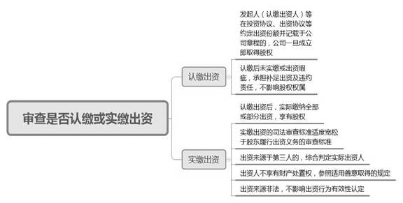
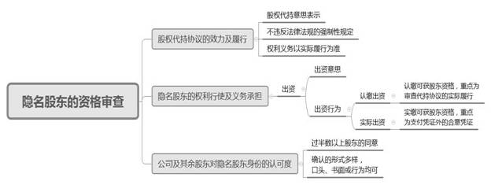
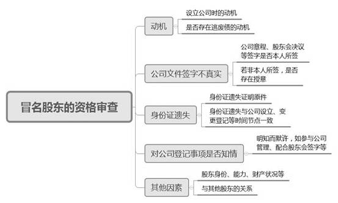

### **股东资格确认纠纷案件的审理思路和裁判要点**

股东资格是公司自治与股东行权的基础，股东资格的认定也是审理其他公司类案件的前提。伴随商事活动的活跃与创新，公司结构日趋复杂多样，股东资格确认纠纷案件数量呈上升趋势。对于该类案件实践中普遍采取“双重标准，内外有别”的审查原则，即对内采取实质审查标准，以出资为核心加以审查；对外采取形式审查标准，以登记为核心进行审查。对本文的涵摄范围，作以下三点说明：**第一**，该类案件绝大部分为非股东要求成为股东之诉，真实股东的查明确认过程实为公司内部治理问题，因此倾向于采取实质审查标准。**第二**，该类案件解决的重点为股东资格有无问题，而非股权比例问题。**第三**，反向股东资格确认主要是冒名股东的认定，不包括股权出让、股东除名等股东资格丧失的情形。

**一、典型案例**

**案例一：涉及出资意思的认定**

施甲与A公司签订《股权代持投资协议》，约定合作设立公司，A公司出资55%并将部分股权委托施甲代持，登记股东为施甲持股98%、A公司持股2%。后B公司成立，该公司名称、注册资本与协议一致，但登记股东为施甲持股98%、施乙持股2%，组织机构、管理人员等信息也与协议约定不符。现A公司起诉请求确认其为B公司股东。

**案例二：涉及出资行为的认定**

丁某与陈某原系夫妻关系，且均为C公司登记股东。C公司增资过程中，丁某将D公司向其签发的500万元本票背书后以增资款名义投入C公司。陈某则向D公司出具承诺书，证明500万元增资对应的股权由丁某代D公司持有。现D公司以其为C公司的实际出资人为由请求确认其为C公司股东。

**案例三：涉及行使股东权利的认定**

张某、李某为E公司股东。张某将F公司所汇款项用于E公司经营，后F公司被G公司合并。李某与G公司间存在大量电子邮件往来，涉及E公司财务状况、人事安排、工资发放等事项。现G公司以实际向E公司出资并行使股东权利为由，请求确认其为E公司股东。

**案例四：涉及冒名股东的认定**

孙某、韩某为H公司股东。H公司通过股东会决议，吸收严某为公司股东。严某从个人账户转入H公司1000万元用于验资，后抽逃出资。胡某起诉要求严某在抽逃出资范围内对H公司所负债务承担补充赔偿责任。严某辩称工商档案中相关文件上签名并非其本人所签，对验资及工商变更事项均不知情，因此其并非H公司股东，也无需承担责任。

**二、股东资格确认纠纷案件的审理难点**

股东资格是当事人出资后作为公司股东的身份与地位。囿于公司结构的复杂性、公司经营的持续性及公司事务的交错性，股东资格确认纠纷案件在事实认定层面涉及主体多、时间跨度长、法律关系繁，在法律适用层面存在较大的自由裁量空间，主要有四个方面的审理难点。

**（一）出资意思精准识别难**

出资意思是指当事人（包括发起人和认股人）在公司设立或者增加资本时，根据协议约定、法律和章程的规定向公司交付财产或履行其他给付义务而取得股权的意思表示。出资意思一般以书面形式予以固定，如出资协议书、增资协议书、公司章程等。因出资协议为非要式合同，实践中存在出资协议等书面材料缺失、效力瑕疵、约定不明、条款冲突等情形，给股东出资意思的识别带来障碍。面对基础性协议缺失的情形，法院需通过其它书面材料或当事人行为审查认定出资意思，但书面材料的选取、证明效力的排序及论证思路并未形成统一标准。

**（二）出资行为有效认定难**

出资行为是认定股权归属的重要判断依据。实践中，完成财产交付并非认定出资行为有效的充分条件，资金来源、价值评估、登记与否均影响出资行为有效的认定。由于存在隐名股东，资金来源可能影响实际出资人的判定。同时，在认缴制背景下，实际出资不再是股东身份认定的必要条件。因此，实践中对股东资格确认纠纷中出资行为有效的认定存在不同观点。

**（三）股东行权效果核定难**

股东依法享有资产收益、参与决策、选择管理者等权利。实践中，法院认定因实际行使股东权利而获得股东身份的证据，侧重于获得分红和实际参与公司经营。针对公司分红，普遍存在往来款项名称记载不一致、缺乏股东会决议、与法定分红的实质要件不符等现实困难。针对参与公司经营，在所有权与经营权分离的现代公司治理模式下，参与公司经营与股东身份之间并不具有必然联系。判断当事人的经营活动与股东身份是否存在法律上的因果关系，需结合参与公司经营的方式、时间、其余股东的认知等因素综合认定。

**（四）冒名股东身份确定难**

冒名股东为股东资格的反向确认，旨在推翻登记的公示推定效力，进而免除登记股东补足出资责任及对公司债务不能清偿部分的赔偿责任。对此，法院在审查过程中通常持审慎态度，对主张被冒名者适用较为严格的证明标准。主张被冒名者多能够举证证明公司登记申请材料、公司章程、股东会决议等材料上非本人签字。实践中，由于对被冒名者成为公司股东意思的缺失、对名义被冒用不知情等要件的举证难度较大，法院对认定主张被冒名者主观态度的客观证据相对有限，最终被法院认定为冒名股东的情形较少。

**三、股东资格确认纠纷案件的审理思路和裁判要点**

**法院审理股东资格确认纠纷案件应秉持审慎原则和综合审查原则，注重审查出资意思真实性、意思主体和被出资法人的知悉程度，兼顾第三人利益与交易安全，围绕《民法典》《公司法》及《公司法司法解释三》的相关规定予以审查**。具体审查步骤如下：

**（一）审查程序性事项**

当事人向法院起诉请求确认其股东资格的，应当以标的法人为被告，与案件争议股权有利害关系的人作为第三人参加诉讼。法院审查应注意三方面问题：**第一**，股东资格确认之诉的原告包括股东与非股东、隐名股东与名义股东，但应与标的法人具有法律上的利害关系。**第二**，即使原告实现自身利益的主要障碍是名义股东，但仍应以标的法人为被告，以该名义股东为第三人。**第三**，股东资格确认纠纷不适用诉讼时效。

**（二）审查股东出资的标的法人性质及状态**

法院应审查股东出资的标的法人是否为有效存续的营利法人，审查要点主要包括：**第一**，审查标的法人是否属于《民法典》第76条规定的营利法人，主要为有限责任公司、股份有限公司，排除包括事业单位、社会团体、基金会、社会服务机构等非营利法人，农村集体经济组织、城镇农村的合作经济组织等特别法人，以及个人独资企业、合伙企业等非法人组织。**第二**，审查标的法人是否有效存续。若法人未依法设立或已注销，则法院可直接驳回确认股东资格的诉讼请求。

**（三）审查股权权属**

股东资格与股权权属密不可分。审理股东资格确认纠纷，法院应查明股权的真实归属。依据当事人取得股权途径的不同，法院应从股权原始取得与继受取得两个类别分别予以审查：

**1****、原始取得情形下股权归属的审查步骤**

以股权原始取得为基础享有股东身份者包括公司设立的发起人及公司增资时的新股东。在该情形下，法院应围绕是否存在出资或增资合意、是否实际或认缴出资两个维度进行审查。

**（****1****）审查是否存在股权性出资或增资合意**

当事人向公司转让财产或财产性权利的行为存在多种可能性，如借贷或其他双务有偿合同的履行行为。当事人的股东资格与其他法律关系相区别的关键，在于其与公司间存在股权性出资或增资合意。审查要点主要包括：

**第一**，审查股东之间或股东与公司之间的基础性书面协议，如发起人协议、出资协议、增资认购协议等。协议内容需具体明确，一般应包括股东名称、标的公司、股本总额、出资或增资金额、持股比例、认缴期限等。协议应为双方真实意思表示，不存在效力瑕疵且符合公司设立、增资等法律规定。

如案例一中，施甲与A公司约定设立的标的公司与实际设立的B公司在名称及注册资本上均一致，但约定设立标的公司的登记股东、持股比例、组织机构、公司高管与B公司设立后的情形完全不同，难以认定施甲与A公司约定设立的标的公司即为本案中的B公司。因此，A公司对约定设立公司的出资意思表示并不能完全指向实际设立的B公司，故难以确认A公司为B公司股东。

**第二**，如缺乏书面协议，则公司章程、股东名册、出资证明书、工商登记资料等具备股权性合意的推定效力。股东名册、出资证明书、工商登记资料因为属于证权文件而非设权文件，所以可被相反证据所推翻。如上述材料间存在记载冲突，实践中倾向于以公司章程的记载作为认定股权归属的主要依据。

**第三**，针对股权代持、职工持股会等非直接持股的，除审查上述文件外，尚需进一步审查股权代持协议、职工持股计划等材料以明确股权性合意的真正主体。

**（****2****）审查是否认缴或实缴出资**

****

出资是股东取得股权的实质要件，当事人主张对公司享有股权或股东资格，需要证明已依法向公司出资或认缴出资。

**在认缴出资情形下**，审查要点主要包括：**第一**，一般情况下，发起人（认缴出资人）在投资协议、出资协议等约定出资份额并记载于公司章程的，在公司成立时即取得股权。**第二**，认缴出资后未实际出资或出资瑕疵仅产生未按期缴纳出资的补足出资责任、向其他足额出资股东承担的违约责任以及在公司未能清偿范围内对公司债权人的补充赔偿责任，但并不当然阻却其股权的取得。

**在实缴出资情形下**，审查要点主要包括：

**第一**，认缴出资后，实际缴纳全部或部分出资的，依法享有股权。

**第二**，缺乏书面认缴出资协议但向公司实际出资的，可认定其享有股权。股东资格确认层面上的出资认定比股东出资审查上的出资认定更为宽松。当事人向公司交付财产后虽未严格履行评估、变更登记、验资等手续而导致存在出资瑕疵，在能证明具有出资意思且公司认可的情形下，一般倾向于认定已实际出资。

**第三**，股东出资来源于公司外人员的，法院应结合两者身份关系、是否具备代持合意、是否行使股东权利等因素综合判断是否存在委托投资、共同投资、赠予、借还款等其他法律关系，以确定实际出资人。相应的举证责任应分配给主张委托出资关系的一方。

如案例二中，D公司向银行申请500万元本票，票据收款人为丁某，该500万元本票经丁某背书后进入C公司账户作为丁某的增资款。代持股承诺书虽有D公司对C公司出资500万元、丁某系代D公司持股并进行工商登记的内容，但该份承诺书并无丁某签字确认，而系由陈某代签。虽然陈某与丁某原系夫妻关系，但对涉及如此大额的企业资产权属确认，显然不宜适用夫妻之间家事代理权作出认定。D公司的财务账册中亦不能反映存在其所称的500万元对外投资及相应收益。因此，500万元并非D公司直接向C公司支付的款项，而仍应认定为丁某向C公司的增资款。

**第四**，出资人以不享有处分权的财产出资，当事人之间对于出资行为效力产生争议的，法院可以参照善意取得的规定予以认定。

**第五**，出资来源非法并不当然影响出资行为的有效性。以贪污、挪用等违法犯罪所得的货币出资后取得股权的，对违法行为进行追究、处罚时，应采取拍卖或变卖方式处置其股权。

**2****、继受取得情形下股权归属的审查步骤**

以股权继受取得为基础取得股权的途径，包括在公司存续期间依法受让、获赠、继承股权。在该情形下，法院应围绕股东转让协议是否有效、是否完成有效的股权变更、股权变更是否通知公司三个层面进行审查。

**（****1****）审查股权继受的基础协议是否有效**

关于股权继受的基础协议是否有效，法院应依据股权变更基础法律关系的不同分别予以审查。**第一**，以股权转让方式取得股权。首先，需确定股权转让人与受让人之间存在股权转让的真实意思表示，排除名为股权转让实为融资担保等其他法律关系。其次，股权转让协议不存在《民法典》规定的效力瑕疵，也应满足《公司法》就股东优先购买权、股份禁售期等规定。**第二**，以股权赠与方式取得股权。与一般的赠与合同不同，以股权为标的物的赠与实质上为股权的无偿转让，实践中比照股权转让的方式予以认定。**第三**，以继承方式取得股权。法定继承不以协议为基础，遗嘱继承的协议效力比照一般遗嘱进行审查。

**（****2****）审查是否完成有效的股权变更**

在股权继受基础协议有效的前提下，法院应进一步审查股权变更的完成情况。**第一**，以股权转让或股权赠与获得股权。对于如何判定“已经受让股权”，《公司法》及司法解释均未加以规定。当事人在协议中有约定的从约定，没有约定的实践中多以股权转让协议实际履行作为股权受让的标准。**第二**，以继承方式取得股权。自然人股东死亡后，其合法继承人可以继承股东资格。如公司章程中并无禁止性规定则继承人可继承股份，同时继承被继承人作为股东的各项权利和义务；如公司对股权转移的事实或效力持有异议，可由法院进行审查并作出判断，股东自法院认定的股权转移生效时取得股权。

**（****3****）审查股权变更是否通知公司**

在股权继受取得中，股东从原股东处取得股权，无论是公司股东之间还是股东与非股东之间的股权转移，均不以事先通知并取得公司认可为前提，但应在转移完成后通知公司。审查要点主要包括：**第一**，待股权变更完成后，股东应就股权变更事宜通知公司，以便公司办理内部及外部变更登记手续。此处的通知应作宽泛理解，即将各种足以将股权变更事实传达给公司的方式均产生通知效力。**第二**，通知后公司应修改公司章程和股东名册中有关股东及其出资额的记载，对公司章程的该项修改无须审查是否已召开股东会进行表决。

**（四）实际行使股东权利的审查要点**

行使股东权利、履行股东义务是具备股东身份的外部表征。审查要点主要包括：**第一**，审查公司章程、股东会决议等，确定参与股东会、行使表决权的人员身份。**第二**，审查公司是否进行股息分红及获得分红的主体。需要注意的是，实践中经常出现的固定红利不符合《公司法》对于盈余分配的规定，而更类似于名股实债的固定回报，不应据此认定当事人实际享有股东权利。**第三**，担任总经理等高管职务、公司实际控制人、参与制定公司经营策略、影响公司经营方针等非以股东身份为必须的管理行为不具有股东身份的证明效力，无需作为审查重点。

如案例三中，李某与G公司间存在大量的电子邮件往来，涉及E公司的财务状况、人事安排、工资发放等事项。李某向G公司沟通E公司的经营情况，可说明G公司的决策意见对E公司产生较大影响力，但经营行为与股东身份并无直接关联，难以认定G公司已实际行使了股东权利。

**（五）违反法律法规强制性规定的审查要点**

法律对特定类型公司的股东身份及特定主体担任公司股东作出限制，审查要点主要包括：**第一**，在国家规定实施准入特别管理（负面清单）的外商投资企业中，股东确定或变更应经外商投资企业审批机关的同意。**第二**，股份合作制企业的个人股东应具有企业职工的身份，职工退休或离职即丧失作为股东的基础。**第三**，金融机构的法人股东，尤其是控股股东应满足金融监管法律的相关要求，并向金融监督管理部门报告、备案或申请核准。**第四**，国有企业员工持股应符合国资委、财政部等发布的限制性与禁止性规定。**第五**，会计事务所、审计事务所、律师事务所和资产评估机构不得作为其他行业公司股东。

**（六）特殊情形下股东资格的审查要点**

****

**1****、隐名股东的资格审查步骤**

《公司法》虽规定应将股东姓名或名称进行注册登记，但并未明确规定只有注册登记才能取得股东身份及股权份额，故注册登记仅是证权程序而非设权程序。实践中，存在大量注册登记的股东与实际股东不一致的情形，法院应从股权代持协议的效力及履行、隐名股东的权利行使及义务承担，以及公司及其余股东对隐名股东身份的认可度三个方面进行综合认定，主要审查要点如下：

**（****1****）认定股权代持协议的效力及履行情况**

法院应根据《民法典》对有限责任公司中隐名股东与名义股东之间股权代持协议进行效力认定。**第一**，隐名股东与名义股东之间是否存在股权代持的真实意思表示。该意思表示可细分为隐名股东有意成为公司股东的意思表示和委托显名股东代持股权的意思表示，两者缺一不可。**第二**，股权代持协议是否存在《民法典》第153、154条规定的无效情形。部分股权代持是为规避行业准入的限制性规定，如关于外商投资限制准入行业的规定、国家公职人员禁止投资或入股的规定等，部分是为提高公司经营的便利性，如避免成为一人公司、员工委托持股等，不同情形应区别对待。**第三**，隐名股东与名义股东的实际履行与股权代持协议的内容也可能存在偏差。法院在判定名义股东代为持股的客观状态是否与约定一致时，应综合协议约定的标的公司、代持方式、代持比例等多种因素予以确定。

**（****2****）认定隐名股东的权利行使及义务承担**

在股权代持情形下，法院应根据上述一般情形下股东权利行使的认定标准，并结合委托范围对隐名股东的权利行使予以认定。隐名股东的义务承担主要是出资义务，审查要点主要包括：**第一**，隐名股东向公司支付款项应基于其作为股东履行出资义务，而非对公司的借贷或赠与。在隐名股东出资后，若将出资款进行股转债，则该款项因为出资意思已发生转换而不应被认定为出资。**第二**，根据《公司法司法解释三》规定，对隐名股东出资的认定侧重于实际出资。实践中，被认定为有效出资的情形主要有三种：支付凭证+代持协议、支付凭证+摘要备注出资款、支付凭证+实际行使股东权利。

在当前认缴制背景下，隐名股东认缴出资后委托他人代持也应产生同样的法律效果。对于股权代持协议签订后是否实际履行，审查要点主要包括：**第一**，审查代持协议的签订时间。签订于公司成立之后或系争法律关系发生之后的代持协议，即事后确认型代持协议在没有相反证据的情形下，倾向于认定已实际履行。**第二**，审查相关交易。伴随公司增资、并购重组、股权转让等相关交易的代持协议履行情况，应参考相关交易的履行程度予以认定。**第三**，审查股东权利的行使。审查隐名股东是否参与股东会、获得分红或行使其他股东权利。**第四**，审查其余股东的认可程度。审查协议签订后公司和双方当事人之间形成的其他书面材料，查明双方当事人、公司及其余股东对股权代持事项所表明的态度。

**（****3****）认定公司及其余股东对隐名股东身份的认可度**

实践中，公司及其余股东对于隐名股东身份的认可方式较为多样。公司的认可既包括书面方式的确认，如在章程、股东会决议、出资证明书的明确记载，也包括行为方式的确认，如接受出资、接受其行使股东权利、向其分配股息红利等。其余股东的认可既包括公司日常经营活动中的确认，如股东之间的往来函件、微信记录等，也包括诉讼过程中的当庭确认。依据公司内部关系审查实质重于形式的原则，只要隐名股东能够证明其股东资格或显名主张已得到公司其他股东过半数的确认，且对其实际行使股东权利没有提出异议的，法院应当认定隐名股东身份并进行显名，并不要求以公司决议的方式就隐名股东身份加以确认或对显名问题进行表决。

**2****、冒名股东的审查步骤**

被冒名者没有成为公司股东的意思表示，也没有行使任何股东权益，不应将其视为法律上的股东，继而不应当赋予其任何股东的权利与义务。

实践中，法院对冒名股东的认定适用较为严格的审查标准，审查要点主要包括：

**第一**，审查主张被冒名者是否存在成为公司股东的动机。同时，严格审查主张被冒名者是否存在逃废债的动机，避免损害公司已知或未知债权人的合法权益。

**第二**，公司的章程、股东会决议、股权转让协议以及设立公司时所提交资料上的签名是否为本人签字，如非本人签字是否为授意签字。

**第三**，被冒名者需初步举证证明冒名者未经授权持有其身份证原件，应提供在被冒名登记期间遗失身份证的报失证明原件等。

**第四**，被冒名者对工商登记等事宜是否知情，如果其知情但未反对的，则不应被认定为冒名登记。

**第五**，综合考虑其他因素，如被冒名登记的股东与冒名股东或其他股东的关系，以及被冒名登记股东的身份、财产情况，被冒名登记的股东是否参与公司管理、是否参加过股东会、是否有分红等因素进行判断。主张被冒名者应就冒名事实的存在承担举证责任。

如案例四中，H公司通过股东会决议吸收严某为H公司股东，增资验资已完成。即使相关文件上的签名并非其本人所签，但严某是在H公司法定代表人许诺给予其公司20%股份的情况下加入H公司，并担任公司总裁，具体负责公司经营。严某还根据公司要求向公司提供其身份证等相关个人资料。因此，可认定严某对担任股东一事是知晓、默认的，并且从未就此提出异议，其要求确认并非H公司股东的主张不能得到支持。

**四、其他需要说明的问题**

股东资格确认问题是股东知情权、股东出资、公司解散等其他类型公司纠纷中亟需解决的基础性问题。依据相关法律规定，股东知情权纠纷及相关的公司决议撤销纠纷等可与股东资格确认纠纷一并审理。如隐名股东在执行异议之诉中要求确认股东资格，因两项诉请不属必要的共同诉讼，故不应合并审理。

（根据商事庭郑军欢、俞悦提供材料整理）