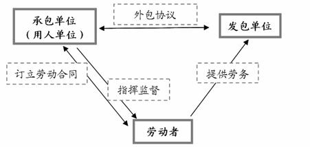
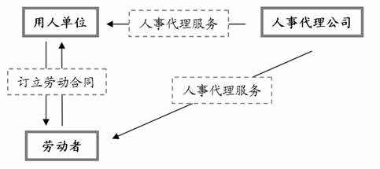
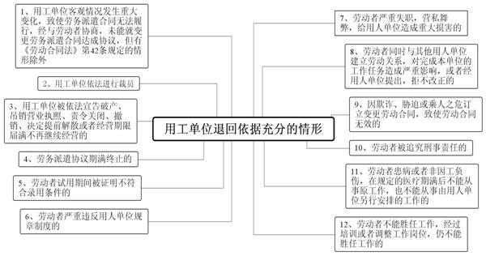
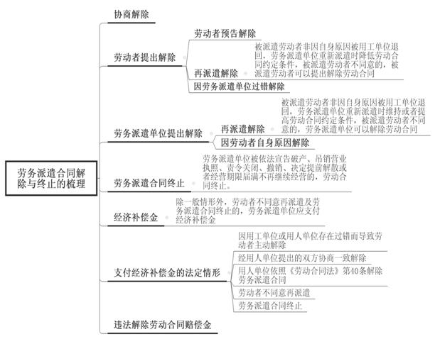

### **劳务派遣合同纠纷案件的审理思路和裁判要点**

劳务派遣是指由劳务派遣单位与被派遣劳动者签订劳动合同，然后向用工单位派出该劳动者，使其在用工单位的工作场所内劳动，接受用工单位的指挥、监督，以完成劳动力和生产资料结合的一种特殊用工方式。劳务派遣合同纠纷案件即主要围绕劳务派遣用工产生的各类争议案件。审理该类案件需要把握劳务派遣合同下劳动力的雇佣与使用相分离的特点，厘清不同法律主体项下的法律责任。为提高该类案件的办理质量与效率，现以典型案件为基础，对劳务派遣合同纠纷案件的审理思路和裁判方法进行提炼和归纳。

**一、典型案例**

**案例一：涉及劳务派遣法律关系的认定**

汪某与A公司签订劳动合同，约定汪某同意由A公司安排至公司项目部担任操作工，项目部服务客户为B公司；合同期内B公司项目为临时性项目，当项目结束或生产发生变化等原因导致工作量减少时，汪某同意按照A公司安排调剂至其他项目部工作。后B公司以汪某在工作中出现重大失误导致严重经济损失为由将其退回。汪某遂主张与A公司、B公司存在劳务派遣关系。

**案例二：涉及劳务派遣期间法律责任的确定**

于某与C公司签订劳务派遣合同，约定于某经C公司派遣至D公司工作，派遣期间月工资由用工单位D公司支付。C公司与D公司另有合同约定D公司承担于某的工伤责任。后于某在劳务派遣工作期内工伤，鉴定为因工致残程度八级。现于某提起仲裁，要求C公司支付一次性伤残就业补助金等。

**案例三：涉及劳务派遣退回的审查**

李某经E公司派遣至F公司工作。在派遣期限内，李某因病退回至E公司，其后李某提交为期半年的病假申请，E公司依照本市平均工资标准发放李某病假工资。李某病假期届满后，E公司向其发送通知称“因F公司将你退回且不再向你续聘，鉴于你病假期满，我公司通知你前来报到，并与你继续履行劳动合同。”E公司在重新派遣期内根据当地政府规定的最低工资标准支付报酬。现李某要求E公司依照原工资标准支付重新派遣期内工资。

**二、劳务派遣合同纠纷案件的审理难点**

**（一）劳务派遣法律关系认定难**

劳务派遣法律关系既有别于劳动关系，也与普通民商事合同关系不同。首先，劳务派遣法律关系从形式上较易与劳动合同关系、劳务外包关系、人事代理关系等混淆，导致案件审理中不同法律关系下的事实与法律适用难以甄别。其次，劳务派遣的用工模式需要行政许可，部分单位未经行政许可或用工模式不规范的情形下开展劳务派遣用工，导致审判实践中劳务派遣法律关系的认定存在难点。最后，劳务派遣法律关系的特殊性在于劳动力的雇佣与使用相分离，审判实践中对这一实质特征的具体理解与把握存在难度。

**（二）劳务派遣中法律责任把握难**

劳务派遣法律责任承担中较为复杂的是连带责任认定，对此审判实践存在单向连带责任与双向连带责任两种理解。2008年1月1日起施行的《劳动合同法》第92条规定，给被派遣劳动者权益造成损害的，劳务派遣单位与用工单位承担连带赔偿责任，该条通常理解为双向连带责任。修改后于2013年7月1日起施行的《劳动合同法》改为用工单位给被派遣劳动者造成损害的，劳务派遣单位与用工单位承担连带赔偿责任。此条多理解为用工单位给派遣劳动者造成损害时，由用工单位承担责任，劳务派遣单位承担连带责任；反之，由劳务派遣单位承担责任时，用工单位不承担连带责任，即单向连带责任。由此，法律修订导致审判实践中就劳务派遣的连带责任把握不一，相应法律责任的承担主体也有不同理解。

**（三）被派遣劳动者退回后的具体处理难**

用工单位退回劳动者后，劳务派遣单位通常直接依据用工单位的退回理由与劳动者解除劳动合同。由此导致审查劳动合同是否系违法解除时，法院需要综合考虑用工单位的退回理由与劳务派遣单位的解除理由，增加相关事实的认定难度。

同时，劳动者在退回劳务派遣单位后，在无工作期间劳务派遣单位应按照不低于所在地人民政府规定的最低工资标准按月支付劳动报酬。部分劳动者主张其在劳务派遣期间工资待遇高，在无工作期间仅享受地方最低工资标准有失公平。另有部分劳动者主张其因病、工伤、女职工三期遭到用工单位退回，无工作期间的工资待遇应参照病假、工伤、女职工三期法律规定发放工资。上述情形导致劳动者被退回后，工资标准的认定在审判实践中存在一定难度。

**三、劳务派遣合同纠纷案件的审理思路和裁判要点**

**审理劳务派遣合同纠纷案件应注重区分劳动者、劳务派遣单位、用工单位的主体地位及相应的权利义务，区分不同法律关系下的责任界定，在承担主体上厘清劳务派遣单位与用工单位的法律责任，有序规范劳务派遣用工，充分发挥劳务派遣用工的作用，维护被派遣劳动者的合法权益。**

**（一）劳务派遣法律关系认定的审查要点**

审查劳务派遣法律关系认定应注意以下几项要点：**第一**，有效结合形式要件与实质要件，确认劳务派遣法律关系是否成立；**第二**，注意区分劳务外包关系、人事代理关系等较易混淆的法律关系；**第三**，审慎认定违反派遣用工行政法律规定的劳务派遣法律关系。

**1****、劳务派遣法律关系认定的一般情形**

**（****1****）形式要件：劳务派遣法律关系涉及三方主体**

劳务派遣法律关系在形式要件上涉及三方主体，分别是劳动者、劳务派遣单位与用工单位。由此产生三重法律关系：一是劳务派遣单位与劳动者的劳动合同关系，双方形成订立劳动合同的合意；二是劳务派遣单位与用工单位的民事合同关系，双方形成订立劳务派遣协议的合意，劳务派遣单位将劳动者派遣至用工单位工作；三是劳动者与用工单位系实际用工关系，劳动者向用工单位提供劳务，用工单位对劳动者指挥监督。

****

**（****2****）实质要件：劳动力雇佣与使用相分离**

普通劳动关系是劳动者向用人单位提供劳动力、接受用人单位的监督以获取劳动报酬。然而在劳务派遣法律关系中，劳动者受劳务派遣单位的雇佣，却向用工单位提供劳动力。劳动力的雇佣与使用相分离是劳务派遣法律关系区别于其他法律关系的本质特征。

如案例一中，虽涉及三方主体，但在形式要件上A公司与B公司并未达成劳务派遣的合意。同时汪某在实际履职中受A公司的雇佣与指挥，也不具备劳务派遣法律关系的本质特征，故汪某主张三方存在劳务派遣关系法院未予支持。

**2****、劳务派遣法律关系认定的特殊情形**

**（****1****）与劳务外包关系的区别**

劳务外包关系，一般是发包单位将企业的部分业务或者服务以外包协议的方式发包给承包单位，承包单位自行招录并指派劳动者为发包单位提供外包协议约定的劳务内容。

劳务派遣法律关系与劳务外包关系的本质区别在于：在劳务外包关系中，发包单位接受劳动者劳务，但不对劳动者进行直接管理；在劳务派遣法律关系中，用工单位接受劳动者劳务，并对劳动者进行管理。

在实际审理中，应结合用工单位的规章制度、行使指挥管理权的强弱程度等因素综合判断，注意审查以下几点：**第一**，如发包单位基于消防、安全生产、工作场所秩序等管理需要向劳动者行使部分指挥管理权的，不能简单认定为劳务派遣关系，而要结合案件具体情况审慎处理。**第二**，如发包单位名为承揽、外包，但实则与承包单位采用劳务派遣用工形式的，应认定为劳务派遣法律关系。**第三**，如劳务派遣单位将用工形式转换为劳务外包的，应结合案件具体情况，审慎判断是否仍构成劳务派遣法律关系。

**（****2****）与人事代理关系的区别**

人事代理关系，是指用人单位与劳动者直接订立劳动合同，但将劳动者的人事档案管理、社会养老保险金收缴等人事管理内容委托给第三方人事代理公司。

劳务派遣法律关系与人事代理关系的本质区别在于：在人事代理关系中，第三方人事代理公司仅提供劳动者社保缴纳等服务，不参与对劳动者的实际管理，劳动者也不向其提供劳务。在审判实践中要注意审查法律关系的区别，实为人事代理关系但劳动者坚持主张其与第三方人事代理公司存在劳务派遣关系的，法院不予支持。

**（****3****）未经行政许可擅自经营派遣业务的审查要点**

经营劳务派遣业务应具备法律规定的行政许可条件，在实际审理中发现，部分劳务派遣单位不具备劳务派遣资质却与劳动者订立劳动合同，与实际用工单位订立派遣协议，原则上不影响劳动合同的效力认定。案件审理时应遵循以下两点：

**第一**，劳务派遣单位虽不具备相应资质，但用工单位需要继续使用劳动者，劳动者也同意在用工单位工作的，劳动者与用工单位的劳动关系于明确达成合意之时成立。

**第二**，用工单位与劳动者就劳动关系成立未能达成合意的，对争议发生前的权利义务可以按原协议履行，劳动者与劳务派遣单位按照现有劳动合同履行。

**（****4****）用工单位违规使用派遣用工的审查要点**

根据《劳动合同法》第66条，劳务派遣用工是企业用工的补充形式，只能在临时性、辅助性或替代性的工作岗位上实施（即劳务派遣三性规定）。在审判实践中，部分用工单位为规避劳动法律风险，并未遵循劳务派遣三性规定。

就用工单位违反劳务派遣三性规定使用劳务派遣用工的，案件审理应遵循以下几点：**第一**，如劳务派遣合同不存在法律规定合同无效的情形，原则上应认定有效。**第二**，劳动者要求突破劳务派遣法律关系，确认与用工单位存在事实劳动关系的，不予支持。**第三**，用工单位因违反劳务派遣三性规定，给被派遣劳动者造成损害的，依法承担赔偿责任。**第四**，因劳务派遣三性规定属于行政管理性规定，劳动者如要求确认某具体岗位是否属于三性岗位的，不属于劳动争议案件受理范围，法院应不予受理。

**（二）劳务派遣合同履行中法律责任承担的审查要点**

审查劳务派遣合同履行中的法律责任应注意以下几点：**第一**，需要厘清不同主体之间的法律关系，确定应当承担法律责任的当事人。**第二**，对于他方当事人是否应当承担连带责任，主要结合有无相应法律规定以及是否符合承担连带责任的条件。**第三**，双方当事人就法律责任承担另有约定的，不得对抗第三方当事人。

**1****、劳动者工资支付法律责任承担的审查要点**

工资是企业以货币形式支付给劳动者的劳动报酬，包括基本劳动报酬、奖金、津贴、补贴以及加班工资等。

**（****1****）劳动报酬的法律责任承担**

《劳动合同法》第58条规定，劳务派遣单位按月支付劳动报酬。因此，劳动报酬的支付主体是劳务派遣单位，劳务派遣单位不得以用工单位未及时支付管理费等原因拖欠劳动者劳动报酬。即便实际由用工单位发放劳动报酬，用工单位未能及时支付的，也应由劳务派遣单位承担法律责任。

**（****2****）加班费、绩效奖金、福利待遇的法律责任承担**

《劳动合同法》第62条规定，用工单位应当履行支付加班费、绩效奖金、提供与工作岗位相关的福利待遇等义务。《劳务派遣暂行规定》第9条明确，用工单位应当向被派遣劳动者提供与工作岗位相关的福利待遇，不得歧视被派遣劳动者。因此，加班费、绩效奖金、福利待遇应由用工单位支付。

加班费、绩效奖金、福利待遇与劳动报酬的支付主体存在区别的原因在于：劳务派遣关系中用工单位结合生产经营情况组织劳动者加班、发放绩效奖金与福利待遇，属于用工单位的具体工作安排与激励设置，无法在劳务派遣协议中提前约定，故应由用工单位支付。因此，如用工单位未及时足额支付加班费、绩效奖金、福利待遇的，应由用工单位承担法律责任，劳务派遣单位承担连带责任。

**2****、工伤赔偿法律责任承担的审查要点**

劳动者在用工单位因工作遭受事故伤害时，由劳务派遣单位申请工伤认定，用工单位协助工伤认定的调查核实工作，劳务派遣单位承担工伤保险责任，劳务派遣单位可以与用工单位约定协商补偿办法，但双方协商结果不得对抗被派遣劳动者。

根据《劳动合同法》第62条规定，用工单位应当履行执行国家劳动标准，提供相应的劳动条件和劳动保护的义务。劳动者因用工单位未履行上述义务导致工伤的，劳务派遣单位承担工伤赔偿责任后，可以用工单位未尽法律义务为由，向用工单位主张相应赔偿。

如案例二中，就于某主张的工伤赔偿，虽C、D公司另行约定由用工单位D公司承担工伤赔偿责任，但C、D公司的内部协商约定不应对抗被派遣劳动者，故劳务派遣单位C公司应承担工伤赔偿责任。

**（三）被派遣劳动者被退回以及解除劳动合同的审查要点**

审查被派遣劳动者被退回以及被退回而解除劳动合同时应注意以下几项要点：**第一**，注意区分退回主体与解除主体。**第二**，综合分析用工单位退回被派遣劳动者依据是否充分。**第三**，审慎界定被派遣劳动者退回后的工资待遇以及相应的法律责任。**第四**，审查劳务派遣单位解除劳动合同的依据是否具备合法合理性，不能仅凭用工单位退回依据为准。

**1****、退回主体与解除主体的区分**

劳务派遣法律关系的退回主体是用工单位。由于用工单位与劳动者不存在劳动关系，用工单位不能直接与劳动者解除劳动合同，而需将劳动者退回劳务派遣单位。劳务派遣法律关系中的解除主体是劳务派遣单位与劳动者。劳务派遣单位与劳动者存在劳动合同，故双方均可以提出解除。

**2****、用工单位退回依据的审查**

用工单位将劳动者退回劳务派遣单位的，法院应审查用工单位退回依据是否充分。根据《劳务派遣暂行规定》第12条、《劳动合同法》第65条规定，具备用工单位客观经营情况、劳务派遣协议期满终止或劳动者不符合录用条件、严重违纪违法、不能胜任工作等情形的，法院可以认定用工单位退回依据充分。用工单位未依照上述规定退回的，一般视为退回依据不充分。

**3****、劳动者被退回后的工资待遇**

劳动者被用工单位退回的，劳务派遣单位应在劳动者无工作期间按照不低于所在地人民政府规定的最低工资标准按月支付报酬，且不能随意解除劳动合同。此处“无工作期间”可以理解为劳务派遣单位未依约派遣劳动者、因客观情况导致派遣无法完成或劳动者虽被用工单位退回又未解除合同等情形。

劳动者因工伤、病假及女职工三期等情形导致用工退回的，劳动者被退回后的工资待遇可根据工伤、病假及女职工三期的相关法律规定执行。

如案例三中，李某在无工作期间病假已届满，故其无法依照原工资标准支付工资。E公司在重新派遣期间，根据当地人民政府最低工资标准按月支付报酬并无不当。

**4****、退回被派遣劳动者的法律责任承担**

**（****1****）用工单位退回被派遣劳动者的法律责任承担**

用工单位退回被派遣劳动者依据充分的，用工单位应承担以下法律责任：用工单位应当向劳动者支付在实际用工期间的加班费、绩效奖金、与工作岗位相关的福利待遇以及双方约定的其他费用；用工单位应当按照法律规定和派遣协议约定，与派遣单位结清实际使用劳动者期间的工资、社会保险费、经济补偿金等费用；劳动者发生工伤被退回的，用工单位应当根据《上海市工伤保险实施办法》等规定，与派遣单位结清该劳动者依法享有的一次性伤残就业补助金。

**（****2****）劳务派遣单位就被派遣劳动者退回的法律责任承担**

用工单位因缺乏充分依据退回被派遣劳动者，给劳动者造成损害的，用工单位应承担法律责任，劳务派遣单位承担连带赔偿责任。同时，劳务派遣单位应维持或提高劳动合同约定条件，为劳动者进行重新派遣。

**（四）因劳动者被退回而解除劳动合同的审查**

**1****、劳务派遣单位是否涉及违法解除劳动合同的审查**

被派遣劳动者被退回的，即便用工单位退回行为依据充分，也不必然导致劳务派遣单位能够合法解除劳动合同。用工单位退回被派遣劳动者的行为仅代表用工单位与劳务派遣单位法律关系的终结。劳务派遣单位仍需根据《劳动合同法》规定审慎审查是否具备解除劳动关系的情形。

法院在审查劳务派遣单位是否涉及违法解除劳动合同时应注意以下几点：**第一**，判断是否构成违法解除应以劳务派遣单位提出的解除理由为审查依据，而非用工单位的退回理由。**第二**，审查劳务派遣单位的解除依据是否符合法律、规章制度规定以及劳动合同约定。**第三**，在劳动合同或者规章制度对某些劳动纪律事项未予规定、规定不明或者规章制度无效等情形下，法院应对劳动者行为进行审慎的价值衡量，在个案中根据具体情况作出符合法律精神的判断。

审判实践中，部分劳务派遣单位轻信用工单位退回劳动者的理由，并据此作出解除劳动合同的决定，由此产生违法解除劳动合同的法律责任应由劳务派遣单位承担。

**2****、劳务派遣合同解除与终止的梳理与比对**

劳务派遣合同解除与终止发生在劳务派遣单位与劳动者之间，在法律适用上与一般劳动合同的解除和终止基本一致，特殊性在于：**第一**，劳动合同解除中的再派遣解除。如果劳务派遣单位重新派遣时降低劳动合同约定条件，被派遣劳动者不同意的，被派遣劳动者可以解除劳动合同；反之如果劳务派遣单位重新派遣时提高劳动合同约定条件，被派遣劳动者不同意的，劳务派遣单位可以解除劳动合同；**第二**，劳动合同终止包括劳务派遣单位被依法宣告破产、吊销营业执照等劳务派遣合同终止的情形；**第三**，劳务派遣单位支付经济补偿金的情形包括劳动者不同意再派遣与劳务派遣合同终止。本文以思维导图的形式将两者在解除与终止上的法律适用进行框架性罗列，并与一般劳动合同加以区分，将劳务派遣合同纠纷案件中关于解除与终止的特殊法律规定予以列明。

**四、其他需要说明的问题**

**（一）本文不涉及涉外劳务派遣与船员劳务合同**

涉外劳务派遣依据劳务派遣合同产生劳务合同或商务合同关系，因具有涉外民商事纠纷性质，应依照合同仲裁条款或者司法管辖条款约定的争议解决途径办理。同时，根据《最高人民法院关于海事法院受理案件范围的若干规定》第２条，船员劳务合同纠纷案件列入海商合同纠纷范畴。

**（二）本文不涉及劳务派遣业务经营许可范畴及其行政责任**

经营劳务派遣业务应具备法律规定的行政许可条件，违反规定的应承担相应的行政责任；拒不整改的，人力资源和社会保障行政部门按照相关规定进行行政处罚。如劳动者在劳动争议案件审理中，坚持主张劳务派遣单位缺乏行政许可条件的，人民法院不予处理。

（根据民事庭王剑平、宋虹提供材料整理）