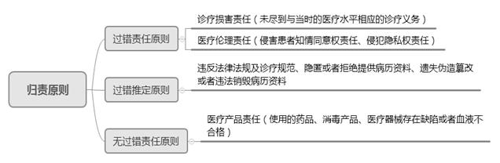
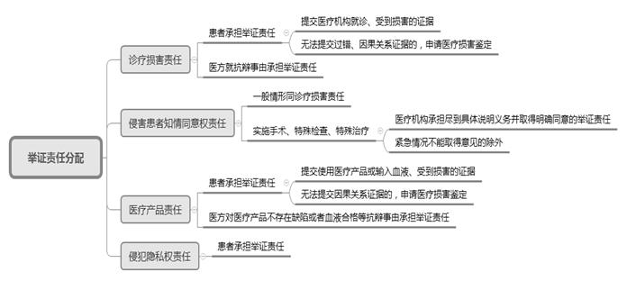
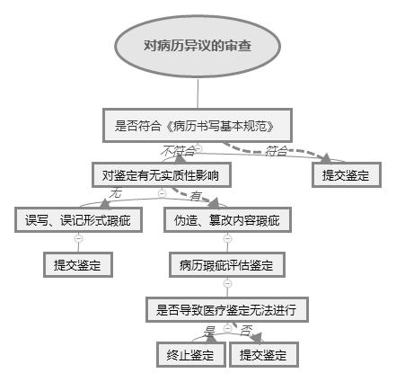

### **医疗损害责任纠纷案件的审理思路和裁判要点**

医疗损害责任纠是指患方向医方主张侵权赔偿引发的诉讼。医疗损害责任纠纷同时涉及医学和法学问题，虽在整个民商事纠纷中占比不高，但社会关注度高、审理难度大、办案周期长。处理此类纠纷，既要充分保护患者权益，又要考虑医疗本身的专业性、风险性，以规范医疗行为、指引患方理性维权、引导医患双方回归理性诉讼预期。需要说明的是，医疗美容损害责任纠纷也属于医疗损害责任纠纷范畴，但两者在鉴定评判标准等方面存在显著差异，故本文所涉内容不包括医疗美容损害责任纠纷案件。我们以典型案例为基础，依照《民法典》及《最高人民法院关于审理医疗损害责任纠纷案件适用法律若干问题的解释》的相关规定，对该类案件的审理思路和裁判方法进行梳理、提炼和总结。

**一、典型案例**

**案例一：涉及多种原因导致损害后果的认定**

王某因突发左下腹疼痛至A医院就诊，A医院诊断为急腹症，对其进行抗炎治疗并医嘱随访。次日王某因主动脉壁夹层动脉瘤破裂死亡，王某家属诉至法院要求A医院承担全部赔偿责任。经鉴定，医方对其病情变化评估存在欠缺是导致王某死亡的原因之一。

**案例二：涉及无法鉴定时医疗损害责任的认定**

刘某收治入B医院行剖宫产手术，后因子宫切口持续渗血，行全子宫切除术。涉诉后，刘某申请医疗损害鉴定。因B医院只有护士乔某一人抄写“产程记录”，且已将原始“产程记录”丢弃，相关鉴定材料存在缺陷，导致医疗损害鉴定不能。

**案例三：涉及对鉴定意见的实质审查**

卞某至C医院就诊，C医院拟以“右眼视网膜脱离”将卞某收治住院并进行手术。卞某服用降眼压药物数天后出现严重过敏性异常反应，后主要因肺部感染及颅内出血死亡。医学会鉴定意见为“本例不属于对患者人身的医疗损害”，但鉴定意见指出“医方应用降眼压药物后，与患者发生中毒性表皮坏死松解症有因果关系，存在过错”。

**二、医疗损害责任纠纷案件的审理难点**

**（一）医疗损害责任中多种原因导致损害后果的抗辩认定难**

医疗损害责任纠纷中患者损害后果的形成原因复杂多样，医疗机构或其医务人员的医疗行为与患者的原发疾病、个人体质及自身过错等原因，共同导致损害后果发生的情形较为普遍。医疗机构或其医务人员对其诊疗行为之外原因引起的损害部分，通常会提出不承担赔偿责任的抗辩事由，而此类抗辩事由是否成立需根据专业意见综合具体案情予以认定。

**（二）医疗损害责任中过错及因果关系的构成认定难**

医疗损害责任纠纷中，医疗机构或其医务人员是否有过错、该过错与患者损害后果之间是否存在因果关系的认定是该类案件的审理难点。一方面，对于未尽到与当时医疗水平相应的诊疗义务、违反告知义务等过错的认定，缺乏统一的判断标准；另一方面，对于过错与因果关系的构成认定通常需要借助医疗损害鉴定予以明晰。在无法进行医疗损害鉴定时，如何合理分配举证责任，也是判断是否构成医疗损害责任的难点。

**（三）医疗损害鉴定意见实质审查难**

医疗损害鉴定意见是对鉴定过程及其所依据专门知识的高度概括总结，相较于其他传统证据专业知识门槛较高。同时，法官因为相对缺乏医学专门知识，对鉴定意见的依赖性较强。因此，医疗损害鉴定意见的特性使得法庭质证难以深入透彻，对鉴定意见的实质审查容易出现缺位。

**三、医疗损害责任纠纷案件的审理思路和裁判要点**

**在处理医疗损害责任纠纷案件中，法院要在尊重医学自身特点的前提下，合理分配医疗风险，****平衡好保护患者权益与保障正常医疗行为的关系。**鉴于医疗损害责任纠纷的特殊性，审理此类案件的一般思路如下：**首先**，针对不同案件类型，确认适用何种归责原则；**其次**，分配举证责任、借助鉴定程序，对构成要件和抗辩事由进行审查，判定是否构成医疗损害责任；**最后**，确定责任承担的主体、方式及赔偿范围。

**（一）审查医疗损害责任的构成**

**1****、归责原则的适用**

《民法典》第1218、1222、1223条确立了医疗损害责任以过错责任为主，兼有过错推定和无过错责任的归责体系。不同的医疗损害形态应适用不同的归责原则，只有法律明确规定的情形下方可适用过错推定原则和无过错责任原则。绝大多数医疗损害形态，如诊疗损害责任、侵害患者知情同意权责任及侵犯隐私权责任均适用过错责任原则；存在违反诊疗规范规定、隐匿或者拒绝提供病历资料、遗失伪造篡改或者违法销毁病历资料三种情形下推定医疗机构存在过错；医疗产品损害责任适用无过错责任原则。

**2****、构成要件的认定**

医疗损害责任适用不同的归责原则，其责任构成要件也不相同。无过错责任原则下的医疗产品责任，过错不再成为责任构成要件，只需审查医疗产品质量问题、患者是否发生损害后果以及两者间是否具有因果关系。过错责任原则下的诊疗损害责任、侵害患者知情同意权责任及侵犯隐私权责任均需审查以下四项构成要件。

**（****1****）审查医疗机构或其医务人员是否实施诊疗行为**

审查患者与医疗机构之间是否存在诊疗关系，综合挂号单、交费单、病历、出院证明及其他能证明存在医疗行为的证据予以认定。

**（****2****）审查患者是否发生损害后果**

审查患者受到的人身伤害后果是一般伤害、残疾还是死亡；审查患者受到的财产损失，如医疗费、误工费等；审查患者是否存在精神损害。侵犯隐私权责任的损害后果有别于其他医疗损害责任，即存在隐私损害事实。

**（****3****）审查医疗机构或其医务人员是否存在医疗过错**

对医疗机构或其医务人员的过错，法院应当依据法律、行政法规、规章以及其他相关诊疗规范进行认定。同时可以综合考虑患者病情的紧急程度、患者个体差异、当地医疗水平、医疗机构与医务人员资质等因素。医疗机构或其医务人员的过错主要包括未尽到与当时医疗水平相应的诊疗义务、侵害患者知情同意权、侵犯患者隐私权、过度医疗、怠于行使紧急救治义务等。

在诊疗损害责任纠纷中，医疗过错的核心即未尽到与当时医疗水平相应的诊疗义务。涉及的具体情形有误诊、漏诊、检查化验不全面、手术措施不到位、用药不规范等。诊疗义务的判断标准包括法定义务和合理注意义务。当时医疗水平的判断标准，要综合考虑诊疗当时当地的医疗水平、医疗机构等级和医务人员资质等因素。如存在《民法典》第1222条规定的三种情形，患者仅需提供证据证明相关事实的存在即可推定医疗机构具有过错。法院在审查时应注意两点：**一是**医疗机构隐匿或者拒绝提供与纠纷有关的病历资料，根据《医疗损害司法解释》是指医疗机构非因客观原因未在法院指定期限内提交。**二是**医疗机构篡改的内容是病历的实质性内容，需区别于病历书写不规范、不及时的瑕疵病历。形式瑕疵的病历不构成过错推定。

在侵害患者知情同意权责任纠纷中，只要医务人员违反告知义务即可认定存在过错。法院应具体审查医务人员有无告知患者病情、医疗措施、医疗风险、替代医疗方案等。对于实施手术、特殊检查、特殊治疗的情形，医疗机构应向患方具体说明医疗风险、替代医疗方案等情况，并取得患方明确同意。

在侵犯隐私权责任纠纷中，过错表现为泄露患者的隐私和个人信息或者未经患者同意公开其病历资料。

**（****4****）审查诊疗行为与患者损害后果之间是否有因果关系**

法院应审查是否系医疗机构或其医务人员的诊疗行为造成了患者的损害后果。**在作为的医疗损害责任纠纷中**，如没有医疗机构或其医务人员的诊疗行为，则患者不会发生损害后果。此种情形下，该诊疗行为是造成损害后果的必要条件。**在不作为的医疗损害责任纠纷中**，如医疗机构或其医务人员积极履行了作为的义务，则患者不会发生损害后果。此种情形下，该不作为的行为是造成损害后果的必要条件。

**3****、抗辩事由的认定**

**（****1****）审查是否存在医疗损害责任的特定免责事由**

在医疗损害责任纠纷中，患者在诊疗过程中受到损害，医疗机构不承担赔偿责任包括三种情形：**一是**患者或其近亲属不配合医疗机构进行符合诊疗规范的诊疗。医疗机构或其医务人员如果同时存在过错的，应承担相应的赔偿责任。**二是**医务人员在抢救生命垂危患者等紧急情况下已经尽到合理诊疗义务。**三是**限于当时医疗水平难以诊疗的。

**（****2****）审查是否存在法定的一般免责事由**

存在第三人过错或不可抗力等不可归责于医方的情形导致损害发生的，可以减轻或者免除医疗机构的责任。

**（****3****）审查是否存在多种原因导致损害后果的抗辩事由**

当患者原发疾病、个人体质与诊疗行为等共同原因导致损害发生，法院需借助原因力规则进行责任划分。原因力在医疗领域通常是指医疗损害与患者自身疾病共同存在的情况下，医疗损害在患者疾病状态中的介入程度。医疗机构仅需对其诊疗行为引起的部分损害承担赔偿责任，对患者自身原因、其他原因引起的损害部分不承担赔偿责任。

如案例一中，A医院在医疗活动中存在对患者病情变化评估有欠缺的医疗过错，但患者突发高危罕见病是导致其死亡的根本原因。法院最终根据鉴定结论对过错诊疗行为与损害后果之间的原因力大小，酌定A医院对王某的合理损失承担20%的赔偿责任。

**（二）医疗损害责任纠纷案件的举证责任分配**

在医疗损害责任纠纷中，因患者医学专业性不足、信息不对称等客观原因，患者举证能力受到制约。在举证责任分配上，既要遵循“谁主张，谁举证”的证据规则，又要避免因举证责任分配不当导致双方实体权利义务显著失衡而激化医患矛盾。法院应通过释明等方式倡导当事人申请医疗损害鉴定，强化患者行为意义上的举证责任。在法律规定的特殊情形下，对患者进行适当的举证责任缓和。《医疗损害司法解释》第4、5、7条对三类重要的医疗损害责任纠纷案件的举证责任作了明确规定，后文将作进一步重点说明。侵犯隐私权责任纠纷由患者承担举证责任，因不涉及医疗损害鉴定，在举证责任分配上并无特殊性，不再进行具体说明。

**1****、诊疗损害责任纠纷中的举证责任分配**

患者需提交到医疗机构就诊及受到损害的证据，还需提供证明医疗机构或其医务人员有过错、诊疗行为与患者损害之间具有因果关系的证据。鉴于过错与因果关系一般难以通过普通的生活经验判断，因此法律规定如患者无法提交医疗机构或其医务人员存在过错、诊疗行为与损害之间具有因果关系的证据，则可以依法提出医疗损害鉴定申请。医疗机构则应对免责或减责等抗辩事由承担举证责任。

**2****、侵害患者知情同意权责任纠纷中的举证责任分配**

此类责任纠纷案件在“谁主张，谁举证”的基础上，对患者实行一定程度的举证责任缓和。一般情形下，上述责任认定的四项构成要件需由患者承担举证责任。侵害患者知情同意权责任纠纷中的过错认定即判断医疗机构是否尽到告知义务，但因涉及专业判断问题，且对患者而言属于消极事实，同样应允许患者对医疗机构是否尽到告知义务申请医疗损害鉴定并进行举证。

在实施手术、特殊检查、特殊治疗的情形下，医务人员应及时向患者具体说明医疗风险、替代医疗方案等情况，并取得其明确同意；不能或者不宜向患者说明的，应向患者的近亲属说明，并取得其明确同意。除在紧急救治情况下医方可以不取得患者或其近亲属的意见以外，其他情况均应由医疗机构或其医务人员承担尽到具体的说明义务并取得患者或其近亲属明确同意的举证责任。

**3****、医疗产品责任纠纷中的举证责任分配**

在医疗产品责任纠纷中，患者需举证证明其使用医疗产品或者输入血液且受到损害，使用医疗产品或者输入血液与损害后果之间具有因果关系。医疗机构以及医疗产品的生产者、销售者或者血液提供机构应就医疗产品不存在缺陷或输入血液合格等抗辩事由承担举证责任。

****

**（三）医疗损害鉴定与鉴定意见审查**

**1****、医疗损害鉴定**

医疗损害鉴定的根本目的在于借助专家的专门知识、技能和经验，辅助法官对专门性事实问题作出判断，以保证案件的公正裁判。

**（****1****）鉴定程序的启动**

医疗损害鉴定的启动方式以当事人申请为主，法院依职权启动为辅。鉴定人的选择是以当事人协商确定为主，法院指定为辅。《上海市高级人民法院关于委托医疗损害司法鉴定若干问题的暂行规定》中规定，除双方当事人协商一致外，医疗损害责任纠纷案件由法院委托医学会组织专家进行鉴定。医学会认为无法鉴定的，法院可另行委托具有资质的司法鉴定机构组织鉴定。医学会进行医疗损害鉴定的，由双方当事人协商选择区县医学会进行鉴定；双方当事人不能协商一致的，原则上由法院在医疗机构所在地以外的区县医学会中确定。因案情复杂，当事人不同意在区县医学会鉴定的，可以委托市医学会进行鉴定。启动鉴定程序时，法院需向当事人做好释明工作，同时根据案件具体情况对鉴定专家作出必要审查，确保鉴定专家具备中立地位及相应鉴定能力。

**（****2****）鉴定材料的质证**

鉴定材料应符合证据属性，法院需依法对鉴定材料进行质证。经过质证，当事人对鉴定材料没有异议的，或者法院认为异议不成立的，法院应将鉴定材料移交给鉴定机构进行鉴定。当事人不能达成一致意见的，法院有权决定是否提交鉴定。异议不影响鉴定的，法院可以提交鉴定。异议对鉴定具有实质性影响，如鉴定材料不足导致鉴定无法进行或者难以取得符合法律规定的鉴定意见的，法院有权不提交鉴定。异议内容需要专门技术确定是否成立的，法院应告知当事人先就异议问题进行相应的鉴定、评估或者检测。如患者对鉴定材料的真实性、完整性提出异议，可以进行笔迹鉴定或者电子病历鉴定。

病历资料是最主要、最重要的鉴定材料之一。当事人对病历资料提出异议的，法院应首先审查是否符合《病历书写基本规范》的要求，不符合要求的病历构成瑕疵病历。在此基础上，法院应再审查病历资料是存在错别字、书写不规范等形式上的瑕疵，还是内容存在明显矛盾或错误且不能做出合理解释的情形，由此确定不同的法律后果。病历资料造成鉴定无法客观进行的，则应终止鉴定。

如案例二中，B医院违反医方应该提供真实病历资料的相关规定，导致医疗损害鉴定不能。B医院应承担举证不能的不利后果，承担全部赔偿责任。

****

**（****3****）医疗损害鉴定的内容**

申请医疗损害鉴定的事项具体包括：实施诊疗行为有无过错；诊疗行为与损害后果之间是否存在因果关系以及原因力大小；医疗机构是否尽到说明义务、取得患者或其近亲属书面同意的义务；医疗产品是否有缺陷、该缺陷与损害后果之间是否存在因果关系以及原因力大小；患者损伤残疾程度；患者的护理期、休息期、营养期；其他专门性问题。

**（****4****）重新鉴定的条件**

根据新修订的《最高人民法院关于民事诉讼证据的若干规定》第40条对重新鉴定的条件作出明确规定，对存在鉴定人不具备相应资格的、鉴定程序严重违法的、鉴定意见明显依据不足的、鉴定意见不能作为证据使用的其他情形等上述情形之一的应启动重新鉴定。有缺陷的鉴定结论可通过补充鉴定、重新质证或者补充质证等方法解决的，不予重新鉴定。《上海市高级人民法院关于委托医疗损害司法鉴定若干问题的暂行规定》规定，经区县医学会鉴定后，当事人仍有异议，法院经审查认为符合重新鉴定条件的，可委托市医学会重新鉴定。

**2****、鉴定意见审查**

**（****1****）形式审查**

鉴定机构出具的鉴定意见是法院审理医疗损害责任纠纷案件的重要证据材料之一。通常经法院审查符合证据真实性、合法性、关联性要求的，即可作为确定案件相关事实的依据。一方当事人自行委托鉴定作出的医疗损害鉴定意见存在程序瑕疵的，只有在另一方当事人认可的情况下才可以对该鉴定意见予以采信。当事人共同委托鉴定作出的医疗损害鉴定意见，一方当事人不认可的，法院应对明确的异议内容和理由进行审查。有证据足以证明异议成立的，法院对鉴定意见不予采信；异议不成立的，应予采信。

**（****2****）实质审查**

鉴定意见作为证据的一种，能否证明待证事实以及能多大程度证明待证事实，仍需经过法院综合其他在案证据后作出判断，法院对鉴定意见不能不作审核直接作为定案依据。

如案例三中，虽然鉴定意见为“本例不属于对患者人身的医疗损害”，但从其分析意见来看，鉴定意见已经明确医方应用降眼压药物与患者发生中毒性表皮坏死松解症之间的因果关系，C医院存在过错。尽管“患者的死亡原因主要为肺部感染及颅内出血”，然而患者中毒性表皮坏死松解症毕竟会造成患者的免疫力低下，难以排除与患者最终死亡之间的因果关系。因此，法院未全盘采纳鉴定意见，而是根据经验法则综合案情，酌定C医院承担10%的赔偿责任。

当事人对鉴定意见提出异议的，法院可借助以下方式对鉴定意见进行实质审查：**一是**医学会出具复函。法院可向医学会发函，要求医学会就异议出具书面说明，并组织当事人对医学会答复进行质证。**二是**鉴定人出庭作证制度。患者对鉴定意见提出异议并申请鉴定人出庭，法院审查同意或者认为鉴定人有必要出庭的，应当通知鉴定人出庭作证。经双方当事人同意，鉴定人可通过书面说明、视听传输技术或者视听资料等方式作证。鉴定人无健康原因、自然灾害等不可抗力或者其他正当理由拒绝出庭作证，当事人对鉴定意见又不认可的，对该鉴定意见不予采信。**三是**专家辅助人制度。经法院准许，当事人可申请通知一至二名具有医学专门知识的人作为专家辅助人出庭，对鉴定意见或者案件的其他专门性事实问题提出意见。专家辅助人提出的意见，经质证可以作为认定事实的依据。

**（四）医疗损害责任纠纷案件的责任承担**

**1****、确定医疗损害责任承担的主体**

在医疗损害责任纠纷中，尽管实际从事诊疗活动造成患者损害的是医务人员，但其系因执行工作任务而造成他人损害，故应由医疗机构作为用人单位承担侵权责任。在医疗机构邀请本单位以外的医务人员对患者进行诊疗时，因受邀医务人员的过错造成患者损害的，由发出邀请的医疗机构作为责任主体承担赔偿责任。

需要注意的是，在医疗产品责任纠纷中，患者可以请求医疗机构、药品上市许可持有人、缺陷产品的生产者、销售者或者血液提供机构承担赔偿责任。医疗机构承担赔偿责任后，可以向负有责任的药品上市许可持有人、缺陷产品的生产者、销售者或者血液提供机构追偿；负有责任的药品上市许可持有人、医疗产品的生产者、销售者或者血液提供机构亦可向因过错使医疗产品存在缺陷或者血液不合格的医疗机构追偿。

**2****、确定医疗损害责任的承担方式**

在多个医疗机构承担责任的情形下，法院应根据不同侵权行为认定责任承担方式：多个医疗机构共同实施侵权行为造成患者同一损害的，应承担连带责任；多个医疗机构分别实施侵权行为应承担按份责任，但侵权行为均足以造成全部损害的，应承担连带责任。

在缺陷医疗产品、输入不合格血液与医疗机构的过错诊疗行为共同造成患者同一损害的情形下，医疗机构与药品上市许可持有人、医疗产品的生产者、销售者或者血液提供机构承担连带责任。医疗机构或者药品上市许可持有人、医疗产品的生产者、销售者或者血液提供机构承担赔偿责任后，向其他责任主体追偿的，应当根据诊疗行为与缺陷医疗产品或者输入不合格血液造成患者损害的原因力大小确定相应数额。

**3****、确定医疗损害责任的赔偿范围**

**（****1****）财产损害赔偿的范围**

财产损害赔偿范围包括医疗费、护理费、交通费等为治疗和康复支付的合理费用，以及因误工减少的收入。造成患者残疾的，还应当赔偿残疾生活辅助具费和残疾赔偿金。造成患者死亡的，还应当赔偿丧葬费和死亡赔偿金。

**（****2****）精神损害赔偿的依据**

侵害他人人身权益造成他人严重精神损害的，被侵权人可以请求精神损害赔偿。医疗损害责任纠纷案件中，法院通常依据已采信鉴定意见确定的伤残等级，结合医疗机构的过错担责比例对精神损害赔偿金额进行认定。

**（****3****）惩罚性赔偿的适用**

医疗产品的生产者、销售者明知医疗产品存在缺陷仍然生产、销售，造成患者死亡或者健康严重损害的，被侵权人可以请求生产者、销售者赔偿损失及二倍以下惩罚性赔偿。

（根据民事庭孙春蓉、曹沁提供材料整理）