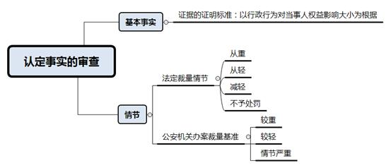
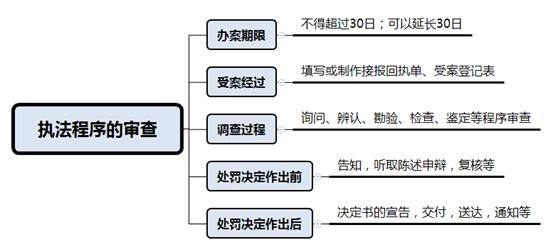

### **治安行政处罚案件的审理思路和裁判要点**

治安行政处罚，是指公安机关依照治安管理法律法规的规定，对扰乱公共秩序、妨害公共安全、妨害社会管理、侵犯人身权利、财产权利，具有社会危害性但尚不构成刑事处罚的违法行为所实施的行政处罚。处罚种类包括警告、罚款、行政拘留、吊销公安机关发放的许可证。治安行政处罚案件是行政审判中常见的案件类型，行政处罚决定对行政相对人的权益影响较大，法院在审理此类案件时应秉持严谨、规范、审慎的态度。本文所总结的是法院在审理治安行政处罚类案件中的审理思路和裁判要点，不包括道路交通行政处罚案件或公安机关实施的其他行政管理行为。现以典型案件为基础，对该类案件的审理思路和裁判方法进行提炼和归纳。

**一、典型案例**

**案例一：涉及处罚决定中的事实认定**

崔甲、崔乙因日常琐事与跳广场舞的老人余某发生言语冲突、拉扯，两人离开后又返回现场，对余某实施辱骂、殴打等行为。公安机关接警后经立案、调查询问等程序，认定崔甲、崔乙有寻衅滋事的违法行为，分别对其作出行政拘留十日和七日的行政处罚。崔甲、崔乙以公安机关认定事实不清、证据不足等为由，起诉请求撤销对其作出的行政处罚决定。

**案例二：涉及处罚幅度的裁量**

贺某经指引至提供色情服务的场所等待服务，当黄某至该房间提供服务时，贺某拒绝由黄某为其服务，之后遇公安民警进行现场检查。公安机关认定贺某有嫖娼的违法行为，并对其作出行政拘留十四日的处罚。贺某认为其未实施任何违法行为却被认定为嫖娼，并被处以十四日的行政拘留处罚过重，起诉请求撤销该处罚决定。

**案例三：涉及执法程序的审查**

2017年7月，卢某因吸毒成瘾被公安机关责令接受社区戒毒三年。同年11月，公安机关接举报后发现卢某有吸毒的违法行为，后经鉴定机构对卢某的头发及血液进行鉴定，均检验出甲基苯丙胺。公安机关遂对其作出行政处罚决定及强制隔离戒毒决定。卢某以公安机关采集生物样本程序违法、鉴定人员缺乏资质等为由，起诉请求撤销该行政处罚决定。

**二、治安行政处罚案件的审理难点**

治安行政处罚案件中，行政相对人一般会就事实认定、处罚幅度和程序正当性等提出异议，而法院如何就在案证据进行审查和认定，如何审查公安机关的行政裁量权，以及如何审查公安机关执法程序的正当性等是该类案件审理中的难点问题。

**（一）处罚决定中认定事实的证据审查难**

法院在审查治安行政处罚决定中的认定事实部分，需要结合公安机关在案件调查过程中取得的各项证据进行审查。审查难点主要包括：

**一是证据种类及数量单一、有限**。如毒品类、卖淫嫖娼类、赌博类案件往往具有私密性，证据种类大多只有被调查人陈述。再如案件数量占比较大的殴打、故意伤害案件中，也常存在缺乏目击证人、录音录像等视听资料的情况。证据种类及数量的有限导致准确认定案件事实存在困难。

**二是证据之间的证明内容及效力审查难**。如在只有陈述类询问笔录的情形下，行政相对人之间、证人之间的陈述往往存在出入。针对同一节案件事实存在不同陈述内容的情况下，法院难以对案件事实进行审查认定。此外，行政诉讼中证据的证明标准也不同于刑事诉讼或者民事诉讼中的标准，不同案件中证据的证明标准也不尽相同。法院在个案审查中如何把握证明标准问题较为困难。

同时，如何在个案中认定 “情节较轻”“情节较重”“情节严重”等情形，也是法院在审理具体治安行政处罚案件中的难点。

**（二）行政裁量权的适当性审查难**

在《治安管理处罚法》第三章“违反治安管理的行为和处罚”中，大部分条款由“一般行为及其处罚幅度+情节较轻、情节较重、情节严重的处罚幅度”的范式构成。具体处罚金额或拘留期限是公安机关在法定处罚幅度内行使行政裁量权的结果。公安机关在日常办案中，对一类案件的处理有其惯常做法或裁量标准。该行政裁量的结果是否与违法行为性质、情节及社会危害程度相当，处罚结果是否畸轻或畸重，行政裁量过程中的具体考量因素，均是法院审理治安行政处罚案件的难点。

**（三）执法程序的正当性审查难**

**一方面**，公安机关办理治安行政处罚案件的程序规定较为繁杂。公安机关办理该类案件时，一般需要进行受案、调查、处罚前告知、作出处罚决定及送达等程序，同时具有办案期限的规定。法院对公安机关执法程序的合法性审查可以依据法律法规的规定进行，而对执法程序的正当性审查则存在一定难度。例如办案民警的回避、执法规范等问题，以及作出处罚前是否已告知处罚决定包含的全部事项等。

**另一方面**，办案中的特殊程序事项具有一定的专业性。根据个案具体情况，在调查中往往还需要进行勘验、鉴定、辨认、听证等程序。以鉴定毒品成分为例，检材样本、送检程序、鉴定资质等都有较为专业的特别规定。因此，法院对一般类和特殊类程序事项进行审查都存在一定难度。

**三、治安行政处罚案件的审理思路及裁判方法**

公安机关作出的治安行政处罚决定对当事人权益影响重大。为维护法治的统一性和公平性，维护公安机关作为行政机关的严肃性和权威性，**法院在对治安行政处罚决定进行审查时，更应当全面、审慎，坚持公平、公正原则，坚持尊重和保障人权原则，坚持教育与处罚相结合原则，以审判促监督，督促公安机关规范治安行政处罚工作，减少和避免出现程序瑕疵，以维护行政执法的严肃性和规范性。**一方面，法院应当依法纠正违反依法行政原则，损害当事人合法权益的违法处罚，另一方面，法院也应当维护和支持公安机关对违反治安管理法律法规的行为依法作出的惩戒效力。

在对该类案件的审理中，法院应当区分考量行政处罚决定对行政相对人权益影响的轻重程度、公安机关行政规制手段及方法的差异等因素，从行政机关的职权依据、事实认定、执法程序和法律适用等方面进行全面审查和认定，审慎作出裁判。

审理此类案件可按照如下步骤进行审查：

**（一）确定当事人的主体资格**

治安行政处罚案件的审理中，被告一方较为容易确定，即作出涉案行政处罚决定的公安机关，而原告和第三人的确定则是该类案件审理中首先应当注意的问题。

**1****、适格原告的确定**

根据《行政诉讼法》的规定，行政行为的相对人以及其他与行政行为有利害关系的公民、法人或者其他组织，有权提起诉讼。在治安行政处罚案件中，行政处罚决定中的被处罚人、被侵害人等与该行政处罚决定有利害关系的人，可以成为适格原告。

**2****、行政诉讼第三人的审查**

行政行为的作出一般有直接的对象，但行政行为的双重或者多重效力可能对他人的权益产生间接影响。治安行政处罚决定对被处罚人产生效力的同时，也和被侵害人的利益息息相关，处理与否或者处理的轻重都将影响到被侵害人权益的保护。因此，在治安行政处罚案件中，法院应当注意审查是否存在第三人的情况。

较为典型的是，治安行政处罚中的“殴打他人”“故意伤害他人身体”类案件，案件当事人包括加害人和被侵害人。法院审查发现加害人起诉，未参加诉讼的被侵害人应作为案件第三人；被侵害人起诉时，未参加诉讼的加害人亦应作为案件第三人。法院应同时注意审查加害人或者被侵害人为多人时只有部分起诉的情况，如发现有遗漏的，法院应追加第三人并通知其参加诉讼。

二审法院应注意审查原审裁判是否遗漏第三人。若原审法院遗漏追加第三人的，应裁定撤销原判决并发回原审法院重审。

**（二）公安机关职权依据的审查**

审查公安机关职权依据时，应注意审查行政管辖权。县级以上人民政府公安机关具有治安管理处罚的法定职权。行政案件原则上由违法行为地的公安机关管辖，由违法行为人居住地公安机关管辖更为适宜的，可以由违法行为人居住地公安机关管辖，但是涉及卖淫、嫖娼、赌博、毒品的案件除外。根据《公安机关办理行政案件程序规定》，违法行为地包括违法行为发生地和违法结果发生地。居住地包括户籍所在地、经常居住地。应注意的是，根据《治安管理处罚法》第91条规定，作出警告、五百元以下罚款处罚决定的派出所具有相应的法定职权。

即便当事人对于公安机关的职权依据没有异议，法院仍然应当对此进行审查。鉴于重大、复杂的案件可以由上级公安机关直接办理或者指定管辖，涉及指定管辖或移送管辖的案件，法院应当注意审查指定管辖或者移送管辖的相关材料。

**（三）认定事实的审查**

**1****、基本事实的认定**

行政处罚决定书中认定的事实是当事人诉争的主要焦点。案件基本事实的认定会影响行为的定性和情节轻重的认定。治安行政处罚案件的事实认定还涉及举证责任问题——行政诉讼中一般由被告即公安机关对作出的行政处罚行为承担举证责任。公安机关提交证据的形式、来源、种类等应当符合《行政诉讼法》《治安管理处罚法》《公安机关办理行政案件程序规定》及《最高人民法院关于行政诉讼证据若干问题的规定》等。公安机关在办案期间形成和收集的证据必须依照法定程序且经查证属实。法院应当综合审查公安机关办案中形成和收集的证据能否形成完整的证据链、能否还原案件事实，审查公安机关是否已根据在案证据查明违法事实。

法院审理该类案件时，对于证据证明标准的把握，原则上应以行政行为对当事人权益影响大小为根据，而不能一概适用刑事诉讼或者民事诉讼中的标准。如公安机关对违反治安管理行为人处以行政拘留等权益影响较大的处罚决定时，法院应严格审查在案证据能否充分证明违法事实，并视情适用“排除合理怀疑”的证明标准。如果处罚决定对被处罚人权益影响较小，法院对证据的审查认定可适用“优势证据规则”。对于证明同一事实的数个证据产生证明效力冲突的，应当按照《最高人民法院关于行政诉讼证据若干问题的规定》第63条规定的“认证规则”予以认定。

如案例一中，法院应对公安机关在办案期间收集和形成的崔甲、崔乙及余某的询问笔录、在场人员的询问笔录、伤情鉴定等证据材料进行审查。因公安机关对违反治安管理行为人作出了行政拘留的处罚决定，法院应根据在案证据的证明内容、各证据之间的效力关系，严格审查公安机关提供的证据能否证明崔甲、崔乙实施了殴打、辱骂等违法行为，严格审查公安机关所作的行政处罚决定是否已查清相应事实，崔甲、崔乙的行为是否构成寻衅滋事。本案中，法院结合在案证据，认为公安机关在认定事实方面并无明显不当。

**2****、情节的认定**

《治安管理处罚法》第12、13、14、19、20条等规定了从重、从轻、减轻、不予处罚等法定裁量情节。法院应当结合公安机关提交的关于违法情节轻重的证据，注意审查违反治安管理行为人的年龄、精神状态和行为能力，是否为盲人或聋哑人，行为人的动机及主观恶意程度，前科情况，行为危害后果，以及是否有主动投案并如实供述或者立功表现等情节。

此外， 对于“情节较轻”“情节较重”“情节严重”的具体适用情形，可以参考公安机关对违反治安管理行为实施处罚的裁量基准予以审查和确定。例如一年内因同种违法行为被治安行政处罚后又实施的，属于“情节较重”甚至“情节严重”；实施违反治安管理行为危害较小且积极配合公安机关查处的，则属于“情节较轻”等。

**（四）法律适用的选择及处罚幅度的裁量**

行政处罚决定中的法律适用应当以查明的基本事实及情节认定为基础。法院应根据查明并认定的基本事实和具体情节，首先审查公安机关选择适用的具体法律条款是否适当，综合考量违反治安管理行为的对象、后果、数额、次数、行为人主观恶意程度，以及从重、从轻、减轻等法定裁量情节，判断公安机关作出的具体处罚决定是否适当。

在以事实为依据的基础上，治安行政处罚结果应当与违反治安管理行为的性质、情节以及社会危害程度相当，确保法律效果和社会效果的统一。处罚类别和幅度的审查可参考公安机关日常办案的惯常做法及裁量标准。对于同一地区、同一时期案情相似的案件，审查公安机关作出的治安管理处罚是否基本均衡。行政处罚明显不当的，法院可以判决变更，但不得加重原告的义务或者减损原告的权益，但利害关系人同为原告且诉讼请求相反的除外。

如案例二中，法院在审查认定贺某行为构成嫖娼的基础上，综合考虑违法行为的后果，贺某的主观恶意程度，是否存在法定的从重、从轻、减轻等情节，再结合同一地区、同一时期嫖娼类案件的办理情况，审查判断公安机关对贺某作出的处罚决定并无不当，最终驳回贺某的诉讼请求。

**（五）执法程序的审查**

鉴于治安行政处罚的严肃性和严厉性，正当、合法的执法程序在该类案件中显得尤为重要。治安行政处罚的程序一般适用《治安管理处罚法》《公安机关办理行政案件程序规定》的相关规定。法院应审查公安机关办理治安行政处罚案件的程序是否违反法定顺序、是否遗漏重要的程序环节。

法院对执法程序的审查一般包括以下几个方面：

**一是办案期限：**公安机关办理治安案件的期限，自受理之日起不得超过三十日；案情重大、复杂的，经上一级公安机关批准可以延长三十日。为查明案情而进行鉴定的期间不计入办理治安案件的期限。

**二是受案经过：**公安机关应当根据案件来源情况填写或制作接报回执单、受案登记表。

**三是调查过程：**公安机关在调查中进行的询问、辨认、勘验、检查、鉴定等程序应当符合相关法律法规的规定。调查中形成的笔录或文书材料，应由相关人员签字确认或依法送达。如询问笔录应当交被询问人核对；对没有阅读能力的，应当向其宣读。记载有遗漏或者差错的，被询问人可以提出补充或者更正。被询问人确认笔录无误后应当签名或者盖章，询问的民警也应当在笔录上签名。

如案例三中，卢某认为公安机关采集其生物样本时程序违法，法院需审查公安机关对生物样本的采集、送检程序是否符合法律规定，同时对检测单位和人员的资质、检测结果的告知等进行审查。本案中尽管卢某提出采集生物样本程序违法、鉴定人员缺乏资质等理由，但未能提供相应的证据予以证明，法院经审查认为公安机关的办案程序符合相关法律法规规定，故对公安机关的执法程序予以认可，最终驳回卢某的诉讼请求。

**四是治安行政处罚决定作出前：**应当告知违反治安管理行为人拟作出治安行政处罚的事实、理由及依据，并告知其依法享有陈述权和申辩权。公安机关必须充分听取违反治安管理行为人的意见，对其提出的事实、理由和证据应当进行复核。行为人提出的事实、理由或者证据成立的，应当作为公安机关作出行政处罚的依据。

**五是治安行政处罚决定作出后：**公安机关应当向被处罚人宣告治安管理处罚决定书，并当场交付被处罚人；无法当场向被处罚人宣告的，应当在二日内送达被处罚人。决定给予行政拘留处罚的，应当及时通知被处罚人的家属。被处罚人签名或者捺指印，即为送达；被处罚人拒绝的应由办案民警在决定书上注明。

有被侵害人的，公安机关应当在作出决定之日起二日内将决定书复印件送达被侵害人，无法送达的应当注明。

**四、其他需要说明的问题**

为更好地发挥法院通过行政诉讼促进依法行政、规范行政执法的作用，法院除了通过专家法官会议、研讨会等方式对个案进行分析研讨外，还可以通过召开联席会议、工作例会等形式，约请公安机关就执法过程中的普遍性、前瞻性问题进行研讨。法院不仅可以更准确掌握治安行政处罚案件的执法思路，对审判实践中可能碰到的难点问题提前研判应对，还可以结合法律及审判实践向公安机关办案提供建议，进一步规范行政执法。

（根据行政庭周峰、汪菲提供材料整理）