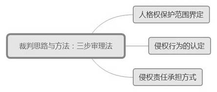
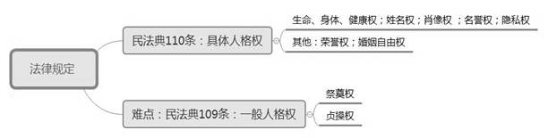
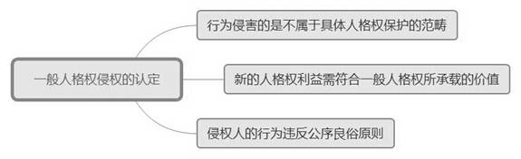
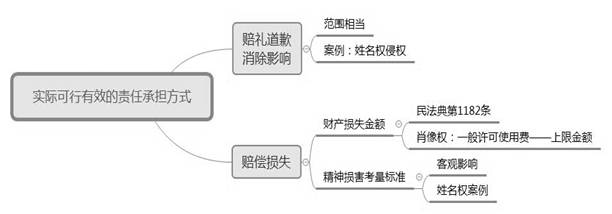
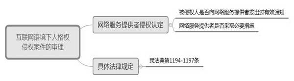

### **人格权纠纷案件的审理思路和裁判要点**

人格权纠纷是指因人格权受到侵犯而引起的侵权责任纠纷。面对人格权的法定性与侵权行为多样化、新型人格利益不断涌现之间的矛盾，以及言论自由与人格权保护等权利冲突，人格权保护范围的界定是人格权纠纷案件审理的起点，侵权是否构成以及侵权责任如何承担的认定是此类案件审理的重点。此外，在网络环境下的人格权纠纷案件中，如何在法益平衡的前提下认定网络服务提供者的责任成为该类案件审理的难点。我们有必要以典型案件为基础，对该类案件的审理思路与裁判要点进行梳理、提炼和总结。

**一、典型案例**

**案例一：涉及对人格权保护范围的界定**

楼甲与楼乙系兄弟关系，两人的父母长期随楼乙定居国外。后其父母相继因病在国外去世，但楼甲均未获知父母去世的消息。楼甲认为，楼乙未及时告知父母患病、去世的有关事实，导致楼甲未能见到父母最后一面，使其精神健康受到损害，因此诉至法院请求判令楼乙书面赔礼道歉，并支付精神损害抚慰金50000元。

**案例二：涉及对人格权侵权的认定**

小区业主朱某在小区微信“业主交流群”中针对业委会主任邬某发表了一些言论，认为邬某指使小区物业砍伐树木。邬某表示自己对砍树事宜并不知情也没有指使物业砍伐树木，认为朱某的污蔑行为侵犯了自己的名誉权，故诉至法院要求朱某在小区微信群中赔礼道歉并支付精神损害抚慰金5000元。

**案例三：涉及对侵权责任承担的考量**

沈某通过信息公开获知其姓名被包括A 公司在内的多家企业登记为财务负责人。由于上述企业存在多次税收违法行为，税务机关将该等企业列入高风险名单，但并未对沈某个人作出处罚，也未将其列入税收高风险名单。沈某主张在该段期间内其从事发票申领等工作的效率降低、业务受阻从而造成财产损失，故诉至法院要求A公司立即停止侵犯沈某姓名权的行为，并将沈某从A公司的税务登记信息中移除；在市级报纸上向沈某书面赔礼道歉；赔偿沈某财产损失5000元、精神损害抚慰金10000元。

**案例四：涉及对网络服务提供者责任边界的界定**

案外人在B公司经营的社交网络平台上以王某照片为头像注册用户，并在平台上接连发布了多篇日志、照片及留言，使用辱骂、攻击的措辞声称王某是“第三者”。王某要求B公司删除该用户上传的照片及相关言论，但B公司仅删除了王某的相关照片，但未对相关言论予以删除。王某诉至法院要求B公司停止侵害、消除影响、在平台主页赔礼道歉并赔偿精神损害抚慰金30000元等。

**二、人格权纠纷案件的审理难点**

**（一）人格权保护范围界定难**

人格权属于绝对权，权利主体以外的其他人对绝对权负有不得侵犯的一般义务。随着现代生活和科技的发展，侵权行为方式呈现多样化，新型人格利益也不断出现，而现有法律对人格权的规定较为概括、抽象，存在一定的弹性与开放性。如何判断原告诉请是否属于人格权的保护范围，是实践中审理人格权纠纷案件的难点。如案例一中，楼甲所主张的祭奠权是否属于人格权的保护范围、是否蕴含着法律所保护的人格利益，需要法官根据案情具体界定。

**（二）是否构成人格权侵权认定难**

人格权侵权纠纷案件中，认定行为人是否构成侵权与认定一般侵权责任的标准通常是一致的，但由于人格权类型较为多样，各类人格权侵权认定的具体要件存在一定差异，实践中的理解认识也不统一。如案例二中，朱某是否存在恶意诽谤行为、是否造成邬某社会评价的降低，均需要根据案情进行具体分析。

**（三）侵权责任承担方式与具体赔偿金额的确定难**

行为人构成侵权的，需要确定具体的侵权责任承担方式。如案例三中，当法院认定A公司对沈某姓名权构成侵权时，案件争议焦点就在于A公司应承担的侵权责任方式与范围，包括是否需要在市级报纸上书面赔礼道歉，沈某的财产损失应如何确定，精神损害赔偿能否支持等。

**（四）网络环境下人格权侵权把握难**

网络侵权涉及权利人与网络用户之间权利冲突以及权利人与网络服务提供者之间的关系，案情往往较为复杂，导致审理难度较大。如案例四中，网络用户的言论是否构成侵权需根据具体案情进行认定；同时，网络服务提供者B公司对于用户发布的相关信息是否已履行相应的管理义务，是否需要承担相应责任，均是此类纠纷审理的难点。

**三、人格权纠纷案件的审理思路与裁判要点**

人格权是最基本、最重要的一类民事权利，《民法典》中采用积极确权的模式，以实现人格权的全面保护。**人格权纠纷案件中，法院既要维护、鼓励行为人的言论及行为自由，又要通过对人格权的保护使行为人的行为更加规范。法院应以相关法律法规为基础，结合个案实际情况，兼顾原则性和灵活性，妥善处理好个人言论、行为自由与人格权利益保护之间的平衡。**

此类案件的审理一般分为三个步骤：**首先**，界定是否属于人格权保护范围。人格权的法定类型是确定的，需要通过一般人格权对具体人格权之外的人格利益提供兜底保护，为新型人格利益上升为独立的权利形态提供充分的空间。**其次**，以侵权构成要件为法理基础，结合各种人格权侵权的具体要素，对案件事实进行审查，以判定行为人是否构成侵权。**最后**，考量侵权人的责任承担方式。如系网络侵权纠纷，则审理要点在于权衡权利人、网络用户和网络服务提供者之间的权利冲突，对网络服务提供者是否履行法定义务进行审查。

**（一）界定是否属于人格权的保护范围**

《民法典》第109、110条分别规定了“自然人的人身自由、人格尊严受法律保护”“自然人享有生命权、身体权、健康权、姓名权、肖像权、名誉权、荣誉权、隐私权、婚姻自主权等权利”。学理上通常称前者为一般人格权，后者为具体人格权。需要注意的是，法律有具体条款规定的必须先适用具体规定。只有在穷尽具体条款之后，才能适用一般条款进行裁判。因此一般人格权只有在不能适用具体人格权时方才能够加以适用。

**1****、具体人格权的保护范围**

**（****1****）生命权、身体权、健康权**。这三种权利是人格权利中最基础、最重要的权利。任何组织或者个人不得侵犯他人的生命权、身体权、健康权。因生命、身体、健康遭受侵害，权利人起诉请求赔偿义务人赔偿财产损失和精神损害的，法院应予受理。需要注意的是，机动车交通事故责任纠纷和医疗损害责任纠纷尚需适用相关特别法的规定。

**（****2****）姓名权**。公民的姓名权应包括本名、艺名、笔名、别名。姓名权的内容包括决定、改变和使用姓名的权利。公民行使姓名权还应当尊重社会公德，不得损害社会公共利益。

**（****3****）肖像权**。肖像是通过摄影、雕塑、录像、绘画、电子数字技术等手段，将自然人的五官特征、形体特征、肢体特征或其他可识别特征，以物质载体或虚拟物质方式表现其全部或局部，并能够为人们主要通过视觉方式感知的形象。肖像最基本的功能是识别。肖像权是法律赋予自然人对自己形象再现的排他性支配权，包括两种属性：一是积极作为的支配属性，如肖像使用权；二是消极防御的不受侵害属性，如维护肖像完整权。

**（****4****）名誉权**。名誉是社会对特定民事主体品德、才能以及其他素质客观、综合的评价。名誉本质是一种客观的社会评价，而不包括权利人主观的名誉感。如案例二中，虽然行为人的言论对权利人造成了一定的心理压力及负担，但未造成小区业主对权利人社会评价的降低，故不构成名誉侵权。

**（****5****）隐私权**。隐私是自然人不愿为他人知晓的私密空间、私密活动和私密信息等。隐私权客体“隐私”的内涵较为丰富，在何种情况下构成隐私，需要结合特定的时间、地点等具体情形予以判断。司法实践中，隐私权主要包括私人生活安宁和个人秘密两部分内容。私人生活安宁主要包括物理空间上的安宁和精神空间上的安宁；个人私密主要包括个人身体私密和生活私密。

**（****6****）其他具体人格权**。**一是荣誉权**。行为人非法剥夺公民、法人的荣誉称号，权利人可以荣誉权受到侵犯为由要求行为人承担相应的民事责任。荣誉与名誉的主要区别在于，荣誉是国家机关或社会组织给予的积极、正面的评价，授予或撤销具有相应的程序；名誉是民事主体依据自己的积极行为而取得社会组织的评价，而非自然产生。**二是婚姻自主权**。对于买卖、包办婚姻和其他干涉婚姻自由的行为，权利人可以主张婚姻自主权受到侵犯。

需要注意的是，在侵犯各类人格权竞合的情形下，如行为人通过冒用权利人的姓名而实施了侵犯权利人姓名权、减损权利人名誉的行为，同时构成侵犯姓名权、名誉权的，由于该等侵权行为在责任形式上具有相同之处，通常权利人可择一而诉。

**2****、一般人格权的保护范围**

一般人格权是相对于具体人格权而言的，即以人身自由、人格尊严为内容、具有高度概括性和权利集合性特点的权利。人格权纠纷案件中，在原告主张的权利不属于具体人格权保护范围的前提下，法院需要审查原告的主张是否属于“人身自由”“人格尊严”的保护范围。由于“自由”“尊严”的表述存在高度的抽象性，需要通过司法实践总结将其类型化，以实现人格权保护体系的开放性与安定性之间的平衡。

如案例一中，我国法律虽未明确规定祭奠权，但对逝世亲人进行祭奠是我国一项悠久的传统习俗，符合民法的公序良俗原则。祭奠权的实质是基于传统习俗而产生的自然人为逝世亲人祭奠的权利。权利人通过祭奠行为表达对逝世亲人的哀思及怀念，也缓解因亲人去世而产生的精神痛苦，其权能表现为举行追悼、葬礼、遗体处理、办理丧葬事宜等。如果权利人未按照传统习俗对逝世亲人进行祭奠，则可能导致社会及他人对其产生负面评价。因此祭奠权虽非法律明确规定的人格权类型，但应当属于人格利益范畴，应作为《民法典》中的民事权益加以保护。

**（二）认定行为人是否构成侵权**

人格侵权原则上存在四个构成要件：违法行为、主观过错、损害事实、违法行为与损害事实之间存在因果关系，但在某些人格权的侵权认定上有其特殊性需要特别注意。

**1****、生命权、身体权、健康权侵权的认定**

在具体人格权纠纷案件中，生命权、身体权、健康权纠纷最为多见和典型，原则上均遵循一般侵权的认定标准。我国《民法典》对此类侵权认定及责任承担均有较为具体的规定，故在此不再赘述。

**2****、姓名权侵权的认定**

姓名权的侵权行为通常表现为两种方式：**一是**干涉他人行使姓名命名权、更名权的行为；**二是**非法使用他人姓名的行为。

非法使用他人姓名的行为包括盗用他人姓名和冒用他人姓名。盗用他人姓名是指行为人未经姓名权人本人授权，擅自以本人名义进行民事活动或从事不利于姓名权人、不利于公共利益的行为。如案例三中，A公司盗用具有专业资质人员沈某的姓名进行民事活动，构成姓名权侵权。冒用他人姓名是指行为人冒名顶替使用他人姓名并冒充其参加民事活动的行为。如冒用他人姓名检举足以使与之相熟的人认为检举者为被冒用人，构成姓名权侵权。此外，在实务中还存在取同音字等方式冒用他人姓名的行为，如综合其他信息足以使相关公众认为该姓名指向权利人，且这种冒用行为使权利人的人格尊严受到损害，则应认定行为人构成姓名权侵权。

**3****、肖像权侵权的认定**

根据现行法律规定，构成肖像侵权应具备两个要件：**一是**行为人使用了肖像人的肖像；**二是**行为人使用肖像未经肖像人同意。在司法实践中，是否需要“以营利为目的”作为肖像侵权要件曾存在争议。从现有生效裁判来看，不以营利为目的使用他人肖像亦可构成肖像侵权。如利用计算机技术分割有他人肖像的合影照片而破坏他人肖像的完整性，此行为虽不以营利为目的但仍可认定构成肖像侵权。

在肖像权纠纷案件中，使用影视形象是否构成对演员肖像权的侵犯存在争议。一般认为，影视作品中的角色形象是演员根据剧情需要和导演意图所饰演的，所以演员在影视作品中的表演形象已不再是自己本身的形象，而是经过艺术加工的角色形象。影视作品中的每一个角色形象并非由演员独立完成的，而是由导演、美工、化妆、服饰等许多人员同演员共同对剧情进行探索、研究、创造出来的艺术形象。该类案件涉及的是表演者的延伸保护，而不应当是表演者本人平时肖像的延伸保护问题，因此单纯使用影视形象不足以构成对演员的肖像权侵权。

**4****、名誉权侵权的认定**

名誉权侵权主要包括四个构成要件：**一是**行为人有损害特定人名誉的行为，以侮辱、诽谤作为主要表现形式；**二是**行为人主观上存在过错；**三是**该行为针对和指向的对象为特定个人或者特定群体；**四是**行为人的行为致使权利人的社会评价降低。在司法实践中需要特别注意以下两个方面：

**一方面，要权衡言论自由与名誉权保护的关系**。公民依据宪法享有言论自由的基本权利，名誉权则是公民的一项重要人身权利。这两种权利均应依法予以保护，但在某些具体语境中可能会发生冲突，对此我们应将公众人物与一般主体作区分处理：公众人物在享有公众关注等公共资源的同时也应当成为公众知情权、公众批评监督权所直接指向的对象，应负有较高的容忍和注意义务。

**另一方面，主观过错认定标准应具体化**。司法裁判中，往往使用“违反一般注意义务而认为具有过错”等类似表述。“一般注意义务”主要体现在：**一是**在陈述事实时，所述事实应当基本或大致属实；**二是**在意见表达时，评论内容应当大致客观公正；**三是**在陈述或评论时，不得使用侮辱性言辞攻击他人；**四是**在行为侵害他人权益所致不利影响扩散时，及时配合消除不利影响。在名誉权纠纷案件中，若行为人对特定事实的表述本身是有一定事实依据的，且其观点是基于对事实的认知或者观点的表达，并不存在明显偏离表述依据的前提下，法院不宜认定为侮辱或诽谤。如果事实本身是存在的，在评论过程中有恶意歪曲、偷梁换柱的情形，则不宜认定为善意的评论。

如案例二中，朱某言论属于对事实的陈述，其在误解的基础上发表不当言论，在了解真实情况后也及时澄清此前的不当言论。因此法院最终认定朱某主观上并无以损害或贬低权利人人格为目的，而采取侮辱、诽谤及虚构事实等方式侵害邬某名誉的恶意，故不应认定朱某构成名誉权侵权。

**5****、隐私权侵权的认定**

隐私权侵权的构成要件主要包括：**一是**未经权利人同意；**二是**一般采取刺探、侵扰、泄露、公开等行为方式。需要注意的是，处理权利人自行公开或其他已经合法公开的信息一般不认为是侵权，但权利人明确拒绝或者处理该信息侵害其重大利益的除外。此外，为维护公共利益或自然人合法权益而合理实施的其他行为，一般也不宜认定为侵权。

近年来，随着网络媒体的飞速发展，出现了较多公开艺人、名人工作、生活信息的情形，并导致相当数量的网络用户对此类信息进行关注和评价，从而引发了较多的名誉权、隐私权纠纷案件。通常认为，作为曝光度高于一般公众的艺人、名人应当预见到其工作生活中相关事件可能引发的关注和评价，亦应负有较高的容忍和注意义务。法院在审理该类案件时，应特别注意结合互联网时代对言论容忍度带来的新变化做出综合评价。

**6****、一般人格权侵权的认定**

法官既要避免不应受到人格权保护的利益受到保护，以及无限制地扩张适用精神损害赔偿，也要避免具体人格权之外的新型人格利益无法受到应有保护。具体需要注意以下几个方面：

**一是行为侵害不属于具体人格权利益的保护范畴**。一般人格权是对具体人格权的补充，只有在不能适用具体人格权加以保护时方才适用。

**二是新的人格利益需符合一般人格权所承载的价值**。**首先**，法院应当判断是否存在人格利益遭受侵害的情形，即判断受侵犯的利益是财产利益还是人格利益。如毁损他人的墓碑，虽然包含财产利益的侵害，但主要是对人格利益的侵害。**其次**，法院应当根据社会公众的认知、风俗习惯、传统伦理道德等多种因素，综合判断受侵害的人格利益是否符合一般人格权的价值。

**三是侵害人的行为违反公序良俗**。一般人格权的逻辑外延相对较广，但保护的法益范围不宜过宽。援引公序良俗原则加以限制能够将社会生活中最低限度的道德要求引入司法裁判，以提供道德要求法律化的途径。如案例一中，我国法律虽未明确规定祭奠权，但对逝世亲人进行祭奠是我国一项悠久的传统习俗，符合民法的公序良俗原则。

**（三）考量侵权人的责任承担**

**1****、承担侵权责任的主要方式**

针对不同的人格权侵权纠纷，承担侵权责任的主要方式有：停止侵害；排除妨碍；消除危险；返还财产；恢复原状；赔偿损失；赔礼道歉；消除影响、恢复名誉。以上责任承担方式，既可以单独适用，也可以合并适用，但需考虑责任承担方式的实际可行性和有效性。

**2****、赔礼道歉、消除影响的适用**

赔礼道歉、消除影响的适用范围应当与侵权行为发生的范围相当。如案例三中，沈某要求A公司在市级报纸上对其进行书面赔礼道歉，但由于A公司侵权行为发生的场域和造成的影响均在税收征收管理这一特定范围内，故沈某的诉请与侵权行为发生的范围并不相符，法院最终判令A公司向沈某书面赔礼道歉。

需要注意的是，在判令侵权人承担民事责任时，法院还应考虑公开赔礼道歉、消除影响是否可能会在客观上对被侵权人造成进一步的损害，如果存在此种情形，则判令侵权人对被侵权人承担给予经济损失及精神损害赔偿等其他民事责任可能更为妥当。实务中，若侵权人在判决生效后消极应对，拒不履行赔礼道歉、消除影响的义务，权利人有权申请执行，一般由法院执行部门以侵权人的名义履行判决主文明确的赔礼道歉、消除影响义务，所产生的费用由侵权人承担。

**3****、赔偿损失的适用**

**（****1****）财产损失数额的确定依据**

法院应依据《民法典》第1182条规定，对侵害人格权益所造成的财产损失进行认定。如肖像权纠纷案件中，可以结合侵权人的过错、侵权情节、许可使用的范围时间、被侵权人的知名度等因素，参照许可使用费确定赔偿数额。在姓名权纠纷案件中，如被侵权人无法举证证明其实际财产损失，法院可以根据侵权人因盗用姓名而获得的利益认定赔偿金额。如案例三中，沈某为具有专业资质人员，法院综合考量了A公司的主观恶意、姓名使用领域、盗用姓名期限等因素，采取核算最低限度内劳务成本的方式认定A公司的赔偿金额。

需要注意的是，在确定具体赔偿数额时还应审慎考量是否突破现有法律规定的上限金额。如《最高人民法院关于审理利用信息网络侵害人身权益民事纠纷案件适用法律若干问题的规定》第18条规定赔偿数额上限为50万元，但知名度较高的明星艺人代言费数额较高，当其姓名权、肖像权受到侵犯时，如果机械地参照许可使用费认定赔偿数额，则会远远超出上述法律规定的上限。对于此种情形，法院应当格外审慎处理。

**（****2****）精神损害赔偿的考量标准**

侵害他人人格权益，造成他人严重精神损害的，被侵权人可以请求精神损害赔偿。被侵权人在精神方面的损害是一种主观的心理现象，在特定情况下如何判断被侵权人精神损害的严重程度，可以从侵权行为所造成的客观影响来考量。如案例三中，财务负责人的登记信息仅留存于税务机关内部系统，并不对社会公众公示，且税务机关并未针对沈某个人作出过处罚，也未将其列入税收高风险名单。因此，即使A公司的行为对沈某造成了精神损害，也仅限于沈某对不实信息扩散及未知责任风险的心理担忧，而现有证据显示不实信息并未公开扩散，相关风险导致实际后果的可能性也明显较低，故该种心理担忧尚未达到严重程度，法院对沈某的精神损害赔偿诉请不予支持。

**（四）网络环境下人格权侵权案件的审理思路**

根据《民法典》第1194-1197条规定，网络人格权侵权责任主要分为三个层次：**一是自己责任**，即网络用户或者网络服务提供者利用网络侵害他人的民事权益，应该对自己的违法行为承担责任。**二是提示规则**，如网络用户利用网络服务实施侵权行为，则被侵权人有权通知网络服务提供者采取屏蔽、删除、断开链接等必要措施，而网络服务提供者收到通知后未及时采取必要措施的，需对损失扩大部分与侵权网络用户承担连带责任；如因错误通知造成网络用户或者网络服务提供者损害的，亦应承担侵权责任。**三是知道规则**，即网络服务提供者若没有接到相关通知，但其知道或者应当知道有网络用户利用其网络服务侵害他人权益的情况，但没有及时采取必要措施的，应与该网络用户承担连带责任。

在网络人格权侵权案件中，**首先**要认定网络用户的行为是否构成侵权，相应认定标准前文已有述及，需要注意的是要把握言论自由与人格权保护之间的界线。**其次**要认定网络服务提供者是否构成侵权。面对网络用户发布的海量信息，要求网络服务提供者一一审查可能会加重其经营负担，不利于网络服务产业的发展。因此法律规定的提示规则框定了网络服务提供者的义务范围。关于提示规则的适用，主要审查以下两个方面：

**一是审查被侵权人是否向网络服务提供者发出过有效通知**。根据法律规定，被侵权人以书面形式或者网络服务提供者公示的方式，向网络服务提供者发出的通知包含通知人的姓名（名称）和联系方式、要求采取必要措施的网络地址或者足以准确定位侵权内容的相关信息、通知人要求删除相关信息的理由及初步证据等内容的，法院应当认定为有效通知。

**二是审查网络服务提供者是否及时采取必要措施**。网络服务提供者接到通知后应及时将该通知转送相关网络用户，并根据构成侵权的初步证据和服务类型采取必要措施。网络用户接到转送通知后，可以向网络服务提供者提交不存在侵权行为的声明，包括相关初步证据。网络服务提供者应将该声明转送发出通知的权利人，并告知其可向有关部门投诉或起诉。网络服务提供者在合理期限内未收到权利人已经投诉或起诉通知的，应及时终止所采取的措施。

如案例四中，B公司称其在接到王某通知后已对相应照片作出处理，但王某在发现侵权信息后曾多次要求B公司屏蔽该用户，B公司仅删除通知之前的相关照片而未对侵权用户的网页予以屏蔽或者断开该网页链接，因此并不能认定B公司及时采取了必要措施。故B公司应对王某损失扩大部分承担连带赔偿责任。

**四、其他需要说明的问题**

本文限于篇幅并未对所有类型的人格权纠纷案件展开分析。其中，对于案件体量庞大且至关重要的生命权、身体权、健康权纠纷案件，因法律规定相对较为明确，本文未作重点分析。尚需注意的是，对于死者的权益保护，应由其配偶、子女、父母依法请求行为人承担民事责任；死者没有配偶、子女且父母已经死亡的，其他近亲属有权依法请求行为人承担民事责任。

（根据民事庭潘静波、郭葭提供材料整理）