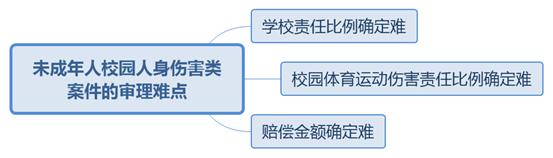
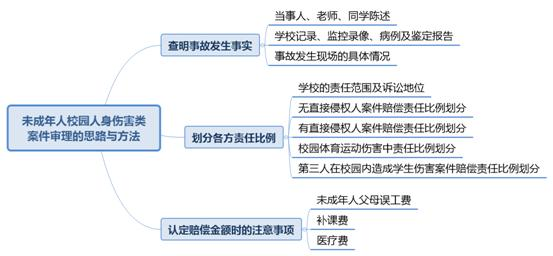

### **未成年人校园人身伤害类案件审理思路和裁判要点**

未成年人校园人身伤害类案件是指未成年人在幼儿园、中小学校园内出现人身伤害事故而引发的案件。该类案件包括生命权、健康权、人身权纠纷和教育机构责任纠纷两种案由。未成年人校园人身伤害类案件在传统涉少民事案件中占比较大。该类纠纷中责任比例的划分是案件审理的重点和难点。实践中校园人身伤害类案件改发率明显高于其他涉少民事案件，其中学校责任性质和比例认定不当是此类案件被二审改发的重要原因。现结合典型案例对此类案件的审理思路和裁判要点予以梳理和总结。

**一、典型案例**

**案例一：涉及学校教育、管理不当责任的认定**

体育课上，体育教师组织学生A、学生B所在班级开展游戏活动。活动过程中A推搡B，后B报复推倒A并致A骨折受伤。经审理查明，游戏过程中秩序尚可，体育教师一直在外圈同学身后关注学生动态；活动开始前学校进行过安全教育；A陈述在游戏过程中与学生C也曾互相推搡，但体育教师对A与B、A与C之间的推搡行为均未进行教育或阻止。后学校、A、B三方因就赔偿事宜协商不成诉至法院。

**案例二：涉及自甘风险原则在校园体育运动中是否适用**

体育课上，学生D、学生E等人被教师安排进行篮球比赛。D、E争抢篮球时发生碰撞，致D重心不稳摔倒受伤。后经审理查明，在进行篮球活动时体育教师未在旁监管、保护。D认为自己受伤是因E在进攻时冲撞所致，E应承担70%赔偿责任。E则认为篮球运动属高风险运动，D年满12周岁应当对篮球运动可能造成的损害后果具有一定的预判能力，自愿参加高风险运动也应承担由此造成的合理损害，故不愿承担赔偿责任。

**案例三：涉及受伤学生校外补课费是否应当支持**

体育课上，学生F、学生G等人被教师安排进行足球比赛，比赛中G犯规致F小腿骨折。F经治疗后需在家休养2个月。为防止F在家休养期间耽误课业，F父母安排了校外培训机构补习，并为此支付1.5万元补课费。诉讼中F、G、学校对于补课费用是否应纳入赔偿金意见不一。F主张校外补课费用系因受伤无法独立在校学习而产生，应纳入赔偿金。学校则认为已经安排教师为F补课，F去校外培训机构补课并非必要，故补课费用不应纳入赔偿金。

**案例四：涉及受伤学生父母误工费是否应当支持**

体育课上，学生H、学生J等人被教师安排进行足球比赛， H在追球过程中因场地湿滑与J相撞，致J左膝韧带断裂。后因J在上海医院治疗效果不佳，J父母带其至北京医院治疗一个月。J父母主张两人因请假带J至北京治疗而产生的误工费应计入赔偿金。J为此提供了父母的工资卡银行流水。学校则认为J去北京治疗只需母亲一人护理即可，误工费损失应为母亲一人工资。H则认为J去北京治疗并非必要，且父母误工费并非法定赔偿范围，故不认可J父母误工费的主张。

**二、未成年人校园人身伤害类案件的审理难点**

未成年人校园人身伤害类案件中学校方面责任比例的认定、人身损害赔偿金额的确定是此类案件的审理重点和难点。规则允许内的身体碰撞在校园体育运动中难以避免，实践中造成人身伤害的身体碰撞多为体育运动中的正常行为，如何确定过错和责任具有一定难度。

**1****、学校责任比例确定难**

未成年人校园人身伤害类案件与一般的健康权、人身权纠纷案件不同，后者当事人一般只有侵权人和被侵权人两方，而根据《民法典》第1199\-1201条规定，未成年人在学校内受到人身伤害，学校未尽到教育、管理职责的也应承担责任。根据学生年龄不同，学校的归责原则亦不完全相同。在校园人身伤害类案件中，学校大多作为当事人参与诉讼，但教育、管理失职作为致害原因对伤害事故发生有何作用难以直接评估，故学校方面的过错程度相较于直接侵权人较难确定。同时，侵权人和被侵权人为未成年人，其责任大小还需考量未成年人年龄及认知能力等因素，对学校责任比例的认定也有一定影响。

**2****、校园体育运动伤害责任比例确定难**

足球、篮球等存在激烈身体对抗的校园体育运动中发生正常碰撞不可避免，由此造成的伤害事故极易引发纠纷。在此类体育运动伤害事故中，如果学生的碰撞行为属于该项运动中的合理碰撞，且双方均未违反运动规则，那么如何确定学校和学生各方之间的责任，学生各方之间应适用公平责任原则共同分担还是适用自甘风险原则由受害学生自己承担，均成为案件审理难点。

**3****、赔偿金额确定难**

校园人身伤害类案件的被侵权人大多为未成年人，且其中不乏幼童，多数情况下父母会亲自照顾被侵权未成年人，因此被侵权人多会主张父母因照顾而产生的误工费。有些伤势较重不方便前往学校学习的当事人为了不耽误学业还会选择聘请校外辅导教师补课，由此产生的补课费用也会在案件中一并主张。根据《最高人民法院关于审理人身损害赔偿案件适用法律若干问题的解释》第21条第2款规定，家长误工费作为护理费应予支持。多数案件中当事人主张的家长误工费远超法定的护理费标准，特别是当护理期较长或部分家长收入较高时，如果全额支持误工费将过于加重侵权人的赔偿责任，故家长误工费的标准需由法官视情酌定。补课费用由于并非常规赔偿项目，对于有无补课必要、补课时长、费用标准等亦需由法官视情酌定。

**三、未成年人校园人身伤害类案件审理的一般思路与方法**

未成年人校园人身伤害类案件的审理应首先查明案件相关事实，并以填平原则确定人身伤害产生的财产性损失，据此认定各方当事人需要承担的责任比例。学生之间的责任分配应以过错原则为基础。侵权人有过错致他人受伤的，应承担与其侵权行为相适应的责任；被侵权人有过错的，也应承担相应责任，减轻侵权人的赔偿责任。在特殊情况下，法院还可适用公平原则由学生各方均摊责任。无民事行为能力人在学校内受到人身伤害，学校责任承担适用过错推定责任原则；限制民事行为能力人在学校内受到人身伤害，学校责任承担适用过错责任原则。

**1****、查明事故发生事实**

审理校园人身伤害类案件首先需要查明事故发生的基本事实。法院需要听取当事人、在场教师及其他在场学生陈述，并调取查阅学校记录、监控录像、病例及鉴定报告等证据。在学校硬件设施造成学生受伤的案件中，法院还应查看事故发生现场的具体情况。

目前大多数学校及幼儿园均有校园监控设备，通过观看监控录像可以直接查清事发情况。即使没有监控录像，校园人身伤害事故发生后，学校大多会对事故发生情况进行调查并就调查结果形成工作记录，一般情况下第一时间形成的工作记录能够较为真实地反映事故发生的原因及事发状况。

校园人身伤害类案件中，考虑到学生属于未成年人，如果学校不能在第一时间调查查明事故发生的具体原因和情况，那么当事人的陈述很可能更会受到外力和自身记忆减退等因素的干扰，所以此类案件对于学校方面举证责任的要求应较为严格。若因未及时调查事故发生情况致使案件事实无法查清，则学校需要承担相应责任。

学校作为当事人可能不会在工作记录中反映己方工作疏忽等过错，所以法院还需要结合当事人、在场教师以及其他在场学生的陈述等来判断学校有无尽到教育、管理职责，这也直接关系到学校的担责比例。针对学校方面的责任需要重点调查以下内容：

**（****1****）学校是否进行安全教育**

上海市的学校目前一般都会进行必要的日常安全教育。在体育运动伤害案件中需要重点调查学校教师在组织安排学生进行体育活动前有无进行必要的规则讲解、技术动作示范、危险动作提示等安全教育。

**（****2****）学校安全防护设施是否到位**

学校作为未成年人高度聚集的场所，对安全防护设施的要求与一般场地相比应当更高。如果学生受伤可能与学校硬件设施有关，则需要调查学校设施是否符合国家相关标准。此外，如果伤害事故发生在诸如跳高等需要防护器材的体育运动中，在调查案件事实时需要重点查清学校组织该项体育活动所配备的防护器材是否符合体育教学的规定，能否起到充分保护的作用。

**（****3****）事故发生时教师是否在场并进行有效管理**

在校园人身伤害类案件中对学校应承担的教育、管理职责要求较为严格。学生在上课、课间休息、午休或体育活动期间均要求有教师在场监管或楼层巡查。校园人身伤害事故多因学生间的打闹、推搡或其他危险行为所致，因此需查明在场教师对事故发生前的危险行为有无制止，若未及时制止则应认定学校方面未尽到管理职责。

**（****4****）学校救助是否及时**

学生因意外事故受伤后，学校负有及时救助防止伤害结果扩大的责任。若未尽到合理救助义务则学校需对扩大损害的后果承担主要责任。故在调查事实时应了解学校在事发后的救助情况，包括学校是否采取救治措施、处置措施是否适当、送医是否及时、有无及时通知家长等。

**2****、划分各方责任比例**

人身伤害类案件责任比例的划分因素包括当事人过错程度、致害原因力、侵害情节等。在未成年人校园人身伤害类案件中还需要考量当事学生的年龄以及学校管理有无疏漏等因素。

**（****1****）学校的责任范围及诉讼地位**

根据《民法典》第1199\-1201条规定，除第三人在校园内造成学生伤害案件外，学校无论承担过错责任还是过错推定责任，均仅需对自身行为的过错承担相应的赔偿责任。学校承担的是单独的赔偿责任，而非补充责任或共同侵权责任。在该类案件中若学校并无行为过错或管理疏漏，则不应判决学校承担赔偿责任。

**司法裁判应当鼓励学校积极组织学生开展体育运动，在校园体育运动伤害事故案件中对于学校责任比例的认定需更加谨慎**。如篮球、足球等身体对抗激烈的体育运动中，碰撞发生具有即时性，教师难以提前干预或及时制止。此种情形下，若学校已尽到必要的教育、管理责任，则不应再判决学校承担责任；若学校存在一定的教育、管理失职情形但过错并不严重，并非导致事故发生的直接原因，则学校责任一般不应超过30%。

在未成年人校园人身伤害类案件中，学校作为责任主体应列为被告参与诉讼。若被侵权学生未将学校列为诉讼当事人，法院应向其主动释明。若被侵权学生仍拒绝将学校列为被告参与诉讼，则该案件应仅在侵权方的责任范围内进行审理，并告知被侵权学生可另案起诉学校承担赔偿责任。为了更好地查明案件事实，在被侵权学生坚持不将学校列为被告的情况下，法院亦可将学校列为第三人参与诉讼。需要注意的是，根据《民法典》第1189条规定，侵权学生家长也应当作为案件被告，而非仅仅作为法定代理人参与诉讼。

**（****2****）无直接侵权人案件赔偿责任比例划分**

无直接侵权人的校园人身伤害类案件中当事人仅有受伤学生和学校两方，该类案件多因学校硬件设施故障或体育活动课保护不当造成学生受伤。学校硬件设施故障造成学生受伤，除特殊情况外，应由学校承担全部或主要责任。体育活动课上因保护不当造成学生受伤，则需视体育活动危险性、学校防护措施是否到位以及学生有无违反教师指令等因素综合判定双方责任。当学生违反教师指令和安全规定，在体育活动中进行危险动作致自己受伤时，若教师不可能及时制止的，则应由学生承担全部或大部分责任；若教师能及时制止学生危险行为但未制止的，则视情况由学校和学生各半承担责任或由学生承担大部分责任；若学生不存在违规行为，只因学校保护措施不当致使学生受伤，则除特殊情形外应由学校承担全部责任。

**（****3****）有直接侵权人案件赔偿责任比例划分**

未成年人校园人身伤害类案件审理中除对比侵权人和被侵权人过错外，还需考量学校在管理、教育上有无失职及失职行为与伤害后果的关联程度。各方所需承担的责任比例应视具体案情而定，但考虑到涉未成年人案件的特殊性，若学校方面存在明显的教育、管理失职情形，则所承担的责任比例不应低于30%。

如案例一中，A与B互相推搡致A倒地受伤，体育教师看到学生间发生推搡可以制止但未制止，后出现学生受伤情况。考虑到A、B作为未成年人难以预知推搡行为可能导致他人倒地骨折，但体育教师显然应当预见到该行为的危险性但未予制止，故学校所应承担的赔偿责任应高于A、B，最终本案判决学校承担50%的赔偿责任，A、B各承担25%的责任。

确定侵权人、被侵权人责任时，应当考虑通过当事人年龄考察未成年人对行为危险性的认知能力。如果年龄及认知能力不足以认识到动作的危险性，则其承担的责任比例应当降低，学校的责任比例相应提高。一般情况下如果学校方面存在失职、失责行为，则需承担大部分或者全部责任。若未成年学生已超过16周岁，应推定其对行为危险性有充分认知。此种情况下，学校若不存在重大失职、失责行为，则仅需承担小部分责任或不承担责任。

**（****4****）校园体育运动伤害中自甘风险原则须审慎适用**

在篮球、足球运动等校园常见的、对抗性较强的体育活动中，学生经常发生肢体冲撞并因此受伤。通常情况下，参与者自愿参加带有危险性的竞技体育运动，应对可能存在的风险具有一定认知，也应自行承担运动规则下正常冲撞带来的伤害结果，此所谓自甘风险原则。然而，体育活动课上安排未成年学生进行体育运动与成年人之间的竞技性体育运动应有所区别。通常成年人参加竞技性体育运动完全由本人自主决定，而在学校体育课上，学生系根据教师安排参与各项体育活动。学生开展足球、篮球比赛是为了配合体育教师进行体育教学，并非完全自主参与对抗性较强的体育运动。此外，中小学生大多为限制民事行为能力人，对参与体育运动危险性的认知亦不如成年人。因此发生在校园体育运动中的未成年人人身伤害类案件应审慎适用自甘风险原则。

如案例二中，体育运动伤害事故双方当事人均为14周岁以下的未成年人，对篮球运动所存在的风险在认知水平和判断能力上与成年人相比均存在一定差距，故完全适用自甘风险原则令受害方自行承担损害后果并不妥当，由碰撞双方平均承担损失较为合理。法院最终酌情判定D、E及学校按照35%、35%、30%的比例承担责任。

特殊情况下，校园体育运动中未成年人人身伤害类案件亦可适用自甘风险原则。如学生在午休或活动课期间自行组织足球、篮球等身体对抗较为激烈的运动时发生伤害事故，若受伤学生年龄较大并经常参与此类运动，对运动危险性有足够认知，可适用该原则。当此类案件中的伤害事故确因运动中正常碰撞所致，则处理学校责任之外的责任比例时可以适用自甘风险原则，由受伤学生自行承担该部分损失。

**（****5****）第三人在校园内造成学生伤害案件赔偿责任比例划分**

根据《民法典》第1201条规定，校外第三人在校园内造成学生人身伤害的，除第三人根据过错行为承担相应侵权责任外，学校未尽到防止陌生人进入校园、规范第三人在校园内活动等管理职责的，均需承担相应的补充责任。需要注意的是，如果造成学生受伤的校外第三人系学校雇佣的施工人员，则学校应承担过错责任而非补充责任。

**3****、确定赔偿金额**

校园人身伤害类案件人身损害赔偿金的计算，除一般的医疗费、交通费、护理费、营养费、伙食补助费、律师费、鉴定费、伤残赔偿金外，还会产生未成年人父母误工费、补课费等特殊费用，此外在计算医疗费时尚需考虑未成年人身体的特殊性而在裁判时作特别考量。

**（****1****）未成年人父母误工费**

未成年人受伤后如果确需护理，由其父亲或母亲进行护理符合常理，由此产生的父母误工费可予支持。在计算误工费时应要求被侵权人父母提供单位开具的请假及由此造成损失的证明。请假天数不应超过合理的护理期天数，若超过则应按护理期来计算误工费。此外需要注意两点：**一是**如果未成年人家长为无固定职业者，除非当事人可以提供明确证据证明其误工损失，否则一般情况下对其误工费请求不予支持，仅可支持护理费请求。**二是**如果未成年人家长收入较高，也不宜全额支持误工损失。法院应充分考量侵权人对赔偿责任的可预期性，误工费标准不应超过必要的合理范畴。

如案例四中，J父母确因带J至北京医院治疗而请假一个月并由此产生误工费，但护理人员应认定一人为宜，且J父亲的误工费过高，法院最终认定J母亲产生的误工损失1万元可计入人身损害赔偿金。需要注意的是，如果支持了被侵权学生家长的误工费请求，那么在计算损失时不应再重复计算护理费。

**（****2****）补课费**

未成年学生如因伤无法返回学校正常就学必然会影响其学业。家长安排孩子前往校外培训机构或聘请辅导教师补课实属合理，由此产生的补课费也应计入实际损失。被侵权人需提供发票等证据证明其实际支出的补课费用。这里需要注意两点：**一是**如果学校举证证明其已提供教师单独补课等合理救济措施，但被侵权人家长拒绝接受的，则不应再支持补课费；**二是**补课费需在合理范围内。如果被侵权人主张的补课费用过高，则应以市场合理价格来计算补课费用。市场合理价格应以侵权学生或学校提供的大型补习机构的一般价作为参考。同时，因补课所产生的合理交通费损失也应一并支持。

如案例三中，F因腿部骨折无法独立到校学习，故由父母接送至课外培训机构补习实属合理。虽然学校主张已安排教师为F单独补课，但学校安排的补课均在F父母工作时间，F父母难以接送，故法院最终支持了F补课费的主张。

**（****3****）医疗费**

未成年人尚处于身体发育阶段，治疗某些伤病时需要通过多次手术分阶段进行，甚至有的手术可能会相隔数年，因此诉讼时可能存在尚未发生的医疗费。法院可以主动释明被侵权人待医疗费发生后再行主张，主持调解时亦应将后续必然发生的医疗费一并考虑。校园人身伤害案件中若学生面部受伤，当事人常就整容祛疤费用是否属于医疗费产生争议。对此，法院需要考虑到未成年人身体皮肤尚处于生长发育阶段，若不及时祛除疤痕则会造成疤痕继续扩大，而面部明显的疤痕必然会影响未成年人今后的工作、生活，故从保护未成年人利益最大化的角度出发，对于受伤学生此类整容祛疤费用的主张应一并支持。需要注意的是，整容祛疤费用应在合理范围内，若受伤学生前往某些私立整容医院治疗，由此产生高昂的美容费用则不应全部支持，法院可参考公立医院相应治疗费用进行认定。

**四、其他需说明的问题**

学校组织学生外出集体游玩期间，学生人身受到伤害的案件亦可视为特殊的校园人身伤害案件，但其责任承担方式与一般校园人身伤害案件存在以下差异：**第一**，若学校组织的外出集体游玩活动有家长陪同参加，则家长负有监管、教育、保护自己孩子的义务，学校方面除存在组织不当致学生受伤的情况外，一般无需承担赔偿责任。提供游玩场地的经营单位若未尽到合理限度的安全保障义务，则应承担相应赔偿责任。**第二**，若学校组织的外出集体游玩活动并无家长陪同，则学校仍负有对学生的管理和保护义务。若因学校管理、保护不当致使学生受伤，则学校的责任与一般校园人身伤害事故相同。此种情形下游玩场地的经营单位亦同样负有安全保障义务。

（根据少年庭郭海云、张家伟提供材料整理）