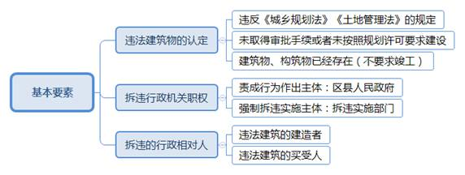
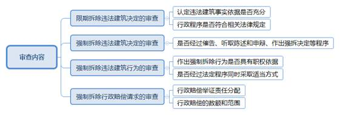

### **拆除违法建筑行政案件的审理思路和裁判要点**

违法建筑是指未取得建设工程规划许可证或者未按照建设工程规划许可证的规定进行建设的建筑物或者构筑物，行政相对人对行政机关拆除违法建筑的行政行为不服的，可以向人民法院提起行政诉讼，由此形成的案件即为拆除违法建筑行政案件。随着违法建筑整治工作持续推进，该类案件数量明显增多。拆违行政执法涉及的法律、政策规定相对复杂，也关系到行政相对人的重要利益，在审理中确实存在不少难点。为正确平衡依法拆违与高效整治之间的关系，强化司法审查和促进适法统一，现结合典型案例对该类案件的审理思路和裁判要点进行梳理总结。

**一、典型案例**

**案例一：涉及拆除违法建筑行政职权的认定**

陈某在A镇租赁土地用于畜禽养殖，租期自2005年1月至2019年1月。2015年6月，A镇某村村委会、不规范畜禽养殖治理办、农发办、“三违”整治办向陈某发送《告知书》，告知其于同年6月12日前办理签约整改，逾期将组织力量代为强制整改并拆除违法建筑。后因陈某并未整改，A镇政府于同年6月19日组织拆除，将其饲养的家禽、家畜及蛋品进行变卖，建筑物内物品予以搬离并登记。陈某不服，以A镇政府组织强制拆除的行为侵犯其合法权益为由诉至法院，请求确认A镇政府作出的强制拆除行为违法，并赔偿其相应损失。

**案例二：涉及限期拆除行政执法程序的审查**

2014年7月15日，B区城管局作出《限期拆除违法建筑决定书》，认定张某于2005年2月新建的砖混及彩钢结构建筑物未取得建设工程规划许可证，系违法建筑。B区城管局于2014年8月12日制作公告，告知自公告发布之日起经过六十日即视为送达。后B区城管局将公告在张某所在村委会公示栏、社区宣传栏张贴，并在城管局官网发布。直至2015年3月，张某方才知晓上述内容。张某不服诉至法院，请求撤销B区城管局作出的《限期拆除违法建筑决定书》。

**案例三：涉及违法拆除行政赔偿范围的判断**

2015年，C区政府对D公司建造的建筑物实施强制拆除，该强拆行为已被确认违法。D公司提出行政赔偿请求，认为房屋及相关设施由D公司实际占有和使用，已支付相应对价，并进行建造、添附、修缮和装潢，C区政府拆除行为剥夺其对可搬迁的建筑材料、装潢材料以及附属设施回收利用的可能，故C区政府应对其强制拆除行为引起的建筑材料、装潢材料等损失与D公司自行妥善拆除引起损失的差额进行赔偿，请求赔偿房屋损失60万元及附属设施损失20万元。

**二、拆除违法建筑行政案件的审理难点**

拆除违法建筑行政案件所涉争议量大面广，区域性、群体性诉讼现象突出，争议处理效果事关区域环境综合整治大局，社会影响较为广泛，且部分建筑的形成具有特殊历史背景或牵涉特定政策因素，对建筑违法性的认定及赔偿口径的把握存在一定复杂性。

**（一）拆违机关职权划分不够明确**

规划管理部门、房屋管理部门、城市管理行政执法部门和乡镇人民政府对拆除违法建筑的职责分工存在交叉，职权不清的问题相对突出。例如，对同种性质的违建，各辖区的拆违主管机关也不相同，这为司法审查带来不少困难。实施强制拆除的主体通常为城建方面的行政机关，但在部分案件中也会涉及村委会、拆迁公司、物业公司或个人等主体，行政相对人认为行政机关系实际上的组织者，但往往无法提供充分的证据予以证明。

**（二）违法行为主体认定相对复杂**

在拆除违法建筑行政案件中，行政相对人可能涉及房屋所有人、违法建筑搭建人或实际使用人等主体。部分建筑可能经历不同主体违法搭建、拆除重建、翻建后才形成查处时的违法建筑状态，甚至部分违法建筑存在多手买卖和出租的情形，这都增加了违法主体的认定难度。

**（三）行政相对人损失数额难以确定**

部分强制拆除行为被确认违法后，当事人就其损失主张赔偿。根据举证责任分配规则，当事人请求行政赔偿应对行政行为造成的损害加以举证，但行政相对人主观上缺乏取证意识，客观上难以提供充分有效的证据。在行政机关实施拆除行为前未作必要保全时，难以认定行政相对人的实际损失。如案例三中，D公司虽提出多项行政赔偿请求，但由于缺乏充分有效的证据，对其实际损失数额难以精确认定。

**（四）强制拆除程序审查标准存在争议**

《行政强制法》对违法建筑拆除行为规定了较为严格的特别程序。在行政执法过程中，行政机关通常适用《城乡规划法》《上海市拆除违法建筑若干规定》等，但这些规定的内容与《行政强制法》的内容并不完全一致，行政相对人经常据此对强制拆除程序的合法性提出质疑。

**三、拆除违法建筑行政案件审理的一般思路和方法**

拆除违法建筑行政案件中，当事人的主要争议集中于行政机关作出的责令限期拆除违法建筑决定、强制拆除违法建筑决定或行政强制拆除行为的合法性，当事人可以单独或一并提出行政赔偿请求。一般的审理思路主要围绕被诉行政行为的职权依据、执法程序、认定事实和适用法律四个方面进行审查和认定。

**（一）明确拆除违法建筑案件的基本要素**

**1****、违法建筑物的性质认定**

涉案建筑物、构筑物是否属于违法建筑，应根据违法建筑的法定要件进行判断。**首先**，违法建筑是行为人违反《城乡规划法》《土地管理法》等关于建设许可相关规定擅自搭建的建筑物、构筑物或其他设施，是否违法是界定建筑性质的首要标准。**其次**，违法建筑客观上表现为未依法取得建设工程规划审批手续或未按照规划许可要求进行建设，以及未取得临时建设规划许可建设临时建筑或超过批准期限逾期未拆除临时建筑等。**最后**，违法建筑以存在建筑物、构筑物为前提。该要件的认定只要求行为人已经投入资金、设备进行实际建设而不要求已经竣工。根据是否竣工可将违法建筑区分为存量的违法建筑和在建的违法建筑。如案例二中，可根据上述标准对张某于2005年2月新建的砖混及彩钢结构建筑进行认定，由于并未取得建设工程规划许可证等审批手续，该建筑确属违法建筑。

**2****、拆违行政机关的职权判断**

对违法建筑具有行政执法权的主体较为多样，一般可根据行政机关提供的职权依据判断相关主体是否具有相应的行政职权。强制拆违必须由拆违决定作出部门向区县人民政府提出申请，由区县人民政府责成有关部门强制拆除。**责成行为的作出主体是区县人民政府，而强制拆违行为的实施主体是拆违实施部门**。拆违实施一般由不同部门按照职责分工分别负责，房管部门负责建筑物本体内违法建筑的拆除，包括屋顶、阳台、天井内违法建筑；城管部门负责公共绿化、道路或者其他场地违法建筑的拆除；规划部门负责原有房屋未经批准重建的违法建筑拆除；乡镇人民政府负责在乡、村庄规划区内未依法取得乡村建设规划许可证或者未按照许可进行建设的违法建筑的整改和拆除。

目前，上海市的拆违行政执法权存在下沉趋势，各区已基本形成由区政府作为主管机关、城市管理行政执法部门及乡镇人民政府作为实施机关的违建治理格局。部分区也出台了相对集中行使行政处罚权的配套规定。如《关于扩大浦东新区城市管理领域相对集中行政处罚权范围的决定》，规定浦东新区城市管理综合执法部门负责浦东新区（浦东国际机场地区除外）城市管理综合执法工作，行使对城镇、集镇规划、建设、市容环卫、环保、河道管理等相关违法行为的行政处罚权。

**3****、拆除违法建筑行政相对人的查明**

    违法建筑的权利人可能包括房屋所有人、出资人、违法建筑搭建人和实际承租人等不同主体，部分违法建筑还经历多手买卖和出租。实践中，法院主要根据违法建筑查明时的状态认定其权利主体，一般不认可建筑承租人具有相应利害关系，应将违法建筑的建造人、买受人作为拆除违法建筑中的行政相对人。行政相对人对行政机关拆除违法建筑的行政行为不服的，可向人民法院提起行政诉讼。如案例二中，根据查明的事实，涉案违法建筑物由张某建造并实际使用，应将张某作为拆除违法建筑行为的行政相对人。

**（二）审查拆违行政争议涉及的具体内容**

**1****、限期拆除违法建筑决定的审查**

对经查证确属违法建筑需要拆除的，拆违实施部门应当作出责令限期拆除的书面决定。限期拆除违法建筑决定是作出强制拆除决定的基础和前提，确定强制执行的具体内容，亦是争议的关键所在。审查责令限期拆除决定是否合法，关键在于判断行政机关认定违法建筑的事实依据是否充分。实践中，存在两种常见的违法情形需引起注意：**一是**部分行政机关在进行违法建筑认定时存在事实认定错误。如将合法行为错误认定为违法建设行为，将合法建筑错误认定为拆除对象，错误拆除第三人的房产等。**二是**部分行政机关对违法建筑认定不够清晰。如未明确涉案房屋的建造主体，仅列明房屋的门牌号码，甚至将承租人直接认定为房屋建造主体，这些情形往往会引起当事人对限期拆除决定合法性的质疑。

实践中，法院需注重对行政程序的审查，重点把握以下几个方面：行政机关是否作出书面决定并依法送达，是否履行告知义务，是否保障当事人陈述、申辩权利，是否对其提出的事实、理由和证据进行复核等。拆违实施部门应当依法将责令限期拆除决定送达当事人并予以公告。当事人难以确定或者难以送达的，可以采用通告形式，告示期限自通告发布之日起不少于十日。

如案例二中，B区城管局采取公告送达被诉限期拆除决定，其前提条件是张某作为受送达人下落不明或者采用其他方式无法送达。诉讼中，B区城管局提交视频证据证明其直接送达未成功，但未出示采用留置、邮寄等其他方式仍无法送达的证据，直接采用公告送达的方式依据不足，属于程序违法。

**2****、强制拆除违法建筑决定的审查**

当事人在法定期限内不申请行政复议或者提起行政诉讼，又不拆除违法建筑的，拆违实施部门应当报请市或者区人民政府作出强制拆除决定，责成拆违实施部门予以强制拆除。当事人在规定限期内拒不拆除时，催告程序是作出强制拆除决定的前置程序，也是作出强制拆除决定的必要条件，缺少该环节将直接导致强制拆除决定违法。行政机关应当以书面形式作出催告并直接送达相对人，明确告知其履行义务的期限和内容。除此之外，听取陈述和申辩程序也是作出强制拆除决定的必经程序和前提条件，亦是保障当事人合法权益的基础程序。

**3****、强制拆除违法建筑行为的审查**

强制拆除行为是对强制拆除决定的具体执行。只有在行政机关作出限期拆除决定后，明确违法建筑权利人负有拆除违法建筑的义务，并在作出强制决定之后当事人未在规定期限内自行拆除，方可实施强制拆除。对强制拆除行为合法性的审查，可从两个方面进行：

**首先，**审查行政机关是否具有实施强制拆除行为的职权依据。拆违实施部门对正在搭建的建筑物、构筑物可以采取强制措施，行政相对人在规定期限内无正当理由拒不履行拆除义务的，拆违实施部门无权自行强制拆除，只能申请区县人民政府组织实施强制拆除。拆违决定确定的拆除期限和拆除义务具有强制性，强制拆除行为应当以当事人在规定的期限内无正当理由逾期未履行拆除义务为前提。

**其次**，审查强制拆除执法行为是否遵循法定程序和采取适当方式。重点审查以下内容：**一是**除非存在紧急情况行政机关不得在夜间或者法定节假日实施行政强制执行。**二是**行政机关不得对居民生活采取停止供水、供电、供热、供燃气等方式迫使当事人履行相关行政决定。**三是**对正在搭建的违法建筑，应当根据快速拆违程序及时清除不法状态。**四是**在拆违时行政机关应当尽到合理注意义务，如依法通知行政相对人取走违法建筑内的财物。在行政相对人未取走的情况下制作财物清单，妥善保管财物并通知领取。**五是**在实施拆违执法过程中，执法机关应当根据规定进行拍照、录像，保证取证完整性等。行政机关未按上述规定进行拆除的，既可能会导致拆除行为被确认违法，也可能引发后续的行政赔偿纠纷。

**4****、强制拆除行政赔偿请求的审查**

当事人对于拆违决定或者拆违行为不服，往往一并提出行政赔偿诉讼，请求行政机关对拆违行为造成其合法权益的损失予以赔偿。根据最高法院《关于行政诉讼证据若干问题的规定》第5条规定，当事人应当对强制拆除违法建筑造成损害的事实提供证据。当事人如果不能提供证明损害事实的有效证据，则应承担败诉风险。实践中，行政相对人在主观上往往缺乏取证意识，客观上难以靠近拆除现场，致使其举证能力较弱。对此可合理运用《行政诉讼法》第38条第2款关于举证责任倒置的规定，在行政赔偿、补偿的案件中，因被告的原因导致原告无法举证，由被告承担举证责任。实践中，行政机关负责对损失进行举证的情形，主要包括因违法造成证据灭失或取证困难等。

强制拆除会导致建筑材料在某种程度上的毁损，影响其重复利用价值，对此行政相对人往往要求赔偿损失。实践中，首先应肯定违法建筑的搭建人对建筑材料的所有权，行政机关在拆除过程中应负有必要的审慎义务，采用适当方式拆除。若强制执行实施前行政机关已经进行催告、公告等程序，相对人无正当理由逾期拒不自行拆除的，应对强制拆除造成的建筑材料毁损承担相应责任。只要行政机关没有严重不合理的毁损行为，则对建筑材料的毁损一般不予赔偿。对于拆除的建筑材料，应告知相对人自行处理。如相对人在合理期间内不及时清理导致建筑材料灭失，行政机关不承担赔偿责任。若行政机关未尽合理注意义务造成损失的，应予以赔偿。行政赔偿数额的认定方法包括评估、鉴定或者参照生活经验酌定等，还可参照补偿标准确定具体赔偿数额。如案例一中，A镇政府违法行使职权作出被诉行政强制拆除行为造成陈某财产损失，应当承担赔偿责任。对具体赔偿数额的认定需要充分考量有关证据情况，结合一般的生活经验进行认定。

**四、其他需要说明的问题**

**（一）注重对行政相对人信赖利益的合理保护**

有些违法建筑是在特定历史条件下产生的，如为开展招商引资、解决住房紧张、改善旧区居住条件以及解决下岗职工自谋就业等问题，催生了一定数量的违法建筑。此类建筑由于缺乏及时监管，行政相对人因违法建筑长期未被拆除而产生了信赖利益。此类拆违整治极易引发行政相对人的不满和对抗，对此应引起足够重视。此外，由于历史政策因素、行政机关隶属改革变更等原因造成一些建筑的原建设审批程序不规范，甚至出现建筑设计图纸遗失的情况，该类违法建筑的形成具有特殊性。对该类建筑是否违法的认定需要结合历史背景和相关政策因素，兼顾行政相对人的信赖利益，通过协调有关方面对相对人进行合理补偿。

**（二）注重对拆违行政纠纷的协调化解**

在依法查明事实、适用法律的基础上，应当注重对当事人进行法律释明，并积极协调化解纠纷，探索拆违行政案件的多元化纠纷解决机制。尤其是在强制拆除行为已被确认违法的案件中，要对行政相对人的赔偿请求探寻协调的可能性，积极为各方搭建沟通交流平台，努力促进各方和解。

（根据行政庭岳婷婷、刘天翔提供材料整理）