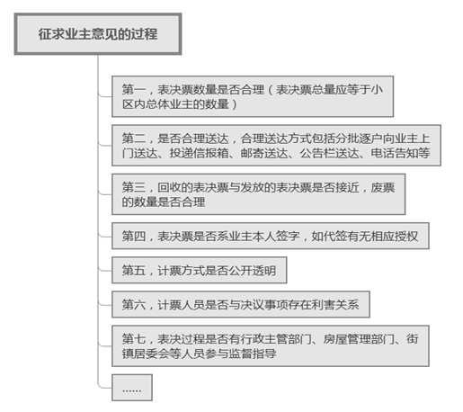
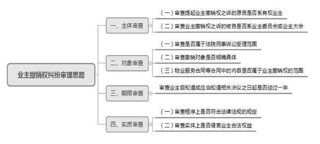

### **业主撤销权案件的审理思路和裁判要点**

《民法典》《物业管理条例》等法律法规规定了业主有权共同决定和管理与共有相关的事项，在重大事项的决策中还规定了“特别多数决规则”，但在业主大会或业主委员会决议的形成过程中仍有可能存在违反程序规定或侵害部分业主权益的情况，故赋予相关业主撤销权。业主撤销权撤销的是业主大会或业主委员会的决议，而相关决议是物业管理事项推进的基础，故厘清业主撤销权案件的审理思路和裁判要点是物业类纠纷处理的基石。

**一、典型案例**

**案例一：涉及撤销权行使期限的认定**

A公司系涉案小区业主。2013年12月，A公司诉至法院，要求判令撤销涉案小区业主委员会2012年4月13日的表决结果。本案主要争议焦点在于该撤销权的行使应自何时起算。业主委员会认为该表决结果应当自该公告公布之日2012年4月13日起算；A公司则认为其2013年5月提起行政诉讼时才知道该公告，应当从知情之日起开始计算。

**案例二：涉及违反法律规定程序的认定**

陈某、吕某系涉案小区业主。2014年6月，业主委员会与物业公司签订物业服务合同，期限为2年。2016年4月，业主委员会组织召开业主大会，讨论选聘或续聘物业公司事宜，并通过发放表决票由全体业主投票决定。2016年5月，业主委员会发出通知，根据业主大会决议及业主投票结果，不再续聘现有物业公司。陈某、吕某以相关表决票的发放、回收、计票等均违反程序为由，要求撤销解聘现有物业公司的决定。

**案例三：涉及侵害业主合法权益的认定**

B公司系涉案小区开发商及相关物业产权人。小区建成后，由C物业公司提供前期物业管理，前期物业费收费标准为住宅每月3.5元/m2元，商业用房每月1.18元/m2。涉案小区业主委员会成立后，与D物业公司签订新的物业合同，其中约定商业用房的物业服务费为每月9元/m2。B公司认为业主委员会作出调高商业用房物业服务费的决议侵害其合法权益，故起诉至法院要求撤销该决议。

 **二、业主撤销权案件的审理难点**

业主撤销权主张能否成立的关键在于相关决议是否违反法律规定程序或侵害业主实体权益。实践中，业主自治的表决程序需要组织众多业主进行投票，工作流程繁琐，不规范现象时有发生；实体问题则涉及业主共有部分和专有部分的利益交织，经常导致权利冲突，使得此类案件的审理存在难度。

**（一）对是否违反法律规定程序的认定难**

业主程序权益受到侵害主要是指业主大会或业主委员会所作决定的内容虽未明显侵害业主的合法权益，但其决定逾越了法定或约定的权限范围或者决定程序违反法律法规的规定。在公共事务的管理和决定上通常适用“多数决规则”。诸如建筑物区分所有面积的认定、业主人数的确认，以及表决票的发放、送达、回收等问题争议较大。

**（二）对是否侵害业主实体权益的认定难**

业主实体权益主要包括：1、对建筑物内的住宅、经营性用房等专有部分享有所有权；2、对专有部分以外的共有部分享有共有权；3、对共同管理事项享有成员权。实践中在认定是否侵害业主所有权、共有权或成员权时存在诸多难点，如物业费标准的调高、物业公司的选聘和解聘等决定是否侵害业主权益，涉及小区停车管理的决议如何认定等。

**（三）法律规定较原则，评判依据确定难**

《民法典》《物业管理条例》《建筑物区分所有权司法解释》是审理业主撤销权纠纷的基础规范，但对业主实体权益、程序正当性如何认定等规定不够明确，加大了业主撤销权纠纷的审理难度。此外，《上海市住宅物业管理规定》等地方性法规及行政主管部门的政策性文件会对业主权益有所规定，各小区的业主大会议事规则和管理规约的修订亦增加了审理此类案件法律适用的复杂性。

**三、业主撤销权案件的审理思路与裁判方法**

业主撤销权作为一种特殊的形成权，仅能通过诉讼的方式实现。**在业主撤销权纠纷审理过程中，既要鼓励、支持业主自治组织的管理，又要通过业主对不当决议行使撤销权促使管理更为规范、有效。法院应当以相关法律法规、政策性文件及小区内部管理规约为基础，结合个案实际情况，兼顾原则性和灵活性，妥善处理好业主个人权益和小区公共利益之间的平衡。**

**（一）审查业主撤销权纠纷的主体是否适格**

**1****、审查提起业主撤销权之诉的原告是否系有权业主**

《民法典》和《物业管理条例》将撤销权赋予合法权益受到业主大会和业主委员会所作决定侵害的业主，即房屋的所有权人。通过租赁方式获得房屋使用权的承租人或其他物业使用人均无权提起业主撤销权之诉。基于与建设单位之间的商品房买卖民事法律行为，已经合法占有建筑物专有部分，但尚未依法办理所有权变更登记的人，可认定为业主。但只有合法权益受到侵害的业主方可提起撤销权诉讼，实体上或程序上未受侵害的业主不享有撤销权。特别需要指出的是，根据诚实信用原则及禁止反言原则，在表决时投票赞成或未明确表示异议的业主不享有业主撤销权。

较为特殊的是，因公房的所有权归国家所有，一般由国家行政机关授权相关主体对公房进行管理、出租等，如该权利人取得了行政机关的授权，则应视为其具备业主同等法律地位，有权对业主大会或者业主委员会作出的侵犯业主合法权益的行为请求予以撤销。

**2****、审查业主撤销权之诉的被告是否系业主委员会或业主大会**

业主撤销权针对的是业主大会和业主委员会的决议，故业主撤销权纠纷的被告仅能为业主大会或业主委员会。一般而言，针对业主委员会的决议，应以业主委员会为被告；针对业主大会的决议，应以业主大会为被告。然而，业主大会作为全体业主集体决策共有以及共同管理事项的议事会议，本身并不具有实体性，而业主委员会作为业主大会的常设执行机构负责处理日常事务，从应诉能力、诉讼便捷处理等方面考量，目前实践中对此类情形下将业主委员会列为被告宜作宽松处理，相应诉讼后果仍由全体业主承担。

需注意的是，业主委员会委员在作出相关决定时系职务行为，其委员身份的变化并不影响业主委员会的主体资格。同时，业主不能以业主委员会委员个人为被告提起撤销权之诉。物业公司因并非相关决议的作出主体，故亦非业主撤销权之诉的适格被告。

**（二）审查撤销对象是否系业主大会或业主委员会的具体决议**

**1****、审查是否属于法院民事诉讼受理范围**

实践中，业主经常无法辨别提起业主撤销权之诉的事由，法院立案审查时可先就业主提出的撤销内容是否属于诉讼受理范围进行审查。不属于受理范围的情形主要包括：（1）因选任、罢免业主代表、业主委员会委员发生纠纷的；（2）业主之间对是否起诉、选聘物业公司等内部事务无法形成一致意见的。

**2****、审查撤销对象是否明确具体**

如业主主张不认可业主大会或业主委员会的所有决议或某个时间段内的所有决议，并要求法院全部予以撤销的，法院应当对其进行释明，要求业主明确其具体需要撤销的决议内容，若其仍然要求概括性撤销决议并坚持不予更改的，法院可以诉请不明为由裁定驳回业主起诉。

如业主要求撤销的仅仅是业主大会或业主委员会的征询意见稿或其他还未形成的具体决议，则因不存在可撤销的内容，法院亦可裁定驳回业主起诉。

**3****、物业服务合同等合同中的内容是否属于业主撤销权的范围**

业主撤销权的对象是业主大会或业主委员会的决定，业主大会或业主委员会与物业公司等签订的合同并非业主撤销权的对象。业主个人无权就物业服务合同中的内容行使撤销权。如业主坚持要求撤销物业合同的内容，则法院可裁定驳回业主起诉。

法院可对当事人进行释明，虽然业主不能要求撤销物业服务合同的内容，但物业服务合同的内容一般有业主大会或业主委员会的相应决议作为依据，业主可请求撤销物业服务合同订立所依据的业主大会或业主委员会的相关决议。

**（三）审查业主自知道或应当知道相关决议之日起是否经过一年**

业主撤销权应当在知道或应当知道业主大会或业主委员会作出决定之日起一年内行使。一年期间为除斥期间，不发生中止、中断或者延长的法律效力。除斥期间过后，撤销权当然消灭，故起算日期的认定在业主撤销权案件的审理中尤为重要。

一般而言，业主委员会有义务证明其已经以合理形式告知各位业主相关决议，如当面告知、在小区的公告栏里公示、在楼道里张贴、投递或邮寄至业主的信箱内、以微信等电子方式予以告知等。法院可根据业主委员会举证证明其告知业主的时间确认相关业主撤销权行使的起算时间。如经法院审查后，业主知道或应当知道业主大会或业主委员会作出决定之日已超过一年，则法院可判决驳回业主诉请，无需对相关决议的内容进行实质性审查。

如案例一中，业主委员会已举证证明其于2012年4月将表决结果予以公告告知，法院据此依法认定A公司于2013年12月提起业主撤销权之诉已超过一年除斥期间，故驳回A公司诉请。

**（四）审查程序是否违反法律规定或实体侵害业主合法权益**

业主撤销权能否成立的重点在于判定业主大会或业主委员会的决定是否违反法律规定的程序或侵害业主的合法权益。需注意的是该决定并不必然表现为公告等正式文件，也可能以会议纪要或其他形式呈现。法院就业主请求撤销相关决议可从程序和实体两个方面着手进行审查：

**1****、审查程序上是否符合法律法规的规定**

对于违反法律规定程序作出的决定，应根据《民法典》《物业管理条例》及业主大会议事规则相关程序要求进行审查。业主大会作出决定之前应将业主大会召开相关事项提前通知全体业主进行投票表决，并根据计票规则作出是否通过相关事项的决定。

**（****1****）由业主共同决定的事项是否达到“多数”要求**

《民法典》第278条明确规定了由业主共同决定的事项。业主共同决定事项，应当由专有部分面积占比三分之二以上的业主且人数占比三分之二以上的业主参与表决。其中，第6项“筹集建筑物及其附属设施的维修资金”、第7项“改建、重建建筑物及其附属设施”和第8项“改变共有部分的用途或者利用共有部分从事经营活动”的表决应适用“特别多数决规则”，即应当经参与表决专有部分面积四分之三以上的业主且参与表决人数四分之三以上的业主同意。除上述三种情形之外的其他事项应适用“一般多数决规则”，即应当经参与表决专有部分面积过半数的业主且参与表决人数过半数的业主同意。

“多数决原则”的适用重点在于对“多数”如何认定，具体分为面积的多数认定和人数的多数认定两方面。根据《建筑物区分所有权司法解释》第8、9条的规定，**对于****面积认定**，专有部分面积按照不动产登记簿记载的面积计算；尚未进行物权登记的，暂按测绘机构的实测面积计算；尚未进行实测的，暂按房屋买卖合同记载的面积计算；建筑物总面积按照前项的统计总和计算。在标准统一的前提下，既可以建筑面积为依据，也可以使用面积为依据，只要在同一建筑区划内采取相同标准即可。**对于****人数认定**，业主人数按照专有部分的数量计算，一个专有部分按一人计算。建设单位尚未出售和虽已出售但尚未交付的部分，以及同一买受人拥有一个以上专有部分的，按一人计算；总人数按照前项的统计总和计算。

需要注意的是，在紧急情况下，小区公共事务的处理并不完全以业主表决通过为前提，而需要对小区公共利益的最大化进行实质性审查，这也是对绝对化适用业主表决自治的修正。如《民法典》第281条第2款规定，紧急情况下需要维修建筑物及其附属设施的，业主大会或业主委员会可以依法申请使用建筑物及其附属设施的维修资金。

**（****2****）征求业主意见的过程是否符合法律法规的规定**

小区公共事务征求业主意见的具体程序问题一般会在业主大会议事规则或管理规约中有所约定，通常可以从表决票发放与回收数量、送达方式、代签情况、计票方式及过程等角度综合审查程序是否符合法律法规的规定。

法院在审查征求业主意见过程的合法性时，应当坚持规则性与灵活性相结合的原则，不可过于机械。如案例二中，业主委员会通过召开业主大会讨论是否续聘物业公司，并通过发放表决票的形式征求业主意见，且选票的送达和回收等均不存在违反法律规定程序的情形，业委会委员亦全程参与表决票的统计，故陈某、吕某以违反程序为由要求撤销相关决议的主张不能成立。

**（****3****）“视为同意”或“视为同意多数”条款的认定**

为提高意见征集的效率、维持小区公共管理的正常运行，业主大会或业主委员会在征集业主意见的时候常会采取附加“视为同意”或“视为同意多数”条款。如在履行表决程序后，在小区公告栏内公示征求业主意见并载明“业主如未在公示期间提出异议视为同意”或在表决票中载明“已送达的表决票，业主在规定的时间内不反馈意见或者不提出同意、反对、弃权意见的，视为同意已表决的多数票意见”。此类条款是否有效在实践中存在较大争议。

“视为同意多数”与“视为同意”不同，“视为同意多数”相当于业主不参与表决并服从多数业主的表决结果；“视为同意”则相当于业主表态为同意，此系对业主实体权益的处置。因此法院对“视为同意”的审查应当比“视为同意多数”的审查更为严格。在审查该两类条款是否有效时，法院可从以下两方面着手：**首先**，如经业主大会通过的议事规则等对此有过明确约定，则该条款应被认定为有效。视为同意票应当纳入投票业主的基数中予以考量。**其次**，如业主大会议事规则等对此没有约定，则法院就该类条款的效力认定应当更为谨慎，具体可从以下几点考量：**第一**，该条款载明的位置是否突出，提示是否明显；**第二**，业主对此是否知道或应当知道；**第三**，相关公示期或规定期限的设置是否合理；**第四**，相关决议事项的紧急和重要程度；**第五**，该决议与业主个人利益的紧密程度等。

**（****4****）业主表决权委托他人行使的审查认定**

根据《物业管理条例》规定，业主可以委托代理人参加业主大会会议。实践中，业主本人不亲自参与业主大会而委托他人代为行使投票权的情况较为常见。就此类情形，业主委员会及相关工作人员在发放选票时应当逐一核实受托人的身份。法院在审查过程中应注意以下几种情形：**第一**，房屋所有权人系多人的，应当共同推选一人或共同委托一人行使表决权；**第二**，房屋所有权人为限制民事行为能力人或无民事行为能力人的，应当由其法定代理人代为行使；**第三**，房屋所有权人为夫妻一方的，一般认为另一方可基于家事代理权代为行使表决权，而无需另行特别授权；**第四**，除上述情形外，应当由业主出具书面的授权委托书并明确授权内容。法院应当对委托问题进行实质审查，就代签人身份、代签人与业主的关系及是否得到业主授权予以审慎考察，同时对于代签时未得到业主授权，但业主事后进行追认的，其投票效力应认定为有效。

**2****、审查实体上是否侵害业主合法权益**

业主所享有的建筑物区分所有权系复合型权利，由专有权、共有权和成员权组成。业主大会或业主委员会作出的决定对全体业主具有法律拘束力，但所作决定剥夺或限制了业主上述权益的，受到侵害的业主有权请求法院予以撤销。

**（****1****）涉及调高物业费标准决议的认定**

物业服务价格一般通过市场竞价与物业公司协商确定，且业主撤销权纠纷中业主的诉讼请求仅指向业主大会或业主委员会，故法院只能从程序上审查业主大会或业主委员会作出调整物业费的决定是否符合法律法规的规定，而一般无需审查物业服务合同中约定的具体价格是否妥当。因此业主仅以物业收费标准过高而提出异议并就此申请撤销的，法院一般不予支持。

当小区内存在不同性质的房屋，如住宅房屋与商铺、别墅与公寓、售后公房与商品房等，业主大会或业主委员可能会针对部分业主作出调整物业费的决议。业主不能以不同性质物业的收费不一或仅调整部分房屋物业费而主张撤销相关决议。“同等服务、同等收费”的原则应适用于性质相同的物业，商铺物业费高于普通住宅物业费并不必然表明商铺物业费标准不合理。

如案例三中，前期物业管理中商业用房物业收费罕见低于普通住宅。业主委员会成立后通过业主大会等法定程序作出调高商业用房物业费的决定，B公司亦行使了业主表决权，且该物业费调价符合市场规律，在此情形下B公司仍主张商业用房物业费的调高侵害其权益缺乏依据。针对部分业主物业费的调整，法院需考量该调整是否违反法律法规规定的程序，以及是否符合“同等服务、同等收费”原则，一般不就物业费收费标准是否合理进行实质性审查。

需特别注意的是，业主大会决议单方面提升小区内处于少数地位的多层房屋业主的物业费标准，应以继续保留原有收费标准双轨制为前提。如决议内容忽视高层与多层房屋的设施差异，强行拉平两者的物业费标准损害多层业主的利益，法院可予以撤销。

**（****2****）涉及选聘或解聘物业公司决议的认定**

选聘或解聘物业公司应由全体业主共同决定。如业主大会或业主委员会作出选聘或解聘物业公司的决定系按照法律规定的程序进行，业主仅以该物业公司提供的物业服务存在问题或瑕疵而主张侵害其合法权益为由要求撤销选聘或续聘该物业公司的决议，法院应当不予支持。

如果物业公司突然撤离，业主委员会无法及时另聘物业公司，考虑到小区的物业管理工作具有不可停止和不可或缺性，且召开业主大会由业主投票决定选聘其他物业公司存在特定程序和时限要求。此时业主委员会可请求小区所在街镇房屋管理部门或居委会等推荐专业服务单位进行临时代管，业主应按临时代管协议的约定支付物业服务费。在此情形下，业主如以该决议未经过业主大会共同决定为由要求撤销的，法院应当不予支持。然而临时代管仅为过渡性质，代管期限不宜过长（一般不宜超过六个月），业主委员会仍应及时召开业主大会就选聘物业公司作出决定。

需要注意的是，小区治理和基层社会治理不可分割。在小区业主大会或业主委员会缺位的情形下，地方政府相关部门、居委会等基于小区整体管理的延续性和稳定性考虑，可能会临时介入小区公共事务管理，如相关决议实质上未侵害小区公共利益，法院就该段期间的相关决议不应轻易推翻。

**（****3****）涉及小区停车管理决议的认定**

小区车位资源紧张导致停车管理已成为小区整体管理中的重要内容。业主大会或业主委员会仅能就公共部分事务进行管理，不能代替业主决定处分其单独所有的部分。如业主大会或业主委员会不得决议将业主专有的绿地等作为全体业主的停车位。此外，占用业主共有的道路或者其他场地的车位属于业主共有，业主大会或业主委员会的决议不能限制或侵害业主对共有停车位的使用。

在小区停车管理中，业主的个体权益并非绝对不受影响。当业主大会或业主委员会作出的决定是为了小区的整体公共利益，而提起撤销权的业主同样是这一决定的受益人，此种情形下业主应当承担相应的容忍义务。对于地下车库的停车位，虽已分别登记在各业主名下，但地下车库整体不具备成为专有部分的条件。对地下车库中共有部分的使用应由小区全体业主决定，小区全体业主的决定不得侵犯地下车位所有权人的合法权益，但对地下车库的使用和管理仍应服从于全体业主的共同利益，如业主委员会出于车库整体管理和行车规范的考量，需对车库进出口或行车路线予以规范，但可能会对部分业主进出其个人车位造成些许不便，此时业主应在合理范围内加以容忍。

**（五）业主撤销权纠纷中的举证责任分配问题**

在实体权益撤销权纠纷中，业主应当举证证明其实体权益因业主大会或业主委员会决议而受到侵害。业主大会或业主委员会也可针对业主的举证，举证证明其作出的决议是出于维护全体业主共同利益的需要，以及对包括原告在内少数业主的权益影响降到了最低或给予了合理补偿。

在程序权益撤销权纠纷中，因程序性相关证据材料一般由业主委员会制作或保管，故业主通常只需提出业主大会或业主委员会决议存在瑕疵的初步证据，业主大会或业主委员会应当对自身所作决定的程序合法性进行举证。

**（六）法院对业主撤销权成立与否的处理**

1、业主诉请仅要求撤销相关决议，如经审查不成立的，则判决驳回其相应诉请；如经审查成立的，则判决撤销相关决议，该决议尚未实施的，则不再发生法律效力。

2、业主诉请要求撤销相关决议并处理撤销权成立后的相关后果，如经审查不成立的，则判决驳回相应诉请；如经审查成立的，可作如下处理：（1）如基于该决议作出的行为已经产生物理性改变，业主要求一并恢复原状的，法院可予以支持。但法律上或事实上已履行不能、不适于强制履行或履行费用过高的，可通过赔偿损失等其他方式履行，法院应对当事人进行释明，引导其变更诉讼请求；（2）如涉及物业公司，法院可在判决撤销相关决议的同时，确认物业合同相关内容或行为无效。

 **四、其他需要说明的问题**

业主撤销权纠纷往往涉及小区内部公共事务相关争议的实质性解决。法院在审理该类案件中应当关注关联案件，深入了解纠纷产生的成因，对社区内部自治组织的不规范行为及时发送司法建议，同时应注重联合相关房屋管理部门、街镇主管部门、居委会等，借助合力共同推进社区和谐管理。

（根据民事庭李兴、丁杏文提供材料整理）