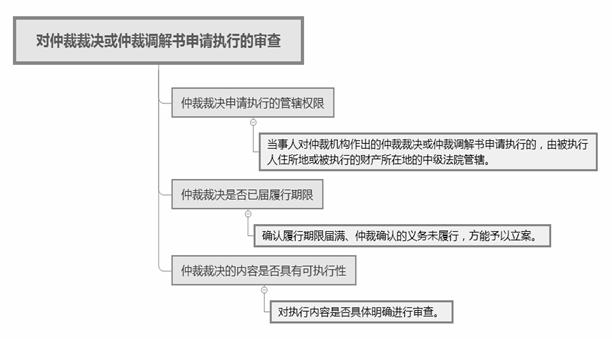
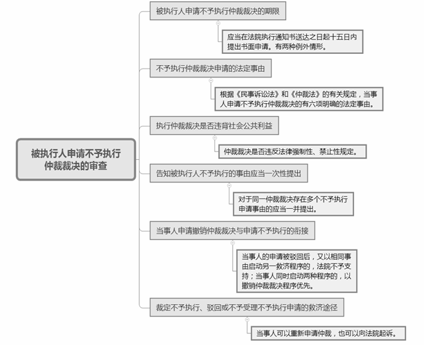
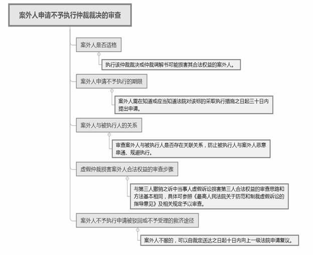

### **仲裁裁决执行案件的司法审查要点和裁判思路**

仲裁裁决执行案件的司法审查，是指在仲裁当事人向法院申请执行过程中，对被执行人或案外人申请不予执行该仲裁裁决或仲裁调解书时的依法审查行为。为规范仲裁裁决执行案件的司法审查，保障当事人的合法权益，防止虚假仲裁、损害案外人合法权益等情况的发生，依照《中华人民共和国仲裁法》（以下简称《仲裁法》）及《最高人民法院关于法院办理仲裁裁决执行案件若干问题的规定》（以下简称《规定》），结合司法实践中的典型案例，对仲裁裁决执行案件的司法审查要点和裁判思路进行梳理、归纳与总结。

**一、典型案例**

**案例一：涉及仲裁裁决执行内容不明确**

某仲裁机构裁决：A公司继续履行与B公司的股权转让协议。B公司向法院申请执行该仲裁裁决，A公司提出执行异议。在执行过程中，法院认为仲裁裁决执行的内容不明确，经向该仲裁机构征询，其仍未对当事人双方继续履行股权转让协议的具体内容作出明确说明。后A公司向执行法院申请不予执行该仲裁裁决。

**案例二：涉及仲裁程序违反法定程序**

某仲裁机构对许某与C公司网络借款合同纠纷作出缺席裁决：许某向C公司偿还借款本金2万余元及相应的利息、违约金等。C公司向法院申请强制执行。许某收到执行通知后向法院提供了借款协议签署前其身份证已遗失的相关证据，以仲裁程序违反法定程序为由申请不予执行该仲裁裁决。

**案例三：涉及仲裁裁决损害案外人合法权益**

某仲裁机构对秦某与吴某签订的房屋买卖合同纠纷作出裁决：吴某向秦某支付购房款。秦某向法院申请执行该仲裁裁决。案外人谢某以秦某与吴某涉嫌虚假仲裁、损害其合法权益为由，申请不予执行该仲裁裁决。经审查，在仲裁过程中，谢某作为房屋第一购买人已向法院请求确认秦某与吴某就该房屋签订的买卖合同因恶意串通损害谢某利益而无效，且法院支持了谢某的诉讼请求。

**二、仲裁裁决执行案件司法审查的基本原则和审查要点**

**法院对仲裁裁决执行案件进行司法审查的过程中，应当遵循有限审查原则。有限审查原则是指法院应当在法律限定的范围内进行审查，而不应当对仲裁裁决进行实体审查，确保仲裁裁决的确定性和稳定性。**《民事诉讼法》第237条第2、3款规定了法院裁定不予执行的法定情形，法院应当据此围绕被执行人申请的事由、案外人的申请进行审查，对被执行人超出法定情形或没有申请的事由一般不予审查。同时，对于有瑕疵可补正的仲裁裁决，法院一般不轻易驳回仲裁裁决执行申请，且法院一般不轻易依职权认定执行该裁决违背社会公共利益而裁定不予执行。

**（一）申请执行仲裁裁决内容不明确的处理**

对于申请执行的仲裁裁决或仲裁调解书中具体权利义务等内容不明确的，法院不宜简单地裁定驳回，应当审查仲裁裁决书的全文，可以补正或说明的应当书面告知仲裁机构补正或说明，或者向仲裁机构调阅仲裁案卷查明。仲裁机构对相关具体权利义务等内容仍无法明确导致无法执行的，法院可以裁定驳回执行申请。如案例一中，仲裁机构作出“继续履行协议”的仲裁裁决，但仲裁裁决的具体内容不明确，经向该仲裁机构征询，其仍未对继续履行的具体内容作出明确说明，故法院裁定驳回执行申请。

**（二）仲裁违反法定程序的认定**

仲裁程序应当遵守正当程序原则。如当事人主张仲裁机构未按照《仲裁法》或仲裁规则规定的方式送达法律文书导致其未能参与仲裁，可能影响公正裁决，经审查属实的，法院应当裁定不予执行。如案例二中，仲裁机构按照其网络仲裁规则，仅根据网络借贷格式合同约定项下的内容，在许某未经有效送达的情形下径行作出缺席裁决。在该案司法审查中，许某提供了借款协议签署前其已向公安机关报案遗失身份证的相应证据，而C公司未能举证证明仲裁所依据的网络借款协议为许某本人签署。该仲裁机构的仲裁裁决违背正当程序原则，故依法裁定不予执行。

**（三）以对方当事人隐瞒证据为由申请不予执行的认定**

法院首先应当审查仲裁机构的举证责任分配，若发现同时符合以下条件，则应当认定为“对方当事人向仲裁机构隐瞒了足以影响公正裁决的证据的”情形：该证据属于认定案件基本事实的主要证据；该证据仅为对方当事人掌握，但未向仲裁机构提交；仲裁过程中知悉存在该证据，且要求对方当事人出示或者请求仲裁机构责令其提交，但对方当事人无正当理由未予出示或者提交。

**（四）仲裁裁决损害案外人合法权益的处理**

案外人认为仲裁裁决损害其合法权益的，需提供证据证明案件当事人存在恶意申请仲裁或者虚假仲裁等情形。如案例三中，法院已确认秦某与吴某就涉案房屋签订的买卖合同因恶意串通损害谢某利益而无效，谢某以此为由请求认定秦某与吴某恶意串通、虚假仲裁损害其合法权益，法院对此应予支持。

司法实践中不乏案外人与被执行人恶意串通提出不予执行申请以拖延执行的情形。例如案外人与被执行人为关联公司，且案外人提交的证据不足以证明申请执行人与被执行人存在虚构法律关系、捏造案件事实且损害案外人权益的情形，法院应当驳回案外人的不予执行申请。

**三、仲裁裁决执行案件的司法审查步骤**

**（一）对仲裁裁决或仲裁调解书申请执行的审查步骤**

****

法院对当事人申请执行仲裁裁决或仲裁调解书的，在立案环节仅进行形式审查，只要符合相关规定的，一般应当立案受理。法院不应当主动援引时效抗辩拒绝立案。

**1****、****审查仲裁裁决申请执行的管辖权限**

当事人对仲裁机构作出的仲裁裁决或仲裁调解书申请执行的，由被执行人住所地或被执行的财产所在地的中级法院管辖。中级法院依法指定基层法院管辖的，被执行人、案外人对仲裁裁决执行案件申请不予执行的，由负责执行的中级法院另行立案审查处理。

**2****、****审查仲裁裁决是否已届履行期限**

法院应当对仲裁裁决或仲裁调解书主文中的履行期限进行审查，确认履行期限届满、仲裁确认的义务未履行，方能予以立案。

**3****、****审查仲裁裁决的内容是否具有可执行性**

法院受理仲裁裁决或仲裁调解书执行申请时，应当对执行内容是否具体明确进行审查。主要包括：仲裁确定的权利义务主体是否明确；金钱执行的具体数额和计算方法是否明确；交付的特定物是否明确；行为履行的标准、对象和范围是否明确。如果裁决内容为继续履行合同，则应对继续履行的权利义务，以及履行的方式、期限等具体内容是否明确进行审查。

若发现执行内容不明确无法执行的，执行机构应当书面告知仲裁机构补正或说明，或者向仲裁机构调阅仲裁案卷查明。如果仲裁机构不补正也不说明，或者补正、说明后仍不明确，法院调阅仲裁案卷后执行内容仍不明确导致无法执行的，法院可以裁定驳回执行申请。当事人不服驳回执行申请的，可以提出执行异议，由法院执行裁判部门审查裁定。

**（二）对被执行人申请不予执行仲裁裁决的审查步骤**

****

当事人在收到仲裁裁决或仲裁调解书后，既不按仲裁确定的义务履行，也不申请撤销仲裁，而在执行过程中申请不予执行仲裁裁决是较为常见的。除依照《民事诉讼法》第237条、第274规定对国内仲裁、涉外仲裁分别进行审查外，法院执行裁判部门在审查被执行人不予执行仲裁裁决的申请时，还应当审查以下内容：

**1****、****审查被执行人申请不予执行仲裁裁决的期限**

《规定》第8条对被执行人申请不予执行仲裁裁决的期限作出新的限定。被执行人申请不予执行仲裁裁决的，应当在法院执行通知书送达之日起十五日内提出书面申请。当存在“裁决所依照的证据是伪造的”或“仲裁员在仲裁该案时有贪污受贿，徇私舞弊，枉法裁决行为”两种情形时，应当自知道或者应当知道有关事实或案件之日起十五日内且执行程序尚未终结前提出书面申请。

**2****、****审查不予执行仲裁裁决申请的法定事由**

根据《民事诉讼法》和《仲裁法》的有关规定，当事人申请不予执行仲裁裁决的法定事由包括：（1）当事人在合同中没有订立仲裁条款的；（2）裁决的事项不属于仲裁协议的范围或者仲裁机构无权仲裁的，包括涉及婚姻、继承等人身法律关系争议和行政争议；（3）仲裁机构的组成或者仲裁的程序违法的；（4）裁决所根据的证据是伪造的；（5）对方当事人向仲裁机构隐瞒了足以影响公正裁决的证据的；（6）仲裁员在仲裁该案时有索贿受贿，徇私舞弊，枉法裁决行为的。按照禁止反言原则，被执行人对仲裁调解书不得申请不予执行。

**3****、对执行仲裁裁决是否违背社会公共利益的审查**

对申请不予执行仲裁裁决的司法审查，一般应当根据上述法定事由围绕被执行人申请的事由、案外人的申请进行审查，对被执行人没有申请的事由不予审查，但仲裁裁决可能违背社会公共利益的除外。仲裁裁决是否违反法律强制性、禁止性规定，是法院认定执行仲裁裁决或调解书是否违背社会公共利益的重要考量因素。在《规定》施行后，如果法院认定执行某仲裁裁决违背社会公共利益，应当裁定不予执行该仲裁裁决。

**4****、****告知被执行人不予执行的事由应当一次性提出**

在被执行人申请不予执行仲裁裁决立案和听证审查过程中，应当询问被执行人是否已申请撤销仲裁裁决，并告知被执行人应当依照法定事由提出不予执行申请。对于同一仲裁裁决存在多个不予执行申请事由的应当一并提出；仅以部分事由提出不予执行申请被驳回后，以其他事由再次提出申请的，法院不予审查。

**5****、****当事人申请撤销仲裁裁决与申请不予执行的衔接**

申请撤销或不予执行仲裁裁决，是法律赋予当事人的两种救济程序。现行法律对两种程序申请事由的规定基本相同，法院对当事人申请两种程序的情况应按以下规则处理：**第一**，在申请撤销或不予执行仲裁裁决审查中，当事人的申请被驳回后，又以相同事由启动另一救济程序的，法院不予支持。**第二**，当事人同时启动两种程序的，以撤销仲裁裁决程序优先，受理不予执行申请的法院应中止审查。如果仲裁裁决被撤销或决定重新仲裁的，法院应当裁定终结执行，并终结对不予执行申请的审查；如果撤销仲裁裁决申请被驳回或申请执行人撤回撤销仲裁裁决申请的，法院应当恢复对不予执行申请的审查，但可适度简化审查程序；如果被执行人撤回撤销仲裁裁决申请的，法院应裁定终结对不予执行申请的审查，但案外人申请不予执行仲裁裁决的除外。

在仲裁裁决执行案件司法审查期间中止执行的，是指中止处分性执行措施而非控制性执行措施，以防止当事人通过上述两种救济程序规避、拖延或阻碍执行。

**6****、裁定不予执行、驳回或不予受理不予执行申请的救济途径**

法院裁定不予执行仲裁裁决、驳回或者不予受理不予执行仲裁裁决申请后，当事人对该裁定提出执行异议或者申请复议的，法院不予受理。法院裁定不予执行仲裁裁决的，当事人可以根据双方达成的书面仲裁协议重新申请仲裁，也可以向法院起诉。

**（三）案外人申请不予执行仲裁裁决的审查步骤**

《规定》根据第三人撤销之诉的法理基础创设了案外人申请不予执行仲裁裁决制度。当案外人有证据证明仲裁案件当事人恶意申请仲裁或者虚假仲裁，损害其合法权益，且案外人主张的合法权益所涉及的执行标的尚未执行终结的，可以在法定期限内向法院申请不予执行仲裁裁决或仲裁调解书，法院应从程序和实体两方面依法严格审查。

**1****、****审查案外人是否适格**

并非所有案外人均可申请不予执行仲裁裁决，适格的申请主体应该是与仲裁裁决执行案件权利义务的相关人，简而言之，就是执行该仲裁裁决或仲裁调解书可能损害其合法权益的案外人。

**2****、****审查案外人申请不予执行的期限**

案外人必须在执行标的尚未执行终结前提出不予执行申请，这是执行程序不承担解决权利义务争议职能的内在要求，旨在维护执行程序的安定性。在法院已经履行执行生效仲裁裁决的职责后，案外人应通过其他救济途径而非申请不予执行来主张权利。

为了保障善意案外人的合法权益，防止案外人与被执行人恶意串通拖延执行，案外人需在知道或应当知道法院对该标的采取执行措施之日起三十日内提出申请。案外人逾期申请不予执行的，法院应当裁定不予受理；已经受理的，应当裁定驳回不予执行申请。

**3****、****审查案外人与被执行人的关系**

赋予案外人申请不予执行仲裁裁决的救济权利，是为了防范当事人虚假仲裁、维护我国仲裁法律制度规范有序的发展。但在实践中也存在被执行人与案外人恶意串通，利用该制度阻碍和拖延执行的情形。因此，在案外人申请不予执行仲裁裁决的过程中，法院应当审查案外人与被执行人是否存在关联关系，防止被执行人与案外人恶意串通、规避执行。

**4****、****虚假仲裁损害案外人合法权益的审查步骤**

虚假仲裁损害案外人合法权益的审查步骤与第三人撤销之诉中当事人虚假诉讼损害第三人合法权益的审查思路和方法基本相同，具体可参照《最高人民法院关于防范和制裁虚假诉讼的指导意见》及相关规定予以审查。

**5****、案外人不予执行申请被驳回或不予受理的救济途径**

法院裁定驳回或者不予受理案外人提出的不予执行仲裁裁决、仲裁调解书申请，案外人不服的，可以自裁定送达之日起十日内向上一级法院申请复议。

法院对案外人不予执行仲裁裁决申请所作出的裁定属于程序性裁定，本身并不对当事人之间的实体权利作出评判与处理，当事人和案外人有权另行提起诉讼解决纠纷。

**四、其他需要说明的问题**

涉及申请认可和执行港澳台仲裁裁决案件，申请承认和执行外国仲裁裁决案件，以及劳动争议仲裁、农村土地承包经营纠纷仲裁等案件，分别适用特别法的相关规定。

（根据民事庭阮国平、马姗姗提供材料整理）