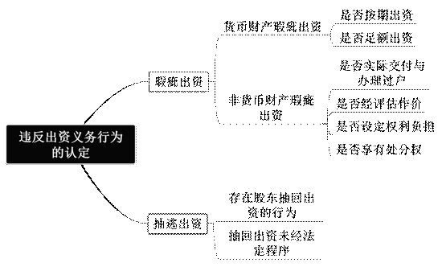
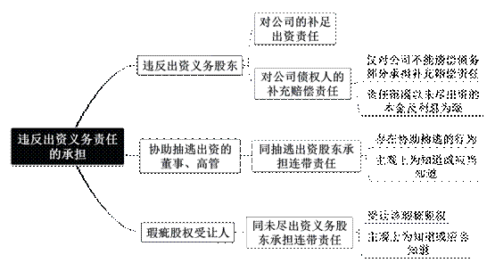

### **股东出资纠纷案件的审理思路和裁判要点**

股东出资形成了公司最基本的资产和对外信用基础。真实有效的股东出资对于公司的存续经营、公司实质资产信用的形成以及债权人利益的保障，都有着极为重要的意义。司法实践中，股东出资纠纷案件存在行为方式多样、法律规范不明确的问题，因此实有必要对此类案件的审理思路与裁判要点予以梳理、提炼和总结。

**一、典型案例**

**案例一：涉及股东违反出资义务行为的认定**

沈某为A公司股东，向A公司增资1000万元。验资完成次日，沈某即以借款名义将1000万元转出。后因A公司未能清偿对外债务，债权人起诉要求沈某在抽逃出资范围内承担赔偿责任，沈某则辩称该款项为向A公司的借款，并非抽逃出资。经查，该笔款项并未签订借款合同，未经股东会决议，沈某亦未返还。

**案例二：涉及股东补足出资行为有效性的认定**

陈某为B公司股东，在B公司验资完成当日即将出资款500万元转出，现B公司要求陈某补足出资。陈某辩称其在公司经营过程中向B公司通过注入流动资金的方式已补足出资。经查，陈某多次向B公司转账，公司账册中仅记载为“往来款、划款”，陈某亦未能提供合同或其他材料证明款项性质。

**案例三：涉及股东违反出资义务的责任承担**

王某为C公司股东，李某为C公司执行董事。王某在出资款转入C公司账户的当日，即将该款项以C公司出具转账支票、加盖李某法定代表人印章的方式转出。现C公司的债权人起诉李某，主张李某因协助抽逃出资应与王某承担连带责任。

**二、股东出资纠纷案件的审理难点**

股东违反出资义务的行为在实践中往往具有隐蔽性和复杂性的特点，其责任承担在法律规定上不够完备，审判实践中亦存在不同理解，故该类案件在审查中存在以下难点：

**（一）股东违反出资义务行为的事实认定难**

股东违反出资义务的行为种类繁多、形式多样，在行为方式上通常借用合法形式掩盖非法目的，例如名为借款或分配利润实为抽逃出资，或者通过虚构交易合同、采取关联交易等方式违法侵蚀公司资产等。对此类行为的审查需要揭开虚假表象进而发现行为实质，事实查明难度较大。如案例一中，A公司股东沈某假借借款名义抽逃出资，形式上虽具有合法性，但实际上并没有与公司达成过借款合意，也没有任何利息约定或偿还借款行为，因此该行为实质系抽逃出资。

**（二）股东补足出资行为的有效性认定难**

股东出资纠纷案件中，违反出资义务的股东往往抗辩其已通过代偿债务、注入资金等多种方式补足出资。然而我国法律对于补足出资行为的有效性认定并无相关规定，且现实中部分公司缺少规范的财务制度，会计账簿亦难以准确反映款项性质，法院审查判断该款项是否为股东的补足出资存在较大困难。如案例二中，B公司财务账册混乱，对股东所称的注资款项性质均无法体现，法院对该补足出资行为的有效性认定存在一定困难。

**（三）股东违反出资义务责任承担认定难**

股东违反出资义务行为涉及到公司内部的资本充实、其他股东和公司债权人利益的保护，在责任承担方式上呈现多样性。《公司法解释三》虽然就不同主体分别规定了不同的责任承担方式，但责任的具体承担方式有待进一步明确，导致司法实践中存在适法困难。如案例三中，一审法院认为无法证明执行董事具有协助抽逃出资的行为，但二审法院认为在股东明显存在抽逃出资行为的情形下，执行董事仍为其开具转账支票用以转出相应款项，已然构成协助抽逃出资。

**三、股东出资纠纷案件审理的一般思路与方法**

我国的公司注册资本制度尚不完备，股东违反出资义务的行为屡有发生。**在当前优化营商环境的总体要求下，有必要通过审慎严格的股东出资义务审查来保证公司资本充实，维护其他股东和公司债权人的合法权益，从而有效保障市场交易安全与秩序。**

**（一）股东出资纠纷案件中诉讼主体的确定**

依据《公司法》及相关司法解释规定，股东出资纠纷案件中原告主体的范围包括：公司、股东、债权人、清算组、破产管理人。公司债权人在股东出资纠纷案件中可将公司和违反出资义务的股东一并起诉，也可在公司未能清偿债务时单独起诉违反出资义务的股东。

股东出资纠纷案件中被告的主体范围包括：违反出资义务的股东、协助抽逃出资的高管、瑕疵股权的受让人。原告可以单独起诉违反出资义务的股东，也可以选择将协助抽逃出资的董事、高管和瑕疵股权的受让人作为共同被告一并起诉要求承担连带责任。

**（二）违反出资义务行为的认定**

《公司法解释三》将违反出资义务行为区分为瑕疵出资与抽逃出资两种。实践中瑕疵出资行为主要集中在非货币财产出资情形，货币财产的瑕疵出资表现为未按期限足额出资，抽逃出资行为则主要集中在货币财产出资情形。

**1****、货币财产瑕疵出资行为的认定**

股东以货币出资时是否存在瑕疵出资行为的审查要点在于出资数额是否充足、出资期限是否符合章程规定。

现行《公司法》规定的注册资本认缴制允许股东通过公司章程约定在一定期限内向公司出资，无需在公司设立或增资时即将认缴出资全部缴足。股东在公司章程中约定的出资数额、出资时间构成对公司和公司债权人所作认缴出资的承诺，并已通过公司章程对外进行公示，公司债权人基于该章程公示的内容产生信赖和预期利益。当股东在章程规定的出资期限届满后仍未足额缴纳出资，或者出资期限届满后通过修改公司章程恶意延长出资期限的，均构成瑕疵出资。

**2****、非货币财产瑕疵出资行为的认定**

**（****1****）非货币财产是否实际交付与办理过户**

股东以非货币财产出资的应当实际交付公司使用，需办理登记的还应办理权属变更登记，缺少任何一项均构成瑕疵出资。法院对于不同情形的处理存在一定差异：若股东既未进行登记，亦未交付使用，则此时构成瑕疵出资；若股东已将非货币出资财产实际交付公司使用，但尚未办理权属变更登记手续，此时法院应责令当事人在法庭辩论终结前或庭审结束后一定期限内办理权属变更登记，未能办理的则认定为瑕疵出资；若股东未将非货币出资财产实际交付使用，即便已办理权属变更登记的，依然构成瑕疵出资，且公司和其他股东可主张瑕疵出资人交付财产后方可享有相应股东权利。

**（****2****）非货币财产是否经评估作价**

股东以非货币财产出资，公司、其他股东或公司债权人主张出资人未履行出资义务的，若该非货币财产未进行评估作价，法院应委托具有合法资质的评估机构进行评估作价。若评估得出的价额低于公司章程所定价额，则应认定为瑕疵出资。

**（****3****）非货币财产是否设定权利负担**

股东以设定权利负担的土地使用权或其他财产出资，或者以划拨土地使用权出资的，法院应当责令股东在合理期限内办理土地变更手续或者解除财产权利负担；逾期未办理或者未解除的，应认定为瑕疵出资。

**（****4****）对非货币财产是否享有处分权**

股东应当以其个人财产进行出资。股东以不享有处分权的非货币财产进行出资的，法院对该出资行为的效力以及公司是否取得该财产所有权的判断，应当依照《民法典》第311条的善意取得条款进行审查。审查要点应当包括：该财产的价值与股权份额之间是否匹配；出资财产需要登记的是否已经登记至公司名下，无需登记的是否已经交付给公司；公司或公司设立时的其他发起人受让该财产时是否为善意。

**3****、抽逃出资行为的认定**

股东抽逃出资同瑕疵出资虽然都会造成公司资本的减损，但两者存在较大差异。瑕疵出资是股东自始至终均未及时足额履行过出资义务，而抽逃出资则是股东在履行了出资义务后又将出资财产取回。对股东抽逃出资行为的认定应从如下两个方面进行审查：

**（****1****）股东有抽回出资的行为**

股东抽回出资存在积极和消极两种行为方式：**积极方式**是指股东从公司直接将资产转出的行为，例如股东将转入公司验资账户的款项再次转入个人账户等；**消极方式**则是指股东虽未从公司转出资产，但存在免除股东对公司应负债务的行为。例如增资过程中公司以自有资金进行增资、为公司内部股东之间的股权转让支付价款等。股东抽回出资行为的构成应当仅限于公司成立之后，在数额认定上应以股东出资数额为限，超过出资数额部分的资金转移仅能由公司依据侵权责任损害赔偿的方式予以救济。

**（****2****）抽回出资行为未经法定程序**

实践中，股东抽逃出资往往是以借款、交易等形式进行，因此在认定是否构成未经法定程序的抽回出资行为，需审查该行为外观的真实性。具体的审查过程中，可结合如下要点综合认定：

**一是**对于以借款名义抽回出资的，应审查借款金额是否达到出资数额的全部或大部分，是否约定有借款利息和偿还期限，是否经过公司股东会决议或董事会决议等内部决策程序，是否在公司财务会计报告中作为公司应收账款处理。

**二是**对于以交易名义抽回出资的，应审查是否有明确的交易磋商签订过程，交易相对方与股东之间是否存在特定关系，标的物价格是否偏离正常价值，交易双方是否有真实的货物交付行为，交易内容是否超出公司日常经营需求。

**三是**对于以利润分配名义抽回出资的，应审查公司的真实盈利情况，以及利润分配是否经过股东会决议、弥补亏损等程序。

如案例一中，股东沈某虽名义上向A公司借款，但借款金额与其出资金额相同，验资完成当日即向公司借款，且借款也未经过公司内部决策程序，综合上述要点法院最终认定沈某的行为实为抽逃出资。

**（三）股东补足出资行为有效性的认定**

股东出资纠纷案件中，违反出资义务的股东往往主张其已补足出资，具体可分为债务抵销型、债务代偿型、股东注资型三种类型，对其有效性应做如下审查：

**1****、债务抵销型补足出资的认定**

债务抵销型补足出资是指违反出资义务的股东主张公司对其负有债务，并以此债务与自己对公司所负补足出资责任相互抵销，进而主张其已完成补足出资。

法院在审查公司对股东所负债务真实的基础上，应认可股东补足出资的有效性。股东对公司的出资义务本质上是股东对公司的所负债务。因此，当股东以其对公司所享有的债权来补足对公司的出资时，本质上属于股东行使抵销权。法院应依照行使抵销权的要件对该补足出资行为的有效性进行审查：审查公司对股东所负债务是否真实、两项债务清偿期限是否均已届满、是否存在难以抵销的障碍。

需注意的是，此处讨论的仅为公司同股东之间内部关系的情形，公司外部债权人对股东主张抵销及债权清偿顺序提出异议的情形实践中存在较大争议。最高法院于2015年3月发布的典型案例认为公司资产应当首先用于清偿非股东债权，剩余部分才能用于清偿股东借款，这种做法具有借鉴意义。

**2****、债务代偿型补足出资的认定**

债务代偿型补足出资是指违反出资义务的股东主张本人或通过第三人已代为清偿公司对外债务，以此主张其已补足出资。

该类型补足出资实质上是第三人代偿债务，是否发生补足出资的效力应取决于公司对该代偿行为是否认可。若公司认可，则该代偿行为对公司发生效力，可以视为股东已完成补足出资；若公司不认可，则股东不得以此代偿行为主张补足出资，对该代偿行为应由股东另案主张。与此同时，法院还应审查该代偿债务是否真实存在，公司与股东是否存在虚构债务来抵偿股东出资义务的情形。

**3****、股东注资型补足出资的认定**

股东注资型补足出资是指违反出资义务的股东在公司经营过程中与公司存在资金往来，其主张向公司注入的一笔或多笔资金为补足出资。

对于此种主张是否可以认定为有效的补足出资，核心在于查明注资款项是否实际注入公司并由公司使用。法院可审查公司是否经过决议流程对该注资形成股东会或董事会决议，是否在财务账册中计入为“实收资本”；可要求该股东提供合同、划款凭证等，就其向公司注资的原因、基础关系等予以证明；可审查该款项的用途和走向以查明是否由公司使用。

如案例二中，陈某虽然声称自己通过注资已补足对B公司的出资，但无法提供证据证明款项的性质，也无法证明转入的资金已由公司使用，因此最终认定陈某未有效补足出资。

**（四）违反出资义务责任的承担**

**1****、违反出资义务股东对公司债务的补充赔偿责任**

违反出资义务的股东对公司负有补足出资的义务，还需对公司债务承担补充赔偿责任。债权人既可在向公司主张债权的同时将违反出资义务的股东一并列为被告，也可在债权人与公司的基础债权债务关系确定后，另案提起股东损害公司债权人利益纠纷诉讼，要求股东承担赔偿责任。在审理中法院应注意如下两点：

（1）违反出资义务的股东仅对公司不能清偿的债务部分承担赔偿责任。法院在判决中应当明确在公司不能履行债务时，由该股东对公司不能清偿的部分承担赔偿责任。

（2）违反出资义务的股东向全体债权人承担赔偿责任的范围应以未履行出资义务的本金及利息范围为限。法院应当查明该股东是否已经在出资本息范围内承担过责任，对已经承担过的部分应当予以扣除。

对于股东已在前案判决中承担补充赔偿责任的，后案判决中是否应当扣除相关赔付金额，法院应区分情况处理：

**一是**若后案查明了股东已承担补充赔偿责任的事实，则在后案判决中扣除股东已赔付金额，判令股东在剩余未出资本息范围内承担赔偿责任。

**二是**若在后案审理中因当事人缺席、前案执行情况无法查明等，致使前案判决中股东责任的履行情况无法查明，后案裁判文书可采用如下表述方式：“被告××（瑕疵出资股东）在未出资本息×××元范围内，对被告×××（债务人公司）上述判决第×条应承担的×××元债务不能清偿的部分，承担补充赔偿责任。被告××（瑕疵出资股东）在其它案件中已实际赔付的部分，不再承担赔偿责任”，以明确后续履行或执行的标准。

**2****、董事、高管等协助抽逃出资的责任承担**

公司的董事、高管等协助抽逃出资的，应与抽逃出资的股东承担连带责任。董事、高管的身份界定应结合《公司法》和公司章程规定，依据公司规模和权力架构作具体判断，在行为方式上需要行为人存在主动协助抽逃出资的行为。例如签发股东用于抽逃出资的转账支票、对伪造的合同加盖公章、对用于抽逃出资的用款申请单进行署名签发等，主观上则要求行为人知道或应当知道在协助抽逃出资。此种主观因素的认定应依据经验法则，结合股东抽逃出资行为的时间、方式、金额，以及董事、高管具体的工作职责和发现抽逃出资行为的可能性等综合判断。

如案例三中，C公司股东王某在出资款转入公司账户当日就用转账支票的方式转出全部出资，公司执行董事李某在股东有明显抽逃出资可能性的情形下仍然盖章并签发了支票，因而构成协助抽逃出资。

**3****、瑕疵股权受让人的责任承担**

公司股东瑕疵出资的，受让人在知道或应当知道股权存在瑕疵的情况下依然受让该股权的，公司及债权人可一并主张该受让人承担连带责任。对此，法院的审查要点在于受让人的主观状态，即如何认定受让人为知道或应当知道。

对于受让人的主观状态应由公司或债权人负责举证。法院在审查过程中可以根据如下要素进行判断：转让协议中是否对股权出资状况和出资义务负担有过约定，转让价格是否明显背离正常价值，股权数额的大小，受让人在公司中是否任职及职务高低，受让人与瑕疵出资股东之间是否有特殊关系等。若股权转让价格明显偏低或者股权数额较大时，受让人应当更加审慎地查明股东是否已经充实出资，此时即可认定受让人的主观状态为知道或应当知道。

**（五）举证责任分配和诉讼时效问题**

股东出资纠纷案件适用一般举证规则，由原告提供对股东履行出资义务产生合理怀疑的证据后，再由股东就其已履行出资义务进行举证。

在证明标准上原告只需初步证明达到产生“合理怀疑”的程度即可。股东抽逃出资或瑕疵出资行为均具有较强隐蔽性，认定是否违反股东出资义务的关键证据，如公司的业务往来账册、资产负债表等会计账目均保存于公司内部，甚至仅由控股股东掌控，其他股东或公司债权人往往难以知悉或获取。因此，公司其他股东、债权人等只需提供对股东抽逃出资或瑕疵出资行为产生合理怀疑的初步证据后，即应由该股东就其已如实履行出资义务或已经履行补足出资义务进行证明。

另需注意的是，股东违反出资义务的初步证明标准因主张者身份不同而存在一定差异：公司外部债权人由于难以获知公司内部管理和运营信息，因此初步证明标准较低；公司、其他股东等则因参与公司管理和运营的程度较高，则证明标准相应较高。

股东对公司所负出资义务不受诉讼时效限制，违反出资义务的股东不得以此为由对抗要求其补足出资的主张。原因在于，若因期限届满则股东不再履行出资义务，将不利于落实资本充实原则和严格股东出资义务，在损害公司、股东利益的同时亦会损害交易安全。

**四、其他需要说明的问题**

股东违反出资义务所产生的责任形式多种多样，例如对违反出资义务股东的权利予以限制、对抽逃全部出资的股东予以除名等，但这些责任形式不属于股东出资纠纷案件的审理范围，或在审判实践中应用较少，故未予全部列明。

（根据商事庭陆文芳、程勇跃提供材料整理）