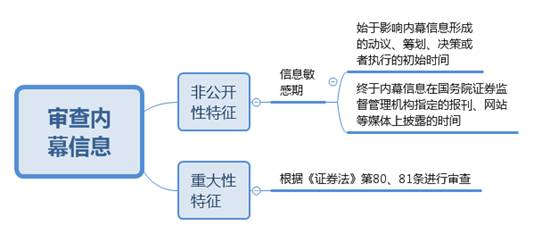
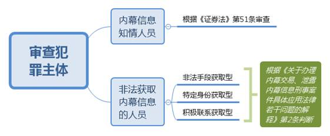
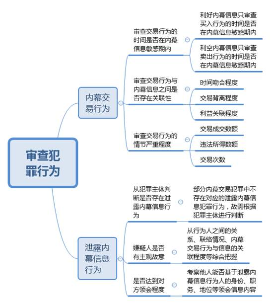
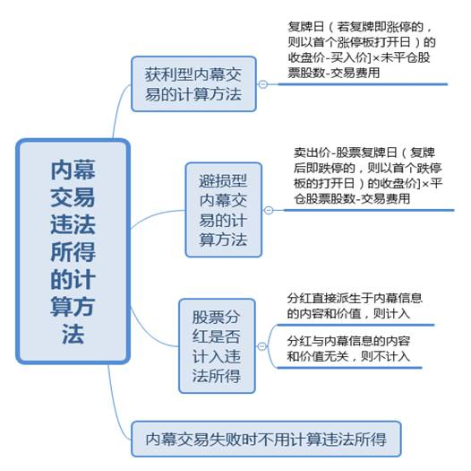

### **证券内幕交易犯罪案件的审理思路和裁判要点**

证券内幕交易犯罪案件单指《刑法》第180条第1至3款所规定的发生在证券市场领域的内幕交易、泄露内幕信息犯罪案件。由于该类案件涉及大量证券专业知识，相关法律规定未臻完善，实践中频发争议问题。为确保审判质量，现以典型案例为基础，对该类案件的审理思路和裁判方法进行梳理总结。

**一、典型案例**

**案例一：涉及内幕信息敏感期的认定**

2013年8月15日，A公司（系上市公司）董事长胡某提出收购B公司的构想，并征求总经理陈某等人意见。陈某当即表示收购有利于公司发展，并负责起草预案。同年9月18日A公司通过了收购预案并开展谈判工作；11月1日A公司和B公司签署收购协议，并于次日对外公告。经查，同年8月16日至11月1日间，陈某陆续买入大量A公司股票。

**案例二：涉及犯罪主体的认定**

黄某系C公司（系上市公司）总经理。李某与杨某分别为黄某的专职司机和保姆，黄某从未向两人透露过自己的工作单位或职务等情况。李某通过长期接送黄某上下班及参加应酬等判断出黄某系C公司的高级管理人员，而杨某对黄某的身份和职务等并不知情。李某和杨某偶然听到黄某打电话时谈及C公司重大资产重组的信息，随后二人在该内幕信息敏感期内分别买入C公司股票。

**案例三：涉及犯罪行为的认定**

汪某系某公司高管，在工作中获知本公司将被D公司（系上市公司）并购的内幕信息，后与其表兄彭某多次电话联系。彭某于某次深夜通话的次日亏本卖出全部股票，全仓买入D公司股票，并用手机向他人发送“D公司股票有封盘可能，建议满盘杀入”的信息。案发后，汪某辩称没有向彭某泄露内幕信息，彭某辩称系根据个人分析从事相关交易。经查，彭某此前从未进行过满仓操作、重仓单只股票或亏本卖出等行为。

**案例四：涉及利益共同体责任的认定**

吴某之妻丁某用夫妻共同财产购买了E公司（系上市公司）股票，吴某对此知情。吴某在获知E公司拟发布业绩预亏公告的内幕信息后，向丁某发送短信“E公司业绩预亏”，丁某随即卖出上述股票，不久后E公司股价大幅下滑。

**二、证券内幕交易犯罪案件的审理难点**

**（一）内幕信息的敏感期界定难**

内幕信息敏感期是内幕信息自形成到公开的时间段，在实践中对该期间的认定存在难点：**一是**内幕信息的形成往往具有过程性、持续性的特点，确定初始时间的难度较大。**二是**内幕信息公开时间的认定是否受非官方指定媒体提前传播的影响存在争议。

**（二）拒不认罪型案件的犯罪行为认定难**

交易行为与内幕信息之间的关联性是认定内幕交易行为的关键。当行为人对内幕信息的泄露、获取和内幕交易等情况均拒不供认时，裁判中需综合各项证据充分论证交易行为与内幕信息的关联性。

**（三）违法所得的计算方法选择难**

相关法律法规对内幕交易违法所得数额计算方法的规定较为笼统，导致司法机关对相关规则的认识不一，做法不尽相同。

**（四）不同内幕交易行为的罪名认定难**

内幕交易犯罪和泄露内幕信息犯罪，在实践中的表现方式复杂多样，既可能构成上下游犯罪，又可能构成共同犯罪，在定罪方面争议较大，适法不统一的情况时有发生。

**三、证券内幕交易犯罪案件审理的一般思路与方法**

**内幕交易、泄露内幕信息犯罪的对象是“内幕信息”。行为人通过对内幕信息的不当泄露、获取、交易等行为，取得了证券市场中的不正当竞争优势，破坏了证券市场的公平秩序，侵害了其他投资者的合法权益**。因此，审理该类案件时，应当紧扣内幕信息这一核心要素，依序展开审理思路：

**（一）审查内幕信息**

我国《证券法》第52条对内幕信息作了明确规定，载明内幕信息具有“非公开性”和“重大性”的双重特征，审查时应予重点把握。

**1****、审查信息是否具有“非公开性”**

内幕信息的“非公开性”表现为信息在敏感期内禁止对外公开。根据两高《关于办理内幕交易、泄露内幕信息刑事案件具体应用法律若干问题的解释》（以下简称为《解释》）第5条的规定，敏感期的起点通常为影响内幕信息形成的动议、筹划、决策或者执行的初始时间，即使此时内幕信息尚不确定，也应认定为在敏感期内。如案例一中，收购项目的内幕信息敏感期起点不是A、B公司签署收购协议或A公司通过收购预案的时间点，而是胡某向陈某征询收购意见之时。在明确表达赞成意见并开始预案起草工作的情况下，陈某能够凭借工作经验和职权便利判断出该项目具有实现可能性，此时正是影响该内幕信息形成的动议、筹划的初始时间。敏感期的结束时间是内幕信息在国务院证券监督管理机构指定的报刊、网站等媒体上披露的时间。现实中，有些内幕信息会被非指定媒体或其他非正式渠道提前泄露，但这并不意味着敏感期提前结束。因为非指定媒体或其他非正式渠道不具有权威性，广大投资者无法据此判断信息的真伪和实现可能性。

**2****、审查信息是否具有“重大性”**

内幕信息的“重大性”特征表现为信息公开后会对交易价格产生重大影响。由于证券市场的价格影响因素众多，最终价格走势及幅度并不必然与内幕信息所蕴含的价值相符。因此“重大性”特征的判断应采用经验标准，即历史同类信息是否一般均对价格有重大影响作用。

法院在审查涉案信息是否属于内幕信息时，符合《证券法》第80、81条所列涉及经营、财务、人事、担保、诉讼等可能对上市公司股票交易价格产生重大影响的事项，可径直认定为内幕信息；不符合列举情形的，可审查是否适用兜底条款认定为内幕信息。

**（二）审查犯罪主体**

本罪主体包括内幕信息的知情人员和非法获取内幕信息的人员，审查主体是否适格可根据具体情形分别处理。

**1****、审查内幕信息的知情人员**

内幕信息知情人员一般是基于职务便利或者其他工作便利有权获取内幕信息的人员，比如具备特定条件的董事、监事、高级管理人员以及相关证券机构的人员等，法院可依据《证券法》第51条的规定审查涉案人员是否属于本罪适格主体。

**2****、审查非法获取内幕信息的人员**

非法获取内幕信息的人员是指原本无权获取但通过非法途径获取内幕信息的人员，《解释》第2条规定了三种情形：

**（****1****）非法手段获取型**。法院应当根据在案证据查明行为人使用了何种手段，例如窃听设备、利益输送证明等。

**（****2****）特定身份获取型**。即内幕信息知情人员的近亲属或者其他与内幕信息知情人员关系密切的人员。近亲属是指内幕信息知情人员的“夫、妻、父、母、子、女、同胞兄弟姐妹”，其他关系密切人员系兜底性条款，应当审查其能否基于密切关系判断出信息真伪和实现可能性。如案例二中，专职司机李某和保姆杨某均与内幕信息知情人员黄某有密切关系，但李某通过黄某的工作单位和职务级别，能够据此判断出黄某谈及的项目内容具有真实性和实现可能性，可以认定其产生了内幕交易的犯罪故意，属于非法获取内幕信息的人员。杨某则对黄某的工作、身份一无所知，抱着“试试看”的心态从事相关交易，因此不具有犯罪故意，不能认定为本罪的适格主体。

**（****3****）积极联系获取型**。即在内幕信息敏感期内，与内幕信息知情人员有过联络、接触的人员。实践中，如行为人拒不供认联络、接触情况，则应重点查明通话记录、信息往来、监控视频等证据，结合交易异常程度等情形进行综合判断。

**（三）审查犯罪行为**

本罪实行行为包括内幕交易行为和泄露内幕信息行为。具体审查时应先确定是否存在内幕交易行为，然后查明是否存在对应的泄露内幕信息行为，具体步骤如下：

**1****、审查内幕交易行为**

审查内幕交易行为，可以遵循以下步骤分别进行：

**（****1****）审查交易行为的时间是否在内幕信息敏感期内**

先根据前述方法判断内幕信息的敏感期，再审查交易时间是否与该期间相吻合。与内幕信息利好利空性质相反的交易行为不符合内幕交易趋利避害的动机，所以对于利好内幕信息只审查买入行为的时间，对于利空内幕信息只审查卖出行为的时间。

**（****2****）审查交易行为与内幕信息之间是否存在关联性**

从司法实践情况看，通常审查以下要点：**一是****时间吻合程度**。如账户变动、资金变化、买卖行为的时间与内幕信息的形成、变化、公开时间基本一致，或者买卖行为的时间与获悉内幕信息的时间基本一致等。吻合方面越多、程度越高，交易行为与内幕信息的关联性越大。**二是****交易背离程度**。通常行为人的交易习惯具有相对稳定性，如风格上偏保守或者偏激进，偏大盘股或偏小盘股等。同时，行为人一般不会做出与股票基本面明显背离的交易行为。如交易行为明显偏离个人交易习惯或股票基本面时，则需要重点审查。**三是****利益关联程度**。表现为账户交易资金进出与内幕信息知情人员或者非法获取人员有关联或者利害关系等。

如果法院综合审查确认存在异常交易的，则需让行为人说明有无正当理由或者信息来源，若不符合《解释》第4条规定的正当性标准，应认定交易行为与内幕信息之间存在关联性。

以案例三为例，彭某交易行为的异常性表现在：其一，时间吻合程度方面，在与汪某电话联系的次日即买入涉案股票；其二，交易背离程度方面，亏本卖出全部股票后全仓买入涉案股票，明显违背其交易习惯；其三，利益关联程度方面，彭某与汪某系表兄弟关系，汪某是涉案股票的内幕信息知情人员；其四，彭某发消息告诉朋友该只股票有封盘可能，明显超出一般投资者的认知水平和预测能力。彭某虽辩称依靠个人分析进行交易，但无法提供证明材料，不具有法定正当理由，据此足以认定彭某的交易行为和汪某所知的内幕信息之间具有关联性，彭某的行为属于内幕交易行为。

**（****3****）审查交易行为的情节严重程度**

刑法对内幕交易行为规定了“情节严重”和“情节特别严重”两档法定刑。《解释》第6条、第7条以“列举+兜底”的方式规定了具体标准，主要审查交易成交数额、违法所得数额和交易次数三项要素。在同一案件中，成交数额和违法所得数额如果分别构成情节严重、情节特别严重的，应按照处罚较重的数额适用情节特别严重的法定刑。

**2****、审查泄露内幕信息行为**

确认内幕交易行为后，再审查有无对应的泄露内幕信息行为，具体可以遵循以下思路：

**（****1****）从犯罪主体判断是否存在泄露内幕信息行为**

部分内幕交易案件中不存在泄露内幕信息行为，如内幕信息知情人员自己从事内幕交易。在非法获取内幕信息的人员从事内幕交易案件中，被告人通过窃取、骗取、套取、窃听等手段获取信息，也不存在对应的泄露内幕信息行为；但是，在通过利诱、刺探或者私下交易等手段或者利用特定身份或通过积极联系获取内幕信息的案件中，均存在对应的泄露内幕信息行为。

**（****2****）审查泄露内幕信息嫌疑人是否具有主观故意**

通过内幕交易行为人的信息来源确定泄露内幕信息嫌疑人，审查其主观是否具有泄露的犯罪故意。对主观故意的判断应当结合在案证据，从行为人之间的关系、联络情况、内幕交易行为与信息的关联程度等综合把握。如案例三中，彭某与汪某具有亲属关系，在内幕信息敏感期内有过联络，异常交易的股票与汪某所在公司存在关联性。因此，即使汪某拒不供认也足以认定其具有泄露内幕信息的故意。

**（****3****）审查泄露的内幕信息是否达到足以使对方领会的程度**

内幕信息的内容包括对象、时间、行为、走势等多种要素，内幕信息的泄露行为并不要求行为人将所有内容和要素完整、详细、直接地表达出来，即使仅泄露部分要素，只要对方可以基于其身份、职务、地位或其他信息等领会信息内容即可。

如某证券监管机构工作人员泄露“某地某行业上市公司要资产重组”的信息，虽然该行为没有直接表达对象要素，但通过简单查询就可发现该地该行业只有一家上市公司，此时的泄露行为即达到足以使对方领会的程度；某证券公司经理泄露“买某某股票”，虽然该行为只表达了对象要素，但隐含了走势要素，不影响对方领会。

**（四）审查违法所得的计算方法**

违法所得是内幕信息的价值反映，表现为行为人通过内幕交易行为的获利数额或避损数额。由于证券市场错综复杂，行情走势受诸多因素影响，故违法所得的计算方法需分情形把握：

**1****、获利型内幕交易违法所得的计算方法**

获利型证券内幕交易已平仓的，如账户内有实际收益则以实际收益认定违法所得。虽然行为人的平仓时间与市场对内幕信息披露后的反应时间不一定同步，实际收益难以准确反映内幕信息价值，但实际收益与内幕信息存在直接关联性，以实际收益认定为违法所得比较直观、便捷，也与公众的一般认知相符。

获利型证券内幕交易未平仓的，以账面收益认定违法所得，计算公式为：\[复牌日（若复牌即涨停的，则以首个涨停板打开日）的收盘价\-买入价\]×未平仓股票股数\-交易费用。选择复牌日是因为证券市场中内幕信息自形成到披露所涉股票都要经过停牌和复牌的过程，在内幕信息披露且股票复牌后，所有投资者拥有了平等的信息地位和决策权利；但如果复牌日即涨停的，则应选择首个涨停板打开日的价格，因为涨停说明内幕信息对市场的影响作用相当巨大且尚在持续，而且投资者受封盘影响被限制了抢筹能力。选择收盘价是因为开盘价不足以反映市场博弈情况；最高价或者最低价是股价波动的极端值；平均价是一种测算价，在首个涨停板打开日会受封盘因素影响计算精度；而收盘价是一个交易日内市场博弈的最终结果，相比其他价格更能准确反映内幕信息对股价的影响程度。

通常认为，交易费用作为一种犯罪成本不应从犯罪数额中扣除，但内幕交易犯罪案件中交易费用是所有证券交易的必缴费用，所占比例很小，在内幕交易行政处罚及实际收益数额认定中一般都予以扣除，在刑事案件中认定账面收益时可参照这一做法。

**2****、避损型内幕交易违法所得的计算方法**

避损型证券内幕交易行为只计算平仓部分的违法所得，未平仓部分不作为内幕交易犯罪处理。违法所得的计算方法可以参考前述获利型证券内幕交易未平仓的账面收益认定方法，公式为：\[卖出价\-股票复牌日（复牌后即跌停的，则以首个跌停板的打开日）的收盘价\]×平仓股票股数\-交易费用。

**3****、股票分红是否计入违法所得**

实践中，内幕交易行为人的利益增值中可能包含股票分红。在其他犯罪领域一般不将股票分红等具有孳息属性的经济利益认定为犯罪数额，但对内幕交易犯罪中涉及的股票分红能否计入违法所得，应分情形讨论：如果该分红直接派生于内幕信息的内容和价值，即行为人是因为股票分红的内幕信息从事交易的，则分红理应计入违法所得；如果该分红与内幕信息的内容和价值无关，则不计入违法所得，而应作为犯罪孳息予以追缴。

**4****、内幕交易失败时不计算违法所得**

内幕交易失败是指行为人的内幕交易行为违背预期，没有成功获利或避损，违法所得为负值。此种情形不必计算具体违法所得数额，在裁判文书中客观表述亏损即可。主要原因如下：**一是**负值的违法所得对确定法定刑档次和罚金数额没有任何意义。在同一案件中，成交数额和违法所得数额如果分别构成情节严重、情节特别严重的，应按照处罚较重的数额定罪量刑。**二是**证券监管机构对于行为人控制多个账户进行内幕交易，其中部分盈利、部分亏损时一般不实行盈亏相抵，而是累计计算盈利数额作为违法所得数额。刑事处罚可参考此种方式。控制多个账户进行内幕交易的行为实质上属于数个犯罪行为，均可单独评价，违法所得亦应分别计算，如果进行盈亏相抵则相当于用亏损的违法行为去抵销、减轻另外一个盈利的违法所得，有违罪刑相适应原则。

**（五）罪名的确定**

刑法规定的内幕交易、泄露内幕信息罪属于选择性罪名，是对行为方式的选择。前者表现为从事与内幕信息有关的交易，后者表现为将内幕信息泄露给他人。现结合行为人的主观故意和客观行为，对实践中常见行为的罪名选择作分别说明。

**1****、向他人泄露内幕信息后又伙同对方内幕交易的，应认定为内幕交易、泄露内幕信息罪，数额不累计计算**

依据选择性罪名的刑法理论，针对同一笔数额分别实施了两种行为的，对两种行为认定为一罪，数额不累计计算。因此，行为人向他人泄露内幕信息后又伙同对方从事内幕交易的，应认定为内幕交易、泄露内幕信息罪，犯罪数额不累计计算。

**2****、自行内幕交易，又向他人泄露内幕信息导致对方内幕交易的，应认定为内幕交易、泄露内幕信息罪，数额累计计算**

依据选择性罪名的刑法理论，针对不同笔犯罪数额分别实施了两种行为的，对两种行为仍认定为一罪，数额累计计算。因此，行为人自行内幕交易，又向他人泄露内幕信息导致他人内幕交易的，应认定为内幕交易、泄露内幕信息罪，犯罪数额为自行交易的数额与泄露内幕信息导致他人交易的数额之和。

**3****、泄露内幕信息行为人对内幕信息被“再传”是否承担刑事责任，应审查其主观罪过形态**

根据刑法主客观相一致原则，泄露内幕信息行为人对内幕信息被“再传”是否承担刑事责任，应当审查其对于“再传”行为的主观态度。如果泄露人明知内幕信息被“再传”而不加以制止的，应当认定其具有再次泄露内幕信息的间接故意，根据导致他人从事内幕交易的具体情况承担相应刑事责任；如果其不明知内幕信息被“再传”或者明知后加以制止的，应当认定其主观上不具有再次泄露内幕信息的故意，不应承担刑事责任。

**4****、仅用内幕信息换取报酬不参与交易的，一般应认定为泄露内幕信息罪**

行为人用内幕信息换取报酬的情形与常见的内幕交易共同犯罪情形具有相似性，表现为行为人均主观追求通过内幕信息获得经济利益。但前者行为人并不关心对方的交易活动，客观上也没有实际参与对方的内幕交易行为，属于罪状表述中的“在对证券交易价格有重大影响的信息尚未公开前，明示他人从事交易活动的行为”，应认定为泄露内幕信息罪。

**5****、利益共同体中泄露内幕信息的一方，应审查其主观罪过形态确定责任**

配偶关系或者其他基于法定、约定形成的利益共同体中各方均有维护共同经济利益的动机，且相互之间具有较高的熟悉度和默契度，有能力掌握对方的交易情况以及判断对方的内心想法。对利益共同体中泄露内幕信息一方如何定罪，应审查其主观罪过。如果利益共同体中泄露信息的行为人主观上确实没有认识对方账户情况的可能性或者要求对方进行内幕交易的意图，则应认定为泄露内幕信息罪。如果行为人主观上明知对方账户情况，并且出于共同财产利益考虑泄露内幕信息的，可推定泄露方具有希望或放任对方从事内幕交易的意志，应认定双方构成内幕交易罪的共同犯罪。

如案例四中，吴某在知道妻子丁某已用夫妻共同财产大量买入E公司股票的情况下，将该公司利空信息泄露给丁某，即使没有明说尽快抛售，吴某也可基于夫妻共同财产的利益考量进行避损交易，因此吴某对丁某的交易行为具有主观故意，应认定为内幕交易罪。

**6****、利用内幕信息优势操纵证券市场的，从一重罪处罚**

行为人利用内幕信息优势操纵证券市场的，可能同时符合内幕交易罪和操纵证券市场罪的构成要件，应从一重罪处罚。需注意的是，如某一案件事实适用两罪的主刑量刑档次相同，则因操纵证券市场罪对罚金并未规定上限，而应认定为操纵证券市场罪。

**（六）刑罚适用问题**

内幕交易、泄露内幕信息罪的刑罚包括自由刑、罚金、追缴违法所得三个方面：

**1****、自由刑**

刑法对本罪规定了“情节严重”和“情节特别严重”两档法定刑。实践中，对同一事实、同一数额的内幕交易行为人和泄露内幕信息行为人之间是否应当区别量刑存在争议。有观点认为应区别量刑，原因在于单纯的泄露内幕信息行为并没有直接侵害证券市场秩序和广大投资者合法权益。我们认为，实践中大多数案件的泄露内幕信息行为是内幕交易行为的主要原因，特别是内幕信息知情人员负有保密义务，理应认识到内幕信息的价值性、诱惑性和泄露的危害性。泄露内幕信息行为的危害性并不比内幕交易行为低，因此对二者的量刑不应明显区别对待，法院应当综合考量自首、退赃、认罪悔罪态度等情节作出判罚。

**2****、罚金刑**

刑法对本罪规定了违法所得一倍到五倍的罚金刑，且可单处罚金。对于内幕交易失败时是否应判处罚金、泄露内幕信息与内幕交易罚金金额的衡平处理问题，在理论和实践中分歧较为突出。

**（****1****）内幕交易失败时是否应当判处罚金**。法律对此并未明确规定，我们认为以判处罚金为宜。理由如下：**一是**最高法院《关于适用财产刑若干问题的规定》对判处罚金的条件和下限作了原则性规定，本罪可参考适用相关规则。**二是**《证券法》第191条对内幕交易失败的情形已规定相应罚款，刑罚的适用应与行政处罚具有衔接性和协调性。**三是**本罪系经济犯罪，应给予行为人一定的经济处罚。罚金数额的确定可参照《证券法》相关规定。

**（****2****）泄露内幕信息与内幕交易罚金金额的衡平处理**。根据《解释》第9条第2款、第10条的规定，内幕交易共同犯罪中对各被告人判处罚金的总额，需在违法所得的一倍到五倍的区间内加以确定，泄露内幕信息人的罚金按照内幕交易人违法所得数额的一倍到五倍来确定。若形而上地依据该规则判决，则会导致行为人单纯泄露内幕信息的罚金刑反而重于行为人既泄露内幕信息又伙同对方共同内幕交易的罚金刑。为避免上述责任倒挂的问题，法院宜对前者处以较低倍数的罚金刑，对后者处以较高倍数的罚金刑。

**3****、追缴违法所得**

犯罪行为人如有内幕交易违法所得或者报酬、分红等非法所得的应予追缴。如果获利型内幕交易尚未平仓的，则应将未平仓的股票全部予以平仓变现后追缴，而不应以判决所认定的账面收益作为追缴的数额标准。

（根据刑庭胡洪春、黄思嘉提供材料整理）