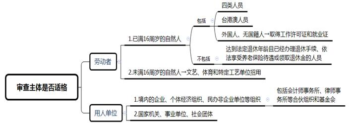
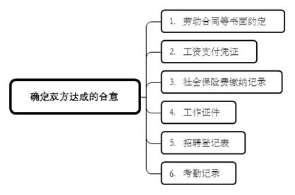
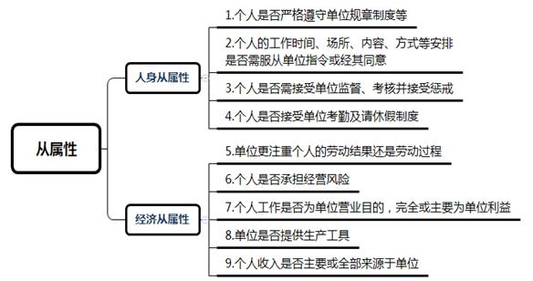
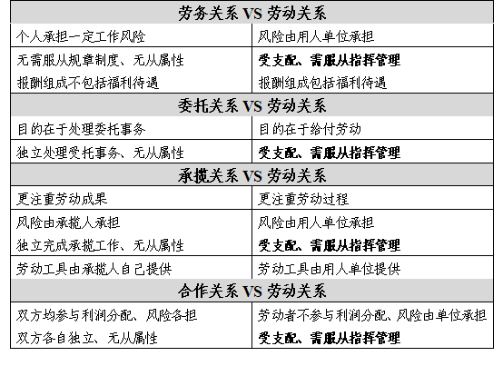

### **确认劳动关系纠纷案件的审理思路和裁判要点**

“劳动关系”是指双方当事人通过合意由劳动者一方提供劳动、用人单位一方给付报酬所形成的具有经济、人身从属性的权利义务关系。作为劳动争议案件的基本类型之一，确认劳动关系是解决未签劳动合同双倍工资、经济补偿金、违法解除劳动合同赔偿金、加班工资等争议的先决条件，关涉劳动者的切身利益，故有必要对该类案件的审理思路、审判经验进行梳理、提炼和总结。

**一、典型案例**

**案例一：涉及双方合意的认定**

赵某为A公司的物业保安，双方前后两次分别签订为期3个月的《临时劳务合同》。合同到期后，赵某继续在该公司任物业保安，但未再签订书面协议。赵某离职后提起劳动仲裁，主张《临时劳务合同》到期之后未签订劳动合同的双倍工资。A公司辩称根据合同约定双方属于劳务雇佣关系，不存在劳动关系。

**案例二：涉及劳动关系与其他民事法律关系的区分**

王某在B公司担任网络主播，双方未签劳动合同。王某主要工作是在B公司指定的互联网平台上进行直播活动，B公司为其提供策划、包装、宣传等。王某在直播活动中获得的打赏与B公司按比例分成。后王某以公司未按规定为其缴纳社保为由申请仲裁，要求确认其担任主播期间与B公司存在劳动关系。B公司则主张双方系合作关系。

**案例三：涉及劳动关系从属性的判断**

李某于C公司从事快递员工作，内容包括快递件的分拣、收货、送货等，双方未签劳动合同。工作场所张贴有C公司的名称及外派员工作规范并设置考勤机。李某的劳动报酬为收件和派件按件计酬，但需扣除李某每月租赁公司交通工具的费用及盒饭费用，如李某工作中发生丢件则C公司对其处以罚款。李某在工作期间受伤后申请劳动仲裁，要求确认与C公司存在劳动关系并要求C公司支付未签劳动合同的双倍工资差额。

**二、确认劳动关系纠纷案件的审理难点**

**（一）当事人双方真实意思表示认定难**

确认劳动关系纠纷往往由用工不规范所导致。此类案件的个人方文化程度普遍不高，建立和维护劳动关系的意识淡薄，保留和固化证据的意识也相对较弱。一些单位出于降低用工成本等因素考量选择规避劳动合同，或以彼合同之名掩盖此法律关系之实，如权利义务约定与合同名称所展现的特征不符、实际履行突破或有悖于合同约定、未签订任何书面合同等。非劳动合同制用工的大量存在使得认定当事人达成的真实合意相当困难。

**（二）劳动关系与其他民事法律关系区分难**

在多数确认劳动关系纠纷案件中，单位方的观点可归纳为下列三类:一是单纯地否认双方之间存在劳动关系；二是主张其并非劳动关系的主体，个人系与第三方建立法律关系；三是抗辩双方之间存在雇佣、委托、承揽或合作等关系而非劳动关系。劳动关系与劳务关系、委托关系、加工承揽关系、合作关系等表现形式相似，都具有提供劳务的特征，且因招聘、管理等单位职能需要由具体人员来代为行使，故劳动关系与其他民事关系极易混淆。

**（三）对于劳动关系从属性特征判断难**

从劳动关系至一般民事法律关系，当事人双方之间的从属性逐渐减弱，个人的独立性逐渐增强，在一般民事法律关系中双方处于平等地位。劳动关系区别于一般民事法律关系的关键即在于从属性特征的判断，包括经济从属及人身从属。

法院确认劳动关系一般参考原劳动和社会保障部2005年《关于确立劳动关系有关事项的通知》所列三项要件，**一是**用人单位和劳动者符合法律、法规规定的主体资格；**二是**用人单位依法制定的各项劳动规章制度适用于劳动者、劳动者受用人单位的劳动管理、从事用人单位安排的有报酬的劳动；**三是**劳动者提供的劳动是用人单位业务的组成部分。后两项要件体现了劳动关系的从属性特征，但对于如何认定劳动关系从属性尚有较大的不确定性。

**三、确认劳动关系纠纷案件的审理思路及裁判方法**

**审理确认劳动关系纠纷案件，法院应当坚持依法保护劳动者合法权益和维护用人单位生存发展权并重的原则，审慎衡量个人与单位双方的利益，注重各方利益的平衡，防止认定劳动关系泛化。**

**（一）审查主体是否适格**

建立劳动关系的主体只能是劳动者和用人单位。法院审理确认劳动关系纠纷案件时首先应当审查双方的主体资格。

**就劳动者而言**，应当为已满16周岁的自然人，但不包括达到法定退休年龄且已经办理退休手续、依法享受养老保险待遇或领取退休金的人员。对于未满16周岁的自然人仅能被文艺、体育和特种工艺单位招用，且需该单位依照国家有关规定、履行审批手续并保障其接受义务教育。企业停薪留职人员、未达到法定退休年龄的内退人员、下岗待岗人员以及企业经营性停产放长假人员与新用人单位发生的用工争议的，若符合劳动关系特征则按劳动关系争议处理。对于外国人及无国籍人，除需持有《外国专家证》并取得《外国专家来华工作许可证》之外，还应依法取得就业证件。而对于台港澳人员，则无需再办理《台港澳人员就业证》。

**就用人单位而言**，应为我国境内的企业、个体经济组织、民办非企业单位等组织，但境外公司、处于筹备阶段等未合法设立的公司、被撤销的公司不在此列。依法成立的会计师事务所、律师事务所等合伙组织和基金会，以及国家机关、事业单位、社会团体也能成为用人单位。

**（二）确定双方达成的合意**

劳动关系的建立需要具备双方当事人的合意。这种合意无需特定的形式要求，但必须要有足够的证据予以证明。请求确认劳动关系的一方应当对双方建立劳动关系的合意承担举证责任。

实践中，当事人一般会提供双方签订的合同、电话录音、短信截屏、邮件往来等予以证明。当存在书面约定时，法院在确定双方合意的过程中：**一是**不能拘泥于合同名称，应着重审查合同中关于权利及义务的约定；**二是**不能囿于合同的书面约定而割裂地将其作为判定依据，要将书面约定与其他证据相结合，将约定内容与实际履行的事实相结合。若实际履行与既存约定相悖，则应注重对劳动力交换的实际状况进行审查，发现双方真实的意思表示；**三是**若当事人主张合同签订时受单位胁迫或合同并非本人所签等，或者认为在缔约时所签订的合同就是劳动合同，法院应审查是否存在缔约时意思表示不自由、意思与表示不一致的情况。若双方当事人均未作此主张，则法院一般不宜主动审查。

如案例一中，赵某与A公司签订了《临时劳务合同》，但结合双方实际履行情况，A公司的考勤制度、作息制度、着装规范等规章制度均适用于赵某，赵某受单位劳动管理，每月依考勤领取相对固定工资，此与双方书面约定相悖。法院根据劳动力交换客观情况认为双方存在建立劳动关系的合意，《临时劳务合同》不足以阻却劳动关系的建立。

在无书面约定的情况下，法院应通过当事人提交的证据材料审查双方当事人的实际履行情况，从而根据经验法则和逻辑推理去推断双方是否存在建立劳动关系的合意。例如工资支付凭证、社会保险费缴纳记录、工作证件、招聘登记表、考勤记录等均可作为合意的重要佐证。

**（三）审查双方实际履行情况**

《劳动合同法》规定用人单位自用工之日起与劳动者建立劳动关系。根据原劳动部及上海高院的意见，用人单位与劳动者应当订立而未订立劳动合同的，只要双方事实上行使了劳动权利、履行了劳动义务，应认定双方存在事实劳动关系。主张确认劳动关系的一方应对存在实际用工承担举证责任，但单位有义务提供由其所掌握的材料如工资支付凭证、社会保险费缴纳记录、考勤记录等。法院应根据证据材料判断是否存在实际用工，若不存在则应排除劳动关系；若存在实际用工，则应审查是否符合劳动关系的交换形式及从属性特征。

**1****、确定实际权利义务内容**

法院应当依据当事人提交的证据材料及陈述梳理双方具体的实际履行内容，通过实际履行内容确定具体的权利义务内容。另外，应注意履行过程中双方权利义务内容是否发生变化。因为劳动力的交换是一个继续性合同关系，故应对用工周期内的劳动力交换、权利义务履行情况进行全面审查，并对履行内容是否变更加以确认，从而对双方是否存在劳动关系及劳动关系的存续期间进行认定。

**2****、比对劳动关系特征**

法院应当比对劳动关系特征进行审查，确定具体的权利义务内容中是否包含劳动关系的交换内容及从属性特征。

**（****1****）是否符合一方提供劳动另一方支付对价的交换形式**

劳动关系的基本特征之一在于劳动力的交换形式，即劳动者提供劳动、用人单位支付对价。法院首先应审查单位是否向个人支付劳动报酬、个人是否向单位提供劳动。若没有证据证明则不足以认定双方关系符合劳动力的交换形式，难以确认劳动关系。此外，劳动关系与劳务关系等一般民事法律关系的区别主要表现在三个方面：一是劳动者享有获得劳动报酬的权利，即便法定节假日中不提供劳动，用人单位仍需支付劳动报酬；二是劳动者享有休息休假、医疗期等，在这些法定情形下用人单位不得强制劳动者提供劳动；三是不可归责于双方当事人的风险由用人单位负担。

**（****2****）是否符合劳动关系从属性特征**

劳动关系的另一基本特征在于其从属性，包括经济从属性及人身从属性。前者主要在于劳动者对用人单位经济上依赖，后者则主要在于用人单位对劳动者的指挥、控制和支配。双方用工关系只有同时满足两项从属性才能构成劳动关系。法院应围绕权利义务内容，以人身从属性为核心，结合人身与经济从属性做出综合判断。具体案件可参考如下标准进行判定，标准契合度越高则越能体现劳动关系的从属性特征。

**第一**，审查单位是否存在《员工手册》等具体化的规章制度、个人是否知晓这些规章制度并需要在日常工作中严格遵守。

**第二**，审查个人对工作安排的自主性，对于工作时间、场所、内容、方式等安排是否由单位指定或者需经其同意，是否需服从单位对工作日、上下班时间的安排等管理行为。

**第三**，审查单位是否对个人实行月/季度/年度考核、绩效考核等，是否根据个人的工作表现及考核结果对其进行相应奖惩。

**第四**，审查个人是否需接受单位的考勤管理（如上下班打卡、钉钉考勤等），考勤结果是否与个人工资报酬有着直接而紧密的关联性，单位是否有相应的请休假制度并对个人产生约束力。

**第五**，审查单位对个人的用工过程是否进行全程的监督、管理、控制。劳动关系注重劳动提供的过程，但其他类似关系如承揽关系则更注重劳务提供的成果，至于如何达成最终成果则在所不问。

**第六**，审查个人的工资报酬是否稳定，是否并不参与单位利润分配。劳动关系中经营风险由用人单位承担，用人单位向劳动者支付的劳动报酬并非参与利润分配的结果，而是用人单位根据自身生产经营特点、经济效益和劳动岗位的不同依法自主决定。

**第七**，审查个人的工作内容是否构成单位业务的组成部分，个人是否对外以单位名义从事相关工作。劳动关系中劳动者提供劳务的行为属于职务行为，其更多地以单位名义对外经营而非以个人名义，而在合作关系中，双方则更多地为己方利益履行相应义务。

**第八**，审查个人劳动的生产工具是否由单位提供，尤其应注意相应劳动所必备的生产工具，如送餐员及快递员所需要的电瓶车和手机、保洁员所需要的清洁工具等，以及服装、工牌等指示性工具。若生产工具均由单位提供，则构成从属性认定的积极因素。

**第九**，审查个人的收入是否主要或全部来源于单位。

**3****、****分析实质性决定因素**

个人主张建立劳动关系的应承担举证责任。法院结合诉辩双方的主张归纳出争议焦点后，应分析构成劳动关系的实质性决定因素，该因素因争点不同而有所区分：

**（****1****）另一方单纯否认的——以劳动关系基本特征为切入点**

 当个人提供存在用工的初步证据后单位否认存在劳动关系的，法院应当着重从劳动力的交换形式及从属性特征两方面综合审查劳动关系的基本特征。当单位未提供反驳证据时，个人提供的证据符合劳动关系基本特征的，则法院应当确认双方存在劳动关系；当单位提供反驳证据的，法院应当综合审查双方证据的证明力大小，通过双方的证据优势判定是否存在劳动关系。

**（****2****）另一方主张并非劳动关系主体的——以用工指向为切入点**

单位主张并非劳动关系的主体，个人系与第三方建立法律关系的，应对其主张承担举证责任。法院应结合实际履行情况重点分析实际用工指向，从劳动力如何交换、交换给谁出发，判断实际用工系指向涉案单位还是指向第三方。应注意个人工作内容是否是单位业务组成部分、个人工资是否由单位以单位名义发放、个人是否受单位管理支配等，并据此明确涉案单位是否系劳务接受主体、工资发放主体、风险承担主体等。必要时还需查明对个人落实管理性事务的人员与单位之间的关系。

**（****3****）另一方主张其他民事法律关系而非劳动关系的——以劳动关系与所称民事法律关系的区分为切入点**

单位主张双方之间存在雇佣、委托、承揽、合作等关系而非劳动关系的，法院应具体分析单位主张的民事法律关系与劳动关系的差异性，并与当事人实际权利义务内容进行比对。如案例二中，王某请求确认双方之间存在劳动关系，而B公司辩称双方系合作关系而非劳动关系。合作关系与劳动关系的区别主要在于两点：**一是**合作关系中经营风险一般各自负担，而劳动关系中经营风险由用人单位负担；**二是**合作关系中双方各自独立、不具有从属性，而劳动关系中劳动者则需服从单位指挥管理。王某主要从网络直播活动中获取收益，该收益与B公司按三七开分配，经营风险各自负担，且王某无需遵守B公司的规章制度，双方之间不符合劳动关系特征。法院据此判定双方之间不存在劳动关系。

区别劳动关系与劳务、委托、承揽或合作关系的关键在于劳动关系独特的从属性，分析实质性决定因素时应以此为重点。个人不接受单位管理、约束、支配，以自己的技能、设施、知识承担经营风险，基本无需听从单位有关工作指令，与单位没有身份隶属关系的，法院不应认定双方之间存在劳动关系。若双方存在建立劳动关系的合意，且实际履行的权利义务内容符合劳动关系特征，则可以确认双方存在劳动关系。

如案例三中，李某主张双方构成劳动关系，而C公司则辩称双方系劳务关系。通过对双方实际履行情况进行分析：一是，在工资报酬方面，李某无固定的薪资及福利待遇，若无取件则无报酬，且系直接在从客户收取的快递费中扣除部分费用，并非由C公司支付全部报酬；二是，劳动工具（运输车辆）系李某租用，并非由C公司提供；三是，C公司更注重李某能否及时将快递送至指定地点，即工作结果而非过程；四是，李某对工作安排、工作路线具有很强自主性（收派件任务按时完成即可）、无需听从C公司调遣；五是，虽然C公司处设有考勤机，但打卡结果与李某报酬没有任何关联，李某有事离开数月也无需请假，可见李某无需遵守C公司的考勤、请假制度；六是，李某收入完全取决于其收派件数，自担经营风险（运输风险、丢件风险等）。综上，二审法院认为从劳动关系的形成过程来看，并不能认定C公司对李某进行管理控制，也不能认定李某对C公司形成了从属性，所以双方不形成劳动关系。

**四、其他需要说明的问题**

**（一）关于确认劳动关系之诉是否受诉讼时效限制**

根据《中华人民共和国劳动争议调解仲裁法》第27条规定，劳动争议案件受1年仲裁时效限制。对于超过1年时效的确认劳动关系之诉，仲裁委员会一般不予受理。但法院在审理此类案件时一般认为不受时效限制。因为确认劳动关系之诉有别于要求用人单位补缴社保之诉等，其本身只是对于一段法律关系的确认，不具有给付内容，不直接涉及实体权利的处分，因此不属于实体法意义上的债权请求权。

**（二）关于涉新型用工及特殊职业的劳动关系确认要点**

**1****、****涉互联网平台用工**

法院审理涉互联网平台用工的确认劳动关系纠纷案件应把握以下原则：**第一**，双方对权利义务的约定能否体现建立劳动关系的合意；**第二**，个人劳动所得是否为该互联网企业正常自主决定的劳动报酬而非参与利润分配的结果，即个人是为该企业营业目的而非为自己营业目的而劳动；**第三**，根据个人是否需要到该互联网企业办公场所上班，对工作场所及工作时间可否自行支配，是否需服从该企业包括考勤制度、用工管理制度等情况来判断双方的法律关系是否具备人身从属性特征。

**2****、涉外卖行业用工**

外卖行业一般存在三种用工模式：商家招聘外卖员专门为其配送外卖订单；由外卖平台管理的外卖员为入驻商家配送；外卖平台与第三方签订协议，由第三方派遣外卖员进行配送。第三种模式中外卖员往往与第三方存在劳动关系，前两种模式则易发生争议。法院应当对以下事实进行审查并做出综合判断：**第一**，外卖员能否获得相对稳定的报酬，审查收入是否因外卖数量计件或提成而造成不稳定；**第二**，配送所需的劳动工具、工作服等是否由商家或平台提供；**第三**，外卖员是否接受商家或平台的日常管理和考核考评；**第四**，外卖的工作地点、时间、服务要求等是否需服从商家或平台的指挥安排，外卖员对此能否自主决定变更。

**3****、涉保险代理人员用工**

法院审理涉保险代理人员确认劳动关系纠纷案件应把握以下原则：**第一**，不宜仅凭保险公司对保险业务员实施了管理和监督即直接认定具有人身上的从属性。法院需要具体审查其管理行为是基于劳动关系从属性特征，还是基于《保险法》及相关规定管理业务员保险代理行为的需要。**第二**，需审查代理人员的收入是否根据销售业绩确定。根据销售业绩确定收入具有不确定性，且由代理人员自行承担业务风险，不符合劳动报酬的特征，难以体现经济从属性。

（根据刘力、钟嫣然提供材料整理）