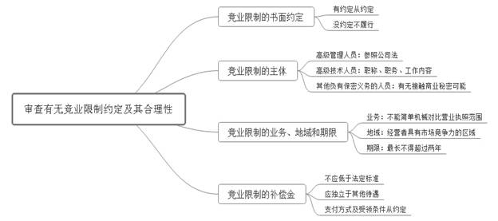
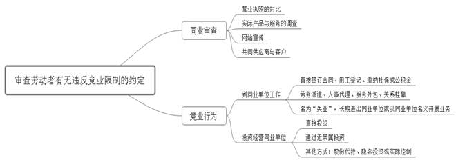
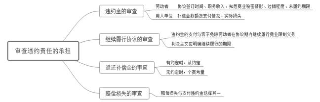
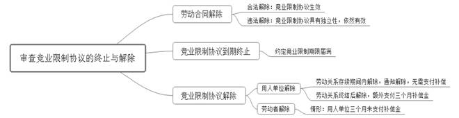

### **竞业限制纠纷案件的审理思路和裁判要点**

竞业限制是指对原用人单位负有保密义务的劳动者，于离职后在约定的期限内，不得生产、自营或为他人生产、经营与原用人单位有竞争关系的同类产品及业务，不得在具有竞争关系的用人单位任职。为提高办案质量与效率、规范自由裁量权，现以典型案件为基础，对该类案件的审理思路和裁判方法进行提炼和归纳。

**一、基本案情**

**案例一：涉及主体与同业的审查**

张某系A公司员工，从事传感器研发工作。双方签订的竞业限制协议约定：竞业限制的行业领域包括但不限于倾角传感器、加速度传感器等，期限为2年。后张某辞职。张某入职A公司前即投资设立B公司，离职后一年内仍为B公司股东，并历任监事、法定代表人、执行董事等职务。A公司及B公司登记的经营范围均未包括生产、销售传感器。A公司主张与B公司均实际生产、销售传感器，认为张某违反竞业限制约定。

**案例二：涉及竞业行为的认定**

郎某与C公司签订竞业限制协议，约定郎某在劳动关系存续期间及劳动关系终止之日起三年内不以直接或间接方式经营或加入同业企业。郎某劳动关系存续期间，其妻作为股东之一投资设立D公司。2009年6月8日郎某从C公司辞职，8月13日郎某任E公司董事。D公司、E公司与C公司均存在竞争关系。

**案例三：涉及违约责任的核定**

罗某与F公司签订竞业限制协议。后劳动关系解除当日双方签订竞业限制的补充协议，约定竞业限制的补偿金标准为罗某离职前上一年度固定薪酬的18%；违约责任为返还已支付的补偿金及支付相当于年补偿金标准四倍的违约金。罗某离职前一年的固定工资为19500元/月。离职三天后，罗某进入同业的G公司工作。F公司以罗某违约为由要求其支付166752元违约金。罗某辩称其未泄露F公司商业秘密且违约金过高。

**二、竞业限制纠纷案件的审理难点**

**（一）主体范围界定难**

《中华人民共和国劳动合同法》（以下简称《劳动合同法》）第24条第1款将竞业限制的人员限定为“用人单位的高级管理人员、高级技术人员和其他负有保密义务的人员”。实践中，对其他负有保密义务人员的认定存在争议：一种观点认为，劳动者对用人单位负有忠实义务，只要双方就竞业限制达成合意，法院无需审查劳动者是否负有保密义务；另一种观点认为，对劳动权的限制应以商业秘密的保护为前提，为防止用人单位滥用其优势地位，法院应对劳动者是否负有保密义务进行审查。

**（二）竞业行为认定难**

劳动者离职后的竞业行为存在多种情形，既包括直接入职或投资同业组织的行为，也包括劳务派遣、关系挂靠、人事代理或股份代持等隐蔽性更强的竞业行为。后几种情形下，劳动者是否存在竞业行为的认定存在较大困难。

对劳动者离职后是否从事与原用人单位“同类产品、同类业务”的认定，因专业性较强，仅凭常识往往难以作出准确判断。实践中对于是否仅对营业执照的经营范围进行比对审查存在争议。

**（三）违约责任核定难**

在认定劳动者应就其竞业行为向用人单位承担违约责任时，关于违约金是否需要调整、如何调整，是否参照《民法典》及《买卖合同司法解释》的规定进行审查判断，补偿金是否返还等问题尚无明文规定。劳动者应承担何种程度的违约责任，也缺乏明确的判断标准。

在双方未约定的情况下，用人单位已支付的补偿金是否可以返还在实践中也存在争议。一种观点认为不应当返还，违约金已经涵盖了劳动者违约行为所应承担的法律责任；另一种观点认为应当返还，补偿金系填平劳动者不履行竞业行为的收入损失，违约劳动者在竞业期间收入未因此受到损失。

**三、竞业限制纠纷案件审理的一般思路和方法**

**竞业限制纠纷案件的审理应注重对用人单位商业秘密和劳动者劳动权的平衡保护，既要规制劳动者的不正当竞争行为，又要防止用人单位的权利滥用。**

**（一）审查有无竞业限制约定及其合理性**

**1****、有无竞业限制约定的审查**

竞业限制义务属于劳动者的约定义务。如果用人单位未与劳动者签订竞业限制协议，或未在劳动合同或者保密协议中与劳动者约定竞业限制条款，则劳动者不负有竞业限制义务。未作约定时法院可向用人单位释明，引导其提起侵犯商业秘密纠纷诉讼主张权益。

**2****、竞业限制适用人员的审查**

如果劳动者未在诉讼中对竞业限制主体适格提出抗辩，则法院对该事项不作审查。如劳动者主张其非适格主体，则法院需对此进行审查：对高级管理人员的认定，可以参考《公司法》的相关规定；对高级技术人员的认定，可以参考劳动者的职称、在用人单位担任的职务以及工作内容进行综合判定；对其他负有保密义务的员工的认定，则可以参考侵犯商业秘密纠纷案件的审理规则进行审查。如劳动者职务属于技术研发、销售、财务等敏感岗位，则可推定其具有接触用人单位技术秘密或经营秘密的便利；如劳动者职务并不涉及敏感岗位，则需用人单位举证证明两个方面：一是本单位具有特定技术或经营秘密；二是劳动者存在接触商业秘密的可能。如案例一中，张某虽属一般职务，但从事研发工作，具有接触A公司技术秘密的便利，故认定其属于竞业限制的适格主体。

**3****、竞业限制业务、地域、期限的审查**

对**竞业限制业务**的审查，应当明确具体。如竞业限制协议中仅约定“本行业或其他行业”“同类产品、业务”“相类似的产品、业务”，法院应要求用人单位进一步明确其主营业务以及竞业限制业务的范围。对**竞业限制地域**的审查，应当以能够与用人单位形成实际竞争关系的地域为限。对**竞业限制期限**的审查，应当以法律规定的两年为上限，超出部分约定无效。

**4****、竞业限制补偿金的审查**

**关于补偿金的标准**，法院应按照当事人之间的约定予以核定。当事人未约定的，按照《最高人民法院关于审理劳动争议案件适用法律若干问题的解释（四）》第6条规定，以劳动者离职前十二个月平均月工资的30%及同期最低工资标准双重标准为下限进行酌定。在核定前十二个月平均工资时，应将劳动者于上述期间所获奖金及固定发放的补贴等收入计算在内。

**关于补偿金的支付方式**，虽然《劳动合同法》第23条第2款仅明确离职后按月给付的方式，但只要能将补偿金与其他待遇显著区分，用人单位可以与劳动者约定在职期间发放等其他给付方式。

**关于补偿金的受领条件**，应按照当事人的约定进行审查。如果当事人未作约定且用人单位未支付补偿金时，由于劳动者所承担的系不从事竞业行为的消极义务，劳动者从事竞业限制行为的举证责任应由用人单位承担。根据审理需要，法院也可酌情要求劳动者提供离职后的就业或失业登记等材料。

****

**（二）审查劳动者有无违反竞业限制****的约定**

**1****、同业的审查**

同业的竞争关系应由用人单位承担举证责任。法院可参考但不应拘泥于营业执照登记内容，还可以通过实际产品与服务的调查、企业官网宣传或其他登记资料、共同供应商或客户的证言来综合考量。如案例一中，虽然A公司与B公司营业执照所记载的经营范围均不含传感器的生产与销售，但是法院通过对在案证据的甄别，确认两公司均实际生产和销售传感器等事实，最终认定两公司存在同业竞争关系。

**2****、竞业的审查**

劳动者直接入职或者投资同业单位的情况可通过用工登记、税费缴费情况（社会保险费、住房公积金、个人所得税等）、公司登记信息等证据查明。对隐蔽性竞业行为的事实认定，法院在分配举证责任时应注意用人单位的取证难度。在用人单位已提供初步证据的情况下，法官宜适时公开心证，要求用人单位进一步举证证明劳动者存在竞业行为的事实，抑或要求劳动者就其存疑行为进行合理解释并提供证据予以证明，继而根据盖然性的标准对法律事实进行综合认定。审理中，法院宜科学衡定当事人与涉案证据的距离远近，妥善处理举证责任与示证义务之间的关系，并灵活运用调查令及依职权调查等审查手段，及时固定证据和正确认定事实。如案例二中，郎某既存在投资同业公司的直接竞业行为，亦存在通过其妻代持同业公司股份的间接竞业行为，法院通过上述审查方法查明了郎某从事竞业行为的事实。

**（三）审查违约责任**

**1****、违约金的审查**

用人单位的商业秘密可能因劳动者的竞业行为遭受侵害进而造成利益损失，违约金则是对可能产生的损失进行填补。如当事人请求调整违约金数额，法官在行使自由裁量权时应在诚实信用原则下充分尊重当事人合意。在劳动者主张违约金畸高的情况下，法官可适当分配举证责任，要求用人单位就违约金约定数额的合理性及特定商业秘密的经济价值进行举证。

实践中，违约金条款的审查及违约金数额的调整可酌情参考以下因素：竞业限制协议签订的时间、劳动者原职务、收入情况、过错程度、未履约期限、补偿金是否支付以及支付的数额、用人单位的实际损失等。法院应当秉持谦抑原则，审慎行使自由裁量权调整约定违约金。如案例三中，法院综合上述各种情形，认为双方约定的违约金标准不属于畸高情形而未作调整。

在竞业限制纠纷中，法官应注意把握补偿金与违约金的独立性。在竞业限制协议有效的情况下，劳动者不因用人单位未支付补偿金而免于承担支付违约金的责任；当事人亦不能仅以补偿金过低为由请求调整违约金数额。

**2****、继续履行协议的审查**

竞业限制保护的是用人单位的商业秘密，但劳动者对已发生的违约行为承担责任并不意味着该法益得到完整、永久的保护。劳动者违约后，仍可能在竞业限制期限内实施新的违约行为，导致用人单位的商业秘密继续存在泄露风险。因此在竞业限制期内，劳动者违反竞业限制约定并承担违约责任后，如用人单位提出要求劳动者继续履行竞业限制协议的诉讼请求，法院应在明确履行期限的情况下依法予以支持。

**3****、返还补偿金的审查**

用人单位常以违反竞业限制协议为由要求劳动者返还已支付的补偿金。如果双方在竞业限制协议中对返还补偿金进行约定，法院应当予以支持；如果双方未作上述约定，法院应以协议明确违约所应承担的责任范围为限综合考量个案情形：劳动者就其竞业行为已经承担了相当数额的违约责任且并未因违约行为而额外获益的，则一般可不支持用人单位要求劳动者返还补偿金的诉讼请求。

**4****、赔偿损失的审查**

依据《劳动合同法》第90条规定，用人单位可因劳动者违反竞业限制义务而要求其承担赔偿责任。一般情形下，损失赔偿与违约金的诉讼请求只能择一主张。对于实际损失的认定，应由用人单位承担举证责任。

**（四）审查竞业限制协议的****终止与解除**

在审判实践中，法院应注意竞业限制协议与劳动合同之间的独立性。劳动合同终止或解除并不影响竞业限制协议的效力。即使用人单位违法解除劳动合同，劳动者也不因此免除竞业限制义务。

竞业限制期满后，相关竞业限制协议自然终止，用人单位免除继续支付补偿金义务，劳动者免除竞业限制义务。

竞业限制协议可依法通过用人单位以及劳动者的要式行为予以解除。在劳动关系终止或解除前，用人单位可通知劳动者免除竞业限制义务，继而无需支付补偿金；在劳动关系终止或解除后，用人单位亦有权单方解除竞业限制协议，但需向劳动者额外支付三个月的补偿金。劳动者在用人单位超过三个月未支付补偿金的情况下也可以单方解除协议。协议解除的，劳动者可向用人单位主张已履行期间的补偿金。但在劳动者行使解除权之前，即便用人单位超过三个月未支付补偿金，劳动者并不当然免除竞业限制义务。

**四、其他需要说明的问题**

劳动者签订竞业限制协议后从事竞业行为会产生侵权责任与违约责任的竞合。用人单位可以选择提起竞业限制纠纷或侵犯商业秘密纠纷诉讼来主张权益。

因竞业限制纠纷系劳动争议项下的二级案由，竞业限制纠纷案件的审理过程中应注意该类案件的审理方法及证明标准与知识产权案件的差别。就用人单位是否客观上具有商业秘密，仅需用人单位提供初步证据予以证明。

（根据王启扬、叶佳提供材料整理）