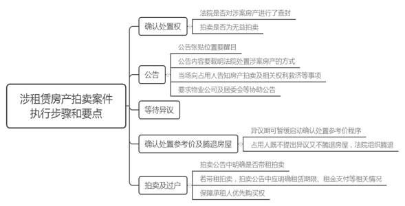
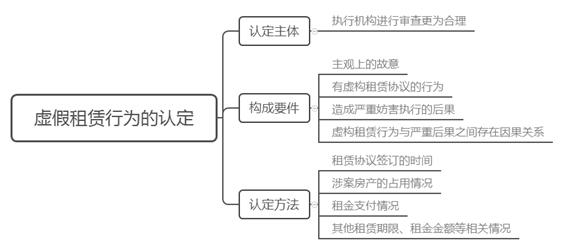

### **涉租赁房产拍卖执行案件的办理思路和执行要点**

房产是执行中的重要财产类型。在涉租赁房产拍卖执行案件中，被执行人与案外人虚构租赁协议、损害申请人权益、阻挠法院执行的情形较为常见。为进一步提升该类执行案件的办理效率和效果，打击虚构租赁协议阻挠执行的行为，保护合法承租人的权益，我们以典型案例为基础对此类执行案件的办理思路和要点作简要梳理总结。

**一、典型案例**

**案例一：租赁权可以对抗申请执行人**

A银行与B公司金融借款合同纠纷案执行过程中，法院拟对被执行人B公司名下涉案房产进行拍卖。案外人C公司向法院提出异议认为其对涉案房产享有租赁权，提供证据证明在涉案房产设定抵押及执行查封之前已与B公司签订租赁协议，并在签订租赁协议后一直占有使用且已支付租金。经审查，法院支持了其异议请求，遂以涉案房产负担租赁权的方式公开拍卖（以下简称“带租拍卖”）。

**案例二：租赁权不能对抗申请执行人**

D银行与E公司金融借款合同纠纷案执行过程中，法院拟对E公司名下设定抵押且被查封的房产进行拍卖。案外人F公司向法院提出异议认为其对该房产享有租赁权，并提供了与E公司在查封前签订的租赁协议、租金交纳等证据。经审查，法院认为该租赁协议系抵押权设立后签订，不能对抗抵押权，故仍决定以涉案房产上无租赁协议方式拍卖（以下简称“无租拍卖”）。

**案例三：不承认租赁权并处罚虚假租赁责任人**

沈某与G公司民间借贷纠纷案执行过程中，法院拟对被执行人G公司名下已查封的涉案房产进行拍卖。案外人孟某向法院提出异议认为其对涉案房产享有租赁权，并提供租赁合同等证明其对该房产的租赁期限为17年且租金已一次性抵债，但并未提供与G公司债权债务关系合法存在的证据。法院认为孟某租赁权明显不成立并要求其腾退房屋。孟某腾退部分房屋后，又将剩余房屋转租给H公司。后法院以孟某虚构租赁协议、严重妨害执行、私自违法转租且未在限定期限内消除违法后果为由，对其采取拘留15日的强制措施，并决定对涉案房产无租拍卖。

**二、涉租赁房产拍卖执行案件的类型及难点**

**（一）涉租赁房产拍卖执行案件的类型**

根据涉案房屋的最终拍卖方式，我们将涉租赁房产拍卖执行案件分为带租拍卖和无租拍卖两类：

**1****、****带租拍卖**

案外人通过案外人执行异议程序主张租赁权并提供相应证据得到法院支持后，申请执行人或其他相关主体未在规定期限内提起执行异议之诉或其提起执行异议之诉案外人仍得到法院支持的，法院应按照相关裁判认可涉案房产的租赁权并裁定带租拍卖。如案例一中，案外人C公司对涉案房产主张的租赁权成立且不存在虚假租赁等情况，故法院将涉案房产进行带租拍卖。

**2****、****无租拍卖**

无租拍卖包括两种情形：一种是待拍卖的房产上纯粹无租赁负担；另一种则如案例二，即案外人通过执行异议程序主张租赁权未得到法院支持，后该案外人或其他相关主体未在规定期限内提起执行异议之诉或其提起执行异议之诉案外人仍未得到法院支持的，法院应将涉案房产进行无租拍卖。另外，法院经审查认为涉案房产上存在明显虚假的租赁协议导致租赁权不成立的，即可对涉案房产进行无租拍卖；案外人或相关主体拒不腾退房屋的，法院可以强制清场并对相关主体进行惩处，如案例三中涉及的情形。

**（二）涉租赁房产拍卖执行案件的办理难点**

**1****、****执行机构能否直接认定虚假租赁行为存在争议**

对于被执行人与案外人串通虚构租赁协议（转租协议）的行为，根据“执裁分离”原则，执行实施权与执行裁判权应当分由不同机构行使。案外人主张租赁权显属执行裁判事项，应由执行裁判机构认定虚假租赁行为，但虚假租赁属于严重妨害执行、逃避法律文书义务的行为，执行机构依法享有处罚的权力。因此执行机构能否为了提高执行效率、实现惩罚的即时性，直接认定虚假租赁行为并对相关主体进行处罚存在争议。

**2****、****认定虚假租赁行为存在一定困难**

一是由于信息不对称等原因，申请执行人难以与被执行人、案外人形成有效对抗并提供其恶意串通的有力证据，相关的证据材料需要法院依职权调取，调查取证过程较为繁琐。二是认定虚假租赁行为需要综合审查协议签订时间、租赁期限、租金支付等情形，存在一定复杂性。

**3****、****房屋腾退工作存在较大难度**

部分案件中房屋占用人既不在执行法院限定的期限内提出异议，也不按照要求腾退房屋，甚至有些案外人执行异议被驳回后仍非法占据涉案房产。根据上海市高院的相关规定，法院应当在拍卖前清除案外人的非法占有或者确保拍卖成交后能够顺利交付买受人，而实现这一目的往往需要强制腾退。因腾退房产常遭致案外人或实际占用人的激烈对抗，法院需要动用较多人力物力。特别是涉案房产在外地时，需要更多的部门协调、人员安排等工作，导致房屋腾退操作困难，严重影响涉案房产拍卖变现。

**三、涉租赁房产拍卖执行案件的办理步骤和要点**

**在此类执行案件的办理过程中，应注意程序的规范性以及对各方当事人利益的平衡**。由于带租拍卖和无租拍卖的执行步骤基本相同，故下文仅在必要时作区分说明。

**（一）确认处置权**

在决定对涉案房产进行拍卖前，法院应先审查对涉案房产是否拥有处置权，主要包括以下几方面：**一是**法院是否对涉案房产进行了查封。若法院的查封系轮候查封且本案申请执行人对涉案房产拥有抵押权等优先受偿权，则法院需按照《最高人民法院关于首先查封法院与优先债权执行法院处分查封财产有关问题的批复》等规定取得处置权后再进行拍卖。**二是**拍卖是否为无益拍卖。若涉案房产上有其他人的抵押权等优先受偿权，经初步估算本案申请执行人无法受偿或者受偿金额过少，法院原则上对该涉案房产不予拍卖。

**（二）公告**

法院在作出拍卖裁定后启动评估前，应在涉案房产现场张贴公告。此环节办理要点为：**一是**公告张贴位置要醒目，以确保相关主体能够知晓法院即将对涉案房产进行处置，并拍下照片或视听资料备查。**二是**公告内容要载明法院处置涉案房产的方式。为了便于后续工作可预先设定为无租拍卖，但应预留不少于十五日的异议期，保障相关人员在合理期限内可以提出异议。**三是**尽量向占用人当场告知涉案房产即将拍卖及相关权利救济等事项，并以制作笔录为宜。若占用人当场主张租赁权但租金未支付的，法院应告知其不得再向被执行人支付租金，应将租金付至法院指定账户，并送达冻结租金裁定书和协助执行通知书。**四是**尽量要求物业公司及居委会等协助公告，查询涉案房产占有、使用等情况并制作笔录。

**（三）等待异议**

由于在公告预留的异议期内存在异议人主张权利的可能，该主张成立与否对涉案房产的估价影响较大，故不宜在异议期内启动确定处置参考价程序。如案例一中，案外人C公司对涉案房产的租赁权主张获法院支持，带租拍卖的评估价值与无租拍卖的评估价值存在较大差异。

**（四）确定处置参考价及腾退房屋**

在异议期满无人异议或异议被驳回后，法院即可启动确定处置参考价程序。该环节应注意以下几点：**一是**如果异议人在法定期限内提起执行异议之诉，法院可暂缓启动确定处置参考价程序。但申请执行人提供适当担保并请求以无租拍卖方式确定处置参考价的，经审查后以无租拍卖的方式启动该程序。**二是**如果涉案房产占用人既不提出异议又不在限定期限内腾退房屋的，法院应组织腾退。具体的腾退方式包括：1、法院按照《上海市高级人民法院关于加强和规范强制腾退类案件执行若干问题的解答》强制腾退。2、要求实际占用人承诺必须配合法院对涉案房产的处置，且在法院拍卖成功后自行腾退或与买受人另行达成租赁协议等。

在异议人主张的租赁权获得法院支持的情况下，若申请执行人在法定期限内提出执行异议之诉且不同意以带租拍卖方式处置涉案房产的，法院应当暂缓启动确定处置参考价程序，待相关诉讼程序终结后再行启动；若申请执行人既不在法定期限内提出执行异议之诉，又不同意以带租拍卖方式评估处置涉案房产的，法院可以决定以带租拍卖方式启动确定处置参考价程序。

**（五）拍卖及过户**

该类执行案件拍卖具体操作与其他类型案件财产拍卖基本相同，需注意以下几点：**一是**在拍卖公告中要明确是否带租拍卖；**二是**若系带租拍卖，拍卖公告中需说明租赁期限、租金支付等相关情况；**三是**需注意依法保障承租人的优先购买权。

实践中由于案外人提出执行异议的程序简单、成本低廉等，虚假租赁行为在执行程序中较为常见，因此有必要对其进行规制。

**（一）认定虚假租赁行为的主体**

根据“执裁分离”原则，由法院执行裁判机构还是执行机构审查认定虚假租赁行为存在一定争议。我们认为由执行机构对该行为进行审查更为合理，理由如下：**一是**根据《民事诉讼法》及《上海市高级人民法院关于在执行程序中审查和处理房屋租赁权有关问题解答（试行）》（以下简称《解答》）规定，法院可以处罚恶意串通逃避法律文书义务的行为，但并未限制法院执行机构认定事实并进行处罚的权利。**二是**执行裁判机构在执行异议程序中一般只是支持或者不支持案外人的异议请求，不会对虚假租赁事实进行认定，故执行异议程序结束后仍无法对虚假租赁行为进行处罚。即使在执行异议程序结束后再对该行为进行处罚，处罚的及时性与效果均会大打折扣。**三是**执行机构对该行为作出认定后，并不影响相关主体的救济权利。

**（二）虚假租赁行为的构成要件与认定方法**

根据《最高人民法院关于人民法院民事执行中查封、扣押、冻结财产的规定》（以下简称《查封规定》）《解答》等相关规定，结合执行工作实际，虚假租赁行为应当具备以下要件：

**一是**主观上的故意，即双方虚构租赁协议具有对抗申请人的故意或者抗拒执行的恶意。**二是**有虚构租赁协议的行为，包括伪造租赁协议、恶意倒签协议签订时间、延长租赁期限等情形。**三是**造成严重妨害执行的后果，包括执行严重迟延、执行司法成本显著上升、严重损害申请执行人利益等。如案例三中，案外人孟某不仅通过执行异议程序迟滞执行，而且会导致申请执行人损失涉案房产近二十年的收益，故法院对其进行严厉处罚。**四是**虚构租赁行为与严重后果之间存在因果关系，但如果有多个行为产生妨害执行的后果，法院应审查各行为对后果的影响力。

具体而言，应从以下几个方面对虚构租赁协议行为进行审查：

**1****、****租赁协议签订的时间**

法院应主要审查协议签订时间与抵押权等优先受偿权的设定时间、法院查封时间等关键时间点的先后顺序。按照《查封规定》，法院查封涉案房产后被执行人在其上设置权利负担的不能对抗申请执行人。因此，法院应重点审查在法院查封以及抵押权等优先受偿权设立之前签订的租赁协议，结合其他证据审查其是否有“倒签”等虚构事实行为。

**2****、****涉案房产的占有情况**

占有是租赁权公示的一般表现形态，因此是否占有涉案房产是认定虚假租赁的重要依据。若案外人能够提供其缴纳物业、水电煤等费用，以及装修协议等证据证明其实际占有涉案房产，则租赁协议的真实性较高。需要特别注意的是，案外人实际占有应在抵押权等优先受偿权设立或者法院查封之前，防止其在抵押或查封后占有涉案房产再“倒签”租赁协议。

**3****、****租金支付情况**

实际支付租金是租赁关系真实存在的重要判断依据。**一是**案外人主张租金已经一次性支付的应当提供支付证明；支付金额超过五万元的应当提供银行转账等第三方凭证。**二是**案外人主张租金抵债的，不仅需证明基础债务关系真实存在，尚需证明该基础债务关系发生在法院向其送达冻结租金裁定和协助执行通知书之前。抵销金额超过五万元的应当提供银行转账等第三方凭证。

**4****、****其他相关情况**

法院需审查的其他相关情况主要包括：**一是**租赁期限，虚假租赁一般租赁期限较长，多为《民法典》规定的最长期限20年或者接近20年；**二是**租金金额，虚假租赁的租金金额大多长期固定不变或者显著过低。

**（三）对虚假租赁行为的惩处**

**1****、惩处依据**

依据《解答》第17条规定，经执行审查、执行异议之诉等确认被执行人与案外人虚构租赁关系对抗执行的，执行法院应当依据《民事诉讼法》第113条规定对相关责任人进行处罚。

**2****、惩处方式**

对于恶意串通、虚构租赁协议的行为，法院可对相关责任人采取罚款、拘留以及移送追究刑事责任等处罚方式。由于案件具体情况不一，法院应当根据个案相关责任人的恶意程度、对执行的妨害程度、被执行人（案外人）的获益程度或者申请执行人的损失程度等综合判断采用何种处罚措施。

**3****、惩处程序**

法院惩处应遵循以下程序：**一是**由执行合议庭参照前述方法审查认定案件事实，并经执行机构专业法官会议等讨论通过，同时注重与执行裁判机构的协调统一；**二是**严格履行审批程序；**三是**对相关责任人追究刑事责任的，应按照刑事法律相关规定处理。

（根据执行局康邓承、琚璐提供材料整理）