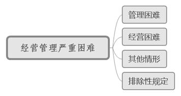

### **公司解散纠纷案件的审理思路和裁判要点**

我国公司股东解散公司请求权的法律规范仅有《公司法》第182条及《最高人民法院关于适用<中华人民共和国公司法\>若干问题的规定（二）》相应条款，且具体裁判标准并不明确，实践中观点亦不统一。我们根据现有法律规范，结合实践中的典型案例总结审判经验，对公司解散纠纷案件的审理思路与裁判要点进行梳理、提炼和总结。

**一、典型案例**

**案例一：涉及“经营管理严重困难”的认定**

A公司股东吴某、徐某合计持股50%，李某持股50%。公司章程规定股东会决议须经代表二分之一以上表决权的股东通过。吴某、徐某与李某之间一直存在矛盾且多次涉讼。由于公司并未亏损，李某曾向法院提起公司解散之诉但被驳回。现吴某、徐某以A公司已连续四年未召开股东会为由，起诉要求解散公司。

**案例二：涉及公司“继续存续会使股东利益受到重大损失”的认定**

B公司股东毛某持股10%、法定代表人邹某持股90%。两股东曾因股权纠纷而涉诉，后B公司经营决策均由邹某一人作出，毛某不参与经营管理也未提请要求召开股东会。现毛某以公司股东会机制失灵、连续两年以上未召开股东会、股东间僵局长期无法解决为由，起诉要求解散公司。

**案例三：涉及“通过其他途径不能解决”的认定**

C公司股东张某持股3.62%，瞿某、彭甲、高某、D公司分别持股7.59%、0.67%、7.43%、80.67%，法定代表人、董事长及总经理均为彭乙。张某除显名持有的股份外，还与彭乙分别隐名持有股份，两人因股权转让问题多次涉讼。现张某以公司连续两年以上无法召开股东会、公司经营管理发生严重困难为由，起诉要求解散公司。

**二、公司解散纠纷案件的审理难点**

由于公司纠纷中股东矛盾的复杂性，司法实践对《公司法》第182条及《公司法司法解释二》关于公司解散“三要件”的理解存在差异，使得该类案件审理存在一定难度。

**（一）“经营管理严重困难”的理解存在差异**

针对“公司经营管理发生严重困难”，司法实践中的审查重点在于判断该“困难”是公司经营困难、管理困难抑或两者兼具；何种程度方能认定为“严重困难”。《公司法司法解释二》第1条以列举的形式对此作进一步细化，在表述中均重申“公司经营管理发生严重困难”的要求，在兜底条款还补充了“公司继续存续会使股东利益受到重大损失”的限定条件。该条文列明的前三种情形均指向管理性困难，对经营性困难未作明确。如案例一中，A公司提供了相关合同来证明其处于正常经营之中，履行合同将会给公司带来收益，一审法院基于审慎原则驳回了解散公司的诉请。二审法院认为公司本身是否处于盈利状态并非判断公司经营管理是否发生严重困难的必要条件，改判公司解散。

**（二）“继续存续会使股东利益受到重大损失”的认定难度大**

由于股东利益损失通常包括权利受损和利益受损两个方面，个案审查中是否要求权利和利益两方面均受损存在争议。同时，由于该要件是对股东利益在将来是否受损的判断，股东提供证据证明该要件成立的难度较大，各法院的裁判尺度也不够统一。如案例二中，邹某控制B公司并排除毛某介入公司经营，一审法院认为两股东无意与对方继续共同经营致使公司人合性完全丧失，继续存续会严重损害毛某股东利益，故判决解散公司。二审法院认为双方的股权比例清晰且不存在结构性障碍。毛某并无证据证明其不担任公司职务、不参与公司经营情形下的公司存续会使毛某利益遭受重大损失，改判公司不解散。

**（三）“通过其他途径不能解决”的适用标准不明**

解散公司是对公司类纠纷最严厉的处理方法。作为“公力救济”的司法解散应当本着“尊重公司自治、司法谨慎干预”的原则对案件进行审查。该类纠纷应首先考虑通过公司自治方式解决矛盾，防止股东滥用诉讼权利终止公司经营。但《公司法》第182条及《公司法司法解释二》对何为“穷尽内部救济”均未作出具体明确的规定。如案例三中，一审法院仅以经法院主持调解双方未达成一致意见为由，认定各股东无法通过其他途径解决公司僵局而判决公司解散。二审法院则认为，虽然各方股东曾就股权转让多次涉讼，但并未就通过股权回购或股权转让退出公司加以沟通协商，尚有可能通过其他途径解决，故改判公司不解散。

**三、公司解散纠纷案件的审理思路与裁判要点**

由于公司解散涉及各股东、公司债权人的合法权益以及公司存续的社会公共利益，法院应最大限度地尊重公司通过自治方式解决公司僵局。由于司法解散公司在结果上的终局性、不可逆转性，**法院应坚持全面审查和严格审查的标准，以谦抑的态度审慎判决解散公司**。审理思路与裁判过程应主要围绕《公司法》第182条及相应司法解释规定的要件进行判断。

**（一）判断诉讼主体是否适格**

**1****、适格原告的确定**

根据法律规定，提起公司解散纠纷案件的原告应当是单独或合计持有公司全部股东表决权百分之十以上的股东。我国法律仅要求股份公司必须“同股同权”，所以有限责任公司股东的表决权并不必然与登记的股权比例一致。尤其在当前注册资本认缴制的情况下，公司可通过章程设计与认缴比例不同的表决权，如约定按实缴比例行使表决权。因此，审查此类纠纷中原告的主体资格，应对登记的股权比例与公司章程一并审查。

由于公司解散之诉的结果涉及公司债权人等第三方利益，隐名股东又缺乏具有公示效力的股权证明，法院原则上应当要求其先提起股东资格确认诉讼，使自己成为显名股东后再向法院提起公司解散诉讼。即便其他股东对该隐名股东身份均不持异议，法院也需审慎处理。如案例三中，D公司曾向张某转让部分股权但未作工商变更登记，工商登记资料仅显示张某持有公司3.62%的股份，法院考虑到隐名股东彭乙对张某的持股比例存在异议，故要求张某通过诉讼途径先行确定持股比例。

**2****、适格被告与第三人的确定**

《公司法司法解释二》第4条规定，股东提起解散公司诉讼应当以公司为被告，公司其他股东可以共同原告或第三人身份参加诉讼，有关利害关系人可作为第三人参加诉讼。原告股东应当告知其他股东参加诉讼，或者由法院通知其他股东参加诉讼。至于其他股东究竟以共同原告还是第三人身份参加诉讼，应视该股东的主张区别处理：其他股东以与原告股东相同主张申请参加诉讼的，应列为共同原告；其他股东以案件处理结果与其有利害关系为由申请参加诉讼的，应列为无独立请求权第三人。

**（二）审查公司经营管理是否发生严重困难**

****

**1****、公司管理发生严重困难**

《公司法司法解释二》第1条列举了公司僵局的三种常见情形，即公司持续两年以上无法召开股东（大）会、公司持续两年以上不能做出有效的股东（大）会决议，以及公司董事长期冲突导致的董事会僵局。在具体认定过程中需要注意四点：**一是**“无法召开”指的是应当召开而不能召开，客观上长期没有召开过会议不能当然认定为“无法召开”；**二是**“两年以上”的时间要求必须是持续的状态，一旦召开了会议或做出过有效决议即发生期间中断，不能再据此认定公司僵局；**三是**董事会僵局应已尝试通过股东（大）会进行解决；**四是**机构运行困境必须进行综合认定，单纯发生三种情形之一并不足以认定为“经营管理发生严重困难”。

**2****、公司经营发生严重困难**

“公司经营管理发生严重困难”的侧重点在于界定公司僵局。公司经营状况可作为认定“经营管理发生严重困难”的重要考量因素，但并非认定的充分条件。公司经营状况与经营管理困难之间的逻辑关系需要审慎判断，公司经营性的严重困难并非短期的经营不善或严重亏损，通常需要考虑公司是否长期处于亏损状态、是否具备扭亏为盈的能力、是否造成股东经济利益的重大损失等情况。

**3****、公司经营管理发生严重困难的其他情形**

《公司法司法解释二》第1条的列举方式基本排除了司法实践对“经营管理发生严重困难”作扩张解释的可能性，即使该条规定的“其他情形”亦应参照前三项列举情形进行比对适用。实践中部分案件对公司管理困难的认定，时常会论及大股东利用表决权优势实质剥夺中小股东的公司经营管理权，即理论界通常所称的“股东压迫”。

然而单纯的“股东压迫”情形并不符合公司解散事由。“股东压迫”情形只有在同时满足“经营管理严重困难”和“公司继续存续会使股东利益受到重大损失”的条件下方才对案件起到补强说理的作用。如案例二中，虽然一审法院认定邹某独占公司经营权，但除了要求全体股东一致通过的表决事项外，即便毛某不配合也不会使公司陷入股东会表决僵局。毛某对公司经营现状不知情并不能证明公司继续存续会对其利益造成重大损失。

**4****、公司经营管理发生严重困难的排除性规定**

根据《公司法司法解释二》第1条第2款规定，股东以知情权、利润分配请求权等权益受损，或公司亏损、资不抵债等为由请求解散公司的，法院不予受理。

判断公司经营管理是否出现严重困难，应当从公司组织机构的运行现状进行综合分析，审查重点在于判断公司组织机构运转是否因存在严重的内部障碍而形成了管理上的僵局，并因此导致公司治理结构的决策、执行、监督等功能瘫痪，严重影响公司经营。

**（三）审查公司继续存续是否会使股东利益受到重大损失**

根据文义解释，“股东利益损失”通常并非指股东利益具体、直接或有形的损害，而是指股东利益整体、间接、可能的损害。这涉及利益受损范围与重大损失的界定两个问题。

**1****、利益受损范围**

由于股东利益可分为公司管理控制权益和投资收益权益两方面并以后者为侧重点，法院应主要从公司经营状况及注册资本是否充实两个角度加以审查。公司形成僵局后即进入非常态经营模式，单方股东的经营管理即便没有使业务停滞，也会因持续亏损而显著削弱公司经营能力与偿债能力。公司注册资本均未足缴的情况下，股东各方因冲突无法继续共同经营公司，预期经营目的则无法实现。需要注意的是，公司的亏损状况并非必然符合股东利益严重受损的条件。进而言之，公司仍在盈利亦不能当然否定股东利益受损的可能性。对于起诉时公司仍处于盈利状态的案件，法院应当结合股东矛盾的激化原因、持续时间以及化解可能性等因素进行综合判断。

**2****、重大损失的界定**

由于“重大”程度并不存在统一的量化标准，实践中通常根据公司当下的经营和管理状态进行综合认定。公司处于停业、亏损状态或被列为经营异常名录的，法院应审查公司是否持续处于停业状态且无力恢复经营、亏损是否在持续扩大且扭亏无望、经营异常的原因是否可以短时间消除等；公司处于盈利状态的，法院应结合股东对公司管理控制权益的受损程度进行综合认定。

**（四）审查通过其他途径不能解决**

“通过其他途径不能解决”的立法本意是促使原告在起诉解散公司之前尽力化解公司矛盾，也是法院判定股东之间矛盾是否已经不可调和的标准之一。“其他途径”一般包括内部途径与外部途径两个方面：**内部途径**，如申请召开股东会、行使知情权、行使质询建议权、协商内部股权转让、请求公司收购股权等；**外部途径**，如请求行业协会或行政部门等第三方进行矛盾调解、股东提起知情权或股东权益受损责任之诉等。

需要注意的是，该要件并不要求原告股东在诉讼前穷尽全部救济途径，否则将因欠缺现实可操作性而在客观上废止公司解散之诉。法院认定原告股东已通过其他多种途径仍不能解决公司僵局状态且符合其他法定要件的，经组织调解无果后应及时依法作出判决。如案例一中，三名股东之间存在历史矛盾且已多次涉讼，股东李某也曾向法院提起解散公司之诉但被驳回，客观上各方股东已充分探寻其他途径来化解公司僵局，据此可认为A公司的股东已经穷尽其他救济途径。

**四、其他需要说明的问题**

**（一）注重调解的审理原则**

本着弱化当事人之间矛盾以达到解决争议的目的，法院组织调解时可通过促成公司收购股份、股东之间转让股份、公司减资等途径使异议股东退出公司以保证公司主体继续存续。

法院调解还需特别注意两种特殊情形下的合法性问题：**一是**股权转让后公司全部股权归于一人时，应当审查公司是否符合一人有限公司的法定条件；**二是**公司股东之外主体有受让股权意向的，应当保障现有股东的优先购买权。此外，《公司法》《证券法》等相关法律对特定类型公司股权转让有着特殊要求，对公司减资及收购本公司股份亦有着严格的限定条件。因此，在当事人达成相应调解合意后，法院应严格审查调解协议的内容防止违反强制性规定。

**（二）第三人利益保护**

解散公司是终结公司的独立法人人格，对公司员工、交易方、债权人、关联公司等利益相关方均有重大影响，公司解散后还会引发公司关系的转变和连锁反应，法院应当结合“第三人利益保护”原则，公正、理性地维护和平衡各方权益，审慎处理此类案件。

（根据商事庭施杨、闫伟伟提供材料整理）