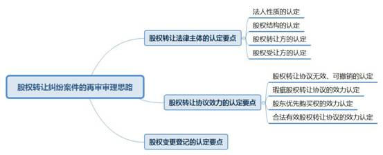

### **股权转让纠纷案件的再审审理思路和裁判要点**

股权转让纠纷是公司法纠纷的主要类型之一。近五年来我院辖区被再审的公司法纠纷案件中，股权转让纠纷案件数量最多。为更好地实现公司法相关制度的立法目的和功能，提升案件审判质量，我们对近五年来被再审的股权转让纠纷案件进行分析梳理，选取问题突出的典型案例，总结此类案件的再审审理思路和裁判要点。

**一、基本案情**

**案例一：涉及标的“股权”定性问题**

龚某与梁某签订《股权转让协议》约定：“梁某将其持有的A民办学校100%股权转让给龚某，股权作价60万元。”后龚某认为梁某不具有转让A民办学校的主体资格，故诉至法院请求判决确认系争《股权转让协议》无效，并判令梁某返还已收到的转让款20万元。经审理，一审法院判决梁某向龚某返还转让款20万元。该案再审发现问题：A民办学校不存在公司法意义上的股东，需判断一审判决使用“股权转让纠纷”案由是否有误。

**案例二：涉及股权代持及复数转让主体的股权转让**

B公司全体股东王某、陈某等7人共同签订《关于B公司股权、债权转让的决议》，约定B公司股权、债权等全部打包转让给王某。陈某为B公司法定代表人，其名下部分股权系替其余6人代持。后部分股东认为王某未按约定足额付款，诉至法院要求王某支付剩余款项。一、二审法院的审理焦点在于系争《决议》是否明确约定了“打包价”即为王某应支付的金额。该案再审发现问题：当事各方的初始出资比例、系争《决议》签订时B公司的实际股权结构、“打包价”是否覆盖王某自己的股权等案件基本事实均未查明。

**案例三：涉及判决超越当事人诉请**

彭某与张某签订《股权转让协议》，约定张某将持有的C公司股权作价10万元转让给彭某。后因协议没有履行，张某欲解除该协议。彭某诉至法院请求确认《股权转让协议》有效。一审法院判决确认系争协议已经解除并驳回彭某诉请。该案再审发现问题：彭某仅诉请法院确认系争协议有效，一审在判决主文中确认系争协议已解除是否超出了彭某的诉请范围。

**二、股权转让纠纷案件的再审审理要点**

通过分析上述案例及其他股权转让纠纷案件被再审的原因及再审结果，对此类案件的再审审理要点总结如下：

**（一）应当正确认定“股权”属性**

基于合同自由原则，当事人在法律允许范围内的“股权转让”协议均应予以尊重。但实践中约定转让的“股权”是否对应公司主体、是否为转让方合法持有、是否存在出资瑕疵等问题，均应作出正确认定。如案例一中，当事人约定转让民办学校的“股权”，但该案中的民办学校系民办非企业单位，属于非营利法人中的社会服务机构。该案件应适用“合同纠纷”案由，适用《民法典》《民办教育促进法》等法律规范。

**（二）应当查明标的公司真实股权结构**

查明公司股权结构的目的在于明确系争股权转让的相关利益主体，也是正确认定股权转让标的及对应价款的基础。如案例二中，原一、二审判决均未查明公司股权结构及转让协议所涉及的股权份额，最终导致案件因认定基本事实不清而发回重审。案件审理过程中，往往还涉及认缴出资和实缴出资、名义出资和实际出资等问题，对此亦应查明并作出正确认定。

**（三）应当避免判决超出当事人诉请范围**

审理股权转让纠纷案件在力求解决纷争的同时应避免判决超出当事人诉请范围。如案例三中，当事人起诉时只请求法院判决系争《股权转让协议》有效，但原审在判决主文中确认系争协议已经解除，显然超出了当事人的诉请范围。

**三、股权转让纠纷案件的再审审理思路**

股权转让是指股东将其对公司所有之股权转移给受让方，由受让方继受取得股权而成为公司新股东的法律行为。**审理此类再审案件应以合同自由和财产转让自由为原则，兼顾限制性法律规定和公司内部约定，妥善保护当事各方合法权益并注意维护公司外部交易安全。**法律适用顺序应以《公司法》及其司法解释为先，在没有规定的情况下，可适用《民法典》及相关司法解释。具体审理思路提示如下：

**（一）股权转让法律主体的认定要点**

审理股权转让纠纷首先应认定标的公司的法人性质，进而明确其股权结构，同时还应注意股权转让方和受让方的特殊主体问题。

**1****、法人性质的认定**

根据现行《民事案件案由规定》，股权转让纠纷属于“与公司有关的纠纷”项下，故对“股权转让”的理解应以《公司法》为准，具体分为出资转让和股份转让，分别对应有限责任公司和股份有限公司。对于有限责任公司、股份有限公司以外的标的实体，不存在真正的“股权转让”。审理时应根据实体的法人性质，例如非营利法人、特别法人甚至非法人组织，具体判断系争转让合同的类型及效力，进而选择正确的民事案由并适用相应法律规范进行审理。此类案件审理一般不参照适用《公司法》相关规定。对于有限责任公司、股份有限公司的股权转让纠纷，应适用《公司法》第三章、第五章第二节及相关司法解释的规定。

**2****、股权结构的认定**

审理时至少应认定三个节点的公司股权结构：（1）公司初始设立时的出资比例；（2）系争股权转让协议签订时的股权比例；（3）原告起诉时的股权比例。视案情需要可能需对认缴出资和实缴出资、名义出资和实际出资等再做细分。认定股权结构原则上应以经工商登记备案的公司章程和股东名册为主要依据，并综合考量当事人提供或依职权调查取得的其他材料，如出资转账记录、股权代持协议、股权转让协议、审计报告等。

**3****、股权转让方的认定**

股权转让方主体是否适格应根据系争股权转让协议签订时的公司股权结构加以认定。审理时应注意以下特殊情形：

（1）股权转让方为公司隐名股东。隐名股东在工商登记材料中可能不具有股东身份或其持股份额低于实际出资。审理中应审查当事人提供的相关股权代持协议，正确认定隐名股东与名义股东之间的法律关系。

（2）股权转让方为公司名义股东。审理重点同样在于认定隐名股东与名义股东之间的合法关系，进而确定股权转让行为是否有效。但在股权已转让给善意第三人的情形下，应参照适用《民法典》善意取得的特别规定。

（3）系争股权转让协议签订时，转让方尚未实际取得全部或部分标的股权。此时转让方对于尚未取得的部分股权并不具备现实的物权，而是基于其他股权转让合同享有嗣后获得股权的期待利益。系争股权转让协议实为以此种期待利益为转让标的。法院审理时，应以审查转让方能否合法取得标的股权为基础，判断系争股权转让协议能否实际履行。

（4）股权转让方为复数主体。如案例二中，系争股权转让协议的转让方包括B公司多名自然人股东。此时应审查系争股权转让协议中包含的复数股权转让关系是否相互独立，即部分股权转让关系的效力或履行问题是否会导致当事各方整体合同目的无法实现。

**4****、股权受让方的认定**

根据股权受让方的法律地位，审理时应注意区分认定：

（1）股权受让方系公司股东。法院应注意审查公司章程对股权转让事宜是否存在限制性约定。

（2）股权受让方系非股东的外部主体。因有限责任公司的人合性，《公司法》对外部出资转让设定限制但并不禁止。法院应注意审查公司章程中的相关限制性约定，并结合股东优先购买权审查审慎认定系争股权转让行为的效力。

（3）股权受让方系公司自身。原则上标的公司自身不能成为适格的股权受让方，但有允许股份回购的6种特殊情形：一是减少公司注册资本；二是与持有本公司股份的其他公司合并；三是将股份用于员工持股计划或者股权激励；四是股东因对股东大会作出的公司合并、分立决议持异议，要求公司收购其股份；五是将股份用于转换上市公司发行的可转换为股票的公司债券；六是上市公司为维护公司价值及股东权益所必需。上述情形下股份有限公司可以成为该公司股权转让的受让方。

（4）股权受让方为复数主体。审理中同样应注意认定系争股权转让协议中包含的复数股权转让关系是否相互独立。

**（二）股权转让协议效力的认定要点**

股权转让协议的合同效力认定是股权转让纠纷案件的常见争议焦点，也是被再审风险较为集中的领域。

**1****、股权转让协议无效、可撤销的认定**

审理中应按照以下思路审查系争股权转让协议是否存在无效或可撤销的情形：（1）当事人主张股权转让协议无效。法院应以当事人主张为限，审查系争股权转让协议是否违反了《民法典》《公司法》等法律规范中的禁止性规定。（2）当事人主张股权转让协议可撤销。法院应以当事人主张为限，审查系争股权转让协议是否存在重大误解、欺诈、胁迫、乘人之危等法定可撤销情形。

审理中应当注意，当事人如果仅请求确认系争股权转让协议无效，则法院应判决确认系争协议无效或驳回诉请，不应超出该诉请对合同履行、变更、解除等事项作出判决。当事人仅请求依法撤销合同或确认协议合法有效的，也应注意避免发生同样的问题。

**2****、瑕疵股权转让协议的效力认定**

对于采用注册资本实缴制的公司，股东可能因出资瑕疵而对公司负有相应责任。转让此类股权会涉及瑕疵股权转让问题。审理中法院应以当事人主张为限，审查转让方作为公司股东是否存在出资瑕疵。具体审查内容包括：（1）转让方是否已依据法律规定及章程约定按时足额将货币出资存入公司银行账户；（2）转让方是否已对非货币出资依法办理财产权转移手续；（3）转让方是否存在后续抽逃出资的行为。

如查明确有出资瑕疵，法院应进一步区分以下情形：（1）转让方对受让方实施了欺诈行为的，则法院应根据受让人诉请判断是否撤销系争股权转让协议。（2）受让方明知股权有出资瑕疵而受让的，则系争股权转让协议的效力一般不会因此受到影响，且受让方取得标的股权后应承担连带瑕疵责任。（3）股权转让双方均不知股权存在瑕疵的，双方如果无法协商一致，则法院应根据受让方诉请，参照《民法典》关于买卖标的物瑕疵担保责任的相关规定，判断转让方是否应承担相应责任。需要注意的是，《公司法》经过2013年修订后，公司注册资本已由实缴制改为认缴制，但实践中仍需注意法律有特别规定或公司章程有特别约定的情形。

**3****、股东优先购买权的效力认定**

股东优先购买权是指股东对外转让股权时，标的公司其他股东享有的以同等条件优先于外部受让方购买该股权的权利。既要注意保护其他股东的优先购买权，也要注意保护股东以外股权受让人的权益，正确认定有限责任公司股东与股东以外股权受让人订立的股权转让合同效力。审理此类问题应注意以下事项：（1）优先购买权的效力。如其他股东主张依法行使优先购买权，则法院应根据股权转让方是否存在继续交易的意愿，认定其他股东成为股权受让方或系争股权转让终止。（2）系争股权转让协议的效力。其他股东是否主张行使优先购买权不影响生效股权转让协议的效力，但法院应区分认定系争股权转让协议的履行状态：对于尚未履行的股权转让协议，当事人主张行使优先购买权会导致协议履行不能的，法院应根据股权转让方或外部受让方的诉请判断是否解除合同；对于已经履行完毕的股权转让协议，如其他股东主张优先购买权符合法定期间规定（即知道或应当知道权利未超过30天，且股权变更登记未超过1年），则法院应对其他股东主张按照同等条件购买该转让股权的诉请予以支持。

**4****、合法有效股权转让协议的效力认定**

排除上述合同效力问题后，法院应审查系争股权转让协议是否合法有效，且合同效力及于三个层面：（1）对于转让人和受让人：股权转让协议达成时即发生效力，受让人可要求公司为其办理过户手续，转让人应当提供协助；（2）对于公司：受让人办理过户手续后取得股东地位，其股份或者出资上一切权利均归于受让股东享有和行使，标的公司须对新的股东负责；（3）对于第三人：股权转让经合法变更登记后即具有对抗第三人的公示效力。一般情况下标的公司并非股权转让关系的当事人，但标的公司在系争股权转让协议的履行过程中，对股权受让方负有办理过户手续等义务。审理时法院应根据受让方诉请，正确认定标的公司的诉讼地位，进而判断标的公司是否应承担相应责任。

**（三）股权变更登记的认定要点**

股权变更登记指在公司登记机关（即市场监督管理部门）对股权变动的登记。股权变更登记与股权转让协议的效力一般没有直接联系，但其作为股权变动对外公示的重要环节直接影响当事各方利益。此外，未向公司登记机关办理股权变更登记的，不得对抗善意相对人。法院应根据不同情形区分认定：（1）纠纷涉及外部第三人的，一般以对外公示的股权登记为准，相关问题可参照物权法善意取得制度处理；（2）纠纷涉及公司内部主体的，应根据当事人主张审查系争股权转让协议、股权代持协议、转让款收条收据等内部材料综合判断。

**四、其他需要说明的问题**

由于再审案件往往经年历久，案件发生时、案件再审时所适用的法律，常与现行法律规范存在差异，司法实践中应对此格外加以注意。股权转让纠纷案件再审审理思路的总结，对于商事审判庭审理一、二审案件也具有识错、辨错、防错的提示作用，可结合相关法律最新修改情况及商事条线的审判执法意见加以实践应用。

（根据审监庭赵卫平、张弘毅提供材料整理）