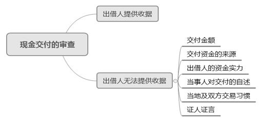
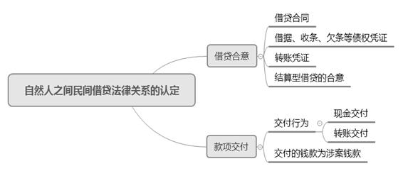

### **自然人之间民间借贷案件的审理思路和裁判要点**

近年来，民间借贷随着我国经济社会的不断发展日趋活跃，由此产生的纠纷也日益增多。审判实践中需正确厘清借贷当事人之间的法律关系，并妥善处理相关纠纷。

**一、典型案例**

**案例一：涉及结算型民间借贷和现金交付的认定**

2009年6月25日，刘某向彭某出具130万元《借条》一份，约定最后还款日为2010年6月25日，并于当日完成现金交付。有证人李某证明，彭某做借款生意、家中现金充足，并且李某是现金交付的在场见证人。2009年12月1日至2010年6月1日期间，刘某向彭某转账共计60万元。2010年7月5日，刘某向彭某出具《还款承诺书》，载明刘某应于2011年7月5日前归还彭某借款101万元。2011年7月15日，彭某起诉刘某要求其归还借款101万元。刘某抗辩，其已经归还彭某60万元，剩余欠款应为70万元。

**案例二：涉及仅有转账凭证的民间借贷案件的处理**

李甲的银行交易明细记载：2014年4月4日，由周某汇入80万元；2014年4月8日，汇出78万元至李乙（李甲女儿），资金用途为“家用”。除此之外，上述期间李甲的上述账号无其他资金往来。周某起诉李甲要求归还80万元借款及利息。李甲抗辩与周某之间不存在借贷合意，80万元系周某委托李甲理财的款项。

**案例三：涉及仅有借据等债权凭证案件的处理**

2016年6月2日，杨某向朱某出具《借条》，载明：“因家人看病就医，今向朱某借到人民币10万元。最后还款日期为2017年12月20日。”2018年1月9日，朱某起诉杨某要求其归还借款10万元及2016年6月2日起至实际清偿之日止的利息。杨某抗辩并未收到朱某10万元，双方不存在借贷关系。

**二、自然人之间民间借贷案件的审理难点**

自然人之间借贷合同的成立与生效包括两个要素：**一是**出借人和借款人形成了借贷合意，即以书面或口头等形式表现出的民间借贷合同，证明双方就借贷事项达成一致意见；**二是**出借人支付了款项，完成了出借款项的义务。这两个要素须同时具备，缺一不可，但实践中的要素审查存在以下难点。

**（一）出借人和借款人的举证责任与证明标准有待明确**

民间借贷纠纷案件中，出借人和借款人之间往往存在借据、收据、欠条、银行转账记录、微信聊天记录等涉案凭证，法官需要依据当事人的举证及质证情况来形成内心确信，对是否存在借贷法律关系作出判断。《最高人民法院关于审理民间借贷案件适用法律若干问题的规定》（以下简称《民间借贷司法解释》）第16条和第17条对当事人举证责任的分配作了原则性规定，但仍未臻明确，如被告“抗辩”的性质以及当事人相应的举证责任等未予明确规定，实践中存在不少争议。

**（二）结算型民间借贷的认定和处理存在争议**

实践中存在由其他非借贷法律关系通过结算形成的借贷关系，以及由原借贷关系通过结算形成的新借贷关系。法院对这两类结算型民间借贷关系的处理也存在诸多争议，例如当事人结算合意如何认定、多次结算形成的协议中利率超过法定上限时如何处理等均存在分歧。

**（三）现金交付的判断标准亟待统一**

尽管以银行卡、第三方支付平台为代表的非现金支付方式迅速普及，但是受交易习惯及借贷需求的影响，现金交付在民间借贷中仍有较大比重。司法实践中经常出现缺失现金交付直接证据的情形，对案件审查造成不少困难，因此需进一步明确对现金交付的审查范围和标准。

**三、自然人之间民间借贷案件审理的一般思路与方法**

实践中，自然人之间的民间借贷案件存在当事人诉请不明确的情形，比如原告只要求被告返还钱款，而未说明具体的请求权依据，此时应由法官向原告释明后由其加以明确。在当事人明确借贷的诉请后，法官应按如下步骤进行审理。

**（一）借贷合意的认定**

借贷合意的认定是处理民间借贷纠纷案件的逻辑起点，合意是否存在直接关乎民间借贷法律关系是否成立。在民间借贷案件的审理过程中，往往一方主张返还借款，而另一方抗辩双方不存在借贷法律关系。借贷合意是否存在可以根据以下几种情况分别处理：

    **1****、当事人之间存在正式的书面借贷合同**

借贷行为是双方法律行为，通常以借贷合同作为外在表现形式。如果当事人之间签订了书面借贷合同，则可据此认定当事人之间达成借贷合意。惟需审慎处理当事人外在意思表示与本意不相符的案件。**一是**当事人一方虚假意思表示的案件。当事人一方虽然与相对方签订了借贷合同，但因其并不存在建立借贷关系的内心本意，此时除非相对人明知对方并无建立借贷关系的合意，否则借贷合同原则上仍然有效。**二是**当事人双方隐藏真实意思的案件。当事人虽然形式上签订了借贷合同，但双方实为买卖合同关系或其他法律关系，此时法官应依据合同条款具体判定双方实际的法律关系。当事人之间通谋虚假的借贷合意无效，涉及虚假意思表示的行为效力依照有关法律规定处理。

**2****、当事人之间仅存在相关债权凭证**

实践中，自然人之间的民间借贷双方多具有亲属关系或同事、同乡等社会关系，在借贷形式上较为简单和随意。出借人依据借据等债权凭证提起民间借贷诉讼的，如果借款人对借贷关系予以否认并以其他法律关系进行抗辩或反诉的，借款人对此应提供相应证据。法官审查后确认双方不存在借贷合意，且双方亦不属于通过调解、和解或清算达成债权债务协议的情形时，法官应向原告释明变更诉讼请求。如果原告拒绝变更的，法院应驳回原告诉请。

如果借款人抗辩已经偿还借款的，则需要对“还款”该项积极事实提供证据加以证明，且需达到高度盖然性标准。借款人提供证据证明其主张后，出借人仍应就借贷关系的存续承担举证责任。

依据《民间借贷司法解释》第16条第2款规定，借款人抗辩借贷行为尚未实际发生的应作出合理说明，且对该说明承担相应的举证责任。如案例三中，杨某抗辩未收到朱某的10万元是对双方存在借贷事实的否认。该案中，杨某指出依据习惯，当事人会在书写借条三日内通过银行转账方式交付钱款，但其银行账户在这段时间内并无相应的资金进入。朱某提供的银行流水显示其与杨某之间存在多笔钱款往来，与涉案借条最近的一次发生在借条出具10日前，且与涉案金额存在较大差距。最终，法院依据当事人的陈述及在案证据材料综合判定双方不存在借贷法律关系。

    **3****、当事人之间仅存在转账凭证**

如果出借人仅提供转账凭证证明钱款交付事实，但无法证明双方存在借贷合意，且借款人抗辩相关转账系偿还双方之前借款或其他债务时，应适用《民间借贷司法解释》第17条的规定，通过以下三个步骤进行审理：

**首先，**出借人提交相关转账凭证证明钱款交付事实，对借贷合意进行初步举证。转账凭证可以推定当事人之间存在借贷合意，因此当事人提供相关转账凭证后即完成了对借贷合意的初步举证。

**其次，**在出借人提交转账凭证后，借款人抗辩转账是偿还之前借款或其他债务的，应对此承担举证责任。出借人提供的转账凭证仅能推定双方存在借贷合意，该推定可以被其他有效证据推翻。借款人的举证是针对转账凭证的推定效力，借款人的“抗辩”在性质上属于“否认”，只需动摇法官对出借人所主张事实达成的内心确信即可。因此，在借款人的举证使出借人关于借贷关系或者借贷合意存在的主张陷入“真伪不明”的状态后，举证责任又转换至出借人一方。

如案例二中，李甲对其抗辩的80万元系委托理财而非借贷的主张承担举证责任。李甲可以提供书面委托协议、理财相关的账户信息或者微信、短信等聊天记录来证明双方存在委托理财关系，但是该案中李甲无法提供相关证据，法官结合本案其他证据最终认定双方存在借贷关系。

**最后，**借款人提供相应证据证明其主张后，出借人仍应就借贷关系的成立承担举证责任。根据《民间借贷司法解释》第17条规定，出借人需要承担初步举证责任以及借款人抗辩后的进一步举证证明借贷关系存在的责任。在转账凭证的推定效力被推翻后，出借人需进一步补强证明双方之间存在借贷合意。如果出借人进一步举证后，仍无法证明借贷合意存在的，由出借人承担不利的诉讼后果。

**4****、结算型民间借贷的借贷合意认定**

结算型民间借贷可以分为两类：**一是**由原民间借贷关系通过结算形成新的借贷关系。如案例一中，刘某向彭某出具《还款承诺书》是对双方之前130万元借条的结算，之后双方重新成立了101万元的借贷关系。**二是**由其他法律关系转化为新的借贷关系，如当事人因合伙关系终止进行结算后由受让人向退伙人出具借条，受让人与退伙人因此形成借贷关系，买卖合同结算后付款方出具借款协议形成借贷关系等。

前述两类结算型民间借贷法律关系中，当事人之间新达成的协议即表明双方形成新的借贷合意，当事人之间由原来的法律关系转化为民间借贷法律关系。

**（二）款项交付的查明**

自然人之间的借贷合同是实践性合同，交付是合同的生效要件。在民间借贷纠纷案件中，借款是否交付通常成为案件的争议焦点。交付的具体审查方式如下：

**1****、交付行为的审查**

交付行为通常表现为转账交付和现金交付。在认定转账交付时，只要存在借贷双方的转账凭证即可认定当事人之间已经完成交付行为。在认定现金交付时，需要根据出借人是否提供收据等书面凭证分别处理。如果出借人提供了借款人出具的收据，一般可据此推定出借人已履行交付义务，但借款人提出其他足以引起合理怀疑的抗辩理由及证据时，例如提出该收据系伪造或受欺诈、胁迫而签订的，法官应对交付事实做进一步审查。如果出借人无法提供收据的，需依据《民间借贷司法解释》第16条第2款的规定，从以下几方面进行审查：

**第一，审查交付金额**。小额借款的出借人往往都具有支付借款的能力。若出借人主张系现金交付且能够按照交易习惯提供借据的，在没有相反证据的情况下一般可认定交付钱款事实存在。若大额借款的出借人主张现金交付的，则需审查出借人自身的经济实力、亲疏关系、款项来源、取款经过、交易习惯、相关书证、证人证言等综合判断当事人的主张能否成立。如案例一中，借款本金130万元属于大额借款，彭某称该笔借款是在其家中的现金交付，法官需对具体交付事实进一步审查。

**第二，审查交付资金来源**。一般而言出借人的资金可通过三种途径获取，即银行取现、向他人筹集以及存于住所。

**第三，审查出借人的资金实力**。资金实力是查证交付事实的关键因素，可以综合出借人的家庭背景、工作情况及收入状况等综合判断。如案例一中，彭某的银行账户常有大额资金流动，结合其家庭背景及工作情况，不难推断其具有出借130万元现金的资金实力。

**第四，审查当事人对交付的自述**。法官可以询问当事人关于交付的具体时间、地点、在场人、场景以及详细的交付方式等细节问题。虚假陈述的当事人很难在数次庭审、谈话中不留下破绽，通过对细节的纠问更易查明交付事实。

**第五，审查当地及双方交易习惯**。在以现金交付为主的地域，大额借款采取现金交付具有合理性。此外，如果当事人之间的交易习惯显示双方在多次借贷中均以现金方式交付，大额现金交付亦具有合理性。

**第六，审查证人证言**。注重审查证人证言之间以及证人与当事人的利害关系，综合证人到庭情况、案件其他事实和证据对证人证言的证明力进行判断。如案例一中，彭某申请作为朋友的证人李某到庭作证，证实彭某做借贷生意故家中有大量现金，并陈述了彭某将130万现金交付给刘某的整个过程。结合其他在案证据，李某的证言具有较高的可信度，法院予以采纳。

**2****、交付的钱款是否为涉案钱款**

审查交付的钱款是否为涉案钱款，即审查交付的钱款与所审查案件的关联性。一般而言，出借人具有交付行为的证明即可认定借款事实存在，如果借款人抗辩交付钱款与本案借贷关系无关，借款人应当对该主张承担举证责任。如案例二中，李甲主张80万元款项系周某委托其进行投资理财的钱款但并未提供相关证据证明，在案银行流水等证据显示系争80万元借款打入李甲账户4天后，李甲以家用之名将78万元转入其女儿账户，结合其他证人证言以及周某的催款短信记录，法院最终认定系争80万元为本案借贷关系中的借款。

**（三）利息审理的要点**

在认定双方存在借贷合意和交付事实后，尚需审慎处理利息问题。

**1****、未约定利息或约定利息不明的处理**

依据《民法典》第680条、《民间借贷司法解释》第25条的规定，自然人之间的借贷没有约定利息的视为不支付利息；自然人之间的借贷利息约定不明，出借人主张支付借期内利息的，法院不予支持。

**2****、利率的认定和处理**

2020年8月20日公布施行的《民间借贷司法解释》第26条大幅降低了民间借贷利率的司法保护上限，其以中国人民银行授权全国银行间同业拆借中心每月20日发布的一年期贷款市场报价利率的4倍为标准确定司法保护的上限，取代了原司法解释中以24%和36%为基准的“两线三区”的规定，符合我国当前经济社会发展的客观需要。此外，为贯彻《民法典》新增的关于“禁止高利放贷”的规定，避免当事人对利率上限的规避，在计算是否超过司法保护上限时，应将利息、违约金以及服务费、咨询费等其他费用一并计算，其总额不得超过合同成立时一年期贷款市场报价利率的4倍。再者，新修订的《民间借贷司法解释》删去了原司法解释第26条第2款、第31条有关自然债务的规定；因此，利息超过一年期贷款市场报价利率4倍的，即便借款人自愿支付，借款人亦有权对超过部分以不当得利要求出借人返还。

**3****、****“****砍头息****”****的处理**

“砍头息”是指出借人在向借款人支付本金时预先扣除的利息。依《民法典》第670条、《民间借贷司法解释》第27条的规定，预先在本金中扣除利息的应将实际出借的金额认定为本金，并以此为据返还借款及计算利息。

**（四）虚假诉讼和****“****套路贷****”****的识别**

虚假诉讼，是指行为人为谋取不正当利益或加害他人，虚构法律关系或捏造法律事实，给相对人造成损害的违法行为。《民间借贷司法解释》第19条通过列举加一般规定的方式列出10种存疑情形需重点审查，法官应结合借贷发生的原因、时间、地点、款项来源、交付方式、款项流向以及借贷双方的关系、经济状况等事实综合判断是否属于虚假诉讼。

“套路贷”是以民间借贷为名行非法占有他人财产之实的违法行为。在“套路贷”情形中，出借人往往主动要求与借款人签订借贷合同制造借贷假象，通过收取“保证金”签订“空白合同”“阴阳合同”等虚增债务，并制造虚假银行流水，营造出借人已支付所有借款款项的假象，为其日后通过诉讼主张权益做好证据固定。

虚假诉讼和“套路贷”不仅严重侵害当事人的合法权益，也扰乱了金融秩序，影响了社会的和谐稳定。法官在审理民间借贷纠纷案件中发现类似情形应主动审查，尤其在一方提出虚假诉讼或“套路贷”抗辩时，法院更应重点审查并依法处理。审理中发现案件涉嫌“套路贷”犯罪的，法院应当严格按照法律规定移送公安机关处理，不能作为普通的民事案件审理。

**四、其他需要说明的问题**

自然人之间民间借贷纠纷案件的审理主要包含对借贷合意、款项交付和利息的审查，其中审理的重点和难点在于事实的认定，法官需要判断当事人之间是否存在借贷法律关系。自然人之间民间借贷法律关系的认定可归纳为如下思维导图：

（根据唐春雷、王晓翔提供材料整理）