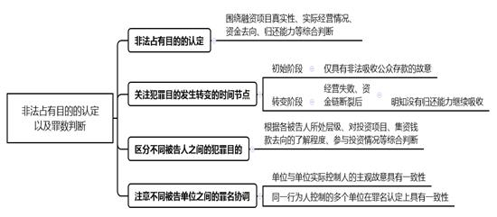
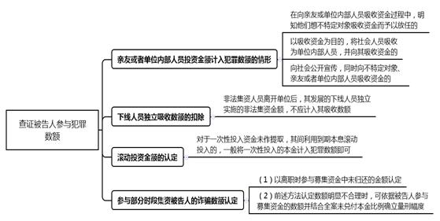

### **非法集资类案件的审理思路和裁判要点**

近年来，非法集资类案件持续高发，严重扰乱了金融管理秩序，侵害了人民群众的合法财产权益，影响社会稳定。此类案件审理过程中，各种新情况、新问题不断出现，法律、政策界限不易把握。为依法惩治非法集资犯罪、提高办案质量与效率、最大限度追赃挽损、促进适法统一，我们以典型案件为基础，对该类案件的审理思路、审判经验进行梳理、提炼和总结。

一、基本案情

**案例一：涉及违法性认识、非法占有目的等判断**

2013年7月起，被告人马某成立了由A集团实际控制、管理，以B公司为销售端的系列企业，通过销售各类理财产品的方式非法集资。2013年9月至2015年12月，B公司及其下属公司推出众多盈利能力不能保障或明显虚假的“投资”项目，包装成理财产品对外发售，共招揽7万余名投资人，募集资金144亿余元。集资钱款中，用于兑付投资人到期本息、办公费用及薪酬支出近110亿元，用于项目支出仅20余亿元，其余用于个人挥霍等。集资过程中，陈某、单某、胡某、徐某、汤某、李某、刘某负责各级层面的销售工作，张某、曾某负责财务工作，高甲、高乙负责项目引进及理财产品包装工作。至案发，尚有6万余名被害人未兑付本金共计64亿余元。公诉机关指控马某、A集团构成集资诈骗罪，B公司与其余被告人构成非法吸收公众存款罪。

**案例二：涉及“长险短做”业务行政违法性的判断**

2010年至2013年间，C公司先后与多家保险公司签订保险代理协议，代理销售20年期人寿保险为主的长期保险产品。之后，C公司多支销售团队以推销上述保险产品为名，将长期寿险产品拆分成1-3年期理财产品（即“长险短做”），吸引社会公众认购。被告人程某在担任销售团队负责人期间，向300余名投资人销售上述理财产品共计9700余万元。公诉机关指控程某构成非法吸收公众存款罪。

**案例三：涉及社会公众的认定**

2010年底，被告人芦某、刘某与马某、邱某、陈某商定，以D公司作为融资平台，由马某、邱某、陈某具体负责对外融资。2011年4月至2012年6月间，D公司制作虚假宣传资料，约定支付投资者3%至6%的高额月息，由马某、邱某、陈某直接招揽或分别通过刘某、李某、陈某、江某等层层招募投资人，共集资5.3亿余元，其中用于项目投资仅0.7亿余元，共造成1200余名投资人损失3亿余元。公诉机关指控各名被告人分别构成集资诈骗罪、非法吸收公众存款罪。

**案例四：涉及非法集资过程中的犯意转化及罪数判断**

2012年9月，E公司实际控制人赵某指使张某成立E公司上海分公司用于融资。2013年2月至2015年8月，E公司上海分公司以对外售卖理财产品的方式吸收资金2亿元。2015年9月，张某明知E公司已无力支付投资人本息并明确不再为分公司提供资金用于偿付的情况下，仍诱骗80余人参与投资，并将投资款用于归还已到期的借款本息及支付员工工资等；至案发时尚有本金2300余万元未兑付。公诉机关指控张某作为公司其他直接责任人员，其行为先后构成非法吸收公众存款罪、集资诈骗罪，应两罪并罚。

**案例五：涉及被告人离职后非法吸收数额的认定**

2014年初，被告人张某等人以F公司团队负责人的身份，招揽业务员，并通过宣介会等方式向投资人介绍公司多个投资项目，后签订借款合同，并承诺保本付息。2015年1月，张某从公司离职；同年6月案发。从张某离职到案发，其招揽的下线业务员在其离职后仍吸收资金100余万元，公诉机关指控张某的犯罪数额包括此金额。

二、非法集资类案件审理的整体要求与基本原则

目前，非法集资类案件呈集中爆发的态势，今后一段时间此类案件的占比仍会增加。法院审理过程中，应当充分认识到非法集资类案件审理的复杂性与重要性，并遵循以下原则与要求：

**（一）实现常态审理，加强沟通协调**

对非法集资类案件的审理应从整体上把握以下四点：**（****1****）实现常态审理，坚持司法公开**。要以常态化审理为基调，节约使用司法资源；以公开审判为原则，实现庭审公开、判决文书公开、涉案财物处置公开，力求最佳司法效果，展示法院良好形象。**（****2****）认真耐心沟通，注重释明疏导**。要正确对待被害人、集资参与人的合理诉求与关切，统一接访答复口径，耐心细致地做好解释工作，以换取被害人、集资参与人对法院工作的理解，避免人为形成对立。**（****3****）仔细研判案情，强化文书说理**。针对审理过程中存在的事实认定、法律适用等方面的争议，应当认真研判，判决文书要全面回应争议问题，敢于说理、善于说理，展现法院依法公开、公正裁判的决心与信心。**（****4****）加强沟通协调，形成工作合力**。对于分别在不同法院审理的同一系列非法集资案件，不同法院之间要加强沟通协调，确保法律适用统一与量刑均衡。法院还应加强与其他办案机关、党政相关部门的协调配合，并做好涉案财物的处置工作。

**（二）注重区别对待，突出打击重点**

涉众型非法集资案件中，参与集资的被告人往往较多。对此，需要查明各被告人所处层级、岗位职责，并综合考虑被告人参与犯罪数额、个人违法所得、主观过错等事实、情节，在定罪量刑时予以区别对待、突出打击重点，做到罚当其罪。对于非法集资活动中的组织、策划、指挥者、主要实施者和主要获利者，应当重点打击，从严惩处；对于前述人员以外的被告人，虽然参与犯罪数额巨大或者特别巨大，但到案后积极退缴违法所得，尽力弥补本人行为所造成财产损失的，可依法从轻、减轻或者免除处罚。

**（三）强化追赃挽损，着力化解矛盾**

非法集资类案件中违法所得的追缴、退赔工作是处理该类案件的重中之重，关乎每一个投资者的切身利益，处理不当就会引发群访事件，形成社会不稳定因素。因此，最大限度追赃减损是办理非法集资案件的重要目标，也是预防不稳定因素的关键所在。审理过程中，法院应当强化追赃挽损意识，将此项工作放在与定罪量刑同等重要的位置，做好涉案财物的续封、续冻工作，重视涉案财物去向线索的搜集固定，做好继续追缴、退赔工作，在打击犯罪的同时充分保障集资参与人及被害人的合法利益。

三、非法集资类案件审理的一般思路和方法

**（一）做好续封、续冻以及继续追缴、退赔工作**

非法集资类案件通常涉案财物众多，查封、扣押、冻结工作非常繁重，需要法院与其他办案机关特别是侦查机关积极协作，做好续封、续冻与继续追缴、退赔工作，夯实案件审理的基础。

**1****、做好续封、续冻工作**

案件在法院立案后，涉案财物的查封、扣押、冻结工作一般即移交至法院。非法集资类案件查扣任务繁重，侦查机关对查扣情况较为熟悉，故法院受理该类案件后应立即与侦查机关沟通，详细了解查扣财物的种类、数量、特征、权属情况、查封与冻结的起止时间等，要求侦查机关继续配合做好审理阶段涉案财物的续封、续冻工作；如果侦查机关无法继续该项工作，则由合议庭出具裁定文书交由法院保全部门做好续封、续冻工作，防止因案件流转中的疏漏导致涉案财物脱封、脱冻。

如案例一中，侦查机关查扣、冻结了大量银行账户、支付宝账户、房产、土地、股权等，审理前期法院与侦查机关协调做好续封、续冻工作，审理后期移送法院保全部门做好该项工作，较好地保证了案件的顺利审理和追赃挽损。

**2****、及时处理特殊财物**

对于查封、扣押、冻结的易贬值及保管、养护成本较高的涉案财物，可以在审理结束前依照有关规定及时变卖、拍卖。非法集资类案件中，需要提前处理的通常为查扣的汽车等交通工具。

**3****、做好继续追缴、退赔工作**

对于审理过程中发现的财产线索，法院可出具查封、冻结裁定并予移送保全。同时，法院应就退赔工作与被告人及其家属、辩护人积极沟通，明确被告人不仅应当对个人违法所得承担退赔责任，而且对其参与集资所造成的被害人损失也负有退赔义务；告知退赔会对量刑产生影响、积极退赔会对量刑产生明显影响。

**（二）罪与非罪的界定**

确定各被告人的行为是否构成犯罪是非法集资类案件审理的重点，主要涉及以下三个方面：

**1****、行政违法性的判断**

非法集资犯罪作为法定犯，首先应当受到行政法、经济法、金融法等部门法的规制，本身具有“二次违法性”。而实践中，相关行政主管部门较少对集资行为的行政违法性作出前置认定。对非法集资行为违法性的判断，可以区分情况分别处理：**（****1****）依职权直接认定**。对于法律规定较为明确、行为性质并无明显争议的非法集资活动，办案机关可以依职权直接认定行为是否构成犯罪。这也是实践中最常见的情形。**（****2****）行政主管部门出具认定意见**。对于案情复杂、性质认定疑难及新类型案件，一般应要求行政主管部门出具涉案行为行政违法性的认定意见。主要是指行政主管部门出具的认定函、批复、情况说明等书面意见，也包括侦查人员根据行政主管部门口头答复制作的详细工作记录。行政主管部门对同类型集资行为作出行政处罚的材料，可以作为集资活动行政违法性判断的辅助性证据。

如案例二中，针对辩护人提出“长险短做”业务是否行政违法的问题，原中国保监会上海监管局出具情况说明，明确“长险短做”业务违法。

**2****、违法性认识的判断**

在确定集资行为违法后，需要判断被告人对非法集资行为是否具有违法性认识。认定被告人对非法集资行为具有违法性认识，并不以明知法律的禁止性规定为要件，满足下列情形之一的，一般即可予以认定：（1）明知公司虚构经营业务或者故意夸大宣传的；（2）明知集资参与人返利过高，或者招揽业务提成比例过高，不符合一般市场行情的；（3）本人或任职单位曾因从事非法集资活动被查处的；（4）曾在金融机构工作，具有一定金融专业知识的；（5）故意规避法律以逃避监管的；等等。

如案例一中，针对被告人曾某所提出的主观上不具有违法性认识，其行为不构成犯罪的辩护意见，法院认为，曾某长期担任A集团财务人员且在后期担任财务总监，明知公司宣传情况与实际经营情况并不一致、刻意夸大公司兑付能力等，故应依法认定曾某具有违法性认识，构成非法集资共犯。

**3****、社会公众的判断**

禁止非法集资的重要目的在于保护公众投资者的利益，故社会性是非法集资的本质特征。根据相关规定，在向亲友或者单位内部人员吸收资金过程中，明知亲友或者单位内部人员向不特定对象吸收资金而予以放任的，应当认定为向社会公众吸收资金。

如案例三中，被告人江某提出了其未向不特定对象吸收资金的辩解。法院在审理中查明江某在向其亲友吸收资金的过程中，明知亲友向其他不特定人员发布D公司的相关信息、吸收资金而予以放任，并从中收取相应佣金，应当依法认定江某系向社会公众吸收资金，构成非法吸收公众存款罪。

**（三）非法占有目的的认定以及罪数判断**

确认被告人的行为构成非法集资犯罪后，应当根据被告人主观上是否具有非法占有目的，分别认定构成非法吸收公众存款罪或集资诈骗罪。

**1****、非法占有目的的认定**

认定被告人是否具有非法占有目的，应当坚持主客观相统一的原则，既要避免以欺骗方法的认定替代非法占有目的的认定，又要避免单纯根据损失结果客观归罪，同时也不能仅凭被告人自己的供述，而应当根据案件具体情况加以分析。实践中，应当重点围绕融资项目的真实性、实际经营情况、资金去向、归还能力等事实进行综合判断。被告人具有以下情形之一的，一般可以认定具有非法占有目的：（1）大部分资金未用于生产经营活动，或名义上投入生产经营但又通过各种方式抽逃、转移资金的；（2）资金使用成本过高，不具有支付全部本息的现实可能性的；（3）资金使用决策极度不负责任，造成资金缺口较大的；（4）归还本息主要通过借新还旧来实现的；（5）其他依照有关司法解释可以认定为非法占有目的的情形。

如案例一中，被告人马某否认其主观上具有非法占有目的。法院经审理认为，马某的行为符合集资诈骗罪的构成要件，具有非法占有目的，主要理由是：（1）马某作为A集团、B公司的实际控制人，在非法集资过程中使用了欺骗方法；（2）从投资项目情况看，马某仅将所谓投资项目作为对外宣传、吸收资金的手段，未考虑项目本身的真实回报；（3）从资金去向看，用于生产经营活动的资金与筹集资金规模明显不成比例，大部分资金用于兑付投资人本息、办公费用与员工薪酬支出、个人使用及挥霍等；（4）归还本息主要通过借新还旧方式来实现。

**2****、关注犯罪目的发生转变的时间节点**

被告人在初始阶段仅具有非法吸收公众存款的故意，但在发生经营失败、资金链断裂等问题后，明知没有归还能力仍然继续吸收公众存款的，应当区分前后两个阶段分别认定非法吸收公众存款罪与集资诈骗罪，两罪并罚。

如案例四中，被告人张某作为E公司上海分公司负责人，除参与前期集资外，在2015年9月明知E公司已无力支付投资人本息并明确不再为分公司提供资金偿付时，仍诱骗投资人参与投资，尚有本金2300余万元未兑付，足以认定张某的犯意在2015年9月已发生转化，故对其以非法吸收公众存款罪、集资诈骗罪两罪并罚是妥当的。

**3****、区分不同被告人之间的犯罪目的**

在共同犯罪或单位犯罪中，各被告人由于所处的层级、职责分工、获取收益方式、参与公司投资情况以及对全部犯罪事实的知情程度存有差异，其犯罪目的也存在不同。对此，应当根据各被告人的实际情况分别认定，其中应重点审查各被告人所处的层级与职责情况。

如案例一中，公诉机关指控除马某外的其余十一名被告人均构成非法吸收公众存款罪。审理过程中，法院综合考虑该十一名被告人在公司所处层级和具体任职岗位，是否参与虚假项目的引进、包装，对公司经营情况及资金去向的了解程度，在公司投资情况等因素，认定单某等四名被告人具有非法占有目的，故改变指控的非法吸收公众存款罪名，认定该四名被告人的行为构成集资诈骗罪。具体理由是：**（****1****）从各名被告人所处层级看**，四名被告人曾分别担任B公司法定代表人、首席执行官、A集团投行部负责人等职，在被告单位中层级高，参与被告单位的决策、管理；**（****2****）从对投资项目的了解程度看**，四名被告人或者对相关投资项目没有收益、收益本身难以覆盖投资本息有概括认识，知道公司发展模式不具有可持续性，或者直接参与投资项目引进，明知针对项目所做尽职调查缺乏实质内容，盈利能力无法保障，甚至参与引进虚假项目；**（****3****）从对集资钱款去向的了解程度看**，四名被告人知道公司通过借新还旧方式归还投资人本息；**（****4****）从参与投资情况看**，四名被告人本人或其近亲属在被告单位并不存在参与巨额投资且未归还的情形。

值得注意的是，应注意区别总公司与分（子）公司人员的犯罪目的。一般而言，因分（子）公司人员对融资项目情况、公司经营情况、钱款实际去向等均不太清楚，故即使总公司实际控制人与直接负责的主管人员认定为集资诈骗罪，分（子）公司的负责人一般认定为非法吸收公众存款罪。但是，在总公司实际控制人被认定构成非法吸收公众存款罪的情况下，如果有证据证明分（子）公司负责人存在犯意上的转化，则对分（子）公司人员在犯意转化后实施的集资行为仍可认定构成集资诈骗罪，该情形并不属于同案异判。

如案例四中，虽然E公司实际控制人赵某仅认定构成非法吸收公众存款罪，但张某作为E公司上海分公司负责人，其犯意于2015年9月已发生转化，故对张某之后的行为以集资诈骗罪论处，对其两罪并罚。

**4****、注意不同被告单位之间的罪名协调**

非法集资犯罪往往所涉单位数量众多、层级复杂，应当全面查清涉案单位中上级单位和下属单位的主体资格、层级、关系、地位、作用、资金流向等，区分情况依法作出处理。同时，应注意不同被告单位之间罪名认定的协调性。如案例一中，公诉机关指控A集团、B公司分别构成集资诈骗、非法吸收公众存款罪。法院经审理认为，对两家被告单位分别定罪并不妥当，故改定A集团与B公司均构成集资诈骗罪。主要理由是：**（****1****）单位与单位实际控制人的主观故意具有一致性**。被告单位的主观故意应依据单位实际控制人及其他直接负责的主管人员的主观故意加以认定，罪名认定上也应保持一致。该案认定B公司实际控制人马某，其他主要负责人员单某等主观上均具有非法占有目的，构成集资诈骗罪，B公司的主观故意及罪名认定应与前述人员保持一致。**（****2****）同一行为人控制的多个单位在罪名认定上具有逻辑性。**鉴于A集团与B公司均由马某直接控制，在认定马某、A集团均构成集资诈骗罪的情况下，认定B公司构成非法吸收公众存款罪存在逻辑冲突。

需要指出的是，鉴于该案改变部分被告单位、被告人的指控罪名，且系由轻罪名非法吸收公众存款罪改为重罪名集资诈骗罪，为充分保障相关被告单位与被告人的合法诉讼权利，本案再次开庭，听取了控辩双方的相关意见。

**（四）区分单位犯罪与自然人犯罪**

基本确定行为性质后，还应界定全案属单位犯罪还是自然人犯罪。根据相关规范性文件的规定，单位实施非法集资犯罪活动，全部或者大部分违法所得归单位所有的，应当认定为单位犯罪。个人为进行非法集资犯罪活动而设立的单位实施犯罪的，或者单位设立后，以实施非法集资犯罪活动为主要活动的，不以单位犯罪论处，单位中组织、策划、实施非法集资犯罪活动的人员应当以自然人犯罪依法追究刑事责任。

判断单位是否以实施非法集资犯罪活动为主要活动，应当根据单位实施非法集资的次数、频度、持续时间、资金规模、资金流向、投入人力物力情况、单位进行正当经营的状况以及犯罪活动的影响、后果等因素综合认定。

**（五）查证被告人参与犯罪数额**

犯罪数额的认定是准确界定各被告人刑事责任的重要依据，需要结合被告人参与犯罪的时间、所任职位与所涉具体项目等方面综合判断。

**1****、亲友或者单位内部人员投资金额的认定**

非法吸收或者变相吸收公众存款构成犯罪的，具有下列情形之一的，向亲友或者单位内部人员吸收的资金应当计入犯罪数额：（1）在向亲友或者单位内部人员吸收资金的过程中，明知他们向不特定对象吸收资金而予以放任的；（2）以吸收资金为目的，将社会人员吸收为单位内部人员，并向其吸收资金的；（3）向社会公开宣传，同时向不特定对象、亲友或者单位内部人员吸收资金的。

需要注意的是，对于以被告人妻子、丈夫或未成年子女名义投入的资金，一般应从吸收数额中扣除，因为前述投入钱款通常为家庭共有财产或被告人以家庭成员名义投入。如果被告人先向亲友、单位内部人员吸收资金，之后再向其他不特定对象吸收资金的，鉴于被告人前一阶段吸收资金的行为尚难认定具有社会性，在认定吸收数额时一般应予扣除。

**2****、下线人员独立吸收数额的扣除**

非法集资人员离开单位后，其发展的下线人员独立实施的非法集资金额，不应计入其吸收数额。如案例五中，在案证据证明张某2015年1月从公司离职后，其之前招揽的业务员仍继续吸收资金100余万元。对于该100余万元，张某既不知情，也未提取任何报酬，系下线业务员独立实施，故应从张某的吸收数额中予以扣除。

**3****、滚动投资金额的认定**

非法吸收或者变相吸收公众存款的数额，以行为人所吸收的资金全额计算。对于一次性投入资金未作提取，其间利用到期本息滚动投入的，一般将一次性投入的本金计入犯罪数额即可。

**4****、参与部分时段集资被告人的诈骗数额认定**

通常情况下，集资诈骗数额应以案发时未实际兑付的本金数额计算。对于仅参与部分时段集资的被告人，如果以案发时被告人所募集资金中未归还的金额认定诈骗数额，则可能存在部分被告人因所募集资金已通过借新还旧的方式全部归还，无法认定其诈骗数额的情形。但相关被告人的行为与全案造成的损失具有因果关系，单纯以案发时未实际兑付的本金来认定部分时段参与型集资人的犯罪数额并不妥当。从整体上看，各被告人所募集资金中未归还的数额，只能体现不同时段被害人损失之间转移填补后的损失金额；各被告人参与非法集资的时间存在先后长短之分，通过借新还旧，前期参与犯罪的被告人所募集资金可能已全部或大部分归还，而后期参与犯罪的被告人所募集资金可能未归还或大部分未归还。

因此，对于仅参与部分时段集资的被告人，可通过以下方法认定诈骗数额：（1）以被告人离职时参与募集资金中未归还的金额认定诈骗数额。被告人离职时参与募集资金中未归还的金额，一般能够较为准确地反映出其行为的社会危害性与造成的损失。（2）如果以前述方法认定的诈骗数额明显偏低甚至归零时，为了对行为人的行为作出充分合理的评价，可依据被告人参与募集资金的数额并结合全案未兑付本金比例确立其法定量刑幅度。

如案例一中，除马某作为被告单位的实际控制人，按照案发时全案未兑付的本金数额认定集资诈骗数额外，对于改认定集资诈骗罪的单某等四名被告人，由于依据案发时未兑付金额认定各行为人的犯罪数额存在不合理之处，故未认定具体诈骗数额，而是依据四人参与募集资金的数额并结合全案未兑付本金比例，依法认定为集资诈骗数额特别巨大，适用十年以上有期徒刑或无期徒刑的法定刑幅度。

**（六）厘清主从犯、自首等法定情节及追缴、退赔等酌定情节**

通过前述步骤，已经可以对指控犯罪事实进行基本的法律评判。在此基础上，还需要结合其他一些法定、酌定情节，来确定各被告单位、被告人的刑罚，主要涉及主从犯、自首、立功、坦白等法定情节及追缴、退赔等酌定情节的认定。

**1****、主从犯的认定**

对于实施非法集资的个人和单位，应依法区分主从犯：（1）对于多人参与、分工实施的非法集资犯罪，原则上应当区分主从犯。非法集资犯罪活动的组织、策划、指挥者，主要实施者及主要获利者，应当认定为主犯；对于接受他人安排、指使而实施非法集资行为的次要实行者，或仅提供后台支持行为的帮助者，或受利益驱动帮助非法集资而从中收取代理费、佣金等费用的“集资中间人”，可依法认定为从犯。（2）单位犯罪中，直接负责的主管人员与其他直接责任人员的地位、作用存在明显差别的，可以区分主从犯。（3）对于多个单位共同实施的非法集资犯罪，应当根据各自在共同犯罪中的地位、作用，决定是否区分主从犯。主犯单位内部人员的地位、作用确有差别的，仍可区分主从犯；从犯单位的内部人员，应一律认定为从犯。

如案例一中，对于认定构成集资诈骗罪的马某等五名被告人，根据他们在单位中的不同层级、在犯罪活动中发挥的具体作用等因素，认定马某等四人为集资诈骗主犯，高甲为从犯。对于认定构成非法吸收公众存款罪的张某等七名被告人，均系被告单位的高层、中层管理人员，且积极主动地参与了非法吸收公众存款活动，故未区分主从犯。

**2****、自首等法定情节的认定**

在自首、立功、坦白等法定情节的认定上，应重点审查侦查机关出具的能反映全案侦破情况及各被告人到案的时间、地点和过程的“案发经过。同时，因侦查机关出具的案发与到案经过的表述有时较为简单，被告人的实际到案情况并不完整、全面，故需要结合被告人的供述、证人证言等进一步查明，必要时向侦查人员核实具体情况。

非法集资类案件中，被告人的到案情形往往较为复杂，能否认定自首应区分情况对待：（1）被告人被抓获前，明知公安机关会前来处置仍在特定地点等候的，可视为自动投案，到案后能如实供述犯罪事实的，可认定构成自首。如案例一中，案发经过反映徐某、曾某系在公司办公地点被抓获，公诉人、被告人、辩护人均未提出构成自首的问题。经法院审理查明，徐某、曾某在被抓获之前，已明知侦查人员会来公司带走管理人员调查，但仍在公司等候，应当视为自动到案，且到案后如实供述了犯罪事实，可认定具有自首情节。（2）公安机关抓获被告人后，责令被告人随传随到、听候处置，未采取其他强制措施的。鉴于此系针对非法集资犯罪的特殊情况而对被告人采取的一种管控方式，不再存在被告人自动投案的空间，故不能认定构成自首。（3）被告人因非法集资行为自动到案配合调查后被取保候审，在取保候审期间继续从事非法集资活动后又自动投案、如实供述犯罪事实的，整体上仍符合自首的成立要件，可认定构成自首。如案例一中，张某的到案过程属于上述情形，故认定其具有自首情节，但对其从宽处罚的幅度予以从严把握。

**3****、注意区分追缴、退赔对量刑的不同影响**

实践中，应当区分办案机关追缴赃款、赃物与被告人及其亲友主动退赔对量刑的不同影响，特别是在量刑时要充分考虑各被告人的主动退赔阶段及数额等情节。其中，对于在提起公诉前积极退赃退赔，减少损害结果发生的被告人，可以从轻或者减轻处罚；在提起公诉后退赃退赔的被告人，可以作为量刑情节酌情考虑；对于积极筹措大额资金退赃的被告人，可以大幅从宽处罚。如案例一中，汤某个人违法所得17万余元，但审理过程中汤某在家属配合下退赔480万元，且提供第三人名下的股权及账户等财产线索供查封、冻结，故对其大幅从宽处罚。

      （根据刑二庭李长坤、张亚男提供材料整理）